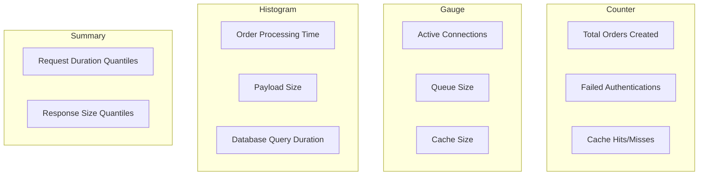

# How to Implement Custom Metrics for gRPC Services

Author: [nawazdhandala](https://www.github.com/nawazdhandala)

Tags: gRPC, Metrics, Prometheus, Observability, Custom Metrics, Monitoring, Go, Performance

Description: Learn how to implement custom business and technical metrics for gRPC services including method-specific metrics, histograms, gauges, and counters with proper label management.

---

While standard gRPC metrics cover request rates and latencies, real-world applications need custom metrics to track business logic, resource usage, and application-specific behavior. This guide covers implementing custom metrics that provide actionable insights into your gRPC services.

## Metrics Types Overview



### When to Use Each Type

| Metric Type | Use Case | Example |
|-------------|----------|---------|
| Counter | Cumulative values that only increase | Total requests, errors, items processed |
| Gauge | Values that can go up or down | Current connections, queue depth, temperature |
| Histogram | Distribution of values | Request duration, response size |
| Summary | Pre-calculated quantiles | Client-side latency percentiles |

## Setting Up Custom Metrics in Go

Create a metrics registry and define custom metrics:

```go
package metrics

import (
    "github.com/prometheus/client_golang/prometheus"
    "github.com/prometheus/client_golang/prometheus/promauto"
)

// ServiceMetrics holds all custom metrics for a service
type ServiceMetrics struct {
    // Counters
    OrdersCreated     *prometheus.CounterVec
    OrdersFailed      *prometheus.CounterVec
    CacheHits         *prometheus.CounterVec
    CacheMisses       *prometheus.CounterVec
    AuthAttempts      *prometheus.CounterVec

    // Gauges
    ActiveConnections *prometheus.GaugeVec
    QueueSize         *prometheus.GaugeVec
    CacheSize         prometheus.Gauge

    // Histograms
    OrderProcessingDuration *prometheus.HistogramVec
    DatabaseQueryDuration   *prometheus.HistogramVec
    PayloadSize             *prometheus.HistogramVec

    // Business metrics
    OrderValue              *prometheus.HistogramVec
    ItemsPerOrder           *prometheus.HistogramVec
}

func NewServiceMetrics(namespace, subsystem string, reg prometheus.Registerer) *ServiceMetrics {
    m := &ServiceMetrics{}

    // Counter: Total orders created
    m.OrdersCreated = promauto.With(reg).NewCounterVec(
        prometheus.CounterOpts{
            Namespace: namespace,
            Subsystem: subsystem,
            Name:      "orders_created_total",
            Help:      "Total number of orders created",
        },
        []string{"status", "payment_method", "region"},
    )

    // Counter: Failed orders
    m.OrdersFailed = promauto.With(reg).NewCounterVec(
        prometheus.CounterOpts{
            Namespace: namespace,
            Subsystem: subsystem,
            Name:      "orders_failed_total",
            Help:      "Total number of failed order attempts",
        },
        []string{"reason", "stage"},
    )

    // Counter: Cache operations
    m.CacheHits = promauto.With(reg).NewCounterVec(
        prometheus.CounterOpts{
            Namespace: namespace,
            Subsystem: subsystem,
            Name:      "cache_hits_total",
            Help:      "Total number of cache hits",
        },
        []string{"cache_name"},
    )

    m.CacheMisses = promauto.With(reg).NewCounterVec(
        prometheus.CounterOpts{
            Namespace: namespace,
            Subsystem: subsystem,
            Name:      "cache_misses_total",
            Help:      "Total number of cache misses",
        },
        []string{"cache_name"},
    )

    // Counter: Authentication attempts
    m.AuthAttempts = promauto.With(reg).NewCounterVec(
        prometheus.CounterOpts{
            Namespace: namespace,
            Subsystem: subsystem,
            Name:      "auth_attempts_total",
            Help:      "Total authentication attempts",
        },
        []string{"method", "result"},
    )

    // Gauge: Active connections
    m.ActiveConnections = promauto.With(reg).NewGaugeVec(
        prometheus.GaugeOpts{
            Namespace: namespace,
            Subsystem: subsystem,
            Name:      "active_connections",
            Help:      "Number of active connections",
        },
        []string{"client_type"},
    )

    // Gauge: Queue size
    m.QueueSize = promauto.With(reg).NewGaugeVec(
        prometheus.GaugeOpts{
            Namespace: namespace,
            Subsystem: subsystem,
            Name:      "queue_size",
            Help:      "Current size of processing queues",
        },
        []string{"queue_name", "priority"},
    )

    // Gauge: Cache size
    m.CacheSize = promauto.With(reg).NewGauge(
        prometheus.GaugeOpts{
            Namespace: namespace,
            Subsystem: subsystem,
            Name:      "cache_size_bytes",
            Help:      "Current size of cache in bytes",
        },
    )

    // Histogram: Order processing duration
    m.OrderProcessingDuration = promauto.With(reg).NewHistogramVec(
        prometheus.HistogramOpts{
            Namespace: namespace,
            Subsystem: subsystem,
            Name:      "order_processing_duration_seconds",
            Help:      "Time taken to process orders",
            Buckets:   []float64{0.1, 0.25, 0.5, 1, 2.5, 5, 10, 30, 60},
        },
        []string{"order_type"},
    )

    // Histogram: Database query duration
    m.DatabaseQueryDuration = promauto.With(reg).NewHistogramVec(
        prometheus.HistogramOpts{
            Namespace: namespace,
            Subsystem: subsystem,
            Name:      "database_query_duration_seconds",
            Help:      "Database query execution time",
            Buckets:   []float64{0.001, 0.005, 0.01, 0.025, 0.05, 0.1, 0.25, 0.5, 1},
        },
        []string{"query_type", "table"},
    )

    // Histogram: Payload size
    m.PayloadSize = promauto.With(reg).NewHistogramVec(
        prometheus.HistogramOpts{
            Namespace: namespace,
            Subsystem: subsystem,
            Name:      "payload_size_bytes",
            Help:      "Size of request/response payloads",
            Buckets:   prometheus.ExponentialBuckets(100, 2, 10), // 100B to ~100KB
        },
        []string{"direction", "method"},
    )

    // Business histogram: Order value
    m.OrderValue = promauto.With(reg).NewHistogramVec(
        prometheus.HistogramOpts{
            Namespace: namespace,
            Subsystem: subsystem,
            Name:      "order_value_dollars",
            Help:      "Distribution of order values in dollars",
            Buckets:   []float64{10, 25, 50, 100, 250, 500, 1000, 2500, 5000, 10000},
        },
        []string{"category", "customer_tier"},
    )

    // Business histogram: Items per order
    m.ItemsPerOrder = promauto.With(reg).NewHistogramVec(
        prometheus.HistogramOpts{
            Namespace: namespace,
            Subsystem: subsystem,
            Name:      "items_per_order",
            Help:      "Number of items per order",
            Buckets:   []float64{1, 2, 3, 5, 10, 20, 50, 100},
        },
        []string{"order_type"},
    )

    return m
}
```

## Implementing Method-Specific Metrics

Create metrics interceptor that tracks method-level details:

```go
package interceptors

import (
    "context"
    "time"

    "github.com/prometheus/client_golang/prometheus"
    "google.golang.org/grpc"
    "google.golang.org/grpc/status"
    "google.golang.org/protobuf/proto"
)

type MethodMetrics struct {
    requestDuration *prometheus.HistogramVec
    requestSize     *prometheus.HistogramVec
    responseSize    *prometheus.HistogramVec
    inFlight        *prometheus.GaugeVec
}

func NewMethodMetrics(reg prometheus.Registerer) *MethodMetrics {
    m := &MethodMetrics{}

    m.requestDuration = prometheus.NewHistogramVec(
        prometheus.HistogramOpts{
            Name:    "grpc_method_duration_seconds",
            Help:    "Duration of gRPC method calls",
            Buckets: prometheus.DefBuckets,
        },
        []string{"service", "method", "status"},
    )

    m.requestSize = prometheus.NewHistogramVec(
        prometheus.HistogramOpts{
            Name:    "grpc_request_size_bytes",
            Help:    "Size of gRPC requests",
            Buckets: prometheus.ExponentialBuckets(100, 2, 10),
        },
        []string{"service", "method"},
    )

    m.responseSize = prometheus.NewHistogramVec(
        prometheus.HistogramOpts{
            Name:    "grpc_response_size_bytes",
            Help:    "Size of gRPC responses",
            Buckets: prometheus.ExponentialBuckets(100, 2, 10),
        },
        []string{"service", "method"},
    )

    m.inFlight = prometheus.NewGaugeVec(
        prometheus.GaugeOpts{
            Name: "grpc_requests_in_flight",
            Help: "Number of gRPC requests currently being processed",
        },
        []string{"service", "method"},
    )

    reg.MustRegister(m.requestDuration, m.requestSize, m.responseSize, m.inFlight)
    return m
}

func (m *MethodMetrics) UnaryServerInterceptor() grpc.UnaryServerInterceptor {
    return func(
        ctx context.Context,
        req interface{},
        info *grpc.UnaryServerInfo,
        handler grpc.UnaryHandler,
    ) (interface{}, error) {
        service, method := splitMethodName(info.FullMethod)

        // Track in-flight requests
        m.inFlight.WithLabelValues(service, method).Inc()
        defer m.inFlight.WithLabelValues(service, method).Dec()

        // Track request size
        if msg, ok := req.(proto.Message); ok {
            m.requestSize.WithLabelValues(service, method).Observe(float64(proto.Size(msg)))
        }

        start := time.Now()
        resp, err := handler(ctx, req)
        duration := time.Since(start).Seconds()

        // Track response size
        if resp != nil {
            if msg, ok := resp.(proto.Message); ok {
                m.responseSize.WithLabelValues(service, method).Observe(float64(proto.Size(msg)))
            }
        }

        // Track duration with status
        st, _ := status.FromError(err)
        m.requestDuration.WithLabelValues(service, method, st.Code().String()).Observe(duration)

        return resp, err
    }
}

func splitMethodName(fullMethod string) (string, string) {
    // /package.Service/Method -> Service, Method
    if len(fullMethod) > 0 && fullMethod[0] == '/' {
        fullMethod = fullMethod[1:]
    }

    // Find last slash
    for i := len(fullMethod) - 1; i >= 0; i-- {
        if fullMethod[i] == '/' {
            return fullMethod[:i], fullMethod[i+1:]
        }
    }
    return "unknown", fullMethod
}
```

## Business Metrics in Service Handlers

Integrate metrics into your business logic:

```go
package service

import (
    "context"
    "time"

    "your-project/metrics"
    pb "your-project/proto"
)

type OrderService struct {
    pb.UnimplementedOrderServiceServer
    metrics *metrics.ServiceMetrics
    repo    OrderRepository
}

func NewOrderService(metrics *metrics.ServiceMetrics, repo OrderRepository) *OrderService {
    return &OrderService{
        metrics: metrics,
        repo:    repo,
    }
}

func (s *OrderService) CreateOrder(ctx context.Context, req *pb.CreateOrderRequest) (*pb.Order, error) {
    start := time.Now()

    // Validate request
    if err := s.validateOrder(req); err != nil {
        s.metrics.OrdersFailed.WithLabelValues("validation_failed", "validation").Inc()
        return nil, err
    }

    // Check inventory
    if err := s.checkInventory(ctx, req.Items); err != nil {
        s.metrics.OrdersFailed.WithLabelValues("out_of_stock", "inventory").Inc()
        return nil, err
    }

    // Process payment
    if err := s.processPayment(ctx, req); err != nil {
        s.metrics.OrdersFailed.WithLabelValues("payment_failed", "payment").Inc()
        return nil, err
    }

    // Create order
    order, err := s.repo.Create(ctx, req)
    if err != nil {
        s.metrics.OrdersFailed.WithLabelValues("database_error", "persistence").Inc()
        return nil, err
    }

    // Record success metrics
    duration := time.Since(start).Seconds()

    s.metrics.OrdersCreated.WithLabelValues(
        "success",
        req.PaymentMethod,
        req.ShippingAddress.Region,
    ).Inc()

    s.metrics.OrderProcessingDuration.WithLabelValues(req.OrderType).Observe(duration)

    s.metrics.OrderValue.WithLabelValues(
        req.Category,
        req.CustomerTier,
    ).Observe(order.TotalAmount)

    s.metrics.ItemsPerOrder.WithLabelValues(req.OrderType).Observe(float64(len(req.Items)))

    return order, nil
}

func (s *OrderService) GetOrder(ctx context.Context, req *pb.GetOrderRequest) (*pb.Order, error) {
    // Check cache first
    if order, found := s.cache.Get(req.OrderId); found {
        s.metrics.CacheHits.WithLabelValues("orders").Inc()
        return order, nil
    }
    s.metrics.CacheMisses.WithLabelValues("orders").Inc()

    // Query database with timing
    start := time.Now()
    order, err := s.repo.GetByID(ctx, req.OrderId)
    duration := time.Since(start).Seconds()

    s.metrics.DatabaseQueryDuration.WithLabelValues("select", "orders").Observe(duration)

    if err != nil {
        return nil, err
    }

    // Update cache
    s.cache.Set(req.OrderId, order)

    return order, nil
}
```

## Managing Label Cardinality

High cardinality labels can cause performance issues. Here's how to manage them:

```go
package metrics

import (
    "regexp"
    "strings"
)

// LabelNormalizer helps prevent high cardinality issues
type LabelNormalizer struct {
    maxUniqueValues int
    knownValues     map[string]map[string]bool
}

func NewLabelNormalizer(maxUniqueValues int) *LabelNormalizer {
    return &LabelNormalizer{
        maxUniqueValues: maxUniqueValues,
        knownValues:     make(map[string]map[string]bool),
    }
}

// Normalize returns the value if within cardinality limits, otherwise "other"
func (n *LabelNormalizer) Normalize(labelName, value string) string {
    if n.knownValues[labelName] == nil {
        n.knownValues[labelName] = make(map[string]bool)
    }

    // If we've seen this value before, return it
    if n.knownValues[labelName][value] {
        return value
    }

    // If we haven't exceeded the limit, add this value
    if len(n.knownValues[labelName]) < n.maxUniqueValues {
        n.knownValues[labelName][value] = true
        return value
    }

    // Otherwise, bucket into "other"
    return "other"
}

// NormalizeErrorCode groups similar error codes
func NormalizeErrorCode(code string) string {
    // Group HTTP-like status codes
    if len(code) == 3 {
        switch code[0] {
        case '4':
            return "4xx"
        case '5':
            return "5xx"
        }
    }
    return code
}

// NormalizePath removes dynamic segments from paths
func NormalizePath(path string) string {
    // Replace UUIDs
    uuidRegex := regexp.MustCompile(`[0-9a-f]{8}-[0-9a-f]{4}-[0-9a-f]{4}-[0-9a-f]{4}-[0-9a-f]{12}`)
    path = uuidRegex.ReplaceAllString(path, ":id")

    // Replace numeric IDs
    numericRegex := regexp.MustCompile(`/\d+(/|$)`)
    path = numericRegex.ReplaceAllString(path, "/:id$1")

    return path
}

// SafeLabels wraps metric operations with cardinality protection
type SafeLabels struct {
    normalizer *LabelNormalizer
    allowlist  map[string][]string
}

func NewSafeLabels() *SafeLabels {
    return &SafeLabels{
        normalizer: NewLabelNormalizer(100),
        allowlist: map[string][]string{
            "status":         {"success", "failure", "timeout", "cancelled"},
            "payment_method": {"credit_card", "debit_card", "paypal", "bank_transfer", "crypto"},
            "region":         {"us-east", "us-west", "eu-west", "eu-central", "ap-south", "ap-east"},
            "customer_tier":  {"free", "basic", "premium", "enterprise"},
        },
    }
}

func (s *SafeLabels) Get(labelName, value string) string {
    // Check allowlist first
    if allowed, ok := s.allowlist[labelName]; ok {
        for _, v := range allowed {
            if v == value {
                return value
            }
        }
        return "other"
    }

    // Use normalizer for dynamic labels
    return s.normalizer.Normalize(labelName, value)
}
```

## Histogram vs Gauge vs Counter Decision Guide

```go
package metrics

import "github.com/prometheus/client_golang/prometheus"

// Examples of when to use each metric type

// COUNTER: Use for values that only increase
// - Total requests processed
// - Total errors encountered
// - Total bytes transferred
// - Total items sold

func ExampleCounters(reg prometheus.Registerer) {
    // Good: Total requests (always increases)
    requestsTotal := prometheus.NewCounterVec(
        prometheus.CounterOpts{
            Name: "http_requests_total",
            Help: "Total HTTP requests processed",
        },
        []string{"method", "status"},
    )

    // Good: Total revenue (always increases)
    revenueTotal := prometheus.NewCounter(
        prometheus.CounterOpts{
            Name: "revenue_dollars_total",
            Help: "Total revenue in dollars",
        },
    )

    // BAD: Don't use counter for values that decrease
    // activeUsers := prometheus.NewCounter(...) // WRONG! Use Gauge instead

    reg.MustRegister(requestsTotal, revenueTotal)
}

// GAUGE: Use for values that can go up or down
// - Current number of active connections
// - Current queue depth
// - Current memory usage
// - Temperature readings

func ExampleGauges(reg prometheus.Registerer) {
    // Good: Current connections (goes up and down)
    activeConnections := prometheus.NewGauge(
        prometheus.GaugeOpts{
            Name: "active_connections",
            Help: "Number of active connections",
        },
    )

    // Good: Current queue size
    queueSize := prometheus.NewGaugeVec(
        prometheus.GaugeOpts{
            Name: "queue_size",
            Help: "Current number of items in queue",
        },
        []string{"queue_name"},
    )

    // Good: Last successful operation timestamp
    lastSuccessTime := prometheus.NewGauge(
        prometheus.GaugeOpts{
            Name: "last_success_timestamp_seconds",
            Help: "Unix timestamp of last successful operation",
        },
    )

    reg.MustRegister(activeConnections, queueSize, lastSuccessTime)
}

// HISTOGRAM: Use for measuring distributions
// - Request duration
// - Response size
// - Batch processing time
// - Order values

func ExampleHistograms(reg prometheus.Registerer) {
    // Good: Request duration distribution
    requestDuration := prometheus.NewHistogramVec(
        prometheus.HistogramOpts{
            Name:    "request_duration_seconds",
            Help:    "Request duration in seconds",
            Buckets: []float64{0.001, 0.005, 0.01, 0.05, 0.1, 0.5, 1, 5},
        },
        []string{"method"},
    )

    // Good: Response size distribution
    responseSize := prometheus.NewHistogram(
        prometheus.HistogramOpts{
            Name:    "response_size_bytes",
            Help:    "Response size in bytes",
            Buckets: prometheus.ExponentialBuckets(100, 2, 10),
        },
    )

    // Choosing buckets:
    // - For latency: Use buckets that align with your SLOs
    // - For sizes: Use exponential buckets
    // - For business metrics: Use domain-specific ranges

    reg.MustRegister(requestDuration, responseSize)
}
```

## Metrics Collection Interceptor

Complete implementation with all metric types:

```go
package interceptors

import (
    "context"
    "time"

    "github.com/prometheus/client_golang/prometheus"
    "google.golang.org/grpc"
    "google.golang.org/grpc/status"
    "google.golang.org/protobuf/proto"
)

type ComprehensiveMetrics struct {
    // Request metrics
    requestsTotal    *prometheus.CounterVec
    requestDuration  *prometheus.HistogramVec
    requestSize      *prometheus.HistogramVec
    responseSize     *prometheus.HistogramVec

    // Connection metrics
    activeStreams    *prometheus.GaugeVec

    // Error metrics
    errorsTotal      *prometheus.CounterVec
    panicsTotal      *prometheus.CounterVec
}

func NewComprehensiveMetrics(namespace string, reg prometheus.Registerer) *ComprehensiveMetrics {
    m := &ComprehensiveMetrics{}

    m.requestsTotal = prometheus.NewCounterVec(
        prometheus.CounterOpts{
            Namespace: namespace,
            Name:      "grpc_requests_total",
            Help:      "Total gRPC requests",
        },
        []string{"service", "method", "status_code"},
    )

    m.requestDuration = prometheus.NewHistogramVec(
        prometheus.HistogramOpts{
            Namespace: namespace,
            Name:      "grpc_request_duration_seconds",
            Help:      "gRPC request duration",
            Buckets:   []float64{0.001, 0.005, 0.01, 0.025, 0.05, 0.1, 0.25, 0.5, 1, 2.5, 5, 10},
        },
        []string{"service", "method"},
    )

    m.requestSize = prometheus.NewHistogramVec(
        prometheus.HistogramOpts{
            Namespace: namespace,
            Name:      "grpc_request_size_bytes",
            Help:      "gRPC request size",
            Buckets:   prometheus.ExponentialBuckets(100, 2, 10),
        },
        []string{"service", "method"},
    )

    m.responseSize = prometheus.NewHistogramVec(
        prometheus.HistogramOpts{
            Namespace: namespace,
            Name:      "grpc_response_size_bytes",
            Help:      "gRPC response size",
            Buckets:   prometheus.ExponentialBuckets(100, 2, 10),
        },
        []string{"service", "method"},
    )

    m.activeStreams = prometheus.NewGaugeVec(
        prometheus.GaugeOpts{
            Namespace: namespace,
            Name:      "grpc_active_streams",
            Help:      "Number of active gRPC streams",
        },
        []string{"service", "method"},
    )

    m.errorsTotal = prometheus.NewCounterVec(
        prometheus.CounterOpts{
            Namespace: namespace,
            Name:      "grpc_errors_total",
            Help:      "Total gRPC errors",
        },
        []string{"service", "method", "error_type"},
    )

    m.panicsTotal = prometheus.NewCounterVec(
        prometheus.CounterOpts{
            Namespace: namespace,
            Name:      "grpc_panics_total",
            Help:      "Total gRPC handler panics",
        },
        []string{"service", "method"},
    )

    reg.MustRegister(
        m.requestsTotal,
        m.requestDuration,
        m.requestSize,
        m.responseSize,
        m.activeStreams,
        m.errorsTotal,
        m.panicsTotal,
    )

    return m
}

func (m *ComprehensiveMetrics) UnaryServerInterceptor() grpc.UnaryServerInterceptor {
    return func(
        ctx context.Context,
        req interface{},
        info *grpc.UnaryServerInfo,
        handler grpc.UnaryHandler,
    ) (resp interface{}, err error) {
        service, method := splitMethodName(info.FullMethod)

        // Track request size
        if msg, ok := req.(proto.Message); ok {
            m.requestSize.WithLabelValues(service, method).Observe(float64(proto.Size(msg)))
        }

        // Panic recovery
        defer func() {
            if r := recover(); r != nil {
                m.panicsTotal.WithLabelValues(service, method).Inc()
                panic(r) // Re-panic after recording
            }
        }()

        start := time.Now()
        resp, err = handler(ctx, req)
        duration := time.Since(start).Seconds()

        // Track duration
        m.requestDuration.WithLabelValues(service, method).Observe(duration)

        // Track response size
        if resp != nil {
            if msg, ok := resp.(proto.Message); ok {
                m.responseSize.WithLabelValues(service, method).Observe(float64(proto.Size(msg)))
            }
        }

        // Track status
        st, _ := status.FromError(err)
        m.requestsTotal.WithLabelValues(service, method, st.Code().String()).Inc()

        // Track errors
        if err != nil {
            errorType := categorizeError(err)
            m.errorsTotal.WithLabelValues(service, method, errorType).Inc()
        }

        return resp, err
    }
}

func (m *ComprehensiveMetrics) StreamServerInterceptor() grpc.StreamServerInterceptor {
    return func(
        srv interface{},
        ss grpc.ServerStream,
        info *grpc.StreamServerInfo,
        handler grpc.StreamHandler,
    ) error {
        service, method := splitMethodName(info.FullMethod)

        // Track active streams
        m.activeStreams.WithLabelValues(service, method).Inc()
        defer m.activeStreams.WithLabelValues(service, method).Dec()

        // Wrap stream for message counting
        wrapped := &metricsServerStream{
            ServerStream: ss,
            metrics:      m,
            service:      service,
            method:       method,
        }

        start := time.Now()
        err := handler(srv, wrapped)
        duration := time.Since(start).Seconds()

        m.requestDuration.WithLabelValues(service, method).Observe(duration)

        st, _ := status.FromError(err)
        m.requestsTotal.WithLabelValues(service, method, st.Code().String()).Inc()

        if err != nil {
            errorType := categorizeError(err)
            m.errorsTotal.WithLabelValues(service, method, errorType).Inc()
        }

        return err
    }
}

type metricsServerStream struct {
    grpc.ServerStream
    metrics *ComprehensiveMetrics
    service string
    method  string
}

func (s *metricsServerStream) RecvMsg(m interface{}) error {
    err := s.ServerStream.RecvMsg(m)
    if err == nil {
        if msg, ok := m.(proto.Message); ok {
            s.metrics.requestSize.WithLabelValues(s.service, s.method).Observe(float64(proto.Size(msg)))
        }
    }
    return err
}

func (s *metricsServerStream) SendMsg(m interface{}) error {
    err := s.ServerStream.SendMsg(m)
    if err == nil {
        if msg, ok := m.(proto.Message); ok {
            s.metrics.responseSize.WithLabelValues(s.service, s.method).Observe(float64(proto.Size(msg)))
        }
    }
    return err
}

func categorizeError(err error) string {
    st, ok := status.FromError(err)
    if !ok {
        return "unknown"
    }

    switch st.Code().String() {
    case "Unavailable", "ResourceExhausted":
        return "availability"
    case "DeadlineExceeded", "Cancelled":
        return "timeout"
    case "InvalidArgument", "FailedPrecondition":
        return "validation"
    case "Unauthenticated", "PermissionDenied":
        return "auth"
    case "NotFound", "AlreadyExists":
        return "not_found"
    default:
        return "internal"
    }
}
```

## Prometheus Queries for Custom Metrics

```promql
# Request rate by method
sum(rate(myapp_grpc_requests_total[5m])) by (method)

# Error rate by error type
sum(rate(myapp_grpc_errors_total[5m])) by (error_type)
/
sum(rate(myapp_grpc_requests_total[5m]))

# P99 latency by method
histogram_quantile(0.99,
  sum(rate(myapp_grpc_request_duration_seconds_bucket[5m])) by (method, le)
)

# Average order value by customer tier
sum(rate(myapp_order_value_dollars_sum[1h])) by (customer_tier)
/
sum(rate(myapp_order_value_dollars_count[1h])) by (customer_tier)

# Cache hit rate
sum(rate(myapp_cache_hits_total[5m])) by (cache_name)
/
(sum(rate(myapp_cache_hits_total[5m])) by (cache_name) + sum(rate(myapp_cache_misses_total[5m])) by (cache_name))

# Active streams over time
max_over_time(myapp_grpc_active_streams[1h])

# Order failure rate by stage
sum(rate(myapp_orders_failed_total[5m])) by (stage)
/
sum(rate(myapp_orders_created_total[5m]))
```

## Best Practices

1. **Name Metrics Clearly**: Use format `namespace_subsystem_name_unit` (e.g., `myapp_orders_processing_duration_seconds`)
2. **Limit Label Cardinality**: Keep unique label combinations under 10,000 per metric
3. **Use Consistent Units**: Always use base units (seconds, bytes, not milliseconds or kilobytes)
4. **Document Metrics**: Include clear help text for every metric
5. **Choose Appropriate Types**: Counter for totals, Gauge for current state, Histogram for distributions
6. **Align Histogram Buckets with SLOs**: If your SLO is 100ms, have buckets at 0.05, 0.1, 0.15, 0.2
7. **Add Business Context**: Include business-relevant labels like customer_tier, region, product_category
8. **Monitor Metric Cardinality**: Alert on metrics with excessive unique label combinations

## Conclusion

Custom metrics transform your gRPC services from black boxes into well-understood systems. By combining standard gRPC metrics with business-specific counters, gauges, and histograms, you gain insights that directly impact business decisions. Start with essential metrics like error rates and latencies, then gradually add business metrics as you understand your monitoring needs better.
