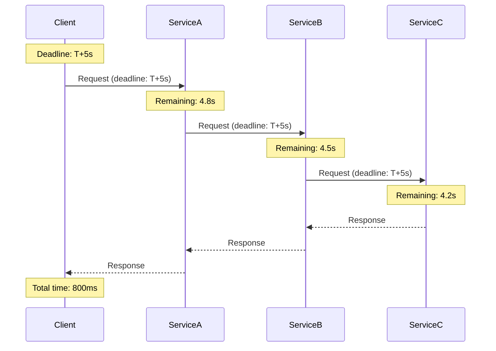
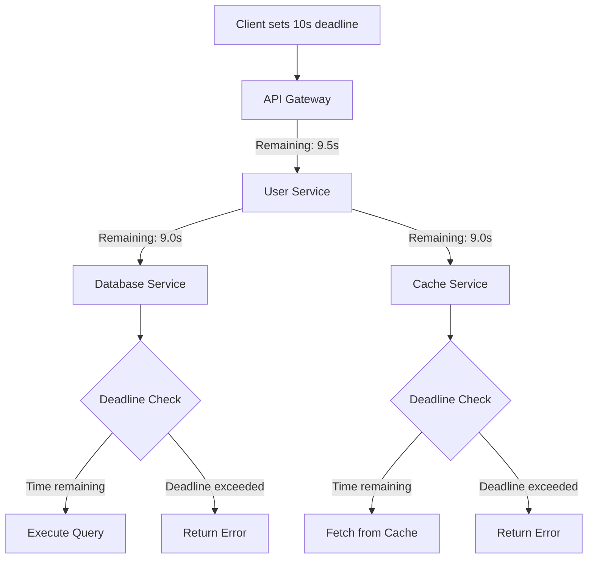
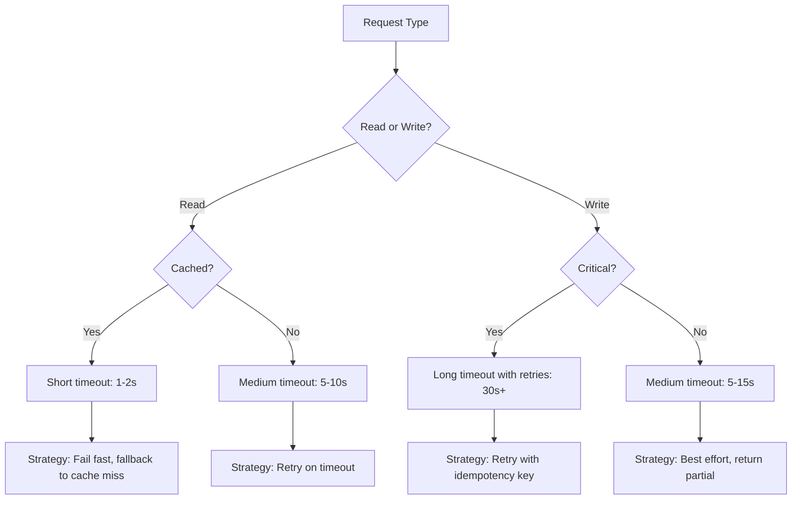

# How to Handle Deadlines and Timeouts in gRPC

Author: [nawazdhandala](https://www.github.com/nawazdhandala)

Tags: gRPC, deadlines, timeouts, context cancellation, distributed systems, microservices, resilience

Description: Master gRPC deadline and timeout handling including deadline propagation, context cancellation, and strategies for preventing cascading failures in distributed systems.

---

In distributed systems, operations that take too long can cause resource exhaustion, poor user experience, and cascading failures. gRPC provides robust mechanisms for handling deadlines and timeouts through context propagation. This guide covers everything you need to know about implementing effective timeout strategies in your gRPC services.

## Understanding Deadlines vs Timeouts

While often used interchangeably, deadlines and timeouts have distinct meanings in gRPC:

- **Timeout**: A duration from now (e.g., "5 seconds from now")
- **Deadline**: An absolute point in time (e.g., "January 8, 2026, 10:30:00 UTC")

gRPC internally converts timeouts to deadlines, which are then propagated across service boundaries.



## Setting Timeouts in gRPC Clients

### Go Client Timeout Configuration

```go
package main

import (
    "context"
    "log"
    "time"

    "google.golang.org/grpc"
    "google.golang.org/grpc/codes"
    "google.golang.org/grpc/credentials/insecure"
    "google.golang.org/grpc/status"
    pb "myapp/proto"
)

func main() {
    conn, err := grpc.Dial(
        "localhost:50051",
        grpc.WithTransportCredentials(insecure.NewCredentials()),
    )
    if err != nil {
        log.Fatalf("Failed to connect: %v", err)
    }
    defer conn.Close()

    client := pb.NewUserServiceClient(conn)

    // Method 1: Using context.WithTimeout
    ctx, cancel := context.WithTimeout(context.Background(), 5*time.Second)
    defer cancel()

    resp, err := client.GetUser(ctx, &pb.GetUserRequest{UserId: "123"})
    if err != nil {
        if status.Code(err) == codes.DeadlineExceeded {
            log.Printf("Request timed out: %v", err)
        } else {
            log.Printf("Request failed: %v", err)
        }
        return
    }

    log.Printf("User: %v", resp)
}

// Method 2: Using context.WithDeadline
func getWithDeadline(client pb.UserServiceClient, userID string) (*pb.User, error) {
    // Set absolute deadline
    deadline := time.Now().Add(5 * time.Second)
    ctx, cancel := context.WithDeadline(context.Background(), deadline)
    defer cancel()

    return client.GetUser(ctx, &pb.GetUserRequest{UserId: userID})
}
```

### Python Client Timeout Configuration

```python
import grpc
import time
from typing import Optional
import user_pb2
import user_pb2_grpc

def get_user_with_timeout(
    stub: user_pb2_grpc.UserServiceStub,
    user_id: str,
    timeout_seconds: float = 5.0
) -> Optional[user_pb2.User]:
    """Get user with timeout handling."""
    try:
        # Set timeout on the call
        response = stub.GetUser(
            user_pb2.GetUserRequest(user_id=user_id),
            timeout=timeout_seconds
        )
        return response
    except grpc.RpcError as e:
        if e.code() == grpc.StatusCode.DEADLINE_EXCEEDED:
            print(f"Request timed out after {timeout_seconds}s")
        else:
            print(f"Request failed: {e.code()}: {e.details()}")
        return None


def get_user_with_deadline(
    stub: user_pb2_grpc.UserServiceStub,
    user_id: str,
    deadline_timestamp: float
) -> Optional[user_pb2.User]:
    """Get user with absolute deadline."""
    # Calculate remaining time until deadline
    remaining = deadline_timestamp - time.time()

    if remaining <= 0:
        print("Deadline already passed")
        return None

    return get_user_with_timeout(stub, user_id, remaining)


# Usage
def main():
    channel = grpc.insecure_channel('localhost:50051')
    stub = user_pb2_grpc.UserServiceStub(channel)

    # Using timeout
    user = get_user_with_timeout(stub, "123", timeout_seconds=5.0)

    # Using deadline (5 seconds from now)
    deadline = time.time() + 5.0
    user = get_user_with_deadline(stub, "123", deadline)
```

### Node.js Client Timeout Configuration

```typescript
import * as grpc from '@grpc/grpc-js';
import { UserServiceClient } from './generated/user_grpc_pb';
import { GetUserRequest, User } from './generated/user_pb';

class UserClient {
  private client: UserServiceClient;
  private defaultTimeoutMs: number;

  constructor(address: string, defaultTimeoutMs: number = 5000) {
    this.client = new UserServiceClient(
      address,
      grpc.credentials.createInsecure()
    );
    this.defaultTimeoutMs = defaultTimeoutMs;
  }

  async getUser(userId: string, timeoutMs?: number): Promise<User> {
    const request = new GetUserRequest();
    request.setUserId(userId);

    const timeout = timeoutMs ?? this.defaultTimeoutMs;
    const deadline = new Date(Date.now() + timeout);

    return new Promise((resolve, reject) => {
      this.client.getUser(
        request,
        { deadline },
        (error: grpc.ServiceError | null, response: User) => {
          if (error) {
            if (error.code === grpc.status.DEADLINE_EXCEEDED) {
              reject(new Error(`Request timed out after ${timeout}ms`));
            } else {
              reject(error);
            }
          } else {
            resolve(response);
          }
        }
      );
    });
  }
}

// Usage
async function main() {
  const client = new UserClient('localhost:50051', 5000);

  try {
    const user = await client.getUser('123');
    console.log('User:', user.toObject());
  } catch (error) {
    console.error('Failed to get user:', error);
  }
}
```

## Deadline Propagation

One of gRPC's most powerful features is automatic deadline propagation across service boundaries.



### Go Server with Deadline Propagation

```go
package main

import (
    "context"
    "log"
    "time"

    "google.golang.org/grpc"
    "google.golang.org/grpc/codes"
    "google.golang.org/grpc/status"
    pb "myapp/proto"
)

type userServer struct {
    pb.UnimplementedUserServiceServer
    dbClient     pb.DatabaseServiceClient
    cacheClient  pb.CacheServiceClient
}

func (s *userServer) GetUser(ctx context.Context, req *pb.GetUserRequest) (*pb.User, error) {
    // Check if deadline is already exceeded
    if ctx.Err() == context.DeadlineExceeded {
        return nil, status.Error(codes.DeadlineExceeded, "deadline exceeded before processing")
    }

    // Log remaining time for debugging
    if deadline, ok := ctx.Deadline(); ok {
        remaining := time.Until(deadline)
        log.Printf("Remaining time: %v", remaining)

        // Don't proceed if not enough time
        if remaining < 100*time.Millisecond {
            return nil, status.Error(codes.DeadlineExceeded, "insufficient time remaining")
        }
    }

    // Try cache first - deadline automatically propagated
    user, err := s.cacheClient.GetUser(ctx, req)
    if err == nil {
        return user, nil
    }

    // Check context again before database call
    if ctx.Err() != nil {
        return nil, status.Error(codes.DeadlineExceeded, "deadline exceeded after cache check")
    }

    // Fall back to database - deadline automatically propagated
    return s.dbClient.GetUser(ctx, req)
}
```

### Adjusting Deadlines for Downstream Calls

Sometimes you need to adjust deadlines for downstream services:

```go
package main

import (
    "context"
    "time"

    "google.golang.org/grpc/codes"
    "google.golang.org/grpc/status"
    pb "myapp/proto"
)

func (s *orderServer) CreateOrder(ctx context.Context, req *pb.CreateOrderRequest) (*pb.Order, error) {
    // Reserve some time for local processing
    localProcessingTime := 500 * time.Millisecond

    // Calculate adjusted deadline for downstream calls
    deadline, hasDeadline := ctx.Deadline()
    if hasDeadline {
        remaining := time.Until(deadline)
        adjustedDeadline := deadline.Add(-localProcessingTime)

        if time.Until(adjustedDeadline) <= 0 {
            return nil, status.Error(codes.DeadlineExceeded, "insufficient time for operation")
        }

        // Create new context with adjusted deadline
        var cancel context.CancelFunc
        ctx, cancel = context.WithDeadline(ctx, adjustedDeadline)
        defer cancel()

        log.Printf("Original remaining: %v, Adjusted remaining: %v",
            remaining, time.Until(adjustedDeadline))
    }

    // Make downstream calls with adjusted deadline
    inventory, err := s.inventoryClient.ReserveItems(ctx, &pb.ReserveRequest{
        Items: req.Items,
    })
    if err != nil {
        return nil, err
    }

    // Process locally (within reserved time)
    order := processOrder(req, inventory)

    return order, nil
}
```

## Context Cancellation

Context cancellation allows clients to abort requests and servers to clean up resources.

### Client-Side Cancellation

```go
package main

import (
    "context"
    "log"
    "os"
    "os/signal"
    "syscall"

    "google.golang.org/grpc"
    "google.golang.org/grpc/credentials/insecure"
    pb "myapp/proto"
)

func main() {
    conn, _ := grpc.Dial("localhost:50051", grpc.WithTransportCredentials(insecure.NewCredentials()))
    defer conn.Close()

    client := pb.NewReportServiceClient(conn)

    // Create cancellable context
    ctx, cancel := context.WithCancel(context.Background())

    // Handle OS signals for graceful shutdown
    sigChan := make(chan os.Signal, 1)
    signal.Notify(sigChan, syscall.SIGINT, syscall.SIGTERM)

    go func() {
        <-sigChan
        log.Println("Received shutdown signal, cancelling request...")
        cancel()
    }()

    // Start long-running request
    stream, err := client.GenerateReport(ctx, &pb.ReportRequest{
        ReportType: "annual",
    })
    if err != nil {
        log.Fatalf("Failed to start report generation: %v", err)
    }

    // Process stream
    for {
        resp, err := stream.Recv()
        if err != nil {
            if ctx.Err() == context.Canceled {
                log.Println("Request was cancelled")
            } else {
                log.Printf("Stream error: %v", err)
            }
            break
        }
        log.Printf("Progress: %d%%", resp.Progress)
    }
}
```

### Server-Side Cancellation Handling

```go
package main

import (
    "context"
    "log"
    "time"

    "google.golang.org/grpc/codes"
    "google.golang.org/grpc/status"
    pb "myapp/proto"
)

type reportServer struct {
    pb.UnimplementedReportServiceServer
}

func (s *reportServer) GenerateReport(
    req *pb.ReportRequest,
    stream pb.ReportService_GenerateReportServer,
) error {
    ctx := stream.Context()

    // Simulate long-running operation
    for progress := 0; progress <= 100; progress += 10 {
        // Check for cancellation before each step
        select {
        case <-ctx.Done():
            // Client cancelled or deadline exceeded
            if ctx.Err() == context.Canceled {
                log.Println("Client cancelled the request")
                return status.Error(codes.Canceled, "client cancelled")
            }
            if ctx.Err() == context.DeadlineExceeded {
                log.Println("Request deadline exceeded")
                return status.Error(codes.DeadlineExceeded, "deadline exceeded")
            }
            return ctx.Err()
        default:
            // Continue processing
        }

        // Simulate work
        time.Sleep(500 * time.Millisecond)

        // Send progress update
        if err := stream.Send(&pb.ReportProgress{Progress: int32(progress)}); err != nil {
            return err
        }
    }

    return nil
}

// For unary RPCs with cancellation-aware operations
func (s *reportServer) ProcessData(ctx context.Context, req *pb.DataRequest) (*pb.DataResponse, error) {
    results := make([]string, 0)

    for _, item := range req.Items {
        // Check cancellation periodically
        if err := ctx.Err(); err != nil {
            return nil, status.FromContextError(err).Err()
        }

        // Process item
        result, err := processItem(ctx, item)
        if err != nil {
            return nil, err
        }
        results = append(results, result)
    }

    return &pb.DataResponse{Results: results}, nil
}

func processItem(ctx context.Context, item string) (string, error) {
    // Create a channel for the result
    resultChan := make(chan string, 1)
    errChan := make(chan error, 1)

    go func() {
        // Simulate processing
        time.Sleep(100 * time.Millisecond)
        resultChan <- "processed_" + item
    }()

    select {
    case result := <-resultChan:
        return result, nil
    case err := <-errChan:
        return "", err
    case <-ctx.Done():
        return "", ctx.Err()
    }
}
```

## Handling Deadline Exceeded Errors

Proper handling of deadline exceeded errors is crucial for good user experience and debugging.

```go
package main

import (
    "context"
    "log"
    "time"

    "google.golang.org/grpc"
    "google.golang.org/grpc/codes"
    "google.golang.org/grpc/status"
    pb "myapp/proto"
)

type ErrorHandler struct {
    metrics *MetricsCollector
    logger  *log.Logger
}

func (h *ErrorHandler) HandleError(ctx context.Context, method string, err error) error {
    if err == nil {
        return nil
    }

    st, ok := status.FromError(err)
    if !ok {
        return err
    }

    switch st.Code() {
    case codes.DeadlineExceeded:
        h.handleDeadlineExceeded(ctx, method, st)
    case codes.Canceled:
        h.handleCanceled(ctx, method, st)
    default:
        h.logger.Printf("RPC error: %s - %v", method, err)
    }

    return err
}

func (h *ErrorHandler) handleDeadlineExceeded(ctx context.Context, method string, st *status.Status) {
    // Log detailed information
    deadline, hasDeadline := ctx.Deadline()
    var deadlineInfo string
    if hasDeadline {
        deadlineInfo = deadline.Format(time.RFC3339)
    } else {
        deadlineInfo = "no deadline set"
    }

    h.logger.Printf("Deadline exceeded for %s. Deadline was: %s", method, deadlineInfo)

    // Record metrics
    h.metrics.RecordTimeout(method)

    // Could trigger alerts if timeout rate is high
}

func (h *ErrorHandler) handleCanceled(ctx context.Context, method string, st *status.Status) {
    h.logger.Printf("Request canceled for %s", method)
    h.metrics.RecordCancellation(method)
}

// Interceptor for automatic error handling
func ErrorHandlingInterceptor(handler *ErrorHandler) grpc.UnaryClientInterceptor {
    return func(
        ctx context.Context,
        method string,
        req, reply interface{},
        cc *grpc.ClientConn,
        invoker grpc.UnaryInvoker,
        opts ...grpc.CallOption,
    ) error {
        err := invoker(ctx, method, req, reply, cc, opts...)
        return handler.HandleError(ctx, method, err)
    }
}
```

## Server-Side Timeout Enforcement

Servers should also enforce their own timeouts to prevent resource exhaustion.

```go
package main

import (
    "context"
    "time"

    "google.golang.org/grpc"
    "google.golang.org/grpc/codes"
    "google.golang.org/grpc/status"
)

// ServerTimeoutInterceptor enforces maximum request duration
func ServerTimeoutInterceptor(maxDuration time.Duration) grpc.UnaryServerInterceptor {
    return func(
        ctx context.Context,
        req interface{},
        info *grpc.UnaryServerInfo,
        handler grpc.UnaryHandler,
    ) (interface{}, error) {
        // Check if client set a deadline
        clientDeadline, hasClientDeadline := ctx.Deadline()

        // Calculate server deadline
        serverDeadline := time.Now().Add(maxDuration)

        // Use the earlier deadline
        var effectiveDeadline time.Time
        if hasClientDeadline && clientDeadline.Before(serverDeadline) {
            effectiveDeadline = clientDeadline
        } else {
            effectiveDeadline = serverDeadline
        }

        // Create new context with effective deadline
        ctx, cancel := context.WithDeadline(ctx, effectiveDeadline)
        defer cancel()

        // Execute handler with timeout
        type result struct {
            resp interface{}
            err  error
        }

        done := make(chan result, 1)
        go func() {
            resp, err := handler(ctx, req)
            done <- result{resp, err}
        }()

        select {
        case r := <-done:
            return r.resp, r.err
        case <-ctx.Done():
            if ctx.Err() == context.DeadlineExceeded {
                return nil, status.Error(codes.DeadlineExceeded, "server timeout exceeded")
            }
            return nil, status.FromContextError(ctx.Err()).Err()
        }
    }
}

// Per-method timeout configuration
type MethodTimeouts map[string]time.Duration

func PerMethodTimeoutInterceptor(timeouts MethodTimeouts, defaultTimeout time.Duration) grpc.UnaryServerInterceptor {
    return func(
        ctx context.Context,
        req interface{},
        info *grpc.UnaryServerInfo,
        handler grpc.UnaryHandler,
    ) (interface{}, error) {
        // Get timeout for this method
        timeout, ok := timeouts[info.FullMethod]
        if !ok {
            timeout = defaultTimeout
        }

        // Apply timeout
        ctx, cancel := context.WithTimeout(ctx, timeout)
        defer cancel()

        return handler(ctx, req)
    }
}

// Usage
func main() {
    timeouts := MethodTimeouts{
        "/mypackage.UserService/GetUser":     5 * time.Second,
        "/mypackage.UserService/ListUsers":   30 * time.Second,
        "/mypackage.ReportService/Generate":  5 * time.Minute,
    }

    server := grpc.NewServer(
        grpc.UnaryInterceptor(PerMethodTimeoutInterceptor(timeouts, 10*time.Second)),
    )
}
```

## Timeout Strategies for Different Scenarios



### Implementing Adaptive Timeouts

```go
package adaptive

import (
    "context"
    "sync"
    "time"

    "google.golang.org/grpc"
)

// AdaptiveTimeout adjusts timeouts based on observed latencies
type AdaptiveTimeout struct {
    mu              sync.RWMutex
    methodLatencies map[string]*LatencyTracker
    defaultTimeout  time.Duration
    percentile      float64 // e.g., 0.99 for p99
}

type LatencyTracker struct {
    samples    []time.Duration
    maxSamples int
}

func NewAdaptiveTimeout(defaultTimeout time.Duration, percentile float64) *AdaptiveTimeout {
    return &AdaptiveTimeout{
        methodLatencies: make(map[string]*LatencyTracker),
        defaultTimeout:  defaultTimeout,
        percentile:      percentile,
    }
}

func (a *AdaptiveTimeout) RecordLatency(method string, latency time.Duration) {
    a.mu.Lock()
    defer a.mu.Unlock()

    tracker, ok := a.methodLatencies[method]
    if !ok {
        tracker = &LatencyTracker{maxSamples: 1000}
        a.methodLatencies[method] = tracker
    }

    tracker.samples = append(tracker.samples, latency)
    if len(tracker.samples) > tracker.maxSamples {
        tracker.samples = tracker.samples[1:]
    }
}

func (a *AdaptiveTimeout) GetTimeout(method string) time.Duration {
    a.mu.RLock()
    defer a.mu.RUnlock()

    tracker, ok := a.methodLatencies[method]
    if !ok || len(tracker.samples) < 10 {
        return a.defaultTimeout
    }

    // Calculate percentile with buffer
    p := calculatePercentile(tracker.samples, a.percentile)

    // Add 50% buffer for safety
    timeout := time.Duration(float64(p) * 1.5)

    // Clamp between reasonable bounds
    minTimeout := 100 * time.Millisecond
    maxTimeout := 60 * time.Second

    if timeout < minTimeout {
        timeout = minTimeout
    }
    if timeout > maxTimeout {
        timeout = maxTimeout
    }

    return timeout
}

func (a *AdaptiveTimeout) Interceptor() grpc.UnaryClientInterceptor {
    return func(
        ctx context.Context,
        method string,
        req, reply interface{},
        cc *grpc.ClientConn,
        invoker grpc.UnaryInvoker,
        opts ...grpc.CallOption,
    ) error {
        // Only set timeout if not already set
        if _, hasDeadline := ctx.Deadline(); !hasDeadline {
            timeout := a.GetTimeout(method)
            var cancel context.CancelFunc
            ctx, cancel = context.WithTimeout(ctx, timeout)
            defer cancel()
        }

        start := time.Now()
        err := invoker(ctx, method, req, reply, cc, opts...)
        latency := time.Since(start)

        // Only record successful request latencies
        if err == nil {
            a.RecordLatency(method, latency)
        }

        return err
    }
}

func calculatePercentile(samples []time.Duration, p float64) time.Duration {
    if len(samples) == 0 {
        return 0
    }

    // Sort samples (simplified - use proper sorting in production)
    sorted := make([]time.Duration, len(samples))
    copy(sorted, samples)
    sort.Slice(sorted, func(i, j int) bool {
        return sorted[i] < sorted[j]
    })

    index := int(float64(len(sorted)-1) * p)
    return sorted[index]
}
```

## Complete Example: Deadline-Aware Service Chain

```go
package main

import (
    "context"
    "log"
    "net"
    "time"

    "google.golang.org/grpc"
    "google.golang.org/grpc/codes"
    "google.golang.org/grpc/status"
    pb "myapp/proto"
)

// OrderService demonstrates proper deadline handling across a service chain
type OrderService struct {
    pb.UnimplementedOrderServiceServer
    inventoryClient pb.InventoryServiceClient
    paymentClient   pb.PaymentServiceClient
    shippingClient  pb.ShippingServiceClient
}

func (s *OrderService) CreateOrder(ctx context.Context, req *pb.CreateOrderRequest) (*pb.Order, error) {
    // Log incoming deadline for debugging
    if deadline, ok := ctx.Deadline(); ok {
        log.Printf("CreateOrder called with deadline: %v (remaining: %v)",
            deadline.Format(time.RFC3339), time.Until(deadline))
    }

    // Step 1: Check inventory (allocate 30% of remaining time)
    inventoryCtx, inventoryCancel := s.allocateTime(ctx, 0.3)
    defer inventoryCancel()

    inventory, err := s.inventoryClient.CheckAvailability(inventoryCtx, &pb.InventoryRequest{
        Items: req.Items,
    })
    if err != nil {
        return nil, s.wrapError("inventory check", err)
    }

    if !inventory.Available {
        return nil, status.Error(codes.FailedPrecondition, "items not available")
    }

    // Step 2: Process payment (allocate 40% of remaining time)
    paymentCtx, paymentCancel := s.allocateTime(ctx, 0.4)
    defer paymentCancel()

    payment, err := s.paymentClient.ProcessPayment(paymentCtx, &pb.PaymentRequest{
        Amount:   req.TotalAmount,
        CustomerId: req.CustomerId,
    })
    if err != nil {
        // Rollback inventory reservation
        s.inventoryClient.ReleaseReservation(ctx, &pb.ReleaseRequest{
            ReservationId: inventory.ReservationId,
        })
        return nil, s.wrapError("payment processing", err)
    }

    // Step 3: Create shipping order (allocate remaining time)
    shipping, err := s.shippingClient.CreateShipment(ctx, &pb.ShipmentRequest{
        OrderId: payment.OrderId,
        Address: req.ShippingAddress,
    })
    if err != nil {
        // Log but don't fail - shipping can be retried
        log.Printf("Shipping creation failed: %v", err)
    }

    return &pb.Order{
        OrderId:    payment.OrderId,
        Status:     "CONFIRMED",
        ShipmentId: shipping.GetShipmentId(),
    }, nil
}

func (s *OrderService) allocateTime(ctx context.Context, fraction float64) (context.Context, context.CancelFunc) {
    deadline, ok := ctx.Deadline()
    if !ok {
        // No deadline set - use default
        return context.WithTimeout(ctx, 10*time.Second)
    }

    remaining := time.Until(deadline)
    allocated := time.Duration(float64(remaining) * fraction)

    // Ensure minimum timeout
    if allocated < 100*time.Millisecond {
        allocated = 100 * time.Millisecond
    }

    return context.WithTimeout(ctx, allocated)
}

func (s *OrderService) wrapError(operation string, err error) error {
    st, ok := status.FromError(err)
    if !ok {
        return err
    }

    switch st.Code() {
    case codes.DeadlineExceeded:
        return status.Errorf(codes.DeadlineExceeded,
            "%s timed out: %s", operation, st.Message())
    case codes.Canceled:
        return status.Errorf(codes.Canceled,
            "%s was canceled: %s", operation, st.Message())
    default:
        return err
    }
}

func main() {
    // Create server with timeout interceptor
    server := grpc.NewServer(
        grpc.ChainUnaryInterceptor(
            LoggingInterceptor(),
            ServerTimeoutInterceptor(30*time.Second),
        ),
    )

    // Register service
    pb.RegisterOrderServiceServer(server, &OrderService{
        // Initialize clients...
    })

    lis, _ := net.Listen("tcp", ":50051")
    log.Fatal(server.Serve(lis))
}

func LoggingInterceptor() grpc.UnaryServerInterceptor {
    return func(
        ctx context.Context,
        req interface{},
        info *grpc.UnaryServerInfo,
        handler grpc.UnaryHandler,
    ) (interface{}, error) {
        start := time.Now()

        resp, err := handler(ctx, req)

        duration := time.Since(start)
        status := "OK"
        if err != nil {
            status = err.Error()
        }

        log.Printf("Method: %s | Duration: %v | Status: %s",
            info.FullMethod, duration, status)

        return resp, err
    }
}
```

## Best Practices

1. **Always set deadlines**: Never make gRPC calls without a deadline
2. **Propagate deadlines**: Let gRPC automatically propagate deadlines through the context
3. **Reserve processing time**: Adjust deadlines for downstream calls to reserve time for local processing
4. **Handle cancellation gracefully**: Check context cancellation in long-running operations
5. **Use appropriate timeouts**: Different operations need different timeout values
6. **Monitor timeout metrics**: Track deadline exceeded errors to identify issues
7. **Implement fallbacks**: Have fallback strategies when operations timeout
8. **Test timeout behavior**: Include timeout scenarios in your test suite

## Monitoring and Alerting

```go
package metrics

import (
    "github.com/prometheus/client_golang/prometheus"
    "github.com/prometheus/client_golang/prometheus/promauto"
)

var (
    requestDuration = promauto.NewHistogramVec(
        prometheus.HistogramOpts{
            Name:    "grpc_request_duration_seconds",
            Help:    "Request duration in seconds",
            Buckets: []float64{.01, .05, .1, .25, .5, 1, 2.5, 5, 10},
        },
        []string{"method", "status"},
    )

    deadlineExceeded = promauto.NewCounterVec(
        prometheus.CounterOpts{
            Name: "grpc_deadline_exceeded_total",
            Help: "Total number of deadline exceeded errors",
        },
        []string{"method"},
    )

    timeoutConfig = promauto.NewGaugeVec(
        prometheus.GaugeOpts{
            Name: "grpc_timeout_config_seconds",
            Help: "Configured timeout for each method",
        },
        []string{"method"},
    )
)
```

## Conclusion

Proper deadline and timeout handling is essential for building reliable gRPC services. By implementing deadline propagation, context cancellation, and appropriate timeout strategies, you can prevent cascading failures and provide a better experience for your users. Remember to always set deadlines, handle cancellation gracefully, and monitor timeout-related metrics to continuously improve your service reliability.
