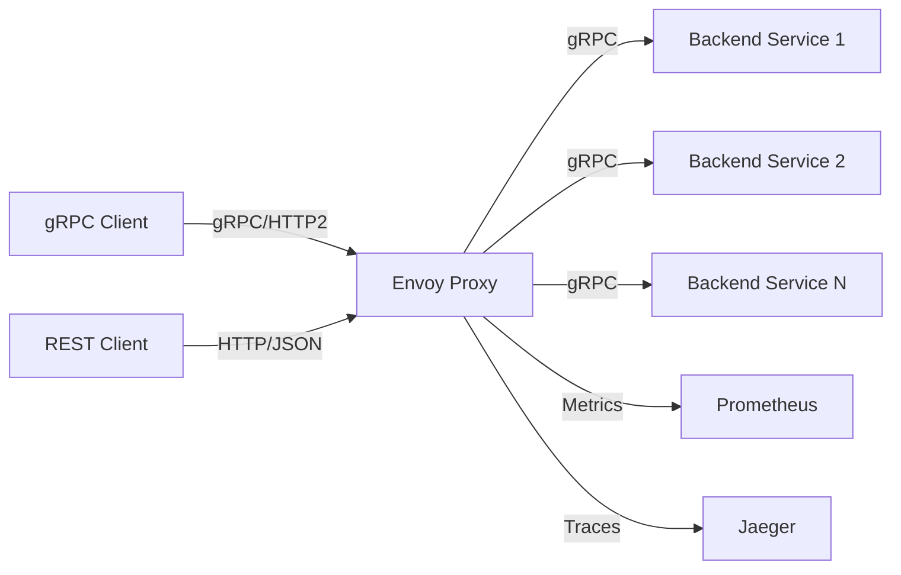

# How to Build a gRPC Proxy with Envoy

Author: [nawazdhandala](https://www.github.com/nawazdhandala)

Tags: grpc, envoy, proxy, load-balancing, kubernetes, observability, transcoding, microservices

Description: Learn how to configure Envoy as a powerful gRPC proxy with route matching, load balancing, gRPC-JSON transcoding, and comprehensive observability features.

---

## Introduction

Envoy is a high-performance edge and service proxy designed for cloud-native applications. It provides exceptional support for gRPC, including load balancing, health checking, circuit breaking, rate limiting, and even gRPC-JSON transcoding. This makes it an ideal choice for building gRPC proxies in production environments.

This guide covers setting up Envoy as a gRPC proxy with advanced routing, load balancing strategies, transcoding capabilities, and observability integration.

## Architecture Overview



## Prerequisites

- Docker and Docker Compose
- Basic understanding of gRPC and Protocol Buffers
- Familiarity with YAML configuration

## Project Setup

### Directory Structure

```bash
mkdir -p grpc-envoy-proxy
cd grpc-envoy-proxy
mkdir -p envoy proto services/{user,order} scripts
```

### Sample gRPC Services

Create `proto/user.proto`:

```protobuf
syntax = "proto3";

package user.v1;

option go_package = "github.com/example/grpc-envoy/services/user;user";

message User {
  string id = 1;
  string name = 2;
  string email = 3;
}

message GetUserRequest {
  string id = 1;
}

message ListUsersRequest {
  int32 page_size = 1;
  string page_token = 2;
}

message ListUsersResponse {
  repeated User users = 1;
  string next_page_token = 2;
}

message CreateUserRequest {
  string name = 1;
  string email = 2;
}

service UserService {
  rpc GetUser(GetUserRequest) returns (User);
  rpc ListUsers(ListUsersRequest) returns (ListUsersResponse);
  rpc CreateUser(CreateUserRequest) returns (User);
}
```

Create `proto/order.proto`:

```protobuf
syntax = "proto3";

package order.v1;

option go_package = "github.com/example/grpc-envoy/services/order;order";

message Order {
  string id = 1;
  string user_id = 2;
  repeated OrderItem items = 3;
  string status = 4;
  double total = 5;
}

message OrderItem {
  string product_id = 1;
  string name = 2;
  int32 quantity = 3;
  double price = 4;
}

message GetOrderRequest {
  string id = 1;
}

message ListOrdersRequest {
  string user_id = 1;
  int32 page_size = 2;
  string page_token = 3;
}

message ListOrdersResponse {
  repeated Order orders = 1;
  string next_page_token = 2;
}

message CreateOrderRequest {
  string user_id = 1;
  repeated OrderItem items = 2;
}

service OrderService {
  rpc GetOrder(GetOrderRequest) returns (Order);
  rpc ListOrders(ListOrdersRequest) returns (ListOrdersResponse);
  rpc CreateOrder(CreateOrderRequest) returns (Order);
}
```

## Basic Envoy Configuration

Create `envoy/envoy.yaml`:

```yaml
# Envoy configuration for gRPC proxy
admin:
  address:
    socket_address:
      address: 0.0.0.0
      port_value: 9901

static_resources:
  listeners:
    - name: grpc_listener
      address:
        socket_address:
          address: 0.0.0.0
          port_value: 50051
      filter_chains:
        - filters:
            - name: envoy.filters.network.http_connection_manager
              typed_config:
                "@type": type.googleapis.com/envoy.extensions.filters.network.http_connection_manager.v3.HttpConnectionManager
                stat_prefix: grpc_ingress
                codec_type: AUTO
                # Enable HTTP/2 for gRPC
                http2_protocol_options:
                  max_concurrent_streams: 100
                  initial_stream_window_size: 65536
                  initial_connection_window_size: 1048576

                access_log:
                  - name: envoy.access_loggers.stdout
                    typed_config:
                      "@type": type.googleapis.com/envoy.extensions.access_loggers.stream.v3.StdoutAccessLog
                      log_format:
                        json_format:
                          timestamp: "%START_TIME%"
                          method: "%REQ(:METHOD)%"
                          path: "%REQ(:PATH)%"
                          protocol: "%PROTOCOL%"
                          response_code: "%RESPONSE_CODE%"
                          grpc_status: "%RESP(GRPC-STATUS)%"
                          duration_ms: "%DURATION%"
                          request_id: "%REQ(X-REQUEST-ID)%"
                          upstream_host: "%UPSTREAM_HOST%"

                route_config:
                  name: grpc_route
                  virtual_hosts:
                    - name: grpc_services
                      domains: ["*"]
                      routes:
                        # Route to User Service
                        - match:
                            prefix: "/user.v1.UserService/"
                          route:
                            cluster: user_service
                            timeout: 30s
                            retry_policy:
                              retry_on: "unavailable,resource-exhausted,cancelled"
                              num_retries: 3
                              per_try_timeout: 10s
                              retry_back_off:
                                base_interval: 0.1s
                                max_interval: 1s

                        # Route to Order Service
                        - match:
                            prefix: "/order.v1.OrderService/"
                          route:
                            cluster: order_service
                            timeout: 30s

                        # Health check endpoint
                        - match:
                            prefix: "/grpc.health.v1.Health/"
                          route:
                            cluster: user_service

                http_filters:
                  # gRPC web filter for browser clients
                  - name: envoy.filters.http.grpc_web
                    typed_config:
                      "@type": type.googleapis.com/envoy.extensions.filters.http.grpc_web.v3.GrpcWeb

                  # Health check filter
                  - name: envoy.filters.http.health_check
                    typed_config:
                      "@type": type.googleapis.com/envoy.extensions.filters.http.health_check.v3.HealthCheck
                      pass_through_mode: false
                      headers:
                        - name: ":path"
                          string_match:
                            exact: "/healthz"

                  # Router filter (must be last)
                  - name: envoy.filters.http.router
                    typed_config:
                      "@type": type.googleapis.com/envoy.extensions.filters.http.router.v3.Router

  clusters:
    - name: user_service
      connect_timeout: 5s
      type: STRICT_DNS
      lb_policy: ROUND_ROBIN
      typed_extension_protocol_options:
        envoy.extensions.upstreams.http.v3.HttpProtocolOptions:
          "@type": type.googleapis.com/envoy.extensions.upstreams.http.v3.HttpProtocolOptions
          explicit_http_config:
            http2_protocol_options: {}
      load_assignment:
        cluster_name: user_service
        endpoints:
          - lb_endpoints:
              - endpoint:
                  address:
                    socket_address:
                      address: user-service
                      port_value: 50051

      # Health checking
      health_checks:
        - timeout: 5s
          interval: 10s
          unhealthy_threshold: 3
          healthy_threshold: 2
          grpc_health_check:
            service_name: "user.v1.UserService"

      # Circuit breaker
      circuit_breakers:
        thresholds:
          - priority: DEFAULT
            max_connections: 1000
            max_pending_requests: 1000
            max_requests: 1000
            max_retries: 3

    - name: order_service
      connect_timeout: 5s
      type: STRICT_DNS
      lb_policy: ROUND_ROBIN
      typed_extension_protocol_options:
        envoy.extensions.upstreams.http.v3.HttpProtocolOptions:
          "@type": type.googleapis.com/envoy.extensions.upstreams.http.v3.HttpProtocolOptions
          explicit_http_config:
            http2_protocol_options: {}
      load_assignment:
        cluster_name: order_service
        endpoints:
          - lb_endpoints:
              - endpoint:
                  address:
                    socket_address:
                      address: order-service
                      port_value: 50051

      health_checks:
        - timeout: 5s
          interval: 10s
          unhealthy_threshold: 3
          healthy_threshold: 2
          grpc_health_check:
            service_name: "order.v1.OrderService"

      circuit_breakers:
        thresholds:
          - priority: DEFAULT
            max_connections: 1000
            max_pending_requests: 1000
            max_requests: 1000
            max_retries: 3
```

## Advanced Route Matching

### Header-Based Routing

```yaml
route_config:
  name: grpc_route
  virtual_hosts:
    - name: grpc_services
      domains: ["*"]
      routes:
        # Route based on custom header
        - match:
            prefix: "/user.v1.UserService/"
            headers:
              - name: "x-api-version"
                string_match:
                  exact: "v2"
          route:
            cluster: user_service_v2
            timeout: 30s

        # Default route for v1
        - match:
            prefix: "/user.v1.UserService/"
          route:
            cluster: user_service_v1
            timeout: 30s

        # Route based on tenant
        - match:
            prefix: "/"
            headers:
              - name: "x-tenant-id"
                string_match:
                  prefix: "enterprise-"
          route:
            cluster: enterprise_backend
            timeout: 60s

        # Default fallback
        - match:
            prefix: "/"
          route:
            cluster: default_backend
```

### Method-Based Routing

```yaml
routes:
  # Read operations to read replicas
  - match:
      prefix: "/user.v1.UserService/GetUser"
    route:
      cluster: user_service_read
      timeout: 10s

  - match:
      prefix: "/user.v1.UserService/ListUsers"
    route:
      cluster: user_service_read
      timeout: 30s

  # Write operations to primary
  - match:
      prefix: "/user.v1.UserService/CreateUser"
    route:
      cluster: user_service_write
      timeout: 30s
      retry_policy:
        retry_on: "unavailable"
        num_retries: 1  # Fewer retries for writes

  - match:
      prefix: "/user.v1.UserService/UpdateUser"
    route:
      cluster: user_service_write
      timeout: 30s
```

### Weighted Routing for Canary Deployments

```yaml
routes:
  - match:
      prefix: "/user.v1.UserService/"
    route:
      weighted_clusters:
        clusters:
          - name: user_service_stable
            weight: 90
          - name: user_service_canary
            weight: 10
      timeout: 30s
```

## Load Balancing Strategies

### Round Robin (Default)

```yaml
clusters:
  - name: user_service
    lb_policy: ROUND_ROBIN
    load_assignment:
      cluster_name: user_service
      endpoints:
        - lb_endpoints:
            - endpoint:
                address:
                  socket_address:
                    address: user-1
                    port_value: 50051
            - endpoint:
                address:
                  socket_address:
                    address: user-2
                    port_value: 50051
            - endpoint:
                address:
                  socket_address:
                    address: user-3
                    port_value: 50051
```

### Least Request

```yaml
clusters:
  - name: user_service
    lb_policy: LEAST_REQUEST
    least_request_lb_config:
      choice_count: 2  # Random selection from N hosts
```

### Ring Hash (Consistent Hashing)

```yaml
clusters:
  - name: user_service
    lb_policy: RING_HASH
    ring_hash_lb_config:
      minimum_ring_size: 1024
      maximum_ring_size: 8388608
      hash_function: XX_HASH

# Configure hash policy in route
routes:
  - match:
      prefix: "/user.v1.UserService/"
    route:
      cluster: user_service
      hash_policy:
        - header:
            header_name: "x-user-id"
```

### Maglev (Consistent Hashing)

```yaml
clusters:
  - name: user_service
    lb_policy: MAGLEV
    maglev_lb_config:
      table_size: 65537  # Prime number

routes:
  - match:
      prefix: "/user.v1.UserService/"
    route:
      cluster: user_service
      hash_policy:
        - connection_properties:
            source_ip: true
```

### Priority-Based Load Balancing

```yaml
clusters:
  - name: user_service
    lb_policy: ROUND_ROBIN
    load_assignment:
      cluster_name: user_service
      endpoints:
        # Primary endpoints (priority 0 = highest)
        - priority: 0
          lb_endpoints:
            - endpoint:
                address:
                  socket_address:
                    address: user-primary-1
                    port_value: 50051
            - endpoint:
                address:
                  socket_address:
                    address: user-primary-2
                    port_value: 50051

        # Backup endpoints (priority 1 = lower)
        - priority: 1
          lb_endpoints:
            - endpoint:
                address:
                  socket_address:
                    address: user-backup-1
                    port_value: 50051
```

## gRPC-JSON Transcoding

Envoy can automatically transcode HTTP/JSON requests to gRPC, allowing REST clients to interact with gRPC services.

### Enable Transcoding Filter

```yaml
http_filters:
  # gRPC-JSON transcoding filter
  - name: envoy.filters.http.grpc_json_transcoder
    typed_config:
      "@type": type.googleapis.com/envoy.extensions.filters.http.grpc_json_transcoder.v3.GrpcJsonTranscoder
      proto_descriptor: "/etc/envoy/proto/descriptor.pb"
      services:
        - "user.v1.UserService"
        - "order.v1.OrderService"
      print_options:
        add_whitespace: true
        always_print_primitive_fields: true
        always_print_enums_as_ints: false
        preserve_proto_field_names: true
      convert_grpc_status: true
      ignore_unknown_query_parameters: true

  - name: envoy.filters.http.router
    typed_config:
      "@type": type.googleapis.com/envoy.extensions.filters.http.router.v3.Router
```

### Proto File with HTTP Annotations

Update `proto/user.proto`:

```protobuf
syntax = "proto3";

package user.v1;

import "google/api/annotations.proto";

option go_package = "github.com/example/grpc-envoy/services/user;user";

message User {
  string id = 1;
  string name = 2;
  string email = 3;
}

message GetUserRequest {
  string id = 1;
}

message ListUsersRequest {
  int32 page_size = 1;
  string page_token = 2;
}

message ListUsersResponse {
  repeated User users = 1;
  string next_page_token = 2;
}

message CreateUserRequest {
  string name = 1;
  string email = 2;
}

service UserService {
  rpc GetUser(GetUserRequest) returns (User) {
    option (google.api.http) = {
      get: "/v1/users/{id}"
    };
  }

  rpc ListUsers(ListUsersRequest) returns (ListUsersResponse) {
    option (google.api.http) = {
      get: "/v1/users"
    };
  }

  rpc CreateUser(CreateUserRequest) returns (User) {
    option (google.api.http) = {
      post: "/v1/users"
      body: "*"
    };
  }
}
```

### Generate Proto Descriptor

```bash
# Generate descriptor set for Envoy
protoc \
  -I proto \
  -I third_party/googleapis \
  --include_imports \
  --include_source_info \
  --descriptor_set_out=envoy/proto/descriptor.pb \
  proto/user.proto proto/order.proto
```

### Transcoding Listener Configuration

```yaml
listeners:
  # HTTP/JSON listener for REST clients
  - name: http_listener
    address:
      socket_address:
        address: 0.0.0.0
        port_value: 8080
    filter_chains:
      - filters:
          - name: envoy.filters.network.http_connection_manager
            typed_config:
              "@type": type.googleapis.com/envoy.extensions.filters.network.http_connection_manager.v3.HttpConnectionManager
              stat_prefix: http_ingress
              codec_type: AUTO

              route_config:
                name: http_route
                virtual_hosts:
                  - name: rest_api
                    domains: ["*"]
                    routes:
                      - match:
                          prefix: "/v1/users"
                        route:
                          cluster: user_service
                          timeout: 30s
                      - match:
                          prefix: "/v1/orders"
                        route:
                          cluster: order_service
                          timeout: 30s

              http_filters:
                - name: envoy.filters.http.grpc_json_transcoder
                  typed_config:
                    "@type": type.googleapis.com/envoy.extensions.filters.http.grpc_json_transcoder.v3.GrpcJsonTranscoder
                    proto_descriptor: "/etc/envoy/proto/descriptor.pb"
                    services:
                      - "user.v1.UserService"
                      - "order.v1.OrderService"
                    print_options:
                      add_whitespace: true
                      always_print_primitive_fields: true
                      preserve_proto_field_names: true
                    convert_grpc_status: true

                - name: envoy.filters.http.router
                  typed_config:
                    "@type": type.googleapis.com/envoy.extensions.filters.http.router.v3.Router
```

### Test Transcoding

```bash
# Create user via REST
curl -X POST http://localhost:8080/v1/users \
  -H "Content-Type: application/json" \
  -d '{"name": "John Doe", "email": "john@example.com"}'

# Get user via REST
curl http://localhost:8080/v1/users/user-123

# List users via REST
curl "http://localhost:8080/v1/users?page_size=10"
```

## Observability Configuration

### Prometheus Metrics

```yaml
admin:
  address:
    socket_address:
      address: 0.0.0.0
      port_value: 9901

# Enable stats sinks
stats_sinks:
  - name: envoy.stat_sinks.statsd
    typed_config:
      "@type": type.googleapis.com/envoy.config.metrics.v3.StatsdSink
      tcp_cluster_name: statsd_cluster
      prefix: envoy

stats_config:
  stats_tags:
    - tag_name: cluster_name
      regex: "^cluster\\.(.*?)\\."
    - tag_name: grpc_service
      regex: "^cluster\\..*?\\.grpc\\.(.+?)\\."
  use_all_default_tags: true

clusters:
  - name: statsd_cluster
    connect_timeout: 5s
    type: STRICT_DNS
    lb_policy: ROUND_ROBIN
    load_assignment:
      cluster_name: statsd_cluster
      endpoints:
        - lb_endpoints:
            - endpoint:
                address:
                  socket_address:
                    address: statsd-exporter
                    port_value: 9125
```

### Distributed Tracing with Jaeger

```yaml
static_resources:
  listeners:
    - name: grpc_listener
      filter_chains:
        - filters:
            - name: envoy.filters.network.http_connection_manager
              typed_config:
                "@type": type.googleapis.com/envoy.extensions.filters.network.http_connection_manager.v3.HttpConnectionManager

                # Enable tracing
                tracing:
                  provider:
                    name: envoy.tracers.zipkin
                    typed_config:
                      "@type": type.googleapis.com/envoy.config.trace.v3.ZipkinConfig
                      collector_cluster: jaeger
                      collector_endpoint: "/api/v2/spans"
                      collector_endpoint_version: HTTP_JSON
                      trace_id_128bit: true
                      shared_span_context: false
                  random_sampling:
                    value: 100  # 100% sampling for development
                  custom_tags:
                    - tag: "grpc.method"
                      request_header:
                        name: ":path"
                    - tag: "grpc.service"
                      request_header:
                        name: ":authority"

                # Rest of configuration...

  clusters:
    - name: jaeger
      connect_timeout: 5s
      type: STRICT_DNS
      lb_policy: ROUND_ROBIN
      load_assignment:
        cluster_name: jaeger
        endpoints:
          - lb_endpoints:
              - endpoint:
                  address:
                    socket_address:
                      address: jaeger
                      port_value: 9411
```

### Access Logging

```yaml
access_log:
  - name: envoy.access_loggers.file
    typed_config:
      "@type": type.googleapis.com/envoy.extensions.access_loggers.file.v3.FileAccessLog
      path: "/var/log/envoy/access.log"
      log_format:
        json_format:
          timestamp: "%START_TIME%"
          request_id: "%REQ(X-REQUEST-ID)%"
          trace_id: "%REQ(X-B3-TRACEID)%"
          method: "%REQ(:METHOD)%"
          path: "%REQ(:PATH)%"
          grpc_service: "%REQ(:AUTHORITY)%"
          protocol: "%PROTOCOL%"
          response_code: "%RESPONSE_CODE%"
          grpc_status: "%RESP(GRPC-STATUS)%"
          grpc_message: "%RESP(GRPC-MESSAGE)%"
          response_flags: "%RESPONSE_FLAGS%"
          bytes_received: "%BYTES_RECEIVED%"
          bytes_sent: "%BYTES_SENT%"
          duration_ms: "%DURATION%"
          upstream_service_time: "%RESP(X-ENVOY-UPSTREAM-SERVICE-TIME)%"
          upstream_host: "%UPSTREAM_HOST%"
          upstream_cluster: "%UPSTREAM_CLUSTER%"
          downstream_remote_address: "%DOWNSTREAM_REMOTE_ADDRESS%"
          user_agent: "%REQ(USER-AGENT)%"
```

## Rate Limiting

### Local Rate Limiting

```yaml
http_filters:
  - name: envoy.filters.http.local_ratelimit
    typed_config:
      "@type": type.googleapis.com/envoy.extensions.filters.http.local_ratelimit.v3.LocalRateLimit
      stat_prefix: http_local_rate_limiter
      token_bucket:
        max_tokens: 1000
        tokens_per_fill: 100
        fill_interval: 1s
      filter_enabled:
        runtime_key: local_rate_limit_enabled
        default_value:
          numerator: 100
          denominator: HUNDRED
      filter_enforced:
        runtime_key: local_rate_limit_enforced
        default_value:
          numerator: 100
          denominator: HUNDRED
      response_headers_to_add:
        - append_action: OVERWRITE_IF_EXISTS_OR_ADD
          header:
            key: x-ratelimit-limit
            value: "1000"
        - append_action: OVERWRITE_IF_EXISTS_OR_ADD
          header:
            key: x-ratelimit-remaining
            value: "%DYNAMIC_METADATA(envoy.http.filters.local_ratelimit:rate_limited)%"
```

### Global Rate Limiting with External Service

```yaml
http_filters:
  - name: envoy.filters.http.ratelimit
    typed_config:
      "@type": type.googleapis.com/envoy.extensions.filters.http.ratelimit.v3.RateLimit
      domain: grpc_api
      request_type: external
      stage: 0
      rate_limited_as_resource_exhausted: true
      failure_mode_deny: false
      enable_x_ratelimit_headers: DRAFT_VERSION_03
      rate_limit_service:
        transport_api_version: V3
        grpc_service:
          envoy_grpc:
            cluster_name: rate_limit_cluster

# Route-level rate limit configuration
routes:
  - match:
      prefix: "/user.v1.UserService/"
    route:
      cluster: user_service
      rate_limits:
        - actions:
            - request_headers:
                header_name: "x-api-key"
                descriptor_key: "api_key"
            - request_headers:
                header_name: ":path"
                descriptor_key: "path"

clusters:
  - name: rate_limit_cluster
    connect_timeout: 5s
    type: STRICT_DNS
    lb_policy: ROUND_ROBIN
    typed_extension_protocol_options:
      envoy.extensions.upstreams.http.v3.HttpProtocolOptions:
        "@type": type.googleapis.com/envoy.extensions.upstreams.http.v3.HttpProtocolOptions
        explicit_http_config:
          http2_protocol_options: {}
    load_assignment:
      cluster_name: rate_limit_cluster
      endpoints:
        - lb_endpoints:
            - endpoint:
                address:
                  socket_address:
                    address: rate-limit-service
                    port_value: 8081
```

## Docker Compose Setup

Create `docker-compose.yaml`:

```yaml
version: '3.8'

services:
  envoy:
    image: envoyproxy/envoy:v1.28-latest
    ports:
      - "50051:50051"  # gRPC
      - "8080:8080"    # REST (transcoding)
      - "9901:9901"    # Admin
    volumes:
      - ./envoy/envoy.yaml:/etc/envoy/envoy.yaml:ro
      - ./envoy/proto:/etc/envoy/proto:ro
    command: ["envoy", "-c", "/etc/envoy/envoy.yaml", "--log-level", "info"]
    depends_on:
      - user-service
      - order-service
    networks:
      - grpc-network

  user-service:
    build:
      context: ./services/user
    environment:
      - PORT=50051
    networks:
      - grpc-network

  order-service:
    build:
      context: ./services/order
    environment:
      - PORT=50051
    networks:
      - grpc-network

  jaeger:
    image: jaegertracing/all-in-one:1.50
    ports:
      - "16686:16686"  # UI
      - "9411:9411"    # Zipkin compatible
    environment:
      - COLLECTOR_ZIPKIN_HOST_PORT=:9411
    networks:
      - grpc-network

  prometheus:
    image: prom/prometheus:v2.47.0
    ports:
      - "9090:9090"
    volumes:
      - ./prometheus/prometheus.yml:/etc/prometheus/prometheus.yml:ro
    networks:
      - grpc-network

  statsd-exporter:
    image: prom/statsd-exporter:v0.24.0
    ports:
      - "9102:9102"    # Metrics
      - "9125:9125/udp" # StatsD
    volumes:
      - ./statsd/mapping.yml:/etc/statsd/mapping.yml:ro
    command: ["--statsd.mapping-config=/etc/statsd/mapping.yml"]
    networks:
      - grpc-network

networks:
  grpc-network:
    driver: bridge
```

## Prometheus Configuration

Create `prometheus/prometheus.yml`:

```yaml
global:
  scrape_interval: 15s
  evaluation_interval: 15s

scrape_configs:
  - job_name: 'envoy'
    metrics_path: /stats/prometheus
    static_configs:
      - targets: ['envoy:9901']

  - job_name: 'statsd-exporter'
    static_configs:
      - targets: ['statsd-exporter:9102']
```

Create `statsd/mapping.yml`:

```yaml
mappings:
  - match: "envoy.cluster.*.grpc.*"
    name: "envoy_cluster_grpc"
    labels:
      cluster: "$1"
      grpc_method: "$2"

  - match: "envoy.cluster.*.upstream_rq_*"
    name: "envoy_cluster_upstream_rq"
    labels:
      cluster: "$1"
      response_code: "$2"

  - match: "envoy.http.*.downstream_rq_*"
    name: "envoy_http_downstream_rq"
    labels:
      listener: "$1"
      response_code: "$2"

  - match: "envoy.cluster.*.health_check.*"
    name: "envoy_cluster_health_check"
    labels:
      cluster: "$1"
      status: "$2"
```

## Testing the Setup

### Start Services

```bash
docker-compose up -d
```

### Test gRPC Endpoint

```bash
# Using grpcurl
grpcurl -plaintext localhost:50051 list
grpcurl -plaintext localhost:50051 user.v1.UserService/ListUsers

# Create user
grpcurl -plaintext -d '{"name": "John", "email": "john@example.com"}' \
  localhost:50051 user.v1.UserService/CreateUser
```

### Test REST Endpoint (with transcoding)

```bash
# List users
curl http://localhost:8080/v1/users

# Create user
curl -X POST http://localhost:8080/v1/users \
  -H "Content-Type: application/json" \
  -d '{"name": "Jane", "email": "jane@example.com"}'

# Get user
curl http://localhost:8080/v1/users/user-123
```

### Check Envoy Admin

```bash
# View clusters
curl http://localhost:9901/clusters

# View stats
curl http://localhost:9901/stats

# View config dump
curl http://localhost:9901/config_dump

# Check health
curl http://localhost:9901/ready
```

### View Traces in Jaeger

Open http://localhost:16686 in your browser to view distributed traces.

### View Metrics in Prometheus

Open http://localhost:9090 and query:

```promql
# Request rate by cluster
rate(envoy_cluster_upstream_rq_total[5m])

# gRPC success rate
sum(rate(envoy_cluster_grpc_success_total[5m])) / sum(rate(envoy_cluster_grpc_total[5m]))

# P99 latency
histogram_quantile(0.99, rate(envoy_cluster_upstream_rq_time_bucket[5m]))
```

## Summary

Envoy provides a powerful platform for building gRPC proxies with:

1. **Flexible Routing**: Header-based, method-based, and weighted routing for canary deployments
2. **Load Balancing**: Multiple strategies including round-robin, least request, and consistent hashing
3. **gRPC-JSON Transcoding**: Automatic translation for REST clients
4. **Health Checking**: Native gRPC health checking support
5. **Circuit Breaking**: Protection against cascading failures
6. **Rate Limiting**: Both local and distributed rate limiting
7. **Observability**: Metrics, tracing, and detailed access logging

Key configuration points:

- Use HTTP/2 for upstream clusters with gRPC services
- Enable gRPC health checking for automatic endpoint management
- Configure appropriate retry policies for different operation types
- Use transcoding to support both gRPC and REST clients
- Implement proper observability from the start

This setup provides a production-ready foundation for managing gRPC traffic at scale.
