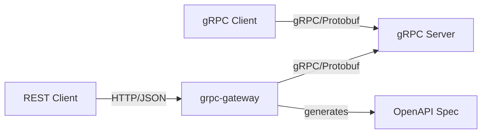

# How to Transcode gRPC to REST with grpc-gateway

Author: [nawazdhandala](https://www.github.com/nawazdhandala)

Tags: grpc, rest, grpc-gateway, api, transcoding, openapi, golang, microservices

Description: Learn how to expose your gRPC services as RESTful APIs using grpc-gateway with proto annotations, HTTP mapping, and automatic OpenAPI generation.

---

## Introduction

gRPC offers excellent performance and type safety for microservices communication, but many clients—especially web browsers and legacy systems—still require REST APIs. grpc-gateway solves this problem by automatically generating a reverse proxy that translates RESTful HTTP API calls into gRPC.

This guide covers setting up grpc-gateway from scratch, adding HTTP annotations to your proto files, generating OpenAPI documentation, and handling errors gracefully.

## Architecture Overview



The grpc-gateway acts as a translation layer, allowing you to maintain a single gRPC service while supporting both gRPC and REST clients.

## Prerequisites

Before starting, ensure you have:

- Go 1.21 or later
- Protocol Buffers compiler (protoc)
- Basic understanding of gRPC and Protocol Buffers

## Project Setup

### Step 1: Initialize the Project

```bash
mkdir grpc-gateway-demo
cd grpc-gateway-demo
go mod init github.com/example/grpc-gateway-demo
```

### Step 2: Install Dependencies

```bash
# Install protoc plugins
go install google.golang.org/protobuf/cmd/protoc-gen-go@latest
go install google.golang.org/grpc/cmd/protoc-gen-go-grpc@latest
go install github.com/grpc-ecosystem/grpc-gateway/v2/protoc-gen-grpc-gateway@latest
go install github.com/grpc-ecosystem/grpc-gateway/v2/protoc-gen-openapiv2@latest

# Add to PATH
export PATH="$PATH:$(go env GOPATH)/bin"
```

### Step 3: Create Project Structure

```bash
mkdir -p proto/api/v1
mkdir -p pkg/api/v1
mkdir -p cmd/server
mkdir -p cmd/gateway
mkdir -p third_party/google/api
```

### Step 4: Download Google API Annotations

```bash
# Download required proto files
curl -L https://raw.githubusercontent.com/googleapis/googleapis/master/google/api/annotations.proto \
  -o third_party/google/api/annotations.proto

curl -L https://raw.githubusercontent.com/googleapis/googleapis/master/google/api/http.proto \
  -o third_party/google/api/http.proto

curl -L https://raw.githubusercontent.com/googleapis/googleapis/master/google/api/field_behavior.proto \
  -o third_party/google/api/field_behavior.proto
```

## Defining the Proto File with HTTP Annotations

### Step 5: Create the Service Definition

Create `proto/api/v1/user_service.proto`:

```protobuf
syntax = "proto3";

package api.v1;

option go_package = "github.com/example/grpc-gateway-demo/pkg/api/v1;apiv1";

import "google/api/annotations.proto";
import "google/api/field_behavior.proto";
import "protoc-gen-openapiv2/options/annotations.proto";

// OpenAPI metadata for the service
option (grpc.gateway.protoc_gen_openapiv2.options.openapiv2_swagger) = {
  info: {
    title: "User Service API"
    version: "1.0"
    description: "A service for managing users"
    contact: {
      name: "API Support"
      email: "support@example.com"
    }
  }
  schemes: HTTP
  schemes: HTTPS
  consumes: "application/json"
  produces: "application/json"
  security_definitions: {
    security: {
      key: "bearer"
      value: {
        type: TYPE_API_KEY
        in: IN_HEADER
        name: "Authorization"
        description: "Bearer token authentication"
      }
    }
  }
};

// User represents a user in the system
message User {
  // Unique identifier for the user
  string id = 1 [(google.api.field_behavior) = OUTPUT_ONLY];

  // User's email address
  string email = 2 [(google.api.field_behavior) = REQUIRED];

  // User's display name
  string name = 3 [(google.api.field_behavior) = REQUIRED];

  // User's role in the system
  UserRole role = 4;

  // Account creation timestamp
  string created_at = 5 [(google.api.field_behavior) = OUTPUT_ONLY];

  // Last update timestamp
  string updated_at = 6 [(google.api.field_behavior) = OUTPUT_ONLY];
}

// UserRole defines available user roles
enum UserRole {
  USER_ROLE_UNSPECIFIED = 0;
  USER_ROLE_ADMIN = 1;
  USER_ROLE_MEMBER = 2;
  USER_ROLE_GUEST = 3;
}

// Request to create a new user
message CreateUserRequest {
  // The user to create
  User user = 1 [(google.api.field_behavior) = REQUIRED];
}

// Request to get a user by ID
message GetUserRequest {
  // The user's unique identifier
  string id = 1 [(google.api.field_behavior) = REQUIRED];
}

// Request to update an existing user
message UpdateUserRequest {
  // The user's unique identifier
  string id = 1 [(google.api.field_behavior) = REQUIRED];

  // The updated user data
  User user = 2 [(google.api.field_behavior) = REQUIRED];
}

// Request to delete a user
message DeleteUserRequest {
  // The user's unique identifier
  string id = 1 [(google.api.field_behavior) = REQUIRED];
}

// Empty response for delete operations
message DeleteUserResponse {}

// Request to list users with pagination
message ListUsersRequest {
  // Maximum number of users to return
  int32 page_size = 1;

  // Token for pagination
  string page_token = 2;

  // Optional filter by role
  UserRole role_filter = 3;
}

// Response containing a list of users
message ListUsersResponse {
  // The list of users
  repeated User users = 1;

  // Token for the next page
  string next_page_token = 2;

  // Total count of users matching the filter
  int32 total_count = 3;
}

// UserService manages user operations
service UserService {
  // CreateUser creates a new user
  rpc CreateUser(CreateUserRequest) returns (User) {
    option (google.api.http) = {
      post: "/api/v1/users"
      body: "user"
    };
    option (grpc.gateway.protoc_gen_openapiv2.options.openapiv2_operation) = {
      summary: "Create a new user"
      description: "Creates a new user with the provided details"
      tags: "Users"
    };
  }

  // GetUser retrieves a user by ID
  rpc GetUser(GetUserRequest) returns (User) {
    option (google.api.http) = {
      get: "/api/v1/users/{id}"
    };
    option (grpc.gateway.protoc_gen_openapiv2.options.openapiv2_operation) = {
      summary: "Get a user"
      description: "Retrieves a user by their unique identifier"
      tags: "Users"
    };
  }

  // UpdateUser updates an existing user
  rpc UpdateUser(UpdateUserRequest) returns (User) {
    option (google.api.http) = {
      put: "/api/v1/users/{id}"
      body: "user"
      additional_bindings {
        patch: "/api/v1/users/{id}"
        body: "user"
      }
    };
    option (grpc.gateway.protoc_gen_openapiv2.options.openapiv2_operation) = {
      summary: "Update a user"
      description: "Updates an existing user's information"
      tags: "Users"
    };
  }

  // DeleteUser removes a user
  rpc DeleteUser(DeleteUserRequest) returns (DeleteUserResponse) {
    option (google.api.http) = {
      delete: "/api/v1/users/{id}"
    };
    option (grpc.gateway.protoc_gen_openapiv2.options.openapiv2_operation) = {
      summary: "Delete a user"
      description: "Permanently removes a user from the system"
      tags: "Users"
    };
  }

  // ListUsers returns a paginated list of users
  rpc ListUsers(ListUsersRequest) returns (ListUsersResponse) {
    option (google.api.http) = {
      get: "/api/v1/users"
    };
    option (grpc.gateway.protoc_gen_openapiv2.options.openapiv2_operation) = {
      summary: "List users"
      description: "Returns a paginated list of users with optional filtering"
      tags: "Users"
    };
  }
}
```

## Understanding HTTP Mapping Rules

### Path Parameters

Path parameters are extracted from the URL and mapped to message fields:

```protobuf
rpc GetUser(GetUserRequest) returns (User) {
  option (google.api.http) = {
    get: "/api/v1/users/{id}"  // {id} maps to GetUserRequest.id
  };
}
```

### Query Parameters

For GET requests, non-path fields become query parameters:

```protobuf
// GET /api/v1/users?page_size=10&page_token=abc&role_filter=1
rpc ListUsers(ListUsersRequest) returns (ListUsersResponse) {
  option (google.api.http) = {
    get: "/api/v1/users"
  };
}
```

### Request Body Mapping

The `body` field specifies which message field contains the HTTP body:

```protobuf
rpc CreateUser(CreateUserRequest) returns (User) {
  option (google.api.http) = {
    post: "/api/v1/users"
    body: "user"  // Only the 'user' field is taken from the body
  };
}

// Use body: "*" to map the entire request message to the body
rpc CreateUser(User) returns (User) {
  option (google.api.http) = {
    post: "/api/v1/users"
    body: "*"  // Entire User message comes from body
  };
}
```

### Additional Bindings

Support multiple HTTP methods for the same RPC:

```protobuf
rpc UpdateUser(UpdateUserRequest) returns (User) {
  option (google.api.http) = {
    put: "/api/v1/users/{id}"
    body: "user"
    additional_bindings {
      patch: "/api/v1/users/{id}"
      body: "user"
    }
  };
}
```

## Code Generation

### Step 6: Create Generation Script

Create `buf.gen.yaml` or use a shell script `generate.sh`:

```bash
#!/bin/bash

PROTO_DIR=proto
OUT_DIR=pkg
THIRD_PARTY_DIR=third_party

# Download OpenAPI annotations
mkdir -p ${THIRD_PARTY_DIR}/protoc-gen-openapiv2/options
curl -sL https://raw.githubusercontent.com/grpc-ecosystem/grpc-gateway/main/protoc-gen-openapiv2/options/annotations.proto \
  -o ${THIRD_PARTY_DIR}/protoc-gen-openapiv2/options/annotations.proto
curl -sL https://raw.githubusercontent.com/grpc-ecosystem/grpc-gateway/main/protoc-gen-openapiv2/options/openapiv2.proto \
  -o ${THIRD_PARTY_DIR}/protoc-gen-openapiv2/options/openapiv2.proto

# Generate Go code, gRPC stubs, gateway, and OpenAPI spec
protoc -I ${PROTO_DIR} \
  -I ${THIRD_PARTY_DIR} \
  --go_out=${OUT_DIR} \
  --go_opt=paths=source_relative \
  --go-grpc_out=${OUT_DIR} \
  --go-grpc_opt=paths=source_relative \
  --grpc-gateway_out=${OUT_DIR} \
  --grpc-gateway_opt=paths=source_relative \
  --grpc-gateway_opt=generate_unbound_methods=true \
  --openapiv2_out=. \
  --openapiv2_opt=allow_merge=true \
  --openapiv2_opt=merge_file_name=api \
  ${PROTO_DIR}/api/v1/*.proto

echo "Code generation complete!"
```

Run the generation:

```bash
chmod +x generate.sh
./generate.sh
```

## Implementing the gRPC Server

### Step 7: Create the Server Implementation

Create `cmd/server/main.go`:

```go
package main

import (
	"context"
	"fmt"
	"log"
	"net"
	"sync"
	"time"

	"google.golang.org/grpc"
	"google.golang.org/grpc/codes"
	"google.golang.org/grpc/reflection"
	"google.golang.org/grpc/status"

	pb "github.com/example/grpc-gateway-demo/pkg/api/v1"
	"github.com/google/uuid"
)

// UserServer implements the UserService
type UserServer struct {
	pb.UnimplementedUserServiceServer
	mu    sync.RWMutex
	users map[string]*pb.User
}

// NewUserServer creates a new UserServer instance
func NewUserServer() *UserServer {
	return &UserServer{
		users: make(map[string]*pb.User),
	}
}

// CreateUser creates a new user
func (s *UserServer) CreateUser(ctx context.Context, req *pb.CreateUserRequest) (*pb.User, error) {
	if req.User == nil {
		return nil, status.Error(codes.InvalidArgument, "user is required")
	}
	if req.User.Email == "" {
		return nil, status.Error(codes.InvalidArgument, "email is required")
	}
	if req.User.Name == "" {
		return nil, status.Error(codes.InvalidArgument, "name is required")
	}

	s.mu.Lock()
	defer s.mu.Unlock()

	// Check for duplicate email
	for _, existing := range s.users {
		if existing.Email == req.User.Email {
			return nil, status.Error(codes.AlreadyExists, "user with this email already exists")
		}
	}

	user := &pb.User{
		Id:        uuid.New().String(),
		Email:     req.User.Email,
		Name:      req.User.Name,
		Role:      req.User.Role,
		CreatedAt: time.Now().UTC().Format(time.RFC3339),
		UpdatedAt: time.Now().UTC().Format(time.RFC3339),
	}

	s.users[user.Id] = user
	log.Printf("Created user: %s (%s)", user.Name, user.Id)

	return user, nil
}

// GetUser retrieves a user by ID
func (s *UserServer) GetUser(ctx context.Context, req *pb.GetUserRequest) (*pb.User, error) {
	if req.Id == "" {
		return nil, status.Error(codes.InvalidArgument, "id is required")
	}

	s.mu.RLock()
	defer s.mu.RUnlock()

	user, exists := s.users[req.Id]
	if !exists {
		return nil, status.Error(codes.NotFound, "user not found")
	}

	return user, nil
}

// UpdateUser updates an existing user
func (s *UserServer) UpdateUser(ctx context.Context, req *pb.UpdateUserRequest) (*pb.User, error) {
	if req.Id == "" {
		return nil, status.Error(codes.InvalidArgument, "id is required")
	}
	if req.User == nil {
		return nil, status.Error(codes.InvalidArgument, "user is required")
	}

	s.mu.Lock()
	defer s.mu.Unlock()

	existing, exists := s.users[req.Id]
	if !exists {
		return nil, status.Error(codes.NotFound, "user not found")
	}

	// Update fields
	if req.User.Email != "" {
		existing.Email = req.User.Email
	}
	if req.User.Name != "" {
		existing.Name = req.User.Name
	}
	if req.User.Role != pb.UserRole_USER_ROLE_UNSPECIFIED {
		existing.Role = req.User.Role
	}
	existing.UpdatedAt = time.Now().UTC().Format(time.RFC3339)

	log.Printf("Updated user: %s (%s)", existing.Name, existing.Id)

	return existing, nil
}

// DeleteUser removes a user
func (s *UserServer) DeleteUser(ctx context.Context, req *pb.DeleteUserRequest) (*pb.DeleteUserResponse, error) {
	if req.Id == "" {
		return nil, status.Error(codes.InvalidArgument, "id is required")
	}

	s.mu.Lock()
	defer s.mu.Unlock()

	if _, exists := s.users[req.Id]; !exists {
		return nil, status.Error(codes.NotFound, "user not found")
	}

	delete(s.users, req.Id)
	log.Printf("Deleted user: %s", req.Id)

	return &pb.DeleteUserResponse{}, nil
}

// ListUsers returns a paginated list of users
func (s *UserServer) ListUsers(ctx context.Context, req *pb.ListUsersRequest) (*pb.ListUsersResponse, error) {
	s.mu.RLock()
	defer s.mu.RUnlock()

	pageSize := int(req.PageSize)
	if pageSize <= 0 {
		pageSize = 10
	}
	if pageSize > 100 {
		pageSize = 100
	}

	var filteredUsers []*pb.User
	for _, user := range s.users {
		if req.RoleFilter != pb.UserRole_USER_ROLE_UNSPECIFIED && user.Role != req.RoleFilter {
			continue
		}
		filteredUsers = append(filteredUsers, user)
	}

	// Simple pagination (in production, use cursor-based pagination)
	startIndex := 0
	if req.PageToken != "" {
		// Decode page token (simplified)
		fmt.Sscanf(req.PageToken, "%d", &startIndex)
	}

	endIndex := startIndex + pageSize
	if endIndex > len(filteredUsers) {
		endIndex = len(filteredUsers)
	}

	var nextPageToken string
	if endIndex < len(filteredUsers) {
		nextPageToken = fmt.Sprintf("%d", endIndex)
	}

	return &pb.ListUsersResponse{
		Users:         filteredUsers[startIndex:endIndex],
		NextPageToken: nextPageToken,
		TotalCount:    int32(len(filteredUsers)),
	}, nil
}

func main() {
	listener, err := net.Listen("tcp", ":50051")
	if err != nil {
		log.Fatalf("Failed to listen: %v", err)
	}

	server := grpc.NewServer()
	pb.RegisterUserServiceServer(server, NewUserServer())

	// Enable reflection for debugging
	reflection.Register(server)

	log.Println("gRPC server listening on :50051")
	if err := server.Serve(listener); err != nil {
		log.Fatalf("Failed to serve: %v", err)
	}
}
```

## Implementing the Gateway

### Step 8: Create the Gateway Server

Create `cmd/gateway/main.go`:

```go
package main

import (
	"context"
	"fmt"
	"io/fs"
	"log"
	"mime"
	"net/http"
	"os"
	"os/signal"
	"strings"
	"syscall"
	"time"

	"github.com/grpc-ecosystem/grpc-gateway/v2/runtime"
	"google.golang.org/grpc"
	"google.golang.org/grpc/credentials/insecure"
	"google.golang.org/grpc/status"
	"google.golang.org/protobuf/encoding/protojson"

	pb "github.com/example/grpc-gateway-demo/pkg/api/v1"
)

const (
	grpcServerEndpoint = "localhost:50051"
	httpPort           = ":8080"
)

// CustomErrorHandler handles gRPC errors and converts them to HTTP responses
func CustomErrorHandler(ctx context.Context, mux *runtime.ServeMux, marshaler runtime.Marshaler, w http.ResponseWriter, r *http.Request, err error) {
	st := status.Convert(err)

	// Map gRPC codes to HTTP status codes
	httpStatus := runtime.HTTPStatusFromCode(st.Code())

	// Create custom error response
	errorResponse := map[string]interface{}{
		"error": map[string]interface{}{
			"code":    int(st.Code()),
			"message": st.Message(),
			"status":  st.Code().String(),
		},
		"request_id": r.Header.Get("X-Request-ID"),
		"timestamp":  time.Now().UTC().Format(time.RFC3339),
	}

	w.Header().Set("Content-Type", "application/json")
	w.WriteHeader(httpStatus)

	if err := marshaler.NewEncoder(w).Encode(errorResponse); err != nil {
		log.Printf("Failed to encode error response: %v", err)
	}
}

// loggingMiddleware logs all incoming requests
func loggingMiddleware(next http.Handler) http.Handler {
	return http.HandlerFunc(func(w http.ResponseWriter, r *http.Request) {
		start := time.Now()

		// Create a response wrapper to capture status code
		wrapper := &responseWrapper{ResponseWriter: w, statusCode: http.StatusOK}

		next.ServeHTTP(wrapper, r)

		log.Printf(
			"%s %s %d %s %s",
			r.Method,
			r.URL.Path,
			wrapper.statusCode,
			time.Since(start),
			r.RemoteAddr,
		)
	})
}

type responseWrapper struct {
	http.ResponseWriter
	statusCode int
}

func (rw *responseWrapper) WriteHeader(code int) {
	rw.statusCode = code
	rw.ResponseWriter.WriteHeader(code)
}

// corsMiddleware adds CORS headers
func corsMiddleware(next http.Handler) http.Handler {
	return http.HandlerFunc(func(w http.ResponseWriter, r *http.Request) {
		w.Header().Set("Access-Control-Allow-Origin", "*")
		w.Header().Set("Access-Control-Allow-Methods", "GET, POST, PUT, PATCH, DELETE, OPTIONS")
		w.Header().Set("Access-Control-Allow-Headers", "Content-Type, Authorization, X-Request-ID")
		w.Header().Set("Access-Control-Max-Age", "86400")

		if r.Method == "OPTIONS" {
			w.WriteHeader(http.StatusNoContent)
			return
		}

		next.ServeHTTP(w, r)
	})
}

// healthHandler provides health check endpoint
func healthHandler(w http.ResponseWriter, r *http.Request) {
	w.Header().Set("Content-Type", "application/json")
	w.WriteHeader(http.StatusOK)
	w.Write([]byte(`{"status": "healthy", "service": "grpc-gateway"}`))
}

// swaggerHandler serves the OpenAPI specification
func swaggerHandler(w http.ResponseWriter, r *http.Request) {
	// Serve the generated OpenAPI spec
	spec, err := os.ReadFile("api.swagger.json")
	if err != nil {
		http.Error(w, "OpenAPI spec not found", http.StatusNotFound)
		return
	}

	w.Header().Set("Content-Type", "application/json")
	w.Write(spec)
}

func run() error {
	ctx, cancel := context.WithCancel(context.Background())
	defer cancel()

	// Configure JSON marshaling options
	jsonOpts := runtime.WithMarshalerOption(runtime.MIMEWildcard, &runtime.JSONPb{
		MarshalOptions: protojson.MarshalOptions{
			UseProtoNames:   true,  // Use snake_case field names
			EmitUnpopulated: false, // Don't emit zero values
		},
		UnmarshalOptions: protojson.UnmarshalOptions{
			DiscardUnknown: true, // Ignore unknown fields
		},
	})

	// Create gateway mux with custom options
	mux := runtime.NewServeMux(
		jsonOpts,
		runtime.WithErrorHandler(CustomErrorHandler),
		runtime.WithIncomingHeaderMatcher(func(key string) (string, bool) {
			// Forward specific headers to gRPC
			switch strings.ToLower(key) {
			case "x-request-id", "x-correlation-id", "authorization":
				return key, true
			}
			return runtime.DefaultHeaderMatcher(key)
		}),
		runtime.WithOutgoingHeaderMatcher(func(key string) (string, bool) {
			// Forward specific response headers
			return key, true
		}),
	)

	// Set up gRPC connection
	opts := []grpc.DialOption{
		grpc.WithTransportCredentials(insecure.NewCredentials()),
		grpc.WithBlock(),
	}

	// Register the service handler
	conn, err := grpc.DialContext(ctx, grpcServerEndpoint, opts...)
	if err != nil {
		return fmt.Errorf("failed to dial gRPC server: %w", err)
	}
	defer conn.Close()

	if err := pb.RegisterUserServiceHandler(ctx, mux, conn); err != nil {
		return fmt.Errorf("failed to register gateway: %w", err)
	}

	// Create HTTP server with routes
	httpMux := http.NewServeMux()

	// Health check endpoint
	httpMux.HandleFunc("/health", healthHandler)
	httpMux.HandleFunc("/healthz", healthHandler)

	// OpenAPI spec endpoint
	httpMux.HandleFunc("/swagger.json", swaggerHandler)
	httpMux.HandleFunc("/openapi.json", swaggerHandler)

	// API routes through gateway
	httpMux.Handle("/", mux)

	// Apply middleware
	handler := corsMiddleware(loggingMiddleware(httpMux))

	// Create server
	server := &http.Server{
		Addr:         httpPort,
		Handler:      handler,
		ReadTimeout:  10 * time.Second,
		WriteTimeout: 30 * time.Second,
		IdleTimeout:  60 * time.Second,
	}

	// Graceful shutdown
	go func() {
		sigCh := make(chan os.Signal, 1)
		signal.Notify(sigCh, syscall.SIGINT, syscall.SIGTERM)
		<-sigCh

		log.Println("Shutting down gateway...")
		shutdownCtx, shutdownCancel := context.WithTimeout(context.Background(), 10*time.Second)
		defer shutdownCancel()

		server.Shutdown(shutdownCtx)
	}()

	log.Printf("HTTP gateway listening on %s", httpPort)
	log.Printf("gRPC backend: %s", grpcServerEndpoint)
	log.Printf("OpenAPI spec: http://localhost%s/swagger.json", httpPort)

	return server.ListenAndServe()
}

func main() {
	if err := run(); err != nil && err != http.ErrServerClosed {
		log.Fatalf("Gateway error: %v", err)
	}
}
```

## Error Handling and Status Mapping

### Custom Error Details

Extend error handling with detailed error information:

```go
package errors

import (
	"google.golang.org/genproto/googleapis/rpc/errdetails"
	"google.golang.org/grpc/codes"
	"google.golang.org/grpc/status"
)

// ValidationError creates a status with field violations
func ValidationError(violations map[string]string) error {
	st := status.New(codes.InvalidArgument, "validation failed")

	var fieldViolations []*errdetails.BadRequest_FieldViolation
	for field, description := range violations {
		fieldViolations = append(fieldViolations, &errdetails.BadRequest_FieldViolation{
			Field:       field,
			Description: description,
		})
	}

	br := &errdetails.BadRequest{
		FieldViolations: fieldViolations,
	}

	st, err := st.WithDetails(br)
	if err != nil {
		return status.Error(codes.InvalidArgument, "validation failed")
	}

	return st.Err()
}

// NotFoundError creates a not found status with resource info
func NotFoundError(resourceType, resourceName string) error {
	st := status.New(codes.NotFound, "resource not found")

	ri := &errdetails.ResourceInfo{
		ResourceType: resourceType,
		ResourceName: resourceName,
		Description:  "The requested resource was not found",
	}

	st, err := st.WithDetails(ri)
	if err != nil {
		return status.Error(codes.NotFound, "resource not found")
	}

	return st.Err()
}

// RateLimitError creates a rate limit exceeded status
func RateLimitError(retryAfterSeconds int64) error {
	st := status.New(codes.ResourceExhausted, "rate limit exceeded")

	ri := &errdetails.RetryInfo{
		RetryDelay: &durationpb.Duration{
			Seconds: retryAfterSeconds,
		},
	}

	st, err := st.WithDetails(ri)
	if err != nil {
		return status.Error(codes.ResourceExhausted, "rate limit exceeded")
	}

	return st.Err()
}
```

### Enhanced Error Handler

```go
func EnhancedErrorHandler(ctx context.Context, mux *runtime.ServeMux, marshaler runtime.Marshaler, w http.ResponseWriter, r *http.Request, err error) {
	st := status.Convert(err)
	httpStatus := runtime.HTTPStatusFromCode(st.Code())

	response := map[string]interface{}{
		"error": map[string]interface{}{
			"code":    int(st.Code()),
			"message": st.Message(),
			"status":  st.Code().String(),
		},
	}

	// Extract error details
	for _, detail := range st.Details() {
		switch d := detail.(type) {
		case *errdetails.BadRequest:
			var violations []map[string]string
			for _, v := range d.FieldViolations {
				violations = append(violations, map[string]string{
					"field":       v.Field,
					"description": v.Description,
				})
			}
			response["error"].(map[string]interface{})["details"] = map[string]interface{}{
				"field_violations": violations,
			}
		case *errdetails.ResourceInfo:
			response["error"].(map[string]interface{})["details"] = map[string]interface{}{
				"resource_type": d.ResourceType,
				"resource_name": d.ResourceName,
			}
		case *errdetails.RetryInfo:
			w.Header().Set("Retry-After", fmt.Sprintf("%d", d.RetryDelay.Seconds))
			response["error"].(map[string]interface{})["retry_after"] = d.RetryDelay.Seconds
		}
	}

	w.Header().Set("Content-Type", "application/json")
	w.WriteHeader(httpStatus)
	marshaler.NewEncoder(w).Encode(response)
}
```

## OpenAPI Generation and Customization

### Customize OpenAPI Output

Add more annotations to your proto file for richer documentation:

```protobuf
// In your proto file
option (grpc.gateway.protoc_gen_openapiv2.options.openapiv2_swagger) = {
  info: {
    title: "User Service API"
    version: "1.0.0"
    description: "RESTful API for user management"
    contact: {
      name: "API Support"
      url: "https://example.com/support"
      email: "api@example.com"
    }
    license: {
      name: "Apache 2.0"
      url: "https://www.apache.org/licenses/LICENSE-2.0"
    }
  }
  host: "api.example.com"
  base_path: "/"
  schemes: HTTPS
  consumes: "application/json"
  produces: "application/json"
  responses: {
    key: "401"
    value: {
      description: "Unauthorized - Invalid or missing authentication"
    }
  }
  responses: {
    key: "403"
    value: {
      description: "Forbidden - Insufficient permissions"
    }
  }
  responses: {
    key: "500"
    value: {
      description: "Internal server error"
    }
  }
  security_definitions: {
    security: {
      key: "BearerAuth"
      value: {
        type: TYPE_API_KEY
        in: IN_HEADER
        name: "Authorization"
        description: "Enter 'Bearer {token}'"
      }
    }
  }
  security: {
    security_requirement: {
      key: "BearerAuth"
      value: {}
    }
  }
};
```

### Serve Swagger UI

Add Swagger UI to visualize your API:

```go
// Add to gateway main.go
func swaggerUIHandler() http.Handler {
	return http.HandlerFunc(func(w http.ResponseWriter, r *http.Request) {
		html := `
<!DOCTYPE html>
<html>
<head>
  <title>API Documentation</title>
  <link rel="stylesheet" href="https://unpkg.com/swagger-ui-dist@4/swagger-ui.css">
</head>
<body>
  <div id="swagger-ui"></div>
  <script src="https://unpkg.com/swagger-ui-dist@4/swagger-ui-bundle.js"></script>
  <script>
    SwaggerUIBundle({
      url: "/swagger.json",
      dom_id: '#swagger-ui',
      presets: [SwaggerUIBundle.presets.apis, SwaggerUIBundle.SwaggerUIStandalonePreset],
      layout: "BaseLayout"
    });
  </script>
</body>
</html>`
		w.Header().Set("Content-Type", "text/html")
		w.Write([]byte(html))
	})
}

// Register in main
httpMux.Handle("/docs", swaggerUIHandler())
httpMux.Handle("/docs/", swaggerUIHandler())
```

## Testing the Gateway

### Start Both Servers

```bash
# Terminal 1: Start gRPC server
go run cmd/server/main.go

# Terminal 2: Start gateway
go run cmd/gateway/main.go
```

### Test with cURL

```bash
# Create a user
curl -X POST http://localhost:8080/api/v1/users \
  -H "Content-Type: application/json" \
  -d '{
    "email": "john@example.com",
    "name": "John Doe",
    "role": "USER_ROLE_MEMBER"
  }'

# Get a user
curl http://localhost:8080/api/v1/users/{user_id}

# List users with pagination
curl "http://localhost:8080/api/v1/users?page_size=10&role_filter=2"

# Update a user
curl -X PUT http://localhost:8080/api/v1/users/{user_id} \
  -H "Content-Type: application/json" \
  -d '{
    "name": "John Updated",
    "role": "USER_ROLE_ADMIN"
  }'

# Delete a user
curl -X DELETE http://localhost:8080/api/v1/users/{user_id}

# Check health
curl http://localhost:8080/health

# Get OpenAPI spec
curl http://localhost:8080/swagger.json
```

## Production Considerations

### 1. TLS Configuration

```go
// For production, use TLS
tlsConfig := &tls.Config{
    MinVersion: tls.VersionTLS12,
    CurvePreferences: []tls.CurveID{
        tls.CurveP256,
        tls.X25519,
    },
}

server := &http.Server{
    Addr:      ":443",
    Handler:   handler,
    TLSConfig: tlsConfig,
}

server.ListenAndServeTLS("cert.pem", "key.pem")
```

### 2. Rate Limiting

```go
import "golang.org/x/time/rate"

func rateLimitMiddleware(limiter *rate.Limiter) func(http.Handler) http.Handler {
    return func(next http.Handler) http.Handler {
        return http.HandlerFunc(func(w http.ResponseWriter, r *http.Request) {
            if !limiter.Allow() {
                http.Error(w, "Too many requests", http.StatusTooManyRequests)
                return
            }
            next.ServeHTTP(w, r)
        })
    }
}
```

### 3. Request Validation

```go
func validationMiddleware(next http.Handler) http.Handler {
    return http.HandlerFunc(func(w http.ResponseWriter, r *http.Request) {
        // Validate Content-Type
        if r.Method == "POST" || r.Method == "PUT" || r.Method == "PATCH" {
            contentType := r.Header.Get("Content-Type")
            if !strings.HasPrefix(contentType, "application/json") {
                http.Error(w, "Content-Type must be application/json", http.StatusUnsupportedMediaType)
                return
            }
        }

        // Validate request size
        r.Body = http.MaxBytesReader(w, r.Body, 1<<20) // 1MB max

        next.ServeHTTP(w, r)
    })
}
```

## Summary

grpc-gateway provides a powerful solution for exposing gRPC services as RESTful APIs. Key takeaways:

1. **Proto Annotations**: Use `google.api.http` annotations to define HTTP mappings directly in your proto files
2. **Code Generation**: Generate gateway code alongside your gRPC stubs for consistency
3. **Error Handling**: Implement custom error handlers to provide meaningful HTTP error responses
4. **OpenAPI**: Leverage automatic OpenAPI generation for documentation and client SDK generation
5. **Middleware**: Add logging, CORS, and rate limiting at the gateway layer
6. **Production Ready**: Configure TLS, timeouts, and graceful shutdown for production deployments

This approach allows you to maintain a single source of truth (proto files) while supporting both gRPC and REST clients, making it ideal for gradual migrations and supporting diverse client ecosystems.
