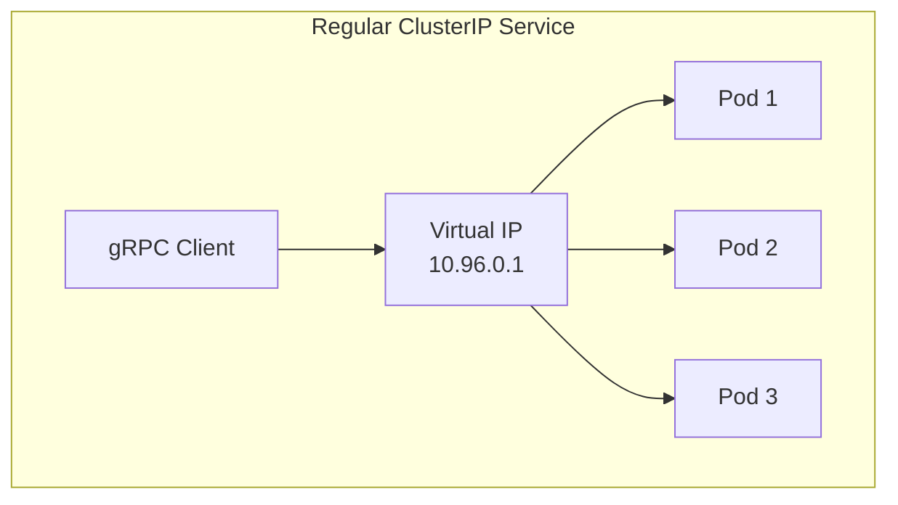
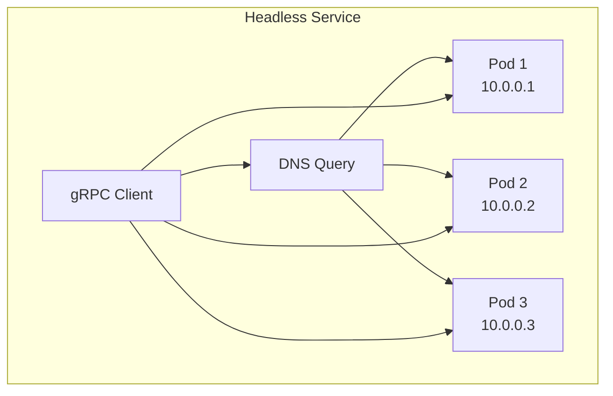

# How to Configure Headless Services for gRPC in Kubernetes

Author: [nawazdhandala](https://www.github.com/nawazdhandala)

Tags: gRPC, Kubernetes, Headless Services, Client-Side Load Balancing, DNS, Service Discovery, Microservices

Description: Learn how to configure Kubernetes headless services for gRPC to enable client-side load balancing and direct pod-to-pod communication with DNS-based service discovery.

---

Headless services in Kubernetes provide direct access to individual pod IPs through DNS, making them ideal for gRPC's client-side load balancing. Unlike regular ClusterIP services that provide a single virtual IP, headless services return all pod IPs, enabling gRPC clients to maintain connections to multiple backends and distribute requests efficiently.

## Understanding Headless Services

A headless service is a Kubernetes Service without a cluster IP. Instead of load balancing through kube-proxy, it exposes the IP addresses of all pods directly via DNS.





## Why Headless Services for gRPC?

gRPC uses HTTP/2 with persistent connections and multiplexing. With regular services:

1. **Connection Persistence**: gRPC maintains long-lived connections
2. **No Request-Level Load Balancing**: Once connected to a pod through kube-proxy, all requests go to that pod
3. **Uneven Load Distribution**: New pods don't receive traffic from existing connections

Headless services solve this by enabling client-side load balancing:

1. **Direct Pod Access**: Clients connect directly to pods
2. **Client-Side LB**: gRPC client distributes requests across connections
3. **Dynamic Updates**: DNS changes reflect pod additions/removals

## Creating a Headless Service

### Basic Headless Service Configuration

```yaml
# headless-service.yaml
apiVersion: v1
kind: Service
metadata:
  name: grpc-service-headless
  namespace: grpc-services
  labels:
    app: grpc-service
spec:
  clusterIP: None  # This makes it headless
  selector:
    app: grpc-service
  ports:
    - name: grpc
      port: 50051
      targetPort: 50051
      protocol: TCP
```

### Complete Deployment with Headless Service

```yaml
# complete-headless-deployment.yaml
apiVersion: v1
kind: Namespace
metadata:
  name: grpc-services
---
apiVersion: apps/v1
kind: Deployment
metadata:
  name: grpc-service
  namespace: grpc-services
spec:
  replicas: 5
  selector:
    matchLabels:
      app: grpc-service
  template:
    metadata:
      labels:
        app: grpc-service
        version: v1
    spec:
      containers:
        - name: grpc-server
          image: your-registry/grpc-service:v1.0.0
          ports:
            - containerPort: 50051
              name: grpc
          readinessProbe:
            grpc:
              port: 50051
            initialDelaySeconds: 5
            periodSeconds: 10
          resources:
            requests:
              cpu: 100m
              memory: 128Mi
            limits:
              cpu: 500m
              memory: 512Mi
---
# Headless Service for client-side load balancing
apiVersion: v1
kind: Service
metadata:
  name: grpc-service-headless
  namespace: grpc-services
spec:
  clusterIP: None
  selector:
    app: grpc-service
  ports:
    - name: grpc
      port: 50051
      targetPort: 50051
---
# Regular Service for external access (optional)
apiVersion: v1
kind: Service
metadata:
  name: grpc-service
  namespace: grpc-services
spec:
  type: ClusterIP
  selector:
    app: grpc-service
  ports:
    - name: grpc
      port: 50051
      targetPort: 50051
```

## DNS Resolution with Headless Services

### Understanding DNS Records

For a headless service named `grpc-service-headless` in namespace `grpc-services`:

```bash
# A record returns all pod IPs
$ nslookup grpc-service-headless.grpc-services.svc.cluster.local

Name:    grpc-service-headless.grpc-services.svc.cluster.local
Address: 10.244.0.5
Address: 10.244.0.6
Address: 10.244.0.7
Address: 10.244.0.8
Address: 10.244.0.9
```

### SRV Records for Port Discovery

```bash
# SRV record includes port information
$ nslookup -type=SRV _grpc._tcp.grpc-service-headless.grpc-services.svc.cluster.local

_grpc._tcp.grpc-service-headless.grpc-services.svc.cluster.local service = 0 100 50051 10-244-0-5.grpc-service-headless.grpc-services.svc.cluster.local.
_grpc._tcp.grpc-service-headless.grpc-services.svc.cluster.local service = 0 100 50051 10-244-0-6.grpc-service-headless.grpc-services.svc.cluster.local.
```

## Configuring gRPC Client-Side Load Balancing

### Go Client with DNS Resolver

```go
// client/main.go
package main

import (
    "context"
    "log"
    "time"

    "google.golang.org/grpc"
    "google.golang.org/grpc/balancer/roundrobin"
    "google.golang.org/grpc/credentials/insecure"
    "google.golang.org/grpc/resolver"

    pb "github.com/example/grpc-service/proto"
)

func main() {
    // Use dns resolver scheme
    // Format: dns:///service-name:port
    target := "dns:///grpc-service-headless.grpc-services.svc.cluster.local:50051"

    // Create connection with round-robin load balancing
    conn, err := grpc.Dial(
        target,
        grpc.WithTransportCredentials(insecure.NewCredentials()),
        grpc.WithDefaultServiceConfig(`{
            "loadBalancingPolicy": "round_robin",
            "healthCheckConfig": {
                "serviceName": ""
            }
        }`),
    )
    if err != nil {
        log.Fatalf("Failed to connect: %v", err)
    }
    defer conn.Close()

    client := pb.NewGreeterClient(conn)

    // Make requests - they will be distributed across pods
    for i := 0; i < 10; i++ {
        ctx, cancel := context.WithTimeout(context.Background(), time.Second)
        resp, err := client.SayHello(ctx, &pb.HelloRequest{Name: "World"})
        if err != nil {
            log.Printf("Request %d failed: %v", i, err)
        } else {
            log.Printf("Request %d: %s", i, resp.GetMessage())
        }
        cancel()
    }
}
```

### Advanced Go Client Configuration

```go
// client/advanced.go
package main

import (
    "context"
    "log"
    "time"

    "google.golang.org/grpc"
    "google.golang.org/grpc/credentials/insecure"
    "google.golang.org/grpc/keepalive"

    pb "github.com/example/grpc-service/proto"
)

func createConnection() (*grpc.ClientConn, error) {
    // DNS target for headless service
    target := "dns:///grpc-service-headless.grpc-services:50051"

    // Service config with load balancing and retry policies
    serviceConfig := `{
        "loadBalancingPolicy": "round_robin",
        "healthCheckConfig": {
            "serviceName": "greeter.Greeter"
        },
        "methodConfig": [{
            "name": [{"service": "greeter.Greeter"}],
            "waitForReady": true,
            "timeout": "30s",
            "retryPolicy": {
                "maxAttempts": 3,
                "initialBackoff": "0.1s",
                "maxBackoff": "1s",
                "backoffMultiplier": 2,
                "retryableStatusCodes": ["UNAVAILABLE", "RESOURCE_EXHAUSTED"]
            }
        }]
    }`

    // Keepalive parameters for long-lived connections
    keepaliveParams := keepalive.ClientParameters{
        Time:                10 * time.Second, // Ping server every 10 seconds
        Timeout:             3 * time.Second,  // Wait 3 seconds for ping ack
        PermitWithoutStream: true,             // Send pings even without active RPCs
    }

    return grpc.Dial(
        target,
        grpc.WithTransportCredentials(insecure.NewCredentials()),
        grpc.WithDefaultServiceConfig(serviceConfig),
        grpc.WithKeepaliveParams(keepaliveParams),
    )
}

func main() {
    conn, err := createConnection()
    if err != nil {
        log.Fatalf("Failed to connect: %v", err)
    }
    defer conn.Close()

    client := pb.NewGreeterClient(conn)

    // Continuous requests showing load distribution
    ticker := time.NewTicker(100 * time.Millisecond)
    defer ticker.Stop()

    for i := 0; i < 100; i++ {
        <-ticker.C
        ctx, cancel := context.WithTimeout(context.Background(), 5*time.Second)
        resp, err := client.SayHello(ctx, &pb.HelloRequest{Name: "World"})
        if err != nil {
            log.Printf("Error: %v", err)
        } else {
            log.Printf("Response: %s", resp.GetMessage())
        }
        cancel()
    }
}
```

### Python Client with DNS Resolver

```python
# client.py
import grpc
import time
from concurrent import futures

import greeter_pb2
import greeter_pb2_grpc

def create_channel():
    """Create a gRPC channel with client-side load balancing."""

    # DNS target for headless service
    target = "dns:///grpc-service-headless.grpc-services.svc.cluster.local:50051"

    # Channel options for load balancing
    options = [
        # Use round-robin load balancing
        ('grpc.lb_policy_name', 'round_robin'),
        # Enable DNS-based service discovery
        ('grpc.service_config', '{"loadBalancingPolicy": "round_robin"}'),
        # Keepalive settings
        ('grpc.keepalive_time_ms', 10000),
        ('grpc.keepalive_timeout_ms', 5000),
        ('grpc.keepalive_permit_without_calls', True),
        # Maximum message sizes
        ('grpc.max_send_message_length', 4 * 1024 * 1024),
        ('grpc.max_receive_message_length', 4 * 1024 * 1024),
    ]

    return grpc.insecure_channel(target, options=options)

def main():
    channel = create_channel()
    stub = greeter_pb2_grpc.GreeterStub(channel)

    # Make multiple requests to see load distribution
    for i in range(20):
        try:
            response = stub.SayHello(
                greeter_pb2.HelloRequest(name='World'),
                timeout=5.0
            )
            print(f"Request {i}: {response.message}")
        except grpc.RpcError as e:
            print(f"Request {i} failed: {e}")

        time.sleep(0.1)

    channel.close()

if __name__ == '__main__':
    main()
```

### Node.js Client Configuration

```javascript
// client.js
const grpc = require('@grpc/grpc-js');
const protoLoader = require('@grpc/proto-loader');

// Load proto definition
const PROTO_PATH = './proto/greeter.proto';
const packageDefinition = protoLoader.loadSync(PROTO_PATH, {
  keepCase: true,
  longs: String,
  enums: String,
  defaults: true,
  oneofs: true,
});

const greeterProto = grpc.loadPackageDefinition(packageDefinition).greeter;

function createClient() {
  // DNS target for headless service
  const target = 'dns:///grpc-service-headless.grpc-services.svc.cluster.local:50051';

  // Channel options
  const options = {
    // Enable round-robin load balancing
    'grpc.lb_policy_name': 'round_robin',
    // Keepalive settings
    'grpc.keepalive_time_ms': 10000,
    'grpc.keepalive_timeout_ms': 5000,
    'grpc.keepalive_permit_without_calls': 1,
    // Initial reconnect backoff
    'grpc.initial_reconnect_backoff_ms': 1000,
    'grpc.max_reconnect_backoff_ms': 10000,
  };

  return new greeterProto.Greeter(
    target,
    grpc.credentials.createInsecure(),
    options
  );
}

async function main() {
  const client = createClient();

  // Make requests showing load distribution
  for (let i = 0; i < 20; i++) {
    await new Promise((resolve, reject) => {
      client.sayHello({ name: 'World' }, (err, response) => {
        if (err) {
          console.error(`Request ${i} failed:`, err.message);
          reject(err);
        } else {
          console.log(`Request ${i}: ${response.message}`);
          resolve();
        }
      });
    }).catch(() => {});

    await new Promise(resolve => setTimeout(resolve, 100));
  }
}

main();
```

## Custom DNS Resolver Implementation

For more control over service discovery, implement a custom resolver:

```go
// resolver/dns_resolver.go
package resolver

import (
    "context"
    "fmt"
    "net"
    "sync"
    "time"

    "google.golang.org/grpc/resolver"
)

const (
    scheme      = "k8s"
    defaultPort = "50051"
)

func init() {
    resolver.Register(&k8sResolverBuilder{})
}

type k8sResolverBuilder struct{}

func (b *k8sResolverBuilder) Build(target resolver.Target, cc resolver.ClientConn, opts resolver.BuildOptions) (resolver.Resolver, error) {
    r := &k8sResolver{
        target: target,
        cc:     cc,
        ctx:    context.Background(),
    }
    go r.watch()
    return r, nil
}

func (b *k8sResolverBuilder) Scheme() string {
    return scheme
}

type k8sResolver struct {
    target resolver.Target
    cc     resolver.ClientConn
    ctx    context.Context
    cancel context.CancelFunc
    wg     sync.WaitGroup
}

func (r *k8sResolver) watch() {
    r.wg.Add(1)
    defer r.wg.Done()

    ticker := time.NewTicker(5 * time.Second)
    defer ticker.Stop()

    // Initial resolution
    r.resolve()

    for {
        select {
        case <-r.ctx.Done():
            return
        case <-ticker.C:
            r.resolve()
        }
    }
}

func (r *k8sResolver) resolve() {
    // Resolve the service name to IP addresses
    host := r.target.Endpoint()
    addrs, err := net.LookupHost(host)
    if err != nil {
        r.cc.ReportError(fmt.Errorf("DNS lookup failed: %v", err))
        return
    }

    // Build address list
    var resolvedAddrs []resolver.Address
    for _, addr := range addrs {
        resolvedAddrs = append(resolvedAddrs, resolver.Address{
            Addr:       fmt.Sprintf("%s:%s", addr, defaultPort),
            ServerName: host,
        })
    }

    // Update client connection with new addresses
    r.cc.UpdateState(resolver.State{
        Addresses: resolvedAddrs,
    })
}

func (r *k8sResolver) ResolveNow(opts resolver.ResolveNowOptions) {
    r.resolve()
}

func (r *k8sResolver) Close() {
    if r.cancel != nil {
        r.cancel()
    }
    r.wg.Wait()
}

// Usage in client:
// import _ "github.com/example/resolver" // register resolver
// conn, err := grpc.Dial("k8s:///grpc-service-headless.grpc-services", ...)
```

## StatefulSet with Headless Services

For stateful workloads that need stable network identities:

```yaml
# statefulset-headless.yaml
apiVersion: v1
kind: Service
metadata:
  name: grpc-stateful-headless
  namespace: grpc-services
spec:
  clusterIP: None
  selector:
    app: grpc-stateful
  ports:
    - name: grpc
      port: 50051
---
apiVersion: apps/v1
kind: StatefulSet
metadata:
  name: grpc-stateful
  namespace: grpc-services
spec:
  serviceName: grpc-stateful-headless
  replicas: 3
  selector:
    matchLabels:
      app: grpc-stateful
  template:
    metadata:
      labels:
        app: grpc-stateful
    spec:
      containers:
        - name: grpc-server
          image: your-registry/grpc-service:v1.0.0
          ports:
            - containerPort: 50051
              name: grpc
          env:
            - name: POD_NAME
              valueFrom:
                fieldRef:
                  fieldPath: metadata.name
            - name: POD_NAMESPACE
              valueFrom:
                fieldRef:
                  fieldPath: metadata.namespace
          readinessProbe:
            grpc:
              port: 50051
            initialDelaySeconds: 5
            periodSeconds: 10
  podManagementPolicy: Parallel
```

With StatefulSet, pods get predictable DNS names:

```bash
# Individual pod DNS names
grpc-stateful-0.grpc-stateful-headless.grpc-services.svc.cluster.local
grpc-stateful-1.grpc-stateful-headless.grpc-services.svc.cluster.local
grpc-stateful-2.grpc-stateful-headless.grpc-services.svc.cluster.local
```

### Connecting to Specific StatefulSet Pods

```go
// Connect to specific pod in StatefulSet
func connectToSpecificPod(podIndex int) (*grpc.ClientConn, error) {
    target := fmt.Sprintf(
        "grpc-stateful-%d.grpc-stateful-headless.grpc-services.svc.cluster.local:50051",
        podIndex,
    )

    return grpc.Dial(
        target,
        grpc.WithTransportCredentials(insecure.NewCredentials()),
    )
}
```

## Handling DNS Caching and TTL

DNS caching can cause stale endpoints. Configure CoreDNS and clients appropriately:

### CoreDNS Configuration

```yaml
# coredns-configmap.yaml
apiVersion: v1
kind: ConfigMap
metadata:
  name: coredns
  namespace: kube-system
data:
  Corefile: |
    .:53 {
        errors
        health {
           lameduck 5s
        }
        ready
        kubernetes cluster.local in-addr.arpa ip6.arpa {
           pods insecure
           fallthrough in-addr.arpa ip6.arpa
           ttl 10  # Reduce TTL for faster updates
        }
        prometheus :9153
        forward . /etc/resolv.conf {
           max_concurrent 1000
        }
        cache 10  # Cache for 10 seconds
        loop
        reload
        loadbalance
    }
```

### Client-Side DNS TTL Override

```go
// Force DNS re-resolution periodically
func createConnectionWithDNSRefresh() (*grpc.ClientConn, error) {
    target := "dns:///grpc-service-headless.grpc-services:50051"

    // Service config that triggers DNS re-resolution
    serviceConfig := `{
        "loadBalancingPolicy": "round_robin",
        "healthCheckConfig": {
            "serviceName": ""
        }
    }`

    conn, err := grpc.Dial(
        target,
        grpc.WithTransportCredentials(insecure.NewCredentials()),
        grpc.WithDefaultServiceConfig(serviceConfig),
    )
    if err != nil {
        return nil, err
    }

    // Periodically trigger resolver to refresh
    go func() {
        ticker := time.NewTicker(30 * time.Second)
        defer ticker.Stop()
        for range ticker.C {
            conn.ResetConnectBackoff()
        }
    }()

    return conn, nil
}
```

## Comparing Headless vs Regular Services

### When to Use Headless Services

| Use Case | Service Type | Reason |
|----------|--------------|--------|
| gRPC with client-side LB | Headless | Direct pod access |
| Stateful workloads | Headless | Stable identities |
| Pod-to-pod communication | Headless | No proxy overhead |
| External load balancer | Regular | L4 load balancing |
| Simple HTTP services | Regular | kube-proxy handles LB |

### Hybrid Approach

Use both service types for flexibility:

```yaml
# hybrid-services.yaml
# Headless for internal gRPC clients with client-side LB
apiVersion: v1
kind: Service
metadata:
  name: grpc-service-headless
  namespace: grpc-services
spec:
  clusterIP: None
  selector:
    app: grpc-service
  ports:
    - name: grpc
      port: 50051
---
# Regular service for external access through Ingress
apiVersion: v1
kind: Service
metadata:
  name: grpc-service
  namespace: grpc-services
spec:
  type: ClusterIP
  selector:
    app: grpc-service
  ports:
    - name: grpc
      port: 50051
```

## Monitoring and Debugging

### Verify DNS Resolution

```bash
# Create debug pod
kubectl run dns-test --rm -it --image=busybox:1.36 -- sh

# Inside the pod
nslookup grpc-service-headless.grpc-services.svc.cluster.local

# Check SRV records
nslookup -type=SRV _grpc._tcp.grpc-service-headless.grpc-services.svc.cluster.local
```

### Monitor Connection Distribution

Add logging to see which pods receive requests:

```go
// Server-side logging
func (s *server) SayHello(ctx context.Context, req *pb.HelloRequest) (*pb.HelloResponse, error) {
    podName := os.Getenv("POD_NAME")
    log.Printf("Request handled by pod: %s", podName)

    return &pb.HelloResponse{
        Message: fmt.Sprintf("Hello from %s", podName),
    }, nil
}
```

### Prometheus Metrics for Load Distribution

```go
// metrics.go
package main

import (
    "github.com/prometheus/client_golang/prometheus"
    "github.com/prometheus/client_golang/prometheus/promauto"
)

var (
    requestsPerPod = promauto.NewCounterVec(
        prometheus.CounterOpts{
            Name: "grpc_requests_per_pod_total",
            Help: "Total number of requests per pod",
        },
        []string{"pod_name"},
    )
)

// In your handler:
func (s *server) SayHello(ctx context.Context, req *pb.HelloRequest) (*pb.HelloResponse, error) {
    requestsPerPod.WithLabelValues(os.Getenv("POD_NAME")).Inc()
    // ... rest of handler
}
```

## Troubleshooting Common Issues

### Issue 1: DNS Returns No Addresses

```bash
# Check if pods are ready
kubectl -n grpc-services get pods -l app=grpc-service

# Verify service selector matches pod labels
kubectl -n grpc-services get endpoints grpc-service-headless

# Check readiness probe status
kubectl -n grpc-services describe pod <pod-name>
```

### Issue 2: Stale DNS Entries

```bash
# Force CoreDNS to reload
kubectl -n kube-system rollout restart deployment coredns

# Check CoreDNS logs
kubectl -n kube-system logs -l k8s-app=kube-dns
```

### Issue 3: Uneven Load Distribution

```go
// Ensure round_robin is properly configured
serviceConfig := `{"loadBalancingPolicy": "round_robin"}`
conn, err := grpc.Dial(target, grpc.WithDefaultServiceConfig(serviceConfig))
```

## Best Practices

1. **Use readiness probes**: Ensures only healthy pods appear in DNS
2. **Configure appropriate TTLs**: Balance between freshness and performance
3. **Implement client-side health checks**: Use gRPC health checking
4. **Monitor connection distribution**: Verify load balancing works
5. **Handle DNS failures gracefully**: Implement retry logic
6. **Use keepalives**: Maintain healthy connections
7. **Consider hybrid approach**: Use both headless and regular services
8. **Test failover scenarios**: Verify behavior during pod restarts

## Conclusion

Headless services are essential for efficient gRPC deployments in Kubernetes. By exposing individual pod IPs through DNS, they enable true client-side load balancing, which is critical for gRPC's long-lived HTTP/2 connections. Combined with proper resolver configuration and health checking, headless services provide a robust foundation for scalable gRPC microservices.
