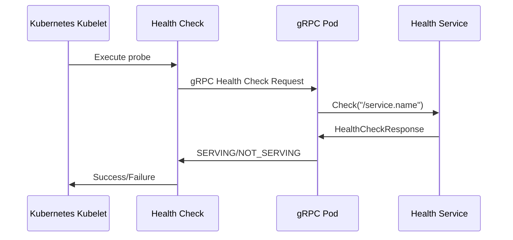

# How to Implement gRPC Health Checks for Kubernetes Readiness Probes

Author: [nawazdhandala](https://www.github.com/nawazdhandala)

Tags: gRPC, Kubernetes, Health Checks, Readiness Probes, Liveness Probes, grpc-health-probe, Cloud Native

Description: A complete guide to implementing gRPC health checking protocol for Kubernetes probes, including native support in Kubernetes 1.24+, grpc-health-probe tool, and health service implementation.

---

Health checks are critical for running reliable gRPC services in Kubernetes. Unlike HTTP-based services that can use simple endpoint checks, gRPC requires specific health checking mechanisms. This guide covers everything from implementing the gRPC health checking protocol to configuring Kubernetes probes, including the native gRPC health check support introduced in Kubernetes 1.24.

## Understanding gRPC Health Checks

The gRPC health checking protocol is defined in the official [gRPC Health Checking Protocol](https://github.com/grpc/grpc/blob/master/doc/health-checking.md). It provides a standard way for gRPC services to report their health status.



## Health Check Methods Overview

There are three main approaches to health checking gRPC services in Kubernetes:

| Method | Kubernetes Version | Pros | Cons |
|--------|-------------------|------|------|
| grpc-health-probe binary | All versions | Works everywhere, well-tested | Requires binary in container |
| Native gRPC probe | 1.24+ | No additional tooling, native | Requires newer K8s |
| HTTP health endpoint | All versions | Simple, universal | Requires additional endpoint |

## Implementing the gRPC Health Service

### Health Check Protocol Definition

The standard gRPC health check protocol is defined in this proto file:

```protobuf
// health.proto
syntax = "proto3";

package grpc.health.v1;

message HealthCheckRequest {
  string service = 1;
}

message HealthCheckResponse {
  enum ServingStatus {
    UNKNOWN = 0;
    SERVING = 1;
    NOT_SERVING = 2;
    SERVICE_UNKNOWN = 3;
  }
  ServingStatus status = 1;
}

service Health {
  rpc Check(HealthCheckRequest) returns (HealthCheckResponse);
  rpc Watch(HealthCheckRequest) returns (stream HealthCheckResponse);
}
```

### Go Implementation

```go
// health/health.go
package health

import (
    "context"
    "sync"

    "google.golang.org/grpc/codes"
    "google.golang.org/grpc/health/grpc_health_v1"
    "google.golang.org/grpc/status"
)

// Server implements the gRPC health checking protocol
type Server struct {
    grpc_health_v1.UnimplementedHealthServer
    mu       sync.RWMutex
    services map[string]grpc_health_v1.HealthCheckResponse_ServingStatus
    watchers map[string][]chan grpc_health_v1.HealthCheckResponse_ServingStatus
}

// NewServer creates a new health check server
func NewServer() *Server {
    return &Server{
        services: make(map[string]grpc_health_v1.HealthCheckResponse_ServingStatus),
        watchers: make(map[string][]chan grpc_health_v1.HealthCheckResponse_ServingStatus),
    }
}

// Check implements the health check RPC
func (s *Server) Check(ctx context.Context, req *grpc_health_v1.HealthCheckRequest) (*grpc_health_v1.HealthCheckResponse, error) {
    s.mu.RLock()
    defer s.mu.RUnlock()

    service := req.GetService()

    // Empty service name checks overall server health
    if service == "" {
        // Return SERVING if we're accepting requests
        return &grpc_health_v1.HealthCheckResponse{
            Status: grpc_health_v1.HealthCheckResponse_SERVING,
        }, nil
    }

    // Check specific service
    if status, ok := s.services[service]; ok {
        return &grpc_health_v1.HealthCheckResponse{
            Status: status,
        }, nil
    }

    return nil, status.Error(codes.NotFound, "service not found")
}

// Watch implements the streaming health check RPC
func (s *Server) Watch(req *grpc_health_v1.HealthCheckRequest, stream grpc_health_v1.Health_WatchServer) error {
    service := req.GetService()

    // Create a channel for updates
    updates := make(chan grpc_health_v1.HealthCheckResponse_ServingStatus, 1)

    // Register watcher
    s.mu.Lock()
    s.watchers[service] = append(s.watchers[service], updates)
    currentStatus := s.services[service]
    s.mu.Unlock()

    // Send initial status
    if err := stream.Send(&grpc_health_v1.HealthCheckResponse{
        Status: currentStatus,
    }); err != nil {
        return err
    }

    // Watch for updates
    for {
        select {
        case <-stream.Context().Done():
            return stream.Context().Err()
        case status := <-updates:
            if err := stream.Send(&grpc_health_v1.HealthCheckResponse{
                Status: status,
            }); err != nil {
                return err
            }
        }
    }
}

// SetServingStatus sets the health status for a service
func (s *Server) SetServingStatus(service string, status grpc_health_v1.HealthCheckResponse_ServingStatus) {
    s.mu.Lock()
    defer s.mu.Unlock()

    s.services[service] = status

    // Notify watchers
    for _, ch := range s.watchers[service] {
        select {
        case ch <- status:
        default:
            // Channel full, skip
        }
    }
}

// SetAllServingStatus sets the status for all registered services
func (s *Server) SetAllServingStatus(status grpc_health_v1.HealthCheckResponse_ServingStatus) {
    s.mu.Lock()
    defer s.mu.Unlock()

    for service := range s.services {
        s.services[service] = status
    }
}
```

### Complete Server with Health Checks

```go
// main.go
package main

import (
    "context"
    "log"
    "net"
    "os"
    "os/signal"
    "syscall"
    "time"

    "google.golang.org/grpc"
    "google.golang.org/grpc/health"
    "google.golang.org/grpc/health/grpc_health_v1"
    "google.golang.org/grpc/reflection"

    pb "github.com/example/grpc-service/proto"
)

type greeterServer struct {
    pb.UnimplementedGreeterServer
    healthServer *health.Server
}

func (s *greeterServer) SayHello(ctx context.Context, req *pb.HelloRequest) (*pb.HelloResponse, error) {
    return &pb.HelloResponse{
        Message: "Hello, " + req.GetName(),
    }, nil
}

func main() {
    port := os.Getenv("GRPC_PORT")
    if port == "" {
        port = "50051"
    }

    lis, err := net.Listen("tcp", ":"+port)
    if err != nil {
        log.Fatalf("Failed to listen: %v", err)
    }

    // Create gRPC server
    grpcServer := grpc.NewServer()

    // Create health server
    healthServer := health.NewServer()

    // Register health service
    grpc_health_v1.RegisterHealthServer(grpcServer, healthServer)

    // Register application service
    greeter := &greeterServer{healthServer: healthServer}
    pb.RegisterGreeterServer(grpcServer, greeter)

    // Enable reflection (useful for debugging)
    reflection.Register(grpcServer)

    // Set initial health status
    // Empty string "" is the overall server health
    healthServer.SetServingStatus("", grpc_health_v1.HealthCheckResponse_SERVING)
    // Set service-specific health
    healthServer.SetServingStatus("greeter.Greeter", grpc_health_v1.HealthCheckResponse_SERVING)

    // Start dependency health checker
    go checkDependencies(healthServer)

    // Graceful shutdown
    go func() {
        sigChan := make(chan os.Signal, 1)
        signal.Notify(sigChan, syscall.SIGINT, syscall.SIGTERM)
        <-sigChan

        log.Println("Received shutdown signal")

        // Mark as not serving immediately
        healthServer.SetServingStatus("", grpc_health_v1.HealthCheckResponse_NOT_SERVING)
        healthServer.SetServingStatus("greeter.Greeter", grpc_health_v1.HealthCheckResponse_NOT_SERVING)

        // Give load balancers time to remove us from rotation
        time.Sleep(5 * time.Second)

        // Gracefully stop the server
        grpcServer.GracefulStop()
    }()

    log.Printf("gRPC server listening on port %s", port)
    if err := grpcServer.Serve(lis); err != nil {
        log.Fatalf("Failed to serve: %v", err)
    }
}

// checkDependencies periodically checks service dependencies
func checkDependencies(healthServer *health.Server) {
    ticker := time.NewTicker(10 * time.Second)
    defer ticker.Stop()

    for range ticker.C {
        // Check database connection
        if err := checkDatabase(); err != nil {
            log.Printf("Database health check failed: %v", err)
            healthServer.SetServingStatus("greeter.Greeter", grpc_health_v1.HealthCheckResponse_NOT_SERVING)
            continue
        }

        // Check other dependencies...
        healthServer.SetServingStatus("greeter.Greeter", grpc_health_v1.HealthCheckResponse_SERVING)
    }
}

func checkDatabase() error {
    // Implement actual database health check
    return nil
}
```

### Python Implementation

```python
# health_service.py
import grpc
from concurrent import futures
from grpc_health.v1 import health_pb2, health_pb2_grpc
from grpc_health.v1.health import HealthServicer
from threading import Lock

class CustomHealthServicer(HealthServicer):
    def __init__(self):
        self._status = {}
        self._lock = Lock()
        # Set initial status
        self.set_status("", health_pb2.HealthCheckResponse.SERVING)

    def set_status(self, service: str, status: int):
        with self._lock:
            self._status[service] = status

    def Check(self, request, context):
        service = request.service
        with self._lock:
            status = self._status.get(service)

        if status is None:
            context.set_code(grpc.StatusCode.NOT_FOUND)
            return health_pb2.HealthCheckResponse()

        return health_pb2.HealthCheckResponse(status=status)

    def Watch(self, request, context):
        service = request.service
        # Implement streaming watch...
        while context.is_active():
            with self._lock:
                status = self._status.get(service, health_pb2.HealthCheckResponse.UNKNOWN)
            yield health_pb2.HealthCheckResponse(status=status)
            time.sleep(1)

# main.py
import grpc
from concurrent import futures
import signal
import sys
import time

from grpc_health.v1 import health_pb2_grpc
from health_service import CustomHealthServicer
import greeter_pb2_grpc
from greeter_server import GreeterServicer

def serve():
    server = grpc.server(futures.ThreadPoolExecutor(max_workers=10))

    # Add health service
    health_servicer = CustomHealthServicer()
    health_pb2_grpc.add_HealthServicer_to_server(health_servicer, server)

    # Add application service
    greeter_pb2_grpc.add_GreeterServicer_to_server(GreeterServicer(), server)

    # Set service health
    health_servicer.set_status("greeter.Greeter", health_pb2.HealthCheckResponse.SERVING)

    server.add_insecure_port('[::]:50051')
    server.start()

    def shutdown(signum, frame):
        print("Shutting down...")
        health_servicer.set_status("", health_pb2.HealthCheckResponse.NOT_SERVING)
        health_servicer.set_status("greeter.Greeter", health_pb2.HealthCheckResponse.NOT_SERVING)
        time.sleep(5)
        server.stop(30)
        sys.exit(0)

    signal.signal(signal.SIGTERM, shutdown)
    signal.signal(signal.SIGINT, shutdown)

    server.wait_for_termination()

if __name__ == '__main__':
    serve()
```

### Node.js Implementation

```javascript
// health.js
const grpc = require('@grpc/grpc-js');
const protoLoader = require('@grpc/proto-loader');

// Load health check proto
const HEALTH_PROTO_PATH = './proto/health.proto';
const healthPackageDefinition = protoLoader.loadSync(HEALTH_PROTO_PATH, {
  keepCase: true,
  longs: String,
  enums: String,
  defaults: true,
  oneofs: true,
});

const healthProto = grpc.loadPackageDefinition(healthPackageDefinition).grpc.health.v1;

class HealthService {
  constructor() {
    this.serviceStatus = new Map();
    // Set initial status
    this.setStatus('', 'SERVING');
  }

  setStatus(service, status) {
    this.serviceStatus.set(service, status);
  }

  check(call, callback) {
    const service = call.request.service;
    const status = this.serviceStatus.get(service);

    if (status === undefined) {
      callback({
        code: grpc.status.NOT_FOUND,
        message: 'Service not found',
      });
      return;
    }

    callback(null, { status });
  }

  watch(call) {
    const service = call.request.service;

    const sendStatus = () => {
      const status = this.serviceStatus.get(service) || 'UNKNOWN';
      call.write({ status });
    };

    sendStatus();
    const interval = setInterval(sendStatus, 1000);

    call.on('cancelled', () => {
      clearInterval(interval);
    });
  }

  getService() {
    return {
      Check: this.check.bind(this),
      Watch: this.watch.bind(this),
    };
  }
}

// server.js
const grpc = require('@grpc/grpc-js');
const { HealthService } = require('./health');

const healthService = new HealthService();

const server = new grpc.Server();

// Add health service
server.addService(healthProto.Health.service, healthService.getService());

// Add your application services...
// server.addService(greeterProto.Greeter.service, greeterService);

// Set service health
healthService.setStatus('greeter.Greeter', 'SERVING');

server.bindAsync('0.0.0.0:50051', grpc.ServerCredentials.createInsecure(), (err, port) => {
  if (err) {
    console.error('Failed to bind:', err);
    return;
  }
  console.log(`Server running on port ${port}`);
  server.start();
});

// Graceful shutdown
process.on('SIGTERM', () => {
  console.log('SIGTERM received, shutting down...');
  healthService.setStatus('', 'NOT_SERVING');
  healthService.setStatus('greeter.Greeter', 'NOT_SERVING');

  setTimeout(() => {
    server.tryShutdown(() => {
      console.log('Server shut down');
      process.exit(0);
    });
  }, 5000);
});
```

## Method 1: Using grpc-health-probe

### Adding grpc-health-probe to Your Container

```dockerfile
# Dockerfile
FROM golang:1.21-alpine AS builder
WORKDIR /app
COPY . .
RUN go build -o server .

FROM alpine:3.19

# Install grpc-health-probe
RUN GRPC_HEALTH_PROBE_VERSION=v0.4.24 && \
    wget -qO/bin/grpc_health_probe \
    https://github.com/grpc-ecosystem/grpc-health-probe/releases/download/${GRPC_HEALTH_PROBE_VERSION}/grpc_health_probe-linux-amd64 && \
    chmod +x /bin/grpc_health_probe

COPY --from=builder /app/server /server

EXPOSE 50051
CMD ["/server"]
```

### Kubernetes Deployment with grpc-health-probe

```yaml
# deployment-health-probe.yaml
apiVersion: apps/v1
kind: Deployment
metadata:
  name: grpc-service
  namespace: grpc-services
spec:
  replicas: 3
  selector:
    matchLabels:
      app: grpc-service
  template:
    metadata:
      labels:
        app: grpc-service
    spec:
      containers:
        - name: grpc-server
          image: your-registry/grpc-service:v1.0.0
          ports:
            - containerPort: 50051
              name: grpc

          # Readiness probe - determines if pod should receive traffic
          readinessProbe:
            exec:
              command:
                - /bin/grpc_health_probe
                - -addr=:50051
                - -service=greeter.Greeter  # Optional: check specific service
            initialDelaySeconds: 5
            periodSeconds: 10
            timeoutSeconds: 5
            successThreshold: 1
            failureThreshold: 3

          # Liveness probe - determines if pod should be restarted
          livenessProbe:
            exec:
              command:
                - /bin/grpc_health_probe
                - -addr=:50051
            initialDelaySeconds: 15
            periodSeconds: 20
            timeoutSeconds: 5
            failureThreshold: 3

          # Startup probe - for slow-starting containers
          startupProbe:
            exec:
              command:
                - /bin/grpc_health_probe
                - -addr=:50051
            initialDelaySeconds: 0
            periodSeconds: 5
            timeoutSeconds: 5
            failureThreshold: 30  # 30 * 5s = 150s max startup time

          resources:
            requests:
              cpu: 100m
              memory: 128Mi
            limits:
              cpu: 500m
              memory: 512Mi
```

### grpc-health-probe Options

```bash
# Basic usage
grpc_health_probe -addr=:50051

# Check specific service
grpc_health_probe -addr=:50051 -service=greeter.Greeter

# With TLS
grpc_health_probe -addr=:50051 -tls -tls-ca-cert=/path/to/ca.crt

# With TLS and client certificate (mTLS)
grpc_health_probe -addr=:50051 \
  -tls \
  -tls-ca-cert=/path/to/ca.crt \
  -tls-client-cert=/path/to/client.crt \
  -tls-client-key=/path/to/client.key

# With timeout
grpc_health_probe -addr=:50051 -connect-timeout=5s -rpc-timeout=5s

# Skip TLS verification (not recommended for production)
grpc_health_probe -addr=:50051 -tls -tls-no-verify
```

## Method 2: Native Kubernetes gRPC Probes (1.24+)

Kubernetes 1.24+ supports native gRPC health checks without requiring additional tools.

### Enable the Feature Gate (if not enabled by default)

For Kubernetes 1.24-1.26, enable the feature gate:

```yaml
# kube-apiserver configuration
apiVersion: kubeadm.k8s.io/v1beta3
kind: ClusterConfiguration
apiServer:
  extraArgs:
    feature-gates: GRPCContainerProbe=true
```

### Using Native gRPC Probes

```yaml
# deployment-native-grpc.yaml
apiVersion: apps/v1
kind: Deployment
metadata:
  name: grpc-service
  namespace: grpc-services
spec:
  replicas: 3
  selector:
    matchLabels:
      app: grpc-service
  template:
    metadata:
      labels:
        app: grpc-service
    spec:
      containers:
        - name: grpc-server
          image: your-registry/grpc-service:v1.0.0
          ports:
            - containerPort: 50051
              name: grpc

          # Native gRPC readiness probe
          readinessProbe:
            grpc:
              port: 50051
              service: "greeter.Greeter"  # Optional: empty string checks overall health
            initialDelaySeconds: 5
            periodSeconds: 10
            timeoutSeconds: 5
            failureThreshold: 3

          # Native gRPC liveness probe
          livenessProbe:
            grpc:
              port: 50051
              # Omit service to check overall server health
            initialDelaySeconds: 15
            periodSeconds: 20
            timeoutSeconds: 5
            failureThreshold: 3

          # Native gRPC startup probe
          startupProbe:
            grpc:
              port: 50051
            periodSeconds: 5
            failureThreshold: 30

          resources:
            requests:
              cpu: 100m
              memory: 128Mi
            limits:
              cpu: 500m
              memory: 512Mi
```

### Benefits of Native gRPC Probes

1. **No additional tooling**: No need to include grpc-health-probe binary
2. **Smaller images**: Reduced container size
3. **Simpler configuration**: Native YAML syntax
4. **Better integration**: Direct kubelet integration

## Method 3: HTTP Health Endpoint (Fallback)

If you cannot implement gRPC health checks, expose an HTTP endpoint:

```go
// main.go
package main

import (
    "net/http"
    "sync/atomic"
)

var healthy int32 = 1

func healthHandler(w http.ResponseWriter, r *http.Request) {
    if atomic.LoadInt32(&healthy) == 1 {
        w.WriteHeader(http.StatusOK)
        w.Write([]byte("OK"))
    } else {
        w.WriteHeader(http.StatusServiceUnavailable)
        w.Write([]byte("NOT OK"))
    }
}

func main() {
    // Start HTTP health server
    go func() {
        http.HandleFunc("/health", healthHandler)
        http.HandleFunc("/ready", healthHandler)
        http.ListenAndServe(":8080", nil)
    }()

    // Start gRPC server...
}
```

```yaml
# deployment-http-health.yaml
apiVersion: apps/v1
kind: Deployment
metadata:
  name: grpc-service
spec:
  template:
    spec:
      containers:
        - name: grpc-server
          image: your-registry/grpc-service:v1.0.0
          ports:
            - containerPort: 50051
              name: grpc
            - containerPort: 8080
              name: health

          readinessProbe:
            httpGet:
              path: /ready
              port: health
            initialDelaySeconds: 5
            periodSeconds: 10

          livenessProbe:
            httpGet:
              path: /health
              port: health
            initialDelaySeconds: 15
            periodSeconds: 20
```

## Advanced Health Check Patterns

### Dependency-Aware Health Checks

```go
// health_checker.go
package main

import (
    "context"
    "database/sql"
    "sync"
    "time"

    "google.golang.org/grpc/health"
    "google.golang.org/grpc/health/grpc_health_v1"
)

type DependencyChecker struct {
    healthServer *health.Server
    db           *sql.DB
    cache        CacheClient
    mu           sync.RWMutex
    dependencies map[string]bool
}

func NewDependencyChecker(hs *health.Server, db *sql.DB, cache CacheClient) *DependencyChecker {
    return &DependencyChecker{
        healthServer: hs,
        db:           db,
        cache:        cache,
        dependencies: make(map[string]bool),
    }
}

func (dc *DependencyChecker) Start(ctx context.Context) {
    ticker := time.NewTicker(5 * time.Second)
    defer ticker.Stop()

    for {
        select {
        case <-ctx.Done():
            return
        case <-ticker.C:
            dc.checkAll()
        }
    }
}

func (dc *DependencyChecker) checkAll() {
    dc.mu.Lock()
    defer dc.mu.Unlock()

    allHealthy := true

    // Check database
    if err := dc.checkDatabase(); err != nil {
        dc.dependencies["database"] = false
        allHealthy = false
    } else {
        dc.dependencies["database"] = true
    }

    // Check cache
    if err := dc.checkCache(); err != nil {
        dc.dependencies["cache"] = false
        allHealthy = false
    } else {
        dc.dependencies["cache"] = true
    }

    // Update overall health status
    if allHealthy {
        dc.healthServer.SetServingStatus("myapp.Service", grpc_health_v1.HealthCheckResponse_SERVING)
    } else {
        dc.healthServer.SetServingStatus("myapp.Service", grpc_health_v1.HealthCheckResponse_NOT_SERVING)
    }
}

func (dc *DependencyChecker) checkDatabase() error {
    ctx, cancel := context.WithTimeout(context.Background(), 2*time.Second)
    defer cancel()
    return dc.db.PingContext(ctx)
}

func (dc *DependencyChecker) checkCache() error {
    ctx, cancel := context.WithTimeout(context.Background(), 2*time.Second)
    defer cancel()
    return dc.cache.Ping(ctx)
}
```

### Graceful Shutdown with Health Checks

```go
// graceful_shutdown.go
package main

import (
    "context"
    "log"
    "net"
    "os"
    "os/signal"
    "syscall"
    "time"

    "google.golang.org/grpc"
    "google.golang.org/grpc/health"
    "google.golang.org/grpc/health/grpc_health_v1"
)

func main() {
    lis, _ := net.Listen("tcp", ":50051")
    server := grpc.NewServer()
    healthServer := health.NewServer()

    grpc_health_v1.RegisterHealthServer(server, healthServer)
    // Register other services...

    // Set initial health
    healthServer.SetServingStatus("", grpc_health_v1.HealthCheckResponse_SERVING)

    // Handle shutdown
    ctx, cancel := context.WithCancel(context.Background())
    defer cancel()

    go func() {
        sigChan := make(chan os.Signal, 1)
        signal.Notify(sigChan, syscall.SIGINT, syscall.SIGTERM)
        <-sigChan

        log.Println("Shutdown signal received")

        // Phase 1: Mark as not serving
        // This causes readiness probes to fail, removing pod from service
        healthServer.SetServingStatus("", grpc_health_v1.HealthCheckResponse_NOT_SERVING)
        log.Println("Marked as NOT_SERVING")

        // Phase 2: Wait for load balancers to update
        // This allows in-flight requests to complete
        drainPeriod := 10 * time.Second
        log.Printf("Waiting %v for connection draining", drainPeriod)
        time.Sleep(drainPeriod)

        // Phase 3: Graceful stop
        // Stops accepting new connections, waits for existing to complete
        log.Println("Initiating graceful stop")
        stopped := make(chan struct{})
        go func() {
            server.GracefulStop()
            close(stopped)
        }()

        // Phase 4: Force stop if graceful stop takes too long
        select {
        case <-stopped:
            log.Println("Graceful stop completed")
        case <-time.After(30 * time.Second):
            log.Println("Graceful stop timeout, forcing stop")
            server.Stop()
        }

        cancel()
    }()

    log.Println("Server starting")
    if err := server.Serve(lis); err != nil {
        log.Printf("Server stopped: %v", err)
    }
}
```

## Testing Health Checks

### Local Testing

```bash
# Test with grpcurl
grpcurl -plaintext localhost:50051 grpc.health.v1.Health/Check

# Check specific service
grpcurl -plaintext -d '{"service": "greeter.Greeter"}' \
  localhost:50051 grpc.health.v1.Health/Check

# Watch health status
grpcurl -plaintext -d '{"service": ""}' \
  localhost:50051 grpc.health.v1.Health/Watch
```

### In-Cluster Testing

```bash
# Test from another pod
kubectl run grpc-test --rm -it --image=fullstorydev/grpcurl:latest -- \
  -plaintext grpc-service.grpc-services:50051 grpc.health.v1.Health/Check

# Test with grpc-health-probe
kubectl run probe-test --rm -it --image=alpine -- \
  sh -c "wget -qO/bin/grpc_health_probe https://github.com/grpc-ecosystem/grpc-health-probe/releases/download/v0.4.24/grpc_health_probe-linux-amd64 && \
  chmod +x /bin/grpc_health_probe && \
  /bin/grpc_health_probe -addr=grpc-service.grpc-services:50051"
```

### Verify Probe Configuration

```bash
# Check probe status
kubectl -n grpc-services describe pod -l app=grpc-service | grep -A 10 "Readiness:"

# Watch probe events
kubectl -n grpc-services get events --field-selector reason=Unhealthy -w
```

## Best Practices

1. **Always implement the health service**: Even if using HTTP fallback
2. **Use service-specific health**: Check actual service dependencies
3. **Configure appropriate timeouts**: Match your application's startup time
4. **Implement graceful shutdown**: Mark unhealthy before stopping
5. **Differentiate probes**:
   - Readiness: Check if ready to serve traffic
   - Liveness: Check if application is functioning
   - Startup: Allow time for initialization
6. **Monitor health check failures**: Alert on frequent probe failures
7. **Test probe behavior**: Verify probes work during failures

## Conclusion

Implementing proper health checks for gRPC services in Kubernetes is essential for reliability. Whether you use grpc-health-probe, native Kubernetes gRPC probes, or HTTP health endpoints, the key is ensuring your probes accurately reflect your service's ability to handle requests. With Kubernetes 1.24+ native gRPC probe support, implementing health checks has become even simpler and more efficient.
