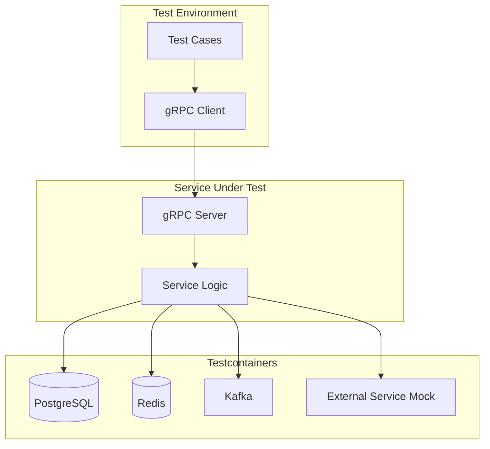
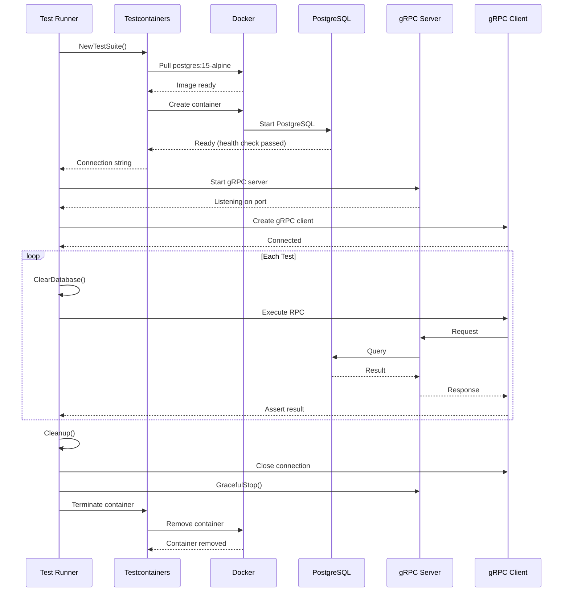

# How to Integration Test gRPC Services with Testcontainers

Author: [nawazdhandala](https://www.github.com/nawazdhandala)

Tags: gRPC, testing, integration-testing, testcontainers, docker, golang, CI/CD

Description: Learn how to write comprehensive integration tests for gRPC services using Testcontainers to spin up real dependencies like databases and external services.

---

Integration testing gRPC services requires testing the complete system with real dependencies. Testcontainers provides a powerful way to spin up Docker containers for databases, message queues, and other services during tests. This guide covers everything you need to know about integration testing gRPC services with Testcontainers.

## Understanding Integration Testing Architecture



## Setting Up Testcontainers

### Project Structure

```
myservice/
├── proto/
│   └── user.proto
├── pb/
│   └── user.pb.go
│   └── user_grpc.pb.go
├── server/
│   └── server.go
├── repository/
│   └── postgres_repository.go
├── integration/
│   ├── setup_test.go
│   ├── user_service_test.go
│   └── docker-compose.test.yml
├── go.mod
└── go.sum
```

### Installing Dependencies

```bash
go get github.com/testcontainers/testcontainers-go
go get github.com/testcontainers/testcontainers-go/modules/postgres
go get github.com/testcontainers/testcontainers-go/modules/redis
go get github.com/stretchr/testify
go get github.com/jackc/pgx/v5
```

### Basic Testcontainers Setup

```go
// integration/setup_test.go
package integration

import (
    "context"
    "fmt"
    "net"
    "testing"
    "time"

    "github.com/example/myservice/pb"
    "github.com/example/myservice/repository"
    "github.com/example/myservice/server"
    "github.com/jackc/pgx/v5/pgxpool"
    "github.com/testcontainers/testcontainers-go"
    "github.com/testcontainers/testcontainers-go/modules/postgres"
    "github.com/testcontainers/testcontainers-go/wait"
    "google.golang.org/grpc"
    "google.golang.org/grpc/credentials/insecure"
)

// TestSuite holds all the components needed for integration tests
type TestSuite struct {
    ctx            context.Context
    cancel         context.CancelFunc
    pgContainer    *postgres.PostgresContainer
    grpcServer     *grpc.Server
    grpcConn       *grpc.ClientConn
    userClient     pb.UserServiceClient
    db             *pgxpool.Pool
    serverListener net.Listener
}

// NewTestSuite creates a new test suite with all dependencies
func NewTestSuite(t *testing.T) *TestSuite {
    ctx, cancel := context.WithTimeout(context.Background(), 5*time.Minute)

    suite := &TestSuite{
        ctx:    ctx,
        cancel: cancel,
    }

    // Setup PostgreSQL container
    suite.setupPostgres(t)

    // Setup gRPC server
    suite.setupGRPCServer(t)

    // Setup gRPC client
    suite.setupGRPCClient(t)

    return suite
}

func (s *TestSuite) setupPostgres(t *testing.T) {
    pgContainer, err := postgres.Run(s.ctx,
        "postgres:15-alpine",
        postgres.WithDatabase("testdb"),
        postgres.WithUsername("testuser"),
        postgres.WithPassword("testpass"),
        testcontainers.WithWaitStrategy(
            wait.ForLog("database system is ready to accept connections").
                WithOccurrence(2).
                WithStartupTimeout(60*time.Second),
        ),
    )
    if err != nil {
        t.Fatalf("Failed to start PostgreSQL container: %v", err)
    }
    s.pgContainer = pgContainer

    // Get connection string
    connStr, err := pgContainer.ConnectionString(s.ctx, "sslmode=disable")
    if err != nil {
        t.Fatalf("Failed to get connection string: %v", err)
    }

    // Create connection pool
    pool, err := pgxpool.New(s.ctx, connStr)
    if err != nil {
        t.Fatalf("Failed to create connection pool: %v", err)
    }
    s.db = pool

    // Run migrations
    s.runMigrations(t)
}

func (s *TestSuite) runMigrations(t *testing.T) {
    migrations := []string{
        `CREATE TABLE IF NOT EXISTS users (
            id UUID PRIMARY KEY,
            name VARCHAR(255) NOT NULL,
            email VARCHAR(255) UNIQUE NOT NULL,
            created_at TIMESTAMP WITH TIME ZONE DEFAULT NOW()
        )`,
        `CREATE INDEX IF NOT EXISTS idx_users_email ON users(email)`,
    }

    for _, migration := range migrations {
        _, err := s.db.Exec(s.ctx, migration)
        if err != nil {
            t.Fatalf("Failed to run migration: %v", err)
        }
    }
}

func (s *TestSuite) setupGRPCServer(t *testing.T) {
    // Create repository
    repo := repository.NewPostgresUserRepository(s.db)

    // Create gRPC server
    s.grpcServer = grpc.NewServer()
    userService := server.NewUserServiceServer(repo)
    pb.RegisterUserServiceServer(s.grpcServer, userService)

    // Start listener on random port
    listener, err := net.Listen("tcp", "localhost:0")
    if err != nil {
        t.Fatalf("Failed to create listener: %v", err)
    }
    s.serverListener = listener

    // Start server in goroutine
    go func() {
        if err := s.grpcServer.Serve(listener); err != nil {
            // Server stopped
        }
    }()
}

func (s *TestSuite) setupGRPCClient(t *testing.T) {
    // Connect to gRPC server
    addr := s.serverListener.Addr().String()
    conn, err := grpc.NewClient(addr,
        grpc.WithTransportCredentials(insecure.NewCredentials()),
    )
    if err != nil {
        t.Fatalf("Failed to connect to gRPC server: %v", err)
    }
    s.grpcConn = conn
    s.userClient = pb.NewUserServiceClient(conn)
}

// Cleanup tears down all resources
func (s *TestSuite) Cleanup(t *testing.T) {
    if s.grpcConn != nil {
        s.grpcConn.Close()
    }
    if s.grpcServer != nil {
        s.grpcServer.GracefulStop()
    }
    if s.serverListener != nil {
        s.serverListener.Close()
    }
    if s.db != nil {
        s.db.Close()
    }
    if s.pgContainer != nil {
        if err := s.pgContainer.Terminate(s.ctx); err != nil {
            t.Logf("Failed to terminate PostgreSQL container: %v", err)
        }
    }
    s.cancel()
}

// ClearDatabase clears all tables between tests
func (s *TestSuite) ClearDatabase(t *testing.T) {
    _, err := s.db.Exec(s.ctx, "TRUNCATE TABLE users CASCADE")
    if err != nil {
        t.Fatalf("Failed to clear database: %v", err)
    }
}
```

## PostgreSQL Repository Implementation

```go
// repository/postgres_repository.go
package repository

import (
    "context"
    "errors"
    "time"

    "github.com/jackc/pgx/v5"
    "github.com/jackc/pgx/v5/pgconn"
    "github.com/jackc/pgx/v5/pgxpool"
)

type PostgresUserRepository struct {
    pool *pgxpool.Pool
}

func NewPostgresUserRepository(pool *pgxpool.Pool) *PostgresUserRepository {
    return &PostgresUserRepository{pool: pool}
}

func (r *PostgresUserRepository) GetByID(ctx context.Context, id string) (*User, error) {
    var user User
    err := r.pool.QueryRow(ctx,
        "SELECT id, name, email, created_at FROM users WHERE id = $1",
        id,
    ).Scan(&user.ID, &user.Name, &user.Email, &user.CreatedAt)

    if err != nil {
        if errors.Is(err, pgx.ErrNoRows) {
            return nil, ErrNotFound
        }
        return nil, err
    }
    return &user, nil
}

func (r *PostgresUserRepository) Create(ctx context.Context, user *User) error {
    _, err := r.pool.Exec(ctx,
        "INSERT INTO users (id, name, email, created_at) VALUES ($1, $2, $3, $4)",
        user.ID, user.Name, user.Email, user.CreatedAt,
    )
    if err != nil {
        var pgErr *pgconn.PgError
        if errors.As(err, &pgErr) && pgErr.Code == "23505" {
            return ErrDuplicate
        }
        return err
    }
    return nil
}

func (r *PostgresUserRepository) List(ctx context.Context, pageSize int, pageToken string) ([]*User, string, error) {
    query := "SELECT id, name, email, created_at FROM users ORDER BY created_at DESC LIMIT $1"
    rows, err := r.pool.Query(ctx, query, pageSize)
    if err != nil {
        return nil, "", err
    }
    defer rows.Close()

    var users []*User
    for rows.Next() {
        var user User
        if err := rows.Scan(&user.ID, &user.Name, &user.Email, &user.CreatedAt); err != nil {
            return nil, "", err
        }
        users = append(users, &user)
    }
    return users, "", nil
}

func (r *PostgresUserRepository) BatchCreate(ctx context.Context, users []*User) ([]string, error) {
    tx, err := r.pool.Begin(ctx)
    if err != nil {
        return nil, err
    }
    defer tx.Rollback(ctx)

    var ids []string
    for _, user := range users {
        _, err := tx.Exec(ctx,
            "INSERT INTO users (id, name, email, created_at) VALUES ($1, $2, $3, $4)",
            user.ID, user.Name, user.Email, user.CreatedAt,
        )
        if err != nil {
            return nil, err
        }
        ids = append(ids, user.ID)
    }

    if err := tx.Commit(ctx); err != nil {
        return nil, err
    }
    return ids, nil
}

func (r *PostgresUserRepository) GetByEmail(ctx context.Context, email string) (*User, error) {
    var user User
    err := r.pool.QueryRow(ctx,
        "SELECT id, name, email, created_at FROM users WHERE email = $1",
        email,
    ).Scan(&user.ID, &user.Name, &user.Email, &user.CreatedAt)

    if err != nil {
        if errors.Is(err, pgx.ErrNoRows) {
            return nil, ErrNotFound
        }
        return nil, err
    }
    return &user, nil
}
```

## Writing Integration Tests

```go
// integration/user_service_test.go
package integration

import (
    "context"
    "io"
    "testing"
    "time"

    "github.com/example/myservice/pb"
    "github.com/stretchr/testify/assert"
    "github.com/stretchr/testify/require"
    "google.golang.org/grpc/codes"
    "google.golang.org/grpc/status"
)

var suite *TestSuite

func TestMain(m *testing.M) {
    // This would typically use testing.M but we need proper setup
    m.Run()
}

func setupTest(t *testing.T) *TestSuite {
    suite := NewTestSuite(t)
    t.Cleanup(func() {
        suite.Cleanup(t)
    })
    return suite
}

func TestCreateUser_Integration(t *testing.T) {
    suite := setupTest(t)

    t.Run("creates user successfully", func(t *testing.T) {
        suite.ClearDatabase(t)

        resp, err := suite.userClient.CreateUser(suite.ctx, &pb.CreateUserRequest{
            Name:  "John Doe",
            Email: "john@example.com",
        })

        require.NoError(t, err)
        assert.NotEmpty(t, resp.User.Id)
        assert.Equal(t, "John Doe", resp.User.Name)
        assert.Equal(t, "john@example.com", resp.User.Email)
        assert.NotZero(t, resp.User.CreatedAt)
    })

    t.Run("fails with duplicate email", func(t *testing.T) {
        suite.ClearDatabase(t)

        // Create first user
        _, err := suite.userClient.CreateUser(suite.ctx, &pb.CreateUserRequest{
            Name:  "First User",
            Email: "duplicate@example.com",
        })
        require.NoError(t, err)

        // Try to create second user with same email
        _, err = suite.userClient.CreateUser(suite.ctx, &pb.CreateUserRequest{
            Name:  "Second User",
            Email: "duplicate@example.com",
        })

        require.Error(t, err)
        st, ok := status.FromError(err)
        assert.True(t, ok)
        assert.Equal(t, codes.AlreadyExists, st.Code())
    })

    t.Run("fails with missing name", func(t *testing.T) {
        _, err := suite.userClient.CreateUser(suite.ctx, &pb.CreateUserRequest{
            Name:  "",
            Email: "test@example.com",
        })

        require.Error(t, err)
        st, ok := status.FromError(err)
        assert.True(t, ok)
        assert.Equal(t, codes.InvalidArgument, st.Code())
    })
}

func TestGetUser_Integration(t *testing.T) {
    suite := setupTest(t)

    t.Run("retrieves existing user", func(t *testing.T) {
        suite.ClearDatabase(t)

        // Create user first
        createResp, err := suite.userClient.CreateUser(suite.ctx, &pb.CreateUserRequest{
            Name:  "Jane Doe",
            Email: "jane@example.com",
        })
        require.NoError(t, err)

        // Get the user
        getResp, err := suite.userClient.GetUser(suite.ctx, &pb.GetUserRequest{
            Id: createResp.User.Id,
        })

        require.NoError(t, err)
        assert.Equal(t, createResp.User.Id, getResp.User.Id)
        assert.Equal(t, "Jane Doe", getResp.User.Name)
        assert.Equal(t, "jane@example.com", getResp.User.Email)
    })

    t.Run("returns not found for non-existent user", func(t *testing.T) {
        suite.ClearDatabase(t)

        _, err := suite.userClient.GetUser(suite.ctx, &pb.GetUserRequest{
            Id: "non-existent-id",
        })

        require.Error(t, err)
        st, ok := status.FromError(err)
        assert.True(t, ok)
        assert.Equal(t, codes.NotFound, st.Code())
    })
}

func TestListUsers_Integration(t *testing.T) {
    suite := setupTest(t)

    t.Run("streams all users", func(t *testing.T) {
        suite.ClearDatabase(t)

        // Create multiple users
        for i := 0; i < 5; i++ {
            _, err := suite.userClient.CreateUser(suite.ctx, &pb.CreateUserRequest{
                Name:  fmt.Sprintf("User %d", i),
                Email: fmt.Sprintf("user%d@example.com", i),
            })
            require.NoError(t, err)
        }

        // List users
        stream, err := suite.userClient.ListUsers(suite.ctx, &pb.ListUsersRequest{
            PageSize: 10,
        })
        require.NoError(t, err)

        var users []*pb.User
        for {
            user, err := stream.Recv()
            if err == io.EOF {
                break
            }
            require.NoError(t, err)
            users = append(users, user)
        }

        assert.Len(t, users, 5)
    })

    t.Run("respects page size", func(t *testing.T) {
        suite.ClearDatabase(t)

        // Create 10 users
        for i := 0; i < 10; i++ {
            _, err := suite.userClient.CreateUser(suite.ctx, &pb.CreateUserRequest{
                Name:  fmt.Sprintf("User %d", i),
                Email: fmt.Sprintf("pageuser%d@example.com", i),
            })
            require.NoError(t, err)
        }

        // List with page size of 5
        stream, err := suite.userClient.ListUsers(suite.ctx, &pb.ListUsersRequest{
            PageSize: 5,
        })
        require.NoError(t, err)

        var users []*pb.User
        for {
            user, err := stream.Recv()
            if err == io.EOF {
                break
            }
            require.NoError(t, err)
            users = append(users, user)
        }

        assert.Len(t, users, 5)
    })
}

func TestBatchCreateUsers_Integration(t *testing.T) {
    suite := setupTest(t)

    t.Run("creates multiple users", func(t *testing.T) {
        suite.ClearDatabase(t)

        stream, err := suite.userClient.BatchCreateUsers(suite.ctx)
        require.NoError(t, err)

        // Send multiple users
        for i := 0; i < 3; i++ {
            err := stream.Send(&pb.CreateUserRequest{
                Name:  fmt.Sprintf("Batch User %d", i),
                Email: fmt.Sprintf("batch%d@example.com", i),
            })
            require.NoError(t, err)
        }

        // Close and get response
        resp, err := stream.CloseAndRecv()
        require.NoError(t, err)
        assert.Equal(t, int32(3), resp.CreatedCount)
        assert.Len(t, resp.UserIds, 3)

        // Verify users exist
        for _, id := range resp.UserIds {
            getResp, err := suite.userClient.GetUser(suite.ctx, &pb.GetUserRequest{Id: id})
            require.NoError(t, err)
            assert.NotNil(t, getResp.User)
        }
    })
}

func TestSyncUsers_Integration(t *testing.T) {
    suite := setupTest(t)

    t.Run("syncs users bidirectionally", func(t *testing.T) {
        suite.ClearDatabase(t)

        // Create a user first
        createResp, err := suite.userClient.CreateUser(suite.ctx, &pb.CreateUserRequest{
            Name:  "Sync User",
            Email: "sync@example.com",
        })
        require.NoError(t, err)

        stream, err := suite.userClient.SyncUsers(suite.ctx)
        require.NoError(t, err)

        // Send sync requests
        requests := []*pb.SyncRequest{
            {UserId: createResp.User.Id, Action: "update"},
            {UserId: "other-user", Action: "delete"},
        }

        var responses []*pb.SyncResponse
        done := make(chan bool)

        // Receive responses in goroutine
        go func() {
            for {
                resp, err := stream.Recv()
                if err == io.EOF {
                    done <- true
                    return
                }
                if err != nil {
                    done <- true
                    return
                }
                responses = append(responses, resp)
            }
        }()

        // Send requests
        for _, req := range requests {
            err := stream.Send(req)
            require.NoError(t, err)
        }
        stream.CloseSend()

        <-done
        assert.Len(t, responses, 2)
    })
}
```

## Testing with Multiple Containers

```go
// integration/multi_container_test.go
package integration

import (
    "context"
    "testing"
    "time"

    "github.com/redis/go-redis/v9"
    "github.com/testcontainers/testcontainers-go"
    "github.com/testcontainers/testcontainers-go/modules/postgres"
    redismodule "github.com/testcontainers/testcontainers-go/modules/redis"
    "github.com/testcontainers/testcontainers-go/wait"
)

// MultiContainerSuite extends TestSuite with additional services
type MultiContainerSuite struct {
    *TestSuite
    redisContainer testcontainers.Container
    redisClient    *redis.Client
}

func NewMultiContainerSuite(t *testing.T) *MultiContainerSuite {
    ctx, cancel := context.WithTimeout(context.Background(), 5*time.Minute)

    suite := &MultiContainerSuite{
        TestSuite: &TestSuite{
            ctx:    ctx,
            cancel: cancel,
        },
    }

    // Start containers in parallel
    var pgErr, redisErr error
    done := make(chan bool, 2)

    go func() {
        suite.setupPostgresAsync(t, &pgErr)
        done <- true
    }()

    go func() {
        suite.setupRedisAsync(t, &redisErr)
        done <- true
    }()

    // Wait for both
    <-done
    <-done

    if pgErr != nil {
        t.Fatalf("PostgreSQL setup failed: %v", pgErr)
    }
    if redisErr != nil {
        t.Fatalf("Redis setup failed: %v", redisErr)
    }

    // Setup gRPC server with both dependencies
    suite.setupGRPCServerWithCache(t)
    suite.setupGRPCClient(t)

    return suite
}

func (s *MultiContainerSuite) setupPostgresAsync(t *testing.T, errOut *error) {
    pgContainer, err := postgres.Run(s.ctx,
        "postgres:15-alpine",
        postgres.WithDatabase("testdb"),
        postgres.WithUsername("testuser"),
        postgres.WithPassword("testpass"),
        testcontainers.WithWaitStrategy(
            wait.ForLog("database system is ready to accept connections").
                WithOccurrence(2).
                WithStartupTimeout(60*time.Second),
        ),
    )
    if err != nil {
        *errOut = err
        return
    }
    s.pgContainer = pgContainer

    connStr, err := pgContainer.ConnectionString(s.ctx, "sslmode=disable")
    if err != nil {
        *errOut = err
        return
    }

    pool, err := pgxpool.New(s.ctx, connStr)
    if err != nil {
        *errOut = err
        return
    }
    s.db = pool
    s.runMigrations(t)
}

func (s *MultiContainerSuite) setupRedisAsync(t *testing.T, errOut *error) {
    redisContainer, err := redismodule.Run(s.ctx,
        "redis:7-alpine",
        testcontainers.WithWaitStrategy(
            wait.ForLog("Ready to accept connections").
                WithStartupTimeout(30*time.Second),
        ),
    )
    if err != nil {
        *errOut = err
        return
    }
    s.redisContainer = redisContainer

    endpoint, err := redisContainer.Endpoint(s.ctx, "")
    if err != nil {
        *errOut = err
        return
    }

    s.redisClient = redis.NewClient(&redis.Options{
        Addr: endpoint,
    })
}

func (s *MultiContainerSuite) setupGRPCServerWithCache(t *testing.T) {
    // Create repository with cache
    repo := repository.NewCachedUserRepository(
        repository.NewPostgresUserRepository(s.db),
        s.redisClient,
    )

    s.grpcServer = grpc.NewServer()
    userService := server.NewUserServiceServer(repo)
    pb.RegisterUserServiceServer(s.grpcServer, userService)

    listener, err := net.Listen("tcp", "localhost:0")
    if err != nil {
        t.Fatalf("Failed to create listener: %v", err)
    }
    s.serverListener = listener

    go func() {
        s.grpcServer.Serve(listener)
    }()
}

func (s *MultiContainerSuite) Cleanup(t *testing.T) {
    s.TestSuite.Cleanup(t)
    if s.redisClient != nil {
        s.redisClient.Close()
    }
    if s.redisContainer != nil {
        s.redisContainer.Terminate(s.ctx)
    }
}

// Test with caching
func TestGetUser_WithCache(t *testing.T) {
    suite := NewMultiContainerSuite(t)
    defer suite.Cleanup(t)

    t.Run("caches user after first retrieval", func(t *testing.T) {
        suite.ClearDatabase(t)
        suite.redisClient.FlushAll(suite.ctx)

        // Create user
        createResp, err := suite.userClient.CreateUser(suite.ctx, &pb.CreateUserRequest{
            Name:  "Cached User",
            Email: "cached@example.com",
        })
        require.NoError(t, err)

        // First retrieval - from database
        _, err = suite.userClient.GetUser(suite.ctx, &pb.GetUserRequest{
            Id: createResp.User.Id,
        })
        require.NoError(t, err)

        // Check cache
        cached, err := suite.redisClient.Get(suite.ctx, "user:"+createResp.User.Id).Result()
        require.NoError(t, err)
        assert.NotEmpty(t, cached)

        // Second retrieval - should be from cache
        getResp, err := suite.userClient.GetUser(suite.ctx, &pb.GetUserRequest{
            Id: createResp.User.Id,
        })
        require.NoError(t, err)
        assert.Equal(t, "Cached User", getResp.User.Name)
    })
}
```

## Custom Container Configuration

```go
// integration/custom_containers.go
package integration

import (
    "context"
    "fmt"
    "path/filepath"
    "time"

    "github.com/testcontainers/testcontainers-go"
    "github.com/testcontainers/testcontainers-go/wait"
)

// CreatePostgresWithInit creates a PostgreSQL container with initialization scripts
func CreatePostgresWithInit(ctx context.Context, initScriptPath string) (testcontainers.Container, error) {
    absPath, _ := filepath.Abs(initScriptPath)

    req := testcontainers.ContainerRequest{
        Image:        "postgres:15-alpine",
        ExposedPorts: []string{"5432/tcp"},
        Env: map[string]string{
            "POSTGRES_USER":     "testuser",
            "POSTGRES_PASSWORD": "testpass",
            "POSTGRES_DB":       "testdb",
        },
        Mounts: testcontainers.Mounts(
            testcontainers.BindMount(absPath, "/docker-entrypoint-initdb.d/init.sql"),
        ),
        WaitingFor: wait.ForLog("database system is ready to accept connections").
            WithOccurrence(2).
            WithStartupTimeout(60 * time.Second),
    }

    return testcontainers.GenericContainer(ctx, testcontainers.GenericContainerRequest{
        ContainerRequest: req,
        Started:          true,
    })
}

// CreateKafkaContainer creates a Kafka container for message testing
func CreateKafkaContainer(ctx context.Context) (testcontainers.Container, error) {
    req := testcontainers.ContainerRequest{
        Image:        "confluentinc/cp-kafka:7.4.0",
        ExposedPorts: []string{"9092/tcp", "9093/tcp"},
        Env: map[string]string{
            "KAFKA_NODE_ID":                         "1",
            "KAFKA_LISTENER_SECURITY_PROTOCOL_MAP":  "CONTROLLER:PLAINTEXT,PLAINTEXT:PLAINTEXT",
            "KAFKA_LISTENERS":                       "PLAINTEXT://0.0.0.0:9092,CONTROLLER://0.0.0.0:9093",
            "KAFKA_PROCESS_ROLES":                   "broker,controller",
            "KAFKA_CONTROLLER_QUORUM_VOTERS":        "1@localhost:9093",
            "KAFKA_CONTROLLER_LISTENER_NAMES":       "CONTROLLER",
            "KAFKA_OFFSETS_TOPIC_REPLICATION_FACTOR": "1",
            "CLUSTER_ID":                            "MkU3OEVBNTcwNTJENDM2Qk",
        },
        WaitingFor: wait.ForLog("Kafka Server started").
            WithStartupTimeout(120 * time.Second),
    }

    return testcontainers.GenericContainer(ctx, testcontainers.GenericContainerRequest{
        ContainerRequest: req,
        Started:          true,
    })
}

// CreateMockExternalService creates a WireMock container for external service mocking
func CreateMockExternalService(ctx context.Context, mappingsPath string) (testcontainers.Container, error) {
    absPath, _ := filepath.Abs(mappingsPath)

    req := testcontainers.ContainerRequest{
        Image:        "wiremock/wiremock:3.0.0",
        ExposedPorts: []string{"8080/tcp"},
        Mounts: testcontainers.Mounts(
            testcontainers.BindMount(absPath, "/home/wiremock/mappings"),
        ),
        WaitingFor: wait.ForHTTP("/__admin/mappings").
            WithStartupTimeout(30 * time.Second),
    }

    return testcontainers.GenericContainer(ctx, testcontainers.GenericContainerRequest{
        ContainerRequest: req,
        Started:          true,
    })
}
```

## End-to-End Testing

```go
// integration/e2e_test.go
package integration

import (
    "context"
    "fmt"
    "io"
    "sync"
    "testing"
    "time"

    "github.com/example/myservice/pb"
    "github.com/stretchr/testify/assert"
    "github.com/stretchr/testify/require"
)

func TestUserLifecycle_E2E(t *testing.T) {
    suite := setupTest(t)

    t.Run("complete user lifecycle", func(t *testing.T) {
        suite.ClearDatabase(t)

        // Step 1: Create user
        createResp, err := suite.userClient.CreateUser(suite.ctx, &pb.CreateUserRequest{
            Name:  "Lifecycle User",
            Email: "lifecycle@example.com",
        })
        require.NoError(t, err)
        userID := createResp.User.Id

        // Step 2: Retrieve user
        getResp, err := suite.userClient.GetUser(suite.ctx, &pb.GetUserRequest{Id: userID})
        require.NoError(t, err)
        assert.Equal(t, "Lifecycle User", getResp.User.Name)

        // Step 3: List users (should include our user)
        stream, err := suite.userClient.ListUsers(suite.ctx, &pb.ListUsersRequest{PageSize: 10})
        require.NoError(t, err)

        found := false
        for {
            user, err := stream.Recv()
            if err == io.EOF {
                break
            }
            require.NoError(t, err)
            if user.Id == userID {
                found = true
                break
            }
        }
        assert.True(t, found, "Created user should be in list")

        // Step 4: Sync user
        syncStream, err := suite.userClient.SyncUsers(suite.ctx)
        require.NoError(t, err)

        err = syncStream.Send(&pb.SyncRequest{UserId: userID, Action: "update"})
        require.NoError(t, err)
        syncStream.CloseSend()

        syncResp, err := syncStream.Recv()
        require.NoError(t, err)
        assert.Equal(t, "synced", syncResp.Status)
    })
}

func TestConcurrentOperations_E2E(t *testing.T) {
    suite := setupTest(t)

    t.Run("handles concurrent creates", func(t *testing.T) {
        suite.ClearDatabase(t)

        numGoroutines := 10
        var wg sync.WaitGroup
        errors := make(chan error, numGoroutines)
        userIDs := make(chan string, numGoroutines)

        for i := 0; i < numGoroutines; i++ {
            wg.Add(1)
            go func(index int) {
                defer wg.Done()
                resp, err := suite.userClient.CreateUser(suite.ctx, &pb.CreateUserRequest{
                    Name:  fmt.Sprintf("Concurrent User %d", index),
                    Email: fmt.Sprintf("concurrent%d@example.com", index),
                })
                if err != nil {
                    errors <- err
                    return
                }
                userIDs <- resp.User.Id
            }(i)
        }

        wg.Wait()
        close(errors)
        close(userIDs)

        // Check no errors
        for err := range errors {
            t.Errorf("Concurrent create error: %v", err)
        }

        // Verify all users created
        var ids []string
        for id := range userIDs {
            ids = append(ids, id)
        }
        assert.Len(t, ids, numGoroutines)
    })

    t.Run("handles concurrent reads and writes", func(t *testing.T) {
        suite.ClearDatabase(t)

        // Create initial user
        createResp, err := suite.userClient.CreateUser(suite.ctx, &pb.CreateUserRequest{
            Name:  "Initial User",
            Email: "initial@example.com",
        })
        require.NoError(t, err)
        userID := createResp.User.Id

        numReaders := 5
        numWriters := 3
        var wg sync.WaitGroup
        errors := make(chan error, numReaders+numWriters)

        // Start readers
        for i := 0; i < numReaders; i++ {
            wg.Add(1)
            go func() {
                defer wg.Done()
                for j := 0; j < 10; j++ {
                    _, err := suite.userClient.GetUser(suite.ctx, &pb.GetUserRequest{Id: userID})
                    if err != nil {
                        errors <- err
                    }
                    time.Sleep(10 * time.Millisecond)
                }
            }()
        }

        // Start writers
        for i := 0; i < numWriters; i++ {
            wg.Add(1)
            go func(index int) {
                defer wg.Done()
                for j := 0; j < 5; j++ {
                    _, err := suite.userClient.CreateUser(suite.ctx, &pb.CreateUserRequest{
                        Name:  fmt.Sprintf("Writer %d User %d", index, j),
                        Email: fmt.Sprintf("writer%d_%d@example.com", index, j),
                    })
                    if err != nil {
                        errors <- err
                    }
                    time.Sleep(20 * time.Millisecond)
                }
            }(i)
        }

        wg.Wait()
        close(errors)

        errorCount := 0
        for err := range errors {
            t.Logf("Concurrent operation error: %v", err)
            errorCount++
        }
        assert.Zero(t, errorCount, "No errors expected during concurrent operations")
    })
}
```

## CI Integration

### GitHub Actions Workflow

```yaml
# .github/workflows/integration-tests.yml
name: Integration Tests

on:
  push:
    branches: [main, develop]
  pull_request:
    branches: [main]

jobs:
  integration-tests:
    runs-on: ubuntu-latest

    steps:
      - uses: actions/checkout@v4

      - name: Set up Go
        uses: actions/setup-go@v5
        with:
          go-version: '1.21'

      - name: Install protoc
        run: |
          sudo apt-get update
          sudo apt-get install -y protobuf-compiler
          go install google.golang.org/protobuf/cmd/protoc-gen-go@latest
          go install google.golang.org/grpc/cmd/protoc-gen-go-grpc@latest

      - name: Generate proto files
        run: make proto

      - name: Run integration tests
        run: |
          go test -v -tags=integration ./integration/... \
            -timeout 10m \
            -coverprofile=coverage.out

      - name: Upload coverage
        uses: codecov/codecov-action@v3
        with:
          file: ./coverage.out
          flags: integration

  integration-tests-matrix:
    runs-on: ubuntu-latest
    strategy:
      matrix:
        postgres-version: ['13', '14', '15']
        redis-version: ['6', '7']

    steps:
      - uses: actions/checkout@v4

      - name: Set up Go
        uses: actions/setup-go@v5
        with:
          go-version: '1.21'

      - name: Run integration tests
        env:
          POSTGRES_VERSION: ${{ matrix.postgres-version }}
          REDIS_VERSION: ${{ matrix.redis-version }}
        run: |
          go test -v -tags=integration ./integration/... \
            -timeout 10m
```

### Makefile for Testing

```makefile
# Makefile
.PHONY: test test-unit test-integration proto

PROTO_DIR=proto
PB_DIR=pb

proto:
	protoc --go_out=$(PB_DIR) --go_opt=paths=source_relative \
		--go-grpc_out=$(PB_DIR) --go-grpc_opt=paths=source_relative \
		$(PROTO_DIR)/*.proto

test: test-unit test-integration

test-unit:
	go test -v -short ./...

test-integration:
	go test -v -tags=integration ./integration/... -timeout 10m

test-coverage:
	go test -v -coverprofile=coverage.out ./...
	go tool cover -html=coverage.out -o coverage.html

test-integration-coverage:
	go test -v -tags=integration -coverprofile=coverage-integration.out ./integration/...
	go tool cover -html=coverage-integration.out -o coverage-integration.html

clean-test-containers:
	docker ps -a --filter "label=org.testcontainers=true" -q | xargs -r docker rm -f
```

## Test Container Lifecycle Diagram



## Best Practices

1. **Parallel Container Startup**: Start independent containers in parallel to reduce test setup time.

2. **Database Cleanup**: Clear database state between tests to ensure isolation.

3. **Use Container Modules**: Prefer Testcontainers modules for common services like PostgreSQL and Redis.

4. **Configure Timeouts**: Set appropriate timeouts for container startup and tests.

5. **Reuse Containers**: In CI, consider reusing containers across test suites when possible.

6. **Test Data Management**: Create helper functions for seeding test data.

7. **Error Handling**: Ensure containers are properly terminated even when tests fail.

8. **CI Configuration**: Configure CI pipelines to handle Docker-in-Docker scenarios.

## Conclusion

Integration testing with Testcontainers provides a reliable way to test gRPC services with real dependencies. By spinning up actual database and service containers, you can catch issues that unit tests might miss. The combination of Testcontainers' container management and gRPC's client-server model enables comprehensive end-to-end testing that closely mirrors production environments.
