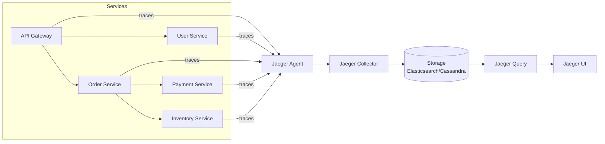
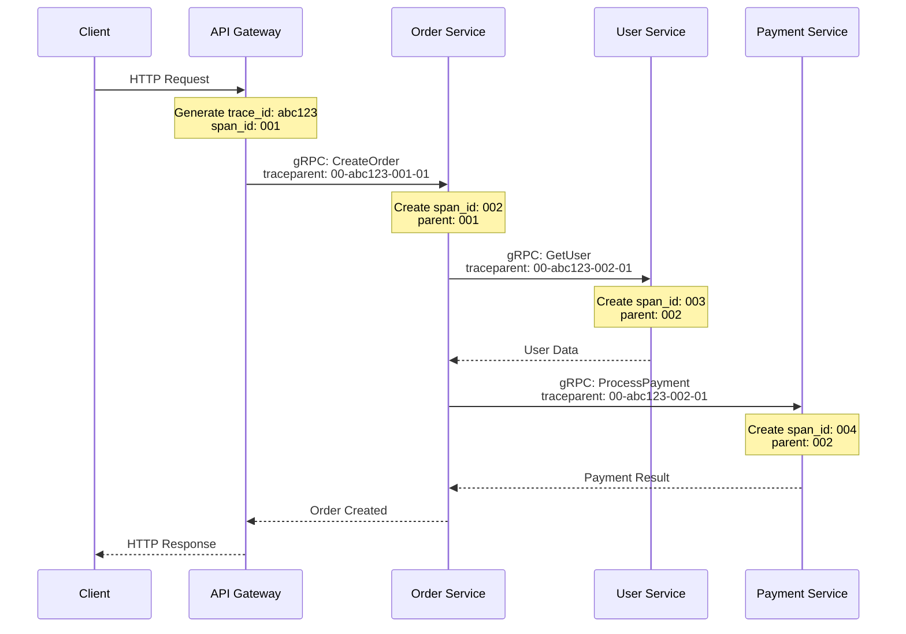
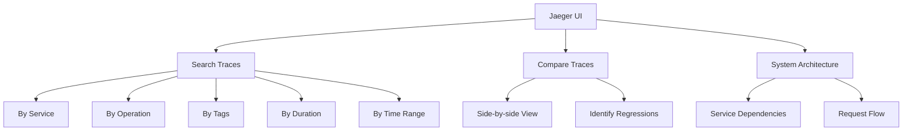

# How to Trace gRPC Calls Across Microservices with Jaeger

Author: [nawazdhandala](https://www.github.com/nawazdhandala)

Tags: gRPC, Jaeger, Distributed Tracing, Microservices, Observability, OpenTelemetry, Debugging

Description: Learn how to set up Jaeger for distributed tracing of gRPC calls across microservices, including trace propagation, sampling strategies, and troubleshooting techniques.

---

When a user request flows through multiple gRPC services, understanding the complete journey becomes challenging. Jaeger provides distributed tracing capabilities that let you visualize request flows, identify bottlenecks, and debug issues across your microservices architecture.

## Jaeger Architecture



## Deploying Jaeger

### All-in-One for Development

```yaml
# jaeger-all-in-one.yaml
apiVersion: apps/v1
kind: Deployment
metadata:
  name: jaeger
  namespace: observability
spec:
  replicas: 1
  selector:
    matchLabels:
      app: jaeger
  template:
    metadata:
      labels:
        app: jaeger
    spec:
      containers:
      - name: jaeger
        image: jaegertracing/all-in-one:1.50
        ports:
        - containerPort: 5775   # UDP - agent zipkin thrift compact
        - containerPort: 6831   # UDP - agent jaeger thrift compact
        - containerPort: 6832   # UDP - agent jaeger thrift binary
        - containerPort: 5778   # HTTP - agent config
        - containerPort: 16686  # HTTP - query UI
        - containerPort: 14268  # HTTP - collector jaeger thrift
        - containerPort: 14250  # gRPC - collector model.proto
        - containerPort: 4317   # gRPC - OTLP
        - containerPort: 4318   # HTTP - OTLP
        env:
        - name: COLLECTOR_OTLP_ENABLED
          value: "true"
        - name: SPAN_STORAGE_TYPE
          value: "memory"
        resources:
          limits:
            memory: "1Gi"
            cpu: "500m"
---
apiVersion: v1
kind: Service
metadata:
  name: jaeger
  namespace: observability
spec:
  selector:
    app: jaeger
  ports:
  - name: agent-compact
    port: 6831
    protocol: UDP
  - name: agent-binary
    port: 6832
    protocol: UDP
  - name: query
    port: 16686
  - name: collector-grpc
    port: 14250
  - name: otlp-grpc
    port: 4317
  - name: otlp-http
    port: 4318
```

### Production Deployment with Elasticsearch

```yaml
# jaeger-production.yaml
apiVersion: apps/v1
kind: Deployment
metadata:
  name: jaeger-collector
  namespace: observability
spec:
  replicas: 3
  selector:
    matchLabels:
      app: jaeger-collector
  template:
    metadata:
      labels:
        app: jaeger-collector
    spec:
      containers:
      - name: collector
        image: jaegertracing/jaeger-collector:1.50
        ports:
        - containerPort: 14250
        - containerPort: 14268
        - containerPort: 4317
        env:
        - name: SPAN_STORAGE_TYPE
          value: "elasticsearch"
        - name: ES_SERVER_URLS
          value: "http://elasticsearch:9200"
        - name: ES_INDEX_PREFIX
          value: "jaeger"
        - name: ES_TAGS_AS_FIELDS_ALL
          value: "true"
        - name: COLLECTOR_OTLP_ENABLED
          value: "true"
        resources:
          limits:
            memory: "512Mi"
            cpu: "500m"
---
apiVersion: apps/v1
kind: Deployment
metadata:
  name: jaeger-query
  namespace: observability
spec:
  replicas: 2
  selector:
    matchLabels:
      app: jaeger-query
  template:
    metadata:
      labels:
        app: jaeger-query
    spec:
      containers:
      - name: query
        image: jaegertracing/jaeger-query:1.50
        ports:
        - containerPort: 16686
        - containerPort: 16687
        env:
        - name: SPAN_STORAGE_TYPE
          value: "elasticsearch"
        - name: ES_SERVER_URLS
          value: "http://elasticsearch:9200"
        - name: ES_INDEX_PREFIX
          value: "jaeger"
        resources:
          limits:
            memory: "256Mi"
            cpu: "250m"
---
apiVersion: apps/v1
kind: DaemonSet
metadata:
  name: jaeger-agent
  namespace: observability
spec:
  selector:
    matchLabels:
      app: jaeger-agent
  template:
    metadata:
      labels:
        app: jaeger-agent
    spec:
      containers:
      - name: agent
        image: jaegertracing/jaeger-agent:1.50
        ports:
        - containerPort: 5775
          protocol: UDP
        - containerPort: 6831
          protocol: UDP
        - containerPort: 6832
          protocol: UDP
        - containerPort: 5778
        args:
        - "--reporter.grpc.host-port=jaeger-collector:14250"
        resources:
          limits:
            memory: "128Mi"
            cpu: "100m"
```

## Instrumenting gRPC Services with Jaeger

### Go Implementation with OpenTelemetry

```go
package tracing

import (
    "context"
    "time"

    "go.opentelemetry.io/otel"
    "go.opentelemetry.io/otel/exporters/otlp/otlptrace/otlptracegrpc"
    "go.opentelemetry.io/otel/propagation"
    "go.opentelemetry.io/otel/sdk/resource"
    sdktrace "go.opentelemetry.io/otel/sdk/trace"
    semconv "go.opentelemetry.io/otel/semconv/v1.21.0"
)

type JaegerConfig struct {
    ServiceName    string
    ServiceVersion string
    Environment    string
    JaegerEndpoint string  // e.g., "jaeger:4317"
    SampleRate     float64
}

func InitJaegerTracer(cfg JaegerConfig) (*sdktrace.TracerProvider, error) {
    ctx := context.Background()

    // Create OTLP exporter pointing to Jaeger
    exporter, err := otlptracegrpc.New(ctx,
        otlptracegrpc.WithEndpoint(cfg.JaegerEndpoint),
        otlptracegrpc.WithInsecure(),
        otlptracegrpc.WithRetry(otlptracegrpc.RetryConfig{
            Enabled:         true,
            InitialInterval: 500 * time.Millisecond,
            MaxInterval:     5 * time.Second,
            MaxElapsedTime:  30 * time.Second,
        }),
    )
    if err != nil {
        return nil, err
    }

    // Create resource
    res, err := resource.New(ctx,
        resource.WithAttributes(
            semconv.ServiceName(cfg.ServiceName),
            semconv.ServiceVersion(cfg.ServiceVersion),
            semconv.DeploymentEnvironment(cfg.Environment),
        ),
        resource.WithHost(),
        resource.WithProcess(),
        resource.WithTelemetrySDK(),
    )
    if err != nil {
        return nil, err
    }

    // Configure sampler
    var sampler sdktrace.Sampler
    switch {
    case cfg.SampleRate >= 1.0:
        sampler = sdktrace.AlwaysSample()
    case cfg.SampleRate <= 0:
        sampler = sdktrace.NeverSample()
    default:
        // Parent-based sampling with ratio fallback
        sampler = sdktrace.ParentBased(
            sdktrace.TraceIDRatioBased(cfg.SampleRate),
        )
    }

    // Create TracerProvider
    tp := sdktrace.NewTracerProvider(
        sdktrace.WithBatcher(exporter,
            sdktrace.WithBatchTimeout(5*time.Second),
            sdktrace.WithMaxExportBatchSize(512),
            sdktrace.WithMaxQueueSize(2048),
        ),
        sdktrace.WithResource(res),
        sdktrace.WithSampler(sampler),
    )

    // Set as global provider
    otel.SetTracerProvider(tp)
    otel.SetTextMapPropagator(propagation.NewCompositeTextMapPropagator(
        propagation.TraceContext{},
        propagation.Baggage{},
    ))

    return tp, nil
}
```

### gRPC Server with Tracing

```go
package main

import (
    "context"
    "log"
    "net"

    "go.opentelemetry.io/contrib/instrumentation/google.golang.org/grpc/otelgrpc"
    "go.opentelemetry.io/otel"
    "go.opentelemetry.io/otel/attribute"
    "go.opentelemetry.io/otel/codes"
    "go.opentelemetry.io/otel/trace"
    "google.golang.org/grpc"

    pb "your-project/proto"
    "your-project/tracing"
)

type orderService struct {
    pb.UnimplementedOrderServiceServer
    userClient    pb.UserServiceClient
    paymentClient pb.PaymentServiceClient
    tracer        trace.Tracer
}

func (s *orderService) CreateOrder(ctx context.Context, req *pb.CreateOrderRequest) (*pb.Order, error) {
    // Start a child span for this operation
    ctx, span := s.tracer.Start(ctx, "CreateOrder",
        trace.WithAttributes(
            attribute.String("customer_id", req.CustomerId),
            attribute.Int("item_count", len(req.Items)),
        ),
    )
    defer span.End()

    // Validate user (traced call to User Service)
    user, err := s.validateUser(ctx, req.CustomerId)
    if err != nil {
        span.RecordError(err)
        span.SetStatus(codes.Error, "user validation failed")
        return nil, err
    }
    span.AddEvent("user_validated", trace.WithAttributes(
        attribute.String("user_email", user.Email),
    ))

    // Calculate total
    ctx, calcSpan := s.tracer.Start(ctx, "CalculateTotal")
    total := s.calculateTotal(req.Items)
    calcSpan.SetAttributes(attribute.Float64("total_amount", total))
    calcSpan.End()

    // Process payment (traced call to Payment Service)
    paymentResult, err := s.processPayment(ctx, req.CustomerId, total)
    if err != nil {
        span.RecordError(err)
        span.SetStatus(codes.Error, "payment processing failed")
        return nil, err
    }
    span.AddEvent("payment_processed", trace.WithAttributes(
        attribute.String("transaction_id", paymentResult.TransactionId),
    ))

    // Create order record
    order := &pb.Order{
        Id:            generateOrderID(),
        CustomerId:    req.CustomerId,
        Items:         req.Items,
        TotalAmount:   total,
        TransactionId: paymentResult.TransactionId,
        Status:        "confirmed",
    }

    span.SetAttributes(attribute.String("order_id", order.Id))
    span.SetStatus(codes.Ok, "order created successfully")

    return order, nil
}

func (s *orderService) validateUser(ctx context.Context, userID string) (*pb.User, error) {
    ctx, span := s.tracer.Start(ctx, "ValidateUser",
        trace.WithSpanKind(trace.SpanKindClient),
    )
    defer span.End()

    user, err := s.userClient.GetUser(ctx, &pb.GetUserRequest{UserId: userID})
    if err != nil {
        span.RecordError(err)
        span.SetStatus(codes.Error, err.Error())
        return nil, err
    }

    span.SetAttributes(
        attribute.String("user.id", user.Id),
        attribute.String("user.status", user.Status),
    )

    return user, nil
}

func (s *orderService) processPayment(ctx context.Context, customerID string, amount float64) (*pb.PaymentResult, error) {
    ctx, span := s.tracer.Start(ctx, "ProcessPayment",
        trace.WithSpanKind(trace.SpanKindClient),
        trace.WithAttributes(
            attribute.String("customer_id", customerID),
            attribute.Float64("amount", amount),
        ),
    )
    defer span.End()

    result, err := s.paymentClient.ProcessPayment(ctx, &pb.PaymentRequest{
        CustomerId: customerID,
        Amount:     amount,
    })
    if err != nil {
        span.RecordError(err)
        span.SetStatus(codes.Error, err.Error())
        return nil, err
    }

    span.SetAttributes(attribute.String("transaction_id", result.TransactionId))
    return result, nil
}

func main() {
    // Initialize Jaeger tracer
    tp, err := tracing.InitJaegerTracer(tracing.JaegerConfig{
        ServiceName:    "order-service",
        ServiceVersion: "1.0.0",
        Environment:    "production",
        JaegerEndpoint: "jaeger:4317",
        SampleRate:     0.1,
    })
    if err != nil {
        log.Fatal(err)
    }
    defer tp.Shutdown(context.Background())

    tracer := otel.Tracer("order-service")

    // Create gRPC clients with tracing
    userConn, _ := grpc.NewClient("user-service:50051",
        grpc.WithTransportCredentials(insecure.NewCredentials()),
        grpc.WithStatsHandler(otelgrpc.NewClientHandler()),
    )

    paymentConn, _ := grpc.NewClient("payment-service:50052",
        grpc.WithTransportCredentials(insecure.NewCredentials()),
        grpc.WithStatsHandler(otelgrpc.NewClientHandler()),
    )

    // Create gRPC server with tracing
    server := grpc.NewServer(
        grpc.StatsHandler(otelgrpc.NewServerHandler()),
    )

    orderSvc := &orderService{
        userClient:    pb.NewUserServiceClient(userConn),
        paymentClient: pb.NewPaymentServiceClient(paymentConn),
        tracer:        tracer,
    }

    pb.RegisterOrderServiceServer(server, orderSvc)

    lis, _ := net.Listen("tcp", ":50051")
    log.Println("Order service starting on :50051")
    server.Serve(lis)
}
```

## Trace Context Propagation

Understanding how trace context flows through your services:



### Manual Context Propagation

For cases where automatic propagation doesn't work:

```go
package tracing

import (
    "context"

    "go.opentelemetry.io/otel"
    "go.opentelemetry.io/otel/propagation"
    "google.golang.org/grpc/metadata"
)

// MetadataCarrier implements propagation.TextMapCarrier for gRPC metadata
type MetadataCarrier struct {
    MD metadata.MD
}

func (c *MetadataCarrier) Get(key string) string {
    values := c.MD.Get(key)
    if len(values) > 0 {
        return values[0]
    }
    return ""
}

func (c *MetadataCarrier) Set(key, value string) {
    c.MD.Set(key, value)
}

func (c *MetadataCarrier) Keys() []string {
    keys := make([]string, 0, len(c.MD))
    for k := range c.MD {
        keys = append(keys, k)
    }
    return keys
}

// InjectTraceContext injects trace context into outgoing gRPC metadata
func InjectTraceContext(ctx context.Context) context.Context {
    md, ok := metadata.FromOutgoingContext(ctx)
    if !ok {
        md = metadata.New(nil)
    } else {
        md = md.Copy()
    }

    propagator := otel.GetTextMapPropagator()
    propagator.Inject(ctx, &MetadataCarrier{MD: md})

    return metadata.NewOutgoingContext(ctx, md)
}

// ExtractTraceContext extracts trace context from incoming gRPC metadata
func ExtractTraceContext(ctx context.Context) context.Context {
    md, ok := metadata.FromIncomingContext(ctx)
    if !ok {
        return ctx
    }

    propagator := otel.GetTextMapPropagator()
    return propagator.Extract(ctx, &MetadataCarrier{MD: md})
}
```

## Sampling Strategies

### Adaptive Sampling

```go
package sampling

import (
    sdktrace "go.opentelemetry.io/otel/sdk/trace"
)

// Sampling strategies for different scenarios

// Development: Sample everything
func DevelopmentSampler() sdktrace.Sampler {
    return sdktrace.AlwaysSample()
}

// Production: Sample 10% of traces
func ProductionSampler() sdktrace.Sampler {
    return sdktrace.ParentBased(
        sdktrace.TraceIDRatioBased(0.1),
    )
}

// High-traffic: Sample 1% of traces
func HighTrafficSampler() sdktrace.Sampler {
    return sdktrace.ParentBased(
        sdktrace.TraceIDRatioBased(0.01),
    )
}

// Adaptive sampler based on error rate
type AdaptiveSampler struct {
    baseSampler    sdktrace.Sampler
    errorSampler   sdktrace.Sampler
    isHighError    func() bool
}

func NewAdaptiveSampler(baseRate, errorRate float64, isHighError func() bool) *AdaptiveSampler {
    return &AdaptiveSampler{
        baseSampler:  sdktrace.TraceIDRatioBased(baseRate),
        errorSampler: sdktrace.TraceIDRatioBased(errorRate),
        isHighError:  isHighError,
    }
}

func (s *AdaptiveSampler) ShouldSample(p sdktrace.SamplingParameters) sdktrace.SamplingResult {
    // Use higher sample rate during error conditions
    if s.isHighError() {
        return s.errorSampler.ShouldSample(p)
    }
    return s.baseSampler.ShouldSample(p)
}

func (s *AdaptiveSampler) Description() string {
    return "AdaptiveSampler"
}
```

### Priority-Based Sampling

```go
package sampling

import (
    "go.opentelemetry.io/otel/attribute"
    sdktrace "go.opentelemetry.io/otel/sdk/trace"
)

// PrioritySampler samples based on request priority
type PrioritySampler struct {
    highPriority   sdktrace.Sampler
    normalPriority sdktrace.Sampler
    lowPriority    sdktrace.Sampler
}

func NewPrioritySampler() *PrioritySampler {
    return &PrioritySampler{
        highPriority:   sdktrace.AlwaysSample(),      // 100%
        normalPriority: sdktrace.TraceIDRatioBased(0.1), // 10%
        lowPriority:    sdktrace.TraceIDRatioBased(0.01), // 1%
    }
}

func (s *PrioritySampler) ShouldSample(p sdktrace.SamplingParameters) sdktrace.SamplingResult {
    for _, attr := range p.Attributes {
        if attr.Key == "priority" {
            switch attr.Value.AsString() {
            case "high":
                return s.highPriority.ShouldSample(p)
            case "low":
                return s.lowPriority.ShouldSample(p)
            }
        }
    }
    return s.normalPriority.ShouldSample(p)
}

func (s *PrioritySampler) Description() string {
    return "PrioritySampler"
}

// Usage in service
func (s *orderService) CreateOrder(ctx context.Context, req *pb.CreateOrderRequest) (*pb.Order, error) {
    priority := "normal"
    if req.IsExpress {
        priority = "high"
    }

    ctx, span := s.tracer.Start(ctx, "CreateOrder",
        trace.WithAttributes(
            attribute.String("priority", priority),
        ),
    )
    defer span.End()
    // ...
}
```

## Jaeger UI Navigation

### Key UI Features



### Useful Search Queries

| Search Goal | Query |
|-------------|-------|
| Errors in order service | `service=order-service error=true` |
| Slow requests (>1s) | `service=order-service minDuration=1s` |
| Specific user's requests | `service=api-gateway user.id=user-123` |
| Payment failures | `service=payment-service status=failed` |
| High-value orders | `service=order-service order.value>1000` |

## Troubleshooting with Traces

### Common Issues and How to Debug

```go
package debugging

import (
    "context"

    "go.opentelemetry.io/otel/attribute"
    "go.opentelemetry.io/otel/codes"
    "go.opentelemetry.io/otel/trace"
)

// Add detailed span information for debugging
func (s *orderService) CreateOrderWithDebugging(ctx context.Context, req *pb.CreateOrderRequest) (*pb.Order, error) {
    ctx, span := s.tracer.Start(ctx, "CreateOrder")
    defer span.End()

    // Record input parameters
    span.SetAttributes(
        attribute.String("customer_id", req.CustomerId),
        attribute.Int("item_count", len(req.Items)),
        attribute.StringSlice("item_ids", extractItemIDs(req.Items)),
    )

    // Step 1: Validate request
    span.AddEvent("validation_started")
    if err := s.validateRequest(ctx, req); err != nil {
        span.RecordError(err,
            trace.WithAttributes(
                attribute.String("error.type", "validation"),
                attribute.String("error.details", err.Error()),
            ),
        )
        span.SetStatus(codes.Error, "validation failed")
        return nil, err
    }
    span.AddEvent("validation_completed")

    // Step 2: Check inventory
    span.AddEvent("inventory_check_started")
    availability, err := s.checkInventory(ctx, req.Items)
    if err != nil {
        span.RecordError(err,
            trace.WithAttributes(
                attribute.String("error.type", "inventory"),
            ),
        )
        span.SetStatus(codes.Error, "inventory check failed")
        return nil, err
    }
    span.AddEvent("inventory_check_completed",
        trace.WithAttributes(
            attribute.Bool("all_available", availability.AllAvailable),
            attribute.StringSlice("unavailable_items", availability.UnavailableItems),
        ),
    )

    // Step 3: Reserve items
    span.AddEvent("reservation_started")
    reservationID, err := s.reserveItems(ctx, req.Items)
    if err != nil {
        span.RecordError(err,
            trace.WithAttributes(
                attribute.String("error.type", "reservation"),
            ),
        )
        span.SetStatus(codes.Error, "reservation failed")
        return nil, err
    }
    span.SetAttributes(attribute.String("reservation_id", reservationID))
    span.AddEvent("reservation_completed")

    // Step 4: Process payment
    span.AddEvent("payment_started")
    paymentResult, err := s.processPayment(ctx, req)
    if err != nil {
        // Important: Record both the error and attempt to release reservation
        span.RecordError(err,
            trace.WithAttributes(
                attribute.String("error.type", "payment"),
                attribute.String("payment.error_code", extractPaymentErrorCode(err)),
            ),
        )

        // Attempt rollback
        span.AddEvent("rollback_started")
        if rollbackErr := s.releaseReservation(ctx, reservationID); rollbackErr != nil {
            span.RecordError(rollbackErr,
                trace.WithAttributes(
                    attribute.String("error.type", "rollback"),
                ),
            )
        }
        span.AddEvent("rollback_completed")

        span.SetStatus(codes.Error, "payment failed")
        return nil, err
    }
    span.SetAttributes(attribute.String("transaction_id", paymentResult.TransactionId))
    span.AddEvent("payment_completed")

    // Create order
    order := s.createOrderRecord(req, paymentResult)
    span.SetAttributes(attribute.String("order_id", order.Id))
    span.SetStatus(codes.Ok, "order created successfully")

    return order, nil
}
```

### Debugging Latency Issues

```go
package debugging

import (
    "context"
    "time"

    "go.opentelemetry.io/otel/attribute"
    "go.opentelemetry.io/otel/trace"
)

// TimedOperation wraps an operation with timing information
func TimedOperation(ctx context.Context, tracer trace.Tracer, name string, operation func(context.Context) error) error {
    ctx, span := tracer.Start(ctx, name)
    defer span.End()

    start := time.Now()
    err := operation(ctx)
    duration := time.Since(start)

    span.SetAttributes(
        attribute.Int64("duration_ms", duration.Milliseconds()),
    )

    if duration > time.Second {
        span.SetAttributes(attribute.Bool("slow_operation", true))
    }

    if err != nil {
        span.RecordError(err)
    }

    return err
}

// Debug slow database queries
func (s *orderService) debugSlowQuery(ctx context.Context, query string, args ...interface{}) {
    span := trace.SpanFromContext(ctx)

    span.SetAttributes(
        attribute.String("db.query", sanitizeQuery(query)),
        attribute.Int("db.args_count", len(args)),
    )

    // Add query plan if available
    if plan, err := s.getQueryPlan(ctx, query); err == nil {
        span.SetAttributes(
            attribute.String("db.query_plan", plan),
            attribute.Bool("db.uses_index", planUsesIndex(plan)),
        )
    }
}
```

## Kubernetes Service Configuration

```yaml
# service-deployment.yaml
apiVersion: apps/v1
kind: Deployment
metadata:
  name: order-service
spec:
  replicas: 3
  selector:
    matchLabels:
      app: order-service
  template:
    metadata:
      labels:
        app: order-service
      annotations:
        sidecar.jaegertracing.io/inject: "true"
    spec:
      containers:
      - name: order-service
        image: order-service:latest
        env:
        - name: OTEL_EXPORTER_OTLP_ENDPOINT
          value: "jaeger-collector.observability:4317"
        - name: OTEL_SERVICE_NAME
          value: "order-service"
        - name: OTEL_TRACES_SAMPLER
          value: "parentbased_traceidratio"
        - name: OTEL_TRACES_SAMPLER_ARG
          value: "0.1"
        - name: OTEL_RESOURCE_ATTRIBUTES
          value: "service.namespace=production,service.instance.id=$(POD_NAME),k8s.pod.name=$(POD_NAME),k8s.namespace.name=$(POD_NAMESPACE)"
        - name: POD_NAME
          valueFrom:
            fieldRef:
              fieldPath: metadata.name
        - name: POD_NAMESPACE
          valueFrom:
            fieldRef:
              fieldPath: metadata.namespace
```

## Alerting on Traces

Configure alerts based on trace data:

```yaml
# jaeger-alerts.yaml (using Prometheus with Jaeger metrics)
groups:
  - name: jaeger_trace_alerts
    rules:
      # Alert on high error rate in traces
      - alert: HighTraceErrorRate
        expr: |
          sum(rate(jaeger_spans_total{status="error"}[5m])) by (service)
          /
          sum(rate(jaeger_spans_total[5m])) by (service)
          > 0.05
        for: 5m
        labels:
          severity: warning
        annotations:
          summary: "High error rate in traces for {{ $labels.service }}"

      # Alert on slow traces
      - alert: SlowTraces
        expr: |
          histogram_quantile(0.99,
            sum(rate(jaeger_span_duration_seconds_bucket[5m])) by (service, le)
          ) > 5
        for: 5m
        labels:
          severity: warning
        annotations:
          summary: "P99 trace duration exceeds 5s for {{ $labels.service }}"

      # Alert on missing traces
      - alert: NoTracesReceived
        expr: |
          sum(rate(jaeger_spans_total[5m])) by (service) == 0
        for: 10m
        labels:
          severity: warning
        annotations:
          summary: "No traces received from {{ $labels.service }}"
```

## Best Practices

1. **Use Meaningful Span Names**: Name spans after the operation, not the function name
2. **Add Business Context**: Include relevant business attributes (order_id, customer_tier)
3. **Record Errors Properly**: Always use `span.RecordError()` and set status
4. **Use Events for Milestones**: Add events for significant points in processing
5. **Sample Appropriately**: Use lower sample rates in production, higher during incidents
6. **Propagate Context**: Always pass context through your call chain
7. **Set Resource Attributes**: Include service name, version, and environment
8. **Use Baggage Sparingly**: Only for data that needs to flow through all services

## Conclusion

Jaeger provides powerful distributed tracing capabilities for gRPC microservices. By properly instrumenting your services with OpenTelemetry, configuring appropriate sampling strategies, and learning to navigate the Jaeger UI, you can effectively debug issues, identify bottlenecks, and understand request flow across your entire system. Start with basic instrumentation, then gradually add more detailed spans and attributes as you identify areas that need deeper visibility.
