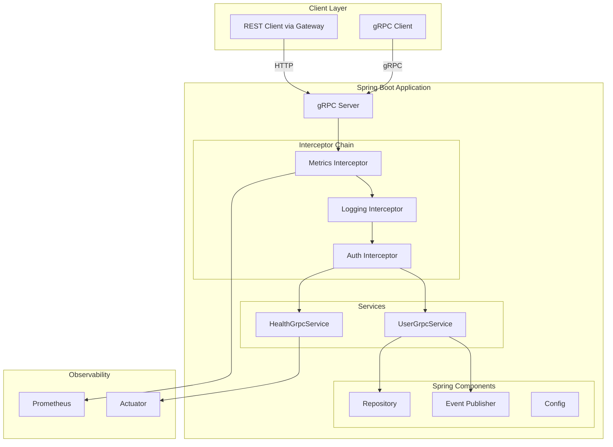

# How to Build gRPC Services in Java with Spring Boot

Author: [nawazdhandala](https://www.github.com/nawazdhandala)

Tags: gRPC, Java, Spring Boot, Microservices, Protocol Buffers, gRPC Spring Boot Starter, Backend Development

Description: A comprehensive guide to building production-ready gRPC services in Java using Spring Boot and grpc-spring-boot-starter, covering service implementation, interceptors, health checks, and Spring ecosystem integration.

---

## Introduction

Spring Boot's ecosystem provides excellent support for building gRPC services through the `grpc-spring-boot-starter` library. This integration allows you to leverage Spring's dependency injection, configuration management, and ecosystem while building high-performance gRPC services.

This guide walks you through creating production-ready gRPC services in Java with Spring Boot, from project setup to advanced patterns for security, monitoring, and deployment.

## Prerequisites

Before starting, ensure you have:

- JDK 17 or later
- Maven or Gradle
- Basic understanding of Spring Boot
- Familiarity with Protocol Buffers

## Project Setup

### Create Spring Boot Project

Using Spring Initializr or manually create a project structure:

```bash
mkdir grpc-spring-boot-service
cd grpc-spring-boot-service
```

### Maven Configuration

Create `pom.xml`:

```xml
<?xml version="1.0" encoding="UTF-8"?>
<project xmlns="http://maven.apache.org/POM/4.0.0"
         xmlns:xsi="http://www.w3.org/2001/XMLSchema-instance"
         xsi:schemaLocation="http://maven.apache.org/POM/4.0.0
         https://maven.apache.org/xsd/maven-4.0.0.xsd">
    <modelVersion>4.0.0</modelVersion>

    <parent>
        <groupId>org.springframework.boot</groupId>
        <artifactId>spring-boot-starter-parent</artifactId>
        <version>3.2.2</version>
        <relativePath/>
    </parent>

    <groupId>com.example</groupId>
    <artifactId>grpc-spring-boot-service</artifactId>
    <version>1.0.0-SNAPSHOT</version>
    <packaging>jar</packaging>

    <name>gRPC Spring Boot Service</name>
    <description>gRPC service built with Spring Boot</description>

    <properties>
        <java.version>17</java.version>
        <grpc.version>1.61.0</grpc.version>
        <protobuf.version>3.25.2</protobuf.version>
        <grpc-spring-boot-starter.version>3.0.0.RELEASE</grpc-spring-boot-starter.version>
    </properties>

    <dependencies>
        <!-- Spring Boot Starters -->
        <dependency>
            <groupId>org.springframework.boot</groupId>
            <artifactId>spring-boot-starter</artifactId>
        </dependency>
        <dependency>
            <groupId>org.springframework.boot</groupId>
            <artifactId>spring-boot-starter-validation</artifactId>
        </dependency>
        <dependency>
            <groupId>org.springframework.boot</groupId>
            <artifactId>spring-boot-starter-actuator</artifactId>
        </dependency>

        <!-- gRPC Spring Boot Starter -->
        <dependency>
            <groupId>net.devh</groupId>
            <artifactId>grpc-server-spring-boot-starter</artifactId>
            <version>${grpc-spring-boot-starter.version}</version>
        </dependency>
        <dependency>
            <groupId>net.devh</groupId>
            <artifactId>grpc-client-spring-boot-starter</artifactId>
            <version>${grpc-spring-boot-starter.version}</version>
        </dependency>

        <!-- gRPC and Protobuf -->
        <dependency>
            <groupId>io.grpc</groupId>
            <artifactId>grpc-protobuf</artifactId>
            <version>${grpc.version}</version>
        </dependency>
        <dependency>
            <groupId>io.grpc</groupId>
            <artifactId>grpc-stub</artifactId>
            <version>${grpc.version}</version>
        </dependency>
        <dependency>
            <groupId>io.grpc</groupId>
            <artifactId>grpc-services</artifactId>
            <version>${grpc.version}</version>
        </dependency>

        <!-- Annotation processor for gRPC -->
        <dependency>
            <groupId>javax.annotation</groupId>
            <artifactId>javax.annotation-api</artifactId>
            <version>1.3.2</version>
        </dependency>

        <!-- Lombok for boilerplate reduction -->
        <dependency>
            <groupId>org.projectlombok</groupId>
            <artifactId>lombok</artifactId>
            <optional>true</optional>
        </dependency>

        <!-- Micrometer for metrics -->
        <dependency>
            <groupId>io.micrometer</groupId>
            <artifactId>micrometer-registry-prometheus</artifactId>
        </dependency>

        <!-- Testing -->
        <dependency>
            <groupId>org.springframework.boot</groupId>
            <artifactId>spring-boot-starter-test</artifactId>
            <scope>test</scope>
        </dependency>
        <dependency>
            <groupId>io.grpc</groupId>
            <artifactId>grpc-testing</artifactId>
            <version>${grpc.version}</version>
            <scope>test</scope>
        </dependency>
    </dependencies>

    <build>
        <extensions>
            <extension>
                <groupId>kr.motd.maven</groupId>
                <artifactId>os-maven-plugin</artifactId>
                <version>1.7.1</version>
            </extension>
        </extensions>

        <plugins>
            <plugin>
                <groupId>org.springframework.boot</groupId>
                <artifactId>spring-boot-maven-plugin</artifactId>
                <configuration>
                    <excludes>
                        <exclude>
                            <groupId>org.projectlombok</groupId>
                            <artifactId>lombok</artifactId>
                        </exclude>
                    </excludes>
                </configuration>
            </plugin>

            <!-- Protobuf Maven Plugin -->
            <plugin>
                <groupId>org.xolstice.maven.plugins</groupId>
                <artifactId>protobuf-maven-plugin</artifactId>
                <version>0.6.1</version>
                <configuration>
                    <protocArtifact>com.google.protobuf:protoc:${protobuf.version}:exe:${os.detected.classifier}</protocArtifact>
                    <pluginId>grpc-java</pluginId>
                    <pluginArtifact>io.grpc:protoc-gen-grpc-java:${grpc.version}:exe:${os.detected.classifier}</pluginArtifact>
                    <protoSourceRoot>${project.basedir}/src/main/proto</protoSourceRoot>
                </configuration>
                <executions>
                    <execution>
                        <goals>
                            <goal>compile</goal>
                            <goal>compile-custom</goal>
                        </goals>
                    </execution>
                </executions>
            </plugin>
        </plugins>
    </build>
</project>
```

### Gradle Configuration (Alternative)

Create `build.gradle`:

```groovy
plugins {
    id 'java'
    id 'org.springframework.boot' version '3.2.2'
    id 'io.spring.dependency-management' version '1.1.4'
    id 'com.google.protobuf' version '0.9.4'
}

group = 'com.example'
version = '1.0.0-SNAPSHOT'

java {
    sourceCompatibility = '17'
}

configurations {
    compileOnly {
        extendsFrom annotationProcessor
    }
}

repositories {
    mavenCentral()
}

ext {
    grpcVersion = '1.61.0'
    protobufVersion = '3.25.2'
    grpcSpringBootStarterVersion = '3.0.0.RELEASE'
}

dependencies {
    implementation 'org.springframework.boot:spring-boot-starter'
    implementation 'org.springframework.boot:spring-boot-starter-validation'
    implementation 'org.springframework.boot:spring-boot-starter-actuator'

    implementation "net.devh:grpc-server-spring-boot-starter:${grpcSpringBootStarterVersion}"
    implementation "net.devh:grpc-client-spring-boot-starter:${grpcSpringBootStarterVersion}"

    implementation "io.grpc:grpc-protobuf:${grpcVersion}"
    implementation "io.grpc:grpc-stub:${grpcVersion}"
    implementation "io.grpc:grpc-services:${grpcVersion}"

    implementation 'javax.annotation:javax.annotation-api:1.3.2'
    implementation 'io.micrometer:micrometer-registry-prometheus'

    compileOnly 'org.projectlombok:lombok'
    annotationProcessor 'org.projectlombok:lombok'

    testImplementation 'org.springframework.boot:spring-boot-starter-test'
    testImplementation "io.grpc:grpc-testing:${grpcVersion}"
}

protobuf {
    protoc {
        artifact = "com.google.protobuf:protoc:${protobufVersion}"
    }
    plugins {
        grpc {
            artifact = "io.grpc:protoc-gen-grpc-java:${grpcVersion}"
        }
    }
    generateProtoTasks {
        all()*.plugins {
            grpc {}
        }
    }
}

sourceSets {
    main {
        java {
            srcDirs 'build/generated/source/proto/main/grpc'
            srcDirs 'build/generated/source/proto/main/java'
        }
    }
}

tasks.named('test') {
    useJUnitPlatform()
}
```

### Project Structure

```
grpc-spring-boot-service/
├── src/
│   ├── main/
│   │   ├── java/
│   │   │   └── com/example/grpc/
│   │   │       ├── GrpcApplication.java
│   │   │       ├── config/
│   │   │       │   ├── GrpcServerConfig.java
│   │   │       │   └── SecurityConfig.java
│   │   │       ├── service/
│   │   │       │   ├── UserGrpcService.java
│   │   │       │   └── HealthGrpcService.java
│   │   │       ├── interceptor/
│   │   │       │   ├── LoggingInterceptor.java
│   │   │       │   ├── AuthInterceptor.java
│   │   │       │   └── MetricsInterceptor.java
│   │   │       ├── repository/
│   │   │       │   └── UserRepository.java
│   │   │       ├── model/
│   │   │       │   └── User.java
│   │   │       └── exception/
│   │   │           └── GrpcExceptionHandler.java
│   │   ├── proto/
│   │   │   └── user.proto
│   │   └── resources/
│   │       └── application.yml
│   └── test/
│       └── java/
│           └── com/example/grpc/
│               └── service/
│                   └── UserGrpcServiceTest.java
├── pom.xml
└── README.md
```

## Protocol Buffer Definition

### Define the Service

Create `src/main/proto/user.proto`:

```protobuf
syntax = "proto3";

package com.example.grpc;

option java_multiple_files = true;
option java_package = "com.example.grpc.proto";
option java_outer_classname = "UserProto";

import "google/protobuf/timestamp.proto";
import "google/protobuf/empty.proto";
import "google/protobuf/wrappers.proto";

// User entity
message User {
    string id = 1;
    string username = 2;
    string email = 3;
    string full_name = 4;
    UserRole role = 5;
    UserStatus status = 6;
    google.protobuf.Timestamp created_at = 7;
    google.protobuf.Timestamp updated_at = 8;
    map<string, string> attributes = 9;
}

enum UserRole {
    USER_ROLE_UNSPECIFIED = 0;
    USER_ROLE_USER = 1;
    USER_ROLE_ADMIN = 2;
    USER_ROLE_MODERATOR = 3;
}

enum UserStatus {
    USER_STATUS_UNSPECIFIED = 0;
    USER_STATUS_ACTIVE = 1;
    USER_STATUS_INACTIVE = 2;
    USER_STATUS_SUSPENDED = 3;
    USER_STATUS_DELETED = 4;
}

// Request messages
message CreateUserRequest {
    string username = 1;
    string email = 2;
    string full_name = 3;
    string password = 4;
    UserRole role = 5;
    map<string, string> attributes = 6;
}

message GetUserRequest {
    string user_id = 1;
}

message GetUserByUsernameRequest {
    string username = 1;
}

message UpdateUserRequest {
    string user_id = 1;
    google.protobuf.StringValue username = 2;
    google.protobuf.StringValue email = 3;
    google.protobuf.StringValue full_name = 4;
    UserRole role = 5;
    UserStatus status = 6;
    map<string, string> attributes = 7;
}

message DeleteUserRequest {
    string user_id = 1;
    bool hard_delete = 2;
}

message ListUsersRequest {
    int32 page_size = 1;
    string page_token = 2;
    UserStatus status_filter = 3;
    UserRole role_filter = 4;
    string search_query = 5;
    SortOrder sort_order = 6;
}

enum SortOrder {
    SORT_ORDER_UNSPECIFIED = 0;
    SORT_ORDER_CREATED_ASC = 1;
    SORT_ORDER_CREATED_DESC = 2;
    SORT_ORDER_USERNAME_ASC = 3;
    SORT_ORDER_USERNAME_DESC = 4;
}

// Response messages
message CreateUserResponse {
    User user = 1;
}

message GetUserResponse {
    User user = 1;
}

message UpdateUserResponse {
    User user = 1;
}

message DeleteUserResponse {
    bool success = 1;
    string message = 2;
}

message ListUsersResponse {
    repeated User users = 1;
    string next_page_token = 2;
    int32 total_count = 3;
    bool has_more = 4;
}

// Streaming messages
message WatchUsersRequest {
    repeated string user_ids = 1;
    bool watch_all = 2;
    repeated EventType event_types = 3;
}

message UserEvent {
    string event_id = 1;
    EventType event_type = 2;
    User user = 3;
    google.protobuf.Timestamp timestamp = 4;
    map<string, string> metadata = 5;
}

enum EventType {
    EVENT_TYPE_UNSPECIFIED = 0;
    EVENT_TYPE_CREATED = 1;
    EVENT_TYPE_UPDATED = 2;
    EVENT_TYPE_DELETED = 3;
    EVENT_TYPE_STATUS_CHANGED = 4;
}

message BatchCreateUsersRequest {
    repeated CreateUserRequest users = 1;
    bool continue_on_error = 2;
}

message BatchCreateUsersResponse {
    repeated User created_users = 1;
    repeated BatchError errors = 2;
    int32 success_count = 3;
    int32 error_count = 4;
}

message BatchError {
    int32 index = 1;
    string error_code = 2;
    string error_message = 3;
}

// User Service Definition
service UserService {
    // Unary RPCs
    rpc CreateUser(CreateUserRequest) returns (CreateUserResponse);
    rpc GetUser(GetUserRequest) returns (GetUserResponse);
    rpc GetUserByUsername(GetUserByUsernameRequest) returns (GetUserResponse);
    rpc UpdateUser(UpdateUserRequest) returns (UpdateUserResponse);
    rpc DeleteUser(DeleteUserRequest) returns (DeleteUserResponse);
    rpc ListUsers(ListUsersRequest) returns (ListUsersResponse);

    // Server streaming
    rpc WatchUsers(WatchUsersRequest) returns (stream UserEvent);

    // Client streaming
    rpc BatchCreateUsers(stream CreateUserRequest) returns (BatchCreateUsersResponse);

    // Bidirectional streaming
    rpc SyncUsers(stream UpdateUserRequest) returns (stream UserEvent);
}
```

## Application Configuration

### Application Properties

Create `src/main/resources/application.yml`:

```yaml
spring:
  application:
    name: grpc-user-service

# gRPC Server Configuration
grpc:
  server:
    port: 9090
    # Enable reflection for grpcurl
    reflection-service-enabled: true
    # Security settings
    security:
      enabled: false
    # Health service
    health-service-enabled: true
    # Keepalive settings
    keepAliveTime: 30s
    keepAliveTimeout: 5s
    permitKeepAliveWithoutCalls: true
    maxInboundMessageSize: 4194304  # 4MB
    maxInboundMetadataSize: 8192

# gRPC Client Configuration (for inter-service communication)
grpc:
  client:
    GLOBAL:
      negotiationType: plaintext
      enableKeepAlive: true
      keepAliveTime: 30s
      keepAliveTimeout: 5s

# Actuator endpoints
management:
  endpoints:
    web:
      exposure:
        include: health,info,metrics,prometheus
  endpoint:
    health:
      show-details: always
  metrics:
    tags:
      application: ${spring.application.name}

# Logging
logging:
  level:
    root: INFO
    com.example.grpc: DEBUG
    io.grpc: INFO
    net.devh.boot.grpc: DEBUG

# Custom application properties
app:
  security:
    enabled: false
    jwt:
      secret: ${JWT_SECRET:your-secret-key}
      expiration: 86400000
```

### Main Application Class

Create `src/main/java/com/example/grpc/GrpcApplication.java`:

```java
package com.example.grpc;

import org.springframework.boot.SpringApplication;
import org.springframework.boot.autoconfigure.SpringBootApplication;
import org.springframework.scheduling.annotation.EnableAsync;

@SpringBootApplication
@EnableAsync
public class GrpcApplication {

    public static void main(String[] args) {
        SpringApplication.run(GrpcApplication.class, args);
    }
}
```

## Domain Model

### User Entity

Create `src/main/java/com/example/grpc/model/User.java`:

```java
package com.example.grpc.model;

import com.example.grpc.proto.UserRole;
import com.example.grpc.proto.UserStatus;
import lombok.AllArgsConstructor;
import lombok.Builder;
import lombok.Data;
import lombok.NoArgsConstructor;

import java.time.Instant;
import java.util.HashMap;
import java.util.Map;

@Data
@Builder
@NoArgsConstructor
@AllArgsConstructor
public class User {

    private String id;
    private String username;
    private String email;
    private String fullName;
    private String passwordHash;
    private UserRole role;
    private UserStatus status;
    private Instant createdAt;
    private Instant updatedAt;

    @Builder.Default
    private Map<String, String> attributes = new HashMap<>();
}
```

### User Repository

Create `src/main/java/com/example/grpc/repository/UserRepository.java`:

```java
package com.example.grpc.repository;

import com.example.grpc.model.User;
import com.example.grpc.proto.UserRole;
import com.example.grpc.proto.UserStatus;
import lombok.extern.slf4j.Slf4j;
import org.springframework.stereotype.Repository;

import java.time.Instant;
import java.util.*;
import java.util.concurrent.ConcurrentHashMap;
import java.util.function.Consumer;
import java.util.stream.Collectors;

@Slf4j
@Repository
public class UserRepository {

    private final Map<String, User> users = new ConcurrentHashMap<>();
    private final List<Consumer<UserEvent>> eventListeners = new ArrayList<>();

    public record UserEvent(EventType type, User user) {
        public enum EventType { CREATED, UPDATED, DELETED }
    }

    public Optional<User> findById(String id) {
        return Optional.ofNullable(users.get(id));
    }

    public Optional<User> findByUsername(String username) {
        return users.values().stream()
                .filter(user -> user.getUsername().equals(username))
                .findFirst();
    }

    public Optional<User> findByEmail(String email) {
        return users.values().stream()
                .filter(user -> user.getEmail().equals(email))
                .findFirst();
    }

    public User save(User user) {
        boolean isNew = user.getId() == null || !users.containsKey(user.getId());

        if (isNew) {
            user.setId(UUID.randomUUID().toString());
            user.setCreatedAt(Instant.now());
        }
        user.setUpdatedAt(Instant.now());

        users.put(user.getId(), user);

        // Emit event
        UserEvent.EventType eventType = isNew ?
                UserEvent.EventType.CREATED : UserEvent.EventType.UPDATED;
        emitEvent(new UserEvent(eventType, user));

        log.debug("User saved: {} ({})", user.getId(), isNew ? "created" : "updated");
        return user;
    }

    public boolean deleteById(String id) {
        User user = users.remove(id);
        if (user != null) {
            emitEvent(new UserEvent(UserEvent.EventType.DELETED, user));
            log.debug("User deleted: {}", id);
            return true;
        }
        return false;
    }

    public List<User> findAll(UserStatus statusFilter, UserRole roleFilter,
                              String searchQuery, int pageSize, String pageToken) {
        return users.values().stream()
                .filter(user -> statusFilter == null ||
                        statusFilter == UserStatus.USER_STATUS_UNSPECIFIED ||
                        user.getStatus() == statusFilter)
                .filter(user -> roleFilter == null ||
                        roleFilter == UserRole.USER_ROLE_UNSPECIFIED ||
                        user.getRole() == roleFilter)
                .filter(user -> searchQuery == null || searchQuery.isEmpty() ||
                        user.getUsername().toLowerCase().contains(searchQuery.toLowerCase()) ||
                        user.getEmail().toLowerCase().contains(searchQuery.toLowerCase()) ||
                        user.getFullName().toLowerCase().contains(searchQuery.toLowerCase()))
                .sorted(Comparator.comparing(User::getCreatedAt).reversed())
                .skip(pageToken != null && !pageToken.isEmpty() ?
                        findPageOffset(pageToken) : 0)
                .limit(pageSize)
                .collect(Collectors.toList());
    }

    public long count(UserStatus statusFilter, UserRole roleFilter, String searchQuery) {
        return users.values().stream()
                .filter(user -> statusFilter == null ||
                        statusFilter == UserStatus.USER_STATUS_UNSPECIFIED ||
                        user.getStatus() == statusFilter)
                .filter(user -> roleFilter == null ||
                        roleFilter == UserRole.USER_ROLE_UNSPECIFIED ||
                        user.getRole() == roleFilter)
                .filter(user -> searchQuery == null || searchQuery.isEmpty() ||
                        user.getUsername().toLowerCase().contains(searchQuery.toLowerCase()))
                .count();
    }

    public void addEventListener(Consumer<UserEvent> listener) {
        eventListeners.add(listener);
    }

    public void removeEventListener(Consumer<UserEvent> listener) {
        eventListeners.remove(listener);
    }

    private void emitEvent(UserEvent event) {
        eventListeners.forEach(listener -> {
            try {
                listener.accept(event);
            } catch (Exception e) {
                log.error("Error emitting event", e);
            }
        });
    }

    private long findPageOffset(String pageToken) {
        try {
            return Long.parseLong(pageToken);
        } catch (NumberFormatException e) {
            return 0;
        }
    }
}
```

## gRPC Service Implementation

### User gRPC Service

Create `src/main/java/com/example/grpc/service/UserGrpcService.java`:

```java
package com.example.grpc.service;

import com.example.grpc.model.User;
import com.example.grpc.proto.*;
import com.example.grpc.repository.UserRepository;
import com.google.protobuf.StringValue;
import com.google.protobuf.Timestamp;
import io.grpc.Status;
import io.grpc.stub.StreamObserver;
import lombok.RequiredArgsConstructor;
import lombok.extern.slf4j.Slf4j;
import net.devh.boot.grpc.server.service.GrpcService;
import org.springframework.security.crypto.bcrypt.BCryptPasswordEncoder;

import java.time.Instant;
import java.util.ArrayList;
import java.util.List;
import java.util.UUID;
import java.util.concurrent.CopyOnWriteArrayList;

@Slf4j
@GrpcService
@RequiredArgsConstructor
public class UserGrpcService extends UserServiceGrpc.UserServiceImplBase {

    private final UserRepository userRepository;
    private final BCryptPasswordEncoder passwordEncoder = new BCryptPasswordEncoder();
    private final List<StreamObserver<UserEvent>> eventObservers = new CopyOnWriteArrayList<>();

    @Override
    public void createUser(CreateUserRequest request,
                          StreamObserver<CreateUserResponse> responseObserver) {
        log.debug("Creating user: {}", request.getUsername());

        try {
            // Validate request
            validateCreateUserRequest(request);

            // Check for duplicates
            if (userRepository.findByUsername(request.getUsername()).isPresent()) {
                responseObserver.onError(Status.ALREADY_EXISTS
                        .withDescription("Username already exists: " + request.getUsername())
                        .asRuntimeException());
                return;
            }

            if (userRepository.findByEmail(request.getEmail()).isPresent()) {
                responseObserver.onError(Status.ALREADY_EXISTS
                        .withDescription("Email already exists: " + request.getEmail())
                        .asRuntimeException());
                return;
            }

            // Create user
            User user = User.builder()
                    .username(request.getUsername())
                    .email(request.getEmail())
                    .fullName(request.getFullName())
                    .passwordHash(passwordEncoder.encode(request.getPassword()))
                    .role(request.getRole() != UserRole.USER_ROLE_UNSPECIFIED ?
                            request.getRole() : UserRole.USER_ROLE_USER)
                    .status(UserStatus.USER_STATUS_ACTIVE)
                    .attributes(request.getAttributesMap())
                    .build();

            User savedUser = userRepository.save(user);

            // Build response
            CreateUserResponse response = CreateUserResponse.newBuilder()
                    .setUser(toProtoUser(savedUser))
                    .build();

            // Broadcast event
            broadcastEvent(EventType.EVENT_TYPE_CREATED, savedUser);

            responseObserver.onNext(response);
            responseObserver.onCompleted();

            log.info("User created successfully: {}", savedUser.getId());

        } catch (IllegalArgumentException e) {
            responseObserver.onError(Status.INVALID_ARGUMENT
                    .withDescription(e.getMessage())
                    .asRuntimeException());
        } catch (Exception e) {
            log.error("Error creating user", e);
            responseObserver.onError(Status.INTERNAL
                    .withDescription("Internal error: " + e.getMessage())
                    .asRuntimeException());
        }
    }

    @Override
    public void getUser(GetUserRequest request,
                       StreamObserver<GetUserResponse> responseObserver) {
        log.debug("Getting user: {}", request.getUserId());

        try {
            if (request.getUserId().isEmpty()) {
                responseObserver.onError(Status.INVALID_ARGUMENT
                        .withDescription("user_id is required")
                        .asRuntimeException());
                return;
            }

            User user = userRepository.findById(request.getUserId())
                    .orElse(null);

            if (user == null) {
                responseObserver.onError(Status.NOT_FOUND
                        .withDescription("User not found: " + request.getUserId())
                        .asRuntimeException());
                return;
            }

            GetUserResponse response = GetUserResponse.newBuilder()
                    .setUser(toProtoUser(user))
                    .build();

            responseObserver.onNext(response);
            responseObserver.onCompleted();

        } catch (Exception e) {
            log.error("Error getting user", e);
            responseObserver.onError(Status.INTERNAL
                    .withDescription("Internal error: " + e.getMessage())
                    .asRuntimeException());
        }
    }

    @Override
    public void getUserByUsername(GetUserByUsernameRequest request,
                                  StreamObserver<GetUserResponse> responseObserver) {
        log.debug("Getting user by username: {}", request.getUsername());

        try {
            if (request.getUsername().isEmpty()) {
                responseObserver.onError(Status.INVALID_ARGUMENT
                        .withDescription("username is required")
                        .asRuntimeException());
                return;
            }

            User user = userRepository.findByUsername(request.getUsername())
                    .orElse(null);

            if (user == null) {
                responseObserver.onError(Status.NOT_FOUND
                        .withDescription("User not found: " + request.getUsername())
                        .asRuntimeException());
                return;
            }

            GetUserResponse response = GetUserResponse.newBuilder()
                    .setUser(toProtoUser(user))
                    .build();

            responseObserver.onNext(response);
            responseObserver.onCompleted();

        } catch (Exception e) {
            log.error("Error getting user by username", e);
            responseObserver.onError(Status.INTERNAL
                    .withDescription("Internal error: " + e.getMessage())
                    .asRuntimeException());
        }
    }

    @Override
    public void updateUser(UpdateUserRequest request,
                          StreamObserver<UpdateUserResponse> responseObserver) {
        log.debug("Updating user: {}", request.getUserId());

        try {
            if (request.getUserId().isEmpty()) {
                responseObserver.onError(Status.INVALID_ARGUMENT
                        .withDescription("user_id is required")
                        .asRuntimeException());
                return;
            }

            User existingUser = userRepository.findById(request.getUserId())
                    .orElse(null);

            if (existingUser == null) {
                responseObserver.onError(Status.NOT_FOUND
                        .withDescription("User not found: " + request.getUserId())
                        .asRuntimeException());
                return;
            }

            // Apply updates
            if (request.hasUsername()) {
                validateUsername(request.getUsername().getValue());
                existingUser.setUsername(request.getUsername().getValue());
            }
            if (request.hasEmail()) {
                validateEmail(request.getEmail().getValue());
                existingUser.setEmail(request.getEmail().getValue());
            }
            if (request.hasFullName()) {
                existingUser.setFullName(request.getFullName().getValue());
            }
            if (request.getRole() != UserRole.USER_ROLE_UNSPECIFIED) {
                existingUser.setRole(request.getRole());
            }
            if (request.getStatus() != UserStatus.USER_STATUS_UNSPECIFIED) {
                existingUser.setStatus(request.getStatus());
            }
            if (!request.getAttributesMap().isEmpty()) {
                existingUser.getAttributes().putAll(request.getAttributesMap());
            }

            User updatedUser = userRepository.save(existingUser);

            // Broadcast event
            broadcastEvent(EventType.EVENT_TYPE_UPDATED, updatedUser);

            UpdateUserResponse response = UpdateUserResponse.newBuilder()
                    .setUser(toProtoUser(updatedUser))
                    .build();

            responseObserver.onNext(response);
            responseObserver.onCompleted();

            log.info("User updated successfully: {}", updatedUser.getId());

        } catch (IllegalArgumentException e) {
            responseObserver.onError(Status.INVALID_ARGUMENT
                    .withDescription(e.getMessage())
                    .asRuntimeException());
        } catch (Exception e) {
            log.error("Error updating user", e);
            responseObserver.onError(Status.INTERNAL
                    .withDescription("Internal error: " + e.getMessage())
                    .asRuntimeException());
        }
    }

    @Override
    public void deleteUser(DeleteUserRequest request,
                          StreamObserver<DeleteUserResponse> responseObserver) {
        log.debug("Deleting user: {}", request.getUserId());

        try {
            if (request.getUserId().isEmpty()) {
                responseObserver.onError(Status.INVALID_ARGUMENT
                        .withDescription("user_id is required")
                        .asRuntimeException());
                return;
            }

            boolean deleted = userRepository.deleteById(request.getUserId());

            if (!deleted) {
                responseObserver.onError(Status.NOT_FOUND
                        .withDescription("User not found: " + request.getUserId())
                        .asRuntimeException());
                return;
            }

            DeleteUserResponse response = DeleteUserResponse.newBuilder()
                    .setSuccess(true)
                    .setMessage("User deleted successfully")
                    .build();

            responseObserver.onNext(response);
            responseObserver.onCompleted();

            log.info("User deleted successfully: {}", request.getUserId());

        } catch (Exception e) {
            log.error("Error deleting user", e);
            responseObserver.onError(Status.INTERNAL
                    .withDescription("Internal error: " + e.getMessage())
                    .asRuntimeException());
        }
    }

    @Override
    public void listUsers(ListUsersRequest request,
                         StreamObserver<ListUsersResponse> responseObserver) {
        log.debug("Listing users with page size: {}", request.getPageSize());

        try {
            int pageSize = request.getPageSize() > 0 && request.getPageSize() <= 100 ?
                    request.getPageSize() : 20;

            List<User> users = userRepository.findAll(
                    request.getStatusFilter(),
                    request.getRoleFilter(),
                    request.getSearchQuery(),
                    pageSize + 1,  // Get one extra to check if there are more
                    request.getPageToken()
            );

            boolean hasMore = users.size() > pageSize;
            if (hasMore) {
                users = users.subList(0, pageSize);
            }

            long totalCount = userRepository.count(
                    request.getStatusFilter(),
                    request.getRoleFilter(),
                    request.getSearchQuery()
            );

            String nextPageToken = "";
            if (hasMore && !users.isEmpty()) {
                // Use offset-based pagination for simplicity
                long currentOffset = 0;
                if (!request.getPageToken().isEmpty()) {
                    try {
                        currentOffset = Long.parseLong(request.getPageToken());
                    } catch (NumberFormatException ignored) {}
                }
                nextPageToken = String.valueOf(currentOffset + pageSize);
            }

            ListUsersResponse response = ListUsersResponse.newBuilder()
                    .addAllUsers(users.stream().map(this::toProtoUser).toList())
                    .setNextPageToken(nextPageToken)
                    .setTotalCount((int) totalCount)
                    .setHasMore(hasMore)
                    .build();

            responseObserver.onNext(response);
            responseObserver.onCompleted();

        } catch (Exception e) {
            log.error("Error listing users", e);
            responseObserver.onError(Status.INTERNAL
                    .withDescription("Internal error: " + e.getMessage())
                    .asRuntimeException());
        }
    }

    @Override
    public void watchUsers(WatchUsersRequest request,
                          StreamObserver<UserEvent> responseObserver) {
        log.info("Client started watching users");

        // Add observer to list
        eventObservers.add(responseObserver);

        // Register repository listener
        userRepository.addEventListener(event -> {
            try {
                boolean shouldSend = request.getWatchAll() ||
                        request.getUserIdsList().contains(event.user().getId());

                if (shouldSend) {
                    EventType eventType = switch (event.type()) {
                        case CREATED -> EventType.EVENT_TYPE_CREATED;
                        case UPDATED -> EventType.EVENT_TYPE_UPDATED;
                        case DELETED -> EventType.EVENT_TYPE_DELETED;
                    };

                    if (request.getEventTypesList().isEmpty() ||
                            request.getEventTypesList().contains(eventType)) {
                        responseObserver.onNext(createUserEvent(eventType, event.user()));
                    }
                }
            } catch (Exception e) {
                log.error("Error sending event to client", e);
            }
        });

        // Note: The stream stays open until the client disconnects
    }

    @Override
    public StreamObserver<CreateUserRequest> batchCreateUsers(
            StreamObserver<BatchCreateUsersResponse> responseObserver) {

        List<com.example.grpc.proto.User> createdUsers = new ArrayList<>();
        List<BatchError> errors = new ArrayList<>();

        return new StreamObserver<>() {
            private int index = 0;

            @Override
            public void onNext(CreateUserRequest request) {
                try {
                    validateCreateUserRequest(request);

                    User user = User.builder()
                            .username(request.getUsername())
                            .email(request.getEmail())
                            .fullName(request.getFullName())
                            .passwordHash(passwordEncoder.encode(request.getPassword()))
                            .role(request.getRole() != UserRole.USER_ROLE_UNSPECIFIED ?
                                    request.getRole() : UserRole.USER_ROLE_USER)
                            .status(UserStatus.USER_STATUS_ACTIVE)
                            .attributes(request.getAttributesMap())
                            .build();

                    User savedUser = userRepository.save(user);
                    createdUsers.add(toProtoUser(savedUser));

                    log.debug("Batch: Created user {}", savedUser.getId());

                } catch (IllegalArgumentException e) {
                    errors.add(BatchError.newBuilder()
                            .setIndex(index)
                            .setErrorCode("INVALID_ARGUMENT")
                            .setErrorMessage(e.getMessage())
                            .build());
                } catch (Exception e) {
                    errors.add(BatchError.newBuilder()
                            .setIndex(index)
                            .setErrorCode("INTERNAL_ERROR")
                            .setErrorMessage(e.getMessage())
                            .build());
                }
                index++;
            }

            @Override
            public void onError(Throwable t) {
                log.error("Batch create stream error", t);
            }

            @Override
            public void onCompleted() {
                BatchCreateUsersResponse response = BatchCreateUsersResponse.newBuilder()
                        .addAllCreatedUsers(createdUsers)
                        .addAllErrors(errors)
                        .setSuccessCount(createdUsers.size())
                        .setErrorCount(errors.size())
                        .build();

                responseObserver.onNext(response);
                responseObserver.onCompleted();

                log.info("Batch create completed: {} success, {} errors",
                        createdUsers.size(), errors.size());
            }
        };
    }

    @Override
    public StreamObserver<UpdateUserRequest> syncUsers(
            StreamObserver<UserEvent> responseObserver) {

        return new StreamObserver<>() {
            @Override
            public void onNext(UpdateUserRequest request) {
                try {
                    User existingUser = userRepository.findById(request.getUserId())
                            .orElse(null);

                    if (existingUser == null) {
                        log.warn("Sync: User not found: {}", request.getUserId());
                        return;
                    }

                    // Apply updates
                    if (request.hasUsername()) {
                        existingUser.setUsername(request.getUsername().getValue());
                    }
                    if (request.hasEmail()) {
                        existingUser.setEmail(request.getEmail().getValue());
                    }
                    if (request.hasFullName()) {
                        existingUser.setFullName(request.getFullName().getValue());
                    }

                    User updatedUser = userRepository.save(existingUser);

                    responseObserver.onNext(createUserEvent(
                            EventType.EVENT_TYPE_UPDATED, updatedUser));

                    log.debug("Sync: Updated user {}", updatedUser.getId());

                } catch (Exception e) {
                    log.error("Sync error for user: {}", request.getUserId(), e);
                }
            }

            @Override
            public void onError(Throwable t) {
                log.error("Sync stream error", t);
            }

            @Override
            public void onCompleted() {
                responseObserver.onCompleted();
                log.info("Sync stream completed");
            }
        };
    }

    // Helper methods

    private void validateCreateUserRequest(CreateUserRequest request) {
        validateUsername(request.getUsername());
        validateEmail(request.getEmail());
        validatePassword(request.getPassword());
    }

    private void validateUsername(String username) {
        if (username == null || username.length() < 3 || username.length() > 30) {
            throw new IllegalArgumentException("Username must be 3-30 characters");
        }
        if (!username.matches("^[a-zA-Z0-9_]+$")) {
            throw new IllegalArgumentException(
                    "Username can only contain alphanumeric characters and underscores");
        }
    }

    private void validateEmail(String email) {
        if (email == null || !email.matches("^[^\\s@]+@[^\\s@]+\\.[^\\s@]+$")) {
            throw new IllegalArgumentException("Invalid email format");
        }
    }

    private void validatePassword(String password) {
        if (password == null || password.length() < 8) {
            throw new IllegalArgumentException("Password must be at least 8 characters");
        }
    }

    private com.example.grpc.proto.User toProtoUser(User user) {
        com.example.grpc.proto.User.Builder builder = com.example.grpc.proto.User.newBuilder()
                .setId(user.getId())
                .setUsername(user.getUsername())
                .setEmail(user.getEmail())
                .setFullName(user.getFullName() != null ? user.getFullName() : "")
                .setRole(user.getRole())
                .setStatus(user.getStatus())
                .putAllAttributes(user.getAttributes());

        if (user.getCreatedAt() != null) {
            builder.setCreatedAt(toProtoTimestamp(user.getCreatedAt()));
        }
        if (user.getUpdatedAt() != null) {
            builder.setUpdatedAt(toProtoTimestamp(user.getUpdatedAt()));
        }

        return builder.build();
    }

    private Timestamp toProtoTimestamp(Instant instant) {
        return Timestamp.newBuilder()
                .setSeconds(instant.getEpochSecond())
                .setNanos(instant.getNano())
                .build();
    }

    private UserEvent createUserEvent(EventType eventType, User user) {
        return UserEvent.newBuilder()
                .setEventId(UUID.randomUUID().toString())
                .setEventType(eventType)
                .setUser(toProtoUser(user))
                .setTimestamp(toProtoTimestamp(Instant.now()))
                .build();
    }

    private void broadcastEvent(EventType eventType, User user) {
        UserEvent event = createUserEvent(eventType, user);
        eventObservers.removeIf(observer -> {
            try {
                observer.onNext(event);
                return false;
            } catch (Exception e) {
                log.debug("Removing disconnected observer");
                return true;
            }
        });
    }
}
```

## Interceptors

### Logging Interceptor

Create `src/main/java/com/example/grpc/interceptor/LoggingInterceptor.java`:

```java
package com.example.grpc.interceptor;

import io.grpc.*;
import lombok.extern.slf4j.Slf4j;
import net.devh.boot.grpc.server.interceptor.GrpcGlobalServerInterceptor;
import org.springframework.core.annotation.Order;

@Slf4j
@GrpcGlobalServerInterceptor
@Order(10)
public class LoggingInterceptor implements ServerInterceptor {

    @Override
    public <ReqT, RespT> ServerCall.Listener<ReqT> interceptCall(
            ServerCall<ReqT, RespT> call,
            Metadata headers,
            ServerCallHandler<ReqT, RespT> next) {

        String methodName = call.getMethodDescriptor().getFullMethodName();
        String peer = call.getAttributes().get(Grpc.TRANSPORT_ATTR_REMOTE_ADDR) != null ?
                call.getAttributes().get(Grpc.TRANSPORT_ATTR_REMOTE_ADDR).toString() : "unknown";

        long startTime = System.currentTimeMillis();

        log.info("gRPC Request: {} from {}", methodName, peer);

        // Wrap the call to capture the response
        ServerCall<ReqT, RespT> wrappedCall = new ForwardingServerCall.SimpleForwardingServerCall<>(call) {
            @Override
            public void close(Status status, Metadata trailers) {
                long duration = System.currentTimeMillis() - startTime;

                if (status.isOk()) {
                    log.info("gRPC Response: {} - OK ({}ms)", methodName, duration);
                } else {
                    log.warn("gRPC Response: {} - {} ({}ms): {}",
                            methodName, status.getCode(), duration, status.getDescription());
                }

                super.close(status, trailers);
            }
        };

        // Wrap the listener to capture request messages
        ServerCall.Listener<ReqT> listener = next.startCall(wrappedCall, headers);

        return new ForwardingServerCallListener.SimpleForwardingServerCallListener<>(listener) {
            @Override
            public void onMessage(ReqT message) {
                log.debug("gRPC Request Message: {}", message.getClass().getSimpleName());
                super.onMessage(message);
            }

            @Override
            public void onHalfClose() {
                log.debug("gRPC Client finished sending");
                super.onHalfClose();
            }

            @Override
            public void onCancel() {
                log.warn("gRPC Request cancelled: {}", methodName);
                super.onCancel();
            }
        };
    }
}
```

### Authentication Interceptor

Create `src/main/java/com/example/grpc/interceptor/AuthInterceptor.java`:

```java
package com.example.grpc.interceptor;

import io.grpc.*;
import lombok.extern.slf4j.Slf4j;
import net.devh.boot.grpc.server.interceptor.GrpcGlobalServerInterceptor;
import org.springframework.beans.factory.annotation.Value;
import org.springframework.core.annotation.Order;

import java.util.Set;

@Slf4j
@GrpcGlobalServerInterceptor
@Order(20)
public class AuthInterceptor implements ServerInterceptor {

    private static final Metadata.Key<String> AUTHORIZATION_KEY =
            Metadata.Key.of("authorization", Metadata.ASCII_STRING_MARSHALLER);

    private static final Context.Key<String> USER_ID_CONTEXT_KEY =
            Context.key("userId");

    private static final Context.Key<String> USER_ROLE_CONTEXT_KEY =
            Context.key("userRole");

    // Methods that don't require authentication
    private static final Set<String> PUBLIC_METHODS = Set.of(
            "grpc.health.v1.Health/Check",
            "grpc.health.v1.Health/Watch",
            "grpc.reflection.v1alpha.ServerReflection/ServerReflectionInfo"
    );

    @Value("${app.security.enabled:false}")
    private boolean securityEnabled;

    @Override
    public <ReqT, RespT> ServerCall.Listener<ReqT> interceptCall(
            ServerCall<ReqT, RespT> call,
            Metadata headers,
            ServerCallHandler<ReqT, RespT> next) {

        String methodName = call.getMethodDescriptor().getFullMethodName();

        // Skip auth for public methods
        if (!securityEnabled || PUBLIC_METHODS.contains(methodName)) {
            return next.startCall(call, headers);
        }

        // Extract token
        String authHeader = headers.get(AUTHORIZATION_KEY);
        if (authHeader == null || !authHeader.startsWith("Bearer ")) {
            call.close(Status.UNAUTHENTICATED
                    .withDescription("No authentication token provided"), new Metadata());
            return new ServerCall.Listener<>() {};
        }

        String token = authHeader.substring(7);

        // Validate token (simplified - use proper JWT validation in production)
        TokenPayload payload = validateToken(token);
        if (payload == null) {
            call.close(Status.UNAUTHENTICATED
                    .withDescription("Invalid authentication token"), new Metadata());
            return new ServerCall.Listener<>() {};
        }

        // Add user info to context
        Context context = Context.current()
                .withValue(USER_ID_CONTEXT_KEY, payload.userId())
                .withValue(USER_ROLE_CONTEXT_KEY, payload.role());

        return Contexts.interceptCall(context, call, headers, next);
    }

    private TokenPayload validateToken(String token) {
        // Simplified token validation
        // In production, use proper JWT validation with jsonwebtoken or similar
        if ("valid-token".equals(token)) {
            return new TokenPayload("user-123", "admin");
        }
        return null;
    }

    public record TokenPayload(String userId, String role) {}

    // Static methods to get user info from context
    public static String getCurrentUserId() {
        return USER_ID_CONTEXT_KEY.get();
    }

    public static String getCurrentUserRole() {
        return USER_ROLE_CONTEXT_KEY.get();
    }
}
```

### Metrics Interceptor

Create `src/main/java/com/example/grpc/interceptor/MetricsInterceptor.java`:

```java
package com.example.grpc.interceptor;

import io.grpc.*;
import io.micrometer.core.instrument.Counter;
import io.micrometer.core.instrument.MeterRegistry;
import io.micrometer.core.instrument.Timer;
import lombok.extern.slf4j.Slf4j;
import net.devh.boot.grpc.server.interceptor.GrpcGlobalServerInterceptor;
import org.springframework.core.annotation.Order;

import java.util.concurrent.TimeUnit;

@Slf4j
@GrpcGlobalServerInterceptor
@Order(5)
public class MetricsInterceptor implements ServerInterceptor {

    private final MeterRegistry meterRegistry;

    public MetricsInterceptor(MeterRegistry meterRegistry) {
        this.meterRegistry = meterRegistry;
    }

    @Override
    public <ReqT, RespT> ServerCall.Listener<ReqT> interceptCall(
            ServerCall<ReqT, RespT> call,
            Metadata headers,
            ServerCallHandler<ReqT, RespT> next) {

        String methodName = call.getMethodDescriptor().getFullMethodName();
        String serviceName = call.getMethodDescriptor().getServiceName();

        // Track active calls
        Counter activeCallsCounter = meterRegistry.counter(
                "grpc.server.calls.active",
                "method", methodName,
                "service", serviceName
        );
        activeCallsCounter.increment();

        long startTime = System.nanoTime();

        ServerCall<ReqT, RespT> wrappedCall = new ForwardingServerCall.SimpleForwardingServerCall<>(call) {
            @Override
            public void close(Status status, Metadata trailers) {
                // Record duration
                long duration = System.nanoTime() - startTime;
                Timer.builder("grpc.server.calls.duration")
                        .tag("method", methodName)
                        .tag("service", serviceName)
                        .tag("status", status.getCode().name())
                        .register(meterRegistry)
                        .record(duration, TimeUnit.NANOSECONDS);

                // Record total calls
                Counter.builder("grpc.server.calls.total")
                        .tag("method", methodName)
                        .tag("service", serviceName)
                        .tag("status", status.getCode().name())
                        .register(meterRegistry)
                        .increment();

                // Record errors
                if (!status.isOk()) {
                    Counter.builder("grpc.server.calls.errors")
                            .tag("method", methodName)
                            .tag("service", serviceName)
                            .tag("status", status.getCode().name())
                            .register(meterRegistry)
                            .increment();
                }

                super.close(status, trailers);
            }
        };

        return next.startCall(wrappedCall, headers);
    }
}
```

## Exception Handling

### Global Exception Handler

Create `src/main/java/com/example/grpc/exception/GrpcExceptionHandler.java`:

```java
package com.example.grpc.exception;

import io.grpc.Status;
import lombok.extern.slf4j.Slf4j;
import net.devh.boot.grpc.server.advice.GrpcAdvice;
import net.devh.boot.grpc.server.advice.GrpcExceptionHandler;

@Slf4j
@GrpcAdvice
public class GrpcExceptionAdvice {

    @GrpcExceptionHandler(IllegalArgumentException.class)
    public Status handleIllegalArgumentException(IllegalArgumentException e) {
        log.warn("Invalid argument: {}", e.getMessage());
        return Status.INVALID_ARGUMENT.withDescription(e.getMessage());
    }

    @GrpcExceptionHandler(IllegalStateException.class)
    public Status handleIllegalStateException(IllegalStateException e) {
        log.warn("Invalid state: {}", e.getMessage());
        return Status.FAILED_PRECONDITION.withDescription(e.getMessage());
    }

    @GrpcExceptionHandler(SecurityException.class)
    public Status handleSecurityException(SecurityException e) {
        log.warn("Security violation: {}", e.getMessage());
        return Status.PERMISSION_DENIED.withDescription(e.getMessage());
    }

    @GrpcExceptionHandler(RuntimeException.class)
    public Status handleRuntimeException(RuntimeException e) {
        log.error("Unexpected error", e);
        return Status.INTERNAL.withDescription("An unexpected error occurred");
    }

    @GrpcExceptionHandler(Exception.class)
    public Status handleException(Exception e) {
        log.error("Unhandled exception", e);
        return Status.INTERNAL.withDescription("Internal server error");
    }
}
```

## Testing

### Unit Tests

Create `src/test/java/com/example/grpc/service/UserGrpcServiceTest.java`:

```java
package com.example.grpc.service;

import com.example.grpc.proto.*;
import com.example.grpc.repository.UserRepository;
import io.grpc.Status;
import io.grpc.StatusRuntimeException;
import io.grpc.inprocess.InProcessChannelBuilder;
import io.grpc.inprocess.InProcessServerBuilder;
import io.grpc.testing.GrpcCleanupRule;
import org.junit.jupiter.api.BeforeEach;
import org.junit.jupiter.api.Test;
import org.junit.jupiter.api.extension.ExtendWith;
import org.mockito.junit.jupiter.MockitoExtension;

import static org.assertj.core.api.Assertions.assertThat;
import static org.assertj.core.api.Assertions.assertThatThrownBy;

@ExtendWith(MockitoExtension.class)
class UserGrpcServiceTest {

    @org.junit.Rule
    public final GrpcCleanupRule grpcCleanup = new GrpcCleanupRule();

    private UserServiceGrpc.UserServiceBlockingStub blockingStub;
    private UserRepository userRepository;

    @BeforeEach
    void setUp() throws Exception {
        userRepository = new UserRepository();
        UserGrpcService userGrpcService = new UserGrpcService(userRepository);

        String serverName = InProcessServerBuilder.generateName();

        grpcCleanup.register(InProcessServerBuilder
                .forName(serverName)
                .directExecutor()
                .addService(userGrpcService)
                .build()
                .start());

        blockingStub = UserServiceGrpc.newBlockingStub(
                grpcCleanup.register(InProcessChannelBuilder
                        .forName(serverName)
                        .directExecutor()
                        .build()));
    }

    @Test
    void createUser_ShouldCreateUserSuccessfully() {
        CreateUserRequest request = CreateUserRequest.newBuilder()
                .setUsername("testuser")
                .setEmail("test@example.com")
                .setFullName("Test User")
                .setPassword("password123")
                .build();

        CreateUserResponse response = blockingStub.createUser(request);

        assertThat(response.getUser()).isNotNull();
        assertThat(response.getUser().getUsername()).isEqualTo("testuser");
        assertThat(response.getUser().getEmail()).isEqualTo("test@example.com");
        assertThat(response.getUser().getStatus()).isEqualTo(UserStatus.USER_STATUS_ACTIVE);
    }

    @Test
    void createUser_ShouldFailWithInvalidUsername() {
        CreateUserRequest request = CreateUserRequest.newBuilder()
                .setUsername("ab") // Too short
                .setEmail("test@example.com")
                .setPassword("password123")
                .build();

        assertThatThrownBy(() -> blockingStub.createUser(request))
                .isInstanceOf(StatusRuntimeException.class)
                .satisfies(e -> {
                    StatusRuntimeException sre = (StatusRuntimeException) e;
                    assertThat(sre.getStatus().getCode()).isEqualTo(Status.Code.INVALID_ARGUMENT);
                });
    }

    @Test
    void getUser_ShouldReturnUser() {
        // Create user first
        CreateUserRequest createRequest = CreateUserRequest.newBuilder()
                .setUsername("testuser")
                .setEmail("test@example.com")
                .setPassword("password123")
                .build();
        CreateUserResponse createResponse = blockingStub.createUser(createRequest);

        // Get user
        GetUserRequest getRequest = GetUserRequest.newBuilder()
                .setUserId(createResponse.getUser().getId())
                .build();
        GetUserResponse getResponse = blockingStub.getUser(getRequest);

        assertThat(getResponse.getUser().getUsername()).isEqualTo("testuser");
    }

    @Test
    void getUser_ShouldFailForNonExistentUser() {
        GetUserRequest request = GetUserRequest.newBuilder()
                .setUserId("non-existent-id")
                .build();

        assertThatThrownBy(() -> blockingStub.getUser(request))
                .isInstanceOf(StatusRuntimeException.class)
                .satisfies(e -> {
                    StatusRuntimeException sre = (StatusRuntimeException) e;
                    assertThat(sre.getStatus().getCode()).isEqualTo(Status.Code.NOT_FOUND);
                });
    }

    @Test
    void listUsers_ShouldReturnPaginatedResults() {
        // Create multiple users
        for (int i = 0; i < 5; i++) {
            CreateUserRequest request = CreateUserRequest.newBuilder()
                    .setUsername("user" + i)
                    .setEmail("user" + i + "@example.com")
                    .setPassword("password123")
                    .build();
            blockingStub.createUser(request);
        }

        // List users with pagination
        ListUsersRequest listRequest = ListUsersRequest.newBuilder()
                .setPageSize(2)
                .build();
        ListUsersResponse response = blockingStub.listUsers(listRequest);

        assertThat(response.getUsersList()).hasSize(2);
        assertThat(response.getTotalCount()).isEqualTo(5);
        assertThat(response.getHasMore()).isTrue();
    }
}
```

## Client Implementation

### gRPC Client Service

Create `src/main/java/com/example/grpc/client/UserClient.java`:

```java
package com.example.grpc.client;

import com.example.grpc.proto.*;
import io.grpc.StatusRuntimeException;
import lombok.extern.slf4j.Slf4j;
import net.devh.boot.grpc.client.inject.GrpcClient;
import org.springframework.stereotype.Service;

import java.util.Iterator;
import java.util.Optional;

@Slf4j
@Service
public class UserClient {

    @GrpcClient("user-service")
    private UserServiceGrpc.UserServiceBlockingStub blockingStub;

    @GrpcClient("user-service")
    private UserServiceGrpc.UserServiceStub asyncStub;

    public Optional<User> getUser(String userId) {
        try {
            GetUserRequest request = GetUserRequest.newBuilder()
                    .setUserId(userId)
                    .build();

            GetUserResponse response = blockingStub.getUser(request);
            return Optional.ofNullable(response.getUser());

        } catch (StatusRuntimeException e) {
            log.error("Error getting user: {}", e.getStatus());
            return Optional.empty();
        }
    }

    public Optional<User> createUser(String username, String email, String password) {
        try {
            CreateUserRequest request = CreateUserRequest.newBuilder()
                    .setUsername(username)
                    .setEmail(email)
                    .setPassword(password)
                    .build();

            CreateUserResponse response = blockingStub.createUser(request);
            return Optional.ofNullable(response.getUser());

        } catch (StatusRuntimeException e) {
            log.error("Error creating user: {}", e.getStatus());
            return Optional.empty();
        }
    }

    public ListUsersResponse listUsers(int pageSize, String pageToken) {
        ListUsersRequest request = ListUsersRequest.newBuilder()
                .setPageSize(pageSize)
                .setPageToken(pageToken != null ? pageToken : "")
                .build();

        return blockingStub.listUsers(request);
    }

    public Iterator<UserEvent> watchUsers(boolean watchAll) {
        WatchUsersRequest request = WatchUsersRequest.newBuilder()
                .setWatchAll(watchAll)
                .build();

        return blockingStub.watchUsers(request);
    }
}
```

## Architecture Diagram



## Production Configuration

### Dockerfile

Create `Dockerfile`:

```dockerfile
# Build stage
FROM eclipse-temurin:17-jdk-alpine AS builder

WORKDIR /app

# Copy Maven files
COPY pom.xml .
COPY src ./src

# Build application
RUN ./mvnw clean package -DskipTests

# Runtime stage
FROM eclipse-temurin:17-jre-alpine

WORKDIR /app

# Create non-root user
RUN addgroup -S appgroup && adduser -S appuser -G appgroup

# Copy jar from builder
COPY --from=builder /app/target/*.jar app.jar

# Set ownership
RUN chown -R appuser:appgroup /app

USER appuser

# Expose ports
EXPOSE 9090 8080

# Health check
HEALTHCHECK --interval=30s --timeout=5s --start-period=10s --retries=3 \
    CMD grpcurl -plaintext localhost:9090 grpc.health.v1.Health/Check || exit 1

# Run application
ENTRYPOINT ["java", "-jar", "app.jar"]
```

### Kubernetes Deployment

Create `k8s/deployment.yaml`:

```yaml
apiVersion: apps/v1
kind: Deployment
metadata:
  name: grpc-user-service
spec:
  replicas: 3
  selector:
    matchLabels:
      app: grpc-user-service
  template:
    metadata:
      labels:
        app: grpc-user-service
    spec:
      containers:
        - name: grpc-user-service
          image: grpc-user-service:latest
          ports:
            - containerPort: 9090
              name: grpc
            - containerPort: 8080
              name: http
          livenessProbe:
            grpc:
              port: 9090
            initialDelaySeconds: 10
            periodSeconds: 10
          readinessProbe:
            grpc:
              port: 9090
            initialDelaySeconds: 5
            periodSeconds: 5
          resources:
            requests:
              memory: "256Mi"
              cpu: "250m"
            limits:
              memory: "512Mi"
              cpu: "500m"
---
apiVersion: v1
kind: Service
metadata:
  name: grpc-user-service
spec:
  selector:
    app: grpc-user-service
  ports:
    - name: grpc
      port: 9090
      targetPort: 9090
    - name: http
      port: 8080
      targetPort: 8080
```

## Summary

Building gRPC services in Java with Spring Boot provides a powerful, production-ready foundation. Key takeaways:

1. **Spring Integration**: Use `grpc-spring-boot-starter` for seamless Spring Boot integration
2. **Code Generation**: Configure Maven/Gradle to generate Java code from proto files
3. **Interceptors**: Implement logging, authentication, and metrics as interceptors
4. **Exception Handling**: Use `@GrpcAdvice` for global exception handling
5. **Testing**: Use `grpc-testing` for in-process testing
6. **Health Checks**: Enable gRPC health service for Kubernetes probes
7. **Metrics**: Integrate with Micrometer for Prometheus metrics

The combination of Spring Boot's ecosystem and gRPC's performance makes this an excellent choice for building microservices.

## Further Reading

- [grpc-spring-boot-starter Documentation](https://yidongnan.github.io/grpc-spring-boot-starter/)
- [gRPC Java Documentation](https://grpc.io/docs/languages/java/)
- [Spring Boot Documentation](https://spring.io/projects/spring-boot)
- [Protocol Buffers Documentation](https://developers.google.com/protocol-buffers)
