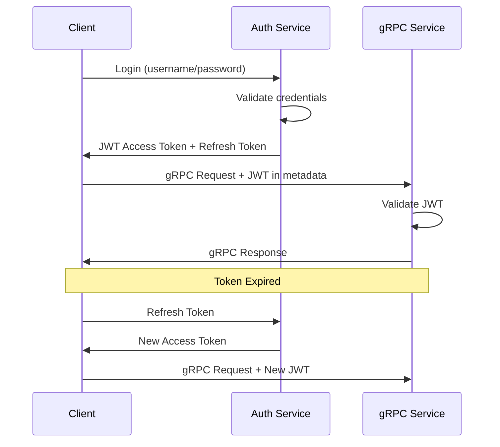
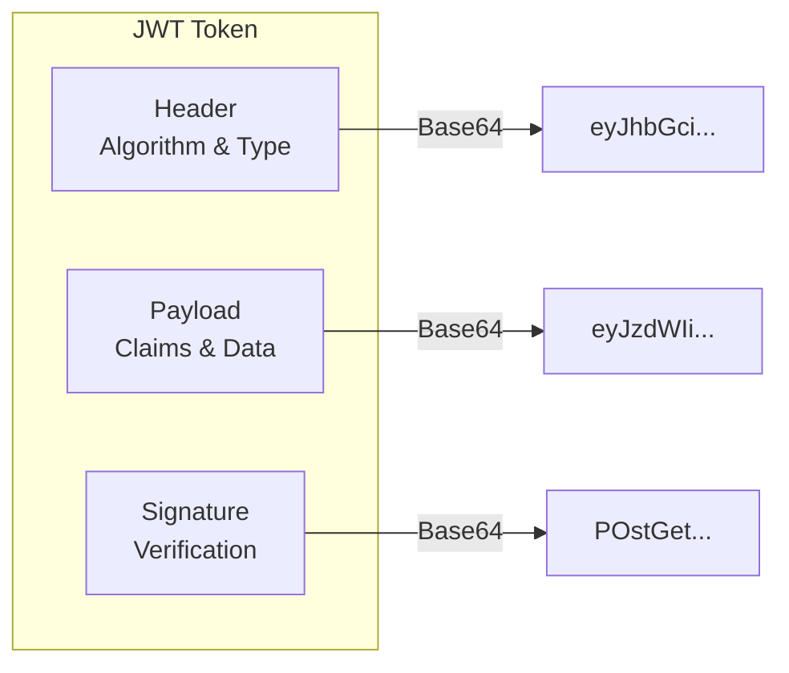
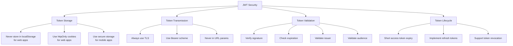

# How to Implement JWT Authentication in gRPC

Author: [nawazdhandala](https://www.github.com/nawazdhandala)

Tags: gRPC, JWT, Authentication, Security, Interceptors, Tokens, Authorization

Description: Learn how to implement JWT-based authentication in gRPC services using interceptors, token validation, and refresh token patterns.

---

## Introduction

JSON Web Tokens (JWT) provide a stateless, scalable approach to authentication in distributed systems. This guide covers implementing JWT authentication in gRPC services, including token generation, validation through interceptors, refresh token handling, and per-RPC credentials.

## JWT Basics for gRPC



### JWT Structure

A JWT consists of three parts:

```
eyJhbGciOiJIUzI1NiIsInR5cCI6IkpXVCJ9.
eyJzdWIiOiIxMjM0NTY3ODkwIiwibmFtZSI6IkpvaG4gRG9lIiwiYWRtaW4iOnRydWUsImlhdCI6MTUxNjIzOTAyMn0.
POstGetfAytaZS82wHcjoTyoqhMyxXiWdR7Nn7A28cM
```



## Token Generation and Validation

### Go JWT Utilities

```go
package auth

import (
    "crypto/rsa"
    "errors"
    "time"

    "github.com/golang-jwt/jwt/v5"
)

// Claims represents the JWT claims structure
type Claims struct {
    UserID   string   `json:"user_id"`
    Username string   `json:"username"`
    Email    string   `json:"email"`
    Roles    []string `json:"roles"`
    jwt.RegisteredClaims
}

// TokenPair contains access and refresh tokens
type TokenPair struct {
    AccessToken  string `json:"access_token"`
    RefreshToken string `json:"refresh_token"`
    ExpiresIn    int64  `json:"expires_in"`
    TokenType    string `json:"token_type"`
}

// JWTManager handles JWT operations
type JWTManager struct {
    secretKey          []byte
    accessTokenExpiry  time.Duration
    refreshTokenExpiry time.Duration
    issuer             string
}

// NewJWTManager creates a new JWT manager
func NewJWTManager(secretKey string, accessExpiry, refreshExpiry time.Duration) *JWTManager {
    return &JWTManager{
        secretKey:          []byte(secretKey),
        accessTokenExpiry:  accessExpiry,
        refreshTokenExpiry: refreshExpiry,
        issuer:             "grpc-auth-service",
    }
}

// GenerateTokenPair creates both access and refresh tokens
func (m *JWTManager) GenerateTokenPair(userID, username, email string, roles []string) (*TokenPair, error) {
    // Generate access token
    accessToken, err := m.generateToken(userID, username, email, roles, m.accessTokenExpiry, "access")
    if err != nil {
        return nil, err
    }

    // Generate refresh token
    refreshToken, err := m.generateToken(userID, username, email, roles, m.refreshTokenExpiry, "refresh")
    if err != nil {
        return nil, err
    }

    return &TokenPair{
        AccessToken:  accessToken,
        RefreshToken: refreshToken,
        ExpiresIn:    int64(m.accessTokenExpiry.Seconds()),
        TokenType:    "Bearer",
    }, nil
}

func (m *JWTManager) generateToken(userID, username, email string, roles []string, expiry time.Duration, tokenType string) (string, error) {
    now := time.Now()

    claims := Claims{
        UserID:   userID,
        Username: username,
        Email:    email,
        Roles:    roles,
        RegisteredClaims: jwt.RegisteredClaims{
            ExpiresAt: jwt.NewNumericDate(now.Add(expiry)),
            IssuedAt:  jwt.NewNumericDate(now),
            NotBefore: jwt.NewNumericDate(now),
            Issuer:    m.issuer,
            Subject:   userID,
            ID:        generateTokenID(),
            Audience:  []string{tokenType},
        },
    }

    token := jwt.NewWithClaims(jwt.SigningMethodHS256, claims)
    return token.SignedString(m.secretKey)
}

// ValidateToken validates and parses a JWT token
func (m *JWTManager) ValidateToken(tokenString string) (*Claims, error) {
    token, err := jwt.ParseWithClaims(tokenString, &Claims{}, func(token *jwt.Token) (interface{}, error) {
        // Validate signing method
        if _, ok := token.Method.(*jwt.SigningMethodHMAC); !ok {
            return nil, errors.New("unexpected signing method")
        }
        return m.secretKey, nil
    })

    if err != nil {
        return nil, err
    }

    claims, ok := token.Claims.(*Claims)
    if !ok || !token.Valid {
        return nil, errors.New("invalid token")
    }

    // Validate issuer
    if claims.Issuer != m.issuer {
        return nil, errors.New("invalid token issuer")
    }

    return claims, nil
}

// RefreshAccessToken generates a new access token from a refresh token
func (m *JWTManager) RefreshAccessToken(refreshToken string) (*TokenPair, error) {
    claims, err := m.ValidateToken(refreshToken)
    if err != nil {
        return nil, err
    }

    // Verify this is a refresh token
    if len(claims.Audience) == 0 || claims.Audience[0] != "refresh" {
        return nil, errors.New("invalid refresh token")
    }

    return m.GenerateTokenPair(claims.UserID, claims.Username, claims.Email, claims.Roles)
}

func generateTokenID() string {
    // Generate a unique token ID (use UUID in production)
    return fmt.Sprintf("%d", time.Now().UnixNano())
}
```

### RSA-Based JWT for Production

```go
package auth

import (
    "crypto/rsa"
    "crypto/x509"
    "encoding/pem"
    "errors"
    "io/ioutil"
    "time"

    "github.com/golang-jwt/jwt/v5"
)

// RSAJWTManager handles JWT with RSA keys
type RSAJWTManager struct {
    privateKey        *rsa.PrivateKey
    publicKey         *rsa.PublicKey
    accessTokenExpiry time.Duration
    issuer            string
}

// NewRSAJWTManager creates a new RSA JWT manager
func NewRSAJWTManager(privateKeyPath, publicKeyPath string, accessExpiry time.Duration) (*RSAJWTManager, error) {
    // Load private key
    privateKeyData, err := ioutil.ReadFile(privateKeyPath)
    if err != nil {
        return nil, err
    }

    block, _ := pem.Decode(privateKeyData)
    privateKey, err := x509.ParsePKCS1PrivateKey(block.Bytes)
    if err != nil {
        return nil, err
    }

    // Load public key
    publicKeyData, err := ioutil.ReadFile(publicKeyPath)
    if err != nil {
        return nil, err
    }

    block, _ = pem.Decode(publicKeyData)
    publicKeyInterface, err := x509.ParsePKIXPublicKey(block.Bytes)
    if err != nil {
        return nil, err
    }

    publicKey, ok := publicKeyInterface.(*rsa.PublicKey)
    if !ok {
        return nil, errors.New("invalid public key type")
    }

    return &RSAJWTManager{
        privateKey:        privateKey,
        publicKey:         publicKey,
        accessTokenExpiry: accessExpiry,
        issuer:            "grpc-auth-service",
    }, nil
}

// GenerateToken creates a new JWT with RSA signing
func (m *RSAJWTManager) GenerateToken(claims *Claims) (string, error) {
    token := jwt.NewWithClaims(jwt.SigningMethodRS256, claims)
    return token.SignedString(m.privateKey)
}

// ValidateToken validates a JWT using the public key
func (m *RSAJWTManager) ValidateToken(tokenString string) (*Claims, error) {
    token, err := jwt.ParseWithClaims(tokenString, &Claims{}, func(token *jwt.Token) (interface{}, error) {
        if _, ok := token.Method.(*jwt.SigningMethodRSA); !ok {
            return nil, errors.New("unexpected signing method")
        }
        return m.publicKey, nil
    })

    if err != nil {
        return nil, err
    }

    claims, ok := token.Claims.(*Claims)
    if !ok || !token.Valid {
        return nil, errors.New("invalid token")
    }

    return claims, nil
}
```

## Server-Side Interceptors

### Unary Interceptor for JWT Validation

```go
package interceptors

import (
    "context"
    "strings"

    "google.golang.org/grpc"
    "google.golang.org/grpc/codes"
    "google.golang.org/grpc/metadata"
    "google.golang.org/grpc/status"

    "your-module/auth"
)

// Context keys for user information
type contextKey string

const (
    UserIDKey   contextKey = "user_id"
    UsernameKey contextKey = "username"
    RolesKey    contextKey = "roles"
    ClaimsKey   contextKey = "claims"
)

// AuthInterceptor handles JWT authentication
type AuthInterceptor struct {
    jwtManager      *auth.JWTManager
    publicMethods   map[string]bool
    rolePermissions map[string][]string
}

// NewAuthInterceptor creates a new auth interceptor
func NewAuthInterceptor(jwtManager *auth.JWTManager, publicMethods []string) *AuthInterceptor {
    methods := make(map[string]bool)
    for _, method := range publicMethods {
        methods[method] = true
    }

    return &AuthInterceptor{
        jwtManager:    jwtManager,
        publicMethods: methods,
        rolePermissions: map[string][]string{
            "/proto.UserService/GetUser":    {"admin", "user"},
            "/proto.UserService/UpdateUser": {"admin", "user"},
            "/proto.UserService/DeleteUser": {"admin"},
            "/proto.AdminService/ListUsers": {"admin"},
        },
    }
}

// Unary returns a unary interceptor for authentication
func (i *AuthInterceptor) Unary() grpc.UnaryServerInterceptor {
    return func(
        ctx context.Context,
        req interface{},
        info *grpc.UnaryServerInfo,
        handler grpc.UnaryHandler,
    ) (interface{}, error) {
        // Skip authentication for public methods
        if i.publicMethods[info.FullMethod] {
            return handler(ctx, req)
        }

        // Extract and validate token
        claims, err := i.authorize(ctx, info.FullMethod)
        if err != nil {
            return nil, err
        }

        // Add claims to context
        ctx = context.WithValue(ctx, ClaimsKey, claims)
        ctx = context.WithValue(ctx, UserIDKey, claims.UserID)
        ctx = context.WithValue(ctx, UsernameKey, claims.Username)
        ctx = context.WithValue(ctx, RolesKey, claims.Roles)

        return handler(ctx, req)
    }
}

// Stream returns a stream interceptor for authentication
func (i *AuthInterceptor) Stream() grpc.StreamServerInterceptor {
    return func(
        srv interface{},
        ss grpc.ServerStream,
        info *grpc.StreamServerInfo,
        handler grpc.StreamHandler,
    ) error {
        // Skip authentication for public methods
        if i.publicMethods[info.FullMethod] {
            return handler(srv, ss)
        }

        // Extract and validate token
        claims, err := i.authorize(ss.Context(), info.FullMethod)
        if err != nil {
            return err
        }

        // Wrap the stream with authenticated context
        wrappedStream := &authenticatedServerStream{
            ServerStream: ss,
            ctx:          context.WithValue(ss.Context(), ClaimsKey, claims),
        }

        return handler(srv, wrappedStream)
    }
}

func (i *AuthInterceptor) authorize(ctx context.Context, method string) (*auth.Claims, error) {
    // Extract metadata
    md, ok := metadata.FromIncomingContext(ctx)
    if !ok {
        return nil, status.Error(codes.Unauthenticated, "metadata not provided")
    }

    // Get authorization header
    authHeader := md.Get("authorization")
    if len(authHeader) == 0 {
        return nil, status.Error(codes.Unauthenticated, "authorization token not provided")
    }

    // Parse Bearer token
    token := authHeader[0]
    if !strings.HasPrefix(token, "Bearer ") {
        return nil, status.Error(codes.Unauthenticated, "invalid authorization format")
    }
    token = strings.TrimPrefix(token, "Bearer ")

    // Validate token
    claims, err := i.jwtManager.ValidateToken(token)
    if err != nil {
        return nil, status.Errorf(codes.Unauthenticated, "invalid token: %v", err)
    }

    // Check role-based access
    if err := i.checkRolePermission(method, claims.Roles); err != nil {
        return nil, err
    }

    return claims, nil
}

func (i *AuthInterceptor) checkRolePermission(method string, userRoles []string) error {
    requiredRoles, ok := i.rolePermissions[method]
    if !ok {
        // No specific role required
        return nil
    }

    for _, required := range requiredRoles {
        for _, userRole := range userRoles {
            if required == userRole {
                return nil
            }
        }
    }

    return status.Error(codes.PermissionDenied, "insufficient permissions")
}

// authenticatedServerStream wraps a server stream with authenticated context
type authenticatedServerStream struct {
    grpc.ServerStream
    ctx context.Context
}

func (s *authenticatedServerStream) Context() context.Context {
    return s.ctx
}
```

### Server Setup with Interceptors

```go
package main

import (
    "log"
    "net"
    "time"

    "google.golang.org/grpc"
    "google.golang.org/grpc/reflection"

    "your-module/auth"
    "your-module/interceptors"
    pb "your-module/proto"
)

func main() {
    // Initialize JWT manager
    jwtManager := auth.NewJWTManager(
        "your-secret-key-min-32-chars-long",
        15*time.Minute,  // Access token expiry
        7*24*time.Hour,  // Refresh token expiry
    )

    // Define public methods that don't require authentication
    publicMethods := []string{
        "/proto.AuthService/Login",
        "/proto.AuthService/Register",
        "/proto.AuthService/RefreshToken",
        "/grpc.health.v1.Health/Check",
    }

    // Create auth interceptor
    authInterceptor := interceptors.NewAuthInterceptor(jwtManager, publicMethods)

    // Create gRPC server with interceptors
    server := grpc.NewServer(
        grpc.ChainUnaryInterceptor(
            loggingInterceptor,
            authInterceptor.Unary(),
        ),
        grpc.ChainStreamInterceptor(
            streamLoggingInterceptor,
            authInterceptor.Stream(),
        ),
    )

    // Register services
    pb.RegisterAuthServiceServer(server, NewAuthService(jwtManager))
    pb.RegisterUserServiceServer(server, NewUserService())

    // Enable reflection for debugging
    reflection.Register(server)

    // Start server
    listener, err := net.Listen("tcp", ":50051")
    if err != nil {
        log.Fatalf("Failed to listen: %v", err)
    }

    log.Println("gRPC server listening on :50051")
    if err := server.Serve(listener); err != nil {
        log.Fatalf("Failed to serve: %v", err)
    }
}

func loggingInterceptor(ctx context.Context, req interface{}, info *grpc.UnaryServerInfo, handler grpc.UnaryHandler) (interface{}, error) {
    start := time.Now()
    resp, err := handler(ctx, req)
    log.Printf("Method: %s, Duration: %v, Error: %v", info.FullMethod, time.Since(start), err)
    return resp, err
}

func streamLoggingInterceptor(srv interface{}, ss grpc.ServerStream, info *grpc.StreamServerInfo, handler grpc.StreamHandler) error {
    start := time.Now()
    err := handler(srv, ss)
    log.Printf("Stream Method: %s, Duration: %v, Error: %v", info.FullMethod, time.Since(start), err)
    return err
}
```

## Client-Side Per-RPC Credentials

### Go Client with JWT

```go
package main

import (
    "context"
    "log"
    "time"

    "google.golang.org/grpc"
    "google.golang.org/grpc/credentials"
    "google.golang.org/grpc/credentials/oauth"

    pb "your-module/proto"
)

// JWTCredentials implements grpc.PerRPCCredentials
type JWTCredentials struct {
    token    string
    secure   bool
}

// NewJWTCredentials creates new JWT credentials
func NewJWTCredentials(token string, secure bool) *JWTCredentials {
    return &JWTCredentials{
        token:  token,
        secure: secure,
    }
}

// GetRequestMetadata returns the metadata for each RPC
func (c *JWTCredentials) GetRequestMetadata(ctx context.Context, uri ...string) (map[string]string, error) {
    return map[string]string{
        "authorization": "Bearer " + c.token,
    }, nil
}

// RequireTransportSecurity indicates whether TLS is required
func (c *JWTCredentials) RequireTransportSecurity() bool {
    return c.secure
}

func main() {
    // First, login to get tokens
    authConn, err := grpc.Dial("localhost:50051", grpc.WithInsecure())
    if err != nil {
        log.Fatalf("Failed to connect: %v", err)
    }

    authClient := pb.NewAuthServiceClient(authConn)

    loginResp, err := authClient.Login(context.Background(), &pb.LoginRequest{
        Username: "john",
        Password: "secret123",
    })
    if err != nil {
        log.Fatalf("Login failed: %v", err)
    }

    authConn.Close()

    // Create credentials with the access token
    jwtCreds := NewJWTCredentials(loginResp.AccessToken, false)

    // Connect with JWT credentials
    conn, err := grpc.Dial(
        "localhost:50051",
        grpc.WithInsecure(),
        grpc.WithPerRPCCredentials(jwtCreds),
    )
    if err != nil {
        log.Fatalf("Failed to connect: %v", err)
    }
    defer conn.Close()

    // Make authenticated requests
    userClient := pb.NewUserServiceClient(conn)

    ctx, cancel := context.WithTimeout(context.Background(), 5*time.Second)
    defer cancel()

    user, err := userClient.GetUser(ctx, &pb.GetUserRequest{UserId: "123"})
    if err != nil {
        log.Fatalf("GetUser failed: %v", err)
    }

    log.Printf("User: %+v", user)
}
```

### Client with Automatic Token Refresh

```go
package client

import (
    "context"
    "sync"
    "time"

    "google.golang.org/grpc"
    "google.golang.org/grpc/metadata"

    pb "your-module/proto"
)

// AuthenticatedClient wraps a gRPC connection with automatic token refresh
type AuthenticatedClient struct {
    conn         *grpc.ClientConn
    authClient   pb.AuthServiceClient
    accessToken  string
    refreshToken string
    expiresAt    time.Time
    mu           sync.RWMutex
}

// NewAuthenticatedClient creates a new authenticated client
func NewAuthenticatedClient(target string, opts ...grpc.DialOption) (*AuthenticatedClient, error) {
    conn, err := grpc.Dial(target, opts...)
    if err != nil {
        return nil, err
    }

    return &AuthenticatedClient{
        conn:       conn,
        authClient: pb.NewAuthServiceClient(conn),
    }, nil
}

// Login authenticates and stores tokens
func (c *AuthenticatedClient) Login(ctx context.Context, username, password string) error {
    resp, err := c.authClient.Login(ctx, &pb.LoginRequest{
        Username: username,
        Password: password,
    })
    if err != nil {
        return err
    }

    c.mu.Lock()
    c.accessToken = resp.AccessToken
    c.refreshToken = resp.RefreshToken
    c.expiresAt = time.Now().Add(time.Duration(resp.ExpiresIn) * time.Second)
    c.mu.Unlock()

    return nil
}

// GetAuthContext returns a context with the authorization header
func (c *AuthenticatedClient) GetAuthContext(ctx context.Context) (context.Context, error) {
    // Check if token needs refresh
    if err := c.ensureValidToken(ctx); err != nil {
        return nil, err
    }

    c.mu.RLock()
    token := c.accessToken
    c.mu.RUnlock()

    // Add token to metadata
    md := metadata.Pairs("authorization", "Bearer "+token)
    return metadata.NewOutgoingContext(ctx, md), nil
}

func (c *AuthenticatedClient) ensureValidToken(ctx context.Context) error {
    c.mu.RLock()
    needsRefresh := time.Until(c.expiresAt) < 30*time.Second
    refreshToken := c.refreshToken
    c.mu.RUnlock()

    if !needsRefresh {
        return nil
    }

    // Refresh the token
    resp, err := c.authClient.RefreshToken(ctx, &pb.RefreshTokenRequest{
        RefreshToken: refreshToken,
    })
    if err != nil {
        return err
    }

    c.mu.Lock()
    c.accessToken = resp.AccessToken
    c.refreshToken = resp.RefreshToken
    c.expiresAt = time.Now().Add(time.Duration(resp.ExpiresIn) * time.Second)
    c.mu.Unlock()

    return nil
}

// Close closes the underlying connection
func (c *AuthenticatedClient) Close() error {
    return c.conn.Close()
}

// Usage example
func ExampleUsage() {
    client, err := NewAuthenticatedClient("localhost:50051", grpc.WithInsecure())
    if err != nil {
        log.Fatal(err)
    }
    defer client.Close()

    // Login
    if err := client.Login(context.Background(), "john", "secret123"); err != nil {
        log.Fatal(err)
    }

    // Make authenticated request
    ctx, err := client.GetAuthContext(context.Background())
    if err != nil {
        log.Fatal(err)
    }

    userClient := pb.NewUserServiceClient(client.conn)
    user, err := userClient.GetUser(ctx, &pb.GetUserRequest{UserId: "123"})
    if err != nil {
        log.Fatal(err)
    }

    log.Printf("User: %+v", user)
}
```

## Python Implementation

### Python JWT Interceptor

```python
import grpc
import jwt
from datetime import datetime, timedelta
from typing import Optional, Tuple, Dict, Any

class JWTManager:
    def __init__(self, secret_key: str, algorithm: str = 'HS256'):
        self.secret_key = secret_key
        self.algorithm = algorithm
        self.access_token_expiry = timedelta(minutes=15)
        self.refresh_token_expiry = timedelta(days=7)

    def generate_tokens(self, user_id: str, username: str, roles: list) -> Dict[str, Any]:
        """Generate access and refresh tokens."""
        now = datetime.utcnow()

        access_payload = {
            'user_id': user_id,
            'username': username,
            'roles': roles,
            'type': 'access',
            'exp': now + self.access_token_expiry,
            'iat': now,
        }

        refresh_payload = {
            'user_id': user_id,
            'type': 'refresh',
            'exp': now + self.refresh_token_expiry,
            'iat': now,
        }

        access_token = jwt.encode(access_payload, self.secret_key, algorithm=self.algorithm)
        refresh_token = jwt.encode(refresh_payload, self.secret_key, algorithm=self.algorithm)

        return {
            'access_token': access_token,
            'refresh_token': refresh_token,
            'expires_in': int(self.access_token_expiry.total_seconds()),
            'token_type': 'Bearer'
        }

    def validate_token(self, token: str) -> Optional[Dict]:
        """Validate and decode a JWT token."""
        try:
            payload = jwt.decode(token, self.secret_key, algorithms=[self.algorithm])
            return payload
        except jwt.ExpiredSignatureError:
            raise ValueError("Token has expired")
        except jwt.InvalidTokenError as e:
            raise ValueError(f"Invalid token: {e}")


class AuthInterceptor(grpc.ServerInterceptor):
    """Server-side JWT authentication interceptor."""

    def __init__(self, jwt_manager: JWTManager, public_methods: list = None):
        self.jwt_manager = jwt_manager
        self.public_methods = public_methods or []

    def intercept_service(self, continuation, handler_call_details):
        method = handler_call_details.method

        # Skip authentication for public methods
        if method in self.public_methods:
            return continuation(handler_call_details)

        # Get metadata
        metadata = dict(handler_call_details.invocation_metadata)

        # Extract authorization header
        auth_header = metadata.get('authorization', '')
        if not auth_header.startswith('Bearer '):
            return self._unauthenticated_response()

        token = auth_header[7:]  # Remove 'Bearer ' prefix

        try:
            claims = self.jwt_manager.validate_token(token)
            # Store claims in context (implementation depends on your setup)
            return continuation(handler_call_details)
        except ValueError as e:
            return self._unauthenticated_response(str(e))

    def _unauthenticated_response(self, message: str = "Unauthenticated"):
        def abort(ignored_request, context):
            context.abort(grpc.StatusCode.UNAUTHENTICATED, message)

        return grpc.unary_unary_rpc_method_handler(abort)


class JWTCallCredentials(grpc.AuthMetadataPlugin):
    """Client-side JWT credentials plugin."""

    def __init__(self, token: str):
        self.token = token

    def __call__(self, context, callback):
        metadata = (('authorization', f'Bearer {self.token}'),)
        callback(metadata, None)


# Server setup
def serve():
    jwt_manager = JWTManager('your-secret-key-min-32-chars')

    auth_interceptor = AuthInterceptor(
        jwt_manager,
        public_methods=[
            '/proto.AuthService/Login',
            '/proto.AuthService/Register',
        ]
    )

    server = grpc.server(
        futures.ThreadPoolExecutor(max_workers=10),
        interceptors=[auth_interceptor]
    )

    # Add services
    # proto_pb2_grpc.add_AuthServiceServicer_to_server(AuthServicer(jwt_manager), server)

    server.add_insecure_port('[::]:50051')
    server.start()
    server.wait_for_termination()


# Client setup
def create_authenticated_channel(target: str, token: str):
    credentials = grpc.metadata_call_credentials(JWTCallCredentials(token))

    # For secure channel with JWT
    # channel_creds = grpc.ssl_channel_credentials()
    # combined_creds = grpc.composite_channel_credentials(channel_creds, credentials)
    # return grpc.secure_channel(target, combined_creds)

    # For insecure channel (development only)
    channel = grpc.insecure_channel(target)
    return channel, credentials
```

## Node.js Implementation

### Node.js JWT Authentication

```javascript
const grpc = require('@grpc/grpc-js');
const jwt = require('jsonwebtoken');

class JWTManager {
    constructor(secretKey, options = {}) {
        this.secretKey = secretKey;
        this.accessTokenExpiry = options.accessTokenExpiry || '15m';
        this.refreshTokenExpiry = options.refreshTokenExpiry || '7d';
        this.issuer = options.issuer || 'grpc-auth-service';
    }

    generateTokens(userId, username, roles) {
        const accessToken = jwt.sign(
            { userId, username, roles, type: 'access' },
            this.secretKey,
            { expiresIn: this.accessTokenExpiry, issuer: this.issuer }
        );

        const refreshToken = jwt.sign(
            { userId, type: 'refresh' },
            this.secretKey,
            { expiresIn: this.refreshTokenExpiry, issuer: this.issuer }
        );

        return {
            accessToken,
            refreshToken,
            expiresIn: 900, // 15 minutes in seconds
            tokenType: 'Bearer'
        };
    }

    validateToken(token) {
        try {
            return jwt.verify(token, this.secretKey, { issuer: this.issuer });
        } catch (error) {
            throw new Error(`Invalid token: ${error.message}`);
        }
    }
}

// Server interceptor
function createAuthInterceptor(jwtManager, publicMethods = []) {
    return async (methodDefinition, call) => {
        const method = call.getPath();

        // Skip authentication for public methods
        if (publicMethods.includes(method)) {
            return;
        }

        const metadata = call.metadata;
        const authHeader = metadata.get('authorization')[0];

        if (!authHeader || !authHeader.startsWith('Bearer ')) {
            const error = {
                code: grpc.status.UNAUTHENTICATED,
                message: 'Authorization token required'
            };
            throw error;
        }

        const token = authHeader.substring(7);

        try {
            const claims = jwtManager.validateToken(token);
            // Attach claims to call for use in handlers
            call.claims = claims;
        } catch (error) {
            const grpcError = {
                code: grpc.status.UNAUTHENTICATED,
                message: error.message
            };
            throw grpcError;
        }
    };
}

// Auth service implementation
class AuthService {
    constructor(jwtManager, userRepository) {
        this.jwtManager = jwtManager;
        this.userRepository = userRepository;
    }

    async login(call, callback) {
        const { username, password } = call.request;

        try {
            // Validate credentials (implement your own logic)
            const user = await this.userRepository.findByUsername(username);
            if (!user || !await this.userRepository.verifyPassword(user, password)) {
                return callback({
                    code: grpc.status.UNAUTHENTICATED,
                    message: 'Invalid credentials'
                });
            }

            const tokens = this.jwtManager.generateTokens(
                user.id,
                user.username,
                user.roles
            );

            callback(null, tokens);
        } catch (error) {
            callback({
                code: grpc.status.INTERNAL,
                message: error.message
            });
        }
    }

    async refreshToken(call, callback) {
        const { refreshToken } = call.request;

        try {
            const claims = this.jwtManager.validateToken(refreshToken);

            if (claims.type !== 'refresh') {
                return callback({
                    code: grpc.status.INVALID_ARGUMENT,
                    message: 'Invalid refresh token'
                });
            }

            const user = await this.userRepository.findById(claims.userId);
            const tokens = this.jwtManager.generateTokens(
                user.id,
                user.username,
                user.roles
            );

            callback(null, tokens);
        } catch (error) {
            callback({
                code: grpc.status.UNAUTHENTICATED,
                message: error.message
            });
        }
    }
}

// Client with JWT credentials
class AuthenticatedClient {
    constructor(target, options = {}) {
        this.target = target;
        this.credentials = options.credentials || grpc.credentials.createInsecure();
        this.accessToken = null;
        this.refreshToken = null;
    }

    async login(authStub, username, password) {
        return new Promise((resolve, reject) => {
            authStub.login({ username, password }, (error, response) => {
                if (error) {
                    reject(error);
                    return;
                }

                this.accessToken = response.accessToken;
                this.refreshToken = response.refreshToken;
                resolve(response);
            });
        });
    }

    getMetadata() {
        const metadata = new grpc.Metadata();
        if (this.accessToken) {
            metadata.set('authorization', `Bearer ${this.accessToken}`);
        }
        return metadata;
    }

    // Make authenticated call
    async call(stub, method, request) {
        return new Promise((resolve, reject) => {
            stub[method](request, this.getMetadata(), (error, response) => {
                if (error) {
                    reject(error);
                    return;
                }
                resolve(response);
            });
        });
    }
}

module.exports = {
    JWTManager,
    createAuthInterceptor,
    AuthService,
    AuthenticatedClient
};
```

## Token Revocation and Blacklisting

### Redis-Based Token Blacklist

```go
package auth

import (
    "context"
    "time"

    "github.com/go-redis/redis/v8"
)

// TokenBlacklist manages revoked tokens
type TokenBlacklist struct {
    client *redis.Client
    prefix string
}

// NewTokenBlacklist creates a new token blacklist
func NewTokenBlacklist(redisURL string) (*TokenBlacklist, error) {
    opt, err := redis.ParseURL(redisURL)
    if err != nil {
        return nil, err
    }

    client := redis.NewClient(opt)

    // Test connection
    ctx, cancel := context.WithTimeout(context.Background(), 5*time.Second)
    defer cancel()

    if err := client.Ping(ctx).Err(); err != nil {
        return nil, err
    }

    return &TokenBlacklist{
        client: client,
        prefix: "token:blacklist:",
    }, nil
}

// Revoke adds a token to the blacklist
func (b *TokenBlacklist) Revoke(ctx context.Context, tokenID string, expiration time.Duration) error {
    key := b.prefix + tokenID
    return b.client.Set(ctx, key, "revoked", expiration).Err()
}

// IsRevoked checks if a token is blacklisted
func (b *TokenBlacklist) IsRevoked(ctx context.Context, tokenID string) (bool, error) {
    key := b.prefix + tokenID
    result, err := b.client.Exists(ctx, key).Result()
    if err != nil {
        return false, err
    }
    return result > 0, nil
}

// RevokeAllUserTokens revokes all tokens for a user
func (b *TokenBlacklist) RevokeAllUserTokens(ctx context.Context, userID string, expiration time.Duration) error {
    key := b.prefix + "user:" + userID
    return b.client.Set(ctx, key, time.Now().Unix(), expiration).Err()
}

// Updated JWT validation with blacklist check
func (m *JWTManager) ValidateTokenWithBlacklist(tokenString string, blacklist *TokenBlacklist) (*Claims, error) {
    claims, err := m.ValidateToken(tokenString)
    if err != nil {
        return nil, err
    }

    // Check if token is blacklisted
    ctx, cancel := context.WithTimeout(context.Background(), time.Second)
    defer cancel()

    revoked, err := blacklist.IsRevoked(ctx, claims.ID)
    if err != nil {
        return nil, fmt.Errorf("failed to check token revocation: %v", err)
    }

    if revoked {
        return nil, errors.New("token has been revoked")
    }

    return claims, nil
}
```

## Security Best Practices

### JWT Security Checklist



### Secure Configuration Example

```go
package config

import (
    "time"
)

type AuthConfig struct {
    // JWT Settings
    JWTSecretKey        string        `env:"JWT_SECRET_KEY,required"`
    JWTAlgorithm        string        `env:"JWT_ALGORITHM" default:"HS256"`
    AccessTokenExpiry   time.Duration `env:"ACCESS_TOKEN_EXPIRY" default:"15m"`
    RefreshTokenExpiry  time.Duration `env:"REFRESH_TOKEN_EXPIRY" default:"168h"` // 7 days

    // Token Validation
    ValidateIssuer      bool   `env:"VALIDATE_ISSUER" default:"true"`
    ValidateAudience    bool   `env:"VALIDATE_AUDIENCE" default:"true"`
    ExpectedIssuer      string `env:"EXPECTED_ISSUER" default:"grpc-auth-service"`
    ExpectedAudience    string `env:"EXPECTED_AUDIENCE" default:"grpc-api"`

    // Security Settings
    EnableBlacklist     bool   `env:"ENABLE_TOKEN_BLACKLIST" default:"true"`
    RedisURL            string `env:"REDIS_URL" default:"redis://localhost:6379"`

    // Rate Limiting
    MaxLoginAttempts    int           `env:"MAX_LOGIN_ATTEMPTS" default:"5"`
    LoginLockoutPeriod  time.Duration `env:"LOGIN_LOCKOUT_PERIOD" default:"15m"`
}

// Validation rules
func (c *AuthConfig) Validate() error {
    if len(c.JWTSecretKey) < 32 {
        return errors.New("JWT secret key must be at least 32 characters")
    }

    if c.AccessTokenExpiry > 1*time.Hour {
        return errors.New("access token expiry should not exceed 1 hour")
    }

    return nil
}
```

## Summary

Implementing JWT authentication in gRPC services involves several key components:

1. **Token Generation**: Create secure tokens with appropriate claims and expiration
2. **Server Interceptors**: Validate tokens on every request using unary and stream interceptors
3. **Per-RPC Credentials**: Pass tokens from clients using gRPC credentials interface
4. **Token Refresh**: Implement refresh token flow for seamless user experience
5. **Token Revocation**: Use a blacklist mechanism for security-critical scenarios
6. **Security Best Practices**: Follow security guidelines for token storage and transmission

Key takeaways:

- Use short-lived access tokens (15 minutes or less)
- Implement refresh tokens for better user experience
- Always validate all claims, not just the signature
- Consider token revocation for logout and security incidents
- Use TLS in production to protect tokens in transit
- Implement rate limiting on authentication endpoints
