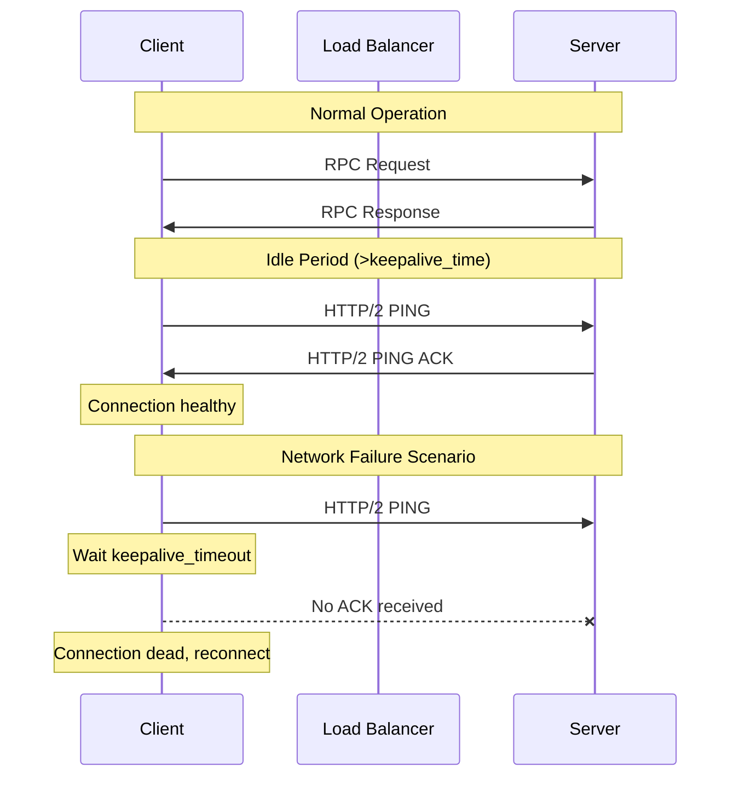
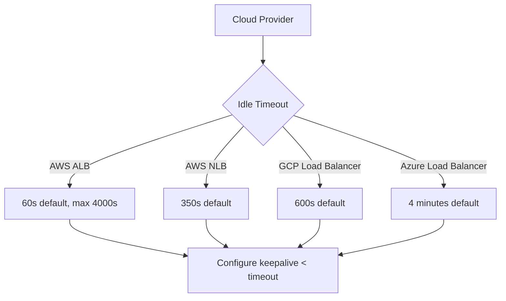

# How to Implement gRPC Keepalive for Long-Lived Connections

Author: [nawazdhandala](https://www.github.com/nawazdhandala)

Tags: gRPC, keepalive, connections, networking, performance, TCP, HTTP2, resilience

Description: Learn how to configure gRPC keepalive parameters to maintain long-lived connections, detect failures quickly, and handle network interruptions gracefully.

---

## Introduction

Long-lived gRPC connections are essential for high-performance applications, but they come with challenges: network interruptions, idle timeouts from load balancers, and silent connection failures. gRPC's keepalive mechanism helps maintain connection health by periodically sending ping frames and detecting dead connections.

This guide covers comprehensive keepalive configuration, best practices for different environments, and troubleshooting common connection issues.

## Understanding gRPC Keepalive

gRPC keepalive operates at the HTTP/2 layer using PING frames to verify connection health:



### Keepalive Parameters

| Parameter | Client | Server | Description |
|-----------|--------|--------|-------------|
| `Time` | Yes | Yes | Interval between PING frames |
| `Timeout` | Yes | Yes | Time to wait for PING ACK |
| `PermitWithoutStream` | Yes | No | Allow pings with no active RPCs |
| `MaxConnectionIdle` | No | Yes | Max time connection can be idle |
| `MaxConnectionAge` | No | Yes | Max lifetime of a connection |
| `MaxConnectionAgeGrace` | No | Yes | Grace period for pending RPCs |
| `MinTime` | No | Yes | Minimum allowed time between client pings |

## Client-Side Keepalive Configuration

### Go Client Implementation

```go
package main

import (
    "context"
    "log"
    "time"

    "google.golang.org/grpc"
    "google.golang.org/grpc/credentials/insecure"
    "google.golang.org/grpc/keepalive"

    pb "myapp/proto"
)

func main() {
    // Keepalive parameters for client
    kaParams := keepalive.ClientParameters{
        // Time: After this duration of inactivity, the client will send a PING
        // If there's no activity, the client pings the server every 10 seconds
        Time: 10 * time.Second,

        // Timeout: Wait this long for a PING response before considering
        // the connection dead. If no response within 3 seconds, reconnect
        Timeout: 3 * time.Second,

        // PermitWithoutStream: Allow pings even when there are no active RPCs
        // This is crucial for keeping connections alive during idle periods
        PermitWithoutStream: true,
    }

    // Create connection with keepalive
    conn, err := grpc.Dial(
        "localhost:50051",
        grpc.WithTransportCredentials(insecure.NewCredentials()),
        grpc.WithKeepaliveParams(kaParams),
        // Additional options for connection management
        grpc.WithDefaultCallOptions(
            grpc.WaitForReady(true), // Wait for connection to be ready
        ),
        grpc.WithConnectParams(grpc.ConnectParams{
            Backoff: backoff.Config{
                BaseDelay:  1 * time.Second,
                Multiplier: 1.5,
                Jitter:     0.2,
                MaxDelay:   30 * time.Second,
            },
            MinConnectTimeout: 5 * time.Second,
        }),
    )
    if err != nil {
        log.Fatalf("Failed to connect: %v", err)
    }
    defer conn.Close()

    client := pb.NewMyServiceClient(conn)

    // Use the client for long-running operations
    for {
        ctx, cancel := context.WithTimeout(context.Background(), 5*time.Second)
        resp, err := client.MyMethod(ctx, &pb.MyRequest{})
        if err != nil {
            log.Printf("RPC failed: %v", err)
        } else {
            log.Printf("Response: %v", resp)
        }
        cancel()

        time.Sleep(30 * time.Second) // Simulate idle period
    }
}
```

### Python Client Implementation

```python
import grpc
import time
from typing import Optional
import my_service_pb2
import my_service_pb2_grpc


def create_keepalive_channel(
    target: str,
    keepalive_time_ms: int = 10000,
    keepalive_timeout_ms: int = 3000,
    keepalive_permit_without_calls: bool = True,
    max_receive_message_length: int = 4 * 1024 * 1024,
) -> grpc.Channel:
    """
    Create a gRPC channel with keepalive configuration.

    Args:
        target: Server address (host:port)
        keepalive_time_ms: Interval between keepalive pings (milliseconds)
        keepalive_timeout_ms: Timeout waiting for ping response (milliseconds)
        keepalive_permit_without_calls: Allow pings when no RPCs are active
        max_receive_message_length: Maximum message size
    """
    options = [
        # Keepalive settings
        ('grpc.keepalive_time_ms', keepalive_time_ms),
        ('grpc.keepalive_timeout_ms', keepalive_timeout_ms),
        ('grpc.keepalive_permit_without_calls', int(keepalive_permit_without_calls)),

        # Additional connection settings
        ('grpc.http2.max_pings_without_data', 0),  # Allow unlimited pings
        ('grpc.http2.min_time_between_pings_ms', 10000),
        ('grpc.http2.min_ping_interval_without_data_ms', 5000),

        # Message size limits
        ('grpc.max_receive_message_length', max_receive_message_length),
        ('grpc.max_send_message_length', max_receive_message_length),

        # Connection backoff settings
        ('grpc.initial_reconnect_backoff_ms', 1000),
        ('grpc.max_reconnect_backoff_ms', 30000),
        ('grpc.min_reconnect_backoff_ms', 1000),

        # Enable retries
        ('grpc.enable_retries', 1),
    ]

    return grpc.insecure_channel(target, options=options)


def main():
    channel = create_keepalive_channel(
        target='localhost:50051',
        keepalive_time_ms=10000,      # 10 seconds
        keepalive_timeout_ms=3000,     # 3 seconds
        keepalive_permit_without_calls=True,
    )

    stub = my_service_pb2_grpc.MyServiceStub(channel)

    # Long-running client
    while True:
        try:
            response = stub.MyMethod(
                my_service_pb2.MyRequest(),
                timeout=5.0
            )
            print(f"Response: {response}")
        except grpc.RpcError as e:
            print(f"RPC failed: {e.code()}: {e.details()}")

        time.sleep(30)  # Simulate idle period


if __name__ == '__main__':
    main()
```

### Java Client Implementation

```java
package com.example.grpc;

import io.grpc.ManagedChannel;
import io.grpc.ManagedChannelBuilder;
import io.grpc.netty.shaded.io.grpc.netty.NettyChannelBuilder;
import io.grpc.netty.shaded.io.netty.channel.ChannelOption;

import java.util.concurrent.TimeUnit;

public class KeepaliveClient {

    private final ManagedChannel channel;
    private final MyServiceGrpc.MyServiceBlockingStub blockingStub;

    public KeepaliveClient(String host, int port) {
        // Create channel with keepalive configuration
        channel = NettyChannelBuilder.forAddress(host, port)
            .usePlaintext()
            // Keepalive settings
            .keepAliveTime(10, TimeUnit.SECONDS)      // Send PING every 10 seconds
            .keepAliveTimeout(3, TimeUnit.SECONDS)    // Wait 3 seconds for ACK
            .keepAliveWithoutCalls(true)              // Ping even when idle

            // Connection settings
            .idleTimeout(5, TimeUnit.MINUTES)         // Close idle connections after 5 min
            .enableRetry()                            // Enable automatic retries

            // Netty-specific options
            .withOption(ChannelOption.CONNECT_TIMEOUT_MILLIS, 5000)
            .withOption(ChannelOption.SO_KEEPALIVE, true)  // TCP keepalive

            .build();

        blockingStub = MyServiceGrpc.newBlockingStub(channel);
    }

    public void makeCall() {
        try {
            MyResponse response = blockingStub
                .withDeadlineAfter(5, TimeUnit.SECONDS)
                .myMethod(MyRequest.newBuilder().build());
            System.out.println("Response: " + response);
        } catch (Exception e) {
            System.err.println("RPC failed: " + e.getMessage());
        }
    }

    public void shutdown() throws InterruptedException {
        channel.shutdown().awaitTermination(5, TimeUnit.SECONDS);
    }

    public static void main(String[] args) throws Exception {
        KeepaliveClient client = new KeepaliveClient("localhost", 50051);

        // Long-running client
        while (true) {
            client.makeCall();
            Thread.sleep(30000); // 30 seconds idle
        }
    }
}
```

## Server-Side Keepalive Configuration

### Go Server Implementation

```go
package main

import (
    "log"
    "net"
    "time"

    "google.golang.org/grpc"
    "google.golang.org/grpc/keepalive"

    pb "myapp/proto"
)

func main() {
    // Keepalive enforcement policy
    // Controls what the server accepts from clients
    kaep := keepalive.EnforcementPolicy{
        // MinTime: Minimum interval the server allows between client pings
        // If a client pings more frequently, the connection will be closed
        MinTime: 5 * time.Second,

        // PermitWithoutStream: Allow client pings even when there are no active streams
        // Set to true to support long-lived idle connections
        PermitWithoutStream: true,
    }

    // Keepalive server parameters
    // Controls server-side keepalive behavior
    kasp := keepalive.ServerParameters{
        // MaxConnectionIdle: Close connections that have been idle for this duration
        // Helps free resources from abandoned connections
        MaxConnectionIdle: 15 * time.Minute,

        // MaxConnectionAge: Maximum lifetime of a connection
        // Forces clients to reconnect periodically for load balancing
        MaxConnectionAge: 30 * time.Minute,

        // MaxConnectionAgeGrace: Grace period for pending RPCs after MaxConnectionAge
        // Allows in-flight requests to complete before closing
        MaxConnectionAgeGrace: 5 * time.Minute,

        // Time: Server pings clients after this duration of inactivity
        // Helps detect dead clients
        Time: 10 * time.Second,

        // Timeout: Wait this long for a PING response
        // Close connection if no response received
        Timeout: 3 * time.Second,
    }

    // Create server with keepalive options
    server := grpc.NewServer(
        grpc.KeepaliveEnforcementPolicy(kaep),
        grpc.KeepaliveParams(kasp),
        // Additional options
        grpc.MaxConcurrentStreams(1000),
    )

    pb.RegisterMyServiceServer(server, &myServiceServer{})

    lis, err := net.Listen("tcp", ":50051")
    if err != nil {
        log.Fatalf("Failed to listen: %v", err)
    }

    log.Printf("Server starting on :50051 with keepalive enabled")
    log.Printf("  MaxConnectionIdle: %v", kasp.MaxConnectionIdle)
    log.Printf("  MaxConnectionAge: %v", kasp.MaxConnectionAge)
    log.Printf("  Ping interval: %v", kasp.Time)

    if err := server.Serve(lis); err != nil {
        log.Fatalf("Failed to serve: %v", err)
    }
}
```

### Python Server Implementation

```python
import grpc
from concurrent import futures
import time
import my_service_pb2
import my_service_pb2_grpc


class MyServiceServicer(my_service_pb2_grpc.MyServiceServicer):
    def MyMethod(self, request, context):
        return my_service_pb2.MyResponse(message="Hello")


def serve():
    # Server options with keepalive configuration
    options = [
        # Keepalive settings (server -> client)
        ('grpc.keepalive_time_ms', 10000),           # 10 seconds between pings
        ('grpc.keepalive_timeout_ms', 3000),          # 3 second timeout

        # Connection management
        ('grpc.max_connection_idle_ms', 900000),      # 15 minutes idle timeout
        ('grpc.max_connection_age_ms', 1800000),      # 30 minutes max age
        ('grpc.max_connection_age_grace_ms', 300000), # 5 minutes grace period

        # Client ping enforcement
        ('grpc.http2.min_recv_ping_interval_without_data_ms', 5000),  # Min 5s between pings
        ('grpc.http2.max_ping_strikes', 2),  # Allow 2 policy violations before disconnect

        # Message limits
        ('grpc.max_send_message_length', 50 * 1024 * 1024),
        ('grpc.max_receive_message_length', 50 * 1024 * 1024),

        # Concurrent streams
        ('grpc.max_concurrent_streams', 1000),
    ]

    server = grpc.server(
        futures.ThreadPoolExecutor(max_workers=10),
        options=options
    )

    my_service_pb2_grpc.add_MyServiceServicer_to_server(
        MyServiceServicer(), server
    )

    server.add_insecure_port('[::]:50051')
    server.start()

    print("Server started on port 50051 with keepalive enabled")
    print(f"  Keepalive interval: 10s")
    print(f"  Max connection idle: 15 min")
    print(f"  Max connection age: 30 min")

    try:
        while True:
            time.sleep(86400)  # One day
    except KeyboardInterrupt:
        server.stop(grace=30)


if __name__ == '__main__':
    serve()
```

### Java Server Implementation

```java
package com.example.grpc;

import io.grpc.Server;
import io.grpc.netty.shaded.io.grpc.netty.NettyServerBuilder;

import java.util.concurrent.TimeUnit;

public class KeepaliveServer {

    private Server server;

    private void start() throws Exception {
        int port = 50051;

        server = NettyServerBuilder.forPort(port)
            // Server keepalive parameters
            .keepAliveTime(10, TimeUnit.SECONDS)      // Ping clients every 10 seconds
            .keepAliveTimeout(3, TimeUnit.SECONDS)    // Wait 3 seconds for ACK

            // Connection management
            .maxConnectionIdle(15, TimeUnit.MINUTES)      // Close idle connections
            .maxConnectionAge(30, TimeUnit.MINUTES)       // Max connection lifetime
            .maxConnectionAgeGrace(5, TimeUnit.MINUTES)   // Grace period for pending RPCs

            // Client ping enforcement
            .permitKeepAliveTime(5, TimeUnit.SECONDS)     // Minimum interval for client pings
            .permitKeepAliveWithoutCalls(true)            // Allow pings when idle

            // Concurrency
            .maxConcurrentCallsPerConnection(100)

            // Add service
            .addService(new MyServiceImpl())
            .build()
            .start();

        System.out.println("Server started on port " + port);
        System.out.println("Keepalive configuration:");
        System.out.println("  Ping interval: 10s");
        System.out.println("  Max connection idle: 15 min");
        System.out.println("  Max connection age: 30 min");

        Runtime.getRuntime().addShutdownHook(new Thread(() -> {
            System.out.println("Shutting down server...");
            try {
                KeepaliveServer.this.stop();
            } catch (InterruptedException e) {
                e.printStackTrace();
            }
        }));
    }

    private void stop() throws InterruptedException {
        if (server != null) {
            server.shutdown().awaitTermination(30, TimeUnit.SECONDS);
        }
    }

    private void blockUntilShutdown() throws InterruptedException {
        if (server != null) {
            server.awaitTermination();
        }
    }

    public static void main(String[] args) throws Exception {
        KeepaliveServer server = new KeepaliveServer();
        server.start();
        server.blockUntilShutdown();
    }
}
```

## Environment-Specific Configurations

### Cloud Load Balancer Considerations

Different cloud providers have different idle timeout defaults:



### AWS Configuration

```go
// For AWS Application Load Balancer (ALB)
// ALB default idle timeout: 60 seconds
// Set keepalive < 60 seconds

kaParams := keepalive.ClientParameters{
    Time:                30 * time.Second, // Well under 60s ALB timeout
    Timeout:             10 * time.Second,
    PermitWithoutStream: true,
}

// For AWS Network Load Balancer (NLB)
// NLB default idle timeout: 350 seconds
// Can be more relaxed

kaParams := keepalive.ClientParameters{
    Time:                120 * time.Second, // Under 350s NLB timeout
    Timeout:             20 * time.Second,
    PermitWithoutStream: true,
}
```

### Kubernetes Configuration

```yaml
# ConfigMap for gRPC keepalive settings
apiVersion: v1
kind: ConfigMap
metadata:
  name: grpc-config
data:
  GRPC_KEEPALIVE_TIME_MS: "10000"
  GRPC_KEEPALIVE_TIMEOUT_MS: "3000"
  GRPC_KEEPALIVE_PERMIT_WITHOUT_CALLS: "true"
  GRPC_MAX_CONNECTION_IDLE_MS: "900000"
  GRPC_MAX_CONNECTION_AGE_MS: "1800000"

---
# Deployment with keepalive configuration
apiVersion: apps/v1
kind: Deployment
metadata:
  name: grpc-server
spec:
  replicas: 3
  template:
    spec:
      containers:
        - name: grpc-server
          image: myregistry/grpc-server:latest
          ports:
            - containerPort: 50051
          envFrom:
            - configMapRef:
                name: grpc-config
          readinessProbe:
            exec:
              command: ["/bin/grpc_health_probe", "-addr=:50051"]
            initialDelaySeconds: 5
            periodSeconds: 10
          livenessProbe:
            exec:
              command: ["/bin/grpc_health_probe", "-addr=:50051"]
            initialDelaySeconds: 10
            periodSeconds: 15
```

### Istio Service Mesh

```yaml
# DestinationRule with keepalive settings
apiVersion: networking.istio.io/v1beta1
kind: DestinationRule
metadata:
  name: grpc-service-dr
spec:
  host: grpc-service
  trafficPolicy:
    connectionPool:
      tcp:
        maxConnections: 100
        connectTimeout: 10s
        tcpKeepalive:
          time: 7200s       # TCP keepalive interval
          interval: 75s     # TCP keepalive probe interval
          probes: 10        # Number of probes before closing
      http:
        h2UpgradePolicy: UPGRADE
        http2MaxRequests: 1000
        maxRequestsPerConnection: 100
    outlierDetection:
      consecutive5xxErrors: 5
      interval: 30s
      baseEjectionTime: 30s
      maxEjectionPercent: 50
```

## Connection Resilience Patterns

### Automatic Reconnection

```go
package resilience

import (
    "context"
    "log"
    "sync"
    "time"

    "google.golang.org/grpc"
    "google.golang.org/grpc/connectivity"
    "google.golang.org/grpc/keepalive"
)

// ResilientConnection manages a gRPC connection with automatic reconnection
type ResilientConnection struct {
    target  string
    conn    *grpc.ClientConn
    mu      sync.RWMutex
    opts    []grpc.DialOption
    stopCh  chan struct{}
}

// NewResilientConnection creates a new resilient connection
func NewResilientConnection(target string) (*ResilientConnection, error) {
    opts := []grpc.DialOption{
        grpc.WithInsecure(),
        grpc.WithKeepaliveParams(keepalive.ClientParameters{
            Time:                10 * time.Second,
            Timeout:             3 * time.Second,
            PermitWithoutStream: true,
        }),
        grpc.WithDefaultServiceConfig(`{
            "methodConfig": [{
                "name": [{"service": ""}],
                "waitForReady": true,
                "retryPolicy": {
                    "maxAttempts": 5,
                    "initialBackoff": "0.1s",
                    "maxBackoff": "10s",
                    "backoffMultiplier": 2,
                    "retryableStatusCodes": ["UNAVAILABLE", "UNKNOWN"]
                }
            }]
        }`),
    }

    conn, err := grpc.Dial(target, opts...)
    if err != nil {
        return nil, err
    }

    rc := &ResilientConnection{
        target: target,
        conn:   conn,
        opts:   opts,
        stopCh: make(chan struct{}),
    }

    // Start connection monitor
    go rc.monitor()

    return rc, nil
}

// GetConn returns the current connection
func (rc *ResilientConnection) GetConn() *grpc.ClientConn {
    rc.mu.RLock()
    defer rc.mu.RUnlock()
    return rc.conn
}

// monitor watches connection state and reconnects if needed
func (rc *ResilientConnection) monitor() {
    ticker := time.NewTicker(5 * time.Second)
    defer ticker.Stop()

    for {
        select {
        case <-ticker.C:
            rc.checkAndReconnect()
        case <-rc.stopCh:
            return
        }
    }
}

// checkAndReconnect checks connection state and reconnects if necessary
func (rc *ResilientConnection) checkAndReconnect() {
    rc.mu.RLock()
    conn := rc.conn
    rc.mu.RUnlock()

    state := conn.GetState()
    log.Printf("Connection state: %v", state)

    switch state {
    case connectivity.TransientFailure, connectivity.Shutdown:
        log.Printf("Connection unhealthy, reconnecting...")
        rc.reconnect()
    case connectivity.Idle:
        // Trigger connection attempt
        conn.Connect()
    }
}

// reconnect creates a new connection
func (rc *ResilientConnection) reconnect() {
    rc.mu.Lock()
    defer rc.mu.Unlock()

    // Close old connection
    rc.conn.Close()

    // Create new connection
    conn, err := grpc.Dial(rc.target, rc.opts...)
    if err != nil {
        log.Printf("Reconnection failed: %v", err)
        return
    }

    rc.conn = conn
    log.Printf("Reconnected successfully")
}

// Close closes the connection and stops monitoring
func (rc *ResilientConnection) Close() error {
    close(rc.stopCh)
    rc.mu.Lock()
    defer rc.mu.Unlock()
    return rc.conn.Close()
}

// WaitForReady waits until the connection is ready
func (rc *ResilientConnection) WaitForReady(ctx context.Context) bool {
    rc.mu.RLock()
    conn := rc.conn
    rc.mu.RUnlock()

    for {
        state := conn.GetState()
        if state == connectivity.Ready {
            return true
        }

        if !conn.WaitForStateChange(ctx, state) {
            return false
        }
    }
}
```

### Circuit Breaker Pattern

```go
package resilience

import (
    "context"
    "sync"
    "time"

    "google.golang.org/grpc"
    "google.golang.org/grpc/codes"
    "google.golang.org/grpc/status"
)

// CircuitState represents the circuit breaker state
type CircuitState int

const (
    CircuitClosed CircuitState = iota
    CircuitOpen
    CircuitHalfOpen
)

// CircuitBreaker implements the circuit breaker pattern for gRPC
type CircuitBreaker struct {
    mu              sync.RWMutex
    state           CircuitState
    failures        int
    successes       int
    lastFailure     time.Time
    failureThreshold int
    successThreshold int
    timeout         time.Duration
}

// NewCircuitBreaker creates a new circuit breaker
func NewCircuitBreaker(failureThreshold, successThreshold int, timeout time.Duration) *CircuitBreaker {
    return &CircuitBreaker{
        state:            CircuitClosed,
        failureThreshold: failureThreshold,
        successThreshold: successThreshold,
        timeout:          timeout,
    }
}

// Allow checks if a request should be allowed
func (cb *CircuitBreaker) Allow() bool {
    cb.mu.Lock()
    defer cb.mu.Unlock()

    switch cb.state {
    case CircuitClosed:
        return true
    case CircuitOpen:
        if time.Since(cb.lastFailure) > cb.timeout {
            cb.state = CircuitHalfOpen
            cb.successes = 0
            return true
        }
        return false
    case CircuitHalfOpen:
        return true
    }
    return false
}

// RecordSuccess records a successful request
func (cb *CircuitBreaker) RecordSuccess() {
    cb.mu.Lock()
    defer cb.mu.Unlock()

    if cb.state == CircuitHalfOpen {
        cb.successes++
        if cb.successes >= cb.successThreshold {
            cb.state = CircuitClosed
            cb.failures = 0
        }
    } else if cb.state == CircuitClosed {
        cb.failures = 0
    }
}

// RecordFailure records a failed request
func (cb *CircuitBreaker) RecordFailure() {
    cb.mu.Lock()
    defer cb.mu.Unlock()

    cb.failures++
    cb.lastFailure = time.Now()

    if cb.state == CircuitHalfOpen || cb.failures >= cb.failureThreshold {
        cb.state = CircuitOpen
    }
}

// UnaryClientInterceptor returns an interceptor with circuit breaker
func (cb *CircuitBreaker) UnaryClientInterceptor() grpc.UnaryClientInterceptor {
    return func(
        ctx context.Context,
        method string,
        req, reply interface{},
        cc *grpc.ClientConn,
        invoker grpc.UnaryInvoker,
        opts ...grpc.CallOption,
    ) error {
        if !cb.Allow() {
            return status.Error(codes.Unavailable, "circuit breaker open")
        }

        err := invoker(ctx, method, req, reply, cc, opts...)
        if err != nil {
            cb.RecordFailure()
        } else {
            cb.RecordSuccess()
        }

        return err
    }
}

// State returns the current circuit state
func (cb *CircuitBreaker) State() CircuitState {
    cb.mu.RLock()
    defer cb.mu.RUnlock()
    return cb.state
}
```

## Proxy Considerations

### NGINX Configuration for gRPC

```nginx
# nginx.conf for gRPC proxy with keepalive
upstream grpc_servers {
    server grpc-server-1:50051;
    server grpc-server-2:50051;
    server grpc-server-3:50051;

    # Connection keepalive to upstream
    keepalive 100;
    keepalive_requests 10000;
    keepalive_timeout 60s;
}

server {
    listen 443 ssl http2;
    server_name grpc.example.com;

    ssl_certificate /etc/ssl/certs/server.crt;
    ssl_certificate_key /etc/ssl/private/server.key;

    # HTTP/2 settings
    http2_max_concurrent_streams 128;
    http2_recv_timeout 30s;
    http2_idle_timeout 60s;

    # Client keepalive
    keepalive_timeout 65s;
    keepalive_requests 10000;

    location / {
        grpc_pass grpcs://grpc_servers;

        # Timeouts
        grpc_connect_timeout 10s;
        grpc_send_timeout 60s;
        grpc_read_timeout 60s;

        # Headers
        grpc_set_header Host $host;
        grpc_set_header X-Real-IP $remote_addr;
    }
}
```

### Envoy Configuration

```yaml
# envoy.yaml for gRPC with keepalive
static_resources:
  listeners:
    - name: grpc_listener
      address:
        socket_address:
          address: 0.0.0.0
          port_value: 50051
      filter_chains:
        - filters:
            - name: envoy.filters.network.http_connection_manager
              typed_config:
                "@type": type.googleapis.com/envoy.extensions.filters.network.http_connection_manager.v3.HttpConnectionManager
                stat_prefix: grpc
                codec_type: AUTO
                route_config:
                  name: local_route
                  virtual_hosts:
                    - name: grpc_service
                      domains: ["*"]
                      routes:
                        - match:
                            prefix: "/"
                          route:
                            cluster: grpc_cluster
                            timeout: 60s
                http_filters:
                  - name: envoy.filters.http.router
                    typed_config:
                      "@type": type.googleapis.com/envoy.extensions.filters.http.router.v3.Router
                # HTTP/2 settings
                http2_protocol_options:
                  max_concurrent_streams: 100
                  initial_stream_window_size: 65536
                  initial_connection_window_size: 1048576

  clusters:
    - name: grpc_cluster
      type: STRICT_DNS
      lb_policy: ROUND_ROBIN
      http2_protocol_options:
        max_concurrent_streams: 100
      # Connection keepalive
      upstream_connection_options:
        tcp_keepalive:
          keepalive_time: 300
          keepalive_interval: 30
          keepalive_probes: 6
      # Health checking
      health_checks:
        - timeout: 5s
          interval: 10s
          unhealthy_threshold: 3
          healthy_threshold: 2
          grpc_health_check: {}
      load_assignment:
        cluster_name: grpc_cluster
        endpoints:
          - lb_endpoints:
              - endpoint:
                  address:
                    socket_address:
                      address: grpc-server
                      port_value: 50051
```

## Monitoring and Debugging

### Keepalive Metrics

```go
package metrics

import (
    "github.com/prometheus/client_golang/prometheus"
    "github.com/prometheus/client_golang/prometheus/promauto"
)

var (
    keepalivePingsSent = promauto.NewCounter(prometheus.CounterOpts{
        Name: "grpc_keepalive_pings_sent_total",
        Help: "Total number of keepalive pings sent",
    })

    keepalivePingsReceived = promauto.NewCounter(prometheus.CounterOpts{
        Name: "grpc_keepalive_pings_received_total",
        Help: "Total number of keepalive pings received",
    })

    keepaliveTimeouts = promauto.NewCounter(prometheus.CounterOpts{
        Name: "grpc_keepalive_timeouts_total",
        Help: "Total number of keepalive timeouts",
    })

    connectionState = promauto.NewGaugeVec(prometheus.GaugeOpts{
        Name: "grpc_connection_state",
        Help: "Current connection state (0=idle, 1=connecting, 2=ready, 3=transient_failure, 4=shutdown)",
    }, []string{"target"})

    connectionDuration = promauto.NewHistogramVec(prometheus.HistogramOpts{
        Name:    "grpc_connection_duration_seconds",
        Help:    "Duration of gRPC connections",
        Buckets: prometheus.ExponentialBuckets(60, 2, 10), // 1min to ~17hours
    }, []string{"target"})
)
```

### Debug Logging

```go
package main

import (
    "os"

    "google.golang.org/grpc/grpclog"
)

func init() {
    // Enable verbose gRPC logging for debugging
    os.Setenv("GRPC_GO_LOG_VERBOSITY_LEVEL", "99")
    os.Setenv("GRPC_GO_LOG_SEVERITY_LEVEL", "info")

    // Custom logger
    grpclog.SetLoggerV2(grpclog.NewLoggerV2WithVerbosity(
        os.Stdout, // Info
        os.Stdout, // Warning
        os.Stderr, // Error
        2,         // Verbosity level
    ))
}
```

### Connection State Monitor

```go
package monitoring

import (
    "context"
    "log"
    "time"

    "google.golang.org/grpc"
    "google.golang.org/grpc/connectivity"
)

// MonitorConnection logs connection state changes
func MonitorConnection(ctx context.Context, conn *grpc.ClientConn, target string) {
    currentState := conn.GetState()
    log.Printf("[%s] Initial state: %v", target, currentState)

    for {
        // Wait for state change
        changed := conn.WaitForStateChange(ctx, currentState)
        if !changed {
            // Context cancelled
            return
        }

        newState := conn.GetState()
        log.Printf("[%s] State changed: %v -> %v", target, currentState, newState)

        // Update metrics
        connectionState.WithLabelValues(target).Set(float64(newState))

        // Alert on problematic states
        if newState == connectivity.TransientFailure {
            log.Printf("[%s] WARNING: Connection in transient failure", target)
        } else if newState == connectivity.Shutdown {
            log.Printf("[%s] ALERT: Connection shutdown", target)
            return
        }

        currentState = newState
    }
}
```

## Troubleshooting Common Issues

### Issue 1: Connection Drops Behind Load Balancer

**Symptoms**: Connections drop after being idle

**Solution**: Set keepalive time less than load balancer idle timeout

```go
// AWS ALB has 60s default idle timeout
kaParams := keepalive.ClientParameters{
    Time:                30 * time.Second, // Must be < 60s
    Timeout:             10 * time.Second,
    PermitWithoutStream: true,
}
```

### Issue 2: "Too Many Pings" Error

**Symptoms**: Server closes connection with "too_many_pings" error

**Solution**: Adjust server enforcement policy

```go
// Server side
kaep := keepalive.EnforcementPolicy{
    MinTime:             5 * time.Second, // Allow pings every 5 seconds
    PermitWithoutStream: true,
}
```

### Issue 3: Connections Not Reconnecting

**Symptoms**: Client stuck with dead connection

**Solution**: Enable WaitForReady and connection backoff

```go
conn, err := grpc.Dial(
    target,
    grpc.WithDefaultCallOptions(grpc.WaitForReady(true)),
    grpc.WithConnectParams(grpc.ConnectParams{
        Backoff: backoff.Config{
            BaseDelay:  1 * time.Second,
            Multiplier: 1.5,
            MaxDelay:   30 * time.Second,
        },
    }),
)
```

## Conclusion

Proper keepalive configuration is essential for maintaining reliable gRPC connections:

1. **Client-side**: Configure Time, Timeout, and PermitWithoutStream based on your infrastructure
2. **Server-side**: Set appropriate connection limits and enforcement policies
3. **Environment-specific**: Adjust settings based on load balancer and proxy configurations
4. **Monitoring**: Track connection states and keepalive metrics
5. **Resilience**: Implement reconnection logic and circuit breakers

By following these guidelines, you can ensure your gRPC services maintain stable, long-lived connections even in challenging network environments.

## Additional Resources

- [gRPC Keepalive Documentation](https://grpc.io/docs/guides/keepalive/)
- [HTTP/2 PING Frame Specification](https://httpwg.org/specs/rfc7540.html#PING)
- [gRPC Connection Backoff Protocol](https://github.com/grpc/grpc/blob/master/doc/connection-backoff.md)
- [Envoy gRPC Configuration](https://www.envoyproxy.io/docs/envoy/latest/intro/arch_overview/other_protocols/grpc)
