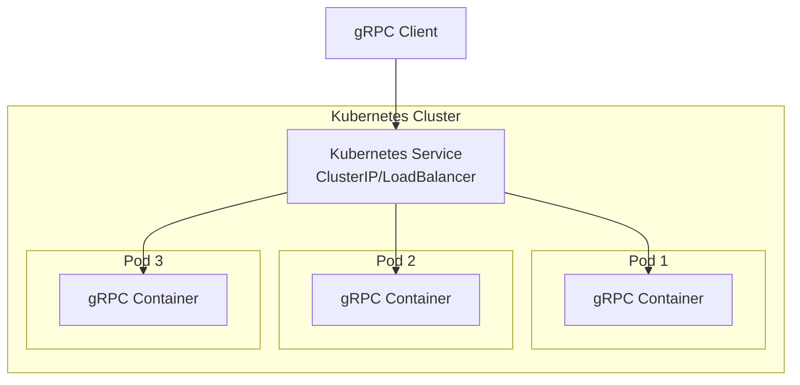

# How to Deploy gRPC Services to Kubernetes

Author: [nawazdhandala](https://www.github.com/nawazdhandala)

Tags: gRPC, Kubernetes, Deployment, Containers, DevOps, Microservices, HPA, Resource Management

Description: A comprehensive guide to deploying gRPC services to Kubernetes with proper manifests, service configuration, resource limits, and horizontal pod autoscaling.

---

Deploying gRPC services to Kubernetes requires careful consideration of several factors that differ from traditional REST API deployments. gRPC uses HTTP/2 as its transport protocol, which introduces unique challenges around connection management, load balancing, and health checking. This guide walks you through the complete process of deploying production-ready gRPC services to Kubernetes.

## Understanding gRPC in Kubernetes

Before diving into the deployment manifests, it's important to understand how gRPC differs from REST APIs in a Kubernetes environment:



Key differences include:

- **HTTP/2 Multiplexing**: gRPC multiplexes multiple requests over a single TCP connection
- **Long-lived Connections**: Connections persist longer than typical HTTP/1.1 connections
- **Binary Protocol**: Protocol Buffers provide efficient serialization
- **Bidirectional Streaming**: Supports client, server, and bidirectional streaming

## Project Structure

Let's start with a sample gRPC service structure:

```
grpc-service/
├── Dockerfile
├── go.mod
├── go.sum
├── main.go
├── proto/
│   └── service.proto
├── k8s/
│   ├── namespace.yaml
│   ├── deployment.yaml
│   ├── service.yaml
│   ├── hpa.yaml
│   ├── configmap.yaml
│   └── secret.yaml
└── health/
    └── health.go
```

## Sample gRPC Service

Here's a minimal gRPC service in Go that we'll deploy:

```go
// main.go
package main

import (
    "context"
    "log"
    "net"
    "os"
    "os/signal"
    "syscall"

    "google.golang.org/grpc"
    "google.golang.org/grpc/health"
    "google.golang.org/grpc/health/grpc_health_v1"
    "google.golang.org/grpc/reflection"

    pb "github.com/example/grpc-service/proto"
)

type server struct {
    pb.UnimplementedGreeterServer
}

func (s *server) SayHello(ctx context.Context, req *pb.HelloRequest) (*pb.HelloResponse, error) {
    return &pb.HelloResponse{
        Message: "Hello, " + req.GetName(),
    }, nil
}

func main() {
    port := os.Getenv("GRPC_PORT")
    if port == "" {
        port = "50051"
    }

    lis, err := net.Listen("tcp", ":"+port)
    if err != nil {
        log.Fatalf("Failed to listen: %v", err)
    }

    // Create gRPC server with options
    opts := []grpc.ServerOption{
        grpc.MaxRecvMsgSize(4 * 1024 * 1024), // 4MB
        grpc.MaxSendMsgSize(4 * 1024 * 1024), // 4MB
    }

    grpcServer := grpc.NewServer(opts...)

    // Register the greeter service
    pb.RegisterGreeterServer(grpcServer, &server{})

    // Register health check service
    healthServer := health.NewServer()
    grpc_health_v1.RegisterHealthServer(grpcServer, healthServer)
    healthServer.SetServingStatus("", grpc_health_v1.HealthCheckResponse_SERVING)

    // Enable reflection for debugging
    reflection.Register(grpcServer)

    // Graceful shutdown
    go func() {
        sigChan := make(chan os.Signal, 1)
        signal.Notify(sigChan, syscall.SIGINT, syscall.SIGTERM)
        <-sigChan

        log.Println("Shutting down gRPC server...")
        healthServer.SetServingStatus("", grpc_health_v1.HealthCheckResponse_NOT_SERVING)
        grpcServer.GracefulStop()
    }()

    log.Printf("gRPC server listening on port %s", port)
    if err := grpcServer.Serve(lis); err != nil {
        log.Fatalf("Failed to serve: %v", err)
    }
}
```

## Dockerfile

Create an optimized multi-stage Dockerfile for the gRPC service:

```dockerfile
# Build stage
FROM golang:1.21-alpine AS builder

WORKDIR /app

# Install protoc and dependencies
RUN apk add --no-cache protobuf protobuf-dev

# Copy go mod files
COPY go.mod go.sum ./
RUN go mod download

# Copy source code
COPY . .

# Build the application
RUN CGO_ENABLED=0 GOOS=linux go build -a -installsuffix cgo -o grpc-server .

# Final stage
FROM alpine:3.19

# Add ca-certificates for TLS and grpc-health-probe
RUN apk --no-cache add ca-certificates

# Install grpc-health-probe
RUN GRPC_HEALTH_PROBE_VERSION=v0.4.24 && \
    wget -qO/bin/grpc_health_probe https://github.com/grpc-ecosystem/grpc-health-probe/releases/download/${GRPC_HEALTH_PROBE_VERSION}/grpc_health_probe-linux-amd64 && \
    chmod +x /bin/grpc_health_probe

WORKDIR /app

# Copy binary from builder
COPY --from=builder /app/grpc-server .

# Create non-root user
RUN adduser -D -g '' appuser
USER appuser

# Expose gRPC port
EXPOSE 50051

# Run the server
CMD ["./grpc-server"]
```

## Kubernetes Manifests

### Namespace

Create a dedicated namespace for your gRPC services:

```yaml
# k8s/namespace.yaml
apiVersion: v1
kind: Namespace
metadata:
  name: grpc-services
  labels:
    name: grpc-services
    istio-injection: disabled  # Set to enabled if using Istio
```

### ConfigMap

Store configuration that can change between environments:

```yaml
# k8s/configmap.yaml
apiVersion: v1
kind: ConfigMap
metadata:
  name: grpc-service-config
  namespace: grpc-services
data:
  GRPC_PORT: "50051"
  LOG_LEVEL: "info"
  MAX_CONCURRENT_STREAMS: "100"
  KEEPALIVE_TIME: "30s"
  KEEPALIVE_TIMEOUT: "10s"
```

### Secret

Store sensitive configuration:

```yaml
# k8s/secret.yaml
apiVersion: v1
kind: Secret
metadata:
  name: grpc-service-secrets
  namespace: grpc-services
type: Opaque
stringData:
  DB_PASSWORD: "your-secure-password"
  API_KEY: "your-api-key"
```

### Deployment

The core deployment manifest with proper resource configuration:

```yaml
# k8s/deployment.yaml
apiVersion: apps/v1
kind: Deployment
metadata:
  name: grpc-service
  namespace: grpc-services
  labels:
    app: grpc-service
    version: v1
spec:
  replicas: 3
  selector:
    matchLabels:
      app: grpc-service
  template:
    metadata:
      labels:
        app: grpc-service
        version: v1
      annotations:
        prometheus.io/scrape: "true"
        prometheus.io/port: "9090"
        prometheus.io/path: "/metrics"
    spec:
      # Pod anti-affinity for high availability
      affinity:
        podAntiAffinity:
          preferredDuringSchedulingIgnoredDuringExecution:
            - weight: 100
              podAffinityTerm:
                labelSelector:
                  matchExpressions:
                    - key: app
                      operator: In
                      values:
                        - grpc-service
                topologyKey: kubernetes.io/hostname

      # Security context for the pod
      securityContext:
        runAsNonRoot: true
        runAsUser: 1000
        fsGroup: 1000

      # Service account
      serviceAccountName: grpc-service-sa

      containers:
        - name: grpc-server
          image: your-registry/grpc-service:v1.0.0
          imagePullPolicy: Always

          ports:
            - name: grpc
              containerPort: 50051
              protocol: TCP
            - name: metrics
              containerPort: 9090
              protocol: TCP

          # Environment variables from ConfigMap
          envFrom:
            - configMapRef:
                name: grpc-service-config

          # Environment variables from Secret
          env:
            - name: DB_PASSWORD
              valueFrom:
                secretKeyRef:
                  name: grpc-service-secrets
                  key: DB_PASSWORD

          # Resource limits and requests
          resources:
            requests:
              cpu: "100m"
              memory: "128Mi"
            limits:
              cpu: "500m"
              memory: "512Mi"

          # Readiness probe using grpc-health-probe
          readinessProbe:
            exec:
              command:
                - /bin/grpc_health_probe
                - -addr=:50051
            initialDelaySeconds: 5
            periodSeconds: 10
            timeoutSeconds: 5
            successThreshold: 1
            failureThreshold: 3

          # Liveness probe
          livenessProbe:
            exec:
              command:
                - /bin/grpc_health_probe
                - -addr=:50051
            initialDelaySeconds: 15
            periodSeconds: 20
            timeoutSeconds: 5
            failureThreshold: 3

          # Startup probe for slow-starting containers
          startupProbe:
            exec:
              command:
                - /bin/grpc_health_probe
                - -addr=:50051
            initialDelaySeconds: 0
            periodSeconds: 5
            timeoutSeconds: 5
            failureThreshold: 30

          # Security context for container
          securityContext:
            allowPrivilegeEscalation: false
            readOnlyRootFilesystem: true
            capabilities:
              drop:
                - ALL

          # Volume mounts
          volumeMounts:
            - name: tmp
              mountPath: /tmp
            - name: cache
              mountPath: /app/cache

      # Volumes
      volumes:
        - name: tmp
          emptyDir: {}
        - name: cache
          emptyDir:
            sizeLimit: 100Mi

      # Termination grace period (important for gRPC)
      terminationGracePeriodSeconds: 30

      # Image pull secrets if using private registry
      imagePullSecrets:
        - name: registry-credentials
```

### Service

Create a Kubernetes Service to expose the gRPC deployment:

```yaml
# k8s/service.yaml
apiVersion: v1
kind: Service
metadata:
  name: grpc-service
  namespace: grpc-services
  labels:
    app: grpc-service
  annotations:
    # For cloud providers that support HTTP/2
    service.beta.kubernetes.io/aws-load-balancer-backend-protocol: "http2"
spec:
  type: ClusterIP
  selector:
    app: grpc-service
  ports:
    - name: grpc
      port: 50051
      targetPort: grpc
      protocol: TCP
---
# External LoadBalancer service (if needed)
apiVersion: v1
kind: Service
metadata:
  name: grpc-service-lb
  namespace: grpc-services
  labels:
    app: grpc-service
  annotations:
    # AWS NLB for gRPC (TCP passthrough)
    service.beta.kubernetes.io/aws-load-balancer-type: "nlb"
    service.beta.kubernetes.io/aws-load-balancer-cross-zone-load-balancing-enabled: "true"
    # GCP annotations
    cloud.google.com/app-protocols: '{"grpc":"HTTP2"}'
spec:
  type: LoadBalancer
  selector:
    app: grpc-service
  ports:
    - name: grpc
      port: 443
      targetPort: grpc
      protocol: TCP
```

### ServiceAccount and RBAC

```yaml
# k8s/rbac.yaml
apiVersion: v1
kind: ServiceAccount
metadata:
  name: grpc-service-sa
  namespace: grpc-services
---
apiVersion: rbac.authorization.k8s.io/v1
kind: Role
metadata:
  name: grpc-service-role
  namespace: grpc-services
rules:
  - apiGroups: [""]
    resources: ["configmaps"]
    verbs: ["get", "list", "watch"]
  - apiGroups: [""]
    resources: ["secrets"]
    verbs: ["get"]
---
apiVersion: rbac.authorization.k8s.io/v1
kind: RoleBinding
metadata:
  name: grpc-service-rolebinding
  namespace: grpc-services
subjects:
  - kind: ServiceAccount
    name: grpc-service-sa
    namespace: grpc-services
roleRef:
  kind: Role
  name: grpc-service-role
  apiGroup: rbac.authorization.k8s.io
```

### Horizontal Pod Autoscaler (HPA)

Configure autoscaling based on CPU and memory:

```yaml
# k8s/hpa.yaml
apiVersion: autoscaling/v2
kind: HorizontalPodAutoscaler
metadata:
  name: grpc-service-hpa
  namespace: grpc-services
spec:
  scaleTargetRef:
    apiVersion: apps/v1
    kind: Deployment
    name: grpc-service
  minReplicas: 3
  maxReplicas: 20
  metrics:
    # CPU-based scaling
    - type: Resource
      resource:
        name: cpu
        target:
          type: Utilization
          averageUtilization: 70
    # Memory-based scaling
    - type: Resource
      resource:
        name: memory
        target:
          type: Utilization
          averageUtilization: 80
  behavior:
    scaleDown:
      stabilizationWindowSeconds: 300
      policies:
        - type: Percent
          value: 10
          periodSeconds: 60
        - type: Pods
          value: 2
          periodSeconds: 60
      selectPolicy: Min
    scaleUp:
      stabilizationWindowSeconds: 0
      policies:
        - type: Percent
          value: 100
          periodSeconds: 15
        - type: Pods
          value: 4
          periodSeconds: 15
      selectPolicy: Max
```

### Custom Metrics HPA with KEDA

For more advanced autoscaling based on gRPC-specific metrics:

```yaml
# k8s/keda-scaledobject.yaml
apiVersion: keda.sh/v1alpha1
kind: ScaledObject
metadata:
  name: grpc-service-scaledobject
  namespace: grpc-services
spec:
  scaleTargetRef:
    name: grpc-service
  pollingInterval: 15
  cooldownPeriod: 300
  minReplicaCount: 3
  maxReplicaCount: 50
  triggers:
    # Scale based on gRPC request rate from Prometheus
    - type: prometheus
      metadata:
        serverAddress: http://prometheus.monitoring:9090
        metricName: grpc_server_handled_total
        threshold: "100"
        query: |
          sum(rate(grpc_server_handled_total{
            grpc_service="greeter.Greeter",
            namespace="grpc-services"
          }[2m]))
    # Scale based on active gRPC streams
    - type: prometheus
      metadata:
        serverAddress: http://prometheus.monitoring:9090
        metricName: grpc_server_started_total
        threshold: "50"
        query: |
          sum(grpc_server_started_total{namespace="grpc-services"})
          - sum(grpc_server_handled_total{namespace="grpc-services"})
```

### Pod Disruption Budget

Ensure high availability during updates:

```yaml
# k8s/pdb.yaml
apiVersion: policy/v1
kind: PodDisruptionBudget
metadata:
  name: grpc-service-pdb
  namespace: grpc-services
spec:
  minAvailable: 2
  selector:
    matchLabels:
      app: grpc-service
```

### Network Policy

Secure network access to your gRPC service:

```yaml
# k8s/networkpolicy.yaml
apiVersion: networking.k8s.io/v1
kind: NetworkPolicy
metadata:
  name: grpc-service-network-policy
  namespace: grpc-services
spec:
  podSelector:
    matchLabels:
      app: grpc-service
  policyTypes:
    - Ingress
    - Egress
  ingress:
    # Allow gRPC traffic from within the cluster
    - from:
        - namespaceSelector:
            matchLabels:
              name: default
        - namespaceSelector:
            matchLabels:
              name: api-gateway
      ports:
        - protocol: TCP
          port: 50051
    # Allow metrics scraping from monitoring namespace
    - from:
        - namespaceSelector:
            matchLabels:
              name: monitoring
      ports:
        - protocol: TCP
          port: 9090
  egress:
    # Allow DNS
    - to:
        - namespaceSelector: {}
      ports:
        - protocol: UDP
          port: 53
    # Allow egress to database
    - to:
        - namespaceSelector:
            matchLabels:
              name: database
      ports:
        - protocol: TCP
          port: 5432
```

## Deployment Process

### Step 1: Build and Push the Image

```bash
# Build the Docker image
docker build -t your-registry/grpc-service:v1.0.0 .

# Push to registry
docker push your-registry/grpc-service:v1.0.0
```

### Step 2: Apply Kubernetes Manifests

```bash
# Create namespace
kubectl apply -f k8s/namespace.yaml

# Create RBAC resources
kubectl apply -f k8s/rbac.yaml

# Create ConfigMap and Secret
kubectl apply -f k8s/configmap.yaml
kubectl apply -f k8s/secret.yaml

# Deploy the application
kubectl apply -f k8s/deployment.yaml

# Create the service
kubectl apply -f k8s/service.yaml

# Set up HPA
kubectl apply -f k8s/hpa.yaml

# Apply PDB
kubectl apply -f k8s/pdb.yaml

# Apply Network Policy
kubectl apply -f k8s/networkpolicy.yaml
```

### Step 3: Verify Deployment

```bash
# Check deployment status
kubectl -n grpc-services get deployments

# Check pods
kubectl -n grpc-services get pods -l app=grpc-service

# Check service
kubectl -n grpc-services get svc grpc-service

# Check HPA
kubectl -n grpc-services get hpa

# View logs
kubectl -n grpc-services logs -l app=grpc-service -f

# Test gRPC health
kubectl -n grpc-services exec -it deploy/grpc-service -- /bin/grpc_health_probe -addr=:50051
```

## Testing the Deployment

### Port Forward for Local Testing

```bash
# Forward the gRPC port
kubectl -n grpc-services port-forward svc/grpc-service 50051:50051
```

### Using grpcurl

```bash
# List available services
grpcurl -plaintext localhost:50051 list

# Describe a service
grpcurl -plaintext localhost:50051 describe greeter.Greeter

# Call a method
grpcurl -plaintext -d '{"name": "World"}' localhost:50051 greeter.Greeter/SayHello
```

## Rolling Updates

Perform zero-downtime updates:

```yaml
# k8s/deployment.yaml (update strategy section)
spec:
  strategy:
    type: RollingUpdate
    rollingUpdate:
      maxSurge: 1
      maxUnavailable: 0
```

Update the deployment:

```bash
# Update image
kubectl -n grpc-services set image deployment/grpc-service \
  grpc-server=your-registry/grpc-service:v1.1.0

# Watch rollout status
kubectl -n grpc-services rollout status deployment/grpc-service

# Rollback if needed
kubectl -n grpc-services rollout undo deployment/grpc-service
```

## Monitoring and Observability

### Prometheus ServiceMonitor

```yaml
# k8s/servicemonitor.yaml
apiVersion: monitoring.coreos.com/v1
kind: ServiceMonitor
metadata:
  name: grpc-service-monitor
  namespace: grpc-services
  labels:
    release: prometheus
spec:
  selector:
    matchLabels:
      app: grpc-service
  endpoints:
    - port: metrics
      interval: 15s
      path: /metrics
```

### Key Metrics to Monitor

- `grpc_server_handled_total`: Total RPCs completed
- `grpc_server_started_total`: Total RPCs started
- `grpc_server_handling_seconds`: RPC latency histogram
- `grpc_server_msg_received_total`: Messages received
- `grpc_server_msg_sent_total`: Messages sent

## Best Practices Summary

1. **Always use health checks**: Implement the gRPC health checking protocol
2. **Set appropriate resource limits**: Prevent resource contention
3. **Configure HPA**: Enable automatic scaling based on load
4. **Use PodDisruptionBudget**: Maintain availability during maintenance
5. **Implement graceful shutdown**: Handle SIGTERM properly
6. **Set termination grace period**: Allow time for in-flight requests
7. **Use pod anti-affinity**: Spread pods across nodes
8. **Enable metrics**: Monitor gRPC-specific metrics
9. **Secure with Network Policies**: Limit network access
10. **Use rolling updates**: Zero-downtime deployments

## Conclusion

Deploying gRPC services to Kubernetes requires understanding the unique characteristics of HTTP/2 and the gRPC protocol. By following the patterns outlined in this guide, you can deploy production-ready gRPC services with proper resource management, health checking, autoscaling, and security. The key is to leverage Kubernetes-native features while accommodating gRPC's connection-oriented nature.
