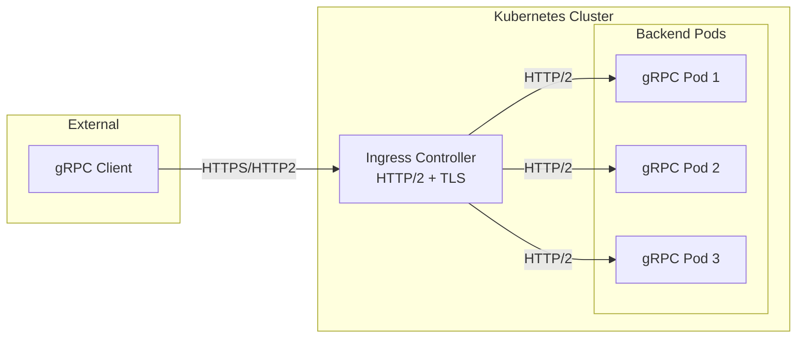
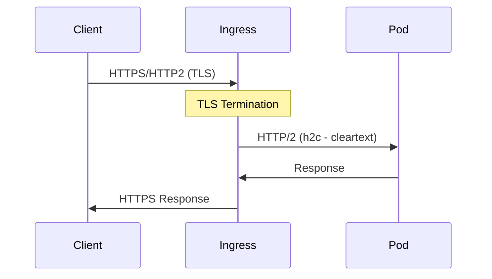
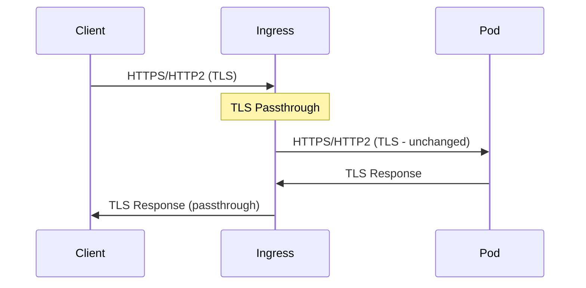

# How to Expose gRPC Services with Kubernetes Ingress

Author: [nawazdhandala](https://www.github.com/nawazdhandala)

Tags: gRPC, Kubernetes, Ingress, NGINX, Traefik, TLS, HTTP/2, Load Balancing, API Gateway

Description: Learn how to expose gRPC services externally using Kubernetes Ingress controllers with NGINX and Traefik, including TLS termination and HTTP/2 backend configuration.

---

Exposing gRPC services through Kubernetes Ingress requires special consideration because gRPC relies on HTTP/2 for transport. Not all Ingress controllers support HTTP/2 out of the box, and those that do often require specific configuration. This guide covers how to properly configure NGINX Ingress and Traefik to expose gRPC services with TLS termination.

## Understanding gRPC and Ingress

gRPC services differ from traditional HTTP/1.1 REST APIs in several ways that affect Ingress configuration:



Key considerations:

- **HTTP/2 Required**: gRPC requires HTTP/2 on both client and server sides
- **TLS Often Required**: Many gRPC clients require TLS for HTTP/2
- **Long-lived Connections**: gRPC maintains persistent connections
- **Binary Protocol**: Protocol Buffers are not human-readable
- **Streaming Support**: Must handle bidirectional streaming

## Prerequisites

Before configuring Ingress for gRPC, ensure you have:

1. A running Kubernetes cluster
2. A gRPC service deployed (see our deployment guide)
3. An Ingress controller installed (NGINX or Traefik)
4. TLS certificates (can use cert-manager for automation)

## NGINX Ingress Controller Setup

### Installing NGINX Ingress Controller

```bash
# Using Helm
helm repo add ingress-nginx https://kubernetes.github.io/ingress-nginx
helm repo update

# Install with HTTP/2 enabled
helm install ingress-nginx ingress-nginx/ingress-nginx \
  --namespace ingress-nginx \
  --create-namespace \
  --set controller.config.use-http2=true \
  --set controller.config.http2-max-concurrent-streams=128
```

### NGINX ConfigMap for gRPC

Configure NGINX globally for optimal gRPC support:

```yaml
# nginx-configmap.yaml
apiVersion: v1
kind: ConfigMap
metadata:
  name: ingress-nginx-controller
  namespace: ingress-nginx
data:
  # Enable HTTP/2
  use-http2: "true"
  http2-max-concurrent-streams: "128"

  # gRPC timeouts (in seconds)
  proxy-read-timeout: "3600"
  proxy-send-timeout: "3600"

  # Keep-alive settings
  keep-alive: "75"
  keep-alive-requests: "100"

  # Buffer settings for large messages
  proxy-buffer-size: "16k"
  proxy-buffers-number: "4"

  # Enable backend HTTP/2
  use-forwarded-headers: "true"

  # gRPC-specific settings
  grpc-buffer-size-kb: "64"
```

### Basic gRPC Ingress with NGINX

```yaml
# grpc-ingress-nginx.yaml
apiVersion: networking.k8s.io/v1
kind: Ingress
metadata:
  name: grpc-service-ingress
  namespace: grpc-services
  annotations:
    # Use NGINX ingress class
    kubernetes.io/ingress.class: nginx

    # Enable HTTP/2 backend
    nginx.ingress.kubernetes.io/backend-protocol: "GRPC"

    # SSL redirect
    nginx.ingress.kubernetes.io/ssl-redirect: "true"

    # Timeouts for long-running RPCs
    nginx.ingress.kubernetes.io/proxy-read-timeout: "3600"
    nginx.ingress.kubernetes.io/proxy-send-timeout: "3600"

    # Connection keep-alive
    nginx.ingress.kubernetes.io/proxy-connect-timeout: "30"
spec:
  ingressClassName: nginx
  tls:
    - hosts:
        - grpc.example.com
      secretName: grpc-tls-secret
  rules:
    - host: grpc.example.com
      http:
        paths:
          - path: /
            pathType: Prefix
            backend:
              service:
                name: grpc-service
                port:
                  number: 50051
```

### TLS Certificate with cert-manager

Automate TLS certificate provisioning:

```yaml
# certificate.yaml
apiVersion: cert-manager.io/v1
kind: Certificate
metadata:
  name: grpc-tls-cert
  namespace: grpc-services
spec:
  secretName: grpc-tls-secret
  issuerRef:
    name: letsencrypt-prod
    kind: ClusterIssuer
  commonName: grpc.example.com
  dnsNames:
    - grpc.example.com
---
# ClusterIssuer for Let's Encrypt
apiVersion: cert-manager.io/v1
kind: ClusterIssuer
metadata:
  name: letsencrypt-prod
spec:
  acme:
    server: https://acme-v02.api.letsencrypt.org/directory
    email: admin@example.com
    privateKeySecretRef:
      name: letsencrypt-prod-key
    solvers:
      - http01:
          ingress:
            class: nginx
```

### Multiple gRPC Services on Different Paths

Route to different gRPC services based on the service name:

```yaml
# multi-service-ingress.yaml
apiVersion: networking.k8s.io/v1
kind: Ingress
metadata:
  name: grpc-multi-service-ingress
  namespace: grpc-services
  annotations:
    kubernetes.io/ingress.class: nginx
    nginx.ingress.kubernetes.io/backend-protocol: "GRPC"
    nginx.ingress.kubernetes.io/ssl-redirect: "true"
spec:
  ingressClassName: nginx
  tls:
    - hosts:
        - api.example.com
      secretName: api-tls-secret
  rules:
    - host: api.example.com
      http:
        paths:
          # Route based on gRPC service package
          - path: /users.UserService
            pathType: Prefix
            backend:
              service:
                name: user-service
                port:
                  number: 50051
          - path: /orders.OrderService
            pathType: Prefix
            backend:
              service:
                name: order-service
                port:
                  number: 50051
          - path: /products.ProductService
            pathType: Prefix
            backend:
              service:
                name: product-service
                port:
                  number: 50051
```

### NGINX Server Snippet for Advanced Configuration

```yaml
# advanced-grpc-ingress.yaml
apiVersion: networking.k8s.io/v1
kind: Ingress
metadata:
  name: grpc-advanced-ingress
  namespace: grpc-services
  annotations:
    kubernetes.io/ingress.class: nginx
    nginx.ingress.kubernetes.io/backend-protocol: "GRPC"
    nginx.ingress.kubernetes.io/ssl-redirect: "true"

    # Custom NGINX configuration
    nginx.ingress.kubernetes.io/server-snippet: |
      # Enable gRPC error handling
      grpc_read_timeout 3600s;
      grpc_send_timeout 3600s;

      # Buffer settings
      grpc_buffer_size 64k;

      # Enable HTTP/2 server push (optional)
      http2_push_preload on;

    nginx.ingress.kubernetes.io/configuration-snippet: |
      # Log gRPC requests
      access_log /var/log/nginx/grpc_access.log;

      # Set gRPC-specific headers
      grpc_set_header X-Real-IP $remote_addr;
      grpc_set_header X-Forwarded-For $proxy_add_x_forwarded_for;
spec:
  ingressClassName: nginx
  tls:
    - hosts:
        - grpc.example.com
      secretName: grpc-tls-secret
  rules:
    - host: grpc.example.com
      http:
        paths:
          - path: /
            pathType: Prefix
            backend:
              service:
                name: grpc-service
                port:
                  number: 50051
```

## Traefik Ingress Controller Setup

### Installing Traefik

```bash
# Using Helm
helm repo add traefik https://helm.traefik.io/traefik
helm repo update

# Install Traefik with HTTP/2 support
helm install traefik traefik/traefik \
  --namespace traefik \
  --create-namespace \
  --set ports.websecure.http2.maxConcurrentStreams=250
```

### Traefik Custom Resource Definitions

Traefik uses IngressRoute CRDs for advanced configuration:

```yaml
# traefik-grpc-ingressroute.yaml
apiVersion: traefik.containo.us/v1alpha1
kind: IngressRoute
metadata:
  name: grpc-service-ingressroute
  namespace: grpc-services
spec:
  entryPoints:
    - websecure
  routes:
    - match: Host(`grpc.example.com`)
      kind: Rule
      services:
        - name: grpc-service
          port: 50051
          scheme: h2c  # HTTP/2 cleartext to backend
  tls:
    secretName: grpc-tls-secret
```

### Traefik Middleware for gRPC

Configure middleware for timeout and retry handling:

```yaml
# traefik-middleware.yaml
apiVersion: traefik.containo.us/v1alpha1
kind: Middleware
metadata:
  name: grpc-middleware
  namespace: grpc-services
spec:
  chain:
    middlewares:
      - name: grpc-retry
      - name: grpc-headers
---
apiVersion: traefik.containo.us/v1alpha1
kind: Middleware
metadata:
  name: grpc-retry
  namespace: grpc-services
spec:
  retry:
    attempts: 3
    initialInterval: 100ms
---
apiVersion: traefik.containo.us/v1alpha1
kind: Middleware
metadata:
  name: grpc-headers
  namespace: grpc-services
spec:
  headers:
    customRequestHeaders:
      X-Forwarded-Proto: "https"
```

### Complete Traefik gRPC Configuration

```yaml
# traefik-complete-grpc.yaml
apiVersion: traefik.containo.us/v1alpha1
kind: ServersTransport
metadata:
  name: grpc-transport
  namespace: grpc-services
spec:
  # Maximum idle connections per host
  maxIdleConnsPerHost: 100

  # Timeouts
  forwardingTimeouts:
    dialTimeout: 30s
    responseHeaderTimeout: 0s  # Disable for streaming
    idleConnTimeout: 90s
---
apiVersion: traefik.containo.us/v1alpha1
kind: IngressRoute
metadata:
  name: grpc-service-route
  namespace: grpc-services
spec:
  entryPoints:
    - websecure
  routes:
    - match: Host(`grpc.example.com`)
      kind: Rule
      middlewares:
        - name: grpc-middleware
      services:
        - name: grpc-service
          port: 50051
          scheme: h2c
          serversTransport: grpc-transport
  tls:
    secretName: grpc-tls-secret
    options:
      name: grpc-tls-options
---
apiVersion: traefik.containo.us/v1alpha1
kind: TLSOption
metadata:
  name: grpc-tls-options
  namespace: grpc-services
spec:
  minVersion: VersionTLS12
  cipherSuites:
    - TLS_ECDHE_RSA_WITH_AES_256_GCM_SHA384
    - TLS_ECDHE_RSA_WITH_AES_128_GCM_SHA256
  alpnProtocols:
    - h2
    - http/1.1
```

### Traefik with Multiple gRPC Services

```yaml
# traefik-multi-service.yaml
apiVersion: traefik.containo.us/v1alpha1
kind: IngressRoute
metadata:
  name: grpc-multi-service-route
  namespace: grpc-services
spec:
  entryPoints:
    - websecure
  routes:
    # User Service
    - match: Host(`api.example.com`) && PathPrefix(`/users`)
      kind: Rule
      services:
        - name: user-grpc-service
          port: 50051
          scheme: h2c

    # Order Service
    - match: Host(`api.example.com`) && PathPrefix(`/orders`)
      kind: Rule
      services:
        - name: order-grpc-service
          port: 50051
          scheme: h2c

    # Default route
    - match: Host(`api.example.com`)
      kind: Rule
      services:
        - name: default-grpc-service
          port: 50051
          scheme: h2c
  tls:
    secretName: api-tls-secret
```

## TLS Configuration Options

### Option 1: TLS Termination at Ingress (Recommended)



```yaml
# tls-termination-ingress.yaml
apiVersion: networking.k8s.io/v1
kind: Ingress
metadata:
  name: grpc-tls-termination
  namespace: grpc-services
  annotations:
    nginx.ingress.kubernetes.io/backend-protocol: "GRPC"
    nginx.ingress.kubernetes.io/ssl-redirect: "true"
spec:
  ingressClassName: nginx
  tls:
    - hosts:
        - grpc.example.com
      secretName: grpc-tls-secret
  rules:
    - host: grpc.example.com
      http:
        paths:
          - path: /
            pathType: Prefix
            backend:
              service:
                name: grpc-service
                port:
                  number: 50051
```

### Option 2: TLS Passthrough (End-to-End Encryption)



NGINX TLS Passthrough:

```yaml
# tls-passthrough-nginx.yaml
apiVersion: networking.k8s.io/v1
kind: Ingress
metadata:
  name: grpc-tls-passthrough
  namespace: grpc-services
  annotations:
    nginx.ingress.kubernetes.io/ssl-passthrough: "true"
    nginx.ingress.kubernetes.io/backend-protocol: "GRPCS"
spec:
  ingressClassName: nginx
  tls:
    - hosts:
        - grpc.example.com
  rules:
    - host: grpc.example.com
      http:
        paths:
          - path: /
            pathType: Prefix
            backend:
              service:
                name: grpc-service
                port:
                  number: 50051
```

Traefik TLS Passthrough:

```yaml
# tls-passthrough-traefik.yaml
apiVersion: traefik.containo.us/v1alpha1
kind: IngressRouteTCP
metadata:
  name: grpc-tls-passthrough
  namespace: grpc-services
spec:
  entryPoints:
    - websecure
  routes:
    - match: HostSNI(`grpc.example.com`)
      services:
        - name: grpc-service
          port: 50051
  tls:
    passthrough: true
```

### Option 3: mTLS (Mutual TLS)

```yaml
# mtls-ingress.yaml
apiVersion: networking.k8s.io/v1
kind: Ingress
metadata:
  name: grpc-mtls-ingress
  namespace: grpc-services
  annotations:
    nginx.ingress.kubernetes.io/backend-protocol: "GRPCS"
    nginx.ingress.kubernetes.io/auth-tls-verify-client: "on"
    nginx.ingress.kubernetes.io/auth-tls-secret: "grpc-services/ca-secret"
    nginx.ingress.kubernetes.io/auth-tls-verify-depth: "2"
    nginx.ingress.kubernetes.io/proxy-ssl-secret: "grpc-services/backend-tls"
spec:
  ingressClassName: nginx
  tls:
    - hosts:
        - grpc.example.com
      secretName: grpc-server-tls
  rules:
    - host: grpc.example.com
      http:
        paths:
          - path: /
            pathType: Prefix
            backend:
              service:
                name: grpc-service
                port:
                  number: 50051
```

## gRPC-Web Support

For browser clients, configure gRPC-Web transcoding:

```yaml
# grpc-web-ingress.yaml
apiVersion: networking.k8s.io/v1
kind: Ingress
metadata:
  name: grpc-web-ingress
  namespace: grpc-services
  annotations:
    nginx.ingress.kubernetes.io/backend-protocol: "GRPC"
    nginx.ingress.kubernetes.io/ssl-redirect: "true"

    # Enable CORS for gRPC-Web
    nginx.ingress.kubernetes.io/enable-cors: "true"
    nginx.ingress.kubernetes.io/cors-allow-methods: "GET, POST, OPTIONS"
    nginx.ingress.kubernetes.io/cors-allow-headers: "DNT,X-CustomHeader,Keep-Alive,User-Agent,X-Requested-With,If-Modified-Since,Cache-Control,Content-Type,Authorization,x-grpc-web,grpc-timeout"
    nginx.ingress.kubernetes.io/cors-expose-headers: "grpc-status,grpc-message"
    nginx.ingress.kubernetes.io/cors-allow-credentials: "true"
    nginx.ingress.kubernetes.io/cors-allow-origin: "https://app.example.com"
spec:
  ingressClassName: nginx
  tls:
    - hosts:
        - grpc.example.com
      secretName: grpc-tls-secret
  rules:
    - host: grpc.example.com
      http:
        paths:
          - path: /
            pathType: Prefix
            backend:
              service:
                name: grpc-web-proxy
                port:
                  number: 8080
```

## Testing the Ingress Configuration

### Test with grpcurl

```bash
# Test with TLS
grpcurl -d '{"name": "World"}' grpc.example.com:443 greeter.Greeter/SayHello

# Test with insecure flag (self-signed certs)
grpcurl -insecure -d '{"name": "World"}' grpc.example.com:443 greeter.Greeter/SayHello

# List services
grpcurl grpc.example.com:443 list

# Describe service
grpcurl grpc.example.com:443 describe greeter.Greeter
```

### Test with Custom TLS Certificates

```bash
# With custom CA certificate
grpcurl -cacert /path/to/ca.crt \
  -d '{"name": "World"}' \
  grpc.example.com:443 greeter.Greeter/SayHello

# With client certificates (mTLS)
grpcurl -cacert /path/to/ca.crt \
  -cert /path/to/client.crt \
  -key /path/to/client.key \
  -d '{"name": "World"}' \
  grpc.example.com:443 greeter.Greeter/SayHello
```

### Test from Within the Cluster

```bash
# Create a test pod
kubectl run grpc-client --rm -it --image=fullstorydev/grpcurl:latest -- \
  -plaintext grpc-service.grpc-services.svc.cluster.local:50051 list
```

## Troubleshooting

### Common Issues and Solutions

#### 1. HTTP/2 Protocol Errors

```bash
# Check NGINX error logs
kubectl -n ingress-nginx logs -l app.kubernetes.io/component=controller | grep -i grpc

# Verify HTTP/2 is enabled
kubectl -n ingress-nginx get configmap ingress-nginx-controller -o yaml | grep http2
```

#### 2. Connection Resets

Increase timeout values:

```yaml
annotations:
  nginx.ingress.kubernetes.io/proxy-read-timeout: "3600"
  nginx.ingress.kubernetes.io/proxy-send-timeout: "3600"
  nginx.ingress.kubernetes.io/proxy-connect-timeout: "30"
```

#### 3. TLS Handshake Failures

```bash
# Check certificate
kubectl -n grpc-services get secret grpc-tls-secret -o jsonpath='{.data.tls\.crt}' | base64 -d | openssl x509 -text -noout

# Verify certificate matches domain
openssl s_client -connect grpc.example.com:443 -servername grpc.example.com
```

#### 4. Backend Protocol Mismatch

Ensure the annotation matches your backend:

```yaml
# For HTTP/2 cleartext backend
nginx.ingress.kubernetes.io/backend-protocol: "GRPC"

# For HTTPS/HTTP2 backend
nginx.ingress.kubernetes.io/backend-protocol: "GRPCS"
```

### Debug Logging

Enable debug logging for troubleshooting:

```yaml
# NGINX debug logging
apiVersion: v1
kind: ConfigMap
metadata:
  name: ingress-nginx-controller
  namespace: ingress-nginx
data:
  error-log-level: debug
```

## Performance Optimization

### Connection Pooling

```yaml
# nginx-configmap.yaml
data:
  upstream-keepalive-connections: "320"
  upstream-keepalive-timeout: "60"
  upstream-keepalive-requests: "10000"
```

### Buffer Sizes

```yaml
# For large gRPC messages
data:
  proxy-buffer-size: "64k"
  proxy-buffers-number: "8"
  client-body-buffer-size: "64k"
```

## Best Practices

1. **Always use TLS**: gRPC over HTTP/2 typically requires TLS in production
2. **Configure appropriate timeouts**: gRPC streams can be long-lived
3. **Enable HTTP/2**: Ensure your Ingress controller has HTTP/2 enabled
4. **Monitor connections**: Track HTTP/2 connection metrics
5. **Use health checks**: Configure proper gRPC health checking
6. **Consider connection limits**: Set appropriate max concurrent streams
7. **Test streaming**: Verify bidirectional streaming works correctly
8. **Plan for failover**: Configure retry policies appropriately

## Conclusion

Exposing gRPC services through Kubernetes Ingress requires understanding the HTTP/2 protocol requirements and proper configuration of your Ingress controller. Both NGINX Ingress and Traefik provide excellent support for gRPC when properly configured. The key is ensuring HTTP/2 is enabled, timeouts are appropriate for your use case, and TLS is properly configured. With these configurations in place, you can expose your gRPC services securely and efficiently.
