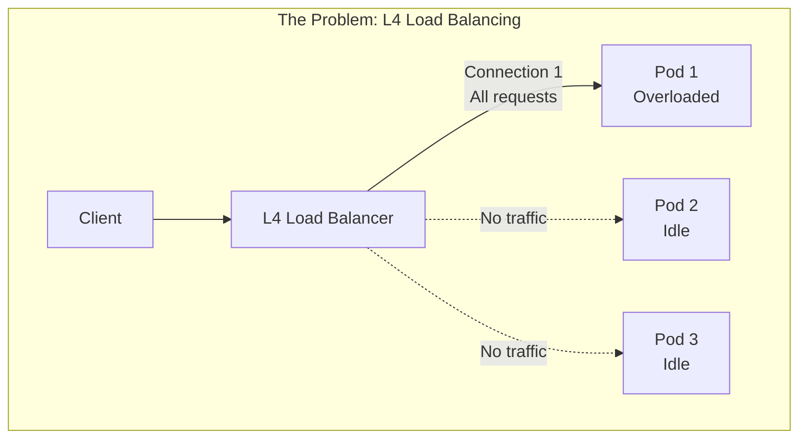
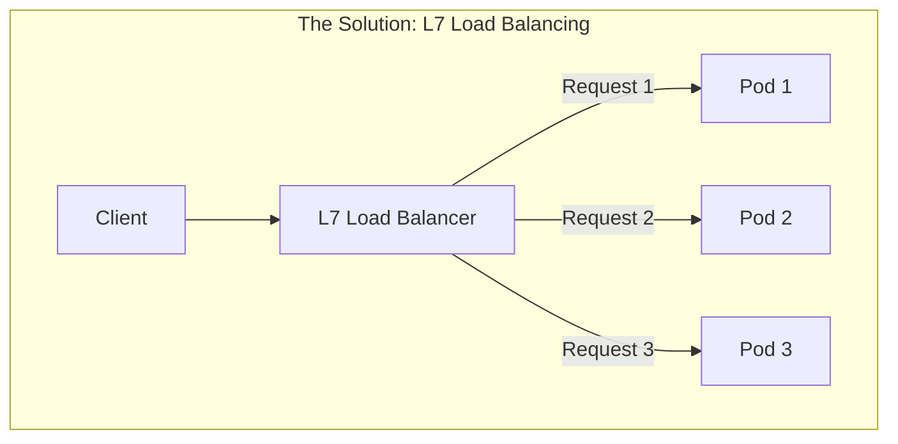
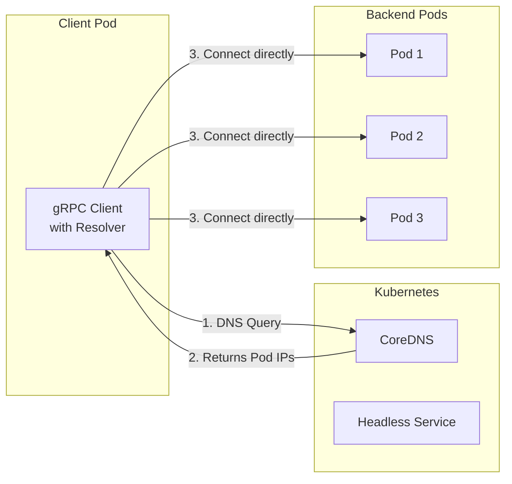
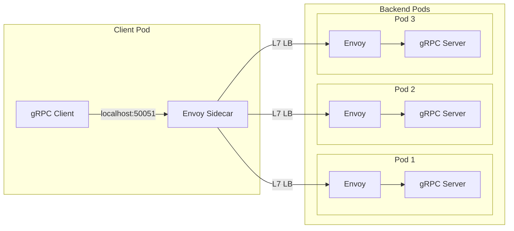
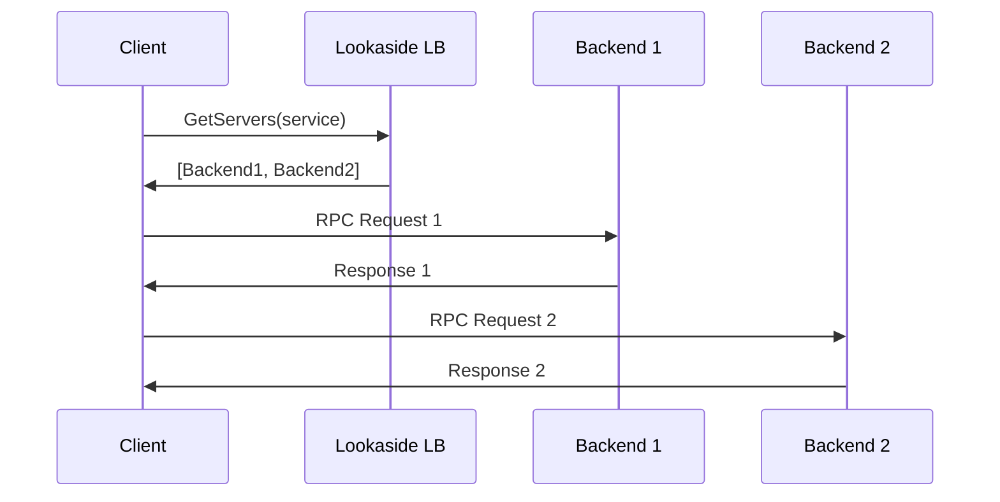

# How to Load Balance gRPC Traffic in Kubernetes Without a Service Mesh

Author: [nawazdhandala](https://www.github.com/nawazdhandala)

Tags: gRPC, Kubernetes, Load Balancing, Envoy, Client-Side Load Balancing, Proxy, HTTP/2, Sidecar

Description: A comprehensive guide to load balancing gRPC traffic in Kubernetes without a service mesh, covering client-side load balancing, L7 proxies with Envoy sidecar, and connection management strategies.

---

Load balancing gRPC traffic in Kubernetes presents unique challenges due to HTTP/2's connection-oriented nature. Unlike HTTP/1.1 where each request uses a separate connection, gRPC multiplexes many requests over a single persistent connection. This means traditional L4 load balancing distributes connections, not requests, leading to uneven load distribution. This guide explores effective strategies for load balancing gRPC without requiring a full service mesh.

## Understanding the gRPC Load Balancing Challenge





### Why Standard Kubernetes Load Balancing Fails for gRPC

1. **kube-proxy operates at L4**: It balances connections, not requests
2. **HTTP/2 multiplexing**: Single connection carries multiple streams
3. **Persistent connections**: gRPC keeps connections alive for efficiency
4. **No request awareness**: L4 cannot inspect gRPC metadata

## Load Balancing Strategies Overview

| Strategy | Level | Pros | Cons | Best For |
|----------|-------|------|------|----------|
| Client-side LB | L7 | Simple, no proxy overhead | Client complexity | Internal services |
| Envoy Sidecar | L7 | Full L7 features | Resource overhead | Production workloads |
| Lookaside LB | L7 | Centralized control | Additional component | Large deployments |
| Ingress Controller | L7 | External access | Limited features | External traffic |

## Strategy 1: Client-Side Load Balancing

The simplest approach: let gRPC clients handle load balancing directly.

### Architecture



### Kubernetes Resources

```yaml
# headless-service.yaml
apiVersion: v1
kind: Service
metadata:
  name: grpc-backend-headless
  namespace: grpc-services
spec:
  clusterIP: None
  selector:
    app: grpc-backend
  ports:
    - name: grpc
      port: 50051
---
apiVersion: apps/v1
kind: Deployment
metadata:
  name: grpc-backend
  namespace: grpc-services
spec:
  replicas: 5
  selector:
    matchLabels:
      app: grpc-backend
  template:
    metadata:
      labels:
        app: grpc-backend
    spec:
      containers:
        - name: server
          image: your-registry/grpc-server:v1.0.0
          ports:
            - containerPort: 50051
          readinessProbe:
            grpc:
              port: 50051
            initialDelaySeconds: 5
            periodSeconds: 10
```

### Go Client Implementation

```go
// client/client.go
package main

import (
    "context"
    "log"
    "os"
    "time"

    "google.golang.org/grpc"
    "google.golang.org/grpc/credentials/insecure"
    "google.golang.org/grpc/keepalive"

    pb "github.com/example/proto"
)

func main() {
    // DNS target for headless service
    target := "dns:///grpc-backend-headless.grpc-services.svc.cluster.local:50051"

    // Service config for round-robin load balancing
    serviceConfig := `{
        "loadBalancingPolicy": "round_robin",
        "healthCheckConfig": {
            "serviceName": ""
        },
        "methodConfig": [{
            "name": [{"service": ""}],
            "retryPolicy": {
                "maxAttempts": 3,
                "initialBackoff": "0.1s",
                "maxBackoff": "1s",
                "backoffMultiplier": 2.0,
                "retryableStatusCodes": ["UNAVAILABLE"]
            }
        }]
    }`

    // Keepalive parameters
    kaParams := keepalive.ClientParameters{
        Time:                10 * time.Second,
        Timeout:             3 * time.Second,
        PermitWithoutStream: true,
    }

    // Create connection
    conn, err := grpc.Dial(
        target,
        grpc.WithTransportCredentials(insecure.NewCredentials()),
        grpc.WithDefaultServiceConfig(serviceConfig),
        grpc.WithKeepaliveParams(kaParams),
    )
    if err != nil {
        log.Fatalf("Failed to connect: %v", err)
    }
    defer conn.Close()

    client := pb.NewGreeterClient(conn)

    // Make requests - distributed across backends
    for i := 0; i < 100; i++ {
        ctx, cancel := context.WithTimeout(context.Background(), 5*time.Second)
        resp, err := client.SayHello(ctx, &pb.HelloRequest{Name: "World"})
        if err != nil {
            log.Printf("Error: %v", err)
        } else {
            log.Printf("Response: %s", resp.GetMessage())
        }
        cancel()
        time.Sleep(100 * time.Millisecond)
    }
}
```

### Python Client Implementation

```python
# client.py
import grpc
import time
from concurrent import futures

import greeter_pb2
import greeter_pb2_grpc

def create_channel():
    """Create gRPC channel with client-side load balancing."""
    target = "dns:///grpc-backend-headless.grpc-services.svc.cluster.local:50051"

    options = [
        ('grpc.lb_policy_name', 'round_robin'),
        ('grpc.enable_retries', 1),
        ('grpc.service_config', '''{
            "loadBalancingPolicy": "round_robin",
            "methodConfig": [{
                "name": [{"service": "greeter.Greeter"}],
                "retryPolicy": {
                    "maxAttempts": 3,
                    "initialBackoff": "0.1s",
                    "maxBackoff": "1s",
                    "backoffMultiplier": 2,
                    "retryableStatusCodes": ["UNAVAILABLE"]
                }
            }]
        }'''),
        ('grpc.keepalive_time_ms', 10000),
        ('grpc.keepalive_timeout_ms', 5000),
    ]

    return grpc.insecure_channel(target, options=options)

def main():
    channel = create_channel()
    stub = greeter_pb2_grpc.GreeterStub(channel)

    for i in range(100):
        try:
            response = stub.SayHello(
                greeter_pb2.HelloRequest(name='World'),
                timeout=5.0
            )
            print(f"Response {i}: {response.message}")
        except grpc.RpcError as e:
            print(f"Error {i}: {e}")
        time.sleep(0.1)

    channel.close()

if __name__ == '__main__':
    main()
```

## Strategy 2: Envoy Sidecar Proxy

Deploy Envoy as a sidecar to handle L7 load balancing without a full service mesh.

### Architecture



### Envoy Configuration

```yaml
# envoy-config.yaml
apiVersion: v1
kind: ConfigMap
metadata:
  name: envoy-config
  namespace: grpc-services
data:
  envoy.yaml: |
    admin:
      address:
        socket_address:
          address: 127.0.0.1
          port_value: 9901

    static_resources:
      listeners:
        - name: grpc_listener
          address:
            socket_address:
              address: 0.0.0.0
              port_value: 50051
          filter_chains:
            - filters:
                - name: envoy.filters.network.http_connection_manager
                  typed_config:
                    "@type": type.googleapis.com/envoy.extensions.filters.network.http_connection_manager.v3.HttpConnectionManager
                    stat_prefix: grpc
                    codec_type: AUTO
                    route_config:
                      name: grpc_route
                      virtual_hosts:
                        - name: grpc_service
                          domains: ["*"]
                          routes:
                            - match:
                                prefix: "/"
                                grpc: {}
                              route:
                                cluster: grpc_backend
                                timeout: 30s
                                retry_policy:
                                  retry_on: "unavailable,resource-exhausted"
                                  num_retries: 3
                                  per_try_timeout: 10s
                    http_filters:
                      - name: envoy.filters.http.router
                        typed_config:
                          "@type": type.googleapis.com/envoy.extensions.filters.http.router.v3.Router
                    http2_protocol_options:
                      max_concurrent_streams: 100

      clusters:
        - name: grpc_backend
          connect_timeout: 5s
          type: STRICT_DNS
          lb_policy: ROUND_ROBIN
          typed_extension_protocol_options:
            envoy.extensions.upstreams.http.v3.HttpProtocolOptions:
              "@type": type.googleapis.com/envoy.extensions.upstreams.http.v3.HttpProtocolOptions
              explicit_http_config:
                http2_protocol_options:
                  max_concurrent_streams: 100
          load_assignment:
            cluster_name: grpc_backend
            endpoints:
              - lb_endpoints:
                  - endpoint:
                      address:
                        socket_address:
                          address: grpc-backend-headless.grpc-services.svc.cluster.local
                          port_value: 50051
          health_checks:
            - timeout: 5s
              interval: 10s
              unhealthy_threshold: 3
              healthy_threshold: 2
              grpc_health_check:
                service_name: ""
```

### Client Deployment with Envoy Sidecar

```yaml
# client-with-envoy.yaml
apiVersion: apps/v1
kind: Deployment
metadata:
  name: grpc-client
  namespace: grpc-services
spec:
  replicas: 2
  selector:
    matchLabels:
      app: grpc-client
  template:
    metadata:
      labels:
        app: grpc-client
    spec:
      containers:
        # Main application container
        - name: client
          image: your-registry/grpc-client:v1.0.0
          env:
            # Connect to local Envoy
            - name: GRPC_SERVER_ADDRESS
              value: "localhost:50051"
          resources:
            requests:
              cpu: 100m
              memory: 128Mi

        # Envoy sidecar
        - name: envoy
          image: envoyproxy/envoy:v1.28.0
          ports:
            - containerPort: 50051
              name: grpc
            - containerPort: 9901
              name: admin
          volumeMounts:
            - name: envoy-config
              mountPath: /etc/envoy
          args:
            - -c
            - /etc/envoy/envoy.yaml
            - --service-cluster
            - grpc-client
            - --service-node
            - $(POD_NAME)
          env:
            - name: POD_NAME
              valueFrom:
                fieldRef:
                  fieldPath: metadata.name
          resources:
            requests:
              cpu: 50m
              memory: 64Mi
            limits:
              cpu: 200m
              memory: 256Mi
          readinessProbe:
            httpGet:
              path: /ready
              port: 9901
            initialDelaySeconds: 5
            periodSeconds: 10

      volumes:
        - name: envoy-config
          configMap:
            name: envoy-config
```

### Advanced Envoy Configuration with Circuit Breaking

```yaml
# envoy-advanced-config.yaml
apiVersion: v1
kind: ConfigMap
metadata:
  name: envoy-advanced-config
  namespace: grpc-services
data:
  envoy.yaml: |
    admin:
      address:
        socket_address:
          address: 127.0.0.1
          port_value: 9901

    static_resources:
      listeners:
        - name: grpc_listener
          address:
            socket_address:
              address: 0.0.0.0
              port_value: 50051
          filter_chains:
            - filters:
                - name: envoy.filters.network.http_connection_manager
                  typed_config:
                    "@type": type.googleapis.com/envoy.extensions.filters.network.http_connection_manager.v3.HttpConnectionManager
                    stat_prefix: grpc
                    codec_type: AUTO
                    route_config:
                      name: grpc_route
                      virtual_hosts:
                        - name: grpc_service
                          domains: ["*"]
                          routes:
                            - match:
                                prefix: "/greeter.Greeter/"
                              route:
                                cluster: greeter_backend
                                timeout: 30s
                            - match:
                                prefix: "/orders.OrderService/"
                              route:
                                cluster: order_backend
                                timeout: 60s
                            - match:
                                prefix: "/"
                              route:
                                cluster: default_backend
                    http_filters:
                      - name: envoy.filters.http.router
                        typed_config:
                          "@type": type.googleapis.com/envoy.extensions.filters.http.router.v3.Router

      clusters:
        - name: greeter_backend
          connect_timeout: 5s
          type: STRICT_DNS
          lb_policy: LEAST_REQUEST
          typed_extension_protocol_options:
            envoy.extensions.upstreams.http.v3.HttpProtocolOptions:
              "@type": type.googleapis.com/envoy.extensions.upstreams.http.v3.HttpProtocolOptions
              explicit_http_config:
                http2_protocol_options: {}
          load_assignment:
            cluster_name: greeter_backend
            endpoints:
              - lb_endpoints:
                  - endpoint:
                      address:
                        socket_address:
                          address: greeter-headless.grpc-services.svc.cluster.local
                          port_value: 50051
          circuit_breakers:
            thresholds:
              - priority: DEFAULT
                max_connections: 100
                max_pending_requests: 100
                max_requests: 1000
                max_retries: 3
          outlier_detection:
            consecutive_5xx: 5
            interval: 10s
            base_ejection_time: 30s
            max_ejection_percent: 50
          health_checks:
            - timeout: 5s
              interval: 10s
              unhealthy_threshold: 3
              healthy_threshold: 2
              grpc_health_check: {}

        - name: order_backend
          connect_timeout: 5s
          type: STRICT_DNS
          lb_policy: ROUND_ROBIN
          typed_extension_protocol_options:
            envoy.extensions.upstreams.http.v3.HttpProtocolOptions:
              "@type": type.googleapis.com/envoy.extensions.upstreams.http.v3.HttpProtocolOptions
              explicit_http_config:
                http2_protocol_options: {}
          load_assignment:
            cluster_name: order_backend
            endpoints:
              - lb_endpoints:
                  - endpoint:
                      address:
                        socket_address:
                          address: order-headless.grpc-services.svc.cluster.local
                          port_value: 50051
```

## Strategy 3: Lookaside Load Balancer

Use a dedicated load balancer service that clients query for backend addresses.

### Architecture



### Lookaside Load Balancer Implementation

```go
// lookaside/server.go
package main

import (
    "context"
    "log"
    "net"
    "sync"
    "time"

    "google.golang.org/grpc"
    "google.golang.org/grpc/health"
    "google.golang.org/grpc/health/grpc_health_v1"

    pb "github.com/example/lookaside/proto"
)

type LoadBalancerServer struct {
    pb.UnimplementedLoadBalancerServer
    mu       sync.RWMutex
    backends map[string][]string // service -> []addresses
}

func NewLoadBalancerServer() *LoadBalancerServer {
    return &LoadBalancerServer{
        backends: make(map[string][]string),
    }
}

// GetServers returns the list of backend servers for a service
func (s *LoadBalancerServer) GetServers(ctx context.Context, req *pb.GetServersRequest) (*pb.GetServersResponse, error) {
    s.mu.RLock()
    defer s.mu.RUnlock()

    backends := s.backends[req.ServiceName]
    servers := make([]*pb.Server, 0, len(backends))

    for _, addr := range backends {
        servers = append(servers, &pb.Server{
            Address: addr,
            Weight:  100, // Default weight
        })
    }

    return &pb.GetServersResponse{
        Servers: servers,
    }, nil
}

// WatchServers streams server updates to clients
func (s *LoadBalancerServer) WatchServers(req *pb.WatchServersRequest, stream pb.LoadBalancer_WatchServersServer) error {
    ticker := time.NewTicker(5 * time.Second)
    defer ticker.Stop()

    for {
        select {
        case <-stream.Context().Done():
            return stream.Context().Err()
        case <-ticker.C:
            s.mu.RLock()
            backends := s.backends[req.ServiceName]
            s.mu.RUnlock()

            servers := make([]*pb.Server, 0, len(backends))
            for _, addr := range backends {
                servers = append(servers, &pb.Server{
                    Address: addr,
                    Weight:  100,
                })
            }

            if err := stream.Send(&pb.WatchServersResponse{
                Servers: servers,
            }); err != nil {
                return err
            }
        }
    }
}

// UpdateBackends updates the list of backends (called by service discovery)
func (s *LoadBalancerServer) UpdateBackends(serviceName string, addresses []string) {
    s.mu.Lock()
    defer s.mu.Unlock()
    s.backends[serviceName] = addresses
}

func main() {
    lis, _ := net.Listen("tcp", ":50052")
    server := grpc.NewServer()

    lbServer := NewLoadBalancerServer()
    pb.RegisterLoadBalancerServer(server, lbServer)

    // Register health service
    healthServer := health.NewServer()
    grpc_health_v1.RegisterHealthServer(server, healthServer)
    healthServer.SetServingStatus("", grpc_health_v1.HealthCheckResponse_SERVING)

    // Start Kubernetes endpoint watcher
    go watchKubernetesEndpoints(lbServer)

    log.Println("Lookaside LB server starting on :50052")
    server.Serve(lis)
}

func watchKubernetesEndpoints(lbServer *LoadBalancerServer) {
    // Implementation using Kubernetes client-go to watch endpoints
    // and update lbServer.UpdateBackends()
}
```

### Proto Definition for Lookaside LB

```protobuf
// lookaside.proto
syntax = "proto3";

package lookaside;

option go_package = "github.com/example/lookaside/proto";

service LoadBalancer {
  rpc GetServers(GetServersRequest) returns (GetServersResponse);
  rpc WatchServers(WatchServersRequest) returns (stream WatchServersResponse);
}

message GetServersRequest {
  string service_name = 1;
}

message GetServersResponse {
  repeated Server servers = 1;
}

message WatchServersRequest {
  string service_name = 1;
}

message WatchServersResponse {
  repeated Server servers = 1;
}

message Server {
  string address = 1;
  int32 weight = 2;
  map<string, string> metadata = 3;
}
```

### Client Using Lookaside LB

```go
// client/lookaside_client.go
package main

import (
    "context"
    "log"
    "sync"
    "time"

    "google.golang.org/grpc"
    "google.golang.org/grpc/credentials/insecure"
    "google.golang.org/grpc/resolver"

    lbpb "github.com/example/lookaside/proto"
    pb "github.com/example/proto"
)

// LookasideResolver implements gRPC resolver.Resolver
type LookasideResolver struct {
    cc          resolver.ClientConn
    lbClient    lbpb.LoadBalancerClient
    serviceName string
    ctx         context.Context
    cancel      context.CancelFunc
    wg          sync.WaitGroup
}

func (r *LookasideResolver) start() {
    r.wg.Add(1)
    go func() {
        defer r.wg.Done()
        r.watch()
    }()
}

func (r *LookasideResolver) watch() {
    stream, err := r.lbClient.WatchServers(r.ctx, &lbpb.WatchServersRequest{
        ServiceName: r.serviceName,
    })
    if err != nil {
        log.Printf("Failed to watch servers: %v", err)
        return
    }

    for {
        resp, err := stream.Recv()
        if err != nil {
            log.Printf("Watch stream error: %v", err)
            return
        }

        var addrs []resolver.Address
        for _, server := range resp.Servers {
            addrs = append(addrs, resolver.Address{
                Addr: server.Address,
            })
        }

        r.cc.UpdateState(resolver.State{
            Addresses: addrs,
        })
    }
}

func (r *LookasideResolver) ResolveNow(opts resolver.ResolveNowOptions) {
    // Trigger immediate resolution if needed
}

func (r *LookasideResolver) Close() {
    r.cancel()
    r.wg.Wait()
}

func main() {
    // Connect to lookaside LB
    lbConn, err := grpc.Dial(
        "lookaside-lb.grpc-services:50052",
        grpc.WithTransportCredentials(insecure.NewCredentials()),
    )
    if err != nil {
        log.Fatalf("Failed to connect to LB: %v", err)
    }
    defer lbConn.Close()

    lbClient := lbpb.NewLoadBalancerClient(lbConn)

    // Get initial servers
    resp, err := lbClient.GetServers(context.Background(), &lbpb.GetServersRequest{
        ServiceName: "greeter",
    })
    if err != nil {
        log.Fatalf("Failed to get servers: %v", err)
    }

    // Connect to backends using round-robin
    // ... implement custom resolver using lookaside responses
}
```

## Strategy 4: Connection Management

Optimize connections without a proxy by managing connection lifecycle.

### Connection Pool Implementation

```go
// pool/connection_pool.go
package pool

import (
    "context"
    "sync"
    "time"

    "google.golang.org/grpc"
    "google.golang.org/grpc/connectivity"
    "google.golang.org/grpc/credentials/insecure"
)

type ConnectionPool struct {
    mu          sync.RWMutex
    connections []*grpc.ClientConn
    targets     []string
    maxConns    int
    index       int
}

func NewConnectionPool(targets []string, maxConnsPerTarget int) (*ConnectionPool, error) {
    pool := &ConnectionPool{
        targets:  targets,
        maxConns: maxConnsPerTarget,
    }

    // Create connections to all targets
    for _, target := range targets {
        for i := 0; i < maxConnsPerTarget; i++ {
            conn, err := grpc.Dial(
                target,
                grpc.WithTransportCredentials(insecure.NewCredentials()),
                grpc.WithKeepaliveParams(keepalive.ClientParameters{
                    Time:                10 * time.Second,
                    Timeout:             5 * time.Second,
                    PermitWithoutStream: true,
                }),
            )
            if err != nil {
                return nil, err
            }
            pool.connections = append(pool.connections, conn)
        }
    }

    // Start health checker
    go pool.healthCheck()

    return pool, nil
}

// Get returns a healthy connection using round-robin
func (p *ConnectionPool) Get() *grpc.ClientConn {
    p.mu.Lock()
    defer p.mu.Unlock()

    // Find next healthy connection
    start := p.index
    for {
        conn := p.connections[p.index]
        p.index = (p.index + 1) % len(p.connections)

        if conn.GetState() == connectivity.Ready {
            return conn
        }

        // Wrapped around without finding healthy connection
        if p.index == start {
            // Return any connection, let it fail
            return p.connections[p.index]
        }
    }
}

func (p *ConnectionPool) healthCheck() {
    ticker := time.NewTicker(10 * time.Second)
    defer ticker.Stop()

    for range ticker.C {
        p.mu.RLock()
        for i, conn := range p.connections {
            state := conn.GetState()
            if state == connectivity.TransientFailure || state == connectivity.Shutdown {
                // Reconnect
                go p.reconnect(i)
            }
        }
        p.mu.RUnlock()
    }
}

func (p *ConnectionPool) reconnect(index int) {
    p.mu.Lock()
    defer p.mu.Unlock()

    target := p.targets[index/p.maxConns]
    newConn, err := grpc.Dial(
        target,
        grpc.WithTransportCredentials(insecure.NewCredentials()),
    )
    if err != nil {
        return
    }

    // Close old connection
    p.connections[index].Close()
    p.connections[index] = newConn
}

func (p *ConnectionPool) Close() {
    p.mu.Lock()
    defer p.mu.Unlock()

    for _, conn := range p.connections {
        conn.Close()
    }
}
```

### Using the Connection Pool

```go
// main.go
package main

import (
    "context"
    "log"

    "github.com/example/pool"
    pb "github.com/example/proto"
)

func main() {
    // Get pod IPs from headless service DNS
    targets := []string{
        "10.244.0.5:50051",
        "10.244.0.6:50051",
        "10.244.0.7:50051",
    }

    // Create connection pool
    connPool, err := pool.NewConnectionPool(targets, 2)
    if err != nil {
        log.Fatalf("Failed to create pool: %v", err)
    }
    defer connPool.Close()

    // Make requests
    for i := 0; i < 100; i++ {
        conn := connPool.Get()
        client := pb.NewGreeterClient(conn)

        resp, err := client.SayHello(context.Background(), &pb.HelloRequest{Name: "World"})
        if err != nil {
            log.Printf("Error: %v", err)
            continue
        }
        log.Printf("Response: %s", resp.GetMessage())
    }
}
```

## Comparing Load Balancing Algorithms

### Available Algorithms in gRPC/Envoy

```yaml
# Envoy load balancing policies
clusters:
  - name: backend
    lb_policy: ROUND_ROBIN      # Default, equal distribution
  # OR
    lb_policy: LEAST_REQUEST    # Route to least busy backend
  # OR
    lb_policy: RANDOM           # Random selection
  # OR
    lb_policy: RING_HASH        # Consistent hashing
  # OR
    lb_policy: MAGLEV           # Consistent hashing (Google Maglev)
```

### gRPC Service Config for Different Policies

```go
// Round Robin (default)
serviceConfig := `{"loadBalancingPolicy": "round_robin"}`

// Pick First (single connection)
serviceConfig := `{"loadBalancingPolicy": "pick_first"}`

// gRPC-LB (requires lookaside LB)
serviceConfig := `{"loadBalancingPolicy": "grpclb"}`
```

## Monitoring Load Distribution

### Add Metrics to Track Distribution

```go
// metrics.go
package main

import (
    "github.com/prometheus/client_golang/prometheus"
    "github.com/prometheus/client_golang/prometheus/promauto"
)

var (
    requestsPerBackend = promauto.NewCounterVec(
        prometheus.CounterOpts{
            Name: "grpc_client_requests_total",
            Help: "Total requests per backend",
        },
        []string{"backend"},
    )

    connectionState = promauto.NewGaugeVec(
        prometheus.GaugeOpts{
            Name: "grpc_client_connection_state",
            Help: "Connection state per backend",
        },
        []string{"backend", "state"},
    )
)
```

### Grafana Dashboard Query

```promql
# Requests per backend over time
sum(rate(grpc_client_requests_total[5m])) by (backend)

# Connection distribution
sum(grpc_client_connection_state{state="READY"}) by (backend)
```

## Best Practices Summary

1. **Choose the right strategy**:
   - Client-side LB for simple internal services
   - Envoy sidecar for production workloads needing circuit breaking
   - Lookaside LB for complex routing requirements

2. **Configure health checks**: Always implement gRPC health checking

3. **Set appropriate timeouts**: Configure connect, read, and write timeouts

4. **Enable retries**: Use retry policies for transient failures

5. **Monitor distribution**: Track which backends receive traffic

6. **Use keepalives**: Maintain connection health with periodic pings

7. **Handle scaling events**: Ensure new pods receive traffic promptly

8. **Test failover**: Verify behavior when backends become unavailable

## Conclusion

Load balancing gRPC in Kubernetes without a service mesh is achievable through several strategies. Client-side load balancing with headless services is the simplest approach, while Envoy sidecars provide more sophisticated L7 features. The right choice depends on your requirements for complexity, resource overhead, and features like circuit breaking and advanced routing. By understanding the unique challenges of HTTP/2 and gRPC, you can implement effective load balancing that ensures even distribution of requests across your backend pods.
