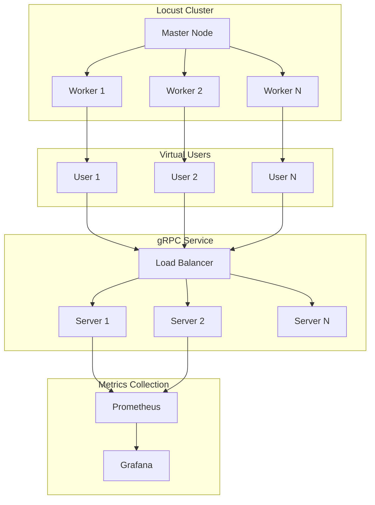
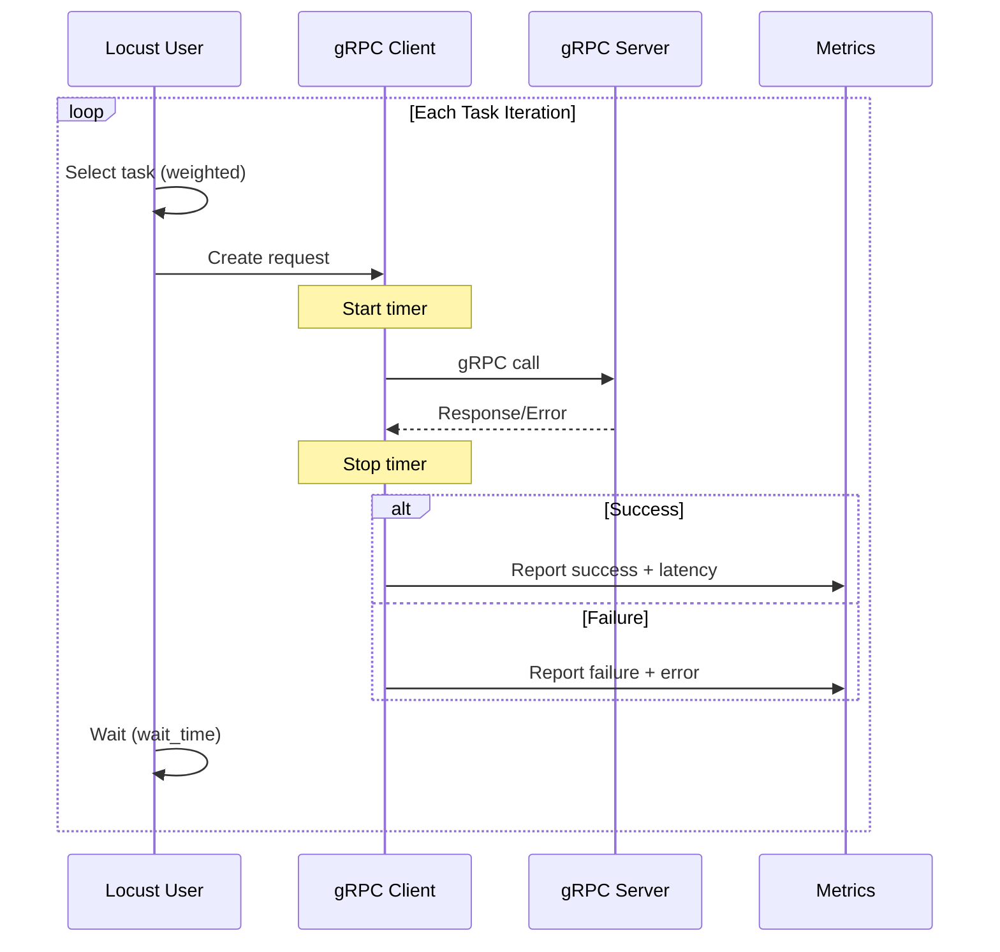

# How to Load Test gRPC Services with Locust

Author: [nawazdhandala](https://www.github.com/nawazdhandala)

Tags: gRPC, load-testing, locust, performance, python, distributed-testing, metrics

Description: Learn how to load test gRPC services using Locust with custom gRPC clients, test scenarios, distributed testing, and CI integration.

---

Load testing gRPC services is essential for understanding performance characteristics and identifying bottlenecks. Locust is a powerful, Python-based load testing tool that can be extended to test gRPC services. This guide covers everything from basic setup to advanced distributed testing scenarios.

## Understanding gRPC Load Testing Architecture



## Setting Up Locust for gRPC

### Project Structure

```
load-tests/
├── proto/
│   └── user.proto
├── pb/
│   ├── user_pb2.py
│   └── user_pb2_grpc.py
├── locustfiles/
│   ├── __init__.py
│   ├── grpc_client.py
│   ├── user_service_test.py
│   └── scenarios/
│       ├── __init__.py
│       ├── basic_load.py
│       ├── stress_test.py
│       └── spike_test.py
├── requirements.txt
├── docker-compose.yml
└── Makefile
```

### Requirements

```txt
# requirements.txt
locust>=2.15.0
grpcio>=1.50.0
grpcio-tools>=1.50.0
protobuf>=4.21.0
gevent>=22.10.0
prometheus-client>=0.15.0
```

### Generating Python gRPC Code

```bash
# Generate Python protobuf and gRPC files
python -m grpc_tools.protoc \
    -I./proto \
    --python_out=./pb \
    --grpc_python_out=./pb \
    ./proto/user.proto
```

## Creating a gRPC Client for Locust

### Base gRPC Client

```python
# locustfiles/grpc_client.py
import time
import grpc
from typing import Callable, Any, Optional
from locust import events
from locust.exception import LocustError

class GrpcClient:
    """
    A gRPC client wrapper that integrates with Locust's event system
    for proper metrics collection.
    """

    def __init__(self, host: str, stub_class: type, **kwargs):
        """
        Initialize the gRPC client.

        Args:
            host: The gRPC server address (e.g., "localhost:50051")
            stub_class: The gRPC stub class generated from proto
            **kwargs: Additional options for channel creation
        """
        self.host = host
        self.stub_class = stub_class
        self._channel: Optional[grpc.Channel] = None
        self._stub = None
        self._channel_options = kwargs.get('options', [])
        self._credentials = kwargs.get('credentials')

    def connect(self):
        """Establish connection to the gRPC server."""
        if self._credentials:
            self._channel = grpc.secure_channel(
                self.host,
                self._credentials,
                options=self._channel_options
            )
        else:
            self._channel = grpc.insecure_channel(
                self.host,
                options=self._channel_options
            )
        self._stub = self.stub_class(self._channel)

    def close(self):
        """Close the gRPC channel."""
        if self._channel:
            self._channel.close()

    @property
    def stub(self):
        """Get the gRPC stub."""
        if self._stub is None:
            raise LocustError("Client not connected. Call connect() first.")
        return self._stub

    def call(
        self,
        method_name: str,
        request: Any,
        timeout: float = 30.0,
        metadata: Optional[list] = None
    ) -> Any:
        """
        Make a gRPC call and report metrics to Locust.

        Args:
            method_name: Name of the RPC method
            request: The request protobuf message
            timeout: Request timeout in seconds
            metadata: Optional gRPC metadata

        Returns:
            The response from the gRPC server
        """
        start_time = time.perf_counter()
        exception = None
        response = None
        response_length = 0

        try:
            method = getattr(self.stub, method_name)
            response = method(
                request,
                timeout=timeout,
                metadata=metadata or []
            )
            response_length = response.ByteSize() if hasattr(response, 'ByteSize') else 0

        except grpc.RpcError as e:
            exception = e

        except Exception as e:
            exception = e

        finally:
            total_time = (time.perf_counter() - start_time) * 1000  # Convert to ms

            if exception:
                events.request.fire(
                    request_type="grpc",
                    name=method_name,
                    response_time=total_time,
                    response_length=0,
                    exception=exception,
                    context={}
                )
            else:
                events.request.fire(
                    request_type="grpc",
                    name=method_name,
                    response_time=total_time,
                    response_length=response_length,
                    exception=None,
                    context={}
                )

        if exception:
            raise exception

        return response

    def call_stream(
        self,
        method_name: str,
        request: Any,
        timeout: float = 60.0,
        metadata: Optional[list] = None
    ):
        """
        Make a server streaming gRPC call.

        Args:
            method_name: Name of the streaming RPC method
            request: The request protobuf message
            timeout: Request timeout in seconds
            metadata: Optional gRPC metadata

        Yields:
            Response messages from the stream
        """
        start_time = time.perf_counter()
        exception = None
        response_count = 0
        total_bytes = 0

        try:
            method = getattr(self.stub, method_name)
            stream = method(
                request,
                timeout=timeout,
                metadata=metadata or []
            )

            for response in stream:
                response_count += 1
                total_bytes += response.ByteSize() if hasattr(response, 'ByteSize') else 0
                yield response

        except grpc.RpcError as e:
            exception = e

        except Exception as e:
            exception = e

        finally:
            total_time = (time.perf_counter() - start_time) * 1000

            if exception:
                events.request.fire(
                    request_type="grpc-stream",
                    name=method_name,
                    response_time=total_time,
                    response_length=0,
                    exception=exception,
                    context={"response_count": response_count}
                )
            else:
                events.request.fire(
                    request_type="grpc-stream",
                    name=method_name,
                    response_time=total_time,
                    response_length=total_bytes,
                    exception=None,
                    context={"response_count": response_count}
                )

        if exception:
            raise exception


class GrpcUser:
    """
    Base class for Locust users that test gRPC services.
    Provides connection management and client access.
    """

    abstract = True
    host = ""
    stub_class = None
    channel_options = []

    def __init__(self, *args, **kwargs):
        super().__init__(*args, **kwargs)
        self._grpc_client: Optional[GrpcClient] = None

    @property
    def grpc_client(self) -> GrpcClient:
        """Get the gRPC client, creating it if necessary."""
        if self._grpc_client is None:
            self._grpc_client = GrpcClient(
                host=self.host,
                stub_class=self.stub_class,
                options=self.channel_options
            )
            self._grpc_client.connect()
        return self._grpc_client

    def on_stop(self):
        """Clean up when user stops."""
        if self._grpc_client:
            self._grpc_client.close()
```

## Writing Locust Test Files

### Basic User Service Test

```python
# locustfiles/user_service_test.py
import random
import string
import uuid
from locust import User, task, between, events
from grpc_client import GrpcClient

# Import generated protobuf classes
import sys
sys.path.append('./pb')
import user_pb2
import user_pb2_grpc


class UserServiceUser(User):
    """
    Locust user that tests the UserService gRPC endpoints.
    """

    # Wait between 1 and 3 seconds between tasks
    wait_time = between(1, 3)

    # Default host - can be overridden via command line
    host = "localhost:50051"

    def __init__(self, *args, **kwargs):
        super().__init__(*args, **kwargs)
        self.client = None
        self.created_user_ids = []

    def on_start(self):
        """Called when a simulated user starts."""
        self.client = GrpcClient(
            host=self.host,
            stub_class=user_pb2_grpc.UserServiceStub
        )
        self.client.connect()

    def on_stop(self):
        """Called when a simulated user stops."""
        if self.client:
            self.client.close()

    def _generate_email(self) -> str:
        """Generate a random email address."""
        random_str = ''.join(random.choices(string.ascii_lowercase, k=8))
        return f"user_{random_str}@example.com"

    def _generate_name(self) -> str:
        """Generate a random user name."""
        first_names = ["John", "Jane", "Alice", "Bob", "Charlie", "Diana"]
        last_names = ["Smith", "Johnson", "Williams", "Brown", "Jones", "Davis"]
        return f"{random.choice(first_names)} {random.choice(last_names)}"

    @task(3)
    def create_user(self):
        """
        Test creating a new user.
        Higher weight (3) means this task runs more frequently.
        """
        request = user_pb2.CreateUserRequest(
            name=self._generate_name(),
            email=self._generate_email()
        )

        try:
            response = self.client.call("CreateUser", request)
            self.created_user_ids.append(response.user.id)
            # Keep only last 100 user IDs to avoid memory issues
            if len(self.created_user_ids) > 100:
                self.created_user_ids = self.created_user_ids[-100:]
        except Exception as e:
            # Error is already reported to Locust
            pass

    @task(5)
    def get_user(self):
        """
        Test getting a user by ID.
        Higher weight (5) means this is the most common operation.
        """
        if not self.created_user_ids:
            # Create a user first if none exist
            self.create_user()
            return

        user_id = random.choice(self.created_user_ids)
        request = user_pb2.GetUserRequest(id=user_id)

        try:
            self.client.call("GetUser", request)
        except Exception as e:
            pass

    @task(1)
    def get_nonexistent_user(self):
        """
        Test error handling by requesting a non-existent user.
        Lower weight (1) means this runs less frequently.
        """
        request = user_pb2.GetUserRequest(id=str(uuid.uuid4()))

        try:
            self.client.call("GetUser", request, timeout=5.0)
        except Exception as e:
            # This is expected to fail
            pass

    @task(2)
    def list_users(self):
        """Test listing users with streaming response."""
        request = user_pb2.ListUsersRequest(page_size=10)

        try:
            users = list(self.client.call_stream("ListUsers", request))
        except Exception as e:
            pass


class AdminUser(User):
    """
    Simulates admin operations with different behavior.
    """

    wait_time = between(5, 10)
    host = "localhost:50051"
    weight = 1  # Less common than regular users

    def __init__(self, *args, **kwargs):
        super().__init__(*args, **kwargs)
        self.client = None

    def on_start(self):
        self.client = GrpcClient(
            host=self.host,
            stub_class=user_pb2_grpc.UserServiceStub
        )
        self.client.connect()

    def on_stop(self):
        if self.client:
            self.client.close()

    @task
    def batch_create_users(self):
        """Test batch user creation (client streaming)."""
        # This would require a client streaming implementation
        pass

    @task
    def list_all_users(self):
        """List all users with large page size."""
        request = user_pb2.ListUsersRequest(page_size=100)

        try:
            users = list(self.client.call_stream("ListUsers", request))
        except Exception as e:
            pass
```

## Advanced Test Scenarios

### Stress Test

```python
# locustfiles/scenarios/stress_test.py
from locust import User, task, constant_throughput, events
from locust.runners import MasterRunner, WorkerRunner
import time

import sys
sys.path.append('./pb')
import user_pb2
import user_pb2_grpc

from grpc_client import GrpcClient


class StressTestUser(User):
    """
    Stress test user that maintains constant throughput.
    """

    # Target 10 requests per second per user
    wait_time = constant_throughput(10)

    host = "localhost:50051"

    def __init__(self, *args, **kwargs):
        super().__init__(*args, **kwargs)
        self.client = None
        self.request_count = 0

    def on_start(self):
        self.client = GrpcClient(
            host=self.host,
            stub_class=user_pb2_grpc.UserServiceStub,
            options=[
                ('grpc.keepalive_time_ms', 10000),
                ('grpc.keepalive_timeout_ms', 5000),
                ('grpc.keepalive_permit_without_calls', True),
                ('grpc.http2.max_pings_without_data', 0),
            ]
        )
        self.client.connect()

    def on_stop(self):
        if self.client:
            self.client.close()

    @task
    def rapid_get_user(self):
        """Rapid fire get user requests."""
        self.request_count += 1
        request = user_pb2.GetUserRequest(
            id=f"stress-user-{self.request_count % 1000}"
        )

        try:
            self.client.call("GetUser", request, timeout=5.0)
        except Exception:
            pass


class RampUpStressTest(User):
    """
    User that increases request rate over time.
    """

    host = "localhost:50051"

    def __init__(self, *args, **kwargs):
        super().__init__(*args, **kwargs)
        self.client = None
        self.start_time = time.time()

    def wait_time(self):
        """Dynamic wait time that decreases over time."""
        elapsed = time.time() - self.start_time
        # Start with 1 second wait, decrease to 0.1 over 5 minutes
        wait = max(0.1, 1.0 - (elapsed / 300) * 0.9)
        return wait

    def on_start(self):
        self.client = GrpcClient(
            host=self.host,
            stub_class=user_pb2_grpc.UserServiceStub
        )
        self.client.connect()
        self.start_time = time.time()

    def on_stop(self):
        if self.client:
            self.client.close()

    @task
    def escalating_load(self):
        request = user_pb2.GetUserRequest(id="ramp-test-user")
        try:
            self.client.call("GetUser", request, timeout=10.0)
        except Exception:
            pass
```

### Spike Test

```python
# locustfiles/scenarios/spike_test.py
from locust import User, task, between, events, LoadTestShape
import random

import sys
sys.path.append('./pb')
import user_pb2
import user_pb2_grpc

from grpc_client import GrpcClient


class SpikeTestUser(User):
    """User for spike testing."""

    wait_time = between(0.1, 0.5)
    host = "localhost:50051"

    def __init__(self, *args, **kwargs):
        super().__init__(*args, **kwargs)
        self.client = None

    def on_start(self):
        self.client = GrpcClient(
            host=self.host,
            stub_class=user_pb2_grpc.UserServiceStub
        )
        self.client.connect()

    def on_stop(self):
        if self.client:
            self.client.close()

    @task
    def spike_request(self):
        request = user_pb2.GetUserRequest(id=f"spike-user-{random.randint(1, 1000)}")
        try:
            self.client.call("GetUser", request, timeout=30.0)
        except Exception:
            pass


class SpikeLoadShape(LoadTestShape):
    """
    A load shape that creates spikes in traffic.

    Pattern:
    - 0-60s: Ramp up to 100 users
    - 60-120s: Maintain 100 users (baseline)
    - 120-150s: Spike to 500 users
    - 150-210s: Return to 100 users (recovery)
    - 210-240s: Spike to 1000 users
    - 240-300s: Return to 100 users
    - After 300s: Ramp down
    """

    stages = [
        {"duration": 60, "users": 100, "spawn_rate": 10},
        {"duration": 60, "users": 100, "spawn_rate": 10},
        {"duration": 30, "users": 500, "spawn_rate": 50},
        {"duration": 60, "users": 100, "spawn_rate": 10},
        {"duration": 30, "users": 1000, "spawn_rate": 100},
        {"duration": 60, "users": 100, "spawn_rate": 10},
        {"duration": 60, "users": 0, "spawn_rate": 10},
    ]

    def tick(self):
        run_time = self.get_run_time()

        current_time = 0
        for stage in self.stages:
            current_time += stage["duration"]
            if run_time < current_time:
                return (stage["users"], stage["spawn_rate"])

        return None  # Stop the test
```

### Endurance Test

```python
# locustfiles/scenarios/endurance_test.py
from locust import User, task, between, events
import random
import gc
import sys

sys.path.append('./pb')
import user_pb2
import user_pb2_grpc

from grpc_client import GrpcClient


class EnduranceTestUser(User):
    """
    User for long-running endurance tests.
    Designed to run for hours to detect memory leaks and degradation.
    """

    wait_time = between(1, 5)
    host = "localhost:50051"

    def __init__(self, *args, **kwargs):
        super().__init__(*args, **kwargs)
        self.client = None
        self.iteration = 0
        self.reconnect_interval = 1000  # Reconnect every 1000 requests

    def on_start(self):
        self._connect()

    def _connect(self):
        if self.client:
            self.client.close()
        self.client = GrpcClient(
            host=self.host,
            stub_class=user_pb2_grpc.UserServiceStub,
            options=[
                ('grpc.keepalive_time_ms', 30000),
                ('grpc.keepalive_timeout_ms', 10000),
            ]
        )
        self.client.connect()

    def on_stop(self):
        if self.client:
            self.client.close()

    @task(5)
    def get_user(self):
        self.iteration += 1

        # Periodic reconnection to simulate real-world behavior
        if self.iteration % self.reconnect_interval == 0:
            self._connect()
            gc.collect()  # Force garbage collection

        request = user_pb2.GetUserRequest(
            id=f"endurance-user-{random.randint(1, 10000)}"
        )

        try:
            self.client.call("GetUser", request, timeout=10.0)
        except Exception:
            pass

    @task(2)
    def create_user(self):
        request = user_pb2.CreateUserRequest(
            name=f"Endurance User {self.iteration}",
            email=f"endurance_{self.iteration}_{random.randint(1, 1000000)}@test.com"
        )

        try:
            self.client.call("CreateUser", request, timeout=10.0)
        except Exception:
            pass

    @task(1)
    def list_users(self):
        request = user_pb2.ListUsersRequest(page_size=50)

        try:
            list(self.client.call_stream("ListUsers", request, timeout=30.0))
        except Exception:
            pass
```

## Distributed Testing Setup

### Docker Compose for Distributed Testing

```yaml
# docker-compose.yml
version: '3.8'

services:
  master:
    build:
      context: .
      dockerfile: Dockerfile.locust
    ports:
      - "8089:8089"
    environment:
      - LOCUST_MODE=master
      - LOCUST_HOST=grpc-service:50051
    command: >
      locust -f /app/locustfiles/user_service_test.py
      --master
      --host=grpc-service:50051
    networks:
      - load-test

  worker:
    build:
      context: .
      dockerfile: Dockerfile.locust
    environment:
      - LOCUST_MODE=worker
      - LOCUST_MASTER_HOST=master
    command: >
      locust -f /app/locustfiles/user_service_test.py
      --worker
      --master-host=master
    depends_on:
      - master
    deploy:
      replicas: 4
    networks:
      - load-test

  grpc-service:
    image: your-grpc-service:latest
    ports:
      - "50051:50051"
    networks:
      - load-test

  prometheus:
    image: prom/prometheus:latest
    ports:
      - "9090:9090"
    volumes:
      - ./prometheus.yml:/etc/prometheus/prometheus.yml
    networks:
      - load-test

  grafana:
    image: grafana/grafana:latest
    ports:
      - "3000:3000"
    environment:
      - GF_SECURITY_ADMIN_PASSWORD=admin
    volumes:
      - ./grafana/dashboards:/var/lib/grafana/dashboards
      - ./grafana/provisioning:/etc/grafana/provisioning
    depends_on:
      - prometheus
    networks:
      - load-test

networks:
  load-test:
    driver: bridge
```

### Locust Dockerfile

```dockerfile
# Dockerfile.locust
FROM python:3.11-slim

WORKDIR /app

# Install dependencies
COPY requirements.txt .
RUN pip install --no-cache-dir -r requirements.txt

# Copy proto files and generate Python code
COPY proto/ ./proto/
RUN mkdir -p pb && \
    python -m grpc_tools.protoc \
    -I./proto \
    --python_out=./pb \
    --grpc_python_out=./pb \
    ./proto/*.proto

# Copy test files
COPY locustfiles/ ./locustfiles/

# Set Python path
ENV PYTHONPATH=/app

EXPOSE 8089 5557

CMD ["locust"]
```

## Metrics Collection and Reporting

### Custom Metrics Reporter

```python
# locustfiles/metrics_reporter.py
import time
import threading
from prometheus_client import Counter, Histogram, Gauge, start_http_server
from locust import events
from locust.runners import MasterRunner, WorkerRunner


# Prometheus metrics
GRPC_REQUESTS_TOTAL = Counter(
    'grpc_requests_total',
    'Total gRPC requests',
    ['method', 'status']
)

GRPC_REQUEST_DURATION = Histogram(
    'grpc_request_duration_seconds',
    'gRPC request duration',
    ['method'],
    buckets=[0.001, 0.005, 0.01, 0.025, 0.05, 0.1, 0.25, 0.5, 1.0, 2.5, 5.0, 10.0]
)

GRPC_ACTIVE_USERS = Gauge(
    'grpc_active_users',
    'Number of active users'
)

GRPC_REQUESTS_PER_SECOND = Gauge(
    'grpc_requests_per_second',
    'Current requests per second'
)


class MetricsCollector:
    """Collects and exports Locust metrics to Prometheus."""

    def __init__(self, port: int = 9100):
        self.port = port
        self._last_request_count = 0
        self._last_time = time.time()

    def start(self):
        """Start the Prometheus HTTP server."""
        start_http_server(self.port)
        self._start_rps_calculator()

    def _start_rps_calculator(self):
        """Calculate RPS periodically."""
        def calculate_rps():
            while True:
                time.sleep(1)
                current_count = GRPC_REQUESTS_TOTAL._value.sum()
                current_time = time.time()
                rps = (current_count - self._last_request_count) / (current_time - self._last_time)
                GRPC_REQUESTS_PER_SECOND.set(rps)
                self._last_request_count = current_count
                self._last_time = current_time

        thread = threading.Thread(target=calculate_rps, daemon=True)
        thread.start()


# Event handlers
@events.request.add_listener
def on_request(request_type, name, response_time, response_length, exception, **kwargs):
    """Handle request events and update metrics."""
    status = "success" if exception is None else "failure"

    GRPC_REQUESTS_TOTAL.labels(method=name, status=status).inc()
    GRPC_REQUEST_DURATION.labels(method=name).observe(response_time / 1000)


@events.spawning_complete.add_listener
def on_spawning_complete(user_count, **kwargs):
    """Update active users gauge when spawning completes."""
    GRPC_ACTIVE_USERS.set(user_count)


@events.init.add_listener
def on_locust_init(environment, **kwargs):
    """Initialize metrics collection when Locust starts."""
    if isinstance(environment.runner, MasterRunner):
        collector = MetricsCollector(port=9100)
        collector.start()
```

### Prometheus Configuration

```yaml
# prometheus.yml
global:
  scrape_interval: 5s
  evaluation_interval: 5s

scrape_configs:
  - job_name: 'locust'
    static_configs:
      - targets: ['master:9100']

  - job_name: 'grpc-service'
    static_configs:
      - targets: ['grpc-service:9090']
```

## CI Integration

### GitHub Actions Workflow

```yaml
# .github/workflows/load-test.yml
name: Load Tests

on:
  workflow_dispatch:
    inputs:
      users:
        description: 'Number of users'
        required: true
        default: '100'
      spawn_rate:
        description: 'Spawn rate'
        required: true
        default: '10'
      duration:
        description: 'Test duration (e.g., 5m, 1h)'
        required: true
        default: '5m'

jobs:
  load-test:
    runs-on: ubuntu-latest

    services:
      grpc-service:
        image: your-registry/grpc-service:latest
        ports:
          - 50051:50051

    steps:
      - uses: actions/checkout@v4

      - name: Set up Python
        uses: actions/setup-python@v5
        with:
          python-version: '3.11'

      - name: Install dependencies
        run: |
          pip install -r load-tests/requirements.txt

      - name: Generate protobuf files
        run: |
          cd load-tests
          mkdir -p pb
          python -m grpc_tools.protoc \
            -I./proto \
            --python_out=./pb \
            --grpc_python_out=./pb \
            ./proto/*.proto

      - name: Run load test
        run: |
          cd load-tests
          locust -f locustfiles/user_service_test.py \
            --headless \
            --users ${{ github.event.inputs.users }} \
            --spawn-rate ${{ github.event.inputs.spawn_rate }} \
            --run-time ${{ github.event.inputs.duration }} \
            --host localhost:50051 \
            --html report.html \
            --csv results

      - name: Upload results
        uses: actions/upload-artifact@v4
        with:
          name: load-test-results
          path: |
            load-tests/report.html
            load-tests/results_*.csv

      - name: Check performance thresholds
        run: |
          python load-tests/check_thresholds.py \
            --csv load-tests/results_stats.csv \
            --max-p95 500 \
            --max-failure-rate 0.01
```

### Performance Threshold Checker

```python
# load-tests/check_thresholds.py
#!/usr/bin/env python3
import argparse
import csv
import sys


def check_thresholds(csv_file: str, max_p95: float, max_failure_rate: float) -> bool:
    """
    Check if load test results meet performance thresholds.

    Args:
        csv_file: Path to Locust stats CSV file
        max_p95: Maximum acceptable P95 response time (ms)
        max_failure_rate: Maximum acceptable failure rate (0-1)

    Returns:
        True if all thresholds are met, False otherwise
    """
    passed = True

    with open(csv_file, 'r') as f:
        reader = csv.DictReader(f)

        for row in reader:
            if row['Name'] == 'Aggregated':
                # Check P95 response time
                p95 = float(row['95%'])
                if p95 > max_p95:
                    print(f"FAIL: P95 response time ({p95}ms) exceeds threshold ({max_p95}ms)")
                    passed = False
                else:
                    print(f"PASS: P95 response time ({p95}ms) within threshold ({max_p95}ms)")

                # Check failure rate
                total = int(row['Request Count'])
                failures = int(row['Failure Count'])
                failure_rate = failures / total if total > 0 else 0

                if failure_rate > max_failure_rate:
                    print(f"FAIL: Failure rate ({failure_rate:.2%}) exceeds threshold ({max_failure_rate:.2%})")
                    passed = False
                else:
                    print(f"PASS: Failure rate ({failure_rate:.2%}) within threshold ({max_failure_rate:.2%})")

                # Print summary
                print(f"\nSummary:")
                print(f"  Total Requests: {total}")
                print(f"  Failed Requests: {failures}")
                print(f"  Avg Response Time: {row['Average Response Time']}ms")
                print(f"  P50 Response Time: {row['50%']}ms")
                print(f"  P95 Response Time: {row['95%']}ms")
                print(f"  P99 Response Time: {row['99%']}ms")
                print(f"  RPS: {row['Requests/s']}")

                break

    return passed


def main():
    parser = argparse.ArgumentParser(description='Check load test performance thresholds')
    parser.add_argument('--csv', required=True, help='Path to Locust stats CSV file')
    parser.add_argument('--max-p95', type=float, default=500, help='Maximum P95 response time (ms)')
    parser.add_argument('--max-failure-rate', type=float, default=0.01, help='Maximum failure rate (0-1)')

    args = parser.parse_args()

    if check_thresholds(args.csv, args.max_p95, args.max_failure_rate):
        print("\nAll performance thresholds met!")
        sys.exit(0)
    else:
        print("\nPerformance thresholds not met!")
        sys.exit(1)


if __name__ == '__main__':
    main()
```

## Running Load Tests

### Command Line Usage

```bash
# Run basic load test
locust -f locustfiles/user_service_test.py \
    --host localhost:50051 \
    --users 100 \
    --spawn-rate 10 \
    --run-time 5m

# Run headless with HTML report
locust -f locustfiles/user_service_test.py \
    --host localhost:50051 \
    --users 500 \
    --spawn-rate 50 \
    --run-time 10m \
    --headless \
    --html report.html \
    --csv results

# Run distributed test
# Master
locust -f locustfiles/user_service_test.py \
    --master \
    --host localhost:50051

# Workers (run multiple times)
locust -f locustfiles/user_service_test.py \
    --worker \
    --master-host localhost

# Run with specific load shape
locust -f locustfiles/scenarios/spike_test.py \
    --host localhost:50051 \
    --headless \
    --html spike_report.html
```

### Makefile for Common Tasks

```makefile
# Makefile
.PHONY: proto test-local test-distributed clean

PROTO_DIR=proto
PB_DIR=pb

proto:
	mkdir -p $(PB_DIR)
	python -m grpc_tools.protoc \
		-I$(PROTO_DIR) \
		--python_out=$(PB_DIR) \
		--grpc_python_out=$(PB_DIR) \
		$(PROTO_DIR)/*.proto

test-local:
	locust -f locustfiles/user_service_test.py \
		--host localhost:50051 \
		--users 100 \
		--spawn-rate 10 \
		--run-time 5m \
		--html report.html

test-distributed:
	docker-compose up --scale worker=4

test-stress:
	locust -f locustfiles/scenarios/stress_test.py \
		--host localhost:50051 \
		--users 500 \
		--spawn-rate 100 \
		--run-time 10m \
		--headless \
		--html stress_report.html

test-spike:
	locust -f locustfiles/scenarios/spike_test.py \
		--host localhost:50051 \
		--headless \
		--html spike_report.html

clean:
	rm -rf $(PB_DIR)
	rm -f *.html
	rm -f results_*.csv
	docker-compose down
```

## Load Test Flow Diagram



## Best Practices

1. **Connection Pooling**: Reuse gRPC connections to avoid connection overhead in measurements.

2. **Realistic Wait Times**: Use realistic wait times between requests to simulate actual user behavior.

3. **Weighted Tasks**: Assign weights to tasks based on expected real-world usage patterns.

4. **Error Handling**: Properly handle and report gRPC errors without crashing users.

5. **Resource Cleanup**: Always close connections in `on_stop` to prevent resource leaks.

6. **Distributed Testing**: Use multiple workers for high-load scenarios.

7. **Monitoring**: Integrate with Prometheus/Grafana for real-time monitoring.

8. **Threshold Checking**: Automate performance threshold validation in CI.

## Conclusion

Load testing gRPC services with Locust provides valuable insights into performance characteristics. By creating custom gRPC clients, designing realistic test scenarios, and integrating with CI pipelines, you can ensure your gRPC services meet performance requirements before production deployment. The distributed testing capabilities of Locust make it suitable for testing services under extreme load conditions.
