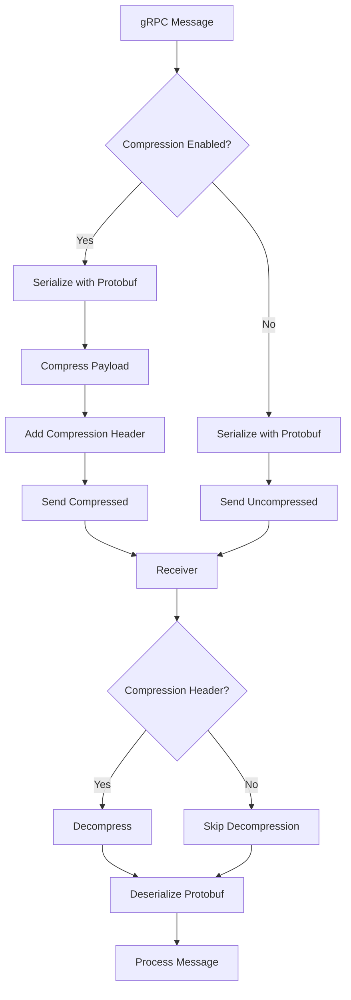
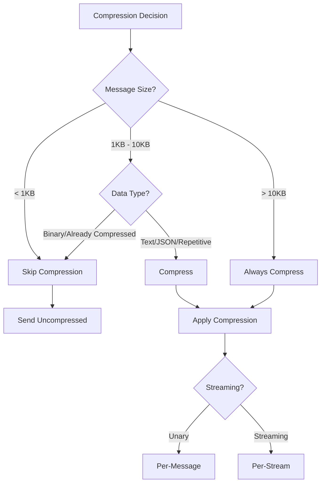

# How to Compress gRPC Messages for Reduced Bandwidth

Author: [nawazdhandala](https://www.github.com/nawazdhandala)

Tags: gRPC, compression, gzip, snappy, performance, bandwidth, optimization, protobuf

Description: Master gRPC message compression techniques using gzip, deflate, and snappy to reduce bandwidth consumption and improve network performance.

---

## Introduction

Message compression is a powerful optimization technique that can significantly reduce bandwidth usage in gRPC applications. While Protocol Buffers already provide compact serialization, adding compression can further reduce message sizes by 60-90%, especially for repetitive or text-heavy data.

This guide covers everything you need to know about implementing compression in gRPC, from basic configuration to advanced per-message control and custom compressor implementations.

## Understanding gRPC Compression

gRPC supports compression at multiple levels, and understanding how they interact is crucial for optimal configuration.



### Compression Flow

1. **Client sends request** with compression encoding
2. **Server decompresses** the request if compressed
3. **Server processes** the request
4. **Server compresses** the response (if client accepts)
5. **Client decompresses** the response

## Built-in Compression Algorithms

gRPC supports several compression algorithms out of the box:

| Algorithm | Compression Ratio | CPU Usage | Best For |
|-----------|------------------|-----------|----------|
| gzip | High (70-90%) | High | Text, JSON, repetitive data |
| deflate | High (70-90%) | High | Similar to gzip |
| snappy | Medium (50-70%) | Low | Real-time, low latency |
| zstd | Very High (75-95%) | Medium | Large payloads |

## Server-Side Compression Configuration

### Go Server Implementation

```go
package main

import (
    "context"
    "log"
    "net"

    "google.golang.org/grpc"
    "google.golang.org/grpc/encoding/gzip"
    _ "google.golang.org/grpc/encoding/gzip" // Register gzip compressor

    pb "myapp/proto"
)

// Server implements the gRPC service
type Server struct {
    pb.UnimplementedMyServiceServer
}

func (s *Server) GetData(ctx context.Context, req *pb.DataRequest) (*pb.DataResponse, error) {
    // Process request
    data := generateLargeResponse()

    return &pb.DataResponse{
        Data: data,
    }, nil
}

func main() {
    lis, err := net.Listen("tcp", ":50051")
    if err != nil {
        log.Fatalf("Failed to listen: %v", err)
    }

    // Server options for compression
    opts := []grpc.ServerOption{
        // Set default compressor for all responses
        grpc.RPCCompressor(grpc.NewGZIPCompressor()),
        grpc.RPCDecompressor(grpc.NewGZIPDecompressor()),

        // Alternative: Use encoding package (recommended)
        // This is automatically registered by importing gzip package
    }

    server := grpc.NewServer(opts...)
    pb.RegisterMyServiceServer(server, &Server{})

    log.Printf("Server listening on :50051 with gzip compression")
    if err := server.Serve(lis); err != nil {
        log.Fatalf("Failed to serve: %v", err)
    }
}
```

### Python Server Implementation

```python
import grpc
from concurrent import futures
import my_service_pb2
import my_service_pb2_grpc


class MyServiceServicer(my_service_pb2_grpc.MyServiceServicer):
    def GetData(self, request, context):
        # Set compression for this response
        context.set_compression(grpc.Compression.Gzip)

        data = self._generate_large_response()
        return my_service_pb2.DataResponse(data=data)

    def _generate_large_response(self):
        return b"x" * 10000  # Example large data


def serve():
    # Server with default compression
    server = grpc.server(
        futures.ThreadPoolExecutor(max_workers=10),
        compression=grpc.Compression.Gzip,  # Default compression
        options=[
            ('grpc.max_send_message_length', 50 * 1024 * 1024),
            ('grpc.max_receive_message_length', 50 * 1024 * 1024),
        ]
    )

    my_service_pb2_grpc.add_MyServiceServicer_to_server(
        MyServiceServicer(), server
    )

    server.add_insecure_port('[::]:50051')
    server.start()
    print("Server started with gzip compression on port 50051")
    server.wait_for_termination()


if __name__ == '__main__':
    serve()
```

### Java Server Implementation

```java
package com.example.grpc;

import io.grpc.Server;
import io.grpc.ServerBuilder;
import io.grpc.ServerInterceptor;
import io.grpc.ServerCall;
import io.grpc.ServerCallHandler;
import io.grpc.Metadata;
import io.grpc.Status;

public class CompressionServer {

    private Server server;

    private void start() throws Exception {
        int port = 50051;

        server = ServerBuilder.forPort(port)
            .addService(new MyServiceImpl())
            .compressorRegistry(CompressorRegistry.getDefaultInstance())
            .decompressorRegistry(DecompressorRegistry.getDefaultInstance())
            .intercept(new CompressionInterceptor())
            .build()
            .start();

        System.out.println("Server started with compression on port " + port);

        Runtime.getRuntime().addShutdownHook(new Thread(() -> {
            System.out.println("Shutting down server");
            CompressionServer.this.stop();
        }));
    }

    private void stop() {
        if (server != null) {
            server.shutdown();
        }
    }

    // Interceptor to set compression per-call
    private static class CompressionInterceptor implements ServerInterceptor {
        @Override
        public <ReqT, RespT> ServerCall.Listener<ReqT> interceptCall(
                ServerCall<ReqT, RespT> call,
                Metadata headers,
                ServerCallHandler<ReqT, RespT> next) {

            // Set gzip compression for response
            call.setCompression("gzip");

            return next.startCall(call, headers);
        }
    }

    public static void main(String[] args) throws Exception {
        final CompressionServer server = new CompressionServer();
        server.start();
        server.blockUntilShutdown();
    }

    private void blockUntilShutdown() throws InterruptedException {
        if (server != null) {
            server.awaitTermination();
        }
    }
}
```

## Client-Side Compression Configuration

### Go Client Implementation

```go
package main

import (
    "context"
    "log"
    "time"

    "google.golang.org/grpc"
    "google.golang.org/grpc/credentials/insecure"
    "google.golang.org/grpc/encoding/gzip"

    pb "myapp/proto"
)

func main() {
    // Connect with compression enabled
    conn, err := grpc.Dial(
        "localhost:50051",
        grpc.WithTransportCredentials(insecure.NewCredentials()),
        // Default compressor for all calls
        grpc.WithDefaultCallOptions(
            grpc.UseCompressor(gzip.Name),
        ),
    )
    if err != nil {
        log.Fatalf("Failed to connect: %v", err)
    }
    defer conn.Close()

    client := pb.NewMyServiceClient(conn)
    ctx, cancel := context.WithTimeout(context.Background(), 10*time.Second)
    defer cancel()

    // Method 1: Use default compression (set above)
    resp, err := client.GetData(ctx, &pb.DataRequest{
        Query: "large dataset",
    })
    if err != nil {
        log.Fatalf("RPC failed: %v", err)
    }
    log.Printf("Received %d bytes", len(resp.Data))

    // Method 2: Per-call compression override
    resp2, err := client.GetData(ctx, &pb.DataRequest{
        Query: "another query",
    }, grpc.UseCompressor(gzip.Name))
    if err != nil {
        log.Fatalf("RPC failed: %v", err)
    }
    log.Printf("Received %d bytes with explicit compression", len(resp2.Data))

    // Method 3: Disable compression for specific call
    resp3, err := client.GetData(ctx, &pb.DataRequest{
        Query: "small query",
    }, grpc.UseCompressor("identity")) // No compression
    if err != nil {
        log.Fatalf("RPC failed: %v", err)
    }
    log.Printf("Received %d bytes without compression", len(resp3.Data))
}
```

### Python Client Implementation

```python
import grpc
import my_service_pb2
import my_service_pb2_grpc


def main():
    # Channel with default compression
    channel = grpc.insecure_channel(
        'localhost:50051',
        compression=grpc.Compression.Gzip,
        options=[
            ('grpc.max_send_message_length', 50 * 1024 * 1024),
            ('grpc.max_receive_message_length', 50 * 1024 * 1024),
        ]
    )

    stub = my_service_pb2_grpc.MyServiceStub(channel)

    # Method 1: Use channel default compression
    response = stub.GetData(my_service_pb2.DataRequest(query="large dataset"))
    print(f"Received {len(response.data)} bytes")

    # Method 2: Per-call compression
    response = stub.GetData(
        my_service_pb2.DataRequest(query="another query"),
        compression=grpc.Compression.Gzip
    )
    print(f"Received {len(response.data)} bytes with explicit compression")

    # Method 3: Disable compression for specific call
    response = stub.GetData(
        my_service_pb2.DataRequest(query="small query"),
        compression=grpc.Compression.NoCompression
    )
    print(f"Received {len(response.data)} bytes without compression")

    channel.close()


if __name__ == '__main__':
    main()
```

### Java Client Implementation

```java
package com.example.grpc;

import io.grpc.ManagedChannel;
import io.grpc.ManagedChannelBuilder;
import io.grpc.CallOptions;
import io.grpc.ClientInterceptor;
import io.grpc.ClientCall;
import io.grpc.Channel;
import io.grpc.MethodDescriptor;

public class CompressionClient {

    private final ManagedChannel channel;
    private final MyServiceGrpc.MyServiceBlockingStub blockingStub;

    public CompressionClient(String host, int port) {
        channel = ManagedChannelBuilder.forAddress(host, port)
            .usePlaintext()
            .compressorRegistry(CompressorRegistry.getDefaultInstance())
            .decompressorRegistry(DecompressorRegistry.getDefaultInstance())
            .intercept(new CompressionClientInterceptor())
            .build();

        blockingStub = MyServiceGrpc.newBlockingStub(channel)
            .withCompression("gzip"); // Default compression
    }

    public void getData(String query) {
        DataRequest request = DataRequest.newBuilder()
            .setQuery(query)
            .build();

        // Use default compression
        DataResponse response = blockingStub.getData(request);
        System.out.println("Received " + response.getData().size() + " bytes");

        // Per-call compression
        DataResponse response2 = blockingStub
            .withCompression("gzip")
            .getData(request);
        System.out.println("Received " + response2.getData().size() + " bytes with gzip");

        // No compression
        DataResponse response3 = blockingStub
            .withCompression("identity")
            .getData(request);
        System.out.println("Received " + response3.getData().size() + " bytes uncompressed");
    }

    public void shutdown() throws InterruptedException {
        channel.shutdown().awaitTermination(5, TimeUnit.SECONDS);
    }

    // Interceptor for logging compression
    private static class CompressionClientInterceptor implements ClientInterceptor {
        @Override
        public <ReqT, RespT> ClientCall<ReqT, RespT> interceptCall(
                MethodDescriptor<ReqT, RespT> method,
                CallOptions callOptions,
                Channel next) {

            String compressor = callOptions.getCompressor();
            System.out.println("Using compressor: " +
                (compressor != null ? compressor : "none"));

            return next.newCall(method, callOptions);
        }
    }

    public static void main(String[] args) throws Exception {
        CompressionClient client = new CompressionClient("localhost", 50051);
        try {
            client.getData("large dataset");
        } finally {
            client.shutdown();
        }
    }
}
```

## Custom Compressor Implementation

For specialized needs, you can implement custom compressors:

### Go Custom Snappy Compressor

```go
package snappy

import (
    "io"
    "sync"

    "github.com/golang/snappy"
    "google.golang.org/grpc/encoding"
)

const Name = "snappy"

func init() {
    encoding.RegisterCompressor(&compressor{})
}

type compressor struct{}

func (c *compressor) Name() string {
    return Name
}

func (c *compressor) Compress(w io.Writer) (io.WriteCloser, error) {
    return &snappyWriteCloser{
        writer: snappy.NewBufferedWriter(w),
    }, nil
}

func (c *compressor) Decompress(r io.Reader) (io.Reader, error) {
    return snappy.NewReader(r), nil
}

type snappyWriteCloser struct {
    writer *snappy.Writer
}

func (w *snappyWriteCloser) Write(p []byte) (n int, err error) {
    return w.writer.Write(p)
}

func (w *snappyWriteCloser) Close() error {
    return w.writer.Close()
}

// PooledCompressor with buffer pooling for better performance
type pooledCompressor struct {
    writerPool sync.Pool
    readerPool sync.Pool
}

func NewPooledCompressor() encoding.Compressor {
    return &pooledCompressor{
        writerPool: sync.Pool{
            New: func() interface{} {
                return snappy.NewBufferedWriter(nil)
            },
        },
        readerPool: sync.Pool{
            New: func() interface{} {
                return snappy.NewReader(nil)
            },
        },
    }
}

func (c *pooledCompressor) Name() string {
    return Name + "-pooled"
}

func (c *pooledCompressor) Compress(w io.Writer) (io.WriteCloser, error) {
    writer := c.writerPool.Get().(*snappy.Writer)
    writer.Reset(w)
    return &pooledSnappyWriter{
        Writer: writer,
        pool:   &c.writerPool,
    }, nil
}

func (c *pooledCompressor) Decompress(r io.Reader) (io.Reader, error) {
    reader := c.readerPool.Get().(*snappy.Reader)
    reader.Reset(r)
    return &pooledSnappyReader{
        Reader: reader,
        pool:   &c.readerPool,
    }, nil
}

type pooledSnappyWriter struct {
    *snappy.Writer
    pool *sync.Pool
}

func (w *pooledSnappyWriter) Close() error {
    err := w.Writer.Close()
    w.pool.Put(w.Writer)
    return err
}

type pooledSnappyReader struct {
    *snappy.Reader
    pool *sync.Pool
}

func (r *pooledSnappyReader) Read(p []byte) (n int, err error) {
    n, err = r.Reader.Read(p)
    if err == io.EOF {
        r.pool.Put(r.Reader)
    }
    return
}
```

### Python Custom Compressor

```python
import grpc
import zstandard as zstd
from typing import Tuple


class ZstdCompressor:
    """Custom Zstandard compressor for gRPC."""

    def __init__(self, level: int = 3):
        self.level = level
        self._compressor = zstd.ZstdCompressor(level=level)
        self._decompressor = zstd.ZstdDecompressor()

    def compress(self, data: bytes) -> bytes:
        """Compress data using Zstandard."""
        return self._compressor.compress(data)

    def decompress(self, data: bytes) -> bytes:
        """Decompress data using Zstandard."""
        return self._decompressor.decompress(data)


class CompressionInterceptor(grpc.UnaryUnaryClientInterceptor):
    """Client interceptor for custom compression."""

    def __init__(self, compressor: ZstdCompressor):
        self.compressor = compressor

    def intercept_unary_unary(self, continuation, client_call_details, request):
        # Serialize and compress request
        serialized = request.SerializeToString()
        compressed = self.compressor.compress(serialized)

        # Add compression metadata
        metadata = list(client_call_details.metadata or [])
        metadata.append(('x-compression', 'zstd'))
        metadata.append(('x-original-size', str(len(serialized))))

        new_details = grpc.ClientCallDetails(
            method=client_call_details.method,
            timeout=client_call_details.timeout,
            metadata=metadata,
            credentials=client_call_details.credentials,
            wait_for_ready=client_call_details.wait_for_ready,
        )

        return continuation(new_details, request)


class CompressionServerInterceptor(grpc.ServerInterceptor):
    """Server interceptor for custom compression."""

    def __init__(self, compressor: ZstdCompressor):
        self.compressor = compressor

    def intercept_service(self, continuation, handler_call_details):
        # Check for compression header
        metadata = dict(handler_call_details.invocation_metadata)
        compression = metadata.get('x-compression')

        if compression == 'zstd':
            # Decompress request
            pass  # Handle in actual implementation

        return continuation(handler_call_details)


# Usage example
def create_compressed_channel(target: str) -> grpc.Channel:
    """Create a channel with custom compression."""
    compressor = ZstdCompressor(level=3)
    interceptor = CompressionInterceptor(compressor)

    channel = grpc.insecure_channel(target)
    return grpc.intercept_channel(channel, interceptor)
```

## Per-Message vs Per-Stream Compression

Understanding when to apply compression:



### Adaptive Compression Implementation

```go
package adaptive

import (
    "context"

    "google.golang.org/grpc"
    "google.golang.org/grpc/encoding/gzip"
)

// AdaptiveCompressor decides whether to compress based on message size
type AdaptiveCompressor struct {
    minSizeForCompression int
    compressor            string
}

// NewAdaptiveCompressor creates a new adaptive compressor
func NewAdaptiveCompressor(minSize int) *AdaptiveCompressor {
    return &AdaptiveCompressor{
        minSizeForCompression: minSize,
        compressor:            gzip.Name,
    }
}

// UnaryClientInterceptor returns an interceptor for adaptive compression
func (a *AdaptiveCompressor) UnaryClientInterceptor() grpc.UnaryClientInterceptor {
    return func(
        ctx context.Context,
        method string,
        req, reply interface{},
        cc *grpc.ClientConn,
        invoker grpc.UnaryInvoker,
        opts ...grpc.CallOption,
    ) error {
        // Estimate message size (simplified)
        size := estimateSize(req)

        if size >= a.minSizeForCompression {
            opts = append(opts, grpc.UseCompressor(a.compressor))
        } else {
            opts = append(opts, grpc.UseCompressor("identity"))
        }

        return invoker(ctx, method, req, reply, cc, opts...)
    }
}

// StreamClientInterceptor returns an interceptor for streaming calls
func (a *AdaptiveCompressor) StreamClientInterceptor() grpc.StreamClientInterceptor {
    return func(
        ctx context.Context,
        desc *grpc.StreamDesc,
        cc *grpc.ClientConn,
        method string,
        streamer grpc.Streamer,
        opts ...grpc.CallOption,
    ) (grpc.ClientStream, error) {
        // For streaming, use compression by default
        opts = append(opts, grpc.UseCompressor(a.compressor))
        return streamer(ctx, desc, cc, method, opts...)
    }
}

func estimateSize(msg interface{}) int {
    // Simplified size estimation
    // In production, use proto.Size() for protobuf messages
    return 1000 // Placeholder
}

// Usage
func main() {
    adaptive := NewAdaptiveCompressor(1024) // Compress if > 1KB

    conn, err := grpc.Dial(
        "localhost:50051",
        grpc.WithInsecure(),
        grpc.WithUnaryInterceptor(adaptive.UnaryClientInterceptor()),
        grpc.WithStreamInterceptor(adaptive.StreamClientInterceptor()),
    )
    if err != nil {
        log.Fatal(err)
    }
    defer conn.Close()
}
```

## Compression Performance Benchmarks

Here's a benchmark comparing different compression algorithms:

```go
package compression_test

import (
    "bytes"
    "compress/gzip"
    "testing"

    "github.com/golang/snappy"
    "github.com/klauspost/compress/zstd"
)

var testData = bytes.Repeat([]byte("Hello, gRPC compression! "), 10000)

func BenchmarkGzipCompress(b *testing.B) {
    b.SetBytes(int64(len(testData)))
    for i := 0; i < b.N; i++ {
        var buf bytes.Buffer
        w := gzip.NewWriter(&buf)
        w.Write(testData)
        w.Close()
    }
}

func BenchmarkSnappyCompress(b *testing.B) {
    b.SetBytes(int64(len(testData)))
    for i := 0; i < b.N; i++ {
        snappy.Encode(nil, testData)
    }
}

func BenchmarkZstdCompress(b *testing.B) {
    encoder, _ := zstd.NewWriter(nil)
    b.SetBytes(int64(len(testData)))
    b.ResetTimer()
    for i := 0; i < b.N; i++ {
        encoder.EncodeAll(testData, nil)
    }
}

func BenchmarkGzipDecompress(b *testing.B) {
    var buf bytes.Buffer
    w := gzip.NewWriter(&buf)
    w.Write(testData)
    w.Close()
    compressed := buf.Bytes()

    b.SetBytes(int64(len(testData)))
    b.ResetTimer()
    for i := 0; i < b.N; i++ {
        r, _ := gzip.NewReader(bytes.NewReader(compressed))
        var out bytes.Buffer
        out.ReadFrom(r)
        r.Close()
    }
}

func BenchmarkSnappyDecompress(b *testing.B) {
    compressed := snappy.Encode(nil, testData)

    b.SetBytes(int64(len(testData)))
    b.ResetTimer()
    for i := 0; i < b.N; i++ {
        snappy.Decode(nil, compressed)
    }
}

func BenchmarkZstdDecompress(b *testing.B) {
    encoder, _ := zstd.NewWriter(nil)
    compressed := encoder.EncodeAll(testData, nil)
    decoder, _ := zstd.NewReader(nil)

    b.SetBytes(int64(len(testData)))
    b.ResetTimer()
    for i := 0; i < b.N; i++ {
        decoder.DecodeAll(compressed, nil)
    }
}
```

### Benchmark Results (Example)

| Algorithm | Compression | Decompression | Ratio | Best Use Case |
|-----------|-------------|---------------|-------|---------------|
| gzip | 45 MB/s | 250 MB/s | 92% | High compression needed |
| snappy | 450 MB/s | 800 MB/s | 65% | Low latency required |
| zstd | 200 MB/s | 600 MB/s | 88% | Balance of speed/ratio |

## Monitoring Compression Effectiveness

```go
package metrics

import (
    "context"
    "sync/atomic"

    "github.com/prometheus/client_golang/prometheus"
    "github.com/prometheus/client_golang/prometheus/promauto"
    "google.golang.org/grpc"
)

var (
    messagesCompressed = promauto.NewCounterVec(prometheus.CounterOpts{
        Name: "grpc_messages_compressed_total",
        Help: "Total number of compressed messages",
    }, []string{"method", "compressor"})

    bytesBeforeCompression = promauto.NewCounterVec(prometheus.CounterOpts{
        Name: "grpc_bytes_before_compression_total",
        Help: "Total bytes before compression",
    }, []string{"method"})

    bytesAfterCompression = promauto.NewCounterVec(prometheus.CounterOpts{
        Name: "grpc_bytes_after_compression_total",
        Help: "Total bytes after compression",
    }, []string{"method"})

    compressionRatio = promauto.NewHistogramVec(prometheus.HistogramOpts{
        Name:    "grpc_compression_ratio",
        Help:    "Compression ratio (compressed/original)",
        Buckets: prometheus.LinearBuckets(0.1, 0.1, 10),
    }, []string{"method"})
)

// CompressionStats tracks compression statistics
type CompressionStats struct {
    TotalMessages      uint64
    TotalBytesIn       uint64
    TotalBytesOut      uint64
    AverageRatio       float64
}

// CompressionMetricsInterceptor records compression metrics
func CompressionMetricsInterceptor() grpc.UnaryClientInterceptor {
    return func(
        ctx context.Context,
        method string,
        req, reply interface{},
        cc *grpc.ClientConn,
        invoker grpc.UnaryInvoker,
        opts ...grpc.CallOption,
    ) error {
        // Get original size
        originalSize := proto.Size(req.(proto.Message))

        // Make the call
        err := invoker(ctx, method, req, reply, cc, opts...)

        // Record metrics
        bytesBeforeCompression.WithLabelValues(method).Add(float64(originalSize))
        messagesCompressed.WithLabelValues(method, "gzip").Inc()

        return err
    }
}

// ServerCompressionInterceptor records server-side compression metrics
func ServerCompressionInterceptor() grpc.UnaryServerInterceptor {
    return func(
        ctx context.Context,
        req interface{},
        info *grpc.UnaryServerInfo,
        handler grpc.UnaryHandler,
    ) (interface{}, error) {
        // Handle request
        resp, err := handler(ctx, req)
        if err != nil {
            return nil, err
        }

        // Record response size
        if msg, ok := resp.(proto.Message); ok {
            size := proto.Size(msg)
            bytesBeforeCompression.WithLabelValues(info.FullMethod).Add(float64(size))
        }

        return resp, nil
    }
}
```

## Best Practices

### 1. Choose the Right Algorithm

```go
func selectCompressor(dataType string, latencyRequirement string) string {
    switch {
    case latencyRequirement == "ultra-low":
        return "identity" // No compression
    case latencyRequirement == "low":
        return "snappy"
    case dataType == "text" || dataType == "json":
        return "gzip"
    case dataType == "binary":
        return "snappy"
    default:
        return "gzip"
    }
}
```

### 2. Set Appropriate Thresholds

```go
const (
    // Don't compress small messages (overhead > benefit)
    MinCompressSize = 1024 // 1KB

    // Always compress large messages
    AlwaysCompressSize = 10 * 1024 // 10KB
)

func shouldCompress(size int) bool {
    return size >= MinCompressSize
}
```

### 3. Handle Compression Errors Gracefully

```go
func compressWithFallback(data []byte, compressor string) ([]byte, string) {
    compressed, err := compress(data, compressor)
    if err != nil {
        // Fall back to uncompressed
        return data, "identity"
    }

    // Check if compression actually helped
    if len(compressed) >= len(data) {
        return data, "identity"
    }

    return compressed, compressor
}
```

### 4. Document Compression Requirements

```protobuf
syntax = "proto3";

package myservice;

// Service definition with compression hints
service DataService {
    // Large responses, compression recommended
    // Typical response size: 100KB - 10MB
    rpc GetLargeDataset(DatasetRequest) returns (DatasetResponse);

    // Small responses, compression optional
    // Typical response size: < 1KB
    rpc GetMetadata(MetadataRequest) returns (MetadataResponse);
}
```

## Conclusion

Compression is a powerful tool for optimizing gRPC performance, but it requires careful consideration of trade-offs:

1. **Algorithm selection**: Match the algorithm to your latency and compression ratio requirements
2. **Threshold tuning**: Don't compress small messages where overhead exceeds benefits
3. **Monitoring**: Track compression ratios and CPU usage to validate effectiveness
4. **Flexibility**: Support per-call compression configuration for different use cases

By implementing these strategies, you can significantly reduce bandwidth usage while maintaining optimal performance for your gRPC services.

## Additional Resources

- [gRPC Compression Documentation](https://grpc.io/docs/guides/compression/)
- [Protocol Buffers Encoding](https://developers.google.com/protocol-buffers/docs/encoding)
- [Snappy Compression Library](https://github.com/google/snappy)
- [Zstandard Compression](https://facebook.github.io/zstd/)
