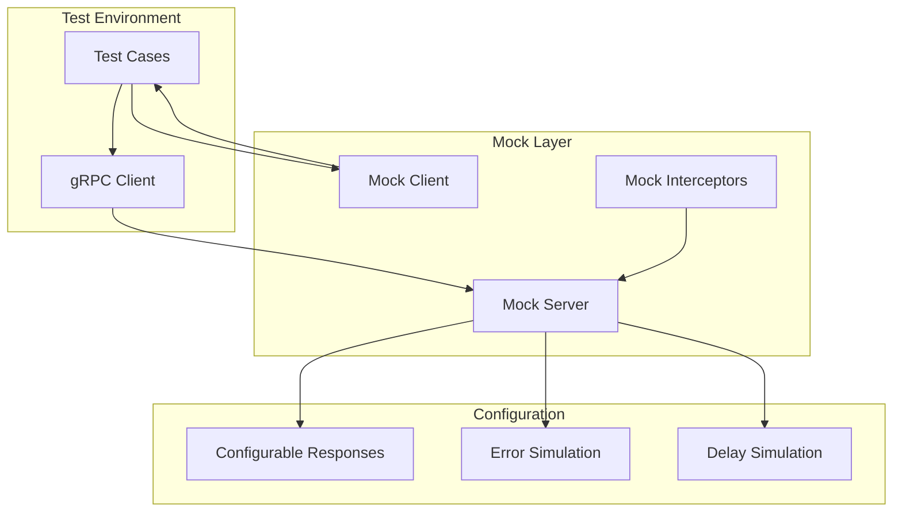
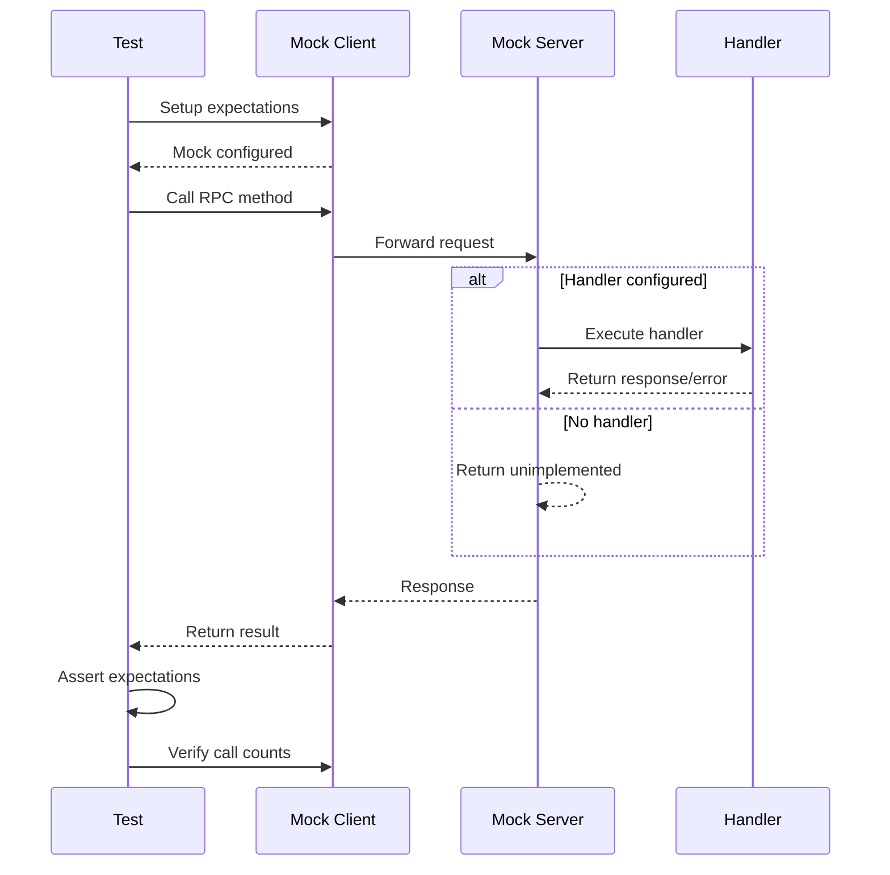

# How to Mock gRPC Services for Testing

Author: [nawazdhandala](https://www.github.com/nawazdhandala)

Tags: gRPC, mocking, testing, golang, gomock, mockgen, unit-testing

Description: Learn how to effectively mock gRPC services for testing using gomock, configurable mock servers, and stream mocking techniques.

---

Mocking gRPC services is essential for testing clients and services in isolation. This guide covers comprehensive techniques for mocking gRPC services, from simple mock servers to advanced stream mocking with gomock.

## Understanding gRPC Mocking Architecture



## Setting Up gomock and mockgen

### Installation

```bash
# Install gomock
go get github.com/golang/mock/gomock

# Install mockgen
go install github.com/golang/mock/mockgen@latest

# Alternative: uber-go/mock (maintained fork)
go install go.uber.org/mock/mockgen@latest
```

### Project Structure

```
myservice/
├── proto/
│   └── user.proto
├── pb/
│   ├── user.pb.go
│   └── user_grpc.pb.go
├── mocks/
│   ├── mock_user_client.go
│   └── mock_user_server.go
├── client/
│   ├── client.go
│   └── client_test.go
├── server/
│   ├── server.go
│   └── server_test.go
└── go.mod
```

### Generating Mocks with mockgen

```bash
# Generate mock client
mockgen -source=pb/user_grpc.pb.go \
    -destination=mocks/mock_user_client.go \
    -package=mocks \
    UserServiceClient

# Generate mock server
mockgen -source=pb/user_grpc.pb.go \
    -destination=mocks/mock_user_server.go \
    -package=mocks \
    UserServiceServer

# Using go generate directive
# Add this to a file (e.g., generate.go):
//go:generate mockgen -source=pb/user_grpc.pb.go -destination=mocks/mock_user_client.go -package=mocks
```

## Creating a Mock gRPC Server

### Basic Mock Server

```go
// mocks/mock_server.go
package mocks

import (
    "context"
    "io"
    "net"
    "sync"

    "github.com/example/myservice/pb"
    "google.golang.org/grpc"
    "google.golang.org/grpc/codes"
    "google.golang.org/grpc/status"
    "google.golang.org/grpc/test/bufconn"
)

const bufSize = 1024 * 1024

// MockUserServer provides a configurable mock gRPC server
type MockUserServer struct {
    pb.UnimplementedUserServiceServer

    mu       sync.RWMutex
    listener *bufconn.Listener
    server   *grpc.Server

    // Configurable handlers
    GetUserHandler         func(context.Context, *pb.GetUserRequest) (*pb.GetUserResponse, error)
    CreateUserHandler      func(context.Context, *pb.CreateUserRequest) (*pb.CreateUserResponse, error)
    ListUsersHandler       func(*pb.ListUsersRequest, pb.UserService_ListUsersServer) error
    BatchCreateHandler     func(pb.UserService_BatchCreateUsersServer) error
    SyncUsersHandler       func(pb.UserService_SyncUsersServer) error

    // Call tracking
    GetUserCalls    []*pb.GetUserRequest
    CreateUserCalls []*pb.CreateUserRequest
}

// NewMockUserServer creates a new mock server
func NewMockUserServer() *MockUserServer {
    return &MockUserServer{
        GetUserCalls:    make([]*pb.GetUserRequest, 0),
        CreateUserCalls: make([]*pb.CreateUserRequest, 0),
    }
}

// Start starts the mock server
func (m *MockUserServer) Start() error {
    m.listener = bufconn.Listen(bufSize)
    m.server = grpc.NewServer()
    pb.RegisterUserServiceServer(m.server, m)

    go func() {
        m.server.Serve(m.listener)
    }()

    return nil
}

// Stop stops the mock server
func (m *MockUserServer) Stop() {
    if m.server != nil {
        m.server.Stop()
    }
    if m.listener != nil {
        m.listener.Close()
    }
}

// Dial returns a client connection
func (m *MockUserServer) Dial(ctx context.Context) (*grpc.ClientConn, error) {
    return grpc.DialContext(ctx, "bufnet",
        grpc.WithContextDialer(func(context.Context, string) (net.Conn, error) {
            return m.listener.Dial()
        }),
        grpc.WithInsecure(),
    )
}

// Reset clears all recorded calls
func (m *MockUserServer) Reset() {
    m.mu.Lock()
    defer m.mu.Unlock()
    m.GetUserCalls = make([]*pb.GetUserRequest, 0)
    m.CreateUserCalls = make([]*pb.CreateUserRequest, 0)
}

// GetUser implements the GetUser RPC
func (m *MockUserServer) GetUser(ctx context.Context, req *pb.GetUserRequest) (*pb.GetUserResponse, error) {
    m.mu.Lock()
    m.GetUserCalls = append(m.GetUserCalls, req)
    m.mu.Unlock()

    if m.GetUserHandler != nil {
        return m.GetUserHandler(ctx, req)
    }

    return nil, status.Error(codes.Unimplemented, "GetUser not implemented")
}

// CreateUser implements the CreateUser RPC
func (m *MockUserServer) CreateUser(ctx context.Context, req *pb.CreateUserRequest) (*pb.CreateUserResponse, error) {
    m.mu.Lock()
    m.CreateUserCalls = append(m.CreateUserCalls, req)
    m.mu.Unlock()

    if m.CreateUserHandler != nil {
        return m.CreateUserHandler(ctx, req)
    }

    return nil, status.Error(codes.Unimplemented, "CreateUser not implemented")
}

// ListUsers implements the ListUsers RPC
func (m *MockUserServer) ListUsers(req *pb.ListUsersRequest, stream pb.UserService_ListUsersServer) error {
    if m.ListUsersHandler != nil {
        return m.ListUsersHandler(req, stream)
    }

    return status.Error(codes.Unimplemented, "ListUsers not implemented")
}

// BatchCreateUsers implements the BatchCreateUsers RPC
func (m *MockUserServer) BatchCreateUsers(stream pb.UserService_BatchCreateUsersServer) error {
    if m.BatchCreateHandler != nil {
        return m.BatchCreateHandler(stream)
    }

    return status.Error(codes.Unimplemented, "BatchCreateUsers not implemented")
}

// SyncUsers implements the SyncUsers RPC
func (m *MockUserServer) SyncUsers(stream pb.UserService_SyncUsersServer) error {
    if m.SyncUsersHandler != nil {
        return m.SyncUsersHandler(stream)
    }

    return status.Error(codes.Unimplemented, "SyncUsers not implemented")
}
```

### Using the Mock Server

```go
// client/client_test.go
package client

import (
    "context"
    "testing"
    "time"

    "github.com/example/myservice/mocks"
    "github.com/example/myservice/pb"
    "github.com/stretchr/testify/assert"
    "github.com/stretchr/testify/require"
    "google.golang.org/grpc/codes"
    "google.golang.org/grpc/status"
)

func TestUserClient_GetUser(t *testing.T) {
    mockServer := mocks.NewMockUserServer()
    require.NoError(t, mockServer.Start())
    defer mockServer.Stop()

    ctx := context.Background()
    conn, err := mockServer.Dial(ctx)
    require.NoError(t, err)
    defer conn.Close()

    client := pb.NewUserServiceClient(conn)

    t.Run("successful get", func(t *testing.T) {
        mockServer.Reset()
        mockServer.GetUserHandler = func(ctx context.Context, req *pb.GetUserRequest) (*pb.GetUserResponse, error) {
            return &pb.GetUserResponse{
                User: &pb.User{
                    Id:    req.Id,
                    Name:  "Test User",
                    Email: "test@example.com",
                },
            }, nil
        }

        resp, err := client.GetUser(ctx, &pb.GetUserRequest{Id: "user-123"})

        require.NoError(t, err)
        assert.Equal(t, "user-123", resp.User.Id)
        assert.Equal(t, "Test User", resp.User.Name)
        assert.Len(t, mockServer.GetUserCalls, 1)
        assert.Equal(t, "user-123", mockServer.GetUserCalls[0].Id)
    })

    t.Run("user not found", func(t *testing.T) {
        mockServer.Reset()
        mockServer.GetUserHandler = func(ctx context.Context, req *pb.GetUserRequest) (*pb.GetUserResponse, error) {
            return nil, status.Error(codes.NotFound, "user not found")
        }

        _, err := client.GetUser(ctx, &pb.GetUserRequest{Id: "nonexistent"})

        require.Error(t, err)
        st, ok := status.FromError(err)
        assert.True(t, ok)
        assert.Equal(t, codes.NotFound, st.Code())
    })
}

func TestUserClient_CreateUser(t *testing.T) {
    mockServer := mocks.NewMockUserServer()
    require.NoError(t, mockServer.Start())
    defer mockServer.Stop()

    ctx := context.Background()
    conn, err := mockServer.Dial(ctx)
    require.NoError(t, err)
    defer conn.Close()

    client := pb.NewUserServiceClient(conn)

    t.Run("successful create", func(t *testing.T) {
        mockServer.Reset()
        mockServer.CreateUserHandler = func(ctx context.Context, req *pb.CreateUserRequest) (*pb.CreateUserResponse, error) {
            return &pb.CreateUserResponse{
                User: &pb.User{
                    Id:        "new-user-id",
                    Name:      req.Name,
                    Email:     req.Email,
                    CreatedAt: time.Now().Unix(),
                },
            }, nil
        }

        resp, err := client.CreateUser(ctx, &pb.CreateUserRequest{
            Name:  "New User",
            Email: "new@example.com",
        })

        require.NoError(t, err)
        assert.Equal(t, "new-user-id", resp.User.Id)
        assert.Len(t, mockServer.CreateUserCalls, 1)
    })
}
```

## Using gomock for Generated Mocks

### Generated Mock Client Usage

```go
// client/client_test.go
package client

import (
    "context"
    "testing"

    "github.com/example/myservice/mocks"
    "github.com/example/myservice/pb"
    "github.com/golang/mock/gomock"
    "github.com/stretchr/testify/assert"
)

// UserService is a service that uses the gRPC client
type UserService struct {
    client pb.UserServiceClient
}

func NewUserService(client pb.UserServiceClient) *UserService {
    return &UserService{client: client}
}

func (s *UserService) GetUserByID(ctx context.Context, id string) (*pb.User, error) {
    resp, err := s.client.GetUser(ctx, &pb.GetUserRequest{Id: id})
    if err != nil {
        return nil, err
    }
    return resp.User, nil
}

func (s *UserService) CreateNewUser(ctx context.Context, name, email string) (*pb.User, error) {
    resp, err := s.client.CreateUser(ctx, &pb.CreateUserRequest{
        Name:  name,
        Email: email,
    })
    if err != nil {
        return nil, err
    }
    return resp.User, nil
}

func TestUserService_GetUserByID(t *testing.T) {
    ctrl := gomock.NewController(t)
    defer ctrl.Finish()

    mockClient := mocks.NewMockUserServiceClient(ctrl)
    service := NewUserService(mockClient)

    ctx := context.Background()

    t.Run("successful retrieval", func(t *testing.T) {
        expectedUser := &pb.User{
            Id:    "user-123",
            Name:  "Test User",
            Email: "test@example.com",
        }

        mockClient.EXPECT().
            GetUser(gomock.Any(), &pb.GetUserRequest{Id: "user-123"}).
            Return(&pb.GetUserResponse{User: expectedUser}, nil)

        user, err := service.GetUserByID(ctx, "user-123")

        assert.NoError(t, err)
        assert.Equal(t, expectedUser.Id, user.Id)
        assert.Equal(t, expectedUser.Name, user.Name)
    })

    t.Run("user not found", func(t *testing.T) {
        mockClient.EXPECT().
            GetUser(gomock.Any(), &pb.GetUserRequest{Id: "nonexistent"}).
            Return(nil, status.Error(codes.NotFound, "user not found"))

        user, err := service.GetUserByID(ctx, "nonexistent")

        assert.Error(t, err)
        assert.Nil(t, user)
    })
}

func TestUserService_CreateNewUser(t *testing.T) {
    ctrl := gomock.NewController(t)
    defer ctrl.Finish()

    mockClient := mocks.NewMockUserServiceClient(ctrl)
    service := NewUserService(mockClient)

    ctx := context.Background()

    t.Run("successful creation", func(t *testing.T) {
        mockClient.EXPECT().
            CreateUser(gomock.Any(), gomock.Any()).
            DoAndReturn(func(ctx context.Context, req *pb.CreateUserRequest) (*pb.CreateUserResponse, error) {
                return &pb.CreateUserResponse{
                    User: &pb.User{
                        Id:    "new-id",
                        Name:  req.Name,
                        Email: req.Email,
                    },
                }, nil
            })

        user, err := service.CreateNewUser(ctx, "New User", "new@example.com")

        assert.NoError(t, err)
        assert.Equal(t, "new-id", user.Id)
        assert.Equal(t, "New User", user.Name)
    })
}
```

### Custom Matchers with gomock

```go
// mocks/matchers.go
package mocks

import (
    "fmt"

    "github.com/example/myservice/pb"
    "github.com/golang/mock/gomock"
)

// UserRequestMatcher matches GetUserRequest by ID
type UserRequestMatcher struct {
    expectedID string
}

func MatchUserRequest(id string) gomock.Matcher {
    return &UserRequestMatcher{expectedID: id}
}

func (m *UserRequestMatcher) Matches(x interface{}) bool {
    req, ok := x.(*pb.GetUserRequest)
    if !ok {
        return false
    }
    return req.Id == m.expectedID
}

func (m *UserRequestMatcher) String() string {
    return fmt.Sprintf("GetUserRequest with ID %s", m.expectedID)
}

// CreateUserRequestMatcher matches CreateUserRequest by email
type CreateUserRequestMatcher struct {
    expectedEmail string
}

func MatchCreateUserByEmail(email string) gomock.Matcher {
    return &CreateUserRequestMatcher{expectedEmail: email}
}

func (m *CreateUserRequestMatcher) Matches(x interface{}) bool {
    req, ok := x.(*pb.CreateUserRequest)
    if !ok {
        return false
    }
    return req.Email == m.expectedEmail
}

func (m *CreateUserRequestMatcher) String() string {
    return fmt.Sprintf("CreateUserRequest with email %s", m.expectedEmail)
}

// Using custom matchers in tests
func TestWithCustomMatchers(t *testing.T) {
    ctrl := gomock.NewController(t)
    defer ctrl.Finish()

    mockClient := mocks.NewMockUserServiceClient(ctrl)

    mockClient.EXPECT().
        GetUser(gomock.Any(), MatchUserRequest("user-123")).
        Return(&pb.GetUserResponse{
            User: &pb.User{Id: "user-123", Name: "Test"},
        }, nil)

    mockClient.EXPECT().
        CreateUser(gomock.Any(), MatchCreateUserByEmail("test@example.com")).
        Return(&pb.CreateUserResponse{
            User: &pb.User{Id: "new-id", Email: "test@example.com"},
        }, nil)
}
```

## Mocking Streaming RPCs

### Server Streaming Mock

```go
// mocks/mock_streams.go
package mocks

import (
    "context"
    "sync"

    "github.com/example/myservice/pb"
    "google.golang.org/grpc/metadata"
)

// MockListUsersClient mocks the client-side stream for ListUsers
type MockListUsersClient struct {
    pb.UserService_ListUsersClient
    users   []*pb.User
    index   int
    recvErr error
    ctx     context.Context
    mu      sync.Mutex
}

func NewMockListUsersClient(users []*pb.User) *MockListUsersClient {
    return &MockListUsersClient{
        users: users,
        ctx:   context.Background(),
    }
}

func (m *MockListUsersClient) Recv() (*pb.User, error) {
    m.mu.Lock()
    defer m.mu.Unlock()

    if m.recvErr != nil {
        return nil, m.recvErr
    }
    if m.index >= len(m.users) {
        return nil, io.EOF
    }
    user := m.users[m.index]
    m.index++
    return user, nil
}

func (m *MockListUsersClient) Context() context.Context {
    return m.ctx
}

func (m *MockListUsersClient) Header() (metadata.MD, error) {
    return nil, nil
}

func (m *MockListUsersClient) Trailer() metadata.MD {
    return nil
}

func (m *MockListUsersClient) CloseSend() error {
    return nil
}

func (m *MockListUsersClient) SetError(err error) {
    m.mu.Lock()
    defer m.mu.Unlock()
    m.recvErr = err
}

// Using server streaming mock
func TestListUsers_WithMock(t *testing.T) {
    ctrl := gomock.NewController(t)
    defer ctrl.Finish()

    mockClient := mocks.NewMockUserServiceClient(ctrl)

    expectedUsers := []*pb.User{
        {Id: "user-1", Name: "User 1"},
        {Id: "user-2", Name: "User 2"},
        {Id: "user-3", Name: "User 3"},
    }

    mockStream := NewMockListUsersClient(expectedUsers)

    mockClient.EXPECT().
        ListUsers(gomock.Any(), &pb.ListUsersRequest{PageSize: 10}).
        Return(mockStream, nil)

    // Use the mock client
    stream, err := mockClient.ListUsers(context.Background(), &pb.ListUsersRequest{PageSize: 10})
    require.NoError(t, err)

    var users []*pb.User
    for {
        user, err := stream.Recv()
        if err == io.EOF {
            break
        }
        require.NoError(t, err)
        users = append(users, user)
    }

    assert.Len(t, users, 3)
}
```

### Client Streaming Mock

```go
// mocks/mock_client_stream.go
package mocks

import (
    "context"
    "sync"

    "github.com/example/myservice/pb"
    "google.golang.org/grpc/metadata"
)

// MockBatchCreateUsersClient mocks the client-side stream for BatchCreateUsers
type MockBatchCreateUsersClient struct {
    pb.UserService_BatchCreateUsersClient
    requests []*pb.CreateUserRequest
    response *pb.BatchCreateResponse
    sendErr  error
    closeErr error
    ctx      context.Context
    mu       sync.Mutex
}

func NewMockBatchCreateUsersClient() *MockBatchCreateUsersClient {
    return &MockBatchCreateUsersClient{
        requests: make([]*pb.CreateUserRequest, 0),
        ctx:      context.Background(),
    }
}

func (m *MockBatchCreateUsersClient) Send(req *pb.CreateUserRequest) error {
    m.mu.Lock()
    defer m.mu.Unlock()

    if m.sendErr != nil {
        return m.sendErr
    }
    m.requests = append(m.requests, req)
    return nil
}

func (m *MockBatchCreateUsersClient) CloseAndRecv() (*pb.BatchCreateResponse, error) {
    if m.closeErr != nil {
        return nil, m.closeErr
    }
    if m.response != nil {
        return m.response, nil
    }
    // Generate response based on requests
    ids := make([]string, len(m.requests))
    for i := range m.requests {
        ids[i] = fmt.Sprintf("user-%d", i+1)
    }
    return &pb.BatchCreateResponse{
        CreatedCount: int32(len(m.requests)),
        UserIds:      ids,
    }, nil
}

func (m *MockBatchCreateUsersClient) Context() context.Context {
    return m.ctx
}

func (m *MockBatchCreateUsersClient) Header() (metadata.MD, error) {
    return nil, nil
}

func (m *MockBatchCreateUsersClient) Trailer() metadata.MD {
    return nil
}

func (m *MockBatchCreateUsersClient) SetResponse(resp *pb.BatchCreateResponse) {
    m.response = resp
}

func (m *MockBatchCreateUsersClient) GetRequests() []*pb.CreateUserRequest {
    m.mu.Lock()
    defer m.mu.Unlock()
    return m.requests
}

// Using client streaming mock
func TestBatchCreateUsers_WithMock(t *testing.T) {
    ctrl := gomock.NewController(t)
    defer ctrl.Finish()

    mockClient := mocks.NewMockUserServiceClient(ctrl)
    mockStream := NewMockBatchCreateUsersClient()

    mockClient.EXPECT().
        BatchCreateUsers(gomock.Any()).
        Return(mockStream, nil)

    // Use the mock client
    stream, err := mockClient.BatchCreateUsers(context.Background())
    require.NoError(t, err)

    // Send requests
    for i := 0; i < 3; i++ {
        err := stream.Send(&pb.CreateUserRequest{
            Name:  fmt.Sprintf("User %d", i),
            Email: fmt.Sprintf("user%d@example.com", i),
        })
        require.NoError(t, err)
    }

    resp, err := stream.CloseAndRecv()
    require.NoError(t, err)
    assert.Equal(t, int32(3), resp.CreatedCount)
    assert.Len(t, mockStream.GetRequests(), 3)
}
```

### Bidirectional Streaming Mock

```go
// mocks/mock_bidi_stream.go
package mocks

import (
    "context"
    "io"
    "sync"

    "github.com/example/myservice/pb"
    "google.golang.org/grpc/metadata"
)

// MockSyncUsersClient mocks the bidirectional stream for SyncUsers
type MockSyncUsersClient struct {
    pb.UserService_SyncUsersClient
    requests     []*pb.SyncRequest
    responses    []*pb.SyncResponse
    respIndex    int
    sendErr      error
    recvErr      error
    closeSendErr error
    ctx          context.Context
    mu           sync.Mutex
    closed       bool
}

func NewMockSyncUsersClient(responses []*pb.SyncResponse) *MockSyncUsersClient {
    return &MockSyncUsersClient{
        requests:  make([]*pb.SyncRequest, 0),
        responses: responses,
        ctx:       context.Background(),
    }
}

func (m *MockSyncUsersClient) Send(req *pb.SyncRequest) error {
    m.mu.Lock()
    defer m.mu.Unlock()

    if m.sendErr != nil {
        return m.sendErr
    }
    m.requests = append(m.requests, req)
    return nil
}

func (m *MockSyncUsersClient) Recv() (*pb.SyncResponse, error) {
    m.mu.Lock()
    defer m.mu.Unlock()

    if m.recvErr != nil {
        return nil, m.recvErr
    }
    if m.closed && m.respIndex >= len(m.responses) {
        return nil, io.EOF
    }
    if m.respIndex >= len(m.responses) {
        // Wait for more responses or return EOF if closed
        return nil, io.EOF
    }
    resp := m.responses[m.respIndex]
    m.respIndex++
    return resp, nil
}

func (m *MockSyncUsersClient) CloseSend() error {
    m.mu.Lock()
    defer m.mu.Unlock()
    m.closed = true
    return m.closeSendErr
}

func (m *MockSyncUsersClient) Context() context.Context {
    return m.ctx
}

func (m *MockSyncUsersClient) Header() (metadata.MD, error) {
    return nil, nil
}

func (m *MockSyncUsersClient) Trailer() metadata.MD {
    return nil
}

func (m *MockSyncUsersClient) GetRequests() []*pb.SyncRequest {
    m.mu.Lock()
    defer m.mu.Unlock()
    return m.requests
}

// Using bidirectional streaming mock
func TestSyncUsers_WithMock(t *testing.T) {
    ctrl := gomock.NewController(t)
    defer ctrl.Finish()

    mockClient := mocks.NewMockUserServiceClient(ctrl)

    responses := []*pb.SyncResponse{
        {UserId: "user-1", Status: "synced"},
        {UserId: "user-2", Status: "deleted"},
    }
    mockStream := NewMockSyncUsersClient(responses)

    mockClient.EXPECT().
        SyncUsers(gomock.Any()).
        Return(mockStream, nil)

    stream, err := mockClient.SyncUsers(context.Background())
    require.NoError(t, err)

    // Send requests
    err = stream.Send(&pb.SyncRequest{UserId: "user-1", Action: "update"})
    require.NoError(t, err)
    err = stream.Send(&pb.SyncRequest{UserId: "user-2", Action: "delete"})
    require.NoError(t, err)
    stream.CloseSend()

    // Receive responses
    var receivedResponses []*pb.SyncResponse
    for {
        resp, err := stream.Recv()
        if err == io.EOF {
            break
        }
        require.NoError(t, err)
        receivedResponses = append(receivedResponses, resp)
    }

    assert.Len(t, receivedResponses, 2)
    assert.Len(t, mockStream.GetRequests(), 2)
}
```

## Configurable Response Mocking

```go
// mocks/configurable_server.go
package mocks

import (
    "context"
    "sync"
    "time"

    "github.com/example/myservice/pb"
    "google.golang.org/grpc/codes"
    "google.golang.org/grpc/status"
)

// ResponseConfig configures mock responses
type ResponseConfig struct {
    Response interface{}
    Error    error
    Delay    time.Duration
}

// ConfigurableMockServer provides a highly configurable mock server
type ConfigurableMockServer struct {
    pb.UnimplementedUserServiceServer

    mu             sync.RWMutex
    getUserConfig  map[string]*ResponseConfig
    defaultConfig  *ResponseConfig
    callCount      map[string]int
    delayEnabled   bool
    globalDelay    time.Duration
}

func NewConfigurableMockServer() *ConfigurableMockServer {
    return &ConfigurableMockServer{
        getUserConfig: make(map[string]*ResponseConfig),
        callCount:     make(map[string]int),
    }
}

// ConfigureGetUser sets up a response for a specific user ID
func (s *ConfigurableMockServer) ConfigureGetUser(userID string, config *ResponseConfig) {
    s.mu.Lock()
    defer s.mu.Unlock()
    s.getUserConfig[userID] = config
}

// SetDefaultResponse sets the default response for unconfigured requests
func (s *ConfigurableMockServer) SetDefaultResponse(config *ResponseConfig) {
    s.mu.Lock()
    defer s.mu.Unlock()
    s.defaultConfig = config
}

// SetGlobalDelay sets a delay for all responses
func (s *ConfigurableMockServer) SetGlobalDelay(delay time.Duration) {
    s.mu.Lock()
    defer s.mu.Unlock()
    s.globalDelay = delay
    s.delayEnabled = true
}

// GetCallCount returns the number of calls for a specific user ID
func (s *ConfigurableMockServer) GetCallCount(userID string) int {
    s.mu.RLock()
    defer s.mu.RUnlock()
    return s.callCount[userID]
}

// Reset clears all configurations and call counts
func (s *ConfigurableMockServer) Reset() {
    s.mu.Lock()
    defer s.mu.Unlock()
    s.getUserConfig = make(map[string]*ResponseConfig)
    s.callCount = make(map[string]int)
    s.defaultConfig = nil
    s.delayEnabled = false
    s.globalDelay = 0
}

func (s *ConfigurableMockServer) GetUser(ctx context.Context, req *pb.GetUserRequest) (*pb.GetUserResponse, error) {
    s.mu.Lock()
    s.callCount[req.Id]++
    config := s.getUserConfig[req.Id]
    if config == nil {
        config = s.defaultConfig
    }
    globalDelay := s.globalDelay
    delayEnabled := s.delayEnabled
    s.mu.Unlock()

    // Apply global delay
    if delayEnabled && globalDelay > 0 {
        time.Sleep(globalDelay)
    }

    // Apply specific delay
    if config != nil && config.Delay > 0 {
        time.Sleep(config.Delay)
    }

    // Return configured response
    if config != nil {
        if config.Error != nil {
            return nil, config.Error
        }
        if resp, ok := config.Response.(*pb.GetUserResponse); ok {
            return resp, nil
        }
    }

    return nil, status.Error(codes.NotFound, "user not found")
}

// Using configurable mock server
func TestWithConfigurableMock(t *testing.T) {
    mockServer := NewConfigurableMockServer()

    // Configure specific responses
    mockServer.ConfigureGetUser("user-123", &ResponseConfig{
        Response: &pb.GetUserResponse{
            User: &pb.User{Id: "user-123", Name: "Configured User"},
        },
    })

    mockServer.ConfigureGetUser("error-user", &ResponseConfig{
        Error: status.Error(codes.Internal, "database error"),
    })

    mockServer.ConfigureGetUser("slow-user", &ResponseConfig{
        Response: &pb.GetUserResponse{
            User: &pb.User{Id: "slow-user", Name: "Slow User"},
        },
        Delay: 100 * time.Millisecond,
    })

    // Set default for unconfigured IDs
    mockServer.SetDefaultResponse(&ResponseConfig{
        Error: status.Error(codes.NotFound, "user not found"),
    })

    // Test configured user
    resp, err := mockServer.GetUser(context.Background(), &pb.GetUserRequest{Id: "user-123"})
    assert.NoError(t, err)
    assert.Equal(t, "Configured User", resp.User.Name)

    // Test error user
    _, err = mockServer.GetUser(context.Background(), &pb.GetUserRequest{Id: "error-user"})
    assert.Error(t, err)
    st, _ := status.FromError(err)
    assert.Equal(t, codes.Internal, st.Code())

    // Test slow user
    start := time.Now()
    _, err = mockServer.GetUser(context.Background(), &pb.GetUserRequest{Id: "slow-user"})
    assert.NoError(t, err)
    assert.GreaterOrEqual(t, time.Since(start), 100*time.Millisecond)

    // Check call counts
    assert.Equal(t, 1, mockServer.GetCallCount("user-123"))
    assert.Equal(t, 1, mockServer.GetCallCount("error-user"))
}
```

## Mock Server with Interceptors

```go
// mocks/mock_server_with_interceptors.go
package mocks

import (
    "context"
    "log"
    "time"

    "google.golang.org/grpc"
    "google.golang.org/grpc/metadata"
)

// MockInterceptors provides interceptors for testing
type MockInterceptors struct {
    UnaryCallCount  int
    StreamCallCount int
    LastMetadata    metadata.MD
}

// UnaryServerInterceptor logs and counts unary calls
func (m *MockInterceptors) UnaryServerInterceptor() grpc.UnaryServerInterceptor {
    return func(ctx context.Context, req interface{}, info *grpc.UnaryServerInfo, handler grpc.UnaryHandler) (interface{}, error) {
        m.UnaryCallCount++

        // Capture incoming metadata
        if md, ok := metadata.FromIncomingContext(ctx); ok {
            m.LastMetadata = md
        }

        log.Printf("Unary call #%d: %s", m.UnaryCallCount, info.FullMethod)

        start := time.Now()
        resp, err := handler(ctx, req)
        log.Printf("Unary call completed in %v", time.Since(start))

        return resp, err
    }
}

// StreamServerInterceptor logs and counts stream calls
func (m *MockInterceptors) StreamServerInterceptor() grpc.StreamServerInterceptor {
    return func(srv interface{}, ss grpc.ServerStream, info *grpc.StreamServerInfo, handler grpc.StreamHandler) error {
        m.StreamCallCount++

        log.Printf("Stream call #%d: %s", m.StreamCallCount, info.FullMethod)

        start := time.Now()
        err := handler(srv, ss)
        log.Printf("Stream call completed in %v", time.Since(start))

        return err
    }
}

// Creating mock server with interceptors
func NewMockServerWithInterceptors() (*MockUserServer, *MockInterceptors) {
    mockServer := NewMockUserServer()
    interceptors := &MockInterceptors{}

    mockServer.listener = bufconn.Listen(bufSize)
    mockServer.server = grpc.NewServer(
        grpc.UnaryInterceptor(interceptors.UnaryServerInterceptor()),
        grpc.StreamInterceptor(interceptors.StreamServerInterceptor()),
    )
    pb.RegisterUserServiceServer(mockServer.server, mockServer)

    go mockServer.server.Serve(mockServer.listener)

    return mockServer, interceptors
}

// Test with interceptors
func TestWithInterceptors(t *testing.T) {
    mockServer, interceptors := NewMockServerWithInterceptors()
    defer mockServer.Stop()

    mockServer.GetUserHandler = func(ctx context.Context, req *pb.GetUserRequest) (*pb.GetUserResponse, error) {
        return &pb.GetUserResponse{
            User: &pb.User{Id: req.Id, Name: "Test User"},
        }, nil
    }

    ctx := metadata.NewOutgoingContext(context.Background(), metadata.Pairs(
        "authorization", "Bearer token123",
        "request-id", "req-456",
    ))

    conn, err := mockServer.Dial(ctx)
    require.NoError(t, err)
    defer conn.Close()

    client := pb.NewUserServiceClient(conn)

    // Make calls
    _, err = client.GetUser(ctx, &pb.GetUserRequest{Id: "user-1"})
    require.NoError(t, err)

    _, err = client.GetUser(ctx, &pb.GetUserRequest{Id: "user-2"})
    require.NoError(t, err)

    // Verify interceptor counts
    assert.Equal(t, 2, interceptors.UnaryCallCount)
    assert.Contains(t, interceptors.LastMetadata.Get("authorization"), "Bearer token123")
}
```

## Testing Error Scenarios

```go
// mocks/error_scenarios.go
package mocks

import (
    "context"
    "testing"

    "github.com/example/myservice/pb"
    "github.com/stretchr/testify/assert"
    "github.com/stretchr/testify/require"
    "google.golang.org/grpc/codes"
    "google.golang.org/grpc/status"
)

func TestErrorScenarios(t *testing.T) {
    mockServer := NewMockUserServer()
    require.NoError(t, mockServer.Start())
    defer mockServer.Stop()

    ctx := context.Background()
    conn, err := mockServer.Dial(ctx)
    require.NoError(t, err)
    defer conn.Close()

    client := pb.NewUserServiceClient(conn)

    errorTests := []struct {
        name         string
        setupHandler func()
        expectedCode codes.Code
        expectedMsg  string
    }{
        {
            name: "not found error",
            setupHandler: func() {
                mockServer.GetUserHandler = func(ctx context.Context, req *pb.GetUserRequest) (*pb.GetUserResponse, error) {
                    return nil, status.Error(codes.NotFound, "user not found")
                }
            },
            expectedCode: codes.NotFound,
            expectedMsg:  "user not found",
        },
        {
            name: "permission denied",
            setupHandler: func() {
                mockServer.GetUserHandler = func(ctx context.Context, req *pb.GetUserRequest) (*pb.GetUserResponse, error) {
                    return nil, status.Error(codes.PermissionDenied, "access denied")
                }
            },
            expectedCode: codes.PermissionDenied,
            expectedMsg:  "access denied",
        },
        {
            name: "internal error",
            setupHandler: func() {
                mockServer.GetUserHandler = func(ctx context.Context, req *pb.GetUserRequest) (*pb.GetUserResponse, error) {
                    return nil, status.Error(codes.Internal, "database connection failed")
                }
            },
            expectedCode: codes.Internal,
            expectedMsg:  "database connection failed",
        },
        {
            name: "invalid argument",
            setupHandler: func() {
                mockServer.GetUserHandler = func(ctx context.Context, req *pb.GetUserRequest) (*pb.GetUserResponse, error) {
                    return nil, status.Error(codes.InvalidArgument, "invalid user id format")
                }
            },
            expectedCode: codes.InvalidArgument,
            expectedMsg:  "invalid user id format",
        },
        {
            name: "unavailable",
            setupHandler: func() {
                mockServer.GetUserHandler = func(ctx context.Context, req *pb.GetUserRequest) (*pb.GetUserResponse, error) {
                    return nil, status.Error(codes.Unavailable, "service temporarily unavailable")
                }
            },
            expectedCode: codes.Unavailable,
            expectedMsg:  "service temporarily unavailable",
        },
        {
            name: "deadline exceeded",
            setupHandler: func() {
                mockServer.GetUserHandler = func(ctx context.Context, req *pb.GetUserRequest) (*pb.GetUserResponse, error) {
                    return nil, status.Error(codes.DeadlineExceeded, "request timeout")
                }
            },
            expectedCode: codes.DeadlineExceeded,
            expectedMsg:  "request timeout",
        },
    }

    for _, tt := range errorTests {
        t.Run(tt.name, func(t *testing.T) {
            mockServer.Reset()
            tt.setupHandler()

            _, err := client.GetUser(ctx, &pb.GetUserRequest{Id: "test-user"})

            require.Error(t, err)
            st, ok := status.FromError(err)
            assert.True(t, ok)
            assert.Equal(t, tt.expectedCode, st.Code())
            assert.Contains(t, st.Message(), tt.expectedMsg)
        })
    }
}
```

## Mock Testing Flow Diagram



## Best Practices

1. **Use Interfaces**: Define interfaces for gRPC clients to enable easy mocking.

2. **Generate Mocks**: Use mockgen to automatically generate mock implementations.

3. **Configure Responses**: Create configurable mock servers for complex test scenarios.

4. **Track Calls**: Record and verify calls made to mock services.

5. **Simulate Errors**: Test error handling by configuring mocks to return various gRPC status codes.

6. **Mock Streams**: Create dedicated mock types for streaming RPCs.

7. **Use Custom Matchers**: Create gomock matchers for complex request validation.

8. **Reset Between Tests**: Clear mock state between test cases to ensure isolation.

## Conclusion

Effective mocking of gRPC services is crucial for comprehensive testing. By using gomock and custom mock implementations, you can test clients in isolation, simulate various error conditions, and verify interactions with gRPC services. The techniques covered in this guide provide a solid foundation for building reliable test suites for gRPC-based applications.
