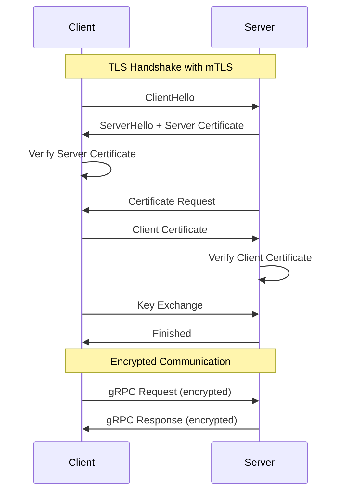
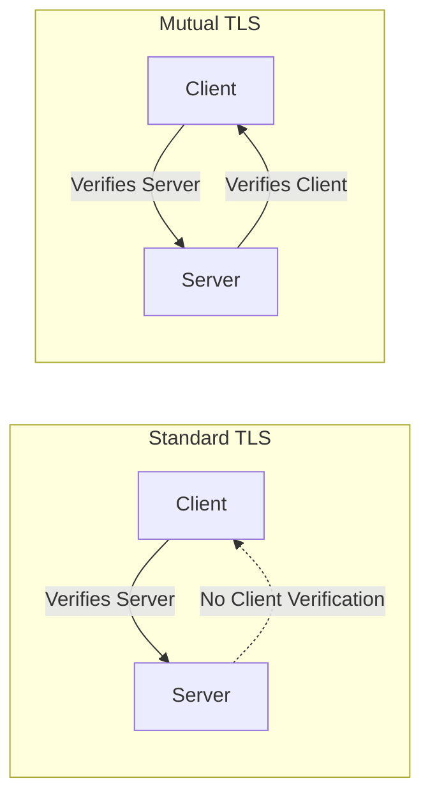

# How to Add mTLS (Mutual TLS) to gRPC Services

Author: [nawazdhandala](https://www.github.com/nawazdhandala)

Tags: gRPC, mTLS, Mutual TLS, Security, Certificates, Client Authentication, Zero Trust

Description: A complete guide to implementing mutual TLS authentication in gRPC services, including certificate generation, server/client configuration, and certificate rotation strategies.

---

## Introduction

Mutual TLS (mTLS) provides two-way authentication between client and server, ensuring both parties verify each other's identity before establishing a connection. This is a cornerstone of zero-trust security architectures and is essential for service-to-service communication in microservices environments.

## Understanding mTLS



### mTLS vs Standard TLS



| Feature | Standard TLS | Mutual TLS |
|---------|-------------|------------|
| Server Authentication | Yes | Yes |
| Client Authentication | No | Yes |
| Use Case | Public APIs | Service-to-Service |
| Certificate Required | Server only | Both |
| Security Level | Medium | High |

## Certificate Generation for mTLS

### Complete Certificate Infrastructure

```bash
#!/bin/bash
# generate-mtls-certs.sh - Generate complete mTLS certificate infrastructure

set -e

# Configuration
DAYS_VALID=365
KEY_SIZE=4096
CA_SUBJECT="/C=US/ST=California/L=San Francisco/O=MyOrg/OU=Security/CN=MyOrg Root CA"
SERVER_SUBJECT="/C=US/ST=California/L=San Francisco/O=MyOrg/OU=Services/CN=grpc-server"
CLIENT_SUBJECT="/C=US/ST=California/L=San Francisco/O=MyOrg/OU=Services/CN=grpc-client"

# Create directory structure
mkdir -p certs/{ca,server,client}

echo "=== Generating Certificate Authority ==="

# Generate CA private key
openssl genrsa -out certs/ca/ca.key $KEY_SIZE

# Generate CA certificate
openssl req -new -x509 -days $DAYS_VALID \
    -key certs/ca/ca.key \
    -out certs/ca/ca.crt \
    -subj "$CA_SUBJECT"

echo "=== Generating Server Certificate ==="

# Generate server private key
openssl genrsa -out certs/server/server.key $KEY_SIZE

# Create server CSR config
cat > certs/server/server.cnf << EOF
[req]
default_bits = $KEY_SIZE
prompt = no
default_md = sha256
distinguished_name = dn
req_extensions = req_ext

[dn]
C = US
ST = California
L = San Francisco
O = MyOrg
OU = Services
CN = grpc-server

[req_ext]
subjectAltName = @alt_names
keyUsage = digitalSignature, keyEncipherment
extendedKeyUsage = serverAuth

[alt_names]
DNS.1 = localhost
DNS.2 = grpc-server
DNS.3 = grpc-server.default.svc.cluster.local
DNS.4 = *.grpc-server.default.svc.cluster.local
IP.1 = 127.0.0.1
IP.2 = 0.0.0.0
EOF

# Generate server CSR
openssl req -new \
    -key certs/server/server.key \
    -out certs/server/server.csr \
    -config certs/server/server.cnf

# Create server certificate extension file
cat > certs/server/server.ext << EOF
authorityKeyIdentifier=keyid,issuer
basicConstraints=CA:FALSE
keyUsage = digitalSignature, keyEncipherment
extendedKeyUsage = serverAuth
subjectAltName = @alt_names

[alt_names]
DNS.1 = localhost
DNS.2 = grpc-server
DNS.3 = grpc-server.default.svc.cluster.local
DNS.4 = *.grpc-server.default.svc.cluster.local
IP.1 = 127.0.0.1
IP.2 = 0.0.0.0
EOF

# Sign server certificate
openssl x509 -req \
    -in certs/server/server.csr \
    -CA certs/ca/ca.crt \
    -CAkey certs/ca/ca.key \
    -CAcreateserial \
    -out certs/server/server.crt \
    -days $DAYS_VALID \
    -extfile certs/server/server.ext

echo "=== Generating Client Certificate ==="

# Generate client private key
openssl genrsa -out certs/client/client.key $KEY_SIZE

# Create client CSR config
cat > certs/client/client.cnf << EOF
[req]
default_bits = $KEY_SIZE
prompt = no
default_md = sha256
distinguished_name = dn
req_extensions = req_ext

[dn]
C = US
ST = California
L = San Francisco
O = MyOrg
OU = Services
CN = grpc-client

[req_ext]
keyUsage = digitalSignature
extendedKeyUsage = clientAuth
EOF

# Generate client CSR
openssl req -new \
    -key certs/client/client.key \
    -out certs/client/client.csr \
    -config certs/client/client.cnf

# Create client certificate extension file
cat > certs/client/client.ext << EOF
authorityKeyIdentifier=keyid,issuer
basicConstraints=CA:FALSE
keyUsage = digitalSignature
extendedKeyUsage = clientAuth
EOF

# Sign client certificate
openssl x509 -req \
    -in certs/client/client.csr \
    -CA certs/ca/ca.crt \
    -CAkey certs/ca/ca.key \
    -CAcreateserial \
    -out certs/client/client.crt \
    -days $DAYS_VALID \
    -extfile certs/client/client.ext

echo "=== Verifying Certificates ==="

# Verify server certificate
echo "Server certificate verification:"
openssl verify -CAfile certs/ca/ca.crt certs/server/server.crt

# Verify client certificate
echo "Client certificate verification:"
openssl verify -CAfile certs/ca/ca.crt certs/client/client.crt

echo "=== Certificate Generation Complete ==="
echo ""
echo "Files generated:"
echo "  CA:     certs/ca/ca.crt, certs/ca/ca.key"
echo "  Server: certs/server/server.crt, certs/server/server.key"
echo "  Client: certs/client/client.crt, certs/client/client.key"
```

### Generate Multiple Client Certificates

```bash
#!/bin/bash
# generate-client-cert.sh - Generate a new client certificate

CLIENT_NAME=$1
if [ -z "$CLIENT_NAME" ]; then
    echo "Usage: $0 <client-name>"
    exit 1
fi

mkdir -p certs/clients/$CLIENT_NAME

# Generate client private key
openssl genrsa -out certs/clients/$CLIENT_NAME/client.key 4096

# Create client CSR
openssl req -new \
    -key certs/clients/$CLIENT_NAME/client.key \
    -out certs/clients/$CLIENT_NAME/client.csr \
    -subj "/C=US/ST=California/L=San Francisco/O=MyOrg/OU=Services/CN=$CLIENT_NAME"

# Create extension file
cat > certs/clients/$CLIENT_NAME/client.ext << EOF
authorityKeyIdentifier=keyid,issuer
basicConstraints=CA:FALSE
keyUsage = digitalSignature
extendedKeyUsage = clientAuth
subjectAltName = @alt_names

[alt_names]
DNS.1 = $CLIENT_NAME
EOF

# Sign client certificate
openssl x509 -req \
    -in certs/clients/$CLIENT_NAME/client.csr \
    -CA certs/ca/ca.crt \
    -CAkey certs/ca/ca.key \
    -CAcreateserial \
    -out certs/clients/$CLIENT_NAME/client.crt \
    -days 365 \
    -extfile certs/clients/$CLIENT_NAME/client.ext

echo "Client certificate generated for: $CLIENT_NAME"
```

## Server Configuration with mTLS

### Go Server with mTLS

```go
package main

import (
    "crypto/tls"
    "crypto/x509"
    "fmt"
    "io/ioutil"
    "log"
    "net"

    "google.golang.org/grpc"
    "google.golang.org/grpc/credentials"
    "google.golang.org/grpc/peer"

    pb "your-module/proto"
)

// GreeterServer implements the Greeter service
type GreeterServer struct {
    pb.UnimplementedGreeterServer
}

func (s *GreeterServer) SayHello(ctx context.Context, req *pb.HelloRequest) (*pb.HelloReply, error) {
    // Extract client certificate information from context
    clientInfo := extractClientInfo(ctx)
    log.Printf("Request from client: %s", clientInfo)

    return &pb.HelloReply{
        Message: fmt.Sprintf("Hello %s, authenticated as %s", req.Name, clientInfo),
    }, nil
}

func extractClientInfo(ctx context.Context) string {
    p, ok := peer.FromContext(ctx)
    if !ok {
        return "unknown"
    }

    tlsInfo, ok := p.AuthInfo.(credentials.TLSInfo)
    if !ok {
        return "no TLS info"
    }

    if len(tlsInfo.State.PeerCertificates) == 0 {
        return "no client certificate"
    }

    cert := tlsInfo.State.PeerCertificates[0]
    return fmt.Sprintf("CN=%s, O=%v", cert.Subject.CommonName, cert.Subject.Organization)
}

func loadMTLSCredentials() (credentials.TransportCredentials, error) {
    // Load CA certificate for verifying client certificates
    caCert, err := ioutil.ReadFile("certs/ca/ca.crt")
    if err != nil {
        return nil, fmt.Errorf("failed to read CA certificate: %v", err)
    }

    certPool := x509.NewCertPool()
    if !certPool.AppendCertsFromPEM(caCert) {
        return nil, fmt.Errorf("failed to add CA certificate to pool")
    }

    // Load server certificate and private key
    serverCert, err := tls.LoadX509KeyPair("certs/server/server.crt", "certs/server/server.key")
    if err != nil {
        return nil, fmt.Errorf("failed to load server certificate: %v", err)
    }

    // Create TLS configuration with mTLS
    config := &tls.Config{
        Certificates: []tls.Certificate{serverCert},
        ClientAuth:   tls.RequireAndVerifyClientCert,
        ClientCAs:    certPool,
        MinVersion:   tls.VersionTLS12,
        CipherSuites: []uint16{
            tls.TLS_ECDHE_RSA_WITH_AES_256_GCM_SHA384,
            tls.TLS_ECDHE_RSA_WITH_AES_128_GCM_SHA256,
        },
    }

    return credentials.NewTLS(config), nil
}

func main() {
    // Load mTLS credentials
    tlsCredentials, err := loadMTLSCredentials()
    if err != nil {
        log.Fatalf("Failed to load TLS credentials: %v", err)
    }

    // Create gRPC server with mTLS
    server := grpc.NewServer(
        grpc.Creds(tlsCredentials),
        grpc.UnaryInterceptor(clientCertInterceptor),
    )

    // Register service
    pb.RegisterGreeterServer(server, &GreeterServer{})

    // Start listening
    listener, err := net.Listen("tcp", ":50051")
    if err != nil {
        log.Fatalf("Failed to listen: %v", err)
    }

    log.Println("gRPC server with mTLS listening on :50051")
    if err := server.Serve(listener); err != nil {
        log.Fatalf("Failed to serve: %v", err)
    }
}

// Interceptor to validate client certificates
func clientCertInterceptor(ctx context.Context, req interface{}, info *grpc.UnaryServerInfo, handler grpc.UnaryHandler) (interface{}, error) {
    p, ok := peer.FromContext(ctx)
    if !ok {
        return nil, status.Error(codes.Unauthenticated, "no peer info")
    }

    tlsInfo, ok := p.AuthInfo.(credentials.TLSInfo)
    if !ok {
        return nil, status.Error(codes.Unauthenticated, "no TLS info")
    }

    if len(tlsInfo.State.PeerCertificates) == 0 {
        return nil, status.Error(codes.Unauthenticated, "no client certificate")
    }

    // Additional certificate validation
    cert := tlsInfo.State.PeerCertificates[0]

    // Check organization
    validOrgs := map[string]bool{"MyOrg": true}
    orgValid := false
    for _, org := range cert.Subject.Organization {
        if validOrgs[org] {
            orgValid = true
            break
        }
    }

    if !orgValid {
        return nil, status.Error(codes.PermissionDenied, "invalid certificate organization")
    }

    return handler(ctx, req)
}
```

### Python Server with mTLS

```python
import grpc
from concurrent import futures
import greeter_pb2
import greeter_pb2_grpc

class GreeterServicer(greeter_pb2_grpc.GreeterServicer):
    def SayHello(self, request, context):
        # Get client certificate info
        auth_context = context.auth_context()
        client_id = "unknown"

        if auth_context:
            identities = auth_context.get('x509_common_name')
            if identities:
                client_id = identities[0].decode('utf-8')

        return greeter_pb2.HelloReply(
            message=f"Hello {request.name}, authenticated as {client_id}"
        )

def load_mtls_credentials():
    """Load mTLS credentials for the server."""
    # Load CA certificate for client verification
    with open('certs/ca/ca.crt', 'rb') as f:
        root_certificates = f.read()

    # Load server certificate and key
    with open('certs/server/server.key', 'rb') as f:
        private_key = f.read()
    with open('certs/server/server.crt', 'rb') as f:
        certificate_chain = f.read()

    # Create server credentials with client certificate requirement
    server_credentials = grpc.ssl_server_credentials(
        [(private_key, certificate_chain)],
        root_certificates=root_certificates,
        require_client_auth=True  # Enable mTLS
    )

    return server_credentials

def serve():
    server = grpc.server(futures.ThreadPoolExecutor(max_workers=10))
    greeter_pb2_grpc.add_GreeterServicer_to_server(GreeterServicer(), server)

    # Load mTLS credentials
    credentials = load_mtls_credentials()

    # Add secure port with mTLS
    server.add_secure_port('[::]:50051', credentials)

    print("gRPC server with mTLS listening on :50051")
    server.start()
    server.wait_for_termination()

if __name__ == '__main__':
    serve()
```

### Node.js Server with mTLS

```javascript
const grpc = require('@grpc/grpc-js');
const protoLoader = require('@grpc/proto-loader');
const fs = require('fs');
const path = require('path');

// Load proto file
const PROTO_PATH = path.join(__dirname, 'greeter.proto');
const packageDefinition = protoLoader.loadSync(PROTO_PATH);
const greeterProto = grpc.loadPackageDefinition(packageDefinition).greeter;

// Implement service
function sayHello(call, callback) {
    // Get client certificate information
    const peer = call.getPeer();
    let clientId = 'unknown';

    // Extract client identity from peer certificate
    try {
        const authContext = call.getAuthContext();
        if (authContext) {
            const identities = authContext['x509_common_name'];
            if (identities && identities.length > 0) {
                clientId = identities[0].toString();
            }
        }
    } catch (err) {
        console.error('Error extracting client identity:', err);
    }

    callback(null, {
        message: `Hello ${call.request.name}, authenticated as ${clientId}`
    });
}

// Load mTLS credentials
function loadMTLSCredentials() {
    const rootCert = fs.readFileSync('certs/ca/ca.crt');
    const serverCert = fs.readFileSync('certs/server/server.crt');
    const serverKey = fs.readFileSync('certs/server/server.key');

    return grpc.ServerCredentials.createSsl(
        rootCert,  // CA certificate for client verification
        [{
            cert_chain: serverCert,
            private_key: serverKey
        }],
        true  // checkClientCertificate - enables mTLS
    );
}

function main() {
    const server = new grpc.Server();

    server.addService(greeterProto.Greeter.service, {
        sayHello: sayHello
    });

    const credentials = loadMTLSCredentials();

    server.bindAsync('0.0.0.0:50051', credentials, (err, port) => {
        if (err) {
            console.error('Failed to bind server:', err);
            return;
        }
        console.log(`gRPC server with mTLS listening on :${port}`);
        server.start();
    });
}

main();
```

## Client Configuration with mTLS

### Go Client with mTLS

```go
package main

import (
    "context"
    "crypto/tls"
    "crypto/x509"
    "fmt"
    "io/ioutil"
    "log"
    "time"

    "google.golang.org/grpc"
    "google.golang.org/grpc/credentials"

    pb "your-module/proto"
)

func loadMTLSCredentials() (credentials.TransportCredentials, error) {
    // Load CA certificate for server verification
    caCert, err := ioutil.ReadFile("certs/ca/ca.crt")
    if err != nil {
        return nil, fmt.Errorf("failed to read CA certificate: %v", err)
    }

    certPool := x509.NewCertPool()
    if !certPool.AppendCertsFromPEM(caCert) {
        return nil, fmt.Errorf("failed to add CA certificate to pool")
    }

    // Load client certificate and private key
    clientCert, err := tls.LoadX509KeyPair("certs/client/client.crt", "certs/client/client.key")
    if err != nil {
        return nil, fmt.Errorf("failed to load client certificate: %v", err)
    }

    // Create TLS configuration with client certificate
    config := &tls.Config{
        Certificates: []tls.Certificate{clientCert},
        RootCAs:      certPool,
        MinVersion:   tls.VersionTLS12,
    }

    return credentials.NewTLS(config), nil
}

func main() {
    // Load mTLS credentials
    tlsCredentials, err := loadMTLSCredentials()
    if err != nil {
        log.Fatalf("Failed to load TLS credentials: %v", err)
    }

    // Connect to server with mTLS
    conn, err := grpc.Dial(
        "localhost:50051",
        grpc.WithTransportCredentials(tlsCredentials),
    )
    if err != nil {
        log.Fatalf("Failed to connect: %v", err)
    }
    defer conn.Close()

    // Create client
    client := pb.NewGreeterClient(conn)

    // Make RPC call
    ctx, cancel := context.WithTimeout(context.Background(), 5*time.Second)
    defer cancel()

    response, err := client.SayHello(ctx, &pb.HelloRequest{Name: "World"})
    if err != nil {
        log.Fatalf("Failed to call SayHello: %v", err)
    }

    log.Printf("Response: %s", response.Message)
}
```

### Python Client with mTLS

```python
import grpc
import greeter_pb2
import greeter_pb2_grpc

def load_mtls_credentials():
    """Load mTLS credentials for the client."""
    # Load CA certificate for server verification
    with open('certs/ca/ca.crt', 'rb') as f:
        root_certificates = f.read()

    # Load client certificate and key
    with open('certs/client/client.key', 'rb') as f:
        private_key = f.read()
    with open('certs/client/client.crt', 'rb') as f:
        certificate_chain = f.read()

    # Create client credentials with client certificate
    credentials = grpc.ssl_channel_credentials(
        root_certificates=root_certificates,
        private_key=private_key,
        certificate_chain=certificate_chain
    )

    return credentials

def main():
    # Load mTLS credentials
    credentials = load_mtls_credentials()

    # Create secure channel with mTLS
    channel = grpc.secure_channel('localhost:50051', credentials)

    # Create stub
    stub = greeter_pb2_grpc.GreeterStub(channel)

    # Make RPC call
    response = stub.SayHello(greeter_pb2.HelloRequest(name='World'))
    print(f"Response: {response.message}")

if __name__ == '__main__':
    main()
```

### Node.js Client with mTLS

```javascript
const grpc = require('@grpc/grpc-js');
const protoLoader = require('@grpc/proto-loader');
const fs = require('fs');
const path = require('path');

// Load proto file
const PROTO_PATH = path.join(__dirname, 'greeter.proto');
const packageDefinition = protoLoader.loadSync(PROTO_PATH);
const greeterProto = grpc.loadPackageDefinition(packageDefinition).greeter;

// Load mTLS credentials
function loadMTLSCredentials() {
    const rootCert = fs.readFileSync('certs/ca/ca.crt');
    const clientCert = fs.readFileSync('certs/client/client.crt');
    const clientKey = fs.readFileSync('certs/client/client.key');

    return grpc.credentials.createSsl(
        rootCert,
        clientKey,
        clientCert
    );
}

async function main() {
    const credentials = loadMTLSCredentials();

    const client = new greeterProto.Greeter(
        'localhost:50051',
        credentials
    );

    // Make RPC call
    client.sayHello({ name: 'World' }, (err, response) => {
        if (err) {
            console.error('Error:', err);
            return;
        }
        console.log('Response:', response.message);
    });
}

main();
```

## Certificate Rotation

### Automatic Certificate Rotation in Go

```go
package certs

import (
    "crypto/tls"
    "crypto/x509"
    "fmt"
    "io/ioutil"
    "log"
    "sync"
    "time"
)

// CertificateRotator handles automatic certificate rotation
type CertificateRotator struct {
    certPath   string
    keyPath    string
    caPath     string
    cert       *tls.Certificate
    certPool   *x509.CertPool
    mu         sync.RWMutex
    stopCh     chan struct{}
    reloadCh   chan struct{}
}

// NewCertificateRotator creates a new certificate rotator
func NewCertificateRotator(certPath, keyPath, caPath string) (*CertificateRotator, error) {
    cr := &CertificateRotator{
        certPath: certPath,
        keyPath:  keyPath,
        caPath:   caPath,
        stopCh:   make(chan struct{}),
        reloadCh: make(chan struct{}),
    }

    if err := cr.loadCertificates(); err != nil {
        return nil, err
    }

    return cr, nil
}

func (cr *CertificateRotator) loadCertificates() error {
    // Load certificate and key
    cert, err := tls.LoadX509KeyPair(cr.certPath, cr.keyPath)
    if err != nil {
        return fmt.Errorf("failed to load certificate: %v", err)
    }

    // Parse certificate to check expiry
    x509Cert, err := x509.ParseCertificate(cert.Certificate[0])
    if err != nil {
        return fmt.Errorf("failed to parse certificate: %v", err)
    }

    // Load CA certificate
    caCert, err := ioutil.ReadFile(cr.caPath)
    if err != nil {
        return fmt.Errorf("failed to read CA certificate: %v", err)
    }

    certPool := x509.NewCertPool()
    if !certPool.AppendCertsFromPEM(caCert) {
        return fmt.Errorf("failed to add CA certificate to pool")
    }

    cr.mu.Lock()
    cr.cert = &cert
    cr.certPool = certPool
    cr.mu.Unlock()

    log.Printf("Certificate loaded, expires: %v", x509Cert.NotAfter)
    return nil
}

// GetCertificate returns the current certificate for TLS config
func (cr *CertificateRotator) GetCertificate(*tls.ClientHelloInfo) (*tls.Certificate, error) {
    cr.mu.RLock()
    defer cr.mu.RUnlock()
    return cr.cert, nil
}

// GetClientCertificate returns the current certificate for client TLS config
func (cr *CertificateRotator) GetClientCertificate(*tls.CertificateRequestInfo) (*tls.Certificate, error) {
    cr.mu.RLock()
    defer cr.mu.RUnlock()
    return cr.cert, nil
}

// GetCertPool returns the current CA certificate pool
func (cr *CertificateRotator) GetCertPool() *x509.CertPool {
    cr.mu.RLock()
    defer cr.mu.RUnlock()
    return cr.certPool
}

// Start begins watching for certificate changes
func (cr *CertificateRotator) Start(checkInterval time.Duration) {
    go cr.watchLoop(checkInterval)
}

// Stop stops the certificate rotator
func (cr *CertificateRotator) Stop() {
    close(cr.stopCh)
}

// Reload triggers an immediate certificate reload
func (cr *CertificateRotator) Reload() {
    select {
    case cr.reloadCh <- struct{}{}:
    default:
    }
}

func (cr *CertificateRotator) watchLoop(interval time.Duration) {
    ticker := time.NewTicker(interval)
    defer ticker.Stop()

    for {
        select {
        case <-cr.stopCh:
            return
        case <-cr.reloadCh:
            if err := cr.loadCertificates(); err != nil {
                log.Printf("Failed to reload certificates: %v", err)
            } else {
                log.Println("Certificates reloaded successfully")
            }
        case <-ticker.C:
            // Check if certificate needs rotation
            cr.mu.RLock()
            cert := cr.cert
            cr.mu.RUnlock()

            if cert != nil {
                x509Cert, err := x509.ParseCertificate(cert.Certificate[0])
                if err == nil {
                    // Reload if certificate expires within 24 hours
                    if time.Until(x509Cert.NotAfter) < 24*time.Hour {
                        log.Println("Certificate expiring soon, attempting reload...")
                        if err := cr.loadCertificates(); err != nil {
                            log.Printf("Failed to reload certificates: %v", err)
                        }
                    }
                }
            }
        }
    }
}

// GetServerTLSConfig returns a TLS config for mTLS server
func (cr *CertificateRotator) GetServerTLSConfig() *tls.Config {
    return &tls.Config{
        GetCertificate: cr.GetCertificate,
        ClientAuth:     tls.RequireAndVerifyClientCert,
        GetConfigForClient: func(*tls.ClientHelloInfo) (*tls.Config, error) {
            return &tls.Config{
                GetCertificate: cr.GetCertificate,
                ClientAuth:     tls.RequireAndVerifyClientCert,
                ClientCAs:      cr.GetCertPool(),
                MinVersion:     tls.VersionTLS12,
            }, nil
        },
        MinVersion: tls.VersionTLS12,
    }
}

// GetClientTLSConfig returns a TLS config for mTLS client
func (cr *CertificateRotator) GetClientTLSConfig() *tls.Config {
    return &tls.Config{
        GetClientCertificate: cr.GetClientCertificate,
        RootCAs:              cr.GetCertPool(),
        MinVersion:           tls.VersionTLS12,
    }
}
```

### Using Certificate Rotator with gRPC

```go
package main

import (
    "log"
    "net"
    "time"

    "google.golang.org/grpc"
    "google.golang.org/grpc/credentials"

    "your-module/certs"
    pb "your-module/proto"
)

func main() {
    // Create certificate rotator
    rotator, err := certs.NewCertificateRotator(
        "certs/server/server.crt",
        "certs/server/server.key",
        "certs/ca/ca.crt",
    )
    if err != nil {
        log.Fatalf("Failed to create certificate rotator: %v", err)
    }

    // Start watching for certificate changes
    rotator.Start(1 * time.Hour)
    defer rotator.Stop()

    // Get TLS config with automatic rotation
    tlsConfig := rotator.GetServerTLSConfig()

    // Create gRPC server
    server := grpc.NewServer(
        grpc.Creds(credentials.NewTLS(tlsConfig)),
    )

    pb.RegisterGreeterServer(server, &GreeterServer{})

    listener, err := net.Listen("tcp", ":50051")
    if err != nil {
        log.Fatalf("Failed to listen: %v", err)
    }

    log.Println("gRPC server with auto-rotating mTLS listening on :50051")
    if err := server.Serve(listener); err != nil {
        log.Fatalf("Failed to serve: %v", err)
    }
}
```

## Certificate Revocation

### Certificate Revocation List (CRL) Checking

```go
package certs

import (
    "crypto/x509"
    "encoding/pem"
    "fmt"
    "io/ioutil"
    "net/http"
    "sync"
    "time"
)

// CRLChecker validates certificates against CRLs
type CRLChecker struct {
    crlURLs   []string
    crls      map[string]*x509.RevocationList
    mu        sync.RWMutex
    cacheTTL  time.Duration
    lastFetch time.Time
}

// NewCRLChecker creates a new CRL checker
func NewCRLChecker(crlURLs []string, cacheTTL time.Duration) *CRLChecker {
    checker := &CRLChecker{
        crlURLs:  crlURLs,
        crls:     make(map[string]*x509.RevocationList),
        cacheTTL: cacheTTL,
    }

    // Initial fetch
    checker.refreshCRLs()

    // Start background refresh
    go checker.refreshLoop()

    return checker
}

func (c *CRLChecker) refreshCRLs() {
    c.mu.Lock()
    defer c.mu.Unlock()

    for _, url := range c.crlURLs {
        crl, err := c.fetchCRL(url)
        if err != nil {
            log.Printf("Failed to fetch CRL from %s: %v", url, err)
            continue
        }
        c.crls[url] = crl
    }

    c.lastFetch = time.Now()
}

func (c *CRLChecker) fetchCRL(url string) (*x509.RevocationList, error) {
    resp, err := http.Get(url)
    if err != nil {
        return nil, err
    }
    defer resp.Body.Close()

    data, err := ioutil.ReadAll(resp.Body)
    if err != nil {
        return nil, err
    }

    // Try DER format
    crl, err := x509.ParseRevocationList(data)
    if err != nil {
        // Try PEM format
        block, _ := pem.Decode(data)
        if block != nil {
            crl, err = x509.ParseRevocationList(block.Bytes)
        }
    }

    return crl, err
}

func (c *CRLChecker) refreshLoop() {
    ticker := time.NewTicker(c.cacheTTL / 2)
    defer ticker.Stop()

    for range ticker.C {
        c.refreshCRLs()
    }
}

// IsRevoked checks if a certificate is revoked
func (c *CRLChecker) IsRevoked(cert *x509.Certificate) (bool, error) {
    c.mu.RLock()
    defer c.mu.RUnlock()

    for _, crl := range c.crls {
        for _, revoked := range crl.RevokedCertificateEntries {
            if revoked.SerialNumber.Cmp(cert.SerialNumber) == 0 {
                return true, nil
            }
        }
    }

    return false, nil
}

// VerifyPeerCertificate returns a function for TLS config
func (c *CRLChecker) VerifyPeerCertificate(rawCerts [][]byte, verifiedChains [][]*x509.Certificate) error {
    if len(verifiedChains) == 0 || len(verifiedChains[0]) == 0 {
        return fmt.Errorf("no verified chains")
    }

    for _, chain := range verifiedChains {
        for _, cert := range chain {
            revoked, err := c.IsRevoked(cert)
            if err != nil {
                return fmt.Errorf("failed to check revocation: %v", err)
            }
            if revoked {
                return fmt.Errorf("certificate %s has been revoked", cert.Subject.CommonName)
            }
        }
    }

    return nil
}
```

## Authorization Based on Client Certificates

### Certificate-Based Authorization

```go
package auth

import (
    "context"
    "crypto/x509"
    "fmt"

    "google.golang.org/grpc"
    "google.golang.org/grpc/codes"
    "google.golang.org/grpc/credentials"
    "google.golang.org/grpc/peer"
    "google.golang.org/grpc/status"
)

// CertAuthConfig defines authorization rules
type CertAuthConfig struct {
    // AllowedOrganizations lists allowed certificate organizations
    AllowedOrganizations []string

    // AllowedCommonNames lists allowed certificate common names
    AllowedCommonNames []string

    // MethodPermissions maps methods to allowed common names
    MethodPermissions map[string][]string
}

// CertAuthInterceptor handles certificate-based authorization
type CertAuthInterceptor struct {
    config CertAuthConfig
}

// NewCertAuthInterceptor creates a new certificate auth interceptor
func NewCertAuthInterceptor(config CertAuthConfig) *CertAuthInterceptor {
    return &CertAuthInterceptor{config: config}
}

// Unary returns a unary interceptor for certificate authorization
func (i *CertAuthInterceptor) Unary() grpc.UnaryServerInterceptor {
    return func(ctx context.Context, req interface{}, info *grpc.UnaryServerInfo, handler grpc.UnaryHandler) (interface{}, error) {
        cert, err := extractClientCert(ctx)
        if err != nil {
            return nil, status.Errorf(codes.Unauthenticated, "failed to get client certificate: %v", err)
        }

        if err := i.authorize(cert, info.FullMethod); err != nil {
            return nil, status.Errorf(codes.PermissionDenied, "authorization failed: %v", err)
        }

        // Add certificate info to context
        ctx = context.WithValue(ctx, "client_cert", cert)
        ctx = context.WithValue(ctx, "client_cn", cert.Subject.CommonName)
        ctx = context.WithValue(ctx, "client_org", cert.Subject.Organization)

        return handler(ctx, req)
    }
}

func extractClientCert(ctx context.Context) (*x509.Certificate, error) {
    p, ok := peer.FromContext(ctx)
    if !ok {
        return nil, fmt.Errorf("no peer info")
    }

    tlsInfo, ok := p.AuthInfo.(credentials.TLSInfo)
    if !ok {
        return nil, fmt.Errorf("no TLS info")
    }

    if len(tlsInfo.State.PeerCertificates) == 0 {
        return nil, fmt.Errorf("no client certificate")
    }

    return tlsInfo.State.PeerCertificates[0], nil
}

func (i *CertAuthInterceptor) authorize(cert *x509.Certificate, method string) error {
    // Check organization
    if len(i.config.AllowedOrganizations) > 0 {
        orgAllowed := false
        for _, allowedOrg := range i.config.AllowedOrganizations {
            for _, certOrg := range cert.Subject.Organization {
                if certOrg == allowedOrg {
                    orgAllowed = true
                    break
                }
            }
        }
        if !orgAllowed {
            return fmt.Errorf("organization not allowed: %v", cert.Subject.Organization)
        }
    }

    // Check common name
    if len(i.config.AllowedCommonNames) > 0 {
        cnAllowed := false
        for _, allowedCN := range i.config.AllowedCommonNames {
            if cert.Subject.CommonName == allowedCN {
                cnAllowed = true
                break
            }
        }
        if !cnAllowed {
            return fmt.Errorf("common name not allowed: %s", cert.Subject.CommonName)
        }
    }

    // Check method-specific permissions
    if allowedCNs, ok := i.config.MethodPermissions[method]; ok {
        for _, cn := range allowedCNs {
            if cert.Subject.CommonName == cn {
                return nil
            }
        }
        return fmt.Errorf("common name %s not allowed for method %s", cert.Subject.CommonName, method)
    }

    return nil
}
```

## Kubernetes Integration

### Kubernetes Secret for mTLS Certificates

```yaml
# mtls-secrets.yaml
apiVersion: v1
kind: Secret
metadata:
  name: grpc-mtls-certs
  namespace: default
type: Opaque
data:
  ca.crt: <base64-encoded-ca-cert>
  server.crt: <base64-encoded-server-cert>
  server.key: <base64-encoded-server-key>
---
apiVersion: v1
kind: Secret
metadata:
  name: grpc-client-certs
  namespace: default
type: Opaque
data:
  ca.crt: <base64-encoded-ca-cert>
  client.crt: <base64-encoded-client-cert>
  client.key: <base64-encoded-client-key>
```

### Deployment with mTLS Certificates

```yaml
# deployment.yaml
apiVersion: apps/v1
kind: Deployment
metadata:
  name: grpc-server
spec:
  replicas: 3
  selector:
    matchLabels:
      app: grpc-server
  template:
    metadata:
      labels:
        app: grpc-server
    spec:
      containers:
      - name: grpc-server
        image: your-grpc-server:latest
        ports:
        - containerPort: 50051
        env:
        - name: TLS_CERT_PATH
          value: /certs/server.crt
        - name: TLS_KEY_PATH
          value: /certs/server.key
        - name: CA_CERT_PATH
          value: /certs/ca.crt
        volumeMounts:
        - name: certs
          mountPath: /certs
          readOnly: true
      volumes:
      - name: certs
        secret:
          secretName: grpc-mtls-certs
```

### cert-manager Integration

```yaml
# certificate.yaml
apiVersion: cert-manager.io/v1
kind: Certificate
metadata:
  name: grpc-server-cert
  namespace: default
spec:
  secretName: grpc-server-tls
  duration: 8760h # 1 year
  renewBefore: 720h # 30 days
  subject:
    organizations:
      - MyOrg
  commonName: grpc-server
  isCA: false
  privateKey:
    algorithm: RSA
    size: 4096
  usages:
    - server auth
    - client auth
  dnsNames:
    - grpc-server
    - grpc-server.default.svc.cluster.local
  ipAddresses:
    - 127.0.0.1
  issuerRef:
    name: ca-issuer
    kind: ClusterIssuer
```

## Testing mTLS

### Testing with grpcurl

```bash
# Test mTLS connection with grpcurl
grpcurl -cacert certs/ca/ca.crt \
    -cert certs/client/client.crt \
    -key certs/client/client.key \
    localhost:50051 \
    greeter.Greeter/SayHello

# Test with request data
grpcurl -cacert certs/ca/ca.crt \
    -cert certs/client/client.crt \
    -key certs/client/client.key \
    -d '{"name": "World"}' \
    localhost:50051 \
    greeter.Greeter/SayHello
```

### Unit Tests for mTLS

```go
package main

import (
    "context"
    "crypto/tls"
    "crypto/x509"
    "io/ioutil"
    "net"
    "testing"
    "time"

    "google.golang.org/grpc"
    "google.golang.org/grpc/credentials"

    pb "your-module/proto"
)

func TestMTLSConnection(t *testing.T) {
    // Setup server
    serverCreds := loadServerMTLSCreds(t)
    server := grpc.NewServer(grpc.Creds(serverCreds))
    pb.RegisterGreeterServer(server, &GreeterServer{})

    listener, err := net.Listen("tcp", "localhost:0")
    if err != nil {
        t.Fatalf("Failed to listen: %v", err)
    }

    go server.Serve(listener)
    defer server.Stop()

    // Setup client
    clientCreds := loadClientMTLSCreds(t)
    conn, err := grpc.Dial(
        listener.Addr().String(),
        grpc.WithTransportCredentials(clientCreds),
    )
    if err != nil {
        t.Fatalf("Failed to connect: %v", err)
    }
    defer conn.Close()

    // Make request
    client := pb.NewGreeterClient(conn)
    ctx, cancel := context.WithTimeout(context.Background(), 5*time.Second)
    defer cancel()

    resp, err := client.SayHello(ctx, &pb.HelloRequest{Name: "Test"})
    if err != nil {
        t.Fatalf("RPC failed: %v", err)
    }

    t.Logf("Response: %s", resp.Message)
}

func TestMTLSRejectsInvalidClient(t *testing.T) {
    // Setup server with mTLS
    serverCreds := loadServerMTLSCreds(t)
    server := grpc.NewServer(grpc.Creds(serverCreds))
    pb.RegisterGreeterServer(server, &GreeterServer{})

    listener, err := net.Listen("tcp", "localhost:0")
    if err != nil {
        t.Fatalf("Failed to listen: %v", err)
    }

    go server.Serve(listener)
    defer server.Stop()

    // Try to connect without client certificate
    caCert, _ := ioutil.ReadFile("testdata/ca.crt")
    certPool := x509.NewCertPool()
    certPool.AppendCertsFromPEM(caCert)

    invalidCreds := credentials.NewTLS(&tls.Config{
        RootCAs: certPool,
        // No client certificate
    })

    conn, err := grpc.Dial(
        listener.Addr().String(),
        grpc.WithTransportCredentials(invalidCreds),
    )
    if err == nil {
        conn.Close()
        t.Fatal("Expected connection to fail without client certificate")
    }
}

func loadServerMTLSCreds(t *testing.T) credentials.TransportCredentials {
    caCert, _ := ioutil.ReadFile("testdata/ca.crt")
    certPool := x509.NewCertPool()
    certPool.AppendCertsFromPEM(caCert)

    serverCert, _ := tls.LoadX509KeyPair("testdata/server.crt", "testdata/server.key")

    return credentials.NewTLS(&tls.Config{
        Certificates: []tls.Certificate{serverCert},
        ClientAuth:   tls.RequireAndVerifyClientCert,
        ClientCAs:    certPool,
    })
}

func loadClientMTLSCreds(t *testing.T) credentials.TransportCredentials {
    caCert, _ := ioutil.ReadFile("testdata/ca.crt")
    certPool := x509.NewCertPool()
    certPool.AppendCertsFromPEM(caCert)

    clientCert, _ := tls.LoadX509KeyPair("testdata/client.crt", "testdata/client.key")

    return credentials.NewTLS(&tls.Config{
        Certificates: []tls.Certificate{clientCert},
        RootCAs:      certPool,
    })
}
```

## Summary

Implementing mTLS for gRPC services provides strong mutual authentication between clients and servers. Key points:

1. **Certificate Generation**: Create a proper PKI with CA, server, and client certificates
2. **Server Configuration**: Configure TLS with `RequireAndVerifyClientCert`
3. **Client Configuration**: Include client certificates in TLS configuration
4. **Certificate Rotation**: Implement automatic certificate reloading
5. **Revocation Checking**: Consider CRL or OCSP for production
6. **Authorization**: Use certificate attributes for fine-grained access control
7. **Kubernetes Integration**: Use cert-manager for automated certificate lifecycle

mTLS is essential for zero-trust architectures and provides the strongest form of service-to-service authentication available.
