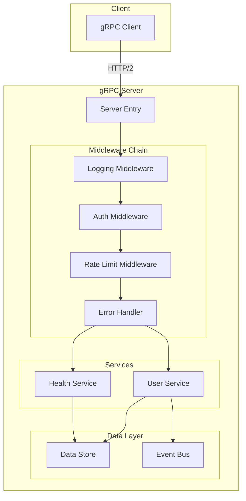

# How to Build gRPC Services in Node.js with TypeScript

Author: [nawazdhandala](https://www.github.com/nawazdhandala)

Tags: gRPC, Node.js, TypeScript, API, Microservices, Protocol Buffers, Backend Development, @grpc/grpc-js

Description: A comprehensive guide to building type-safe gRPC services in Node.js using TypeScript, covering server implementation, middleware patterns, error handling, and production best practices.

---

## Introduction

Building gRPC services in Node.js with TypeScript combines the performance benefits of gRPC with the type safety of TypeScript. The `@grpc/grpc-js` library is the pure JavaScript implementation of gRPC that works seamlessly with TypeScript, providing a robust foundation for building high-performance microservices.

This guide walks you through setting up a complete gRPC service in Node.js with TypeScript, from project setup to production-ready patterns.

## Prerequisites

Before starting, ensure you have:

- Node.js 18 or later
- npm or yarn package manager
- Basic understanding of Protocol Buffers
- Familiarity with TypeScript

## Project Setup

### Initialize the Project

```bash
# Create project directory
mkdir grpc-nodejs-typescript
cd grpc-nodejs-typescript

# Initialize npm project
npm init -y

# Install dependencies
npm install @grpc/grpc-js @grpc/proto-loader
npm install google-protobuf

# Install dev dependencies
npm install -D typescript ts-node @types/node
npm install -D grpc-tools grpc_tools_node_protoc_ts
npm install -D nodemon rimraf

# Initialize TypeScript
npx tsc --init
```

### Project Structure

Create the following directory structure:

```
grpc-nodejs-typescript/
├── protos/
│   └── user.proto
├── src/
│   ├── generated/
│   │   └── (generated files)
│   ├── services/
│   │   ├── user.service.ts
│   │   └── health.service.ts
│   ├── middleware/
│   │   ├── logging.middleware.ts
│   │   ├── auth.middleware.ts
│   │   └── error.middleware.ts
│   ├── utils/
│   │   ├── proto-loader.ts
│   │   └── errors.ts
│   ├── server.ts
│   └── client.ts
├── tests/
│   └── user.service.test.ts
├── package.json
├── tsconfig.json
└── scripts/
    └── generate-proto.sh
```

### TypeScript Configuration

Update `tsconfig.json`:

```json
{
  "compilerOptions": {
    "target": "ES2022",
    "module": "commonjs",
    "lib": ["ES2022"],
    "outDir": "./dist",
    "rootDir": "./src",
    "strict": true,
    "esModuleInterop": true,
    "skipLibCheck": true,
    "forceConsistentCasingInFileNames": true,
    "resolveJsonModule": true,
    "declaration": true,
    "declarationMap": true,
    "sourceMap": true,
    "moduleResolution": "node",
    "experimentalDecorators": true,
    "emitDecoratorMetadata": true
  },
  "include": ["src/**/*"],
  "exclude": ["node_modules", "dist", "tests"]
}
```

### Package Scripts

Update `package.json`:

```json
{
  "name": "grpc-nodejs-typescript",
  "version": "1.0.0",
  "scripts": {
    "build": "rimraf dist && tsc",
    "start": "node dist/server.js",
    "dev": "nodemon --exec ts-node src/server.ts",
    "generate": "bash scripts/generate-proto.sh",
    "test": "jest",
    "lint": "eslint src/**/*.ts"
  },
  "main": "dist/server.js",
  "types": "dist/server.d.ts"
}
```

## Protocol Buffer Definition

### Define the Service

Create `protos/user.proto`:

```protobuf
syntax = "proto3";

package userservice;

option java_multiple_files = true;
option java_package = "com.example.userservice";

// Timestamp message for dates
message Timestamp {
    int64 seconds = 1;
    int32 nanos = 2;
}

// User entity
message User {
    string id = 1;
    string username = 2;
    string email = 3;
    string full_name = 4;
    UserRole role = 5;
    UserStatus status = 6;
    Timestamp created_at = 7;
    Timestamp updated_at = 8;
    map<string, string> metadata = 9;
}

enum UserRole {
    USER_ROLE_UNSPECIFIED = 0;
    USER_ROLE_USER = 1;
    USER_ROLE_ADMIN = 2;
    USER_ROLE_MODERATOR = 3;
}

enum UserStatus {
    USER_STATUS_UNSPECIFIED = 0;
    USER_STATUS_ACTIVE = 1;
    USER_STATUS_INACTIVE = 2;
    USER_STATUS_SUSPENDED = 3;
    USER_STATUS_DELETED = 4;
}

// Request/Response messages
message CreateUserRequest {
    string username = 1;
    string email = 2;
    string full_name = 3;
    string password = 4;
    UserRole role = 5;
    map<string, string> metadata = 6;
}

message CreateUserResponse {
    User user = 1;
}

message GetUserRequest {
    string user_id = 1;
}

message GetUserResponse {
    User user = 1;
}

message UpdateUserRequest {
    string user_id = 1;
    optional string username = 2;
    optional string email = 3;
    optional string full_name = 4;
    optional UserRole role = 5;
    map<string, string> metadata = 6;
}

message UpdateUserResponse {
    User user = 1;
}

message DeleteUserRequest {
    string user_id = 1;
}

message DeleteUserResponse {
    bool success = 1;
    string message = 2;
}

message ListUsersRequest {
    int32 page_size = 1;
    string page_token = 2;
    UserStatus status_filter = 3;
    UserRole role_filter = 4;
}

message ListUsersResponse {
    repeated User users = 1;
    string next_page_token = 2;
    int32 total_count = 3;
}

// Streaming messages
message WatchUsersRequest {
    repeated string user_ids = 1;
    bool include_all = 2;
}

message UserEvent {
    string event_id = 1;
    EventType type = 2;
    User user = 3;
    Timestamp timestamp = 4;
}

enum EventType {
    EVENT_TYPE_UNSPECIFIED = 0;
    EVENT_TYPE_CREATED = 1;
    EVENT_TYPE_UPDATED = 2;
    EVENT_TYPE_DELETED = 3;
    EVENT_TYPE_STATUS_CHANGED = 4;
}

message BatchCreateUsersRequest {
    repeated CreateUserRequest users = 1;
}

message BatchCreateUsersResponse {
    repeated User users = 1;
    repeated string errors = 2;
}

// User Service Definition
service UserService {
    // Unary RPCs
    rpc CreateUser(CreateUserRequest) returns (CreateUserResponse);
    rpc GetUser(GetUserRequest) returns (GetUserResponse);
    rpc UpdateUser(UpdateUserRequest) returns (UpdateUserResponse);
    rpc DeleteUser(DeleteUserRequest) returns (DeleteUserResponse);
    rpc ListUsers(ListUsersRequest) returns (ListUsersResponse);

    // Server streaming - watch for user events
    rpc WatchUsers(WatchUsersRequest) returns (stream UserEvent);

    // Client streaming - batch create users
    rpc BatchCreateUsers(stream CreateUserRequest) returns (BatchCreateUsersResponse);

    // Bidirectional streaming - sync users
    rpc SyncUsers(stream UpdateUserRequest) returns (stream UserEvent);
}
```

## Generating TypeScript Code

### Generation Script

Create `scripts/generate-proto.sh`:

```bash
#!/bin/bash
set -e

# Directories
PROTO_DIR="./protos"
OUT_DIR="./src/generated"

# Clean output directory
rm -rf $OUT_DIR
mkdir -p $OUT_DIR

# Generate JavaScript and TypeScript definitions
npx grpc_tools_node_protoc \
    --js_out=import_style=commonjs,binary:$OUT_DIR \
    --grpc_out=grpc_js:$OUT_DIR \
    --plugin=protoc-gen-grpc=./node_modules/.bin/grpc_tools_node_protoc_plugin \
    -I $PROTO_DIR \
    $PROTO_DIR/*.proto

# Generate TypeScript definitions
npx grpc_tools_node_protoc \
    --plugin=protoc-gen-ts=./node_modules/.bin/protoc-gen-ts \
    --ts_out=grpc_js:$OUT_DIR \
    -I $PROTO_DIR \
    $PROTO_DIR/*.proto

echo "Proto files generated successfully!"
```

Make it executable and run:

```bash
chmod +x scripts/generate-proto.sh
npm run generate
```

### Alternative: Using Proto-Loader

For dynamic loading without code generation, create `src/utils/proto-loader.ts`:

```typescript
import * as protoLoader from '@grpc/proto-loader';
import * as grpc from '@grpc/grpc-js';
import path from 'path';

// Proto loader options for optimal TypeScript compatibility
const PROTO_LOADER_OPTIONS: protoLoader.Options = {
  keepCase: true,
  longs: String,
  enums: String,
  defaults: true,
  oneofs: true,
  includeDirs: [path.join(__dirname, '../../protos')],
};

/**
 * Load a proto file and return the package definition
 */
export function loadProtoFile(protoFileName: string): grpc.GrpcObject {
  const protoPath = path.join(__dirname, '../../protos', protoFileName);
  const packageDefinition = protoLoader.loadSync(protoPath, PROTO_LOADER_OPTIONS);
  return grpc.loadPackageDefinition(packageDefinition);
}

/**
 * Get a service definition from a loaded proto
 */
export function getServiceDefinition<T extends grpc.ServiceDefinition>(
  proto: grpc.GrpcObject,
  packageName: string,
  serviceName: string
): T {
  const pkg = proto[packageName] as grpc.GrpcObject;
  if (!pkg) {
    throw new Error(`Package ${packageName} not found in proto`);
  }

  const service = pkg[serviceName] as unknown as T;
  if (!service) {
    throw new Error(`Service ${serviceName} not found in package ${packageName}`);
  }

  return service;
}

// Type definitions for the User service
export interface User {
  id: string;
  username: string;
  email: string;
  full_name: string;
  role: UserRole;
  status: UserStatus;
  created_at: Timestamp;
  updated_at: Timestamp;
  metadata: Record<string, string>;
}

export interface Timestamp {
  seconds: string;
  nanos: number;
}

export enum UserRole {
  USER_ROLE_UNSPECIFIED = 'USER_ROLE_UNSPECIFIED',
  USER_ROLE_USER = 'USER_ROLE_USER',
  USER_ROLE_ADMIN = 'USER_ROLE_ADMIN',
  USER_ROLE_MODERATOR = 'USER_ROLE_MODERATOR',
}

export enum UserStatus {
  USER_STATUS_UNSPECIFIED = 'USER_STATUS_UNSPECIFIED',
  USER_STATUS_ACTIVE = 'USER_STATUS_ACTIVE',
  USER_STATUS_INACTIVE = 'USER_STATUS_INACTIVE',
  USER_STATUS_SUSPENDED = 'USER_STATUS_SUSPENDED',
  USER_STATUS_DELETED = 'USER_STATUS_DELETED',
}

export interface CreateUserRequest {
  username: string;
  email: string;
  full_name: string;
  password: string;
  role?: UserRole;
  metadata?: Record<string, string>;
}

export interface GetUserRequest {
  user_id: string;
}

export interface UpdateUserRequest {
  user_id: string;
  username?: string;
  email?: string;
  full_name?: string;
  role?: UserRole;
  metadata?: Record<string, string>;
}

export interface DeleteUserRequest {
  user_id: string;
}

export interface ListUsersRequest {
  page_size: number;
  page_token: string;
  status_filter?: UserStatus;
  role_filter?: UserRole;
}

export interface ListUsersResponse {
  users: User[];
  next_page_token: string;
  total_count: number;
}

export interface UserEvent {
  event_id: string;
  type: EventType;
  user: User;
  timestamp: Timestamp;
}

export enum EventType {
  EVENT_TYPE_UNSPECIFIED = 'EVENT_TYPE_UNSPECIFIED',
  EVENT_TYPE_CREATED = 'EVENT_TYPE_CREATED',
  EVENT_TYPE_UPDATED = 'EVENT_TYPE_UPDATED',
  EVENT_TYPE_DELETED = 'EVENT_TYPE_DELETED',
  EVENT_TYPE_STATUS_CHANGED = 'EVENT_TYPE_STATUS_CHANGED',
}
```

## Implementing the gRPC Server

### Error Handling Utilities

Create `src/utils/errors.ts`:

```typescript
import * as grpc from '@grpc/grpc-js';

/**
 * Custom gRPC error class
 */
export class GrpcError extends Error {
  public readonly code: grpc.status;
  public readonly details: string;
  public readonly metadata?: grpc.Metadata;

  constructor(
    code: grpc.status,
    message: string,
    metadata?: grpc.Metadata
  ) {
    super(message);
    this.name = 'GrpcError';
    this.code = code;
    this.details = message;
    this.metadata = metadata;
  }

  /**
   * Apply this error to a gRPC call
   */
  applyToCall(call: grpc.ServerUnaryCall<unknown, unknown> | grpc.ServerWritableStream<unknown, unknown>): void {
    call.emit('error', {
      code: this.code,
      message: this.details,
      metadata: this.metadata,
    });
  }
}

// Factory functions for common errors
export const Errors = {
  notFound: (resource: string, id: string) =>
    new GrpcError(
      grpc.status.NOT_FOUND,
      `${resource} with ID '${id}' not found`
    ),

  invalidArgument: (message: string) =>
    new GrpcError(grpc.status.INVALID_ARGUMENT, message),

  alreadyExists: (resource: string, field: string, value: string) =>
    new GrpcError(
      grpc.status.ALREADY_EXISTS,
      `${resource} with ${field} '${value}' already exists`
    ),

  permissionDenied: (message: string = 'Permission denied') =>
    new GrpcError(grpc.status.PERMISSION_DENIED, message),

  unauthenticated: (message: string = 'Authentication required') =>
    new GrpcError(grpc.status.UNAUTHENTICATED, message),

  internal: (message: string = 'Internal server error') =>
    new GrpcError(grpc.status.INTERNAL, message),

  unavailable: (message: string = 'Service unavailable') =>
    new GrpcError(grpc.status.UNAVAILABLE, message),

  deadlineExceeded: (message: string = 'Deadline exceeded') =>
    new GrpcError(grpc.status.DEADLINE_EXCEEDED, message),

  resourceExhausted: (message: string = 'Resource exhausted') =>
    new GrpcError(grpc.status.RESOURCE_EXHAUSTED, message),

  unimplemented: (method: string) =>
    new GrpcError(
      grpc.status.UNIMPLEMENTED,
      `Method '${method}' is not implemented`
    ),
};

/**
 * Handle errors in gRPC callbacks
 */
export function handleError(
  error: unknown,
  callback: grpc.sendUnaryData<unknown>
): void {
  if (error instanceof GrpcError) {
    callback({
      code: error.code,
      message: error.details,
      metadata: error.metadata,
    });
  } else if (error instanceof Error) {
    console.error('Unexpected error:', error);
    callback({
      code: grpc.status.INTERNAL,
      message: error.message,
    });
  } else {
    callback({
      code: grpc.status.INTERNAL,
      message: 'Unknown error occurred',
    });
  }
}

/**
 * Async wrapper for gRPC handlers
 */
export function asyncHandler<TRequest, TResponse>(
  handler: (
    call: grpc.ServerUnaryCall<TRequest, TResponse>
  ) => Promise<TResponse>
): grpc.handleUnaryCall<TRequest, TResponse> {
  return async (
    call: grpc.ServerUnaryCall<TRequest, TResponse>,
    callback: grpc.sendUnaryData<TResponse>
  ) => {
    try {
      const response = await handler(call);
      callback(null, response);
    } catch (error) {
      handleError(error, callback as grpc.sendUnaryData<unknown>);
    }
  };
}
```

### User Service Implementation

Create `src/services/user.service.ts`:

```typescript
import * as grpc from '@grpc/grpc-js';
import { v4 as uuidv4 } from 'uuid';
import {
  User,
  UserRole,
  UserStatus,
  Timestamp,
  CreateUserRequest,
  GetUserRequest,
  UpdateUserRequest,
  DeleteUserRequest,
  ListUsersRequest,
  ListUsersResponse,
  UserEvent,
  EventType,
} from '../utils/proto-loader';
import { Errors, GrpcError, asyncHandler } from '../utils/errors';

// In-memory store (replace with database in production)
const users = new Map<string, User>();
const eventSubscribers = new Set<grpc.ServerWritableStream<unknown, UserEvent>>();

/**
 * Create current timestamp
 */
function createTimestamp(): Timestamp {
  const now = Date.now();
  return {
    seconds: Math.floor(now / 1000).toString(),
    nanos: (now % 1000) * 1_000_000,
  };
}

/**
 * Broadcast user event to all subscribers
 */
function broadcastEvent(event: UserEvent): void {
  for (const stream of eventSubscribers) {
    try {
      stream.write(event);
    } catch (error) {
      console.error('Failed to write to subscriber:', error);
      eventSubscribers.delete(stream);
    }
  }
}

/**
 * Validate email format
 */
function isValidEmail(email: string): boolean {
  const emailRegex = /^[^\s@]+@[^\s@]+\.[^\s@]+$/;
  return emailRegex.test(email);
}

/**
 * Validate username
 */
function isValidUsername(username: string): boolean {
  return username.length >= 3 && username.length <= 30 && /^[a-zA-Z0-9_]+$/.test(username);
}

/**
 * User Service implementation
 */
export const userService = {
  /**
   * Create a new user
   */
  createUser: asyncHandler<CreateUserRequest, { user: User }>(
    async (call): Promise<{ user: User }> => {
      const request = call.request;

      // Validate input
      if (!request.username || !isValidUsername(request.username)) {
        throw Errors.invalidArgument(
          'Username must be 3-30 characters and contain only alphanumeric characters and underscores'
        );
      }

      if (!request.email || !isValidEmail(request.email)) {
        throw Errors.invalidArgument('Invalid email format');
      }

      if (!request.password || request.password.length < 8) {
        throw Errors.invalidArgument('Password must be at least 8 characters');
      }

      // Check for duplicates
      for (const user of users.values()) {
        if (user.username === request.username) {
          throw Errors.alreadyExists('User', 'username', request.username);
        }
        if (user.email === request.email) {
          throw Errors.alreadyExists('User', 'email', request.email);
        }
      }

      const now = createTimestamp();
      const user: User = {
        id: uuidv4(),
        username: request.username,
        email: request.email,
        full_name: request.full_name || '',
        role: request.role || UserRole.USER_ROLE_USER,
        status: UserStatus.USER_STATUS_ACTIVE,
        created_at: now,
        updated_at: now,
        metadata: request.metadata || {},
      };

      users.set(user.id, user);

      // Broadcast create event
      broadcastEvent({
        event_id: uuidv4(),
        type: EventType.EVENT_TYPE_CREATED,
        user,
        timestamp: now,
      });

      console.log(`User created: ${user.id} (${user.username})`);

      return { user };
    }
  ),

  /**
   * Get a user by ID
   */
  getUser: asyncHandler<GetUserRequest, { user: User }>(
    async (call): Promise<{ user: User }> => {
      const { user_id } = call.request;

      if (!user_id) {
        throw Errors.invalidArgument('user_id is required');
      }

      const user = users.get(user_id);
      if (!user) {
        throw Errors.notFound('User', user_id);
      }

      return { user };
    }
  ),

  /**
   * Update an existing user
   */
  updateUser: asyncHandler<UpdateUserRequest, { user: User }>(
    async (call): Promise<{ user: User }> => {
      const request = call.request;

      if (!request.user_id) {
        throw Errors.invalidArgument('user_id is required');
      }

      const existingUser = users.get(request.user_id);
      if (!existingUser) {
        throw Errors.notFound('User', request.user_id);
      }

      // Validate updates
      if (request.username !== undefined) {
        if (!isValidUsername(request.username)) {
          throw Errors.invalidArgument('Invalid username format');
        }
        // Check for duplicate username
        for (const [id, user] of users) {
          if (id !== request.user_id && user.username === request.username) {
            throw Errors.alreadyExists('User', 'username', request.username);
          }
        }
      }

      if (request.email !== undefined && !isValidEmail(request.email)) {
        throw Errors.invalidArgument('Invalid email format');
      }

      const now = createTimestamp();
      const updatedUser: User = {
        ...existingUser,
        username: request.username ?? existingUser.username,
        email: request.email ?? existingUser.email,
        full_name: request.full_name ?? existingUser.full_name,
        role: request.role ?? existingUser.role,
        metadata: { ...existingUser.metadata, ...request.metadata },
        updated_at: now,
      };

      users.set(request.user_id, updatedUser);

      // Broadcast update event
      broadcastEvent({
        event_id: uuidv4(),
        type: EventType.EVENT_TYPE_UPDATED,
        user: updatedUser,
        timestamp: now,
      });

      console.log(`User updated: ${updatedUser.id}`);

      return { user: updatedUser };
    }
  ),

  /**
   * Delete a user
   */
  deleteUser: asyncHandler<DeleteUserRequest, { success: boolean; message: string }>(
    async (call): Promise<{ success: boolean; message: string }> => {
      const { user_id } = call.request;

      if (!user_id) {
        throw Errors.invalidArgument('user_id is required');
      }

      const user = users.get(user_id);
      if (!user) {
        throw Errors.notFound('User', user_id);
      }

      users.delete(user_id);

      // Broadcast delete event
      broadcastEvent({
        event_id: uuidv4(),
        type: EventType.EVENT_TYPE_DELETED,
        user,
        timestamp: createTimestamp(),
      });

      console.log(`User deleted: ${user_id}`);

      return {
        success: true,
        message: `User ${user_id} deleted successfully`,
      };
    }
  ),

  /**
   * List users with pagination and filtering
   */
  listUsers: asyncHandler<ListUsersRequest, ListUsersResponse>(
    async (call): Promise<ListUsersResponse> => {
      const { page_size = 10, page_token = '', status_filter, role_filter } = call.request;

      // Get all users as array
      let userList = Array.from(users.values());

      // Apply filters
      if (status_filter && status_filter !== UserStatus.USER_STATUS_UNSPECIFIED) {
        userList = userList.filter((u) => u.status === status_filter);
      }

      if (role_filter && role_filter !== UserRole.USER_ROLE_UNSPECIFIED) {
        userList = userList.filter((u) => u.role === role_filter);
      }

      // Sort by created_at descending
      userList.sort((a, b) => {
        const aTime = parseInt(a.created_at.seconds);
        const bTime = parseInt(b.created_at.seconds);
        return bTime - aTime;
      });

      const totalCount = userList.length;

      // Apply pagination
      let startIndex = 0;
      if (page_token) {
        const index = userList.findIndex((u) => u.id === page_token);
        if (index !== -1) {
          startIndex = index + 1;
        }
      }

      const paginatedUsers = userList.slice(startIndex, startIndex + page_size);
      const hasMore = startIndex + page_size < userList.length;
      const nextPageToken = hasMore ? paginatedUsers[paginatedUsers.length - 1]?.id : '';

      return {
        users: paginatedUsers,
        next_page_token: nextPageToken || '',
        total_count: totalCount,
      };
    }
  ),

  /**
   * Watch for user events (server streaming)
   */
  watchUsers: (
    call: grpc.ServerWritableStream<{ user_ids: string[]; include_all: boolean }, UserEvent>
  ): void => {
    const { user_ids, include_all } = call.request;

    console.log(`Client watching users: ${include_all ? 'all' : user_ids.join(', ')}`);

    // Add to subscribers
    eventSubscribers.add(call);

    // Send initial state for requested users
    if (!include_all && user_ids.length > 0) {
      for (const userId of user_ids) {
        const user = users.get(userId);
        if (user) {
          call.write({
            event_id: uuidv4(),
            type: EventType.EVENT_TYPE_UPDATED,
            user,
            timestamp: createTimestamp(),
          });
        }
      }
    }

    // Handle client disconnect
    call.on('cancelled', () => {
      console.log('Client disconnected from watch');
      eventSubscribers.delete(call);
    });

    call.on('error', (error) => {
      console.error('Watch stream error:', error);
      eventSubscribers.delete(call);
    });
  },

  /**
   * Batch create users (client streaming)
   */
  batchCreateUsers: (
    call: grpc.ServerReadableStream<CreateUserRequest, { users: User[]; errors: string[] }>,
    callback: grpc.sendUnaryData<{ users: User[]; errors: string[] }>
  ): void => {
    const createdUsers: User[] = [];
    const errors: string[] = [];

    call.on('data', (request: CreateUserRequest) => {
      try {
        // Validate
        if (!request.username || !isValidUsername(request.username)) {
          errors.push(`Invalid username: ${request.username}`);
          return;
        }

        if (!request.email || !isValidEmail(request.email)) {
          errors.push(`Invalid email: ${request.email}`);
          return;
        }

        // Check for duplicates
        for (const user of users.values()) {
          if (user.username === request.username) {
            errors.push(`Username already exists: ${request.username}`);
            return;
          }
          if (user.email === request.email) {
            errors.push(`Email already exists: ${request.email}`);
            return;
          }
        }

        const now = createTimestamp();
        const user: User = {
          id: uuidv4(),
          username: request.username,
          email: request.email,
          full_name: request.full_name || '',
          role: request.role || UserRole.USER_ROLE_USER,
          status: UserStatus.USER_STATUS_ACTIVE,
          created_at: now,
          updated_at: now,
          metadata: request.metadata || {},
        };

        users.set(user.id, user);
        createdUsers.push(user);

        console.log(`Batch: User created: ${user.id}`);
      } catch (error) {
        errors.push(`Error creating user: ${error}`);
      }
    });

    call.on('end', () => {
      callback(null, { users: createdUsers, errors });
    });

    call.on('error', (error) => {
      console.error('Batch create stream error:', error);
      callback({
        code: grpc.status.INTERNAL,
        message: error.message,
      });
    });
  },

  /**
   * Sync users (bidirectional streaming)
   */
  syncUsers: (
    call: grpc.ServerDuplexStream<UpdateUserRequest, UserEvent>
  ): void => {
    console.log('Bidirectional sync started');

    call.on('data', (request: UpdateUserRequest) => {
      try {
        const existingUser = users.get(request.user_id);
        if (!existingUser) {
          call.write({
            event_id: uuidv4(),
            type: EventType.EVENT_TYPE_UNSPECIFIED,
            user: { id: request.user_id } as User,
            timestamp: createTimestamp(),
          });
          return;
        }

        const now = createTimestamp();
        const updatedUser: User = {
          ...existingUser,
          username: request.username ?? existingUser.username,
          email: request.email ?? existingUser.email,
          full_name: request.full_name ?? existingUser.full_name,
          role: request.role ?? existingUser.role,
          metadata: { ...existingUser.metadata, ...request.metadata },
          updated_at: now,
        };

        users.set(request.user_id, updatedUser);

        call.write({
          event_id: uuidv4(),
          type: EventType.EVENT_TYPE_UPDATED,
          user: updatedUser,
          timestamp: now,
        });

        console.log(`Sync: User updated: ${updatedUser.id}`);
      } catch (error) {
        console.error('Sync error:', error);
      }
    });

    call.on('end', () => {
      console.log('Bidirectional sync ended');
      call.end();
    });

    call.on('error', (error) => {
      console.error('Sync stream error:', error);
    });
  },
};

// Export for testing
export { users as userStore };
```

### Health Service Implementation

Create `src/services/health.service.ts`:

```typescript
import * as grpc from '@grpc/grpc-js';

// Health check proto messages
interface HealthCheckRequest {
  service: string;
}

interface HealthCheckResponse {
  status: 'UNKNOWN' | 'SERVING' | 'NOT_SERVING' | 'SERVICE_UNKNOWN';
}

// Health status for different services
const serviceHealth = new Map<string, 'SERVING' | 'NOT_SERVING'>([
  ['', 'SERVING'], // Empty string means overall health
  ['userservice.UserService', 'SERVING'],
]);

/**
 * Health service implementation
 */
export const healthService = {
  /**
   * Check health of a service
   */
  check: (
    call: grpc.ServerUnaryCall<HealthCheckRequest, HealthCheckResponse>,
    callback: grpc.sendUnaryData<HealthCheckResponse>
  ): void => {
    const { service } = call.request;

    if (serviceHealth.has(service)) {
      callback(null, { status: serviceHealth.get(service)! });
    } else {
      callback(null, { status: 'SERVICE_UNKNOWN' });
    }
  },

  /**
   * Watch health status changes
   */
  watch: (
    call: grpc.ServerWritableStream<HealthCheckRequest, HealthCheckResponse>
  ): void => {
    const { service } = call.request;

    // Send initial status
    const status = serviceHealth.get(service) || 'SERVICE_UNKNOWN';
    call.write({ status });

    // In production, you would subscribe to health status changes
    // and write updates to the stream

    call.on('cancelled', () => {
      console.log('Health watch cancelled');
    });
  },
};

/**
 * Update service health status
 */
export function setServiceHealth(
  service: string,
  status: 'SERVING' | 'NOT_SERVING'
): void {
  serviceHealth.set(service, status);
}
```

## Implementing Middleware

### Logging Middleware

Create `src/middleware/logging.middleware.ts`:

```typescript
import * as grpc from '@grpc/grpc-js';

interface RequestInfo {
  method: string;
  peer: string;
  startTime: number;
  metadata: grpc.Metadata;
}

/**
 * Create a logging interceptor for gRPC server
 */
export function createLoggingInterceptor(): grpc.ServerInterceptor {
  return (
    methodDescriptor: grpc.MethodDefinition<unknown, unknown>,
    call: grpc.ServerInterceptingCall
  ): grpc.ServerInterceptingCall => {
    const requestInfo: RequestInfo = {
      method: methodDescriptor.path,
      peer: call.getPeer() || 'unknown',
      startTime: Date.now(),
      metadata: call.metadata,
    };

    console.log(
      JSON.stringify({
        level: 'info',
        event: 'grpc_request_start',
        method: requestInfo.method,
        peer: requestInfo.peer,
        timestamp: new Date().toISOString(),
      })
    );

    // Create a listener to intercept messages
    const listener = new grpc.ServerListenerBuilder()
      .withOnReceiveMessage((message, next) => {
        console.log(
          JSON.stringify({
            level: 'debug',
            event: 'grpc_request_message',
            method: requestInfo.method,
            messageSize: JSON.stringify(message).length,
          })
        );
        next(message);
      })
      .withOnReceiveHalfClose((next) => {
        next();
      })
      .withOnCancel(() => {
        const duration = Date.now() - requestInfo.startTime;
        console.log(
          JSON.stringify({
            level: 'warn',
            event: 'grpc_request_cancelled',
            method: requestInfo.method,
            duration_ms: duration,
          })
        );
      })
      .build();

    // Create a responder to intercept responses
    const responder = new grpc.ResponderBuilder()
      .withStart((metadata, next) => {
        next(metadata);
      })
      .withSendMessage((message, next) => {
        console.log(
          JSON.stringify({
            level: 'debug',
            event: 'grpc_response_message',
            method: requestInfo.method,
            messageSize: JSON.stringify(message).length,
          })
        );
        next(message);
      })
      .withSendStatus((status, next) => {
        const duration = Date.now() - requestInfo.startTime;
        const logLevel = status.code === grpc.status.OK ? 'info' : 'error';

        console.log(
          JSON.stringify({
            level: logLevel,
            event: 'grpc_request_complete',
            method: requestInfo.method,
            peer: requestInfo.peer,
            status_code: status.code,
            status_details: status.details,
            duration_ms: duration,
          })
        );

        next(status);
      })
      .build();

    return new grpc.ServerInterceptingCall(call, listener, responder);
  };
}

/**
 * Simple logging wrapper for handlers (alternative approach)
 */
export function withLogging<TRequest, TResponse>(
  methodName: string,
  handler: grpc.handleUnaryCall<TRequest, TResponse>
): grpc.handleUnaryCall<TRequest, TResponse> {
  return (
    call: grpc.ServerUnaryCall<TRequest, TResponse>,
    callback: grpc.sendUnaryData<TResponse>
  ) => {
    const startTime = Date.now();
    const peer = call.getPeer();

    console.log(`[${methodName}] Request from ${peer}`);

    const wrappedCallback: grpc.sendUnaryData<TResponse> = (error, value, trailer, flags) => {
      const duration = Date.now() - startTime;

      if (error) {
        console.error(`[${methodName}] Error after ${duration}ms:`, error);
      } else {
        console.log(`[${methodName}] Success after ${duration}ms`);
      }

      callback(error, value, trailer, flags);
    };

    handler(call, wrappedCallback);
  };
}
```

### Authentication Middleware

Create `src/middleware/auth.middleware.ts`:

```typescript
import * as grpc from '@grpc/grpc-js';
import { Errors } from '../utils/errors';

interface TokenPayload {
  userId: string;
  username: string;
  role: string;
  exp: number;
}

// Simulated token validation (replace with actual JWT validation)
function validateToken(token: string): TokenPayload | null {
  // In production, use a proper JWT library like jsonwebtoken
  if (token === 'valid-token') {
    return {
      userId: 'user-123',
      username: 'admin',
      role: 'admin',
      exp: Date.now() + 3600000,
    };
  }
  return null;
}

/**
 * Extract token from metadata
 */
function extractToken(metadata: grpc.Metadata): string | null {
  const authHeader = metadata.get('authorization');
  if (authHeader && authHeader.length > 0) {
    const value = authHeader[0].toString();
    if (value.startsWith('Bearer ')) {
      return value.substring(7);
    }
    return value;
  }
  return null;
}

/**
 * Methods that don't require authentication
 */
const publicMethods = new Set([
  '/grpc.health.v1.Health/Check',
  '/grpc.health.v1.Health/Watch',
]);

/**
 * Create authentication interceptor
 */
export function createAuthInterceptor(): grpc.ServerInterceptor {
  return (
    methodDescriptor: grpc.MethodDefinition<unknown, unknown>,
    call: grpc.ServerInterceptingCall
  ): grpc.ServerInterceptingCall => {
    const methodPath = methodDescriptor.path;

    // Skip auth for public methods
    if (publicMethods.has(methodPath)) {
      return call;
    }

    const token = extractToken(call.metadata);

    if (!token) {
      throw Errors.unauthenticated('No authentication token provided');
    }

    const payload = validateToken(token);
    if (!payload) {
      throw Errors.unauthenticated('Invalid authentication token');
    }

    if (payload.exp < Date.now()) {
      throw Errors.unauthenticated('Authentication token expired');
    }

    // Add user info to metadata for downstream use
    call.metadata.set('x-user-id', payload.userId);
    call.metadata.set('x-user-role', payload.role);

    return call;
  };
}

/**
 * Authentication wrapper for handlers (alternative approach)
 */
export function withAuth<TRequest, TResponse>(
  handler: grpc.handleUnaryCall<TRequest, TResponse>,
  requiredRole?: string
): grpc.handleUnaryCall<TRequest, TResponse> {
  return (
    call: grpc.ServerUnaryCall<TRequest, TResponse>,
    callback: grpc.sendUnaryData<TResponse>
  ) => {
    const token = extractToken(call.metadata);

    if (!token) {
      callback({
        code: grpc.status.UNAUTHENTICATED,
        message: 'No authentication token provided',
      });
      return;
    }

    const payload = validateToken(token);
    if (!payload) {
      callback({
        code: grpc.status.UNAUTHENTICATED,
        message: 'Invalid authentication token',
      });
      return;
    }

    if (requiredRole && payload.role !== requiredRole) {
      callback({
        code: grpc.status.PERMISSION_DENIED,
        message: `Role '${requiredRole}' required`,
      });
      return;
    }

    // Attach user info to call
    (call as any).user = payload;

    handler(call, callback);
  };
}

/**
 * Get user from call (after auth middleware)
 */
export function getUserFromCall(
  call: grpc.ServerUnaryCall<unknown, unknown>
): TokenPayload | undefined {
  return (call as any).user;
}
```

### Rate Limiting Middleware

Create `src/middleware/rate-limit.middleware.ts`:

```typescript
import * as grpc from '@grpc/grpc-js';

interface RateLimitConfig {
  windowMs: number; // Time window in milliseconds
  maxRequests: number; // Maximum requests per window
}

interface RateLimitEntry {
  count: number;
  resetTime: number;
}

/**
 * Simple in-memory rate limiter
 */
class RateLimiter {
  private limits = new Map<string, RateLimitEntry>();
  private config: RateLimitConfig;

  constructor(config: RateLimitConfig) {
    this.config = config;

    // Cleanup expired entries periodically
    setInterval(() => this.cleanup(), config.windowMs);
  }

  /**
   * Check if request should be allowed
   */
  checkLimit(key: string): { allowed: boolean; remaining: number; resetTime: number } {
    const now = Date.now();
    let entry = this.limits.get(key);

    if (!entry || entry.resetTime <= now) {
      entry = {
        count: 0,
        resetTime: now + this.config.windowMs,
      };
      this.limits.set(key, entry);
    }

    entry.count++;

    return {
      allowed: entry.count <= this.config.maxRequests,
      remaining: Math.max(0, this.config.maxRequests - entry.count),
      resetTime: entry.resetTime,
    };
  }

  private cleanup(): void {
    const now = Date.now();
    for (const [key, entry] of this.limits) {
      if (entry.resetTime <= now) {
        this.limits.delete(key);
      }
    }
  }
}

// Global rate limiter instance
const rateLimiter = new RateLimiter({
  windowMs: 60000, // 1 minute
  maxRequests: 100, // 100 requests per minute
});

/**
 * Create rate limiting interceptor
 */
export function createRateLimitInterceptor(): grpc.ServerInterceptor {
  return (
    methodDescriptor: grpc.MethodDefinition<unknown, unknown>,
    call: grpc.ServerInterceptingCall
  ): grpc.ServerInterceptingCall => {
    const peer = call.getPeer() || 'unknown';
    const key = `${peer}:${methodDescriptor.path}`;

    const { allowed, remaining, resetTime } = rateLimiter.checkLimit(key);

    // Add rate limit headers to response metadata
    const responseMetadata = new grpc.Metadata();
    responseMetadata.set('x-ratelimit-remaining', remaining.toString());
    responseMetadata.set('x-ratelimit-reset', resetTime.toString());

    if (!allowed) {
      const error = {
        code: grpc.status.RESOURCE_EXHAUSTED,
        message: 'Rate limit exceeded. Please try again later.',
        metadata: responseMetadata,
      };
      throw error;
    }

    return call;
  };
}

/**
 * Rate limiting wrapper for handlers (alternative approach)
 */
export function withRateLimit<TRequest, TResponse>(
  handler: grpc.handleUnaryCall<TRequest, TResponse>,
  customConfig?: RateLimitConfig
): grpc.handleUnaryCall<TRequest, TResponse> {
  const limiter = customConfig
    ? new RateLimiter(customConfig)
    : rateLimiter;

  return (
    call: grpc.ServerUnaryCall<TRequest, TResponse>,
    callback: grpc.sendUnaryData<TResponse>
  ) => {
    const peer = call.getPeer() || 'unknown';
    const { allowed, remaining, resetTime } = limiter.checkLimit(peer);

    // Add rate limit info to trailing metadata
    const trailer = new grpc.Metadata();
    trailer.set('x-ratelimit-remaining', remaining.toString());
    trailer.set('x-ratelimit-reset', resetTime.toString());

    if (!allowed) {
      callback(
        {
          code: grpc.status.RESOURCE_EXHAUSTED,
          message: 'Rate limit exceeded',
        },
        null,
        trailer
      );
      return;
    }

    handler(call, (error, value, existingTrailer, flags) => {
      // Merge trailers
      const mergedTrailer = existingTrailer || new grpc.Metadata();
      mergedTrailer.merge(trailer);
      callback(error, value, mergedTrailer, flags);
    });
  };
}
```

## Server Implementation

### Main Server File

Create `src/server.ts`:

```typescript
import * as grpc from '@grpc/grpc-js';
import * as protoLoader from '@grpc/proto-loader';
import path from 'path';
import { userService } from './services/user.service';
import { healthService } from './services/health.service';
import { createLoggingInterceptor } from './middleware/logging.middleware';
import { createAuthInterceptor } from './middleware/auth.middleware';
import { createRateLimitInterceptor } from './middleware/rate-limit.middleware';

// Configuration
const config = {
  port: process.env.GRPC_PORT || '50051',
  host: process.env.GRPC_HOST || '0.0.0.0',
  enableReflection: process.env.ENABLE_REFLECTION === 'true',
};

// Proto loader options
const PROTO_OPTIONS: protoLoader.Options = {
  keepCase: true,
  longs: String,
  enums: String,
  defaults: true,
  oneofs: true,
};

/**
 * Load proto file
 */
function loadProto(protoFile: string): grpc.GrpcObject {
  const protoPath = path.join(__dirname, '../protos', protoFile);
  const packageDefinition = protoLoader.loadSync(protoPath, PROTO_OPTIONS);
  return grpc.loadPackageDefinition(packageDefinition);
}

/**
 * Create and configure the gRPC server
 */
function createServer(): grpc.Server {
  // Create server with interceptors
  const server = new grpc.Server({
    'grpc.max_receive_message_length': 50 * 1024 * 1024, // 50MB
    'grpc.max_send_message_length': 50 * 1024 * 1024, // 50MB
    'grpc.keepalive_time_ms': 120000,
    'grpc.keepalive_timeout_ms': 20000,
    'grpc.keepalive_permit_without_calls': 1,
    'grpc.http2.max_pings_without_data': 0,
    'grpc.http2.min_time_between_pings_ms': 120000,
    'grpc.http2.min_ping_interval_without_data_ms': 300000,
  });

  // Load and add User service
  const userProto = loadProto('user.proto');
  const userPackage = userProto.userservice as grpc.GrpcObject;
  const UserService = userPackage.UserService as grpc.ServiceClientConstructor;

  server.addService(UserService.service, {
    createUser: userService.createUser,
    getUser: userService.getUser,
    updateUser: userService.updateUser,
    deleteUser: userService.deleteUser,
    listUsers: userService.listUsers,
    watchUsers: userService.watchUsers,
    batchCreateUsers: userService.batchCreateUsers,
    syncUsers: userService.syncUsers,
  });

  // Add health service (using inline definition for simplicity)
  const healthServiceDefinition: grpc.ServiceDefinition = {
    Check: {
      path: '/grpc.health.v1.Health/Check',
      requestStream: false,
      responseStream: false,
      requestSerialize: (value: any) => Buffer.from(JSON.stringify(value)),
      requestDeserialize: (value: Buffer) => JSON.parse(value.toString()),
      responseSerialize: (value: any) => Buffer.from(JSON.stringify(value)),
      responseDeserialize: (value: Buffer) => JSON.parse(value.toString()),
    },
    Watch: {
      path: '/grpc.health.v1.Health/Watch',
      requestStream: false,
      responseStream: true,
      requestSerialize: (value: any) => Buffer.from(JSON.stringify(value)),
      requestDeserialize: (value: Buffer) => JSON.parse(value.toString()),
      responseSerialize: (value: any) => Buffer.from(JSON.stringify(value)),
      responseDeserialize: (value: Buffer) => JSON.parse(value.toString()),
    },
  };

  server.addService(healthServiceDefinition, {
    Check: healthService.check,
    Watch: healthService.watch,
  });

  return server;
}

/**
 * Start the server
 */
async function startServer(): Promise<void> {
  const server = createServer();
  const address = `${config.host}:${config.port}`;

  return new Promise((resolve, reject) => {
    server.bindAsync(
      address,
      grpc.ServerCredentials.createInsecure(),
      (error, port) => {
        if (error) {
          console.error('Failed to bind server:', error);
          reject(error);
          return;
        }

        console.log(`gRPC server started on ${address}`);
        console.log(`Server bound to port ${port}`);
        resolve();
      }
    );
  });
}

/**
 * Graceful shutdown handler
 */
function setupGracefulShutdown(server: grpc.Server): void {
  const shutdown = (signal: string) => {
    console.log(`Received ${signal}, starting graceful shutdown...`);

    server.tryShutdown((error) => {
      if (error) {
        console.error('Error during shutdown:', error);
        process.exit(1);
      }
      console.log('Server shut down gracefully');
      process.exit(0);
    });

    // Force shutdown after timeout
    setTimeout(() => {
      console.warn('Forced shutdown after timeout');
      server.forceShutdown();
      process.exit(1);
    }, 30000);
  };

  process.on('SIGTERM', () => shutdown('SIGTERM'));
  process.on('SIGINT', () => shutdown('SIGINT'));
}

// Main entry point
startServer()
  .then(() => {
    console.log('Server is ready to accept connections');
  })
  .catch((error) => {
    console.error('Failed to start server:', error);
    process.exit(1);
  });
```

## Client Implementation

### TypeScript gRPC Client

Create `src/client.ts`:

```typescript
import * as grpc from '@grpc/grpc-js';
import * as protoLoader from '@grpc/proto-loader';
import path from 'path';
import {
  User,
  CreateUserRequest,
  GetUserRequest,
  ListUsersRequest,
  UserEvent,
} from './utils/proto-loader';

// Proto loader options
const PROTO_OPTIONS: protoLoader.Options = {
  keepCase: true,
  longs: String,
  enums: String,
  defaults: true,
  oneofs: true,
};

/**
 * User Service Client
 */
class UserServiceClient {
  private client: grpc.Client;

  constructor(address: string = 'localhost:50051') {
    const protoPath = path.join(__dirname, '../protos/user.proto');
    const packageDefinition = protoLoader.loadSync(protoPath, PROTO_OPTIONS);
    const proto = grpc.loadPackageDefinition(packageDefinition);
    const userPackage = proto.userservice as grpc.GrpcObject;
    const UserService = userPackage.UserService as grpc.ServiceClientConstructor;

    this.client = new UserService(
      address,
      grpc.credentials.createInsecure(),
      {
        'grpc.max_receive_message_length': 50 * 1024 * 1024,
        'grpc.max_send_message_length': 50 * 1024 * 1024,
      }
    );
  }

  /**
   * Create a new user
   */
  createUser(request: CreateUserRequest): Promise<{ user: User }> {
    return new Promise((resolve, reject) => {
      (this.client as any).createUser(
        request,
        (error: grpc.ServiceError | null, response: { user: User }) => {
          if (error) {
            reject(error);
          } else {
            resolve(response);
          }
        }
      );
    });
  }

  /**
   * Get a user by ID
   */
  getUser(userId: string): Promise<{ user: User }> {
    return new Promise((resolve, reject) => {
      (this.client as any).getUser(
        { user_id: userId },
        (error: grpc.ServiceError | null, response: { user: User }) => {
          if (error) {
            reject(error);
          } else {
            resolve(response);
          }
        }
      );
    });
  }

  /**
   * List users with pagination
   */
  listUsers(request: ListUsersRequest): Promise<{
    users: User[];
    next_page_token: string;
    total_count: number;
  }> {
    return new Promise((resolve, reject) => {
      (this.client as any).listUsers(
        request,
        (error: grpc.ServiceError | null, response: any) => {
          if (error) {
            reject(error);
          } else {
            resolve(response);
          }
        }
      );
    });
  }

  /**
   * Watch for user events
   */
  watchUsers(
    userIds: string[],
    onEvent: (event: UserEvent) => void,
    onError?: (error: Error) => void,
    onEnd?: () => void
  ): grpc.ClientReadableStream<UserEvent> {
    const stream = (this.client as any).watchUsers({
      user_ids: userIds,
      include_all: userIds.length === 0,
    });

    stream.on('data', (event: UserEvent) => {
      onEvent(event);
    });

    stream.on('error', (error: Error) => {
      if (onError) {
        onError(error);
      }
    });

    stream.on('end', () => {
      if (onEnd) {
        onEnd();
      }
    });

    return stream;
  }

  /**
   * Batch create users
   */
  batchCreateUsers(
    users: CreateUserRequest[]
  ): Promise<{ users: User[]; errors: string[] }> {
    return new Promise((resolve, reject) => {
      const stream = (this.client as any).batchCreateUsers(
        (error: grpc.ServiceError | null, response: any) => {
          if (error) {
            reject(error);
          } else {
            resolve(response);
          }
        }
      );

      for (const user of users) {
        stream.write(user);
      }

      stream.end();
    });
  }

  /**
   * Close the client connection
   */
  close(): void {
    this.client.close();
  }
}

// Usage example
async function main(): Promise<void> {
  const client = new UserServiceClient('localhost:50051');

  try {
    // Create a user
    console.log('Creating user...');
    const createResponse = await client.createUser({
      username: 'testuser',
      email: 'test@example.com',
      full_name: 'Test User',
      password: 'securepassword123',
    });
    console.log('Created user:', createResponse.user);

    // Get the user
    console.log('\nGetting user...');
    const getResponse = await client.getUser(createResponse.user.id);
    console.log('Got user:', getResponse.user);

    // List users
    console.log('\nListing users...');
    const listResponse = await client.listUsers({
      page_size: 10,
      page_token: '',
    });
    console.log(`Found ${listResponse.total_count} users`);
    listResponse.users.forEach((user) => {
      console.log(`  - ${user.username} (${user.email})`);
    });

    // Watch for events
    console.log('\nWatching for events (5 seconds)...');
    const stream = client.watchUsers(
      [],
      (event) => {
        console.log('Event:', event.type, '-', event.user?.username);
      },
      (error) => {
        console.error('Watch error:', error.message);
      },
      () => {
        console.log('Watch ended');
      }
    );

    // Cancel after 5 seconds
    setTimeout(() => {
      stream.cancel();
      client.close();
      console.log('\nClient closed');
    }, 5000);

  } catch (error) {
    console.error('Error:', error);
    client.close();
  }
}

// Run if executed directly
if (require.main === module) {
  main();
}

export { UserServiceClient };
```

## Server Architecture

Here's a visual overview of the Node.js gRPC server architecture:



## Testing

### Unit Tests

Create `tests/user.service.test.ts`:

```typescript
import * as grpc from '@grpc/grpc-js';
import { userService, userStore } from '../src/services/user.service';
import { UserRole, UserStatus } from '../src/utils/proto-loader';

// Mock call object
function createMockCall<T>(request: T): grpc.ServerUnaryCall<T, unknown> {
  return {
    request,
    metadata: new grpc.Metadata(),
    getPeer: () => 'test-peer',
    sendMetadata: jest.fn(),
    getDeadline: () => Infinity,
    cancelled: false,
  } as unknown as grpc.ServerUnaryCall<T, unknown>;
}

describe('UserService', () => {
  beforeEach(() => {
    // Clear user store before each test
    userStore.clear();
  });

  describe('createUser', () => {
    it('should create a user successfully', async () => {
      const request = {
        username: 'testuser',
        email: 'test@example.com',
        full_name: 'Test User',
        password: 'password123',
      };

      const call = createMockCall(request);
      const callback = jest.fn();

      await new Promise<void>((resolve) => {
        (userService.createUser as any)(call, (error: any, response: any) => {
          callback(error, response);
          resolve();
        });
      });

      expect(callback).toHaveBeenCalledWith(null, expect.objectContaining({
        user: expect.objectContaining({
          username: 'testuser',
          email: 'test@example.com',
          status: UserStatus.USER_STATUS_ACTIVE,
        }),
      }));
    });

    it('should reject invalid username', async () => {
      const request = {
        username: 'ab', // Too short
        email: 'test@example.com',
        password: 'password123',
      };

      const call = createMockCall(request);
      const callback = jest.fn();

      await new Promise<void>((resolve) => {
        (userService.createUser as any)(call, (error: any, response: any) => {
          callback(error, response);
          resolve();
        });
      });

      expect(callback).toHaveBeenCalledWith(
        expect.objectContaining({
          code: grpc.status.INVALID_ARGUMENT,
        }),
        undefined,
        undefined,
        undefined
      );
    });

    it('should reject duplicate username', async () => {
      // Create first user
      const request1 = {
        username: 'testuser',
        email: 'test1@example.com',
        password: 'password123',
      };

      const call1 = createMockCall(request1);
      await new Promise<void>((resolve) => {
        (userService.createUser as any)(call1, () => resolve());
      });

      // Try to create duplicate
      const request2 = {
        username: 'testuser',
        email: 'test2@example.com',
        password: 'password123',
      };

      const call2 = createMockCall(request2);
      const callback = jest.fn();

      await new Promise<void>((resolve) => {
        (userService.createUser as any)(call2, (error: any, response: any) => {
          callback(error, response);
          resolve();
        });
      });

      expect(callback).toHaveBeenCalledWith(
        expect.objectContaining({
          code: grpc.status.ALREADY_EXISTS,
        }),
        undefined,
        undefined,
        undefined
      );
    });
  });

  describe('getUser', () => {
    it('should get an existing user', async () => {
      // Create a user first
      const createRequest = {
        username: 'testuser',
        email: 'test@example.com',
        password: 'password123',
      };

      let userId: string;

      const createCall = createMockCall(createRequest);
      await new Promise<void>((resolve) => {
        (userService.createUser as any)(createCall, (error: any, response: any) => {
          userId = response.user.id;
          resolve();
        });
      });

      // Get the user
      const getCall = createMockCall({ user_id: userId! });
      const callback = jest.fn();

      await new Promise<void>((resolve) => {
        (userService.getUser as any)(getCall, (error: any, response: any) => {
          callback(error, response);
          resolve();
        });
      });

      expect(callback).toHaveBeenCalledWith(null, expect.objectContaining({
        user: expect.objectContaining({
          id: userId!,
          username: 'testuser',
        }),
      }));
    });

    it('should return NOT_FOUND for non-existent user', async () => {
      const call = createMockCall({ user_id: 'non-existent-id' });
      const callback = jest.fn();

      await new Promise<void>((resolve) => {
        (userService.getUser as any)(call, (error: any, response: any) => {
          callback(error, response);
          resolve();
        });
      });

      expect(callback).toHaveBeenCalledWith(
        expect.objectContaining({
          code: grpc.status.NOT_FOUND,
        }),
        undefined,
        undefined,
        undefined
      );
    });
  });

  describe('listUsers', () => {
    it('should list users with pagination', async () => {
      // Create multiple users
      for (let i = 0; i < 5; i++) {
        const request = {
          username: `user${i}`,
          email: `user${i}@example.com`,
          password: 'password123',
        };
        const call = createMockCall(request);
        await new Promise<void>((resolve) => {
          (userService.createUser as any)(call, () => resolve());
        });
      }

      // List with page size
      const listCall = createMockCall({ page_size: 2, page_token: '' });
      const callback = jest.fn();

      await new Promise<void>((resolve) => {
        (userService.listUsers as any)(listCall, (error: any, response: any) => {
          callback(error, response);
          resolve();
        });
      });

      expect(callback).toHaveBeenCalledWith(null, expect.objectContaining({
        users: expect.any(Array),
        total_count: 5,
      }));

      const response = callback.mock.calls[0][1];
      expect(response.users).toHaveLength(2);
      expect(response.next_page_token).toBeTruthy();
    });
  });
});
```

### Integration Tests

Create `tests/integration.test.ts`:

```typescript
import * as grpc from '@grpc/grpc-js';
import * as protoLoader from '@grpc/proto-loader';
import path from 'path';

describe('gRPC Integration Tests', () => {
  let server: grpc.Server;
  let client: grpc.Client;
  const port = 50052;

  beforeAll(async () => {
    // Start test server
    // ... (setup code)
  });

  afterAll(() => {
    client?.close();
    server?.forceShutdown();
  });

  it('should complete a full user lifecycle', async () => {
    // Test user creation, retrieval, update, and deletion
    // ... (test implementation)
  });
});
```

## Best Practices

### 1. Type Safety

```typescript
// Always define proper TypeScript interfaces for your messages
interface CreateUserRequest {
  username: string;
  email: string;
  password: string;
  // Use optional for fields that may not be present
  full_name?: string;
  role?: UserRole;
}

// Use strict null checks
function processUser(user: User | null): void {
  if (!user) {
    throw new Error('User is required');
  }
  // TypeScript now knows user is not null
  console.log(user.username);
}
```

### 2. Error Handling

```typescript
// Create typed error responses
function createError(
  code: grpc.status,
  message: string,
  details?: Record<string, unknown>
): grpc.ServiceError {
  const error: grpc.ServiceError = {
    code,
    message,
    details: JSON.stringify(details),
    metadata: new grpc.Metadata(),
    name: 'ServiceError',
  };
  return error;
}

// Use error boundaries in handlers
async function safeHandler<T>(
  operation: () => Promise<T>,
  callback: grpc.sendUnaryData<T>
): Promise<void> {
  try {
    const result = await operation();
    callback(null, result);
  } catch (error) {
    if (error instanceof GrpcError) {
      callback({ code: error.code, message: error.details });
    } else {
      console.error('Unexpected error:', error);
      callback({ code: grpc.status.INTERNAL, message: 'Internal error' });
    }
  }
}
```

### 3. Connection Management

```typescript
// Configure keepalive for long-lived connections
const serverOptions: grpc.ServerOptions = {
  'grpc.keepalive_time_ms': 120000,
  'grpc.keepalive_timeout_ms': 20000,
  'grpc.keepalive_permit_without_calls': 1,
};

// Handle connection state in clients
function watchConnectionState(client: grpc.Client): void {
  const channel = client.getChannel();

  function checkState(): void {
    const state = channel.getConnectivityState(true);
    console.log('Connection state:', grpc.connectivityState[state]);

    channel.watchConnectivityState(state, Infinity, (error) => {
      if (!error) {
        checkState();
      }
    });
  }

  checkState();
}
```

### 4. Graceful Shutdown

```typescript
// Implement proper shutdown handling
class GrpcServer {
  private server: grpc.Server;
  private isShuttingDown = false;

  async shutdown(timeout = 30000): Promise<void> {
    if (this.isShuttingDown) return;
    this.isShuttingDown = true;

    return new Promise((resolve, reject) => {
      const timer = setTimeout(() => {
        console.warn('Forcing shutdown after timeout');
        this.server.forceShutdown();
        resolve();
      }, timeout);

      this.server.tryShutdown((error) => {
        clearTimeout(timer);
        if (error) {
          reject(error);
        } else {
          resolve();
        }
      });
    });
  }
}
```

## Summary

Building gRPC services in Node.js with TypeScript provides a powerful combination of performance and type safety. Key takeaways:

1. **Setup**: Use `@grpc/grpc-js` with `@grpc/proto-loader` or generate TypeScript code from protos
2. **Type Safety**: Define TypeScript interfaces for all message types
3. **Middleware**: Implement interceptors for logging, authentication, and rate limiting
4. **Error Handling**: Create structured error handling with typed error classes
5. **Streaming**: Support all four gRPC communication patterns (unary, server streaming, client streaming, bidirectional)
6. **Testing**: Write comprehensive unit and integration tests
7. **Production**: Configure keepalive, implement graceful shutdown, and monitor health

By following these patterns and best practices, you can build robust, production-ready gRPC services in Node.js with TypeScript.

## Further Reading

- [gRPC Node.js Documentation](https://grpc.io/docs/languages/node/)
- [@grpc/grpc-js GitHub](https://github.com/grpc/grpc-node/tree/master/packages/grpc-js)
- [Protocol Buffers Documentation](https://developers.google.com/protocol-buffers)
- [TypeScript Handbook](https://www.typescriptlang.org/docs/handbook/)
