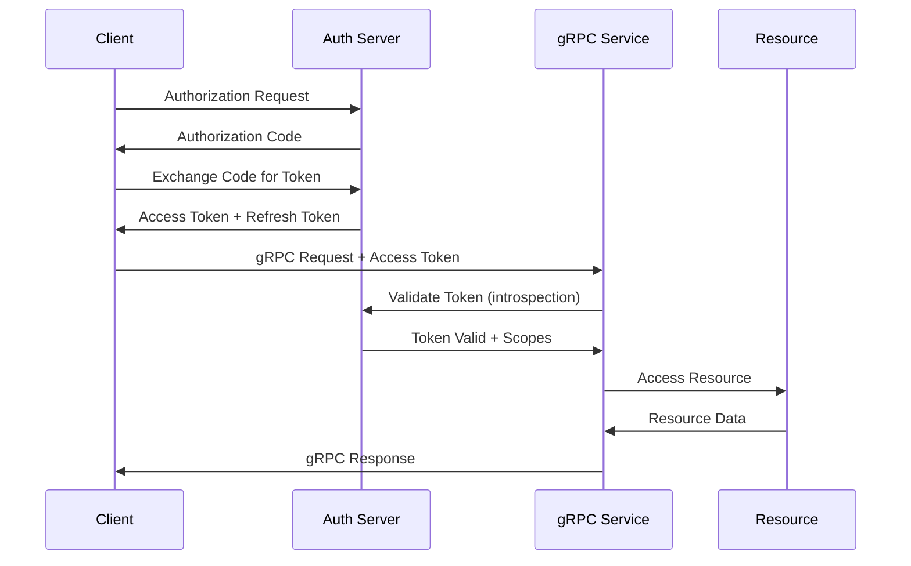
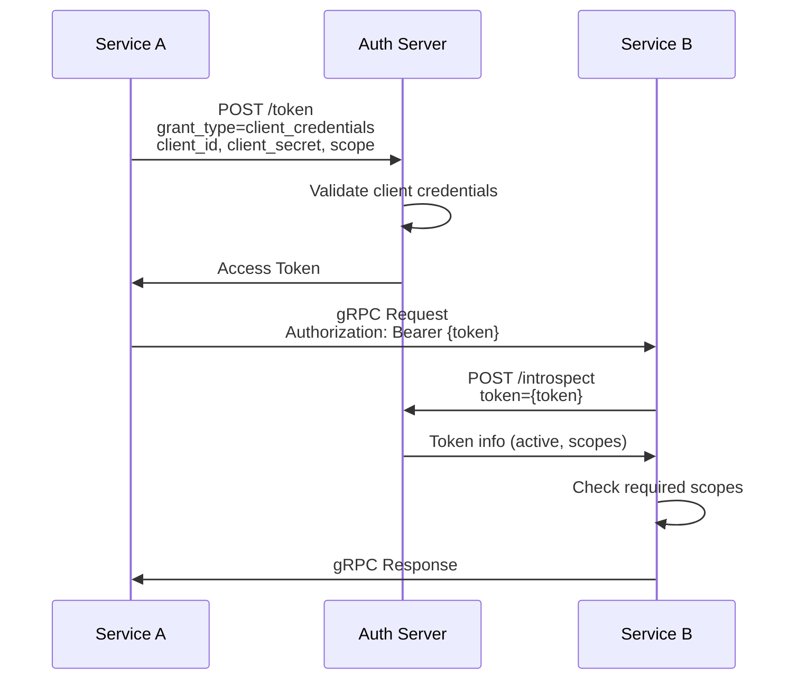
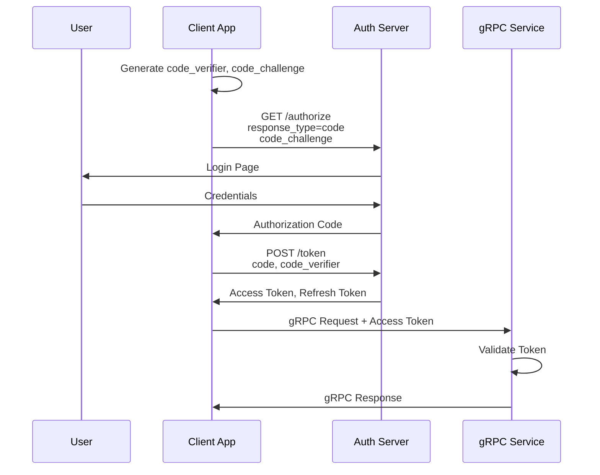

# How to Implement OAuth2 Authorization in gRPC

Author: [nawazdhandala](https://www.github.com/nawazdhandala)

Tags: gRPC, OAuth2, Authorization, Security, Identity Providers, Tokens, Scopes

Description: A comprehensive guide to implementing OAuth2 authorization in gRPC services, covering various OAuth2 flows, token introspection, scope-based access control, and integration with popular identity providers.

---

## Introduction

OAuth2 is the industry-standard protocol for authorization, enabling secure delegated access to resources. This guide covers implementing OAuth2 authorization in gRPC services, including different OAuth2 flows, token validation, scope-based authorization, and integration with identity providers like Keycloak, Auth0, and Okta.

## OAuth2 Overview for gRPC



### OAuth2 Flows Comparison

| Flow | Use Case | Security Level |
|------|----------|----------------|
| Authorization Code | Web apps with backend | High |
| Authorization Code + PKCE | Mobile/SPA apps | High |
| Client Credentials | Service-to-service | High |
| Resource Owner Password | Legacy/Trusted apps | Medium |

## Client Credentials Flow (Service-to-Service)

### OAuth2 Token Client in Go

```go
package oauth2

import (
    "context"
    "encoding/json"
    "fmt"
    "io/ioutil"
    "net/http"
    "net/url"
    "strings"
    "sync"
    "time"
)

// TokenResponse represents the OAuth2 token response
type TokenResponse struct {
    AccessToken  string `json:"access_token"`
    TokenType    string `json:"token_type"`
    ExpiresIn    int    `json:"expires_in"`
    RefreshToken string `json:"refresh_token,omitempty"`
    Scope        string `json:"scope,omitempty"`
}

// OAuth2Config holds OAuth2 configuration
type OAuth2Config struct {
    TokenURL     string
    ClientID     string
    ClientSecret string
    Scopes       []string
}

// TokenManager manages OAuth2 tokens with automatic refresh
type TokenManager struct {
    config      OAuth2Config
    token       *TokenResponse
    expiresAt   time.Time
    mu          sync.RWMutex
    httpClient  *http.Client
}

// NewTokenManager creates a new token manager
func NewTokenManager(config OAuth2Config) *TokenManager {
    return &TokenManager{
        config: config,
        httpClient: &http.Client{
            Timeout: 30 * time.Second,
        },
    }
}

// GetToken returns a valid access token, refreshing if necessary
func (tm *TokenManager) GetToken(ctx context.Context) (string, error) {
    tm.mu.RLock()
    if tm.token != nil && time.Now().Before(tm.expiresAt.Add(-30*time.Second)) {
        token := tm.token.AccessToken
        tm.mu.RUnlock()
        return token, nil
    }
    tm.mu.RUnlock()

    return tm.refreshToken(ctx)
}

func (tm *TokenManager) refreshToken(ctx context.Context) (string, error) {
    tm.mu.Lock()
    defer tm.mu.Unlock()

    // Double-check after acquiring write lock
    if tm.token != nil && time.Now().Before(tm.expiresAt.Add(-30*time.Second)) {
        return tm.token.AccessToken, nil
    }

    // Request new token using client credentials
    data := url.Values{}
    data.Set("grant_type", "client_credentials")
    data.Set("client_id", tm.config.ClientID)
    data.Set("client_secret", tm.config.ClientSecret)
    if len(tm.config.Scopes) > 0 {
        data.Set("scope", strings.Join(tm.config.Scopes, " "))
    }

    req, err := http.NewRequestWithContext(ctx, "POST", tm.config.TokenURL, strings.NewReader(data.Encode()))
    if err != nil {
        return "", fmt.Errorf("failed to create request: %v", err)
    }

    req.Header.Set("Content-Type", "application/x-www-form-urlencoded")

    resp, err := tm.httpClient.Do(req)
    if err != nil {
        return "", fmt.Errorf("failed to request token: %v", err)
    }
    defer resp.Body.Close()

    if resp.StatusCode != http.StatusOK {
        body, _ := ioutil.ReadAll(resp.Body)
        return "", fmt.Errorf("token request failed: %s - %s", resp.Status, string(body))
    }

    var tokenResp TokenResponse
    if err := json.NewDecoder(resp.Body).Decode(&tokenResp); err != nil {
        return "", fmt.Errorf("failed to decode token response: %v", err)
    }

    tm.token = &tokenResp
    tm.expiresAt = time.Now().Add(time.Duration(tokenResp.ExpiresIn) * time.Second)

    return tokenResp.AccessToken, nil
}

// OAuth2Credentials implements grpc.PerRPCCredentials
type OAuth2Credentials struct {
    tokenManager *TokenManager
    secure       bool
}

// NewOAuth2Credentials creates new OAuth2 credentials
func NewOAuth2Credentials(config OAuth2Config, secure bool) *OAuth2Credentials {
    return &OAuth2Credentials{
        tokenManager: NewTokenManager(config),
        secure:       secure,
    }
}

// GetRequestMetadata returns the authorization metadata
func (c *OAuth2Credentials) GetRequestMetadata(ctx context.Context, uri ...string) (map[string]string, error) {
    token, err := c.tokenManager.GetToken(ctx)
    if err != nil {
        return nil, err
    }

    return map[string]string{
        "authorization": "Bearer " + token,
    }, nil
}

// RequireTransportSecurity indicates whether TLS is required
func (c *OAuth2Credentials) RequireTransportSecurity() bool {
    return c.secure
}
```

### gRPC Client with OAuth2

```go
package main

import (
    "context"
    "log"
    "time"

    "google.golang.org/grpc"
    "google.golang.org/grpc/credentials"

    "your-module/oauth2"
    pb "your-module/proto"
)

func main() {
    // Configure OAuth2
    oauth2Config := oauth2.OAuth2Config{
        TokenURL:     "https://auth.example.com/oauth/token",
        ClientID:     "grpc-client",
        ClientSecret: "client-secret",
        Scopes:       []string{"read:users", "write:users"},
    }

    // Create OAuth2 credentials
    oauth2Creds := oauth2.NewOAuth2Credentials(oauth2Config, true)

    // Load TLS credentials
    tlsCreds, err := credentials.NewClientTLSFromFile("certs/ca.crt", "")
    if err != nil {
        log.Fatalf("Failed to load TLS credentials: %v", err)
    }

    // Connect with both TLS and OAuth2 credentials
    conn, err := grpc.Dial(
        "grpc.example.com:443",
        grpc.WithTransportCredentials(tlsCreds),
        grpc.WithPerRPCCredentials(oauth2Creds),
    )
    if err != nil {
        log.Fatalf("Failed to connect: %v", err)
    }
    defer conn.Close()

    // Make authenticated request
    client := pb.NewUserServiceClient(conn)

    ctx, cancel := context.WithTimeout(context.Background(), 10*time.Second)
    defer cancel()

    user, err := client.GetUser(ctx, &pb.GetUserRequest{UserId: "123"})
    if err != nil {
        log.Fatalf("GetUser failed: %v", err)
    }

    log.Printf("User: %+v", user)
}
```

## Token Introspection

### Token Introspection Service

```go
package oauth2

import (
    "context"
    "encoding/json"
    "fmt"
    "net/http"
    "net/url"
    "strings"
    "sync"
    "time"
)

// IntrospectionResponse represents the token introspection response
type IntrospectionResponse struct {
    Active    bool     `json:"active"`
    Scope     string   `json:"scope,omitempty"`
    ClientID  string   `json:"client_id,omitempty"`
    Username  string   `json:"username,omitempty"`
    TokenType string   `json:"token_type,omitempty"`
    Exp       int64    `json:"exp,omitempty"`
    Iat       int64    `json:"iat,omitempty"`
    Nbf       int64    `json:"nbf,omitempty"`
    Sub       string   `json:"sub,omitempty"`
    Aud       []string `json:"aud,omitempty"`
    Iss       string   `json:"iss,omitempty"`
    Jti       string   `json:"jti,omitempty"`

    // Custom claims
    Roles       []string `json:"roles,omitempty"`
    Permissions []string `json:"permissions,omitempty"`
}

// TokenIntrospector validates tokens using OAuth2 introspection
type TokenIntrospector struct {
    introspectionURL string
    clientID         string
    clientSecret     string
    httpClient       *http.Client
    cache            *tokenCache
}

type tokenCache struct {
    entries map[string]*cacheEntry
    mu      sync.RWMutex
    ttl     time.Duration
}

type cacheEntry struct {
    response  *IntrospectionResponse
    expiresAt time.Time
}

// NewTokenIntrospector creates a new token introspector
func NewTokenIntrospector(introspectionURL, clientID, clientSecret string, cacheTTL time.Duration) *TokenIntrospector {
    ti := &TokenIntrospector{
        introspectionURL: introspectionURL,
        clientID:         clientID,
        clientSecret:     clientSecret,
        httpClient: &http.Client{
            Timeout: 10 * time.Second,
        },
        cache: &tokenCache{
            entries: make(map[string]*cacheEntry),
            ttl:     cacheTTL,
        },
    }

    // Start cache cleanup goroutine
    go ti.cleanupCache()

    return ti
}

// Introspect validates a token and returns its claims
func (ti *TokenIntrospector) Introspect(ctx context.Context, token string) (*IntrospectionResponse, error) {
    // Check cache first
    if cached := ti.getCached(token); cached != nil {
        return cached, nil
    }

    // Make introspection request
    data := url.Values{}
    data.Set("token", token)
    data.Set("token_type_hint", "access_token")

    req, err := http.NewRequestWithContext(ctx, "POST", ti.introspectionURL, strings.NewReader(data.Encode()))
    if err != nil {
        return nil, fmt.Errorf("failed to create request: %v", err)
    }

    req.Header.Set("Content-Type", "application/x-www-form-urlencoded")
    req.SetBasicAuth(ti.clientID, ti.clientSecret)

    resp, err := ti.httpClient.Do(req)
    if err != nil {
        return nil, fmt.Errorf("introspection request failed: %v", err)
    }
    defer resp.Body.Close()

    if resp.StatusCode != http.StatusOK {
        return nil, fmt.Errorf("introspection failed with status: %d", resp.StatusCode)
    }

    var introspectResp IntrospectionResponse
    if err := json.NewDecoder(resp.Body).Decode(&introspectResp); err != nil {
        return nil, fmt.Errorf("failed to decode introspection response: %v", err)
    }

    // Cache valid tokens
    if introspectResp.Active {
        ti.cacheToken(token, &introspectResp)
    }

    return &introspectResp, nil
}

func (ti *TokenIntrospector) getCached(token string) *IntrospectionResponse {
    ti.cache.mu.RLock()
    defer ti.cache.mu.RUnlock()

    entry, ok := ti.cache.entries[token]
    if !ok || time.Now().After(entry.expiresAt) {
        return nil
    }

    return entry.response
}

func (ti *TokenIntrospector) cacheToken(token string, resp *IntrospectionResponse) {
    ti.cache.mu.Lock()
    defer ti.cache.mu.Unlock()

    // Calculate expiry based on token exp or cache TTL
    var expiresAt time.Time
    if resp.Exp > 0 {
        tokenExpiry := time.Unix(resp.Exp, 0)
        cacheTTLExpiry := time.Now().Add(ti.cache.ttl)
        if tokenExpiry.Before(cacheTTLExpiry) {
            expiresAt = tokenExpiry
        } else {
            expiresAt = cacheTTLExpiry
        }
    } else {
        expiresAt = time.Now().Add(ti.cache.ttl)
    }

    ti.cache.entries[token] = &cacheEntry{
        response:  resp,
        expiresAt: expiresAt,
    }
}

func (ti *TokenIntrospector) cleanupCache() {
    ticker := time.NewTicker(time.Minute)
    defer ticker.Stop()

    for range ticker.C {
        ti.cache.mu.Lock()
        now := time.Now()
        for token, entry := range ti.cache.entries {
            if now.After(entry.expiresAt) {
                delete(ti.cache.entries, token)
            }
        }
        ti.cache.mu.Unlock()
    }
}
```

## Scope-Based Authorization

### Scope Enforcement Interceptor

```go
package interceptors

import (
    "context"
    "strings"

    "google.golang.org/grpc"
    "google.golang.org/grpc/codes"
    "google.golang.org/grpc/metadata"
    "google.golang.org/grpc/status"

    "your-module/oauth2"
)

// Context key for token info
type contextKey string

const TokenInfoKey contextKey = "token_info"

// ScopeConfig defines required scopes for methods
type ScopeConfig struct {
    // MethodScopes maps full method names to required scopes
    MethodScopes map[string][]string

    // DefaultScopes are required for all methods not in MethodScopes
    DefaultScopes []string

    // PublicMethods don't require any scope
    PublicMethods []string
}

// OAuth2Interceptor handles OAuth2 token validation and scope enforcement
type OAuth2Interceptor struct {
    introspector *oauth2.TokenIntrospector
    config       ScopeConfig
}

// NewOAuth2Interceptor creates a new OAuth2 interceptor
func NewOAuth2Interceptor(introspector *oauth2.TokenIntrospector, config ScopeConfig) *OAuth2Interceptor {
    return &OAuth2Interceptor{
        introspector: introspector,
        config:       config,
    }
}

// Unary returns a unary interceptor
func (i *OAuth2Interceptor) Unary() grpc.UnaryServerInterceptor {
    return func(ctx context.Context, req interface{}, info *grpc.UnaryServerInfo, handler grpc.UnaryHandler) (interface{}, error) {
        // Check if method is public
        for _, method := range i.config.PublicMethods {
            if info.FullMethod == method {
                return handler(ctx, req)
            }
        }

        // Validate token and check scopes
        tokenInfo, err := i.validateAndAuthorize(ctx, info.FullMethod)
        if err != nil {
            return nil, err
        }

        // Add token info to context
        ctx = context.WithValue(ctx, TokenInfoKey, tokenInfo)

        return handler(ctx, req)
    }
}

// Stream returns a stream interceptor
func (i *OAuth2Interceptor) Stream() grpc.StreamServerInterceptor {
    return func(srv interface{}, ss grpc.ServerStream, info *grpc.StreamServerInfo, handler grpc.StreamHandler) error {
        // Check if method is public
        for _, method := range i.config.PublicMethods {
            if info.FullMethod == method {
                return handler(srv, ss)
            }
        }

        // Validate token and check scopes
        tokenInfo, err := i.validateAndAuthorize(ss.Context(), info.FullMethod)
        if err != nil {
            return err
        }

        // Wrap stream with authenticated context
        wrapped := &authenticatedStream{
            ServerStream: ss,
            ctx:          context.WithValue(ss.Context(), TokenInfoKey, tokenInfo),
        }

        return handler(srv, wrapped)
    }
}

func (i *OAuth2Interceptor) validateAndAuthorize(ctx context.Context, method string) (*oauth2.IntrospectionResponse, error) {
    // Extract token from metadata
    md, ok := metadata.FromIncomingContext(ctx)
    if !ok {
        return nil, status.Error(codes.Unauthenticated, "missing metadata")
    }

    authHeader := md.Get("authorization")
    if len(authHeader) == 0 {
        return nil, status.Error(codes.Unauthenticated, "missing authorization header")
    }

    token := strings.TrimPrefix(authHeader[0], "Bearer ")
    if token == authHeader[0] {
        return nil, status.Error(codes.Unauthenticated, "invalid authorization format")
    }

    // Introspect token
    tokenInfo, err := i.introspector.Introspect(ctx, token)
    if err != nil {
        return nil, status.Errorf(codes.Unauthenticated, "token validation failed: %v", err)
    }

    if !tokenInfo.Active {
        return nil, status.Error(codes.Unauthenticated, "token is not active")
    }

    // Check required scopes
    requiredScopes := i.getRequiredScopes(method)
    if len(requiredScopes) > 0 {
        tokenScopes := strings.Split(tokenInfo.Scope, " ")
        if !hasRequiredScopes(tokenScopes, requiredScopes) {
            return nil, status.Errorf(codes.PermissionDenied,
                "insufficient scope: required %v, got %v", requiredScopes, tokenScopes)
        }
    }

    return tokenInfo, nil
}

func (i *OAuth2Interceptor) getRequiredScopes(method string) []string {
    if scopes, ok := i.config.MethodScopes[method]; ok {
        return scopes
    }
    return i.config.DefaultScopes
}

func hasRequiredScopes(tokenScopes, requiredScopes []string) bool {
    scopeSet := make(map[string]bool)
    for _, scope := range tokenScopes {
        scopeSet[scope] = true
    }

    for _, required := range requiredScopes {
        if !scopeSet[required] {
            return false
        }
    }

    return true
}

type authenticatedStream struct {
    grpc.ServerStream
    ctx context.Context
}

func (s *authenticatedStream) Context() context.Context {
    return s.ctx
}
```

### Server Setup with Scope-Based Authorization

```go
package main

import (
    "log"
    "net"
    "time"

    "google.golang.org/grpc"

    "your-module/interceptors"
    "your-module/oauth2"
    pb "your-module/proto"
)

func main() {
    // Create token introspector
    introspector := oauth2.NewTokenIntrospector(
        "https://auth.example.com/oauth/introspect",
        "resource-server",
        "resource-server-secret",
        5*time.Minute, // Cache TTL
    )

    // Define scope configuration
    scopeConfig := interceptors.ScopeConfig{
        MethodScopes: map[string][]string{
            "/proto.UserService/GetUser":     {"read:users"},
            "/proto.UserService/ListUsers":   {"read:users"},
            "/proto.UserService/CreateUser":  {"write:users"},
            "/proto.UserService/UpdateUser":  {"write:users"},
            "/proto.UserService/DeleteUser":  {"delete:users", "admin"},
            "/proto.AdminService/GetStats":   {"admin"},
            "/proto.AdminService/ManageRoles": {"admin", "manage:roles"},
        },
        DefaultScopes: []string{},
        PublicMethods: []string{
            "/grpc.health.v1.Health/Check",
            "/proto.PublicService/GetPublicInfo",
        },
    }

    // Create OAuth2 interceptor
    oauth2Interceptor := interceptors.NewOAuth2Interceptor(introspector, scopeConfig)

    // Create gRPC server
    server := grpc.NewServer(
        grpc.ChainUnaryInterceptor(
            loggingInterceptor,
            oauth2Interceptor.Unary(),
        ),
        grpc.ChainStreamInterceptor(
            streamLoggingInterceptor,
            oauth2Interceptor.Stream(),
        ),
    )

    // Register services
    pb.RegisterUserServiceServer(server, NewUserService())
    pb.RegisterAdminServiceServer(server, NewAdminService())

    listener, err := net.Listen("tcp", ":50051")
    if err != nil {
        log.Fatalf("Failed to listen: %v", err)
    }

    log.Println("gRPC server with OAuth2 authorization listening on :50051")
    if err := server.Serve(listener); err != nil {
        log.Fatalf("Failed to serve: %v", err)
    }
}
```

## Integration with Identity Providers

### Keycloak Integration

```go
package keycloak

import (
    "context"
    "encoding/json"
    "fmt"
    "net/http"
    "net/url"
    "strings"
    "time"
)

// KeycloakConfig holds Keycloak configuration
type KeycloakConfig struct {
    BaseURL      string
    Realm        string
    ClientID     string
    ClientSecret string
}

// KeycloakClient provides Keycloak-specific OAuth2 operations
type KeycloakClient struct {
    config     KeycloakConfig
    httpClient *http.Client
}

// NewKeycloakClient creates a new Keycloak client
func NewKeycloakClient(config KeycloakConfig) *KeycloakClient {
    return &KeycloakClient{
        config: config,
        httpClient: &http.Client{
            Timeout: 30 * time.Second,
        },
    }
}

// GetTokenURL returns the token endpoint URL
func (k *KeycloakClient) GetTokenURL() string {
    return fmt.Sprintf("%s/realms/%s/protocol/openid-connect/token",
        k.config.BaseURL, k.config.Realm)
}

// GetIntrospectionURL returns the introspection endpoint URL
func (k *KeycloakClient) GetIntrospectionURL() string {
    return fmt.Sprintf("%s/realms/%s/protocol/openid-connect/token/introspect",
        k.config.BaseURL, k.config.Realm)
}

// GetUserInfoURL returns the userinfo endpoint URL
func (k *KeycloakClient) GetUserInfoURL() string {
    return fmt.Sprintf("%s/realms/%s/protocol/openid-connect/userinfo",
        k.config.BaseURL, k.config.Realm)
}

// KeycloakTokenResponse includes Keycloak-specific fields
type KeycloakTokenResponse struct {
    AccessToken      string `json:"access_token"`
    ExpiresIn        int    `json:"expires_in"`
    RefreshExpiresIn int    `json:"refresh_expires_in"`
    RefreshToken     string `json:"refresh_token"`
    TokenType        string `json:"token_type"`
    NotBeforePolicy  int    `json:"not-before-policy"`
    SessionState     string `json:"session_state"`
    Scope            string `json:"scope"`
}

// GetClientCredentialsToken obtains a token using client credentials
func (k *KeycloakClient) GetClientCredentialsToken(ctx context.Context, scopes []string) (*KeycloakTokenResponse, error) {
    data := url.Values{}
    data.Set("grant_type", "client_credentials")
    data.Set("client_id", k.config.ClientID)
    data.Set("client_secret", k.config.ClientSecret)
    if len(scopes) > 0 {
        data.Set("scope", strings.Join(scopes, " "))
    }

    req, err := http.NewRequestWithContext(ctx, "POST", k.GetTokenURL(), strings.NewReader(data.Encode()))
    if err != nil {
        return nil, err
    }

    req.Header.Set("Content-Type", "application/x-www-form-urlencoded")

    resp, err := k.httpClient.Do(req)
    if err != nil {
        return nil, err
    }
    defer resp.Body.Close()

    if resp.StatusCode != http.StatusOK {
        return nil, fmt.Errorf("token request failed: %s", resp.Status)
    }

    var tokenResp KeycloakTokenResponse
    if err := json.NewDecoder(resp.Body).Decode(&tokenResp); err != nil {
        return nil, err
    }

    return &tokenResp, nil
}

// KeycloakIntrospectionResponse includes Keycloak-specific claims
type KeycloakIntrospectionResponse struct {
    Active            bool     `json:"active"`
    Exp               int64    `json:"exp"`
    Iat               int64    `json:"iat"`
    Jti               string   `json:"jti"`
    Iss               string   `json:"iss"`
    Sub               string   `json:"sub"`
    Typ               string   `json:"typ"`
    Azp               string   `json:"azp"`
    PreferredUsername string   `json:"preferred_username"`
    Email             string   `json:"email"`
    EmailVerified     bool     `json:"email_verified"`
    Scope             string   `json:"scope"`
    ClientID          string   `json:"client_id"`

    // Realm roles
    RealmAccess struct {
        Roles []string `json:"roles"`
    } `json:"realm_access"`

    // Client roles
    ResourceAccess map[string]struct {
        Roles []string `json:"roles"`
    } `json:"resource_access"`
}

// IntrospectToken validates a token using Keycloak introspection
func (k *KeycloakClient) IntrospectToken(ctx context.Context, token string) (*KeycloakIntrospectionResponse, error) {
    data := url.Values{}
    data.Set("token", token)

    req, err := http.NewRequestWithContext(ctx, "POST", k.GetIntrospectionURL(), strings.NewReader(data.Encode()))
    if err != nil {
        return nil, err
    }

    req.Header.Set("Content-Type", "application/x-www-form-urlencoded")
    req.SetBasicAuth(k.config.ClientID, k.config.ClientSecret)

    resp, err := k.httpClient.Do(req)
    if err != nil {
        return nil, err
    }
    defer resp.Body.Close()

    var introspectResp KeycloakIntrospectionResponse
    if err := json.NewDecoder(resp.Body).Decode(&introspectResp); err != nil {
        return nil, err
    }

    return &introspectResp, nil
}

// HasRealmRole checks if the token has a specific realm role
func (r *KeycloakIntrospectionResponse) HasRealmRole(role string) bool {
    for _, r := range r.RealmAccess.Roles {
        if r == role {
            return true
        }
    }
    return false
}

// HasClientRole checks if the token has a specific client role
func (r *KeycloakIntrospectionResponse) HasClientRole(clientID, role string) bool {
    if access, ok := r.ResourceAccess[clientID]; ok {
        for _, r := range access.Roles {
            if r == role {
                return true
            }
        }
    }
    return false
}
```

### Auth0 Integration

```go
package auth0

import (
    "context"
    "encoding/json"
    "fmt"
    "net/http"
    "strings"
    "time"

    "github.com/golang-jwt/jwt/v5"
    "gopkg.in/square/go-jose.v2"
)

// Auth0Config holds Auth0 configuration
type Auth0Config struct {
    Domain       string
    Audience     string
    ClientID     string
    ClientSecret string
}

// Auth0Validator validates Auth0 tokens
type Auth0Validator struct {
    config     Auth0Config
    jwks       *jose.JSONWebKeySet
    httpClient *http.Client
    jwksURL    string
}

// NewAuth0Validator creates a new Auth0 validator
func NewAuth0Validator(config Auth0Config) (*Auth0Validator, error) {
    v := &Auth0Validator{
        config: config,
        httpClient: &http.Client{
            Timeout: 30 * time.Second,
        },
        jwksURL: fmt.Sprintf("https://%s/.well-known/jwks.json", config.Domain),
    }

    // Fetch JWKS
    if err := v.refreshJWKS(); err != nil {
        return nil, err
    }

    // Start background refresh
    go v.jwksRefreshLoop()

    return v, nil
}

func (v *Auth0Validator) refreshJWKS() error {
    resp, err := v.httpClient.Get(v.jwksURL)
    if err != nil {
        return err
    }
    defer resp.Body.Close()

    var jwks jose.JSONWebKeySet
    if err := json.NewDecoder(resp.Body).Decode(&jwks); err != nil {
        return err
    }

    v.jwks = &jwks
    return nil
}

func (v *Auth0Validator) jwksRefreshLoop() {
    ticker := time.NewTicker(1 * time.Hour)
    defer ticker.Stop()

    for range ticker.C {
        if err := v.refreshJWKS(); err != nil {
            fmt.Printf("Failed to refresh JWKS: %v\n", err)
        }
    }
}

// Auth0Claims represents Auth0 token claims
type Auth0Claims struct {
    Scope       string   `json:"scope"`
    Permissions []string `json:"permissions"`
    jwt.RegisteredClaims
}

// ValidateToken validates an Auth0 access token
func (v *Auth0Validator) ValidateToken(tokenString string) (*Auth0Claims, error) {
    token, err := jwt.ParseWithClaims(tokenString, &Auth0Claims{}, func(token *jwt.Token) (interface{}, error) {
        // Verify signing method
        if _, ok := token.Method.(*jwt.SigningMethodRSA); !ok {
            return nil, fmt.Errorf("unexpected signing method: %v", token.Header["alg"])
        }

        // Get key ID
        kid, ok := token.Header["kid"].(string)
        if !ok {
            return nil, fmt.Errorf("missing key ID in token header")
        }

        // Find key in JWKS
        keys := v.jwks.Key(kid)
        if len(keys) == 0 {
            return nil, fmt.Errorf("key not found: %s", kid)
        }

        return keys[0].Key, nil
    })

    if err != nil {
        return nil, err
    }

    claims, ok := token.Claims.(*Auth0Claims)
    if !ok || !token.Valid {
        return nil, fmt.Errorf("invalid token")
    }

    // Verify audience
    if !claims.VerifyAudience(v.config.Audience, true) {
        return nil, fmt.Errorf("invalid audience")
    }

    // Verify issuer
    expectedIssuer := fmt.Sprintf("https://%s/", v.config.Domain)
    if !claims.VerifyIssuer(expectedIssuer, true) {
        return nil, fmt.Errorf("invalid issuer")
    }

    return claims, nil
}

// HasScope checks if the token has a specific scope
func (c *Auth0Claims) HasScope(scope string) bool {
    scopes := strings.Split(c.Scope, " ")
    for _, s := range scopes {
        if s == scope {
            return true
        }
    }
    return false
}

// HasPermission checks if the token has a specific permission
func (c *Auth0Claims) HasPermission(permission string) bool {
    for _, p := range c.Permissions {
        if p == permission {
            return true
        }
    }
    return false
}
```

### Okta Integration

```go
package okta

import (
    "context"
    "encoding/json"
    "fmt"
    "net/http"
    "net/url"
    "strings"
    "time"

    "github.com/golang-jwt/jwt/v5"
)

// OktaConfig holds Okta configuration
type OktaConfig struct {
    Domain         string
    AuthServerID   string // Use "default" for org authorization server
    ClientID       string
    ClientSecret   string
    Audience       string
}

// OktaClient provides Okta-specific OAuth2 operations
type OktaClient struct {
    config     OktaConfig
    httpClient *http.Client
}

// NewOktaClient creates a new Okta client
func NewOktaClient(config OktaConfig) *OktaClient {
    return &OktaClient{
        config: config,
        httpClient: &http.Client{
            Timeout: 30 * time.Second,
        },
    }
}

func (o *OktaClient) getBaseURL() string {
    if o.config.AuthServerID == "" || o.config.AuthServerID == "default" {
        return fmt.Sprintf("https://%s/oauth2/default", o.config.Domain)
    }
    return fmt.Sprintf("https://%s/oauth2/%s", o.config.Domain, o.config.AuthServerID)
}

// GetTokenURL returns the token endpoint URL
func (o *OktaClient) GetTokenURL() string {
    return o.getBaseURL() + "/v1/token"
}

// GetIntrospectionURL returns the introspection endpoint URL
func (o *OktaClient) GetIntrospectionURL() string {
    return o.getBaseURL() + "/v1/introspect"
}

// GetJWKSURL returns the JWKS endpoint URL
func (o *OktaClient) GetJWKSURL() string {
    return o.getBaseURL() + "/v1/keys"
}

// OktaIntrospectionResponse represents Okta's introspection response
type OktaIntrospectionResponse struct {
    Active    bool     `json:"active"`
    Scope     string   `json:"scope"`
    Username  string   `json:"username"`
    Exp       int64    `json:"exp"`
    Iat       int64    `json:"iat"`
    Sub       string   `json:"sub"`
    Aud       string   `json:"aud"`
    Iss       string   `json:"iss"`
    Jti       string   `json:"jti"`
    TokenType string   `json:"token_type"`
    ClientID  string   `json:"client_id"`
    UID       string   `json:"uid"`

    // Custom claims (from Okta custom authorization server)
    Groups []string `json:"groups,omitempty"`
}

// IntrospectToken validates a token using Okta introspection
func (o *OktaClient) IntrospectToken(ctx context.Context, token string) (*OktaIntrospectionResponse, error) {
    data := url.Values{}
    data.Set("token", token)
    data.Set("token_type_hint", "access_token")

    req, err := http.NewRequestWithContext(ctx, "POST", o.GetIntrospectionURL(), strings.NewReader(data.Encode()))
    if err != nil {
        return nil, err
    }

    req.Header.Set("Content-Type", "application/x-www-form-urlencoded")
    req.Header.Set("Accept", "application/json")
    req.SetBasicAuth(o.config.ClientID, o.config.ClientSecret)

    resp, err := o.httpClient.Do(req)
    if err != nil {
        return nil, err
    }
    defer resp.Body.Close()

    if resp.StatusCode != http.StatusOK {
        return nil, fmt.Errorf("introspection failed: %s", resp.Status)
    }

    var introspectResp OktaIntrospectionResponse
    if err := json.NewDecoder(resp.Body).Decode(&introspectResp); err != nil {
        return nil, err
    }

    return &introspectResp, nil
}

// GetClientCredentialsToken obtains a token using client credentials
func (o *OktaClient) GetClientCredentialsToken(ctx context.Context, scopes []string) (*TokenResponse, error) {
    data := url.Values{}
    data.Set("grant_type", "client_credentials")
    data.Set("scope", strings.Join(scopes, " "))

    req, err := http.NewRequestWithContext(ctx, "POST", o.GetTokenURL(), strings.NewReader(data.Encode()))
    if err != nil {
        return nil, err
    }

    req.Header.Set("Content-Type", "application/x-www-form-urlencoded")
    req.Header.Set("Accept", "application/json")
    req.SetBasicAuth(o.config.ClientID, o.config.ClientSecret)

    resp, err := o.httpClient.Do(req)
    if err != nil {
        return nil, err
    }
    defer resp.Body.Close()

    if resp.StatusCode != http.StatusOK {
        return nil, fmt.Errorf("token request failed: %s", resp.Status)
    }

    var tokenResp TokenResponse
    if err := json.NewDecoder(resp.Body).Decode(&tokenResp); err != nil {
        return nil, err
    }

    return &tokenResp, nil
}

type TokenResponse struct {
    AccessToken string `json:"access_token"`
    TokenType   string `json:"token_type"`
    ExpiresIn   int    `json:"expires_in"`
    Scope       string `json:"scope"`
}
```

## Python OAuth2 Implementation

```python
import grpc
import requests
from datetime import datetime, timedelta
from typing import Optional, Dict, Any
import threading
import time

class OAuth2TokenManager:
    """Manages OAuth2 tokens with automatic refresh."""

    def __init__(self, token_url: str, client_id: str, client_secret: str, scopes: list = None):
        self.token_url = token_url
        self.client_id = client_id
        self.client_secret = client_secret
        self.scopes = scopes or []
        self._token = None
        self._expires_at = None
        self._lock = threading.Lock()

    def get_token(self) -> str:
        """Get a valid access token, refreshing if necessary."""
        with self._lock:
            if self._token and self._expires_at and datetime.now() < self._expires_at - timedelta(seconds=30):
                return self._token

            return self._refresh_token()

    def _refresh_token(self) -> str:
        """Request a new token using client credentials."""
        data = {
            'grant_type': 'client_credentials',
            'client_id': self.client_id,
            'client_secret': self.client_secret,
        }

        if self.scopes:
            data['scope'] = ' '.join(self.scopes)

        response = requests.post(self.token_url, data=data)
        response.raise_for_status()

        token_data = response.json()
        self._token = token_data['access_token']
        self._expires_at = datetime.now() + timedelta(seconds=token_data.get('expires_in', 3600))

        return self._token


class OAuth2CallCredentials(grpc.AuthMetadataPlugin):
    """gRPC call credentials using OAuth2 tokens."""

    def __init__(self, token_manager: OAuth2TokenManager):
        self.token_manager = token_manager

    def __call__(self, context, callback):
        try:
            token = self.token_manager.get_token()
            metadata = (('authorization', f'Bearer {token}'),)
            callback(metadata, None)
        except Exception as e:
            callback(None, e)


class TokenIntrospector:
    """Validates OAuth2 tokens using introspection."""

    def __init__(self, introspection_url: str, client_id: str, client_secret: str, cache_ttl: int = 300):
        self.introspection_url = introspection_url
        self.client_id = client_id
        self.client_secret = client_secret
        self.cache_ttl = cache_ttl
        self._cache = {}
        self._cache_lock = threading.Lock()

        # Start cache cleanup thread
        self._cleanup_thread = threading.Thread(target=self._cleanup_cache, daemon=True)
        self._cleanup_thread.start()

    def introspect(self, token: str) -> Optional[Dict[str, Any]]:
        """Validate a token and return its claims."""
        # Check cache
        with self._cache_lock:
            cached = self._cache.get(token)
            if cached and cached['expires_at'] > datetime.now():
                return cached['response']

        # Make introspection request
        response = requests.post(
            self.introspection_url,
            data={'token': token, 'token_type_hint': 'access_token'},
            auth=(self.client_id, self.client_secret)
        )

        if response.status_code != 200:
            return None

        introspection_response = response.json()

        # Cache valid tokens
        if introspection_response.get('active'):
            with self._cache_lock:
                self._cache[token] = {
                    'response': introspection_response,
                    'expires_at': datetime.now() + timedelta(seconds=self.cache_ttl)
                }

        return introspection_response

    def _cleanup_cache(self):
        """Periodically clean up expired cache entries."""
        while True:
            time.sleep(60)
            with self._cache_lock:
                now = datetime.now()
                self._cache = {k: v for k, v in self._cache.items() if v['expires_at'] > now}


class OAuth2ServerInterceptor(grpc.ServerInterceptor):
    """Server interceptor for OAuth2 token validation."""

    def __init__(self, introspector: TokenIntrospector, scope_config: Dict[str, list] = None, public_methods: list = None):
        self.introspector = introspector
        self.scope_config = scope_config or {}
        self.public_methods = public_methods or []

    def intercept_service(self, continuation, handler_call_details):
        method = handler_call_details.method

        # Skip public methods
        if method in self.public_methods:
            return continuation(handler_call_details)

        # Extract authorization header
        metadata = dict(handler_call_details.invocation_metadata)
        auth_header = metadata.get('authorization', '')

        if not auth_header.startswith('Bearer '):
            return self._unauthenticated('Missing or invalid authorization header')

        token = auth_header[7:]

        # Introspect token
        token_info = self.introspector.introspect(token)
        if not token_info or not token_info.get('active'):
            return self._unauthenticated('Token is not active')

        # Check scopes
        required_scopes = self.scope_config.get(method, [])
        if required_scopes:
            token_scopes = token_info.get('scope', '').split()
            if not all(scope in token_scopes for scope in required_scopes):
                return self._permission_denied(f'Insufficient scope: required {required_scopes}')

        return continuation(handler_call_details)

    def _unauthenticated(self, message: str):
        def abort(ignored_request, context):
            context.abort(grpc.StatusCode.UNAUTHENTICATED, message)
        return grpc.unary_unary_rpc_method_handler(abort)

    def _permission_denied(self, message: str):
        def abort(ignored_request, context):
            context.abort(grpc.StatusCode.PERMISSION_DENIED, message)
        return grpc.unary_unary_rpc_method_handler(abort)


# Example usage
def create_oauth2_channel(target: str, token_url: str, client_id: str, client_secret: str, scopes: list = None):
    """Create a gRPC channel with OAuth2 authentication."""
    token_manager = OAuth2TokenManager(token_url, client_id, client_secret, scopes)
    call_credentials = grpc.metadata_call_credentials(OAuth2CallCredentials(token_manager))

    # For production, use SSL
    # channel_credentials = grpc.ssl_channel_credentials()
    # composite_credentials = grpc.composite_channel_credentials(channel_credentials, call_credentials)
    # return grpc.secure_channel(target, composite_credentials)

    # For development
    channel = grpc.insecure_channel(target)
    return channel, call_credentials
```

## Authorization Flow Diagrams

### Client Credentials Flow



### Authorization Code Flow with PKCE



## Summary

Implementing OAuth2 authorization in gRPC services provides standardized, scalable access control. Key takeaways:

1. **Choose the Right Flow**: Use Client Credentials for service-to-service, Authorization Code + PKCE for user-facing apps
2. **Token Introspection**: Validate tokens using the authorization server's introspection endpoint
3. **Caching**: Cache introspection results to reduce latency and load on the auth server
4. **Scope-Based Authorization**: Define and enforce scopes at the method level
5. **Identity Provider Integration**: Use established providers like Keycloak, Auth0, or Okta
6. **Security**: Always use TLS, validate token expiration, and implement proper error handling

OAuth2 provides a robust foundation for securing gRPC services in modern distributed architectures.
