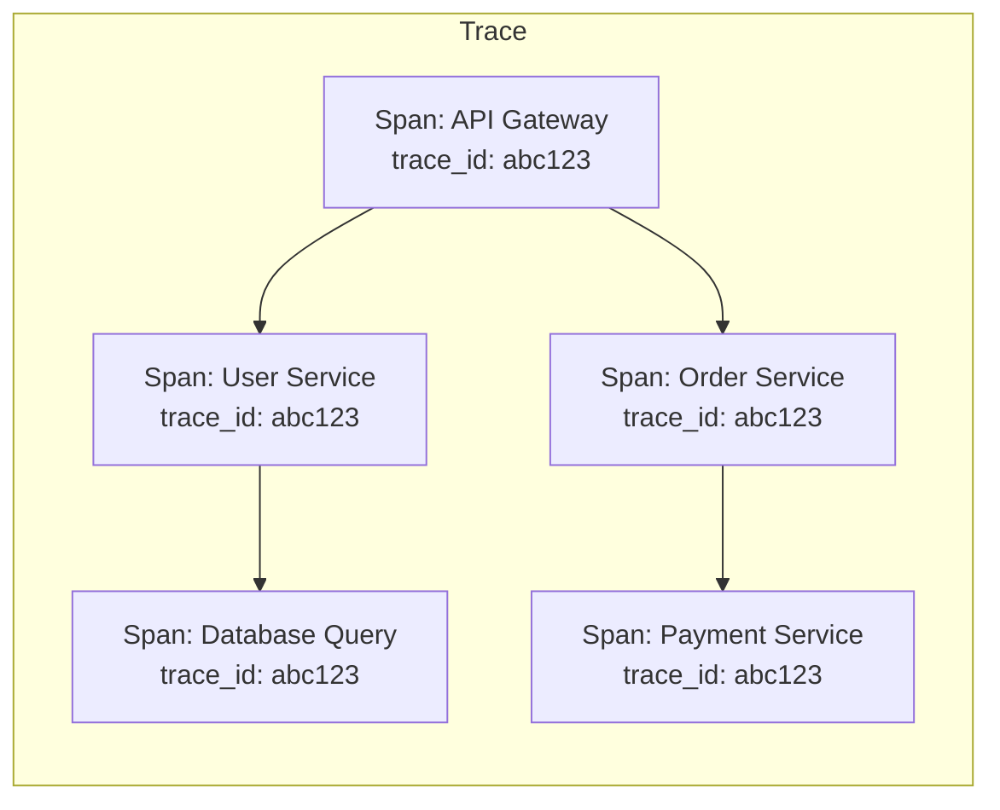
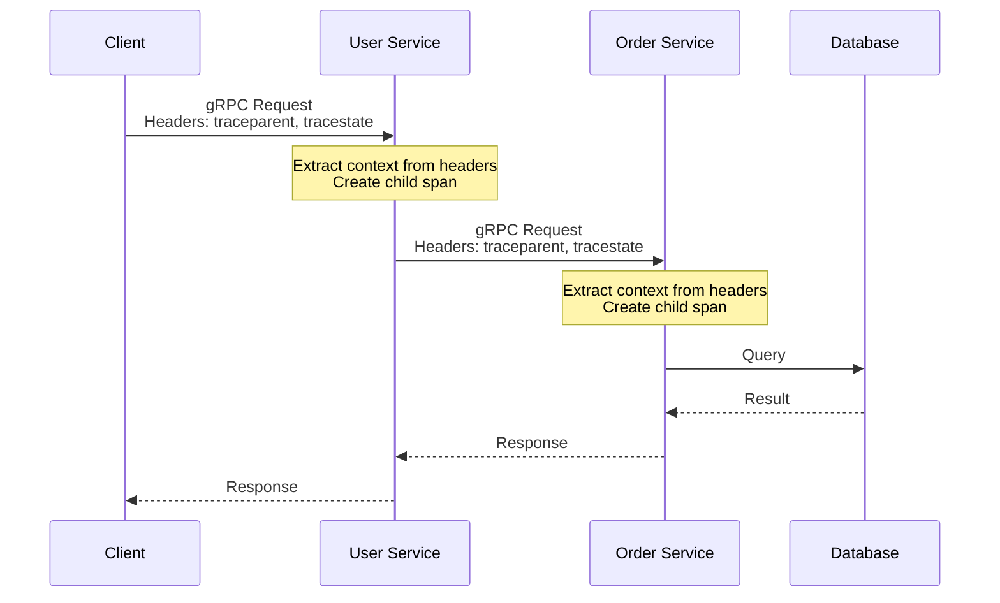

# How to Add Distributed Tracing to gRPC with OpenTelemetry

Author: [nawazdhandala](https://www.github.com/nawazdhandala)

Tags: gRPC, OpenTelemetry, Distributed Tracing, Observability, Microservices, Go, Node.js

Description: Learn how to implement distributed tracing in gRPC services using OpenTelemetry for end-to-end visibility across your microservices architecture.

---

Distributed tracing is essential for understanding request flow across microservices. When a single user request touches multiple gRPC services, tracing helps you identify bottlenecks, debug failures, and understand system behavior. OpenTelemetry provides a vendor-neutral standard for collecting and exporting traces.

## Understanding Distributed Tracing Concepts

Before diving into implementation, let's understand the key concepts:



- **Trace**: Represents the entire journey of a request through your system
- **Span**: Represents a single operation within a trace
- **Context Propagation**: Mechanism to pass trace context between services
- **Span Attributes**: Metadata attached to spans for filtering and analysis

## Setting Up OpenTelemetry SDK in Go

First, install the required dependencies:

```bash
go get go.opentelemetry.io/otel
go get go.opentelemetry.io/otel/sdk
go get go.opentelemetry.io/otel/exporters/otlp/otlptrace/otlptracegrpc
go get go.opentelemetry.io/contrib/instrumentation/google.golang.org/grpc/otelgrpc
```

Create a tracer provider configuration:

```go
package tracing

import (
    "context"
    "time"

    "go.opentelemetry.io/otel"
    "go.opentelemetry.io/otel/attribute"
    "go.opentelemetry.io/otel/exporters/otlp/otlptrace/otlptracegrpc"
    "go.opentelemetry.io/otel/propagation"
    "go.opentelemetry.io/otel/sdk/resource"
    sdktrace "go.opentelemetry.io/otel/sdk/trace"
    semconv "go.opentelemetry.io/otel/semconv/v1.21.0"
)

type TracerConfig struct {
    ServiceName    string
    ServiceVersion string
    Environment    string
    OTLPEndpoint   string
    SampleRate     float64
}

func InitTracer(cfg TracerConfig) (*sdktrace.TracerProvider, error) {
    ctx := context.Background()

    // Create OTLP exporter
    exporter, err := otlptracegrpc.New(ctx,
        otlptracegrpc.WithEndpoint(cfg.OTLPEndpoint),
        otlptracegrpc.WithInsecure(), // Use WithTLSCredentials in production
    )
    if err != nil {
        return nil, err
    }

    // Create resource with service information
    res, err := resource.New(ctx,
        resource.WithAttributes(
            semconv.ServiceName(cfg.ServiceName),
            semconv.ServiceVersion(cfg.ServiceVersion),
            attribute.String("environment", cfg.Environment),
        ),
        resource.WithHost(),
        resource.WithProcess(),
    )
    if err != nil {
        return nil, err
    }

    // Configure sampler based on sample rate
    var sampler sdktrace.Sampler
    if cfg.SampleRate >= 1.0 {
        sampler = sdktrace.AlwaysSample()
    } else if cfg.SampleRate <= 0 {
        sampler = sdktrace.NeverSample()
    } else {
        sampler = sdktrace.TraceIDRatioBased(cfg.SampleRate)
    }

    // Create TracerProvider
    tp := sdktrace.NewTracerProvider(
        sdktrace.WithBatcher(exporter,
            sdktrace.WithBatchTimeout(5*time.Second),
            sdktrace.WithMaxExportBatchSize(512),
        ),
        sdktrace.WithResource(res),
        sdktrace.WithSampler(sampler),
    )

    // Set global TracerProvider and Propagator
    otel.SetTracerProvider(tp)
    otel.SetTextMapPropagator(propagation.NewCompositeTextMapPropagator(
        propagation.TraceContext{},
        propagation.Baggage{},
    ))

    return tp, nil
}
```

## Instrumenting gRPC Server with Interceptors

Add OpenTelemetry interceptors to your gRPC server:

```go
package main

import (
    "context"
    "log"
    "net"

    "go.opentelemetry.io/contrib/instrumentation/google.golang.org/grpc/otelgrpc"
    "google.golang.org/grpc"

    pb "your-project/proto"
    "your-project/tracing"
)

type userServer struct {
    pb.UnimplementedUserServiceServer
}

func (s *userServer) GetUser(ctx context.Context, req *pb.GetUserRequest) (*pb.User, error) {
    // The span is automatically created by the interceptor
    // You can add custom attributes to the current span
    span := trace.SpanFromContext(ctx)
    span.SetAttributes(
        attribute.String("user.id", req.GetUserId()),
        attribute.String("request.type", "get_user"),
    )

    // Your business logic here
    user, err := s.fetchUserFromDB(ctx, req.GetUserId())
    if err != nil {
        span.RecordError(err)
        span.SetStatus(codes.Error, err.Error())
        return nil, err
    }

    span.SetAttributes(attribute.String("user.email", user.Email))
    return user, nil
}

func main() {
    // Initialize tracer
    tp, err := tracing.InitTracer(tracing.TracerConfig{
        ServiceName:    "user-service",
        ServiceVersion: "1.0.0",
        Environment:    "production",
        OTLPEndpoint:   "otel-collector:4317",
        SampleRate:     0.1, // Sample 10% of traces
    })
    if err != nil {
        log.Fatal(err)
    }
    defer tp.Shutdown(context.Background())

    // Create gRPC server with OpenTelemetry interceptors
    server := grpc.NewServer(
        grpc.StatsHandler(otelgrpc.NewServerHandler(
            otelgrpc.WithMessageEvents(otelgrpc.ReceivedEvents, otelgrpc.SentEvents),
        )),
    )

    pb.RegisterUserServiceServer(server, &userServer{})

    lis, err := net.Listen("tcp", ":50051")
    if err != nil {
        log.Fatal(err)
    }

    log.Println("Server starting on :50051")
    if err := server.Serve(lis); err != nil {
        log.Fatal(err)
    }
}
```

## Instrumenting gRPC Client

Configure the client to propagate trace context:

```go
package main

import (
    "context"
    "log"
    "time"

    "go.opentelemetry.io/contrib/instrumentation/google.golang.org/grpc/otelgrpc"
    "go.opentelemetry.io/otel"
    "go.opentelemetry.io/otel/attribute"
    "go.opentelemetry.io/otel/trace"
    "google.golang.org/grpc"
    "google.golang.org/grpc/credentials/insecure"

    pb "your-project/proto"
    "your-project/tracing"
)

func main() {
    // Initialize tracer
    tp, err := tracing.InitTracer(tracing.TracerConfig{
        ServiceName:    "api-gateway",
        ServiceVersion: "1.0.0",
        Environment:    "production",
        OTLPEndpoint:   "otel-collector:4317",
        SampleRate:     0.1,
    })
    if err != nil {
        log.Fatal(err)
    }
    defer tp.Shutdown(context.Background())

    // Create gRPC connection with OpenTelemetry interceptors
    conn, err := grpc.NewClient("user-service:50051",
        grpc.WithTransportCredentials(insecure.NewCredentials()),
        grpc.WithStatsHandler(otelgrpc.NewClientHandler()),
    )
    if err != nil {
        log.Fatal(err)
    }
    defer conn.Close()

    client := pb.NewUserServiceClient(conn)

    // Create a parent span for the operation
    tracer := otel.Tracer("api-gateway")
    ctx, span := tracer.Start(context.Background(), "HandleGetUserRequest",
        trace.WithAttributes(
            attribute.String("http.method", "GET"),
            attribute.String("http.route", "/api/users/:id"),
        ),
    )
    defer span.End()

    // Make gRPC call - trace context is automatically propagated
    user, err := client.GetUser(ctx, &pb.GetUserRequest{UserId: "user-123"})
    if err != nil {
        span.RecordError(err)
        log.Printf("Error: %v", err)
        return
    }

    log.Printf("User: %v", user)
}
```

## Context Propagation Deep Dive

Understanding how context flows through your services:



### Custom Context Propagation

For scenarios where automatic propagation isn't available:

```go
package tracing

import (
    "context"

    "go.opentelemetry.io/otel"
    "go.opentelemetry.io/otel/propagation"
    "google.golang.org/grpc/metadata"
)

// InjectTraceContext injects trace context into gRPC metadata
func InjectTraceContext(ctx context.Context) context.Context {
    md, ok := metadata.FromOutgoingContext(ctx)
    if !ok {
        md = metadata.New(nil)
    }

    propagator := otel.GetTextMapPropagator()
    carrier := &metadataCarrier{md: md}
    propagator.Inject(ctx, carrier)

    return metadata.NewOutgoingContext(ctx, carrier.md)
}

// ExtractTraceContext extracts trace context from gRPC metadata
func ExtractTraceContext(ctx context.Context) context.Context {
    md, ok := metadata.FromIncomingContext(ctx)
    if !ok {
        return ctx
    }

    propagator := otel.GetTextMapPropagator()
    carrier := &metadataCarrier{md: md}
    return propagator.Extract(ctx, carrier)
}

// metadataCarrier implements propagation.TextMapCarrier
type metadataCarrier struct {
    md metadata.MD
}

func (c *metadataCarrier) Get(key string) string {
    values := c.md.Get(key)
    if len(values) > 0 {
        return values[0]
    }
    return ""
}

func (c *metadataCarrier) Set(key, value string) {
    c.md.Set(key, value)
}

func (c *metadataCarrier) Keys() []string {
    keys := make([]string, 0, len(c.md))
    for k := range c.md {
        keys = append(keys, k)
    }
    return keys
}
```

## Adding Custom Span Attributes

Enrich your traces with business-relevant information:

```go
package tracing

import (
    "context"

    "go.opentelemetry.io/otel/attribute"
    "go.opentelemetry.io/otel/trace"
)

// Common attribute keys for gRPC services
var (
    UserIDKey      = attribute.Key("user.id")
    TenantIDKey    = attribute.Key("tenant.id")
    RequestIDKey   = attribute.Key("request.id")
    OperationKey   = attribute.Key("operation.name")
    ResultCountKey = attribute.Key("result.count")
)

// AddUserAttributes adds user-related attributes to the current span
func AddUserAttributes(ctx context.Context, userID, tenantID string) {
    span := trace.SpanFromContext(ctx)
    span.SetAttributes(
        UserIDKey.String(userID),
        TenantIDKey.String(tenantID),
    )
}

// AddBusinessEvent records a business event in the trace
func AddBusinessEvent(ctx context.Context, name string, attrs ...attribute.KeyValue) {
    span := trace.SpanFromContext(ctx)
    span.AddEvent(name, trace.WithAttributes(attrs...))
}

// Example usage in a service method
func (s *orderServer) CreateOrder(ctx context.Context, req *pb.CreateOrderRequest) (*pb.Order, error) {
    span := trace.SpanFromContext(ctx)

    // Add request attributes
    span.SetAttributes(
        attribute.String("order.customer_id", req.CustomerId),
        attribute.Int("order.item_count", len(req.Items)),
        attribute.Float64("order.total_amount", req.TotalAmount),
    )

    // Record business events
    AddBusinessEvent(ctx, "order.validation.started")

    if err := s.validateOrder(ctx, req); err != nil {
        span.RecordError(err)
        AddBusinessEvent(ctx, "order.validation.failed",
            attribute.String("error.reason", err.Error()),
        )
        return nil, err
    }

    AddBusinessEvent(ctx, "order.validation.completed")

    // Create order
    order, err := s.orderRepo.Create(ctx, req)
    if err != nil {
        span.RecordError(err)
        return nil, err
    }

    span.SetAttributes(attribute.String("order.id", order.Id))
    AddBusinessEvent(ctx, "order.created",
        attribute.String("order.id", order.Id),
    )

    return order, nil
}
```

## Configuring Different Exporters

### OTLP Exporter (Recommended)

```go
import "go.opentelemetry.io/otel/exporters/otlp/otlptrace/otlptracegrpc"

exporter, err := otlptracegrpc.New(ctx,
    otlptracegrpc.WithEndpoint("otel-collector:4317"),
    otlptracegrpc.WithHeaders(map[string]string{
        "Authorization": "Bearer " + apiKey,
    }),
    otlptracegrpc.WithCompressor("gzip"),
    otlptracegrpc.WithRetry(otlptracegrpc.RetryConfig{
        Enabled:         true,
        InitialInterval: 1 * time.Second,
        MaxInterval:     30 * time.Second,
        MaxElapsedTime:  1 * time.Minute,
    }),
)
```

### Jaeger Exporter

```go
import "go.opentelemetry.io/otel/exporters/jaeger"

exporter, err := jaeger.New(
    jaeger.WithCollectorEndpoint(
        jaeger.WithEndpoint("http://jaeger:14268/api/traces"),
    ),
)
```

### Console Exporter (Development)

```go
import "go.opentelemetry.io/otel/exporters/stdout/stdouttrace"

exporter, err := stdouttrace.New(
    stdouttrace.WithPrettyPrint(),
)
```

## Node.js Implementation

For Node.js gRPC services:

```javascript
// tracing.js
const { NodeSDK } = require('@opentelemetry/sdk-node');
const { getNodeAutoInstrumentations } = require('@opentelemetry/auto-instrumentations-node');
const { OTLPTraceExporter } = require('@opentelemetry/exporter-trace-otlp-grpc');
const { Resource } = require('@opentelemetry/resources');
const { SemanticResourceAttributes } = require('@opentelemetry/semantic-conventions');

const sdk = new NodeSDK({
  resource: new Resource({
    [SemanticResourceAttributes.SERVICE_NAME]: 'user-service',
    [SemanticResourceAttributes.SERVICE_VERSION]: '1.0.0',
    environment: process.env.NODE_ENV || 'development',
  }),
  traceExporter: new OTLPTraceExporter({
    url: process.env.OTEL_EXPORTER_OTLP_ENDPOINT || 'http://otel-collector:4317',
  }),
  instrumentations: [
    getNodeAutoInstrumentations({
      '@opentelemetry/instrumentation-grpc': {
        enabled: true,
      },
    }),
  ],
});

sdk.start();

process.on('SIGTERM', () => {
  sdk.shutdown()
    .then(() => console.log('Tracing terminated'))
    .catch((error) => console.log('Error terminating tracing', error))
    .finally(() => process.exit(0));
});

module.exports = sdk;
```

```javascript
// server.js
require('./tracing'); // Must be first import

const grpc = require('@grpc/grpc-js');
const protoLoader = require('@grpc/proto-loader');
const { trace, context, SpanStatusCode } = require('@opentelemetry/api');

const tracer = trace.getTracer('user-service');

const packageDefinition = protoLoader.loadSync('user.proto');
const userProto = grpc.loadPackageDefinition(packageDefinition).user;

async function getUser(call, callback) {
  const span = trace.getSpan(context.active());

  try {
    span.setAttribute('user.id', call.request.userId);

    // Add custom event
    span.addEvent('fetching_user_from_database');

    const user = await fetchUserFromDB(call.request.userId);

    span.setAttribute('user.found', true);
    callback(null, user);
  } catch (error) {
    span.recordException(error);
    span.setStatus({ code: SpanStatusCode.ERROR, message: error.message });
    callback(error);
  }
}

const server = new grpc.Server();
server.addService(userProto.UserService.service, { getUser });
server.bindAsync('0.0.0.0:50051', grpc.ServerCredentials.createInsecure(), () => {
  console.log('Server running on port 50051');
});
```

## OpenTelemetry Collector Configuration

Deploy an OpenTelemetry Collector to receive, process, and export traces:

```yaml
# otel-collector-config.yaml
receivers:
  otlp:
    protocols:
      grpc:
        endpoint: 0.0.0.0:4317
      http:
        endpoint: 0.0.0.0:4318

processors:
  batch:
    timeout: 5s
    send_batch_size: 512

  memory_limiter:
    check_interval: 1s
    limit_mib: 1000
    spike_limit_mib: 200

  attributes:
    actions:
      - key: environment
        value: production
        action: upsert

exporters:
  otlp:
    endpoint: jaeger:4317
    tls:
      insecure: true

  logging:
    loglevel: debug

service:
  pipelines:
    traces:
      receivers: [otlp]
      processors: [memory_limiter, batch, attributes]
      exporters: [otlp, logging]
```

## Kubernetes Deployment

```yaml
apiVersion: apps/v1
kind: Deployment
metadata:
  name: user-service
spec:
  replicas: 3
  selector:
    matchLabels:
      app: user-service
  template:
    metadata:
      labels:
        app: user-service
    spec:
      containers:
      - name: user-service
        image: user-service:latest
        env:
        - name: OTEL_EXPORTER_OTLP_ENDPOINT
          value: "otel-collector:4317"
        - name: OTEL_SERVICE_NAME
          value: "user-service"
        - name: OTEL_TRACES_SAMPLER
          value: "parentbased_traceidratio"
        - name: OTEL_TRACES_SAMPLER_ARG
          value: "0.1"
        - name: OTEL_RESOURCE_ATTRIBUTES
          value: "service.namespace=production,service.instance.id=$(POD_NAME)"
        - name: POD_NAME
          valueFrom:
            fieldRef:
              fieldPath: metadata.name
```

## Sampling Strategies

Choose the right sampling strategy for your needs:

```go
package tracing

import (
    sdktrace "go.opentelemetry.io/otel/sdk/trace"
)

// AlwaysSample - Use in development or for critical paths
func AlwaysSampleStrategy() sdktrace.Sampler {
    return sdktrace.AlwaysSample()
}

// RatioBased - Sample a percentage of traces
func RatioBasedStrategy(fraction float64) sdktrace.Sampler {
    return sdktrace.TraceIDRatioBased(fraction)
}

// ParentBased - Respect parent sampling decision
func ParentBasedStrategy(root sdktrace.Sampler) sdktrace.Sampler {
    return sdktrace.ParentBased(root,
        sdktrace.WithLocalParentSampled(sdktrace.AlwaysSample()),
        sdktrace.WithLocalParentNotSampled(sdktrace.NeverSample()),
        sdktrace.WithRemoteParentSampled(sdktrace.AlwaysSample()),
        sdktrace.WithRemoteParentNotSampled(sdktrace.NeverSample()),
    )
}

// Custom sampler for specific conditions
type conditionalSampler struct {
    highPrioritySampler sdktrace.Sampler
    defaultSampler      sdktrace.Sampler
}

func (s *conditionalSampler) ShouldSample(p sdktrace.SamplingParameters) sdktrace.SamplingResult {
    // Always sample errors or high-priority requests
    for _, attr := range p.Attributes {
        if attr.Key == "priority" && attr.Value.AsString() == "high" {
            return s.highPrioritySampler.ShouldSample(p)
        }
    }
    return s.defaultSampler.ShouldSample(p)
}

func (s *conditionalSampler) Description() string {
    return "ConditionalSampler"
}
```

## Best Practices

1. **Use Semantic Conventions**: Follow OpenTelemetry semantic conventions for attribute names
2. **Don't Over-Instrument**: Focus on meaningful operations, not every function call
3. **Sample Appropriately**: Use lower sample rates in production to manage costs
4. **Add Business Context**: Include attributes that help with debugging (user ID, tenant ID)
5. **Handle Errors Properly**: Always record errors and set span status
6. **Use Baggage Sparingly**: Baggage propagates to all downstream services, keep it minimal
7. **Configure Timeouts**: Set appropriate timeouts for exporters to prevent blocking

## Conclusion

OpenTelemetry provides a powerful, vendor-neutral way to add distributed tracing to your gRPC services. With proper instrumentation, you gain visibility into request flow, can identify performance bottlenecks, and debug issues across your microservices architecture. Start with basic instrumentation using the gRPC interceptors, then gradually add custom spans and attributes as needed.
