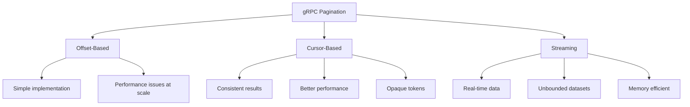
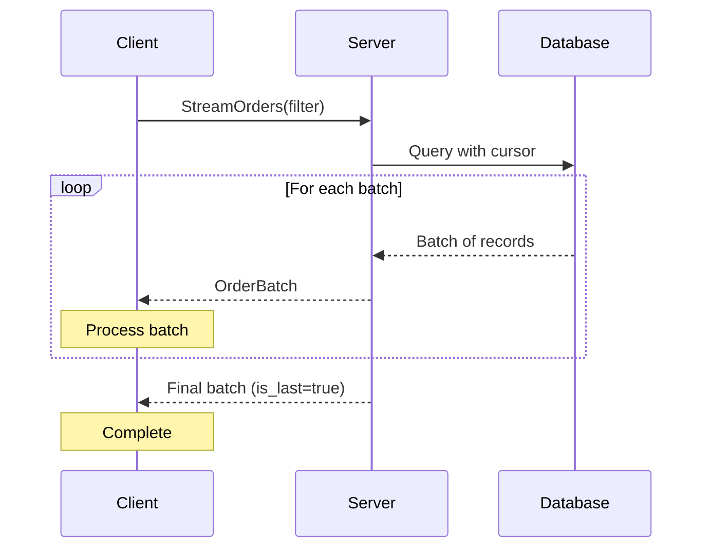

# How to Implement Pagination in gRPC Services

Author: [nawazdhandala](https://www.github.com/nawazdhandala)

Tags: gRPC, pagination, cursor-based pagination, page tokens, protocol buffers, streaming, API design

Description: Learn how to implement efficient pagination in gRPC services using cursor-based pagination, page tokens, and streaming for large datasets.

---

Pagination is essential for APIs that return large datasets. Unlike REST APIs where pagination patterns are well-established, gRPC offers multiple approaches including traditional page tokens, cursor-based pagination, and streaming. This guide covers all these patterns with practical implementations and best practices for handling large datasets efficiently.

## Pagination Approaches in gRPC



| Approach | Best For | Limitations |
|----------|----------|-------------|
| Offset-Based | Small datasets, simple UIs | Slow on large tables, inconsistent with updates |
| Cursor-Based | Large datasets, consistency needed | Complex implementation, no random access |
| Streaming | Very large or real-time data | Client must handle stream |

## Protocol Buffer Design Patterns

### Basic Pagination Messages

```protobuf
// pagination.proto
syntax = "proto3";

package pagination;

option go_package = "github.com/example/pagination";

import "google/protobuf/timestamp.proto";

// Generic pagination request parameters
message PaginationRequest {
    int32 page_size = 1;        // Number of items per page (max 100)
    string page_token = 2;       // Opaque token for next page
}

// Generic pagination response metadata
message PaginationResponse {
    string next_page_token = 1;  // Token for next page (empty if last page)
    string prev_page_token = 2;  // Token for previous page (optional)
    int32 total_count = 3;       // Total number of items (optional, can be expensive)
    bool has_more = 4;           // Whether more pages exist
}

// Example: User listing service
service UserService {
    // List users with pagination
    rpc ListUsers(ListUsersRequest) returns (ListUsersResponse);

    // Stream users for large datasets
    rpc StreamUsers(StreamUsersRequest) returns (stream User);

    // Get user by ID
    rpc GetUser(GetUserRequest) returns (User);
}

message User {
    string id = 1;
    string email = 2;
    string name = 3;
    google.protobuf.Timestamp created_at = 4;
    google.protobuf.Timestamp updated_at = 5;
}

message ListUsersRequest {
    // Pagination
    int32 page_size = 1;
    string page_token = 2;

    // Filtering
    string filter = 3;           // e.g., "status=active"

    // Sorting
    string order_by = 4;         // e.g., "created_at desc"

    // Field mask for partial responses
    repeated string fields = 5;   // e.g., ["id", "name", "email"]
}

message ListUsersResponse {
    repeated User users = 1;

    // Pagination metadata
    string next_page_token = 2;
    int32 total_size = 3;        // Total matching users
}

message StreamUsersRequest {
    string filter = 1;
    string order_by = 2;
    int32 batch_size = 3;        // Hint for server batching
}

message GetUserRequest {
    string id = 1;
}
```

### Advanced Pagination with Cursors

```protobuf
// cursor_pagination.proto
syntax = "proto3";

package pagination;

import "google/protobuf/timestamp.proto";

// Cursor-based pagination for orders
service OrderService {
    rpc ListOrders(ListOrdersRequest) returns (ListOrdersResponse);
    rpc StreamOrders(StreamOrdersRequest) returns (stream OrderBatch);
}

message Order {
    string id = 1;
    string customer_id = 2;
    double total_amount = 3;
    OrderStatus status = 4;
    google.protobuf.Timestamp created_at = 5;
}

enum OrderStatus {
    ORDER_STATUS_UNSPECIFIED = 0;
    ORDER_STATUS_PENDING = 1;
    ORDER_STATUS_PROCESSING = 2;
    ORDER_STATUS_SHIPPED = 3;
    ORDER_STATUS_DELIVERED = 4;
    ORDER_STATUS_CANCELLED = 5;
}

message ListOrdersRequest {
    // Cursor-based pagination
    int32 first = 1;             // Get first N items after cursor
    string after = 2;            // Cursor to start after
    int32 last = 3;              // Get last N items before cursor
    string before = 4;           // Cursor to end before

    // Filters
    string customer_id = 5;
    repeated OrderStatus statuses = 6;
    google.protobuf.Timestamp created_after = 7;
    google.protobuf.Timestamp created_before = 8;

    // Sorting
    OrderSortField sort_by = 9;
    SortDirection sort_direction = 10;
}

enum OrderSortField {
    ORDER_SORT_FIELD_UNSPECIFIED = 0;
    ORDER_SORT_FIELD_CREATED_AT = 1;
    ORDER_SORT_FIELD_TOTAL_AMOUNT = 2;
    ORDER_SORT_FIELD_STATUS = 3;
}

enum SortDirection {
    SORT_DIRECTION_UNSPECIFIED = 0;
    SORT_DIRECTION_ASC = 1;
    SORT_DIRECTION_DESC = 2;
}

message ListOrdersResponse {
    repeated OrderEdge edges = 1;
    PageInfo page_info = 2;
    int32 total_count = 3;
}

// GraphQL-style edge containing cursor
message OrderEdge {
    Order node = 1;
    string cursor = 2;
}

// Page metadata
message PageInfo {
    bool has_next_page = 1;
    bool has_previous_page = 2;
    string start_cursor = 3;
    string end_cursor = 4;
}

// For streaming large datasets
message StreamOrdersRequest {
    string customer_id = 1;
    repeated OrderStatus statuses = 2;
    int32 batch_size = 3;        // Items per batch
}

message OrderBatch {
    repeated Order orders = 1;
    bool is_last_batch = 2;
    int32 batch_number = 3;
}
```

## Server Implementation

### Cursor-Based Pagination Server

```go
// server/pagination_server.go
package server

import (
    "context"
    "encoding/base64"
    "encoding/json"
    "fmt"
    "sort"
    "time"

    pb "github.com/example/pagination"
    "google.golang.org/grpc/codes"
    "google.golang.org/grpc/status"
    "google.golang.org/protobuf/types/known/timestamppb"
)

const (
    DefaultPageSize = 20
    MaxPageSize     = 100
)

// Cursor represents the pagination cursor
type Cursor struct {
    ID        string    `json:"id"`
    CreatedAt time.Time `json:"created_at"`
    SortValue string    `json:"sort_value,omitempty"`
}

// EncodeCursor encodes cursor to base64 string
func EncodeCursor(c *Cursor) string {
    data, _ := json.Marshal(c)
    return base64.URLEncoding.EncodeToString(data)
}

// DecodeCursor decodes base64 string to cursor
func DecodeCursor(s string) (*Cursor, error) {
    if s == "" {
        return nil, nil
    }

    data, err := base64.URLEncoding.DecodeString(s)
    if err != nil {
        return nil, fmt.Errorf("invalid cursor format")
    }

    var cursor Cursor
    if err := json.Unmarshal(data, &cursor); err != nil {
        return nil, fmt.Errorf("invalid cursor data")
    }

    return &cursor, nil
}

type OrderServer struct {
    pb.UnimplementedOrderServiceServer
    orders []*pb.Order // In-memory store for demo
}

func NewOrderServer() *OrderServer {
    return &OrderServer{
        orders: generateSampleOrders(1000),
    }
}

// ListOrders implements cursor-based pagination
func (s *OrderServer) ListOrders(ctx context.Context, req *pb.ListOrdersRequest) (*pb.ListOrdersResponse, error) {
    // Validate and set defaults
    pageSize := int(req.First)
    if pageSize <= 0 {
        pageSize = DefaultPageSize
    }
    if pageSize > MaxPageSize {
        pageSize = MaxPageSize
    }

    // Decode cursor
    afterCursor, err := DecodeCursor(req.After)
    if err != nil {
        return nil, status.Error(codes.InvalidArgument, err.Error())
    }

    beforeCursor, err := DecodeCursor(req.Before)
    if err != nil {
        return nil, status.Error(codes.InvalidArgument, err.Error())
    }

    // Filter orders
    filtered := s.filterOrders(req)

    // Sort orders
    s.sortOrders(filtered, req.SortBy, req.SortDirection)

    // Apply cursor-based pagination
    startIdx, endIdx := s.applyCursor(filtered, afterCursor, beforeCursor, pageSize, req.Last > 0)

    // Build response
    edges := make([]*pb.OrderEdge, 0, endIdx-startIdx)
    for i := startIdx; i < endIdx; i++ {
        order := filtered[i]
        cursor := &Cursor{
            ID:        order.Id,
            CreatedAt: order.CreatedAt.AsTime(),
        }
        edges = append(edges, &pb.OrderEdge{
            Node:   order,
            Cursor: EncodeCursor(cursor),
        })
    }

    // Build page info
    pageInfo := &pb.PageInfo{
        HasNextPage:     endIdx < len(filtered),
        HasPreviousPage: startIdx > 0,
    }
    if len(edges) > 0 {
        pageInfo.StartCursor = edges[0].Cursor
        pageInfo.EndCursor = edges[len(edges)-1].Cursor
    }

    return &pb.ListOrdersResponse{
        Edges:      edges,
        PageInfo:   pageInfo,
        TotalCount: int32(len(filtered)),
    }, nil
}

// filterOrders applies filters to orders
func (s *OrderServer) filterOrders(req *pb.ListOrdersRequest) []*pb.Order {
    var result []*pb.Order

    for _, order := range s.orders {
        // Filter by customer
        if req.CustomerId != "" && order.CustomerId != req.CustomerId {
            continue
        }

        // Filter by status
        if len(req.Statuses) > 0 {
            found := false
            for _, status := range req.Statuses {
                if order.Status == status {
                    found = true
                    break
                }
            }
            if !found {
                continue
            }
        }

        // Filter by date range
        if req.CreatedAfter != nil && order.CreatedAt.AsTime().Before(req.CreatedAfter.AsTime()) {
            continue
        }
        if req.CreatedBefore != nil && order.CreatedAt.AsTime().After(req.CreatedBefore.AsTime()) {
            continue
        }

        result = append(result, order)
    }

    return result
}

// sortOrders sorts the order slice
func (s *OrderServer) sortOrders(orders []*pb.Order, sortBy pb.OrderSortField, direction pb.SortDirection) {
    if sortBy == pb.OrderSortField_ORDER_SORT_FIELD_UNSPECIFIED {
        sortBy = pb.OrderSortField_ORDER_SORT_FIELD_CREATED_AT
    }

    ascending := direction != pb.SortDirection_SORT_DIRECTION_DESC

    sort.Slice(orders, func(i, j int) bool {
        var less bool
        switch sortBy {
        case pb.OrderSortField_ORDER_SORT_FIELD_CREATED_AT:
            less = orders[i].CreatedAt.AsTime().Before(orders[j].CreatedAt.AsTime())
        case pb.OrderSortField_ORDER_SORT_FIELD_TOTAL_AMOUNT:
            less = orders[i].TotalAmount < orders[j].TotalAmount
        case pb.OrderSortField_ORDER_SORT_FIELD_STATUS:
            less = orders[i].Status < orders[j].Status
        default:
            less = orders[i].CreatedAt.AsTime().Before(orders[j].CreatedAt.AsTime())
        }

        if ascending {
            return less
        }
        return !less
    })
}

// applyCursor applies cursor-based pagination
func (s *OrderServer) applyCursor(orders []*pb.Order, after, before *Cursor, pageSize int, reverse bool) (int, int) {
    startIdx := 0
    endIdx := len(orders)

    // Find position after cursor
    if after != nil {
        for i, order := range orders {
            if order.Id == after.ID {
                startIdx = i + 1
                break
            }
        }
    }

    // Find position before cursor
    if before != nil {
        for i, order := range orders {
            if order.Id == before.ID {
                endIdx = i
                break
            }
        }
    }

    // Apply page size
    if reverse {
        // Get last N items
        if endIdx-pageSize > startIdx {
            startIdx = endIdx - pageSize
        }
    } else {
        // Get first N items
        if startIdx+pageSize < endIdx {
            endIdx = startIdx + pageSize
        }
    }

    return startIdx, endIdx
}

// StreamOrders streams orders in batches
func (s *OrderServer) StreamOrders(req *pb.StreamOrdersRequest, stream pb.OrderService_StreamOrdersServer) error {
    ctx := stream.Context()

    batchSize := int(req.BatchSize)
    if batchSize <= 0 {
        batchSize = 100
    }

    // Filter orders
    filtered := s.filterOrdersForStream(req)

    // Stream in batches
    batchNum := 0
    for i := 0; i < len(filtered); i += batchSize {
        // Check for cancellation
        select {
        case <-ctx.Done():
            return ctx.Err()
        default:
        }

        end := i + batchSize
        if end > len(filtered) {
            end = len(filtered)
        }

        batch := &pb.OrderBatch{
            Orders:      filtered[i:end],
            IsLastBatch: end >= len(filtered),
            BatchNumber: int32(batchNum),
        }

        if err := stream.Send(batch); err != nil {
            return status.Errorf(codes.Internal, "failed to send batch: %v", err)
        }

        batchNum++
    }

    return nil
}

func (s *OrderServer) filterOrdersForStream(req *pb.StreamOrdersRequest) []*pb.Order {
    var result []*pb.Order

    for _, order := range s.orders {
        if req.CustomerId != "" && order.CustomerId != req.CustomerId {
            continue
        }

        if len(req.Statuses) > 0 {
            found := false
            for _, status := range req.Statuses {
                if order.Status == status {
                    found = true
                    break
                }
            }
            if !found {
                continue
            }
        }

        result = append(result, order)
    }

    return result
}

// generateSampleOrders creates sample data
func generateSampleOrders(count int) []*pb.Order {
    orders := make([]*pb.Order, count)
    statuses := []pb.OrderStatus{
        pb.OrderStatus_ORDER_STATUS_PENDING,
        pb.OrderStatus_ORDER_STATUS_PROCESSING,
        pb.OrderStatus_ORDER_STATUS_SHIPPED,
        pb.OrderStatus_ORDER_STATUS_DELIVERED,
    }

    for i := 0; i < count; i++ {
        orders[i] = &pb.Order{
            Id:          fmt.Sprintf("order-%05d", i),
            CustomerId:  fmt.Sprintf("customer-%03d", i%100),
            TotalAmount: float64(100 + (i % 1000)),
            Status:      statuses[i%len(statuses)],
            CreatedAt:   timestamppb.New(time.Now().Add(-time.Duration(count-i) * time.Hour)),
        }
    }

    return orders
}
```

### Token-Based Pagination Server

```go
// server/token_pagination.go
package server

import (
    "context"
    "crypto/aes"
    "crypto/cipher"
    "crypto/rand"
    "encoding/base64"
    "encoding/json"
    "fmt"
    "io"
    "time"

    pb "github.com/example/pagination"
    "google.golang.org/grpc/codes"
    "google.golang.org/grpc/status"
)

// PageToken contains encrypted pagination state
type PageToken struct {
    Offset     int       `json:"offset"`
    Filters    string    `json:"filters"`
    SortBy     string    `json:"sort_by"`
    ExpiresAt  time.Time `json:"expires_at"`
    Checksum   string    `json:"checksum"`
}

type UserServer struct {
    pb.UnimplementedUserServiceServer
    users     []*pb.User
    secretKey []byte // 32 bytes for AES-256
}

func NewUserServer(secretKey []byte) *UserServer {
    return &UserServer{
        users:     generateSampleUsers(500),
        secretKey: secretKey,
    }
}

// EncryptPageToken encrypts and encodes a page token
func (s *UserServer) EncryptPageToken(token *PageToken) (string, error) {
    // Set expiration
    token.ExpiresAt = time.Now().Add(24 * time.Hour)

    // Serialize
    data, err := json.Marshal(token)
    if err != nil {
        return "", err
    }

    // Encrypt
    block, err := aes.NewCipher(s.secretKey)
    if err != nil {
        return "", err
    }

    gcm, err := cipher.NewGCM(block)
    if err != nil {
        return "", err
    }

    nonce := make([]byte, gcm.NonceSize())
    if _, err := io.ReadFull(rand.Reader, nonce); err != nil {
        return "", err
    }

    ciphertext := gcm.Seal(nonce, nonce, data, nil)
    return base64.URLEncoding.EncodeToString(ciphertext), nil
}

// DecryptPageToken decrypts and validates a page token
func (s *UserServer) DecryptPageToken(encoded string) (*PageToken, error) {
    if encoded == "" {
        return nil, nil
    }

    ciphertext, err := base64.URLEncoding.DecodeString(encoded)
    if err != nil {
        return nil, fmt.Errorf("invalid token encoding")
    }

    block, err := aes.NewCipher(s.secretKey)
    if err != nil {
        return nil, err
    }

    gcm, err := cipher.NewGCM(block)
    if err != nil {
        return nil, err
    }

    if len(ciphertext) < gcm.NonceSize() {
        return nil, fmt.Errorf("invalid token length")
    }

    nonce, ciphertext := ciphertext[:gcm.NonceSize()], ciphertext[gcm.NonceSize():]
    data, err := gcm.Open(nil, nonce, ciphertext, nil)
    if err != nil {
        return nil, fmt.Errorf("invalid token")
    }

    var token PageToken
    if err := json.Unmarshal(data, &token); err != nil {
        return nil, fmt.Errorf("corrupted token")
    }

    // Check expiration
    if time.Now().After(token.ExpiresAt) {
        return nil, fmt.Errorf("token expired")
    }

    return &token, nil
}

// ListUsers implements token-based pagination
func (s *UserServer) ListUsers(ctx context.Context, req *pb.ListUsersRequest) (*pb.ListUsersResponse, error) {
    // Validate page size
    pageSize := int(req.PageSize)
    if pageSize <= 0 {
        pageSize = DefaultPageSize
    }
    if pageSize > MaxPageSize {
        pageSize = MaxPageSize
    }

    // Decode page token
    token, err := s.DecryptPageToken(req.PageToken)
    if err != nil {
        return nil, status.Error(codes.InvalidArgument, err.Error())
    }

    offset := 0
    if token != nil {
        offset = token.Offset

        // Validate token matches current request
        if token.Filters != req.Filter || token.SortBy != req.OrderBy {
            return nil, status.Error(codes.InvalidArgument, "page token does not match current query parameters")
        }
    }

    // Filter users
    filtered := s.filterUsers(req.Filter)

    // Sort users
    s.sortUsers(filtered, req.OrderBy)

    // Get total count
    totalSize := len(filtered)

    // Apply pagination
    endIdx := offset + pageSize
    if endIdx > len(filtered) {
        endIdx = len(filtered)
    }

    var users []*pb.User
    if offset < len(filtered) {
        users = filtered[offset:endIdx]
    }

    // Generate next page token
    var nextPageToken string
    if endIdx < len(filtered) {
        nextToken := &PageToken{
            Offset:  endIdx,
            Filters: req.Filter,
            SortBy:  req.OrderBy,
        }
        nextPageToken, err = s.EncryptPageToken(nextToken)
        if err != nil {
            return nil, status.Error(codes.Internal, "failed to generate page token")
        }
    }

    return &pb.ListUsersResponse{
        Users:         users,
        NextPageToken: nextPageToken,
        TotalSize:     int32(totalSize),
    }, nil
}

func (s *UserServer) filterUsers(filter string) []*pb.User {
    // Simplified filter implementation
    // In production, use a proper query parser
    if filter == "" {
        result := make([]*pb.User, len(s.users))
        copy(result, s.users)
        return result
    }

    var result []*pb.User
    for _, user := range s.users {
        // Simple contains filter
        if filter != "" && !matchesFilter(user, filter) {
            continue
        }
        result = append(result, user)
    }
    return result
}

func matchesFilter(user *pb.User, filter string) bool {
    // Simplified: check if filter is contained in name or email
    return contains(user.Name, filter) || contains(user.Email, filter)
}

func contains(s, substr string) bool {
    return len(s) >= len(substr) && (s == substr || len(substr) == 0 ||
        (len(s) > 0 && len(substr) > 0 && findSubstring(s, substr)))
}

func findSubstring(s, substr string) bool {
    for i := 0; i <= len(s)-len(substr); i++ {
        if s[i:i+len(substr)] == substr {
            return true
        }
    }
    return false
}

func (s *UserServer) sortUsers(users []*pb.User, orderBy string) {
    // Implement sorting based on orderBy field
    // Default: sort by created_at desc
}

func generateSampleUsers(count int) []*pb.User {
    users := make([]*pb.User, count)
    for i := 0; i < count; i++ {
        users[i] = &pb.User{
            Id:    fmt.Sprintf("user-%05d", i),
            Email: fmt.Sprintf("user%d@example.com", i),
            Name:  fmt.Sprintf("User %d", i),
        }
    }
    return users
}
```

## Client Implementation

### Paginated Client

```go
// client/pagination_client.go
package client

import (
    "context"
    "fmt"
    "io"
    "time"

    pb "github.com/example/pagination"
    "google.golang.org/grpc"
)

type PaginationClient struct {
    orderClient pb.OrderServiceClient
    userClient  pb.UserServiceClient
}

func NewPaginationClient(conn *grpc.ClientConn) *PaginationClient {
    return &PaginationClient{
        orderClient: pb.NewOrderServiceClient(conn),
        userClient:  pb.NewUserServiceClient(conn),
    }
}

// ListAllOrders fetches all orders with cursor pagination
func (c *PaginationClient) ListAllOrders(ctx context.Context, customerId string) ([]*pb.Order, error) {
    var allOrders []*pb.Order
    var cursor string

    for {
        resp, err := c.orderClient.ListOrders(ctx, &pb.ListOrdersRequest{
            First:      100,
            After:      cursor,
            CustomerId: customerId,
        })
        if err != nil {
            return allOrders, err
        }

        for _, edge := range resp.Edges {
            allOrders = append(allOrders, edge.Node)
        }

        if !resp.PageInfo.HasNextPage {
            break
        }

        cursor = resp.PageInfo.EndCursor
    }

    return allOrders, nil
}

// ListOrdersPage fetches a single page of orders
func (c *PaginationClient) ListOrdersPage(ctx context.Context, pageSize int, cursor string) (*pb.ListOrdersResponse, error) {
    return c.orderClient.ListOrders(ctx, &pb.ListOrdersRequest{
        First: int32(pageSize),
        After: cursor,
    })
}

// StreamAllOrders streams all orders efficiently
func (c *PaginationClient) StreamAllOrders(
    ctx context.Context,
    customerId string,
    onBatch func([]*pb.Order) error,
) error {
    stream, err := c.orderClient.StreamOrders(ctx, &pb.StreamOrdersRequest{
        CustomerId: customerId,
        BatchSize:  100,
    })
    if err != nil {
        return err
    }

    for {
        batch, err := stream.Recv()
        if err == io.EOF {
            return nil
        }
        if err != nil {
            return err
        }

        if err := onBatch(batch.Orders); err != nil {
            return err
        }

        if batch.IsLastBatch {
            return nil
        }
    }
}

// ListUsersWithToken fetches users with token pagination
func (c *PaginationClient) ListUsersWithToken(ctx context.Context, pageSize int, pageToken string) (*pb.ListUsersResponse, error) {
    return c.userClient.ListUsers(ctx, &pb.ListUsersRequest{
        PageSize:  int32(pageSize),
        PageToken: pageToken,
    })
}

// IterateUsers provides an iterator pattern for users
type UserIterator struct {
    client    pb.UserServiceClient
    pageSize  int
    filter    string
    nextToken string
    users     []*pb.User
    index     int
    done      bool
    err       error
}

func (c *PaginationClient) IterateUsers(ctx context.Context, pageSize int, filter string) *UserIterator {
    return &UserIterator{
        client:   c.userClient,
        pageSize: pageSize,
        filter:   filter,
        index:    -1,
    }
}

func (it *UserIterator) Next(ctx context.Context) bool {
    if it.done || it.err != nil {
        return false
    }

    it.index++

    // Check if we need to fetch next page
    if it.index >= len(it.users) {
        if it.users != nil && it.nextToken == "" {
            // No more pages
            it.done = true
            return false
        }

        // Fetch next page
        resp, err := it.client.ListUsers(ctx, &pb.ListUsersRequest{
            PageSize:  int32(it.pageSize),
            PageToken: it.nextToken,
            Filter:    it.filter,
        })
        if err != nil {
            it.err = err
            return false
        }

        it.users = resp.Users
        it.nextToken = resp.NextPageToken
        it.index = 0

        if len(it.users) == 0 {
            it.done = true
            return false
        }
    }

    return true
}

func (it *UserIterator) User() *pb.User {
    if it.index >= 0 && it.index < len(it.users) {
        return it.users[it.index]
    }
    return nil
}

func (it *UserIterator) Error() error {
    return it.err
}
```

### Usage Examples

```go
// examples/pagination_usage.go
package main

import (
    "context"
    "fmt"
    "log"
    "time"

    "github.com/example/pagination/client"
    "google.golang.org/grpc"
    "google.golang.org/grpc/credentials/insecure"
)

func main() {
    conn, err := grpc.Dial(
        "localhost:50051",
        grpc.WithTransportCredentials(insecure.NewCredentials()),
    )
    if err != nil {
        log.Fatalf("Failed to connect: %v", err)
    }
    defer conn.Close()

    c := client.NewPaginationClient(conn)
    ctx := context.Background()

    // Example 1: Cursor-based pagination
    fmt.Println("=== Cursor-Based Pagination ===")
    cursorPaginationExample(ctx, c)

    // Example 2: Token-based pagination
    fmt.Println("\n=== Token-Based Pagination ===")
    tokenPaginationExample(ctx, c)

    // Example 3: Streaming for large datasets
    fmt.Println("\n=== Streaming Pagination ===")
    streamingExample(ctx, c)

    // Example 4: Iterator pattern
    fmt.Println("\n=== Iterator Pattern ===")
    iteratorExample(ctx, c)
}

func cursorPaginationExample(ctx context.Context, c *client.PaginationClient) {
    var cursor string
    pageNum := 1

    for {
        resp, err := c.ListOrdersPage(ctx, 10, cursor)
        if err != nil {
            log.Printf("Error: %v", err)
            return
        }

        fmt.Printf("Page %d: %d orders\n", pageNum, len(resp.Edges))
        for _, edge := range resp.Edges {
            fmt.Printf("  - %s: $%.2f\n", edge.Node.Id, edge.Node.TotalAmount)
        }

        if !resp.PageInfo.HasNextPage {
            break
        }

        cursor = resp.PageInfo.EndCursor
        pageNum++

        if pageNum > 3 { // Limit for demo
            fmt.Println("  ... (more pages available)")
            break
        }
    }
}

func tokenPaginationExample(ctx context.Context, c *client.PaginationClient) {
    var pageToken string
    pageNum := 1

    for {
        resp, err := c.ListUsersWithToken(ctx, 10, pageToken)
        if err != nil {
            log.Printf("Error: %v", err)
            return
        }

        fmt.Printf("Page %d: %d users (total: %d)\n", pageNum, len(resp.Users), resp.TotalSize)
        for _, user := range resp.Users {
            fmt.Printf("  - %s: %s\n", user.Id, user.Name)
        }

        if resp.NextPageToken == "" {
            break
        }

        pageToken = resp.NextPageToken
        pageNum++

        if pageNum > 3 { // Limit for demo
            fmt.Println("  ... (more pages available)")
            break
        }
    }
}

func streamingExample(ctx context.Context, c *client.PaginationClient) {
    totalOrders := 0
    totalAmount := 0.0

    err := c.StreamAllOrders(ctx, "", func(orders []*pb.Order) error {
        for _, order := range orders {
            totalOrders++
            totalAmount += order.TotalAmount
        }
        fmt.Printf("Processed batch: %d orders so far\n", totalOrders)
        return nil
    })

    if err != nil {
        log.Printf("Stream error: %v", err)
        return
    }

    fmt.Printf("Total: %d orders, $%.2f total amount\n", totalOrders, totalAmount)
}

func iteratorExample(ctx context.Context, c *client.PaginationClient) {
    iter := c.IterateUsers(ctx, 5, "")
    count := 0

    for iter.Next(ctx) {
        user := iter.User()
        fmt.Printf("User: %s - %s\n", user.Id, user.Email)
        count++

        if count >= 15 { // Limit for demo
            break
        }
    }

    if err := iter.Error(); err != nil {
        log.Printf("Iterator error: %v", err)
    }
}
```

## Best Practices

### 1. Consistent Cursor Design

```go
// Always include enough information for consistent pagination
type RobustCursor struct {
    // Primary sort field value
    SortValue interface{} `json:"sv"`

    // Unique identifier for tie-breaking
    ID string `json:"id"`

    // Version for cursor format changes
    Version int `json:"v"`

    // Hash of query parameters (optional)
    QueryHash string `json:"qh,omitempty"`
}
```

### 2. Handle Edge Cases

```go
func validatePaginationRequest(req *PaginationRequest) error {
    // Page size limits
    if req.PageSize < 0 {
        return status.Error(codes.InvalidArgument, "page_size cannot be negative")
    }
    if req.PageSize > MaxPageSize {
        return status.Errorf(codes.InvalidArgument, "page_size cannot exceed %d", MaxPageSize)
    }

    // Cursor validation
    if req.After != "" && req.Before != "" {
        return status.Error(codes.InvalidArgument, "cannot specify both 'after' and 'before' cursors")
    }

    if req.First > 0 && req.Last > 0 {
        return status.Error(codes.InvalidArgument, "cannot specify both 'first' and 'last'")
    }

    return nil
}
```

### 3. Efficient Total Count

```go
// Cache total counts for expensive queries
type CountCache struct {
    cache    map[string]cachedCount
    mu       sync.RWMutex
    ttl      time.Duration
}

type cachedCount struct {
    count     int32
    timestamp time.Time
}

func (c *CountCache) GetOrCompute(key string, computeFn func() int32) int32 {
    c.mu.RLock()
    if cached, ok := c.cache[key]; ok {
        if time.Since(cached.timestamp) < c.ttl {
            c.mu.RUnlock()
            return cached.count
        }
    }
    c.mu.RUnlock()

    count := computeFn()

    c.mu.Lock()
    c.cache[key] = cachedCount{count: count, timestamp: time.Now()}
    c.mu.Unlock()

    return count
}
```

### 4. Streaming for Large Datasets



## Summary

Effective pagination in gRPC requires choosing the right approach for your use case:

| Scenario | Recommended Approach |
|----------|---------------------|
| Small datasets (<1000 items) | Token-based pagination |
| Large datasets with consistency | Cursor-based pagination |
| Very large datasets | Server streaming |
| Real-time data | Bidirectional streaming |
| Offline-capable clients | Token-based with sync tokens |

Key implementation points:
- Always encrypt or sign page tokens to prevent tampering
- Include query parameters in tokens to detect mismatches
- Set reasonable limits on page sizes
- Consider caching total counts for expensive queries
- Use streaming for datasets that don't fit in memory
- Handle cursor expiration gracefully
