# How to Profile gRPC Services for Latency Issues

Author: [nawazdhandala](https://www.github.com/nawazdhandala)

Tags: gRPC, profiling, latency, performance, debugging, optimization, pprof, tracing

Description: Learn how to identify and fix latency issues in gRPC services using profiling tools, tracing, and systematic optimization strategies.

---

## Introduction

Latency issues in gRPC services can significantly impact user experience and system reliability. Identifying the root cause of these issues requires a systematic approach using profiling tools, distributed tracing, and careful analysis of various system components.

This guide covers comprehensive techniques for profiling gRPC services, from CPU and memory profiling to network analysis and serialization optimization.

## Understanding gRPC Latency Components

Before diving into profiling, it's essential to understand where latency can occur in a gRPC call:

```mermaid
graph LR
    A[Client Request] --> B[Serialization]
    B --> C[TLS Handshake]
    C --> D[Network Transfer]
    D --> E[Server Receive]
    E --> F[Deserialization]
    F --> G[Business Logic]
    G --> H[Serialization]
    H --> I[Network Transfer]
    I --> J[Client Receive]
    J --> K[Deserialization]
    K --> L[Response]

    style B fill:#ffcccc
    style F fill:#ffcccc
    style H fill:#ffcccc
    style K fill:#ffcccc
    style G fill:#ccffcc
    style D fill:#ccccff
    style I fill:#ccccff
```



### Latency Categories

| Category | Components | Typical Impact |
|----------|------------|----------------|
| Serialization | Protobuf encode/decode | 5-15% |
| Network | DNS, TCP, TLS | 10-40% |
| Server Processing | Business logic, DB calls | 40-70% |
| Framework Overhead | Interceptors, middleware | 5-10% |

## Setting Up Profiling Infrastructure

### Go pprof Integration

```go
package main

import (
    "log"
    "net"
    "net/http"
    _ "net/http/pprof"
    "runtime"

    "google.golang.org/grpc"
    pb "myapp/proto"
)

func main() {
    // Enable mutex and block profiling
    runtime.SetMutexProfileFraction(5)
    runtime.SetBlockProfileRate(5)

    // Start pprof HTTP server
    go func() {
        log.Println("Starting pprof server on :6060")
        if err := http.ListenAndServe(":6060", nil); err != nil {
            log.Printf("pprof server error: %v", err)
        }
    }()

    // Start gRPC server
    lis, err := net.Listen("tcp", ":50051")
    if err != nil {
        log.Fatalf("Failed to listen: %v", err)
    }

    server := grpc.NewServer()
    pb.RegisterMyServiceServer(server, &myServiceServer{})

    log.Println("Starting gRPC server on :50051")
    if err := server.Serve(lis); err != nil {
        log.Fatalf("Failed to serve: %v", err)
    }
}
```

### Profiling Interceptor

```go
package profiling

import (
    "context"
    "log"
    "runtime"
    "time"

    "github.com/prometheus/client_golang/prometheus"
    "github.com/prometheus/client_golang/prometheus/promauto"
    "google.golang.org/grpc"
)

var (
    rpcDuration = promauto.NewHistogramVec(prometheus.HistogramOpts{
        Name:    "grpc_server_handling_seconds",
        Help:    "Histogram of response latency for gRPC",
        Buckets: prometheus.ExponentialBuckets(0.001, 2, 15),
    }, []string{"method", "phase"})

    rpcAllocations = promauto.NewHistogramVec(prometheus.HistogramOpts{
        Name:    "grpc_server_allocations_bytes",
        Help:    "Histogram of memory allocations per RPC",
        Buckets: prometheus.ExponentialBuckets(1024, 2, 20),
    }, []string{"method"})
)

// ProfilingInterceptor provides detailed latency breakdown
func ProfilingInterceptor() grpc.UnaryServerInterceptor {
    return func(
        ctx context.Context,
        req interface{},
        info *grpc.UnaryServerInfo,
        handler grpc.UnaryHandler,
    ) (interface{}, error) {
        // Record memory stats before
        var memBefore runtime.MemStats
        runtime.ReadMemStats(&memBefore)

        // Measure deserialization (already done by gRPC)
        deserStart := time.Now()
        // Note: actual deserialization happens before interceptor

        // Measure handler execution
        handlerStart := time.Now()
        resp, err := handler(ctx, req)
        handlerDuration := time.Since(handlerStart)

        // Measure serialization (happens after interceptor)
        serStart := time.Now()
        // Note: actual serialization happens after interceptor

        // Record memory stats after
        var memAfter runtime.MemStats
        runtime.ReadMemStats(&memAfter)

        // Record metrics
        rpcDuration.WithLabelValues(info.FullMethod, "handler").Observe(handlerDuration.Seconds())
        rpcAllocations.WithLabelValues(info.FullMethod).Observe(float64(memAfter.TotalAlloc - memBefore.TotalAlloc))

        // Log slow requests
        if handlerDuration > 100*time.Millisecond {
            log.Printf("Slow RPC: %s took %v, allocated %d bytes",
                info.FullMethod, handlerDuration, memAfter.TotalAlloc-memBefore.TotalAlloc)
        }

        return resp, err
    }
}
```

### Python Profiling Setup

```python
import cProfile
import pstats
import io
import functools
import time
import tracemalloc
from typing import Callable, Any
import grpc


class ProfilingInterceptor(grpc.ServerInterceptor):
    """Server interceptor for profiling gRPC methods."""

    def __init__(self, enable_cpu_profile: bool = False, enable_memory_profile: bool = True):
        self.enable_cpu_profile = enable_cpu_profile
        self.enable_memory_profile = enable_memory_profile
        self.stats = {}

    def intercept_service(self, continuation, handler_call_details):
        method = handler_call_details.method

        def wrapper(request, context):
            start_time = time.perf_counter()

            # Memory profiling
            if self.enable_memory_profile:
                tracemalloc.start()

            # CPU profiling
            if self.enable_cpu_profile:
                profiler = cProfile.Profile()
                profiler.enable()

            try:
                # Get the handler and call it
                handler = continuation(handler_call_details)
                if handler is None:
                    return None
                return handler.unary_unary(request, context)
            finally:
                elapsed = time.perf_counter() - start_time

                if self.enable_cpu_profile:
                    profiler.disable()
                    s = io.StringIO()
                    ps = pstats.Stats(profiler, stream=s).sort_stats('cumulative')
                    ps.print_stats(20)
                    if elapsed > 0.1:  # Log slow requests
                        print(f"CPU Profile for {method} ({elapsed:.3f}s):")
                        print(s.getvalue())

                if self.enable_memory_profile:
                    current, peak = tracemalloc.get_traced_memory()
                    tracemalloc.stop()
                    if peak > 10 * 1024 * 1024:  # Log high memory usage
                        print(f"Memory usage for {method}: current={current/1024:.1f}KB, peak={peak/1024:.1f}KB")

                # Store stats
                if method not in self.stats:
                    self.stats[method] = {
                        'count': 0,
                        'total_time': 0,
                        'max_time': 0,
                        'min_time': float('inf')
                    }
                self.stats[method]['count'] += 1
                self.stats[method]['total_time'] += elapsed
                self.stats[method]['max_time'] = max(self.stats[method]['max_time'], elapsed)
                self.stats[method]['min_time'] = min(self.stats[method]['min_time'], elapsed)

        return grpc.unary_unary_rpc_method_handler(wrapper)

    def get_stats(self):
        """Return profiling statistics."""
        result = {}
        for method, stats in self.stats.items():
            result[method] = {
                'count': stats['count'],
                'avg_time': stats['total_time'] / stats['count'] if stats['count'] > 0 else 0,
                'max_time': stats['max_time'],
                'min_time': stats['min_time'] if stats['min_time'] != float('inf') else 0
            }
        return result
```

## CPU Profiling

### Collecting CPU Profiles

```bash
# Collect 30-second CPU profile
go tool pprof http://localhost:6060/debug/pprof/profile?seconds=30

# Save profile for later analysis
curl -o cpu.prof http://localhost:6060/debug/pprof/profile?seconds=30

# Interactive analysis
go tool pprof cpu.prof
```

### Analyzing CPU Profile

```bash
# Top functions by CPU time
(pprof) top 20
Showing nodes accounting for 4.5s, 75% of 6s total
      flat  flat%   sum%        cum   cum%
     1.2s 20.00% 20.00%      1.8s 30.00%  google.golang.org/protobuf/proto.Marshal
     0.8s 13.33% 33.33%      1.2s 20.00%  google.golang.org/protobuf/proto.Unmarshal
     0.6s 10.00% 43.33%      0.6s 10.00%  runtime.mallocgc
     ...

# Show specific function
(pprof) list proto.Marshal

# Generate flame graph
go tool pprof -http=:8080 cpu.prof
```

### Programmatic CPU Profiling

```go
package profiling

import (
    "os"
    "runtime/pprof"
    "time"
)

// CPUProfiler manages CPU profiling sessions
type CPUProfiler struct {
    file     *os.File
    filename string
}

// StartCPUProfile starts CPU profiling
func StartCPUProfile(filename string) (*CPUProfiler, error) {
    f, err := os.Create(filename)
    if err != nil {
        return nil, err
    }

    if err := pprof.StartCPUProfile(f); err != nil {
        f.Close()
        return nil, err
    }

    return &CPUProfiler{file: f, filename: filename}, nil
}

// Stop stops CPU profiling
func (p *CPUProfiler) Stop() {
    pprof.StopCPUProfile()
    p.file.Close()
}

// ProfileRPC profiles a single RPC call
func ProfileRPC(name string, fn func() error) error {
    profiler, err := StartCPUProfile(name + "_cpu.prof")
    if err != nil {
        return err
    }
    defer profiler.Stop()

    return fn()
}

// Usage in tests
func BenchmarkWithProfile(b *testing.B) {
    profiler, _ := StartCPUProfile("benchmark_cpu.prof")
    defer profiler.Stop()

    for i := 0; i < b.N; i++ {
        // RPC call
    }
}
```

## Memory Profiling

### Heap Analysis

```bash
# Collect heap profile
curl -o heap.prof http://localhost:6060/debug/pprof/heap

# Analyze allocations
go tool pprof -alloc_space heap.prof
(pprof) top 20

# Analyze in-use memory
go tool pprof -inuse_space heap.prof
(pprof) top 20
```

### Memory Profiling Code

```go
package profiling

import (
    "os"
    "runtime"
    "runtime/pprof"
)

// MemoryStats captures memory statistics
type MemoryStats struct {
    Alloc        uint64
    TotalAlloc   uint64
    Sys          uint64
    NumGC        uint32
    HeapObjects  uint64
    HeapInuse    uint64
}

// CaptureMemoryStats returns current memory statistics
func CaptureMemoryStats() MemoryStats {
    var m runtime.MemStats
    runtime.ReadMemStats(&m)

    return MemoryStats{
        Alloc:       m.Alloc,
        TotalAlloc:  m.TotalAlloc,
        Sys:         m.Sys,
        NumGC:       m.NumGC,
        HeapObjects: m.HeapObjects,
        HeapInuse:   m.HeapInuse,
    }
}

// MemoryDiff calculates the difference between two memory snapshots
func MemoryDiff(before, after MemoryStats) MemoryStats {
    return MemoryStats{
        Alloc:       after.Alloc - before.Alloc,
        TotalAlloc:  after.TotalAlloc - before.TotalAlloc,
        Sys:         after.Sys - before.Sys,
        NumGC:       after.NumGC - before.NumGC,
        HeapObjects: after.HeapObjects - before.HeapObjects,
        HeapInuse:   after.HeapInuse - before.HeapInuse,
    }
}

// WriteHeapProfile writes a heap profile to file
func WriteHeapProfile(filename string) error {
    f, err := os.Create(filename)
    if err != nil {
        return err
    }
    defer f.Close()

    runtime.GC() // Get up-to-date statistics
    return pprof.WriteHeapProfile(f)
}
```

### Allocation Tracking Interceptor

```go
package profiling

import (
    "context"
    "runtime"
    "sync/atomic"

    "google.golang.org/grpc"
)

// AllocationTracker tracks memory allocations per RPC
type AllocationTracker struct {
    totalAllocations uint64
    totalBytes       uint64
    rpcCount         uint64
}

// Track returns an interceptor that tracks allocations
func (t *AllocationTracker) Track() grpc.UnaryServerInterceptor {
    return func(
        ctx context.Context,
        req interface{},
        info *grpc.UnaryServerInfo,
        handler grpc.UnaryHandler,
    ) (interface{}, error) {
        var before, after runtime.MemStats
        runtime.ReadMemStats(&before)

        resp, err := handler(ctx, req)

        runtime.ReadMemStats(&after)

        allocBytes := after.TotalAlloc - before.TotalAlloc
        allocCount := after.Mallocs - before.Mallocs

        atomic.AddUint64(&t.totalBytes, allocBytes)
        atomic.AddUint64(&t.totalAllocations, allocCount)
        atomic.AddUint64(&t.rpcCount, 1)

        return resp, err
    }
}

// Stats returns current statistics
func (t *AllocationTracker) Stats() map[string]uint64 {
    count := atomic.LoadUint64(&t.rpcCount)
    if count == 0 {
        count = 1
    }
    return map[string]uint64{
        "total_bytes":         atomic.LoadUint64(&t.totalBytes),
        "total_allocations":   atomic.LoadUint64(&t.totalAllocations),
        "rpc_count":           count,
        "avg_bytes_per_rpc":   atomic.LoadUint64(&t.totalBytes) / count,
        "avg_allocs_per_rpc":  atomic.LoadUint64(&t.totalAllocations) / count,
    }
}
```

## Serialization Overhead Analysis

Protobuf serialization can be a significant source of latency. Here's how to measure and optimize it:

### Measuring Serialization Time

```go
package profiling

import (
    "testing"
    "time"

    "google.golang.org/protobuf/proto"
    pb "myapp/proto"
)

func BenchmarkSerialization(b *testing.B) {
    msg := createLargeMessage()

    b.Run("Marshal", func(b *testing.B) {
        for i := 0; i < b.N; i++ {
            _, _ = proto.Marshal(msg)
        }
    })

    data, _ := proto.Marshal(msg)

    b.Run("Unmarshal", func(b *testing.B) {
        for i := 0; i < b.N; i++ {
            var out pb.MyMessage
            _ = proto.Unmarshal(data, &out)
        }
    })
}

// SerializationProfiler measures serialization overhead
type SerializationProfiler struct {
    marshalTime   time.Duration
    unmarshalTime time.Duration
    count         int
}

func (p *SerializationProfiler) MeasureMarshal(msg proto.Message) ([]byte, error) {
    start := time.Now()
    data, err := proto.Marshal(msg)
    p.marshalTime += time.Since(start)
    p.count++
    return data, err
}

func (p *SerializationProfiler) MeasureUnmarshal(data []byte, msg proto.Message) error {
    start := time.Now()
    err := proto.Unmarshal(data, msg)
    p.unmarshalTime += time.Since(start)
    return err
}

func (p *SerializationProfiler) Stats() map[string]interface{} {
    return map[string]interface{}{
        "total_marshal_time":   p.marshalTime,
        "total_unmarshal_time": p.unmarshalTime,
        "avg_marshal_time":     p.marshalTime / time.Duration(p.count),
        "avg_unmarshal_time":   p.unmarshalTime / time.Duration(p.count),
        "count":                p.count,
    }
}
```

### Optimizing Protobuf Messages

```protobuf
syntax = "proto3";

package optimized;

// Bad: Using strings for IDs (slower serialization)
message BadMessage {
    string user_id = 1;
    string session_id = 2;
    repeated string tags = 3;
}

// Good: Using fixed-size types where possible
message GoodMessage {
    fixed64 user_id = 1;      // Faster than string
    fixed64 session_id = 2;
    repeated fixed32 tag_ids = 3;  // Numeric tags instead of strings
}

// Use packed encoding for repeated numeric fields (default in proto3)
message PackedMessage {
    repeated int32 values = 1;  // Automatically packed
}

// Use maps efficiently
message MapMessage {
    // Use numeric keys when possible (faster lookup)
    map<int32, bytes> data = 1;
}
```

### Message Size Analysis

```go
package analysis

import (
    "fmt"

    "google.golang.org/protobuf/proto"
    "google.golang.org/protobuf/reflect/protoreflect"
)

// AnalyzeMessageSize provides detailed size breakdown
func AnalyzeMessageSize(msg proto.Message) map[string]int {
    result := make(map[string]int)
    analyzeFields(msg.ProtoReflect(), "", result)
    return result
}

func analyzeFields(m protoreflect.Message, prefix string, result map[string]int) {
    m.Range(func(fd protoreflect.FieldDescriptor, v protoreflect.Value) bool {
        fieldName := prefix + string(fd.Name())

        // Estimate field size
        var size int
        switch fd.Kind() {
        case protoreflect.StringKind:
            size = len(v.String()) + 1 // +1 for tag
        case protoreflect.BytesKind:
            size = len(v.Bytes()) + 1
        case protoreflect.MessageKind:
            subMsg := v.Message()
            subSize := proto.Size(subMsg.Interface())
            size = subSize + 1
            // Recursively analyze nested messages
            analyzeFields(subMsg, fieldName+".", result)
        default:
            size = 8 // Conservative estimate for numeric types
        }

        result[fieldName] = size
        return true
    })
}

// PrintSizeAnalysis prints a formatted size analysis
func PrintSizeAnalysis(msg proto.Message) {
    sizes := AnalyzeMessageSize(msg)
    total := proto.Size(msg)

    fmt.Printf("Message Size Analysis (Total: %d bytes)\n", total)
    fmt.Println("=" * 50)

    for field, size := range sizes {
        percentage := float64(size) / float64(total) * 100
        fmt.Printf("%-30s %6d bytes (%5.1f%%)\n", field, size, percentage)
    }
}
```

## Network Analysis

### gRPC Network Metrics

```go
package metrics

import (
    "context"
    "time"

    "google.golang.org/grpc"
    "google.golang.org/grpc/stats"
)

// NetworkStatsHandler collects network statistics
type NetworkStatsHandler struct {
    stats.Handler
    connStart       time.Time
    rpcStart        time.Time
    bytesReceived   int64
    bytesSent       int64
}

func (h *NetworkStatsHandler) TagRPC(ctx context.Context, info *stats.RPCTagInfo) context.Context {
    return ctx
}

func (h *NetworkStatsHandler) HandleRPC(ctx context.Context, s stats.RPCStats) {
    switch v := s.(type) {
    case *stats.Begin:
        h.rpcStart = time.Now()
    case *stats.InPayload:
        h.bytesReceived += int64(v.Length)
    case *stats.OutPayload:
        h.bytesSent += int64(v.Length)
    case *stats.End:
        duration := time.Since(h.rpcStart)
        // Record metrics
        networkLatency.Observe(duration.Seconds())
        bytesReceivedTotal.Add(float64(h.bytesReceived))
        bytesSentTotal.Add(float64(h.bytesSent))
    }
}

func (h *NetworkStatsHandler) TagConn(ctx context.Context, info *stats.ConnTagInfo) context.Context {
    return ctx
}

func (h *NetworkStatsHandler) HandleConn(ctx context.Context, s stats.ConnStats) {
    switch v := s.(type) {
    case *stats.ConnBegin:
        h.connStart = time.Now()
    case *stats.ConnEnd:
        duration := time.Since(h.connStart)
        connectionDuration.Observe(duration.Seconds())
    }
}

// Use in server
func main() {
    server := grpc.NewServer(
        grpc.StatsHandler(&NetworkStatsHandler{}),
    )
}
```

### TCP/Network Level Analysis

```bash
#!/bin/bash
# network_analysis.sh

# Capture gRPC traffic
sudo tcpdump -i any -w grpc_traffic.pcap port 50051 &
TCPDUMP_PID=$!

# Run your benchmark
ghz --insecure \
    --proto ./protos/service.proto \
    --call myservice.Service/Method \
    --data '{}' \
    --total 1000 \
    localhost:50051

# Stop capture
sudo kill $TCPDUMP_PID

# Analyze with tshark
tshark -r grpc_traffic.pcap -T fields \
    -e frame.time_relative \
    -e tcp.analysis.ack_rtt \
    -e http2.streamid \
    -e http2.length \
    -Y "http2" > network_analysis.txt

# Calculate statistics
python3 << 'EOF'
import statistics

rtts = []
sizes = []

with open('network_analysis.txt') as f:
    for line in f:
        parts = line.strip().split('\t')
        if len(parts) >= 4:
            try:
                if parts[1]:
                    rtts.append(float(parts[1]) * 1000)  # Convert to ms
                if parts[3]:
                    sizes.append(int(parts[3]))
            except:
                pass

if rtts:
    print(f"RTT Statistics:")
    print(f"  Min: {min(rtts):.2f}ms")
    print(f"  Max: {max(rtts):.2f}ms")
    print(f"  Avg: {statistics.mean(rtts):.2f}ms")
    print(f"  P50: {statistics.median(rtts):.2f}ms")

if sizes:
    print(f"\nMessage Size Statistics:")
    print(f"  Min: {min(sizes)} bytes")
    print(f"  Max: {max(sizes)} bytes")
    print(f"  Avg: {statistics.mean(sizes):.0f} bytes")
EOF
```

## Distributed Tracing Integration

### OpenTelemetry Setup

```go
package tracing

import (
    "context"

    "go.opentelemetry.io/otel"
    "go.opentelemetry.io/otel/attribute"
    "go.opentelemetry.io/otel/exporters/jaeger"
    "go.opentelemetry.io/otel/sdk/resource"
    sdktrace "go.opentelemetry.io/otel/sdk/trace"
    semconv "go.opentelemetry.io/otel/semconv/v1.17.0"
    "go.opentelemetry.io/otel/trace"
    "go.opentelemetry.io/contrib/instrumentation/google.golang.org/grpc/otelgrpc"
    "google.golang.org/grpc"
)

// InitTracer initializes OpenTelemetry with Jaeger exporter
func InitTracer(serviceName string) (*sdktrace.TracerProvider, error) {
    exporter, err := jaeger.New(jaeger.WithCollectorEndpoint(
        jaeger.WithEndpoint("http://jaeger:14268/api/traces"),
    ))
    if err != nil {
        return nil, err
    }

    tp := sdktrace.NewTracerProvider(
        sdktrace.WithBatcher(exporter),
        sdktrace.WithResource(resource.NewWithAttributes(
            semconv.SchemaURL,
            semconv.ServiceName(serviceName),
        )),
        sdktrace.WithSampler(sdktrace.AlwaysSample()),
    )

    otel.SetTracerProvider(tp)
    return tp, nil
}

// NewTracedServer creates a gRPC server with tracing
func NewTracedServer() *grpc.Server {
    return grpc.NewServer(
        grpc.StatsHandler(otelgrpc.NewServerHandler()),
    )
}

// NewTracedClient creates a gRPC client with tracing
func NewTracedClient(target string) (*grpc.ClientConn, error) {
    return grpc.Dial(
        target,
        grpc.WithInsecure(),
        grpc.WithStatsHandler(otelgrpc.NewClientHandler()),
    )
}

// Custom span for detailed profiling
func ProfiledHandler(ctx context.Context, name string, fn func(context.Context) error) error {
    tracer := otel.Tracer("grpc-profiler")
    ctx, span := tracer.Start(ctx, name)
    defer span.End()

    // Add profiling attributes
    start := time.Now()
    var memBefore runtime.MemStats
    runtime.ReadMemStats(&memBefore)

    err := fn(ctx)

    var memAfter runtime.MemStats
    runtime.ReadMemStats(&memAfter)
    duration := time.Since(start)

    span.SetAttributes(
        attribute.Int64("duration_ms", duration.Milliseconds()),
        attribute.Int64("alloc_bytes", int64(memAfter.TotalAlloc-memBefore.TotalAlloc)),
        attribute.Int64("heap_objects", int64(memAfter.HeapObjects)),
    )

    if err != nil {
        span.RecordError(err)
    }

    return err
}
```

### Span Analysis Script

```python
#!/usr/bin/env python3
"""Analyze Jaeger traces for latency breakdown."""

import requests
from collections import defaultdict
import statistics


def fetch_traces(service: str, operation: str, limit: int = 100) -> list:
    """Fetch traces from Jaeger."""
    url = f"http://localhost:16686/api/traces"
    params = {
        "service": service,
        "operation": operation,
        "limit": limit,
    }
    response = requests.get(url, params=params)
    return response.json()["data"]


def analyze_traces(traces: list) -> dict:
    """Analyze trace latencies."""
    span_durations = defaultdict(list)

    for trace in traces:
        spans = trace["spans"]
        for span in spans:
            operation = span["operationName"]
            duration_us = span["duration"]
            span_durations[operation].append(duration_us / 1000)  # Convert to ms

    analysis = {}
    for operation, durations in span_durations.items():
        analysis[operation] = {
            "count": len(durations),
            "min": min(durations),
            "max": max(durations),
            "avg": statistics.mean(durations),
            "p50": statistics.median(durations),
            "p95": sorted(durations)[int(len(durations) * 0.95)] if len(durations) > 20 else max(durations),
            "p99": sorted(durations)[int(len(durations) * 0.99)] if len(durations) > 100 else max(durations),
        }

    return analysis


def print_analysis(analysis: dict):
    """Print formatted analysis."""
    print("\n" + "=" * 80)
    print("TRACE LATENCY ANALYSIS")
    print("=" * 80)

    sorted_ops = sorted(analysis.items(), key=lambda x: x[1]["avg"], reverse=True)

    print(f"{'Operation':<40} {'Avg':>10} {'P50':>10} {'P95':>10} {'P99':>10}")
    print("-" * 80)

    for operation, stats in sorted_ops:
        print(f"{operation:<40} {stats['avg']:>9.2f}ms {stats['p50']:>9.2f}ms {stats['p95']:>9.2f}ms {stats['p99']:>9.2f}ms")


if __name__ == "__main__":
    traces = fetch_traces("my-grpc-service", "myservice.MyService/GetData")
    analysis = analyze_traces(traces)
    print_analysis(analysis)
```

## Optimization Strategies

### 1. Connection Optimization

```go
// Use connection pooling
pool, err := grpcpool.NewPool(grpcpool.PoolConfig{
    Target: "localhost:50051",
    Size:   10,
})

// Enable keepalive
opts := []grpc.DialOption{
    grpc.WithKeepaliveParams(keepalive.ClientParameters{
        Time:                10 * time.Second,
        Timeout:             3 * time.Second,
        PermitWithoutStream: true,
    }),
}
```

### 2. Message Optimization

```go
// Use arena allocation for high-throughput scenarios
import "google.golang.org/protobuf/internal/impl"

// Reuse message objects
var msgPool = sync.Pool{
    New: func() interface{} {
        return &pb.MyMessage{}
    },
}

func handleRequest(data []byte) (*pb.MyResponse, error) {
    msg := msgPool.Get().(*pb.MyMessage)
    defer func() {
        msg.Reset()
        msgPool.Put(msg)
    }()

    if err := proto.Unmarshal(data, msg); err != nil {
        return nil, err
    }

    // Process...
}
```

### 3. Streaming Optimization

```go
// Use flow control for streaming
stream, err := client.StreamData(ctx)
if err != nil {
    return err
}

// Buffer messages for batch processing
buffer := make([]*pb.Data, 0, 100)
for {
    msg, err := stream.Recv()
    if err == io.EOF {
        break
    }
    if err != nil {
        return err
    }

    buffer = append(buffer, msg)
    if len(buffer) >= 100 {
        processBatch(buffer)
        buffer = buffer[:0]
    }
}
```

### 4. Compression Selection

```go
// Use compression for large messages only
func selectCompression(msgSize int) grpc.CallOption {
    if msgSize > 1024 {
        return grpc.UseCompressor("gzip")
    }
    return grpc.UseCompressor("identity")
}
```

## Profiling Dashboard

```yaml
# docker-compose.yml for profiling infrastructure
version: '3.8'

services:
  grafana:
    image: grafana/grafana:latest
    ports:
      - "3000:3000"
    volumes:
      - ./grafana/dashboards:/var/lib/grafana/dashboards
      - ./grafana/provisioning:/etc/grafana/provisioning

  prometheus:
    image: prom/prometheus:latest
    ports:
      - "9090:9090"
    volumes:
      - ./prometheus.yml:/etc/prometheus/prometheus.yml

  jaeger:
    image: jaegertracing/all-in-one:latest
    ports:
      - "16686:16686"
      - "14268:14268"

  pyroscope:
    image: pyroscope/pyroscope:latest
    ports:
      - "4040:4040"
    command:
      - server
```

## Conclusion

Profiling gRPC services for latency issues requires a multi-faceted approach:

1. **CPU Profiling**: Use pprof to identify CPU-intensive operations
2. **Memory Profiling**: Track allocations to reduce GC pressure
3. **Serialization Analysis**: Optimize protobuf message structures
4. **Network Analysis**: Monitor TCP/HTTP2 level metrics
5. **Distributed Tracing**: Get end-to-end visibility across services

By systematically applying these techniques, you can identify and resolve latency issues, resulting in faster and more reliable gRPC services.

## Additional Resources

- [Go pprof Documentation](https://pkg.go.dev/net/http/pprof)
- [gRPC Performance Best Practices](https://grpc.io/docs/guides/performance/)
- [OpenTelemetry gRPC Instrumentation](https://opentelemetry.io/docs/instrumentation/go/libraries/)
- [Protocol Buffers Optimization](https://developers.google.com/protocol-buffers/docs/techniques)
