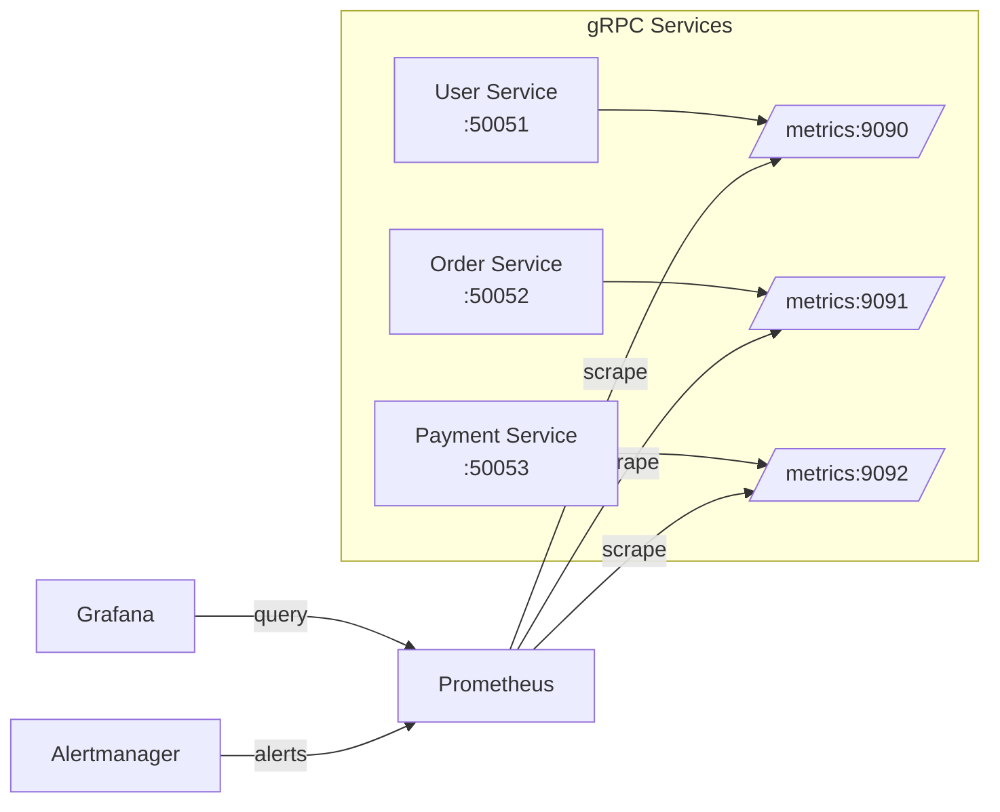

# How to Monitor gRPC Services with Prometheus and Grafana

Author: [nawazdhandala](https://www.github.com/nawazdhandala)

Tags: gRPC, Prometheus, Grafana, Monitoring, Metrics, Observability, SLI, SLO, Alerting

Description: Learn how to set up comprehensive monitoring for gRPC services using Prometheus metrics and Grafana dashboards with practical alerting rules.

---

Monitoring gRPC services requires understanding the unique characteristics of RPC communication. Unlike HTTP REST APIs, gRPC uses HTTP/2, supports streaming, and has its own status codes. This guide covers setting up Prometheus metrics collection and creating effective Grafana dashboards for gRPC services.

## Architecture Overview



## Setting Up grpc-prometheus in Go

Install the grpc-prometheus middleware:

```bash
go get github.com/grpc-ecosystem/go-grpc-prometheus
```

Integrate with your gRPC server:

```go
package main

import (
    "log"
    "net"
    "net/http"

    grpcprometheus "github.com/grpc-ecosystem/go-grpc-prometheus"
    "github.com/prometheus/client_golang/prometheus"
    "github.com/prometheus/client_golang/prometheus/promhttp"
    "google.golang.org/grpc"

    pb "your-project/proto"
)

func main() {
    // Create a custom registry
    reg := prometheus.NewRegistry()

    // Create gRPC metrics
    grpcMetrics := grpcprometheus.NewServerMetrics()

    // Register standard metrics
    reg.MustRegister(grpcMetrics)
    reg.MustRegister(prometheus.NewProcessCollector(prometheus.ProcessCollectorOpts{}))
    reg.MustRegister(prometheus.NewGoCollector())

    // Create gRPC server with metrics interceptors
    server := grpc.NewServer(
        grpc.StreamInterceptor(grpcMetrics.StreamServerInterceptor()),
        grpc.UnaryInterceptor(grpcMetrics.UnaryServerInterceptor()),
    )

    // Register your services
    userService := &userServer{}
    pb.RegisterUserServiceServer(server, userService)

    // Initialize metrics after all services are registered
    grpcMetrics.InitializeMetrics(server)

    // Enable handling time histogram
    grpcMetrics.EnableHandlingTimeHistogram(
        grpcprometheus.WithHistogramBuckets([]float64{
            0.001, 0.005, 0.01, 0.025, 0.05, 0.1, 0.25, 0.5, 1, 2.5, 5, 10,
        }),
    )

    // Start metrics HTTP server
    go func() {
        httpServer := &http.Server{
            Addr:    ":9090",
            Handler: promhttp.HandlerFor(reg, promhttp.HandlerOpts{}),
        }
        log.Println("Metrics server starting on :9090")
        if err := httpServer.ListenAndServe(); err != nil {
            log.Fatal(err)
        }
    }()

    // Start gRPC server
    lis, err := net.Listen("tcp", ":50051")
    if err != nil {
        log.Fatal(err)
    }

    log.Println("gRPC server starting on :50051")
    if err := server.Serve(lis); err != nil {
        log.Fatal(err)
    }
}
```

## Understanding gRPC Prometheus Metrics

The grpc-prometheus library exposes these key metrics:

### Server Metrics

| Metric Name | Type | Description |
|------------|------|-------------|
| `grpc_server_started_total` | Counter | Total number of RPCs started |
| `grpc_server_handled_total` | Counter | Total number of RPCs completed |
| `grpc_server_msg_received_total` | Counter | Total number of messages received |
| `grpc_server_msg_sent_total` | Counter | Total number of messages sent |
| `grpc_server_handling_seconds` | Histogram | Response latency distribution |

### Client Metrics

| Metric Name | Type | Description |
|------------|------|-------------|
| `grpc_client_started_total` | Counter | Total number of RPCs started |
| `grpc_client_handled_total` | Counter | Total number of RPCs completed |
| `grpc_client_msg_received_total` | Counter | Total number of messages received |
| `grpc_client_msg_sent_total` | Counter | Total number of messages sent |
| `grpc_client_handling_seconds` | Histogram | Response latency distribution |

## Custom Histogram Buckets

Choose histogram buckets based on your SLO requirements:

```go
package metrics

import (
    grpcprometheus "github.com/grpc-ecosystem/go-grpc-prometheus"
)

// Fast service (sub-100ms expected)
var FastServiceBuckets = []float64{
    0.001, 0.0025, 0.005, 0.01, 0.025, 0.05, 0.1, 0.25, 0.5, 1,
}

// Standard service (sub-second expected)
var StandardServiceBuckets = []float64{
    0.005, 0.01, 0.025, 0.05, 0.1, 0.25, 0.5, 1, 2.5, 5, 10,
}

// Slow service (multi-second operations)
var SlowServiceBuckets = []float64{
    0.1, 0.25, 0.5, 1, 2.5, 5, 10, 25, 50, 100,
}

func ConfigureMetrics(metrics *grpcprometheus.ServerMetrics, buckets []float64) {
    metrics.EnableHandlingTimeHistogram(
        grpcprometheus.WithHistogramBuckets(buckets),
    )
}
```

## Client-Side Metrics

Configure metrics for gRPC clients:

```go
package main

import (
    "log"

    grpcprometheus "github.com/grpc-ecosystem/go-grpc-prometheus"
    "github.com/prometheus/client_golang/prometheus"
    "google.golang.org/grpc"
    "google.golang.org/grpc/credentials/insecure"

    pb "your-project/proto"
)

func NewUserServiceClient(reg prometheus.Registerer) (pb.UserServiceClient, error) {
    // Create client metrics
    clientMetrics := grpcprometheus.NewClientMetrics()
    reg.MustRegister(clientMetrics)

    // Enable latency histogram
    clientMetrics.EnableClientHandlingTimeHistogram(
        grpcprometheus.WithHistogramBuckets([]float64{
            0.001, 0.005, 0.01, 0.025, 0.05, 0.1, 0.25, 0.5, 1, 2.5, 5,
        }),
    )

    // Create connection with metrics interceptors
    conn, err := grpc.NewClient("user-service:50051",
        grpc.WithTransportCredentials(insecure.NewCredentials()),
        grpc.WithUnaryInterceptor(clientMetrics.UnaryClientInterceptor()),
        grpc.WithStreamInterceptor(clientMetrics.StreamClientInterceptor()),
    )
    if err != nil {
        return nil, err
    }

    return pb.NewUserServiceClient(conn), nil
}
```

## Prometheus Configuration

Configure Prometheus to scrape your gRPC services:

```yaml
# prometheus.yml
global:
  scrape_interval: 15s
  evaluation_interval: 15s

rule_files:
  - "grpc_alerts.yml"

alerting:
  alertmanagers:
    - static_configs:
        - targets:
          - alertmanager:9093

scrape_configs:
  - job_name: 'grpc-services'
    kubernetes_sd_configs:
      - role: pod
    relabel_configs:
      # Only scrape pods with prometheus.io/scrape annotation
      - source_labels: [__meta_kubernetes_pod_annotation_prometheus_io_scrape]
        action: keep
        regex: true
      # Use custom port from annotation
      - source_labels: [__meta_kubernetes_pod_annotation_prometheus_io_port]
        action: replace
        target_label: __address__
        regex: (.+)
        replacement: ${1}
      # Add service label
      - source_labels: [__meta_kubernetes_pod_label_app]
        action: replace
        target_label: service
      # Add namespace label
      - source_labels: [__meta_kubernetes_namespace]
        action: replace
        target_label: namespace

  - job_name: 'grpc-user-service'
    static_configs:
      - targets: ['user-service:9090']
        labels:
          service: 'user-service'

  - job_name: 'grpc-order-service'
    static_configs:
      - targets: ['order-service:9091']
        labels:
          service: 'order-service'
```

## SLI/SLO Definitions

Define Service Level Indicators and Objectives:

```yaml
# grpc_sli_rules.yml
groups:
  - name: grpc_sli
    interval: 30s
    rules:
      # Availability SLI: Percentage of successful requests
      - record: grpc:service:availability:rate5m
        expr: |
          sum(rate(grpc_server_handled_total{grpc_code!="Unavailable",grpc_code!="Internal"}[5m])) by (grpc_service)
          /
          sum(rate(grpc_server_handled_total[5m])) by (grpc_service)

      # Latency SLI: Percentage of requests under 100ms
      - record: grpc:service:latency_p99:rate5m
        expr: |
          histogram_quantile(0.99,
            sum(rate(grpc_server_handling_seconds_bucket[5m])) by (grpc_service, le)
          )

      # Latency SLI: Percentage of requests under threshold
      - record: grpc:service:latency_sli:rate5m
        expr: |
          sum(rate(grpc_server_handling_seconds_bucket{le="0.1"}[5m])) by (grpc_service)
          /
          sum(rate(grpc_server_handling_seconds_count[5m])) by (grpc_service)

      # Error rate by method
      - record: grpc:method:error_rate:rate5m
        expr: |
          sum(rate(grpc_server_handled_total{grpc_code!="OK"}[5m])) by (grpc_service, grpc_method)
          /
          sum(rate(grpc_server_handled_total[5m])) by (grpc_service, grpc_method)

      # Request rate by service
      - record: grpc:service:request_rate:rate5m
        expr: |
          sum(rate(grpc_server_handled_total[5m])) by (grpc_service)

      # Error budget remaining (30-day window, 99.9% SLO)
      - record: grpc:service:error_budget_remaining
        expr: |
          1 - (
            (1 - avg_over_time(grpc:service:availability:rate5m[30d]))
            /
            (1 - 0.999)
          )
```

## Alerting Rules

Create comprehensive alerting rules:

```yaml
# grpc_alerts.yml
groups:
  - name: grpc_alerts
    rules:
      # High error rate alert
      - alert: GRPCHighErrorRate
        expr: |
          sum(rate(grpc_server_handled_total{grpc_code!="OK"}[5m])) by (grpc_service)
          /
          sum(rate(grpc_server_handled_total[5m])) by (grpc_service)
          > 0.01
        for: 5m
        labels:
          severity: warning
        annotations:
          summary: "High gRPC error rate for {{ $labels.grpc_service }}"
          description: "Error rate is {{ $value | humanizePercentage }} (threshold: 1%)"

      # Critical error rate
      - alert: GRPCCriticalErrorRate
        expr: |
          sum(rate(grpc_server_handled_total{grpc_code!="OK"}[5m])) by (grpc_service)
          /
          sum(rate(grpc_server_handled_total[5m])) by (grpc_service)
          > 0.05
        for: 2m
        labels:
          severity: critical
        annotations:
          summary: "Critical gRPC error rate for {{ $labels.grpc_service }}"
          description: "Error rate is {{ $value | humanizePercentage }} (threshold: 5%)"

      # High latency P99
      - alert: GRPCHighLatencyP99
        expr: |
          histogram_quantile(0.99,
            sum(rate(grpc_server_handling_seconds_bucket[5m])) by (grpc_service, le)
          ) > 1
        for: 5m
        labels:
          severity: warning
        annotations:
          summary: "High P99 latency for {{ $labels.grpc_service }}"
          description: "P99 latency is {{ $value | humanizeDuration }}"

      # Service unavailable
      - alert: GRPCServiceUnavailable
        expr: |
          sum(rate(grpc_server_handled_total{grpc_code="Unavailable"}[5m])) by (grpc_service) > 0
        for: 1m
        labels:
          severity: critical
        annotations:
          summary: "{{ $labels.grpc_service }} returning Unavailable status"
          description: "Service is returning gRPC Unavailable status codes"

      # No requests (service might be down)
      - alert: GRPCNoRequests
        expr: |
          sum(rate(grpc_server_handled_total[5m])) by (grpc_service) == 0
        for: 5m
        labels:
          severity: warning
        annotations:
          summary: "No requests to {{ $labels.grpc_service }}"
          description: "Service has received no requests in the last 5 minutes"

      # Error budget burn rate
      - alert: GRPCErrorBudgetBurnRate
        expr: |
          (
            sum(rate(grpc_server_handled_total{grpc_code!="OK"}[1h])) by (grpc_service)
            /
            sum(rate(grpc_server_handled_total[1h])) by (grpc_service)
          ) > 14.4 * (1 - 0.999)
        for: 5m
        labels:
          severity: critical
        annotations:
          summary: "High error budget burn rate for {{ $labels.grpc_service }}"
          description: "At current rate, error budget will be exhausted in less than 2 hours"

      # Streaming connection issues
      - alert: GRPCStreamingHighMessageRate
        expr: |
          sum(rate(grpc_server_msg_received_total[5m])) by (grpc_service, grpc_method)
          /
          sum(rate(grpc_server_started_total[5m])) by (grpc_service, grpc_method)
          > 1000
        for: 5m
        labels:
          severity: warning
        annotations:
          summary: "High message rate per stream for {{ $labels.grpc_method }}"
          description: "Average messages per stream: {{ $value }}"
```

## Grafana Dashboard

Create a comprehensive gRPC monitoring dashboard:

```json
{
  "dashboard": {
    "title": "gRPC Service Monitoring",
    "tags": ["grpc", "monitoring"],
    "timezone": "browser",
    "panels": [
      {
        "title": "Request Rate by Service",
        "type": "timeseries",
        "gridPos": { "h": 8, "w": 12, "x": 0, "y": 0 },
        "targets": [
          {
            "expr": "sum(rate(grpc_server_handled_total[5m])) by (grpc_service)",
            "legendFormat": "{{ grpc_service }}"
          }
        ],
        "fieldConfig": {
          "defaults": {
            "unit": "reqps"
          }
        }
      },
      {
        "title": "Error Rate by Service",
        "type": "timeseries",
        "gridPos": { "h": 8, "w": 12, "x": 12, "y": 0 },
        "targets": [
          {
            "expr": "sum(rate(grpc_server_handled_total{grpc_code!=\"OK\"}[5m])) by (grpc_service) / sum(rate(grpc_server_handled_total[5m])) by (grpc_service)",
            "legendFormat": "{{ grpc_service }}"
          }
        ],
        "fieldConfig": {
          "defaults": {
            "unit": "percentunit",
            "max": 1,
            "thresholds": {
              "mode": "absolute",
              "steps": [
                { "color": "green", "value": null },
                { "color": "yellow", "value": 0.01 },
                { "color": "red", "value": 0.05 }
              ]
            }
          }
        }
      },
      {
        "title": "P50/P90/P99 Latency",
        "type": "timeseries",
        "gridPos": { "h": 8, "w": 12, "x": 0, "y": 8 },
        "targets": [
          {
            "expr": "histogram_quantile(0.50, sum(rate(grpc_server_handling_seconds_bucket[5m])) by (grpc_service, le))",
            "legendFormat": "{{ grpc_service }} - P50"
          },
          {
            "expr": "histogram_quantile(0.90, sum(rate(grpc_server_handling_seconds_bucket[5m])) by (grpc_service, le))",
            "legendFormat": "{{ grpc_service }} - P90"
          },
          {
            "expr": "histogram_quantile(0.99, sum(rate(grpc_server_handling_seconds_bucket[5m])) by (grpc_service, le))",
            "legendFormat": "{{ grpc_service }} - P99"
          }
        ],
        "fieldConfig": {
          "defaults": {
            "unit": "s"
          }
        }
      },
      {
        "title": "Errors by Code",
        "type": "piechart",
        "gridPos": { "h": 8, "w": 12, "x": 12, "y": 8 },
        "targets": [
          {
            "expr": "sum(increase(grpc_server_handled_total{grpc_code!=\"OK\"}[1h])) by (grpc_code)",
            "legendFormat": "{{ grpc_code }}"
          }
        ]
      },
      {
        "title": "Request Rate by Method",
        "type": "timeseries",
        "gridPos": { "h": 8, "w": 24, "x": 0, "y": 16 },
        "targets": [
          {
            "expr": "sum(rate(grpc_server_handled_total[5m])) by (grpc_service, grpc_method)",
            "legendFormat": "{{ grpc_service }}/{{ grpc_method }}"
          }
        ],
        "fieldConfig": {
          "defaults": {
            "unit": "reqps"
          }
        }
      },
      {
        "title": "SLO: Availability (Target: 99.9%)",
        "type": "gauge",
        "gridPos": { "h": 6, "w": 8, "x": 0, "y": 24 },
        "targets": [
          {
            "expr": "sum(rate(grpc_server_handled_total{grpc_code!=\"Unavailable\",grpc_code!=\"Internal\"}[24h])) / sum(rate(grpc_server_handled_total[24h]))",
            "legendFormat": "Availability"
          }
        ],
        "fieldConfig": {
          "defaults": {
            "unit": "percentunit",
            "min": 0.99,
            "max": 1,
            "thresholds": {
              "mode": "absolute",
              "steps": [
                { "color": "red", "value": null },
                { "color": "yellow", "value": 0.999 },
                { "color": "green", "value": 0.9995 }
              ]
            }
          }
        }
      },
      {
        "title": "SLO: Latency P99 < 100ms",
        "type": "gauge",
        "gridPos": { "h": 6, "w": 8, "x": 8, "y": 24 },
        "targets": [
          {
            "expr": "sum(rate(grpc_server_handling_seconds_bucket{le=\"0.1\"}[24h])) / sum(rate(grpc_server_handling_seconds_count[24h]))",
            "legendFormat": "Requests under 100ms"
          }
        ],
        "fieldConfig": {
          "defaults": {
            "unit": "percentunit",
            "min": 0.9,
            "max": 1,
            "thresholds": {
              "mode": "absolute",
              "steps": [
                { "color": "red", "value": null },
                { "color": "yellow", "value": 0.95 },
                { "color": "green", "value": 0.99 }
              ]
            }
          }
        }
      },
      {
        "title": "Error Budget Remaining",
        "type": "gauge",
        "gridPos": { "h": 6, "w": 8, "x": 16, "y": 24 },
        "targets": [
          {
            "expr": "1 - ((1 - (sum(rate(grpc_server_handled_total{grpc_code!=\"Unavailable\",grpc_code!=\"Internal\"}[30d])) / sum(rate(grpc_server_handled_total[30d])))) / (1 - 0.999))",
            "legendFormat": "Error Budget"
          }
        ],
        "fieldConfig": {
          "defaults": {
            "unit": "percentunit",
            "min": 0,
            "max": 1,
            "thresholds": {
              "mode": "absolute",
              "steps": [
                { "color": "red", "value": null },
                { "color": "yellow", "value": 0.25 },
                { "color": "green", "value": 0.5 }
              ]
            }
          }
        }
      }
    ]
  }
}
```

## Useful PromQL Queries

### Request Analysis

```promql
# Total requests per second by service
sum(rate(grpc_server_handled_total[5m])) by (grpc_service)

# Top 10 busiest methods
topk(10, sum(rate(grpc_server_handled_total[5m])) by (grpc_method))

# Request distribution by status code
sum(rate(grpc_server_handled_total[5m])) by (grpc_code)
```

### Error Analysis

```promql
# Error rate by service
sum(rate(grpc_server_handled_total{grpc_code!="OK"}[5m])) by (grpc_service)
/
sum(rate(grpc_server_handled_total[5m])) by (grpc_service)

# Errors by type
sum(increase(grpc_server_handled_total{grpc_code!="OK"}[1h])) by (grpc_code, grpc_service)

# Method with highest error rate
topk(5,
  sum(rate(grpc_server_handled_total{grpc_code!="OK"}[5m])) by (grpc_method)
  /
  sum(rate(grpc_server_handled_total[5m])) by (grpc_method)
)
```

### Latency Analysis

```promql
# P50, P90, P99 latency by service
histogram_quantile(0.50, sum(rate(grpc_server_handling_seconds_bucket[5m])) by (grpc_service, le))
histogram_quantile(0.90, sum(rate(grpc_server_handling_seconds_bucket[5m])) by (grpc_service, le))
histogram_quantile(0.99, sum(rate(grpc_server_handling_seconds_bucket[5m])) by (grpc_service, le))

# Average latency by method
sum(rate(grpc_server_handling_seconds_sum[5m])) by (grpc_method)
/
sum(rate(grpc_server_handling_seconds_count[5m])) by (grpc_method)

# Slowest methods by P99
topk(10, histogram_quantile(0.99, sum(rate(grpc_server_handling_seconds_bucket[5m])) by (grpc_method, le)))
```

### Streaming Metrics

```promql
# Messages per stream (streaming efficiency)
sum(rate(grpc_server_msg_received_total[5m])) by (grpc_method)
/
sum(rate(grpc_server_started_total[5m])) by (grpc_method)

# Active streams
sum(grpc_server_started_total) by (grpc_service) - sum(grpc_server_handled_total) by (grpc_service)
```

## Kubernetes Deployment

Deploy the monitoring stack:

```yaml
# prometheus-deployment.yaml
apiVersion: apps/v1
kind: Deployment
metadata:
  name: prometheus
  namespace: monitoring
spec:
  replicas: 1
  selector:
    matchLabels:
      app: prometheus
  template:
    metadata:
      labels:
        app: prometheus
    spec:
      serviceAccountName: prometheus
      containers:
      - name: prometheus
        image: prom/prometheus:v2.47.0
        args:
          - "--config.file=/etc/prometheus/prometheus.yml"
          - "--storage.tsdb.path=/prometheus"
          - "--storage.tsdb.retention.time=15d"
          - "--web.enable-lifecycle"
        ports:
        - containerPort: 9090
        volumeMounts:
        - name: config
          mountPath: /etc/prometheus
        - name: rules
          mountPath: /etc/prometheus/rules
        - name: storage
          mountPath: /prometheus
      volumes:
      - name: config
        configMap:
          name: prometheus-config
      - name: rules
        configMap:
          name: prometheus-rules
      - name: storage
        persistentVolumeClaim:
          claimName: prometheus-pvc
---
apiVersion: v1
kind: Service
metadata:
  name: prometheus
  namespace: monitoring
spec:
  selector:
    app: prometheus
  ports:
  - port: 9090
    targetPort: 9090
```

```yaml
# grafana-deployment.yaml
apiVersion: apps/v1
kind: Deployment
metadata:
  name: grafana
  namespace: monitoring
spec:
  replicas: 1
  selector:
    matchLabels:
      app: grafana
  template:
    metadata:
      labels:
        app: grafana
    spec:
      containers:
      - name: grafana
        image: grafana/grafana:10.1.0
        ports:
        - containerPort: 3000
        env:
        - name: GF_SECURITY_ADMIN_PASSWORD
          valueFrom:
            secretKeyRef:
              name: grafana-secrets
              key: admin-password
        volumeMounts:
        - name: dashboards
          mountPath: /var/lib/grafana/dashboards
        - name: datasources
          mountPath: /etc/grafana/provisioning/datasources
      volumes:
      - name: dashboards
        configMap:
          name: grafana-dashboards
      - name: datasources
        configMap:
          name: grafana-datasources
```

## Best Practices

1. **Choose Appropriate Bucket Sizes**: Align histogram buckets with your SLO thresholds
2. **Use Recording Rules**: Pre-compute expensive queries for dashboard performance
3. **Limit Label Cardinality**: Avoid high-cardinality labels like user IDs in metrics
4. **Set Up Alerting Gradually**: Start with critical alerts, then add warning-level alerts
5. **Monitor the Monitors**: Ensure Prometheus and Grafana are also monitored
6. **Use Consistent Naming**: Follow Prometheus naming conventions for custom metrics
7. **Document SLOs**: Clearly define what each SLO measures and its business impact

## Conclusion

Effective monitoring of gRPC services requires understanding both the technical metrics and business requirements. By combining grpc-prometheus metrics with thoughtful Grafana dashboards and alerting rules, you can achieve comprehensive observability of your gRPC microservices. Start with basic request rate and error rate monitoring, then gradually add latency percentiles and SLO tracking as your monitoring maturity grows.
