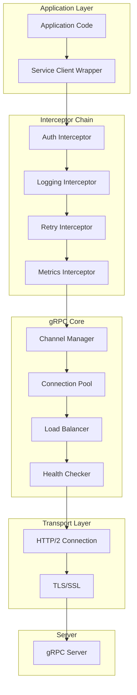

# How to Build gRPC Clients in Python

Author: [nawazdhandala](https://www.github.com/nawazdhandala)

Tags: gRPC, Python, API, Microservices, Protocol Buffers, RPC, AsyncIO, Client Development

Description: A comprehensive guide to building production-ready gRPC clients in Python, covering synchronous and asynchronous patterns, interceptors, error handling, and best practices.

---

## Introduction

gRPC is a high-performance, open-source universal RPC framework that uses HTTP/2 for transport, Protocol Buffers as the interface description language, and provides features like authentication, bidirectional streaming, and flow control. Python's gRPC implementation offers both synchronous and asynchronous client options, making it versatile for various application architectures.

In this guide, you'll learn how to build robust gRPC clients in Python, from basic setup to advanced patterns used in production systems.

## Prerequisites

Before getting started, ensure you have:

- Python 3.8 or later installed
- Basic understanding of Protocol Buffers
- Familiarity with Python async/await syntax (for async examples)

## Setting Up Your Python gRPC Environment

### Installing Required Packages

Start by installing the necessary packages:

```bash
# Core gRPC packages
pip install grpcio grpcio-tools

# For async support (included in grpcio since 1.32.0)
pip install grpcio>=1.32.0

# Optional: For better performance
pip install grpcio-status grpcio-health-checking
```

### Project Structure

Organize your project with a clear structure:

```
grpc-python-client/
├── protos/
│   └── user_service.proto
├── generated/
│   ├── __init__.py
│   ├── user_service_pb2.py
│   └── user_service_pb2_grpc.py
├── clients/
│   ├── __init__.py
│   ├── sync_client.py
│   └── async_client.py
├── interceptors/
│   ├── __init__.py
│   ├── logging_interceptor.py
│   └── retry_interceptor.py
├── requirements.txt
└── main.py
```

## Defining Protocol Buffers

Create your service definition in `protos/user_service.proto`:

```protobuf
syntax = "proto3";

package userservice;

option python_generic_services = true;

// User message definition
message User {
    string id = 1;
    string name = 2;
    string email = 3;
    int32 age = 4;
    repeated string roles = 5;
    UserStatus status = 6;
}

enum UserStatus {
    UNKNOWN = 0;
    ACTIVE = 1;
    INACTIVE = 2;
    SUSPENDED = 3;
}

// Request and Response messages
message GetUserRequest {
    string user_id = 1;
}

message GetUserResponse {
    User user = 1;
}

message ListUsersRequest {
    int32 page_size = 1;
    string page_token = 2;
    string filter = 3;
}

message ListUsersResponse {
    repeated User users = 1;
    string next_page_token = 2;
    int32 total_count = 3;
}

message CreateUserRequest {
    string name = 1;
    string email = 2;
    int32 age = 3;
    repeated string roles = 4;
}

message CreateUserResponse {
    User user = 1;
}

message UpdateUserRequest {
    string user_id = 1;
    User user = 2;
}

message UpdateUserResponse {
    User user = 1;
}

message DeleteUserRequest {
    string user_id = 1;
}

message DeleteUserResponse {
    bool success = 1;
}

// Streaming messages
message WatchUsersRequest {
    repeated string user_ids = 1;
}

message UserEvent {
    string event_type = 1;  // CREATED, UPDATED, DELETED
    User user = 2;
    int64 timestamp = 3;
}

// Service definition
service UserService {
    // Unary RPCs
    rpc GetUser(GetUserRequest) returns (GetUserResponse);
    rpc ListUsers(ListUsersRequest) returns (ListUsersResponse);
    rpc CreateUser(CreateUserRequest) returns (CreateUserResponse);
    rpc UpdateUser(UpdateUserRequest) returns (UpdateUserResponse);
    rpc DeleteUser(DeleteUserRequest) returns (DeleteUserResponse);

    // Server streaming RPC
    rpc WatchUsers(WatchUsersRequest) returns (stream UserEvent);

    // Client streaming RPC
    rpc BatchCreateUsers(stream CreateUserRequest) returns (ListUsersResponse);

    // Bidirectional streaming RPC
    rpc SyncUsers(stream UpdateUserRequest) returns (stream UserEvent);
}
```

## Generating Python Stubs

Generate the Python code from your proto file:

```bash
# Create output directory
mkdir -p generated

# Generate Python code
python -m grpc_tools.protoc \
    -I./protos \
    --python_out=./generated \
    --grpc_python_out=./generated \
    ./protos/user_service.proto

# Create __init__.py for the package
touch generated/__init__.py
```

You can also create a generation script (`generate_protos.py`):

```python
#!/usr/bin/env python3
"""Script to generate Python gRPC code from proto files."""

import subprocess
import sys
from pathlib import Path


def generate_protos():
    """Generate Python code from proto files."""
    proto_dir = Path("protos")
    output_dir = Path("generated")

    # Create output directory if it doesn't exist
    output_dir.mkdir(exist_ok=True)

    # Create __init__.py
    (output_dir / "__init__.py").touch()

    # Find all proto files
    proto_files = list(proto_dir.glob("*.proto"))

    if not proto_files:
        print("No proto files found in protos/")
        sys.exit(1)

    for proto_file in proto_files:
        print(f"Generating code for {proto_file}")

        cmd = [
            sys.executable, "-m", "grpc_tools.protoc",
            f"-I{proto_dir}",
            f"--python_out={output_dir}",
            f"--grpc_python_out={output_dir}",
            str(proto_file)
        ]

        result = subprocess.run(cmd, capture_output=True, text=True)

        if result.returncode != 0:
            print(f"Error generating {proto_file}:")
            print(result.stderr)
            sys.exit(1)

    print(f"Successfully generated code for {len(proto_files)} proto file(s)")


if __name__ == "__main__":
    generate_protos()
```

## Building a Synchronous gRPC Client

### Basic Synchronous Client

Create `clients/sync_client.py`:

```python
"""Synchronous gRPC client for UserService."""

import grpc
from typing import Iterator, List, Optional

# Import generated code
from generated import user_service_pb2 as pb2
from generated import user_service_pb2_grpc as pb2_grpc


class UserServiceClient:
    """Synchronous client for the UserService."""

    def __init__(
        self,
        host: str = "localhost",
        port: int = 50051,
        secure: bool = False,
        credentials: Optional[grpc.ChannelCredentials] = None,
        options: Optional[List[tuple]] = None
    ):
        """
        Initialize the UserService client.

        Args:
            host: Server hostname
            port: Server port
            secure: Whether to use SSL/TLS
            credentials: Optional channel credentials for secure connections
            options: Optional channel options
        """
        self.target = f"{host}:{port}"
        self.options = options or [
            ('grpc.max_send_message_length', 50 * 1024 * 1024),
            ('grpc.max_receive_message_length', 50 * 1024 * 1024),
            ('grpc.keepalive_time_ms', 30000),
            ('grpc.keepalive_timeout_ms', 10000),
            ('grpc.keepalive_permit_without_calls', True),
            ('grpc.http2.max_pings_without_data', 0),
        ]

        if secure:
            if credentials is None:
                credentials = grpc.ssl_channel_credentials()
            self.channel = grpc.secure_channel(
                self.target, credentials, options=self.options
            )
        else:
            self.channel = grpc.insecure_channel(
                self.target, options=self.options
            )

        self.stub = pb2_grpc.UserServiceStub(self.channel)

    def __enter__(self):
        """Context manager entry."""
        return self

    def __exit__(self, exc_type, exc_val, exc_tb):
        """Context manager exit - close the channel."""
        self.close()

    def close(self):
        """Close the gRPC channel."""
        self.channel.close()

    def get_user(
        self,
        user_id: str,
        timeout: float = 10.0,
        metadata: Optional[List[tuple]] = None
    ) -> pb2.User:
        """
        Get a user by ID.

        Args:
            user_id: The user's ID
            timeout: Request timeout in seconds
            metadata: Optional metadata to send with the request

        Returns:
            User object

        Raises:
            grpc.RpcError: If the RPC fails
        """
        request = pb2.GetUserRequest(user_id=user_id)

        response = self.stub.GetUser(
            request,
            timeout=timeout,
            metadata=metadata or []
        )

        return response.user

    def list_users(
        self,
        page_size: int = 10,
        page_token: str = "",
        filter_query: str = "",
        timeout: float = 30.0
    ) -> pb2.ListUsersResponse:
        """
        List users with pagination.

        Args:
            page_size: Number of users per page
            page_token: Token for the next page
            filter_query: Optional filter query
            timeout: Request timeout in seconds

        Returns:
            ListUsersResponse containing users and pagination info
        """
        request = pb2.ListUsersRequest(
            page_size=page_size,
            page_token=page_token,
            filter=filter_query
        )

        return self.stub.ListUsers(request, timeout=timeout)

    def create_user(
        self,
        name: str,
        email: str,
        age: int = 0,
        roles: Optional[List[str]] = None,
        timeout: float = 10.0
    ) -> pb2.User:
        """
        Create a new user.

        Args:
            name: User's name
            email: User's email
            age: User's age
            roles: List of role names
            timeout: Request timeout in seconds

        Returns:
            Created User object
        """
        request = pb2.CreateUserRequest(
            name=name,
            email=email,
            age=age,
            roles=roles or []
        )

        response = self.stub.CreateUser(request, timeout=timeout)
        return response.user

    def update_user(
        self,
        user_id: str,
        user: pb2.User,
        timeout: float = 10.0
    ) -> pb2.User:
        """
        Update an existing user.

        Args:
            user_id: ID of the user to update
            user: Updated user object
            timeout: Request timeout in seconds

        Returns:
            Updated User object
        """
        request = pb2.UpdateUserRequest(user_id=user_id, user=user)
        response = self.stub.UpdateUser(request, timeout=timeout)
        return response.user

    def delete_user(self, user_id: str, timeout: float = 10.0) -> bool:
        """
        Delete a user.

        Args:
            user_id: ID of the user to delete
            timeout: Request timeout in seconds

        Returns:
            True if deletion was successful
        """
        request = pb2.DeleteUserRequest(user_id=user_id)
        response = self.stub.DeleteUser(request, timeout=timeout)
        return response.success

    def watch_users(
        self,
        user_ids: List[str],
        timeout: Optional[float] = None
    ) -> Iterator[pb2.UserEvent]:
        """
        Watch for user events (server streaming).

        Args:
            user_ids: List of user IDs to watch
            timeout: Optional timeout for the stream

        Yields:
            UserEvent objects as they occur
        """
        request = pb2.WatchUsersRequest(user_ids=user_ids)

        for event in self.stub.WatchUsers(request, timeout=timeout):
            yield event

    def batch_create_users(
        self,
        users: Iterator[tuple],
        timeout: float = 60.0
    ) -> pb2.ListUsersResponse:
        """
        Batch create users (client streaming).

        Args:
            users: Iterator of (name, email, age, roles) tuples
            timeout: Request timeout in seconds

        Returns:
            ListUsersResponse with created users
        """
        def request_iterator():
            for name, email, age, roles in users:
                yield pb2.CreateUserRequest(
                    name=name,
                    email=email,
                    age=age,
                    roles=roles or []
                )

        return self.stub.BatchCreateUsers(
            request_iterator(),
            timeout=timeout
        )


# Usage example
if __name__ == "__main__":
    # Using context manager for automatic cleanup
    with UserServiceClient(host="localhost", port=50051) as client:
        try:
            # Create a user
            user = client.create_user(
                name="John Doe",
                email="john@example.com",
                age=30,
                roles=["admin", "user"]
            )
            print(f"Created user: {user.id}")

            # Get the user
            fetched_user = client.get_user(user.id)
            print(f"Fetched user: {fetched_user.name}")

            # List users
            response = client.list_users(page_size=10)
            print(f"Total users: {response.total_count}")

            # Watch for user events
            print("Watching for user events...")
            for event in client.watch_users([user.id]):
                print(f"Event: {event.event_type} for user {event.user.id}")

        except grpc.RpcError as e:
            print(f"RPC failed: {e.code()}: {e.details()}")
```

## Building an Asynchronous gRPC Client

### AsyncIO-Based Client

Create `clients/async_client.py`:

```python
"""Asynchronous gRPC client for UserService."""

import asyncio
from typing import AsyncIterator, List, Optional

import grpc
from grpc import aio

# Import generated code
from generated import user_service_pb2 as pb2
from generated import user_service_pb2_grpc as pb2_grpc


class AsyncUserServiceClient:
    """Asynchronous client for the UserService."""

    def __init__(
        self,
        host: str = "localhost",
        port: int = 50051,
        secure: bool = False,
        credentials: Optional[grpc.ChannelCredentials] = None,
        options: Optional[List[tuple]] = None
    ):
        """
        Initialize the async UserService client.

        Args:
            host: Server hostname
            port: Server port
            secure: Whether to use SSL/TLS
            credentials: Optional channel credentials
            options: Optional channel options
        """
        self.target = f"{host}:{port}"
        self.options = options or [
            ('grpc.max_send_message_length', 50 * 1024 * 1024),
            ('grpc.max_receive_message_length', 50 * 1024 * 1024),
            ('grpc.keepalive_time_ms', 30000),
            ('grpc.keepalive_timeout_ms', 10000),
        ]

        if secure:
            if credentials is None:
                credentials = grpc.ssl_channel_credentials()
            self.channel = aio.secure_channel(
                self.target, credentials, options=self.options
            )
        else:
            self.channel = aio.insecure_channel(
                self.target, options=self.options
            )

        self.stub = pb2_grpc.UserServiceStub(self.channel)

    async def __aenter__(self):
        """Async context manager entry."""
        return self

    async def __aexit__(self, exc_type, exc_val, exc_tb):
        """Async context manager exit - close the channel."""
        await self.close()

    async def close(self):
        """Close the gRPC channel."""
        await self.channel.close()

    async def get_user(
        self,
        user_id: str,
        timeout: float = 10.0,
        metadata: Optional[List[tuple]] = None
    ) -> pb2.User:
        """
        Get a user by ID asynchronously.

        Args:
            user_id: The user's ID
            timeout: Request timeout in seconds
            metadata: Optional metadata

        Returns:
            User object
        """
        request = pb2.GetUserRequest(user_id=user_id)

        response = await self.stub.GetUser(
            request,
            timeout=timeout,
            metadata=metadata or []
        )

        return response.user

    async def list_users(
        self,
        page_size: int = 10,
        page_token: str = "",
        filter_query: str = "",
        timeout: float = 30.0
    ) -> pb2.ListUsersResponse:
        """
        List users with pagination asynchronously.

        Args:
            page_size: Number of users per page
            page_token: Token for the next page
            filter_query: Optional filter query
            timeout: Request timeout in seconds

        Returns:
            ListUsersResponse
        """
        request = pb2.ListUsersRequest(
            page_size=page_size,
            page_token=page_token,
            filter=filter_query
        )

        return await self.stub.ListUsers(request, timeout=timeout)

    async def create_user(
        self,
        name: str,
        email: str,
        age: int = 0,
        roles: Optional[List[str]] = None,
        timeout: float = 10.0
    ) -> pb2.User:
        """
        Create a new user asynchronously.

        Args:
            name: User's name
            email: User's email
            age: User's age
            roles: List of role names
            timeout: Request timeout in seconds

        Returns:
            Created User object
        """
        request = pb2.CreateUserRequest(
            name=name,
            email=email,
            age=age,
            roles=roles or []
        )

        response = await self.stub.CreateUser(request, timeout=timeout)
        return response.user

    async def watch_users(
        self,
        user_ids: List[str],
        timeout: Optional[float] = None
    ) -> AsyncIterator[pb2.UserEvent]:
        """
        Watch for user events asynchronously (server streaming).

        Args:
            user_ids: List of user IDs to watch
            timeout: Optional timeout

        Yields:
            UserEvent objects as they occur
        """
        request = pb2.WatchUsersRequest(user_ids=user_ids)

        async for event in self.stub.WatchUsers(request, timeout=timeout):
            yield event

    async def batch_create_users(
        self,
        users: AsyncIterator[tuple],
        timeout: float = 60.0
    ) -> pb2.ListUsersResponse:
        """
        Batch create users asynchronously (client streaming).

        Args:
            users: Async iterator of (name, email, age, roles) tuples
            timeout: Request timeout in seconds

        Returns:
            ListUsersResponse with created users
        """
        async def request_iterator():
            async for name, email, age, roles in users:
                yield pb2.CreateUserRequest(
                    name=name,
                    email=email,
                    age=age,
                    roles=roles or []
                )

        return await self.stub.BatchCreateUsers(
            request_iterator(),
            timeout=timeout
        )

    async def sync_users(
        self,
        updates: AsyncIterator[tuple],
        timeout: Optional[float] = None
    ) -> AsyncIterator[pb2.UserEvent]:
        """
        Synchronize users bidirectionally.

        Args:
            updates: Async iterator of (user_id, user) tuples
            timeout: Optional timeout

        Yields:
            UserEvent objects
        """
        async def request_iterator():
            async for user_id, user in updates:
                yield pb2.UpdateUserRequest(user_id=user_id, user=user)

        async for event in self.stub.SyncUsers(
            request_iterator(),
            timeout=timeout
        ):
            yield event


# Concurrent request helper
async def fetch_users_concurrently(
    client: AsyncUserServiceClient,
    user_ids: List[str]
) -> List[pb2.User]:
    """
    Fetch multiple users concurrently.

    Args:
        client: The async client instance
        user_ids: List of user IDs to fetch

    Returns:
        List of User objects
    """
    tasks = [client.get_user(uid) for uid in user_ids]
    return await asyncio.gather(*tasks, return_exceptions=True)


# Usage example
async def main():
    """Example async client usage."""
    async with AsyncUserServiceClient(host="localhost", port=50051) as client:
        try:
            # Create a user
            user = await client.create_user(
                name="Jane Doe",
                email="jane@example.com",
                age=28,
                roles=["user"]
            )
            print(f"Created user: {user.id}")

            # Fetch multiple users concurrently
            user_ids = ["user1", "user2", "user3"]
            users = await fetch_users_concurrently(client, user_ids)

            for result in users:
                if isinstance(result, Exception):
                    print(f"Error fetching user: {result}")
                else:
                    print(f"Fetched: {result.name}")

            # Watch for events with timeout
            print("Watching for events...")
            async for event in client.watch_users([user.id]):
                print(f"Event: {event.event_type}")

        except grpc.aio.AioRpcError as e:
            print(f"Async RPC failed: {e.code()}: {e.details()}")


if __name__ == "__main__":
    asyncio.run(main())
```

## Implementing Interceptors

Interceptors allow you to add cross-cutting concerns like logging, authentication, and retry logic.

### Logging Interceptor

Create `interceptors/logging_interceptor.py`:

```python
"""Logging interceptor for gRPC clients."""

import logging
import time
from typing import Any, Callable

import grpc

logger = logging.getLogger(__name__)


class LoggingClientInterceptor(
    grpc.UnaryUnaryClientInterceptor,
    grpc.UnaryStreamClientInterceptor,
    grpc.StreamUnaryClientInterceptor,
    grpc.StreamStreamClientInterceptor
):
    """Client interceptor that logs all RPC calls."""

    def __init__(self, log_level: int = logging.INFO):
        """
        Initialize the logging interceptor.

        Args:
            log_level: Logging level to use
        """
        self.log_level = log_level

    def _log_request(self, method: str, request: Any) -> float:
        """Log the request and return start time."""
        logger.log(self.log_level, f"gRPC Request: {method}")
        logger.debug(f"Request payload: {request}")
        return time.time()

    def _log_response(
        self,
        method: str,
        start_time: float,
        response: Any = None,
        error: Exception = None
    ):
        """Log the response or error."""
        duration = (time.time() - start_time) * 1000

        if error:
            logger.error(
                f"gRPC Error: {method} - {error} (duration: {duration:.2f}ms)"
            )
        else:
            logger.log(
                self.log_level,
                f"gRPC Response: {method} (duration: {duration:.2f}ms)"
            )
            logger.debug(f"Response payload: {response}")

    def intercept_unary_unary(
        self,
        continuation: Callable,
        client_call_details: grpc.ClientCallDetails,
        request: Any
    ):
        """Intercept unary-unary calls."""
        method = client_call_details.method
        start_time = self._log_request(method, request)

        try:
            response = continuation(client_call_details, request)
            self._log_response(method, start_time, response.result())
            return response
        except grpc.RpcError as e:
            self._log_response(method, start_time, error=e)
            raise

    def intercept_unary_stream(
        self,
        continuation: Callable,
        client_call_details: grpc.ClientCallDetails,
        request: Any
    ):
        """Intercept unary-stream (server streaming) calls."""
        method = client_call_details.method
        self._log_request(method, request)
        return continuation(client_call_details, request)

    def intercept_stream_unary(
        self,
        continuation: Callable,
        client_call_details: grpc.ClientCallDetails,
        request_iterator: Any
    ):
        """Intercept stream-unary (client streaming) calls."""
        method = client_call_details.method
        logger.log(self.log_level, f"gRPC Stream Request: {method}")
        return continuation(client_call_details, request_iterator)

    def intercept_stream_stream(
        self,
        continuation: Callable,
        client_call_details: grpc.ClientCallDetails,
        request_iterator: Any
    ):
        """Intercept stream-stream (bidirectional) calls."""
        method = client_call_details.method
        logger.log(self.log_level, f"gRPC Bidirectional Stream: {method}")
        return continuation(client_call_details, request_iterator)


# Async logging interceptor
class AsyncLoggingClientInterceptor(grpc.aio.UnaryUnaryClientInterceptor):
    """Async client interceptor that logs all RPC calls."""

    def __init__(self, log_level: int = logging.INFO):
        self.log_level = log_level

    async def intercept_unary_unary(
        self,
        continuation: Callable,
        client_call_details: grpc.aio.ClientCallDetails,
        request: Any
    ):
        """Intercept async unary-unary calls."""
        method = client_call_details.method
        start_time = time.time()

        logger.log(self.log_level, f"gRPC Async Request: {method}")

        try:
            response = await continuation(client_call_details, request)
            duration = (time.time() - start_time) * 1000
            logger.log(
                self.log_level,
                f"gRPC Async Response: {method} (duration: {duration:.2f}ms)"
            )
            return response
        except grpc.aio.AioRpcError as e:
            duration = (time.time() - start_time) * 1000
            logger.error(
                f"gRPC Async Error: {method} - {e.code()} "
                f"(duration: {duration:.2f}ms)"
            )
            raise
```

### Retry Interceptor

Create `interceptors/retry_interceptor.py`:

```python
"""Retry interceptor for gRPC clients."""

import logging
import random
import time
from typing import Any, Callable, Set

import grpc

logger = logging.getLogger(__name__)

# Retryable status codes
RETRYABLE_STATUS_CODES: Set[grpc.StatusCode] = {
    grpc.StatusCode.UNAVAILABLE,
    grpc.StatusCode.DEADLINE_EXCEEDED,
    grpc.StatusCode.RESOURCE_EXHAUSTED,
    grpc.StatusCode.ABORTED,
    grpc.StatusCode.INTERNAL,
}


class RetryClientInterceptor(grpc.UnaryUnaryClientInterceptor):
    """Client interceptor that implements retry logic with exponential backoff."""

    def __init__(
        self,
        max_retries: int = 3,
        initial_backoff: float = 0.1,
        max_backoff: float = 10.0,
        backoff_multiplier: float = 2.0,
        retryable_status_codes: Set[grpc.StatusCode] = None
    ):
        """
        Initialize the retry interceptor.

        Args:
            max_retries: Maximum number of retry attempts
            initial_backoff: Initial backoff time in seconds
            max_backoff: Maximum backoff time in seconds
            backoff_multiplier: Multiplier for exponential backoff
            retryable_status_codes: Set of status codes to retry
        """
        self.max_retries = max_retries
        self.initial_backoff = initial_backoff
        self.max_backoff = max_backoff
        self.backoff_multiplier = backoff_multiplier
        self.retryable_status_codes = (
            retryable_status_codes or RETRYABLE_STATUS_CODES
        )

    def _calculate_backoff(self, attempt: int) -> float:
        """Calculate backoff time with jitter."""
        backoff = min(
            self.initial_backoff * (self.backoff_multiplier ** attempt),
            self.max_backoff
        )
        # Add jitter (0.5 to 1.5 of calculated backoff)
        jitter = random.uniform(0.5, 1.5)
        return backoff * jitter

    def _should_retry(self, error: grpc.RpcError) -> bool:
        """Determine if the error is retryable."""
        return error.code() in self.retryable_status_codes

    def intercept_unary_unary(
        self,
        continuation: Callable,
        client_call_details: grpc.ClientCallDetails,
        request: Any
    ):
        """Intercept unary-unary calls with retry logic."""
        method = client_call_details.method
        last_error = None

        for attempt in range(self.max_retries + 1):
            try:
                response = continuation(client_call_details, request)
                # Force evaluation to catch errors
                result = response.result()
                return response

            except grpc.RpcError as e:
                last_error = e

                if not self._should_retry(e):
                    logger.warning(
                        f"Non-retryable error for {method}: {e.code()}"
                    )
                    raise

                if attempt < self.max_retries:
                    backoff = self._calculate_backoff(attempt)
                    logger.warning(
                        f"Retrying {method} after {e.code()}, "
                        f"attempt {attempt + 1}/{self.max_retries}, "
                        f"backoff: {backoff:.2f}s"
                    )
                    time.sleep(backoff)
                else:
                    logger.error(
                        f"Max retries exceeded for {method}: {e.code()}"
                    )
                    raise

        raise last_error


# Async retry interceptor
class AsyncRetryClientInterceptor(grpc.aio.UnaryUnaryClientInterceptor):
    """Async client interceptor with retry logic."""

    def __init__(
        self,
        max_retries: int = 3,
        initial_backoff: float = 0.1,
        max_backoff: float = 10.0,
        backoff_multiplier: float = 2.0,
        retryable_status_codes: Set[grpc.StatusCode] = None
    ):
        self.max_retries = max_retries
        self.initial_backoff = initial_backoff
        self.max_backoff = max_backoff
        self.backoff_multiplier = backoff_multiplier
        self.retryable_status_codes = (
            retryable_status_codes or RETRYABLE_STATUS_CODES
        )

    def _calculate_backoff(self, attempt: int) -> float:
        """Calculate backoff time with jitter."""
        backoff = min(
            self.initial_backoff * (self.backoff_multiplier ** attempt),
            self.max_backoff
        )
        jitter = random.uniform(0.5, 1.5)
        return backoff * jitter

    async def intercept_unary_unary(
        self,
        continuation: Callable,
        client_call_details: grpc.aio.ClientCallDetails,
        request: Any
    ):
        """Intercept async unary-unary calls with retry logic."""
        import asyncio

        method = client_call_details.method
        last_error = None

        for attempt in range(self.max_retries + 1):
            try:
                return await continuation(client_call_details, request)

            except grpc.aio.AioRpcError as e:
                last_error = e

                if e.code() not in self.retryable_status_codes:
                    raise

                if attempt < self.max_retries:
                    backoff = self._calculate_backoff(attempt)
                    logger.warning(
                        f"Async retry {method}: {e.code()}, "
                        f"attempt {attempt + 1}, backoff: {backoff:.2f}s"
                    )
                    await asyncio.sleep(backoff)
                else:
                    raise

        raise last_error
```

### Authentication Interceptor

Create `interceptors/auth_interceptor.py`:

```python
"""Authentication interceptor for gRPC clients."""

from typing import Any, Callable, Optional

import grpc


class AuthClientInterceptor(grpc.UnaryUnaryClientInterceptor):
    """Client interceptor that adds authentication metadata."""

    def __init__(
        self,
        token: Optional[str] = None,
        token_provider: Optional[Callable[[], str]] = None,
        header_name: str = "authorization",
        token_prefix: str = "Bearer "
    ):
        """
        Initialize the auth interceptor.

        Args:
            token: Static authentication token
            token_provider: Callable that returns a fresh token
            header_name: Name of the metadata header
            token_prefix: Prefix for the token value
        """
        self.token = token
        self.token_provider = token_provider
        self.header_name = header_name
        self.token_prefix = token_prefix

    def _get_token(self) -> str:
        """Get the current authentication token."""
        if self.token_provider:
            return self.token_provider()
        return self.token

    def _add_auth_metadata(
        self,
        client_call_details: grpc.ClientCallDetails
    ) -> grpc.ClientCallDetails:
        """Add authentication metadata to call details."""
        token = self._get_token()

        if not token:
            return client_call_details

        metadata = list(client_call_details.metadata or [])
        metadata.append((
            self.header_name,
            f"{self.token_prefix}{token}"
        ))

        return grpc.ClientCallDetails(
            method=client_call_details.method,
            timeout=client_call_details.timeout,
            metadata=metadata,
            credentials=client_call_details.credentials,
            wait_for_ready=client_call_details.wait_for_ready,
            compression=client_call_details.compression
        )

    def intercept_unary_unary(
        self,
        continuation: Callable,
        client_call_details: grpc.ClientCallDetails,
        request: Any
    ):
        """Intercept unary-unary calls to add auth metadata."""
        new_details = self._add_auth_metadata(client_call_details)
        return continuation(new_details, request)


# Async auth interceptor
class AsyncAuthClientInterceptor(grpc.aio.UnaryUnaryClientInterceptor):
    """Async client interceptor for authentication."""

    def __init__(
        self,
        token: Optional[str] = None,
        token_provider: Optional[Callable[[], str]] = None,
        header_name: str = "authorization",
        token_prefix: str = "Bearer "
    ):
        self.token = token
        self.token_provider = token_provider
        self.header_name = header_name
        self.token_prefix = token_prefix

    async def intercept_unary_unary(
        self,
        continuation: Callable,
        client_call_details: grpc.aio.ClientCallDetails,
        request: Any
    ):
        """Intercept async calls to add auth metadata."""
        token = self.token_provider() if self.token_provider else self.token

        if token:
            metadata = list(client_call_details.metadata or [])
            metadata.append((
                self.header_name,
                f"{self.token_prefix}{token}"
            ))

            new_details = grpc.aio.ClientCallDetails(
                method=client_call_details.method,
                timeout=client_call_details.timeout,
                metadata=metadata,
                credentials=client_call_details.credentials,
                wait_for_ready=client_call_details.wait_for_ready
            )
            return await continuation(new_details, request)

        return await continuation(client_call_details, request)
```

### Using Interceptors

Here's how to create a client with interceptors:

```python
"""Client factory with interceptors."""

import grpc
from grpc import aio

from generated import user_service_pb2_grpc as pb2_grpc
from interceptors.logging_interceptor import (
    LoggingClientInterceptor,
    AsyncLoggingClientInterceptor
)
from interceptors.retry_interceptor import (
    RetryClientInterceptor,
    AsyncRetryClientInterceptor
)
from interceptors.auth_interceptor import (
    AuthClientInterceptor,
    AsyncAuthClientInterceptor
)


def create_sync_client(
    host: str = "localhost",
    port: int = 50051,
    token: str = None
) -> pb2_grpc.UserServiceStub:
    """
    Create a synchronous client with all interceptors.

    Args:
        host: Server hostname
        port: Server port
        token: Authentication token

    Returns:
        Configured UserServiceStub
    """
    target = f"{host}:{port}"

    # Create interceptors
    interceptors = [
        LoggingClientInterceptor(),
        RetryClientInterceptor(max_retries=3),
    ]

    if token:
        interceptors.append(AuthClientInterceptor(token=token))

    # Create channel with interceptors
    channel = grpc.intercept_channel(
        grpc.insecure_channel(target),
        *interceptors
    )

    return pb2_grpc.UserServiceStub(channel)


async def create_async_client(
    host: str = "localhost",
    port: int = 50051,
    token: str = None
) -> pb2_grpc.UserServiceStub:
    """
    Create an asynchronous client with all interceptors.

    Args:
        host: Server hostname
        port: Server port
        token: Authentication token

    Returns:
        Configured UserServiceStub
    """
    target = f"{host}:{port}"

    # Create interceptors
    interceptors = [
        AsyncLoggingClientInterceptor(),
        AsyncRetryClientInterceptor(max_retries=3),
    ]

    if token:
        interceptors.append(AsyncAuthClientInterceptor(token=token))

    # Create async channel with interceptors
    channel = aio.insecure_channel(
        target,
        interceptors=interceptors
    )

    return pb2_grpc.UserServiceStub(channel)
```

## Error Handling

### Comprehensive Error Handling

```python
"""Error handling utilities for gRPC clients."""

import grpc
from typing import Optional, Type
from dataclasses import dataclass


@dataclass
class GrpcError:
    """Structured gRPC error information."""
    code: grpc.StatusCode
    message: str
    details: Optional[str] = None
    debug_info: Optional[str] = None


class GrpcClientError(Exception):
    """Base exception for gRPC client errors."""

    def __init__(self, error: GrpcError):
        self.error = error
        super().__init__(f"{error.code.name}: {error.message}")


class NotFoundError(GrpcClientError):
    """Resource not found error."""
    pass


class PermissionDeniedError(GrpcClientError):
    """Permission denied error."""
    pass


class InvalidArgumentError(GrpcClientError):
    """Invalid argument error."""
    pass


class UnavailableError(GrpcClientError):
    """Service unavailable error."""
    pass


class DeadlineExceededError(GrpcClientError):
    """Deadline exceeded error."""
    pass


# Mapping of status codes to exceptions
STATUS_CODE_TO_EXCEPTION: dict[grpc.StatusCode, Type[GrpcClientError]] = {
    grpc.StatusCode.NOT_FOUND: NotFoundError,
    grpc.StatusCode.PERMISSION_DENIED: PermissionDeniedError,
    grpc.StatusCode.INVALID_ARGUMENT: InvalidArgumentError,
    grpc.StatusCode.UNAVAILABLE: UnavailableError,
    grpc.StatusCode.DEADLINE_EXCEEDED: DeadlineExceededError,
}


def handle_grpc_error(rpc_error: grpc.RpcError) -> GrpcClientError:
    """
    Convert a gRPC RpcError to a structured exception.

    Args:
        rpc_error: The original gRPC error

    Returns:
        Appropriate GrpcClientError subclass
    """
    error = GrpcError(
        code=rpc_error.code(),
        message=rpc_error.details() or "Unknown error",
        details=str(rpc_error.trailing_metadata()) if hasattr(rpc_error, 'trailing_metadata') else None
    )

    exception_class = STATUS_CODE_TO_EXCEPTION.get(
        rpc_error.code(),
        GrpcClientError
    )

    return exception_class(error)


def error_handler(func):
    """Decorator to handle gRPC errors."""
    def wrapper(*args, **kwargs):
        try:
            return func(*args, **kwargs)
        except grpc.RpcError as e:
            raise handle_grpc_error(e)
    return wrapper


def async_error_handler(func):
    """Async decorator to handle gRPC errors."""
    async def wrapper(*args, **kwargs):
        try:
            return await func(*args, **kwargs)
        except grpc.aio.AioRpcError as e:
            raise handle_grpc_error(e)
    return wrapper


# Usage example with decorators
class SafeUserServiceClient:
    """Client with automatic error handling."""

    def __init__(self, stub):
        self.stub = stub

    @error_handler
    def get_user(self, user_id: str):
        """Get user with automatic error handling."""
        from generated import user_service_pb2 as pb2

        request = pb2.GetUserRequest(user_id=user_id)
        response = self.stub.GetUser(request)
        return response.user


# Context manager for error handling
class GrpcErrorContext:
    """Context manager for handling gRPC errors."""

    def __init__(self, default_message: str = "gRPC operation failed"):
        self.default_message = default_message

    def __enter__(self):
        return self

    def __exit__(self, exc_type, exc_val, exc_tb):
        if exc_type is not None and issubclass(exc_type, grpc.RpcError):
            raise handle_grpc_error(exc_val) from exc_val
        return False


# Usage
def example_error_handling():
    """Example of error handling patterns."""
    from generated import user_service_pb2 as pb2
    from generated import user_service_pb2_grpc as pb2_grpc

    channel = grpc.insecure_channel("localhost:50051")
    stub = pb2_grpc.UserServiceStub(channel)

    # Pattern 1: Manual try-except
    try:
        request = pb2.GetUserRequest(user_id="nonexistent")
        response = stub.GetUser(request)
    except grpc.RpcError as e:
        if e.code() == grpc.StatusCode.NOT_FOUND:
            print("User not found")
        elif e.code() == grpc.StatusCode.DEADLINE_EXCEEDED:
            print("Request timed out")
        else:
            print(f"Unexpected error: {e.code()}: {e.details()}")

    # Pattern 2: Using context manager
    with GrpcErrorContext():
        request = pb2.GetUserRequest(user_id="user123")
        response = stub.GetUser(request)

    # Pattern 3: Using decorated client
    safe_client = SafeUserServiceClient(stub)
    try:
        user = safe_client.get_user("user123")
    except NotFoundError:
        print("User not found")
    except UnavailableError:
        print("Service is unavailable")
```

## Connection Management

### Connection Pooling and Health Checking

```python
"""Connection management utilities for gRPC clients."""

import threading
import time
from typing import Dict, Optional, List
from dataclasses import dataclass
from enum import Enum

import grpc
from grpc_health.v1 import health_pb2, health_pb2_grpc


class ConnectionState(Enum):
    """Connection state enumeration."""
    IDLE = "idle"
    CONNECTING = "connecting"
    READY = "ready"
    TRANSIENT_FAILURE = "transient_failure"
    SHUTDOWN = "shutdown"


@dataclass
class ChannelInfo:
    """Information about a gRPC channel."""
    target: str
    channel: grpc.Channel
    state: ConnectionState
    last_used: float
    created_at: float


class ConnectionPool:
    """
    Connection pool for gRPC channels.

    Manages multiple channels to different targets with automatic
    health checking and cleanup.
    """

    def __init__(
        self,
        max_channels_per_target: int = 5,
        idle_timeout: float = 300.0,  # 5 minutes
        health_check_interval: float = 30.0
    ):
        """
        Initialize the connection pool.

        Args:
            max_channels_per_target: Max channels per target
            idle_timeout: Time before idle channel cleanup
            health_check_interval: Interval for health checks
        """
        self.max_channels_per_target = max_channels_per_target
        self.idle_timeout = idle_timeout
        self.health_check_interval = health_check_interval

        self._channels: Dict[str, List[ChannelInfo]] = {}
        self._lock = threading.RLock()
        self._running = False
        self._health_check_thread: Optional[threading.Thread] = None

    def start(self):
        """Start the connection pool and health checker."""
        self._running = True
        self._health_check_thread = threading.Thread(
            target=self._health_check_loop,
            daemon=True
        )
        self._health_check_thread.start()

    def stop(self):
        """Stop the connection pool and close all channels."""
        self._running = False

        if self._health_check_thread:
            self._health_check_thread.join(timeout=5.0)

        with self._lock:
            for target, channels in self._channels.items():
                for info in channels:
                    info.channel.close()
            self._channels.clear()

    def get_channel(
        self,
        target: str,
        options: Optional[List[tuple]] = None
    ) -> grpc.Channel:
        """
        Get a channel from the pool or create a new one.

        Args:
            target: The target address (host:port)
            options: Optional channel options

        Returns:
            A gRPC channel
        """
        with self._lock:
            if target not in self._channels:
                self._channels[target] = []

            channels = self._channels[target]

            # Find an available channel
            for info in channels:
                state = info.channel._channel.check_connectivity_state(False)
                if state == grpc.ChannelConnectivity.READY:
                    info.last_used = time.time()
                    return info.channel

            # Create new channel if under limit
            if len(channels) < self.max_channels_per_target:
                channel = grpc.insecure_channel(target, options=options or [])
                info = ChannelInfo(
                    target=target,
                    channel=channel,
                    state=ConnectionState.IDLE,
                    last_used=time.time(),
                    created_at=time.time()
                )
                channels.append(info)
                return channel

            # Return least recently used channel
            oldest = min(channels, key=lambda x: x.last_used)
            oldest.last_used = time.time()
            return oldest.channel

    def _health_check_loop(self):
        """Background loop for health checking and cleanup."""
        while self._running:
            time.sleep(self.health_check_interval)
            self._cleanup_idle_channels()

    def _cleanup_idle_channels(self):
        """Remove idle channels that exceed timeout."""
        current_time = time.time()

        with self._lock:
            for target, channels in list(self._channels.items()):
                # Keep at least one channel per target
                if len(channels) <= 1:
                    continue

                to_remove = []
                for info in channels:
                    if current_time - info.last_used > self.idle_timeout:
                        to_remove.append(info)

                for info in to_remove:
                    if len(channels) > 1:  # Keep at least one
                        info.channel.close()
                        channels.remove(info)


class HealthChecker:
    """Health checker for gRPC services."""

    def __init__(self, channel: grpc.Channel):
        """
        Initialize the health checker.

        Args:
            channel: The gRPC channel to check
        """
        self.stub = health_pb2_grpc.HealthStub(channel)

    def check(
        self,
        service: str = "",
        timeout: float = 5.0
    ) -> bool:
        """
        Check if a service is healthy.

        Args:
            service: Service name (empty for overall health)
            timeout: Request timeout

        Returns:
            True if healthy, False otherwise
        """
        try:
            request = health_pb2.HealthCheckRequest(service=service)
            response = self.stub.Check(request, timeout=timeout)
            return response.status == health_pb2.HealthCheckResponse.SERVING
        except grpc.RpcError:
            return False

    def watch(
        self,
        service: str = "",
        callback: callable = None
    ):
        """
        Watch for health status changes.

        Args:
            service: Service name
            callback: Function to call on status change
        """
        request = health_pb2.HealthCheckRequest(service=service)

        for response in self.stub.Watch(request):
            is_healthy = (
                response.status == health_pb2.HealthCheckResponse.SERVING
            )
            if callback:
                callback(service, is_healthy)


# Usage example
def connection_pool_example():
    """Example using the connection pool."""
    from generated import user_service_pb2_grpc as pb2_grpc

    # Create and start connection pool
    pool = ConnectionPool(
        max_channels_per_target=3,
        idle_timeout=300.0,
        health_check_interval=30.0
    )
    pool.start()

    try:
        # Get channel from pool
        channel = pool.get_channel("localhost:50051")
        stub = pb2_grpc.UserServiceStub(channel)

        # Use the stub...

        # Check health
        health_checker = HealthChecker(channel)
        if health_checker.check("userservice.UserService"):
            print("Service is healthy")
        else:
            print("Service is unhealthy")

    finally:
        pool.stop()
```

## Client Architecture

Here's a visual overview of the gRPC Python client architecture:



## Best Practices

### 1. Channel Management

```python
"""Best practices for channel management."""

import grpc
from contextlib import contextmanager
from typing import Generator


# Use channel pools for high-throughput applications
# Reuse channels - they are thread-safe and multiplexed

# BAD: Creating new channel for each request
def bad_get_user(user_id: str):
    channel = grpc.insecure_channel("localhost:50051")
    stub = pb2_grpc.UserServiceStub(channel)
    response = stub.GetUser(pb2.GetUserRequest(user_id=user_id))
    channel.close()  # Channel closed after each request
    return response


# GOOD: Reuse channels
class GoodUserClient:
    def __init__(self):
        self.channel = grpc.insecure_channel("localhost:50051")
        self.stub = pb2_grpc.UserServiceStub(self.channel)

    def get_user(self, user_id: str):
        return self.stub.GetUser(pb2.GetUserRequest(user_id=user_id))

    def close(self):
        self.channel.close()


# Use context managers for automatic cleanup
@contextmanager
def grpc_channel(target: str) -> Generator[grpc.Channel, None, None]:
    """Context manager for gRPC channels."""
    channel = grpc.insecure_channel(target)
    try:
        yield channel
    finally:
        channel.close()
```

### 2. Timeout Configuration

```python
"""Best practices for timeout configuration."""

import grpc
from typing import Optional


class TimeoutConfig:
    """Timeout configuration for different operation types."""

    # Short timeout for simple queries
    QUERY_TIMEOUT = 5.0

    # Medium timeout for standard operations
    DEFAULT_TIMEOUT = 30.0

    # Long timeout for batch operations
    BATCH_TIMEOUT = 120.0

    # No timeout for streaming (use deadlines instead)
    STREAM_TIMEOUT = None


def create_request_with_timeout(
    stub,
    request,
    timeout: float = TimeoutConfig.DEFAULT_TIMEOUT,
    deadline: Optional[float] = None
):
    """
    Make a request with proper timeout handling.

    Args:
        stub: The gRPC stub
        request: The request message
        timeout: Timeout in seconds
        deadline: Optional absolute deadline
    """
    # Use deadline if provided, otherwise use timeout
    if deadline:
        import time
        timeout = max(0, deadline - time.time())

    try:
        return stub.SomeMethod(request, timeout=timeout)
    except grpc.RpcError as e:
        if e.code() == grpc.StatusCode.DEADLINE_EXCEEDED:
            # Handle timeout specifically
            raise TimeoutError(f"Request timed out after {timeout}s")
        raise
```

### 3. Metadata and Headers

```python
"""Best practices for metadata handling."""

import grpc
from typing import Dict, List, Tuple
import uuid


def create_metadata(
    correlation_id: str = None,
    extra_headers: Dict[str, str] = None
) -> List[Tuple[str, str]]:
    """
    Create metadata for gRPC requests.

    Args:
        correlation_id: Optional correlation ID for tracing
        extra_headers: Additional headers to include

    Returns:
        List of metadata tuples
    """
    metadata = []

    # Add correlation ID for distributed tracing
    if correlation_id is None:
        correlation_id = str(uuid.uuid4())
    metadata.append(("x-correlation-id", correlation_id))

    # Add extra headers
    if extra_headers:
        for key, value in extra_headers.items():
            # gRPC metadata keys must be lowercase
            metadata.append((key.lower(), value))

    return metadata


# Usage
metadata = create_metadata(
    correlation_id="trace-123",
    extra_headers={
        "x-client-version": "1.0.0",
        "x-request-source": "python-client"
    }
)

response = stub.GetUser(request, metadata=metadata)
```

### 4. Graceful Shutdown

```python
"""Best practices for graceful shutdown."""

import signal
import threading
import grpc


class GracefulClient:
    """Client with graceful shutdown support."""

    def __init__(self, target: str):
        self.channel = grpc.insecure_channel(target)
        self.stub = pb2_grpc.UserServiceStub(self.channel)
        self._shutdown_event = threading.Event()
        self._active_calls = 0
        self._lock = threading.Lock()

        # Register signal handlers
        signal.signal(signal.SIGTERM, self._signal_handler)
        signal.signal(signal.SIGINT, self._signal_handler)

    def _signal_handler(self, signum, frame):
        """Handle shutdown signals."""
        print(f"Received signal {signum}, initiating shutdown...")
        self._shutdown_event.set()

    def _track_call(self, entering: bool):
        """Track active calls."""
        with self._lock:
            if entering:
                self._active_calls += 1
            else:
                self._active_calls -= 1

    def get_user(self, user_id: str):
        """Get user with call tracking."""
        if self._shutdown_event.is_set():
            raise RuntimeError("Client is shutting down")

        self._track_call(True)
        try:
            return self.stub.GetUser(
                pb2.GetUserRequest(user_id=user_id)
            )
        finally:
            self._track_call(False)

    def shutdown(self, timeout: float = 30.0):
        """
        Gracefully shut down the client.

        Args:
            timeout: Maximum time to wait for active calls
        """
        self._shutdown_event.set()

        # Wait for active calls to complete
        import time
        start = time.time()
        while self._active_calls > 0:
            if time.time() - start > timeout:
                print(f"Timeout waiting for {self._active_calls} active calls")
                break
            time.sleep(0.1)

        self.channel.close()
        print("Client shutdown complete")
```

## Testing gRPC Clients

### Unit Testing with Mocks

```python
"""Unit testing gRPC clients."""

import unittest
from unittest.mock import Mock, patch, MagicMock
import grpc

from generated import user_service_pb2 as pb2
from clients.sync_client import UserServiceClient


class TestUserServiceClient(unittest.TestCase):
    """Test cases for UserServiceClient."""

    def setUp(self):
        """Set up test fixtures."""
        self.mock_channel = Mock(spec=grpc.Channel)
        self.mock_stub = Mock()

    @patch('grpc.insecure_channel')
    def test_get_user_success(self, mock_channel_func):
        """Test successful user retrieval."""
        # Setup
        mock_channel_func.return_value = self.mock_channel

        expected_user = pb2.User(
            id="user123",
            name="John Doe",
            email="john@example.com"
        )

        mock_response = pb2.GetUserResponse(user=expected_user)

        with patch.object(
            UserServiceClient,
            '__init__',
            lambda self, *args, **kwargs: None
        ):
            client = UserServiceClient()
            client.stub = self.mock_stub
            client.stub.GetUser.return_value = mock_response
            client.channel = self.mock_channel

            # Execute
            result = client.get_user("user123")

            # Verify
            self.assertEqual(result.id, "user123")
            self.assertEqual(result.name, "John Doe")
            client.stub.GetUser.assert_called_once()

    @patch('grpc.insecure_channel')
    def test_get_user_not_found(self, mock_channel_func):
        """Test user not found error handling."""
        mock_channel_func.return_value = self.mock_channel

        # Create mock RPC error
        mock_error = grpc.RpcError()
        mock_error.code = Mock(return_value=grpc.StatusCode.NOT_FOUND)
        mock_error.details = Mock(return_value="User not found")

        with patch.object(
            UserServiceClient,
            '__init__',
            lambda self, *args, **kwargs: None
        ):
            client = UserServiceClient()
            client.stub = self.mock_stub
            client.stub.GetUser.side_effect = mock_error
            client.channel = self.mock_channel

            # Execute and verify
            with self.assertRaises(grpc.RpcError):
                client.get_user("nonexistent")


class TestAsyncUserServiceClient(unittest.IsolatedAsyncioTestCase):
    """Async test cases for AsyncUserServiceClient."""

    async def test_get_user_async(self):
        """Test async user retrieval."""
        from clients.async_client import AsyncUserServiceClient

        # Mock the async stub
        mock_stub = MagicMock()
        expected_user = pb2.User(id="user123", name="Jane Doe")
        mock_response = pb2.GetUserResponse(user=expected_user)

        # Create async mock
        async def mock_get_user(*args, **kwargs):
            return mock_response

        mock_stub.GetUser = mock_get_user

        # Test with mocked stub
        with patch.object(
            AsyncUserServiceClient,
            '__init__',
            lambda self, *args, **kwargs: None
        ):
            client = AsyncUserServiceClient()
            client.stub = mock_stub

            result = await client.get_user("user123")
            self.assertEqual(result.id, "user123")


if __name__ == "__main__":
    unittest.main()
```

### Integration Testing

```python
"""Integration testing with a test server."""

import unittest
import threading
import time
from concurrent import futures

import grpc

from generated import user_service_pb2 as pb2
from generated import user_service_pb2_grpc as pb2_grpc
from clients.sync_client import UserServiceClient


class MockUserService(pb2_grpc.UserServiceServicer):
    """Mock implementation of UserService for testing."""

    def __init__(self):
        self.users = {}

    def GetUser(self, request, context):
        user_id = request.user_id
        if user_id in self.users:
            return pb2.GetUserResponse(user=self.users[user_id])

        context.set_code(grpc.StatusCode.NOT_FOUND)
        context.set_details(f"User {user_id} not found")
        return pb2.GetUserResponse()

    def CreateUser(self, request, context):
        import uuid
        user_id = str(uuid.uuid4())
        user = pb2.User(
            id=user_id,
            name=request.name,
            email=request.email,
            age=request.age,
            roles=request.roles
        )
        self.users[user_id] = user
        return pb2.CreateUserResponse(user=user)


class IntegrationTest(unittest.TestCase):
    """Integration tests with a real gRPC server."""

    @classmethod
    def setUpClass(cls):
        """Start the test server."""
        cls.server = grpc.server(futures.ThreadPoolExecutor(max_workers=2))
        cls.service = MockUserService()
        pb2_grpc.add_UserServiceServicer_to_server(cls.service, cls.server)
        cls.port = cls.server.add_insecure_port('[::]:0')
        cls.server.start()
        time.sleep(0.1)  # Wait for server to start

    @classmethod
    def tearDownClass(cls):
        """Stop the test server."""
        cls.server.stop(grace=1)

    def test_create_and_get_user(self):
        """Test creating and retrieving a user."""
        with UserServiceClient(host="localhost", port=self.port) as client:
            # Create user
            user = client.create_user(
                name="Test User",
                email="test@example.com",
                age=25
            )

            self.assertIsNotNone(user.id)
            self.assertEqual(user.name, "Test User")

            # Get user
            fetched = client.get_user(user.id)
            self.assertEqual(fetched.id, user.id)
            self.assertEqual(fetched.email, "test@example.com")

    def test_get_nonexistent_user(self):
        """Test getting a user that doesn't exist."""
        with UserServiceClient(host="localhost", port=self.port) as client:
            with self.assertRaises(grpc.RpcError) as context:
                client.get_user("nonexistent-id")

            self.assertEqual(
                context.exception.code(),
                grpc.StatusCode.NOT_FOUND
            )


if __name__ == "__main__":
    unittest.main()
```

## Summary

Building gRPC clients in Python requires understanding several key concepts:

1. **Setup and Code Generation**: Install grpcio packages and generate Python code from proto files
2. **Synchronous vs Asynchronous**: Choose based on your application's architecture
3. **Interceptors**: Use for cross-cutting concerns like logging, authentication, and retries
4. **Error Handling**: Implement comprehensive error handling with typed exceptions
5. **Connection Management**: Use connection pooling and health checking for production
6. **Best Practices**: Follow patterns for timeout configuration, metadata handling, and graceful shutdown
7. **Testing**: Write both unit tests with mocks and integration tests with test servers

By following these patterns and best practices, you can build robust, production-ready gRPC clients in Python that handle errors gracefully, perform efficiently, and are easy to maintain.

## Further Reading

- [gRPC Python Documentation](https://grpc.io/docs/languages/python/)
- [Protocol Buffers Python Tutorial](https://developers.google.com/protocol-buffers/docs/pythontutorial)
- [gRPC Python API Reference](https://grpc.github.io/grpc/python/)
- [AsyncIO gRPC Guide](https://grpc.io/docs/languages/python/async/)
