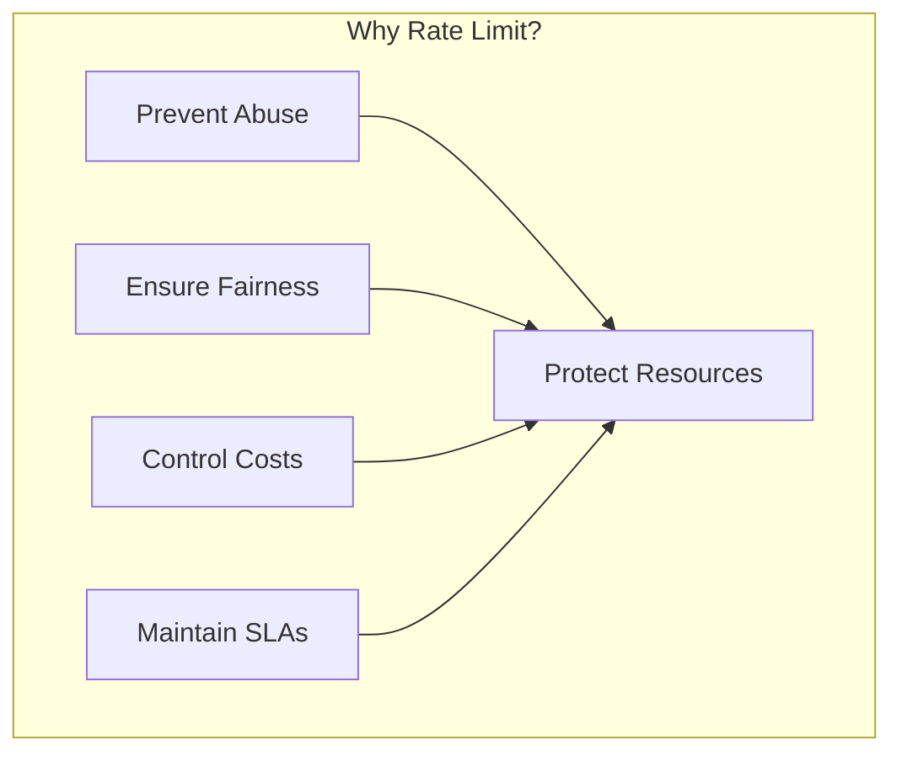
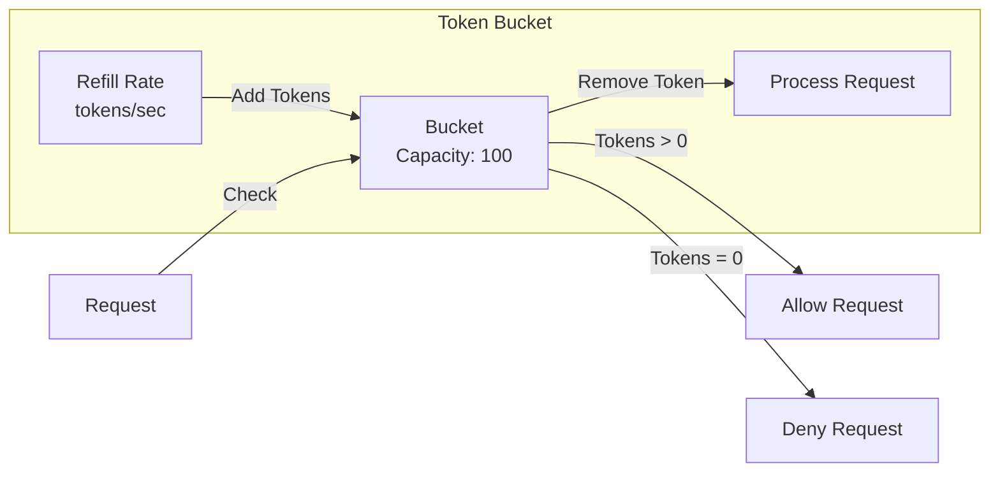

# How to Rate Limit gRPC Services

Author: [nawazdhandala](https://www.github.com/nawazdhandala)

Tags: gRPC, Rate Limiting, Security, Token Bucket, Sliding Window, Redis, Interceptors

Description: Learn how to implement rate limiting in gRPC services using token bucket, sliding window algorithms, and distributed rate limiting with Redis.

---

## Introduction

Rate limiting is essential for protecting gRPC services from abuse, ensuring fair resource allocation, and maintaining system stability. This guide covers implementing various rate limiting strategies in gRPC services, from simple in-memory limiters to distributed solutions using Redis.

## Rate Limiting Fundamentals



### Common Rate Limiting Algorithms

| Algorithm | Description | Use Case |
|-----------|-------------|----------|
| Token Bucket | Allows bursts, smooth average rate | API rate limiting |
| Leaky Bucket | Constant output rate | Traffic shaping |
| Fixed Window | Simple counter per time window | Basic limiting |
| Sliding Window | More accurate than fixed window | Precise limiting |
| Sliding Log | Most accurate, memory intensive | High-precision needs |

## Token Bucket Algorithm

### Token Bucket Implementation

```go
package ratelimit

import (
    "sync"
    "time"
)

// TokenBucket implements the token bucket algorithm
type TokenBucket struct {
    capacity     float64       // Maximum tokens
    tokens       float64       // Current tokens
    refillRate   float64       // Tokens added per second
    lastRefill   time.Time     // Last refill timestamp
    mu           sync.Mutex
}

// NewTokenBucket creates a new token bucket
func NewTokenBucket(capacity float64, refillRate float64) *TokenBucket {
    return &TokenBucket{
        capacity:   capacity,
        tokens:     capacity,
        refillRate: refillRate,
        lastRefill: time.Now(),
    }
}

// Allow checks if a request is allowed
func (tb *TokenBucket) Allow() bool {
    return tb.AllowN(1)
}

// AllowN checks if n tokens can be consumed
func (tb *TokenBucket) AllowN(n float64) bool {
    tb.mu.Lock()
    defer tb.mu.Unlock()

    // Refill tokens based on elapsed time
    now := time.Now()
    elapsed := now.Sub(tb.lastRefill).Seconds()
    tb.tokens = min(tb.capacity, tb.tokens+elapsed*tb.refillRate)
    tb.lastRefill = now

    // Check if enough tokens are available
    if tb.tokens >= n {
        tb.tokens -= n
        return true
    }

    return false
}

// Tokens returns the current number of tokens
func (tb *TokenBucket) Tokens() float64 {
    tb.mu.Lock()
    defer tb.mu.Unlock()

    now := time.Now()
    elapsed := now.Sub(tb.lastRefill).Seconds()
    return min(tb.capacity, tb.tokens+elapsed*tb.refillRate)
}

func min(a, b float64) float64 {
    if a < b {
        return a
    }
    return b
}
```

### Token Bucket Visualization



## Sliding Window Algorithm

### Sliding Window Implementation

```go
package ratelimit

import (
    "sync"
    "time"
)

// SlidingWindow implements sliding window rate limiting
type SlidingWindow struct {
    limit       int64         // Maximum requests per window
    window      time.Duration // Window duration
    timestamps  []time.Time   // Request timestamps
    mu          sync.Mutex
}

// NewSlidingWindow creates a new sliding window limiter
func NewSlidingWindow(limit int64, window time.Duration) *SlidingWindow {
    return &SlidingWindow{
        limit:      limit,
        window:     window,
        timestamps: make([]time.Time, 0, limit),
    }
}

// Allow checks if a request is allowed
func (sw *SlidingWindow) Allow() bool {
    sw.mu.Lock()
    defer sw.mu.Unlock()

    now := time.Now()
    windowStart := now.Add(-sw.window)

    // Remove timestamps outside the window
    validIdx := 0
    for i, ts := range sw.timestamps {
        if ts.After(windowStart) {
            validIdx = i
            break
        }
        if i == len(sw.timestamps)-1 {
            validIdx = len(sw.timestamps)
        }
    }
    sw.timestamps = sw.timestamps[validIdx:]

    // Check if under limit
    if int64(len(sw.timestamps)) < sw.limit {
        sw.timestamps = append(sw.timestamps, now)
        return true
    }

    return false
}

// Count returns the current request count in the window
func (sw *SlidingWindow) Count() int64 {
    sw.mu.Lock()
    defer sw.mu.Unlock()

    now := time.Now()
    windowStart := now.Add(-sw.window)

    count := int64(0)
    for _, ts := range sw.timestamps {
        if ts.After(windowStart) {
            count++
        }
    }

    return count
}

// SlidingWindowCounter uses a more memory-efficient approach
type SlidingWindowCounter struct {
    limit        int64
    window       time.Duration
    prevCount    int64
    currCount    int64
    prevStart    time.Time
    currStart    time.Time
    mu           sync.Mutex
}

// NewSlidingWindowCounter creates a new sliding window counter
func NewSlidingWindowCounter(limit int64, window time.Duration) *SlidingWindowCounter {
    now := time.Now()
    return &SlidingWindowCounter{
        limit:     limit,
        window:    window,
        currStart: now,
        prevStart: now.Add(-window),
    }
}

// Allow checks if a request is allowed
func (sw *SlidingWindowCounter) Allow() bool {
    sw.mu.Lock()
    defer sw.mu.Unlock()

    now := time.Now()

    // Advance windows if necessary
    if now.Sub(sw.currStart) >= sw.window {
        sw.prevCount = sw.currCount
        sw.prevStart = sw.currStart
        sw.currCount = 0
        sw.currStart = sw.prevStart.Add(sw.window)
    }

    // Calculate weighted count
    elapsed := now.Sub(sw.currStart).Seconds()
    windowSecs := sw.window.Seconds()
    prevWeight := 1 - (elapsed / windowSecs)

    weightedCount := float64(sw.currCount) + float64(sw.prevCount)*prevWeight

    if weightedCount < float64(sw.limit) {
        sw.currCount++
        return true
    }

    return false
}
```

## gRPC Rate Limiting Interceptor

### Unary Rate Limiting Interceptor

```go
package interceptors

import (
    "context"
    "fmt"
    "sync"

    "google.golang.org/grpc"
    "google.golang.org/grpc/codes"
    "google.golang.org/grpc/metadata"
    "google.golang.org/grpc/status"

    "your-module/ratelimit"
)

// RateLimitConfig holds rate limiting configuration
type RateLimitConfig struct {
    // Global rate limit (requests per second)
    GlobalRPS float64

    // Per-client rate limit
    PerClientRPS float64

    // Per-method rate limits
    MethodLimits map[string]float64

    // Burst capacity multiplier
    BurstMultiplier float64

    // Key extractor function (e.g., extract client ID from metadata)
    KeyExtractor func(context.Context) string
}

// RateLimitInterceptor implements gRPC rate limiting
type RateLimitInterceptor struct {
    config        RateLimitConfig
    globalLimiter *ratelimit.TokenBucket
    clientLimiter sync.Map // map[string]*ratelimit.TokenBucket
    methodLimiter sync.Map // map[string]*ratelimit.TokenBucket
}

// NewRateLimitInterceptor creates a new rate limit interceptor
func NewRateLimitInterceptor(config RateLimitConfig) *RateLimitInterceptor {
    if config.BurstMultiplier == 0 {
        config.BurstMultiplier = 2.0
    }

    if config.KeyExtractor == nil {
        config.KeyExtractor = defaultKeyExtractor
    }

    rli := &RateLimitInterceptor{
        config: config,
    }

    // Initialize global limiter
    if config.GlobalRPS > 0 {
        rli.globalLimiter = ratelimit.NewTokenBucket(
            config.GlobalRPS*config.BurstMultiplier,
            config.GlobalRPS,
        )
    }

    // Initialize method limiters
    for method, rps := range config.MethodLimits {
        limiter := ratelimit.NewTokenBucket(rps*config.BurstMultiplier, rps)
        rli.methodLimiter.Store(method, limiter)
    }

    return rli
}

func defaultKeyExtractor(ctx context.Context) string {
    md, ok := metadata.FromIncomingContext(ctx)
    if !ok {
        return "anonymous"
    }

    // Try X-Client-ID header
    if clientID := md.Get("x-client-id"); len(clientID) > 0 {
        return clientID[0]
    }

    // Try authorization header (use subject)
    if auth := md.Get("authorization"); len(auth) > 0 {
        // In production, parse JWT and extract subject
        return auth[0][:32] // Simplified
    }

    return "anonymous"
}

// Unary returns a unary interceptor
func (rli *RateLimitInterceptor) Unary() grpc.UnaryServerInterceptor {
    return func(ctx context.Context, req interface{}, info *grpc.UnaryServerInfo, handler grpc.UnaryHandler) (interface{}, error) {
        // Check global rate limit
        if rli.globalLimiter != nil && !rli.globalLimiter.Allow() {
            return nil, status.Error(codes.ResourceExhausted, "global rate limit exceeded")
        }

        // Check method-specific rate limit
        if limiter, ok := rli.methodLimiter.Load(info.FullMethod); ok {
            if !limiter.(*ratelimit.TokenBucket).Allow() {
                return nil, status.Errorf(codes.ResourceExhausted,
                    "rate limit exceeded for method %s", info.FullMethod)
            }
        }

        // Check per-client rate limit
        if rli.config.PerClientRPS > 0 {
            clientKey := rli.config.KeyExtractor(ctx)
            limiter := rli.getOrCreateClientLimiter(clientKey)

            if !limiter.Allow() {
                return nil, status.Errorf(codes.ResourceExhausted,
                    "rate limit exceeded for client %s", clientKey)
            }
        }

        return handler(ctx, req)
    }
}

// Stream returns a stream interceptor
func (rli *RateLimitInterceptor) Stream() grpc.StreamServerInterceptor {
    return func(srv interface{}, ss grpc.ServerStream, info *grpc.StreamServerInfo, handler grpc.StreamHandler) error {
        // Check global rate limit
        if rli.globalLimiter != nil && !rli.globalLimiter.Allow() {
            return status.Error(codes.ResourceExhausted, "global rate limit exceeded")
        }

        // Check method-specific rate limit
        if limiter, ok := rli.methodLimiter.Load(info.FullMethod); ok {
            if !limiter.(*ratelimit.TokenBucket).Allow() {
                return status.Errorf(codes.ResourceExhausted,
                    "rate limit exceeded for method %s", info.FullMethod)
            }
        }

        // Check per-client rate limit
        if rli.config.PerClientRPS > 0 {
            clientKey := rli.config.KeyExtractor(ss.Context())
            limiter := rli.getOrCreateClientLimiter(clientKey)

            if !limiter.Allow() {
                return status.Errorf(codes.ResourceExhausted,
                    "rate limit exceeded for client %s", clientKey)
            }
        }

        // Wrap stream for per-message rate limiting
        wrapped := &rateLimitedStream{
            ServerStream: ss,
            limiter:      rli.getOrCreateClientLimiter(rli.config.KeyExtractor(ss.Context())),
        }

        return handler(srv, wrapped)
    }
}

func (rli *RateLimitInterceptor) getOrCreateClientLimiter(clientKey string) *ratelimit.TokenBucket {
    if limiter, ok := rli.clientLimiter.Load(clientKey); ok {
        return limiter.(*ratelimit.TokenBucket)
    }

    limiter := ratelimit.NewTokenBucket(
        rli.config.PerClientRPS*rli.config.BurstMultiplier,
        rli.config.PerClientRPS,
    )

    actual, _ := rli.clientLimiter.LoadOrStore(clientKey, limiter)
    return actual.(*ratelimit.TokenBucket)
}

// rateLimitedStream wraps ServerStream with per-message rate limiting
type rateLimitedStream struct {
    grpc.ServerStream
    limiter *ratelimit.TokenBucket
}

func (s *rateLimitedStream) RecvMsg(m interface{}) error {
    if !s.limiter.Allow() {
        return status.Error(codes.ResourceExhausted, "stream message rate limit exceeded")
    }
    return s.ServerStream.RecvMsg(m)
}
```

### Server Setup with Rate Limiting

```go
package main

import (
    "log"
    "net"

    "google.golang.org/grpc"

    "your-module/interceptors"
    pb "your-module/proto"
)

func main() {
    // Configure rate limiting
    rateLimitConfig := interceptors.RateLimitConfig{
        GlobalRPS:       1000,  // 1000 requests per second globally
        PerClientRPS:    100,   // 100 requests per second per client
        BurstMultiplier: 2.0,   // Allow 2x burst
        MethodLimits: map[string]float64{
            "/proto.UserService/CreateUser":  10,   // 10 creations per second
            "/proto.UserService/DeleteUser":  5,    // 5 deletions per second
            "/proto.ReportService/Generate":  1,    // 1 report generation per second
        },
    }

    // Create rate limit interceptor
    rateLimiter := interceptors.NewRateLimitInterceptor(rateLimitConfig)

    // Create gRPC server with rate limiting
    server := grpc.NewServer(
        grpc.ChainUnaryInterceptor(
            loggingInterceptor,
            rateLimiter.Unary(),
        ),
        grpc.ChainStreamInterceptor(
            streamLoggingInterceptor,
            rateLimiter.Stream(),
        ),
    )

    // Register services
    pb.RegisterUserServiceServer(server, NewUserService())

    listener, err := net.Listen("tcp", ":50051")
    if err != nil {
        log.Fatalf("Failed to listen: %v", err)
    }

    log.Println("gRPC server with rate limiting listening on :50051")
    if err := server.Serve(listener); err != nil {
        log.Fatalf("Failed to serve: %v", err)
    }
}
```

## Distributed Rate Limiting with Redis

### Redis Rate Limiter

```go
package ratelimit

import (
    "context"
    "fmt"
    "time"

    "github.com/go-redis/redis/v8"
)

// RedisRateLimiter implements distributed rate limiting using Redis
type RedisRateLimiter struct {
    client     *redis.Client
    keyPrefix  string
    limit      int64
    window     time.Duration
}

// NewRedisRateLimiter creates a new Redis-based rate limiter
func NewRedisRateLimiter(redisURL, keyPrefix string, limit int64, window time.Duration) (*RedisRateLimiter, error) {
    opt, err := redis.ParseURL(redisURL)
    if err != nil {
        return nil, err
    }

    client := redis.NewClient(opt)

    // Test connection
    ctx, cancel := context.WithTimeout(context.Background(), 5*time.Second)
    defer cancel()

    if err := client.Ping(ctx).Err(); err != nil {
        return nil, err
    }

    return &RedisRateLimiter{
        client:    client,
        keyPrefix: keyPrefix,
        limit:     limit,
        window:    window,
    }, nil
}

// Allow checks if a request is allowed (sliding window counter)
func (r *RedisRateLimiter) Allow(ctx context.Context, key string) (bool, error) {
    return r.AllowN(ctx, key, 1)
}

// AllowN checks if n requests are allowed
func (r *RedisRateLimiter) AllowN(ctx context.Context, key string, n int64) (bool, error) {
    fullKey := r.keyPrefix + key
    now := time.Now()
    windowStart := now.Add(-r.window)

    // Use Lua script for atomic operation
    script := redis.NewScript(`
        local key = KEYS[1]
        local now = tonumber(ARGV[1])
        local window_start = tonumber(ARGV[2])
        local limit = tonumber(ARGV[3])
        local count = tonumber(ARGV[4])
        local window_ms = tonumber(ARGV[5])

        -- Remove old entries
        redis.call('ZREMRANGEBYSCORE', key, '-inf', window_start)

        -- Get current count
        local current = redis.call('ZCARD', key)

        if current + count <= limit then
            -- Add new entries
            for i = 1, count do
                redis.call('ZADD', key, now, now .. '-' .. i .. '-' .. math.random())
            end
            -- Set expiry
            redis.call('PEXPIRE', key, window_ms)
            return 1
        end

        return 0
    `)

    result, err := script.Run(ctx, r.client, []string{fullKey},
        now.UnixMilli(),
        windowStart.UnixMilli(),
        r.limit,
        n,
        r.window.Milliseconds(),
    ).Int64()

    if err != nil {
        return false, err
    }

    return result == 1, nil
}

// GetCount returns the current request count for a key
func (r *RedisRateLimiter) GetCount(ctx context.Context, key string) (int64, error) {
    fullKey := r.keyPrefix + key
    windowStart := time.Now().Add(-r.window)

    // Remove old entries and count
    pipe := r.client.Pipeline()
    pipe.ZRemRangeByScore(ctx, fullKey, "-inf", fmt.Sprintf("%d", windowStart.UnixMilli()))
    countCmd := pipe.ZCard(ctx, fullKey)

    _, err := pipe.Exec(ctx)
    if err != nil {
        return 0, err
    }

    return countCmd.Val(), nil
}

// GetRemainingInfo returns rate limit information
type RateLimitInfo struct {
    Limit     int64
    Remaining int64
    ResetAt   time.Time
}

func (r *RedisRateLimiter) GetInfo(ctx context.Context, key string) (*RateLimitInfo, error) {
    count, err := r.GetCount(ctx, key)
    if err != nil {
        return nil, err
    }

    remaining := r.limit - count
    if remaining < 0 {
        remaining = 0
    }

    return &RateLimitInfo{
        Limit:     r.limit,
        Remaining: remaining,
        ResetAt:   time.Now().Add(r.window),
    }, nil
}
```

### Redis Token Bucket Implementation

```go
package ratelimit

import (
    "context"
    "time"

    "github.com/go-redis/redis/v8"
)

// RedisTokenBucket implements distributed token bucket using Redis
type RedisTokenBucket struct {
    client     *redis.Client
    keyPrefix  string
    capacity   float64
    refillRate float64 // Tokens per second
}

// NewRedisTokenBucket creates a new Redis token bucket
func NewRedisTokenBucket(client *redis.Client, keyPrefix string, capacity, refillRate float64) *RedisTokenBucket {
    return &RedisTokenBucket{
        client:     client,
        keyPrefix:  keyPrefix,
        capacity:   capacity,
        refillRate: refillRate,
    }
}

// Allow checks if a request is allowed
func (tb *RedisTokenBucket) Allow(ctx context.Context, key string) (bool, error) {
    return tb.AllowN(ctx, key, 1)
}

// AllowN checks if n tokens can be consumed
func (tb *RedisTokenBucket) AllowN(ctx context.Context, key string, n float64) (bool, error) {
    fullKey := tb.keyPrefix + key

    // Lua script for atomic token bucket operation
    script := redis.NewScript(`
        local key = KEYS[1]
        local capacity = tonumber(ARGV[1])
        local refill_rate = tonumber(ARGV[2])
        local requested = tonumber(ARGV[3])
        local now = tonumber(ARGV[4])

        -- Get current state
        local bucket = redis.call('HMGET', key, 'tokens', 'last_refill')
        local tokens = tonumber(bucket[1])
        local last_refill = tonumber(bucket[2])

        -- Initialize if not exists
        if tokens == nil then
            tokens = capacity
            last_refill = now
        end

        -- Calculate refill
        local elapsed = (now - last_refill) / 1000  -- Convert to seconds
        tokens = math.min(capacity, tokens + elapsed * refill_rate)

        -- Check if enough tokens
        if tokens >= requested then
            tokens = tokens - requested
            redis.call('HMSET', key, 'tokens', tokens, 'last_refill', now)
            redis.call('EXPIRE', key, math.ceil(capacity / refill_rate) + 1)
            return {1, tokens}
        end

        -- Update last_refill even if denied
        redis.call('HMSET', key, 'tokens', tokens, 'last_refill', now)
        return {0, tokens}
    `)

    result, err := script.Run(ctx, tb.client, []string{fullKey},
        tb.capacity,
        tb.refillRate,
        n,
        time.Now().UnixMilli(),
    ).Slice()

    if err != nil {
        return false, err
    }

    allowed := result[0].(int64) == 1
    return allowed, nil
}

// Tokens returns the current number of tokens
func (tb *RedisTokenBucket) Tokens(ctx context.Context, key string) (float64, error) {
    fullKey := tb.keyPrefix + key

    result, err := tb.client.HMGet(ctx, fullKey, "tokens", "last_refill").Result()
    if err != nil {
        return 0, err
    }

    if result[0] == nil {
        return tb.capacity, nil
    }

    tokens, _ := result[0].(float64)
    lastRefill, _ := result[1].(float64)

    // Calculate current tokens
    elapsed := float64(time.Now().UnixMilli()-int64(lastRefill)) / 1000
    return min(tb.capacity, tokens+elapsed*tb.refillRate), nil
}
```

### Distributed Rate Limit Interceptor

```go
package interceptors

import (
    "context"
    "strconv"

    "google.golang.org/grpc"
    "google.golang.org/grpc/codes"
    "google.golang.org/grpc/metadata"
    "google.golang.org/grpc/status"

    "your-module/ratelimit"
)

// DistributedRateLimiter uses Redis for distributed rate limiting
type DistributedRateLimiter struct {
    limiter       *ratelimit.RedisRateLimiter
    tokenBucket   *ratelimit.RedisTokenBucket
    keyExtractor  func(context.Context, string) string
    useTokenBucket bool
}

// NewDistributedRateLimiter creates a new distributed rate limiter
func NewDistributedRateLimiter(redisURL string, limit int64, window time.Duration) (*DistributedRateLimiter, error) {
    limiter, err := ratelimit.NewRedisRateLimiter(redisURL, "ratelimit:", limit, window)
    if err != nil {
        return nil, err
    }

    return &DistributedRateLimiter{
        limiter:      limiter,
        keyExtractor: defaultDistributedKeyExtractor,
    }, nil
}

func defaultDistributedKeyExtractor(ctx context.Context, method string) string {
    md, ok := metadata.FromIncomingContext(ctx)
    if !ok {
        return "global:" + method
    }

    if clientID := md.Get("x-client-id"); len(clientID) > 0 {
        return clientID[0] + ":" + method
    }

    return "global:" + method
}

// Unary returns a unary interceptor
func (d *DistributedRateLimiter) Unary() grpc.UnaryServerInterceptor {
    return func(ctx context.Context, req interface{}, info *grpc.UnaryServerInfo, handler grpc.UnaryHandler) (interface{}, error) {
        key := d.keyExtractor(ctx, info.FullMethod)

        allowed, err := d.limiter.Allow(ctx, key)
        if err != nil {
            // Log error but allow request (fail open)
            // In production, you might want to fail closed
            log.Printf("Rate limit check failed: %v", err)
            return handler(ctx, req)
        }

        if !allowed {
            // Get rate limit info for response headers
            info, _ := d.limiter.GetInfo(ctx, key)
            if info != nil {
                // Set rate limit headers in response
                header := metadata.Pairs(
                    "x-ratelimit-limit", strconv.FormatInt(info.Limit, 10),
                    "x-ratelimit-remaining", strconv.FormatInt(info.Remaining, 10),
                    "x-ratelimit-reset", strconv.FormatInt(info.ResetAt.Unix(), 10),
                )
                grpc.SetHeader(ctx, header)
            }

            return nil, status.Error(codes.ResourceExhausted, "rate limit exceeded")
        }

        return handler(ctx, req)
    }
}

// Stream returns a stream interceptor
func (d *DistributedRateLimiter) Stream() grpc.StreamServerInterceptor {
    return func(srv interface{}, ss grpc.ServerStream, info *grpc.StreamServerInfo, handler grpc.StreamHandler) error {
        key := d.keyExtractor(ss.Context(), info.FullMethod)

        allowed, err := d.limiter.Allow(ss.Context(), key)
        if err != nil {
            log.Printf("Rate limit check failed: %v", err)
            return handler(srv, ss)
        }

        if !allowed {
            return status.Error(codes.ResourceExhausted, "rate limit exceeded")
        }

        return handler(srv, ss)
    }
}
```

## Advanced Rate Limiting Patterns

### Adaptive Rate Limiting

```go
package ratelimit

import (
    "context"
    "sync"
    "time"
)

// AdaptiveRateLimiter adjusts limits based on system load
type AdaptiveRateLimiter struct {
    baseLimiter   *TokenBucket
    minRate       float64
    maxRate       float64
    currentRate   float64
    loadThreshold float64
    loadGetter    func() float64
    mu            sync.RWMutex
}

// NewAdaptiveRateLimiter creates a new adaptive rate limiter
func NewAdaptiveRateLimiter(minRate, maxRate, initialRate float64, loadGetter func() float64) *AdaptiveRateLimiter {
    return &AdaptiveRateLimiter{
        baseLimiter:   NewTokenBucket(initialRate*2, initialRate),
        minRate:       minRate,
        maxRate:       maxRate,
        currentRate:   initialRate,
        loadThreshold: 0.8,
        loadGetter:    loadGetter,
    }
}

// Start begins the adaptive adjustment loop
func (a *AdaptiveRateLimiter) Start(ctx context.Context, interval time.Duration) {
    go func() {
        ticker := time.NewTicker(interval)
        defer ticker.Stop()

        for {
            select {
            case <-ctx.Done():
                return
            case <-ticker.C:
                a.adjust()
            }
        }
    }()
}

func (a *AdaptiveRateLimiter) adjust() {
    load := a.loadGetter()

    a.mu.Lock()
    defer a.mu.Unlock()

    if load > a.loadThreshold {
        // Reduce rate
        newRate := a.currentRate * 0.9
        if newRate >= a.minRate {
            a.currentRate = newRate
            a.baseLimiter = NewTokenBucket(newRate*2, newRate)
        }
    } else if load < a.loadThreshold*0.7 {
        // Increase rate
        newRate := a.currentRate * 1.1
        if newRate <= a.maxRate {
            a.currentRate = newRate
            a.baseLimiter = NewTokenBucket(newRate*2, newRate)
        }
    }
}

// Allow checks if a request is allowed
func (a *AdaptiveRateLimiter) Allow() bool {
    a.mu.RLock()
    limiter := a.baseLimiter
    a.mu.RUnlock()

    return limiter.Allow()
}

// GetCurrentRate returns the current rate limit
func (a *AdaptiveRateLimiter) GetCurrentRate() float64 {
    a.mu.RLock()
    defer a.mu.RUnlock()
    return a.currentRate
}
```

### Priority-Based Rate Limiting

```go
package ratelimit

import (
    "context"
    "sync"
)

// Priority levels
type Priority int

const (
    PriorityLow Priority = iota
    PriorityNormal
    PriorityHigh
    PriorityCritical
)

// PriorityRateLimiter allows different limits based on priority
type PriorityRateLimiter struct {
    limiters map[Priority]*TokenBucket
    mu       sync.RWMutex
}

// PriorityConfig holds configuration for each priority level
type PriorityConfig struct {
    Priority Priority
    Rate     float64
    Burst    float64
}

// NewPriorityRateLimiter creates a new priority-based rate limiter
func NewPriorityRateLimiter(configs []PriorityConfig) *PriorityRateLimiter {
    limiters := make(map[Priority]*TokenBucket)

    for _, config := range configs {
        limiters[config.Priority] = NewTokenBucket(config.Burst, config.Rate)
    }

    return &PriorityRateLimiter{
        limiters: limiters,
    }
}

// Allow checks if a request with the given priority is allowed
func (p *PriorityRateLimiter) Allow(priority Priority) bool {
    p.mu.RLock()
    limiter, ok := p.limiters[priority]
    p.mu.RUnlock()

    if !ok {
        return false
    }

    return limiter.Allow()
}

// AllowWithFallback tries higher priorities if current fails
func (p *PriorityRateLimiter) AllowWithFallback(priority Priority) bool {
    p.mu.RLock()
    defer p.mu.RUnlock()

    // Try requested priority first
    if limiter, ok := p.limiters[priority]; ok && limiter.Allow() {
        return true
    }

    // For critical priority, try to use lower priority buckets
    if priority == PriorityCritical {
        for _, level := range []Priority{PriorityHigh, PriorityNormal, PriorityLow} {
            if limiter, ok := p.limiters[level]; ok && limiter.Allow() {
                return true
            }
        }
    }

    return false
}
```

### Rate Limiting with Quotas

```go
package ratelimit

import (
    "context"
    "sync"
    "time"
)

// QuotaManager manages rate limits with quotas
type QuotaManager struct {
    quotas    map[string]*Quota
    mu        sync.RWMutex
    persister QuotaPersister
}

// Quota represents a rate limit quota
type Quota struct {
    ID         string
    Limit      int64
    Used       int64
    Period     time.Duration
    ResetAt    time.Time
    BurstLimit int64
    BurstUsed  int64
}

// QuotaPersister interface for quota persistence
type QuotaPersister interface {
    Load(ctx context.Context, id string) (*Quota, error)
    Save(ctx context.Context, quota *Quota) error
}

// NewQuotaManager creates a new quota manager
func NewQuotaManager(persister QuotaPersister) *QuotaManager {
    return &QuotaManager{
        quotas:    make(map[string]*Quota),
        persister: persister,
    }
}

// GetOrCreate gets or creates a quota for an ID
func (qm *QuotaManager) GetOrCreate(ctx context.Context, id string, limit int64, period time.Duration) (*Quota, error) {
    qm.mu.Lock()
    defer qm.mu.Unlock()

    if quota, ok := qm.quotas[id]; ok {
        // Check if quota needs reset
        if time.Now().After(quota.ResetAt) {
            quota.Used = 0
            quota.BurstUsed = 0
            quota.ResetAt = time.Now().Add(quota.Period)
        }
        return quota, nil
    }

    // Try to load from persister
    quota, err := qm.persister.Load(ctx, id)
    if err != nil || quota == nil {
        // Create new quota
        quota = &Quota{
            ID:         id,
            Limit:      limit,
            Used:       0,
            Period:     period,
            ResetAt:    time.Now().Add(period),
            BurstLimit: limit / 10,
            BurstUsed:  0,
        }
    }

    qm.quotas[id] = quota
    return quota, nil
}

// Consume attempts to consume from quota
func (qm *QuotaManager) Consume(ctx context.Context, id string, amount int64) (bool, *Quota, error) {
    qm.mu.Lock()
    defer qm.mu.Unlock()

    quota, ok := qm.quotas[id]
    if !ok {
        return false, nil, fmt.Errorf("quota not found: %s", id)
    }

    // Reset if period expired
    if time.Now().After(quota.ResetAt) {
        quota.Used = 0
        quota.BurstUsed = 0
        quota.ResetAt = time.Now().Add(quota.Period)
    }

    // Check if quota allows
    if quota.Used+amount <= quota.Limit {
        quota.Used += amount
        qm.persister.Save(ctx, quota)
        return true, quota, nil
    }

    return false, quota, nil
}

// GetRemainder returns the remaining quota
func (qm *QuotaManager) GetRemainder(ctx context.Context, id string) (int64, error) {
    qm.mu.RLock()
    defer qm.mu.RUnlock()

    quota, ok := qm.quotas[id]
    if !ok {
        return 0, fmt.Errorf("quota not found: %s", id)
    }

    remaining := quota.Limit - quota.Used
    if remaining < 0 {
        return 0, nil
    }

    return remaining, nil
}
```

## Python Rate Limiting Implementation

```python
import time
import threading
import redis
from typing import Optional, Tuple
from dataclasses import dataclass

class TokenBucket:
    """Token bucket rate limiter implementation."""

    def __init__(self, capacity: float, refill_rate: float):
        self.capacity = capacity
        self.tokens = capacity
        self.refill_rate = refill_rate
        self.last_refill = time.time()
        self._lock = threading.Lock()

    def allow(self, n: float = 1) -> bool:
        """Check if n tokens can be consumed."""
        with self._lock:
            now = time.time()
            elapsed = now - self.last_refill
            self.tokens = min(self.capacity, self.tokens + elapsed * self.refill_rate)
            self.last_refill = now

            if self.tokens >= n:
                self.tokens -= n
                return True
            return False


class SlidingWindowCounter:
    """Sliding window counter rate limiter."""

    def __init__(self, limit: int, window_seconds: int):
        self.limit = limit
        self.window = window_seconds
        self.prev_count = 0
        self.curr_count = 0
        self.prev_start = time.time() - window_seconds
        self.curr_start = time.time()
        self._lock = threading.Lock()

    def allow(self) -> bool:
        """Check if request is allowed."""
        with self._lock:
            now = time.time()

            # Advance window if needed
            if now - self.curr_start >= self.window:
                self.prev_count = self.curr_count
                self.prev_start = self.curr_start
                self.curr_count = 0
                self.curr_start = self.prev_start + self.window

            # Calculate weighted count
            elapsed = now - self.curr_start
            prev_weight = 1 - (elapsed / self.window)
            weighted_count = self.curr_count + self.prev_count * prev_weight

            if weighted_count < self.limit:
                self.curr_count += 1
                return True
            return False


class RedisRateLimiter:
    """Distributed rate limiter using Redis."""

    def __init__(self, redis_client: redis.Redis, key_prefix: str, limit: int, window_seconds: int):
        self.redis = redis_client
        self.key_prefix = key_prefix
        self.limit = limit
        self.window = window_seconds

        # Lua script for atomic sliding window
        self._script = self.redis.register_script("""
            local key = KEYS[1]
            local now = tonumber(ARGV[1])
            local window_start = tonumber(ARGV[2])
            local limit = tonumber(ARGV[3])
            local window_ms = tonumber(ARGV[4])

            -- Remove old entries
            redis.call('ZREMRANGEBYSCORE', key, '-inf', window_start)

            -- Get current count
            local current = redis.call('ZCARD', key)

            if current < limit then
                -- Add new entry
                redis.call('ZADD', key, now, now .. '-' .. math.random())
                redis.call('PEXPIRE', key, window_ms)
                return {1, limit - current - 1}
            end

            return {0, 0}
        """)

    def allow(self, key: str) -> Tuple[bool, int]:
        """Check if request is allowed and return remaining quota."""
        full_key = f"{self.key_prefix}{key}"
        now = int(time.time() * 1000)
        window_start = now - (self.window * 1000)

        result = self._script(
            keys=[full_key],
            args=[now, window_start, self.limit, self.window * 1000]
        )

        return bool(result[0]), result[1]


@dataclass
class RateLimitInfo:
    """Rate limit information."""
    limit: int
    remaining: int
    reset_at: float


class RateLimitInterceptor:
    """gRPC server interceptor for rate limiting."""

    def __init__(self, limiter, key_extractor=None):
        self.limiter = limiter
        self.key_extractor = key_extractor or self._default_key_extractor

    def _default_key_extractor(self, context):
        """Extract rate limit key from context."""
        metadata = dict(context.invocation_metadata())
        return metadata.get('x-client-id', 'anonymous')

    def intercept_service(self, continuation, handler_call_details):
        method = handler_call_details.method
        metadata = dict(handler_call_details.invocation_metadata)
        key = f"{metadata.get('x-client-id', 'anonymous')}:{method}"

        if isinstance(self.limiter, RedisRateLimiter):
            allowed, remaining = self.limiter.allow(key)
        else:
            allowed = self.limiter.allow()
            remaining = -1

        if not allowed:
            return self._rate_limited_handler()

        return continuation(handler_call_details)

    def _rate_limited_handler(self):
        def handler(request, context):
            context.abort(grpc.StatusCode.RESOURCE_EXHAUSTED, 'Rate limit exceeded')
        return grpc.unary_unary_rpc_method_handler(handler)


# Example usage
def create_rate_limited_server():
    # Redis-based distributed rate limiter
    redis_client = redis.Redis(host='localhost', port=6379, db=0)
    limiter = RedisRateLimiter(redis_client, 'grpc:ratelimit:', limit=100, window_seconds=60)

    interceptor = RateLimitInterceptor(limiter)

    server = grpc.server(
        futures.ThreadPoolExecutor(max_workers=10),
        interceptors=[interceptor]
    )

    return server
```

## Rate Limit Response Headers

### Adding Rate Limit Headers to gRPC Responses

```go
package interceptors

import (
    "context"
    "strconv"

    "google.golang.org/grpc"
    "google.golang.org/grpc/metadata"
)

// RateLimitHeaders adds rate limit information to response headers
type RateLimitHeaders struct {
    Limit     int64
    Remaining int64
    ResetAt   int64
}

func setRateLimitHeaders(ctx context.Context, headers RateLimitHeaders) error {
    md := metadata.Pairs(
        "x-ratelimit-limit", strconv.FormatInt(headers.Limit, 10),
        "x-ratelimit-remaining", strconv.FormatInt(headers.Remaining, 10),
        "x-ratelimit-reset", strconv.FormatInt(headers.ResetAt, 10),
    )

    return grpc.SetHeader(ctx, md)
}

// RateLimitInterceptorWithHeaders includes headers in responses
func RateLimitInterceptorWithHeaders(limiter *ratelimit.TokenBucket, limit int64) grpc.UnaryServerInterceptor {
    return func(ctx context.Context, req interface{}, info *grpc.UnaryServerInfo, handler grpc.UnaryHandler) (interface{}, error) {
        allowed := limiter.Allow()

        // Calculate remaining tokens
        remaining := int64(limiter.Tokens())
        if remaining < 0 {
            remaining = 0
        }

        // Set headers
        setRateLimitHeaders(ctx, RateLimitHeaders{
            Limit:     limit,
            Remaining: remaining,
            ResetAt:   time.Now().Add(time.Second).Unix(),
        })

        if !allowed {
            return nil, status.Error(codes.ResourceExhausted, "rate limit exceeded")
        }

        return handler(ctx, req)
    }
}
```

## Testing Rate Limiting

### Unit Tests

```go
package ratelimit

import (
    "context"
    "sync"
    "testing"
    "time"
)

func TestTokenBucket(t *testing.T) {
    bucket := NewTokenBucket(10, 1) // 10 capacity, 1 token/second

    // Should allow first 10 requests
    for i := 0; i < 10; i++ {
        if !bucket.Allow() {
            t.Errorf("Request %d should be allowed", i)
        }
    }

    // 11th request should be denied
    if bucket.Allow() {
        t.Error("11th request should be denied")
    }

    // Wait for refill
    time.Sleep(time.Second)

    // Should allow 1 more request
    if !bucket.Allow() {
        t.Error("Request after refill should be allowed")
    }
}

func TestTokenBucketConcurrent(t *testing.T) {
    bucket := NewTokenBucket(100, 10)
    allowed := int64(0)
    denied := int64(0)

    var wg sync.WaitGroup
    for i := 0; i < 200; i++ {
        wg.Add(1)
        go func() {
            defer wg.Done()
            if bucket.Allow() {
                atomic.AddInt64(&allowed, 1)
            } else {
                atomic.AddInt64(&denied, 1)
            }
        }()
    }

    wg.Wait()

    if allowed > 100 {
        t.Errorf("Expected max 100 allowed, got %d", allowed)
    }

    t.Logf("Allowed: %d, Denied: %d", allowed, denied)
}

func TestSlidingWindow(t *testing.T) {
    window := NewSlidingWindow(10, time.Second)

    // Allow first 10 requests
    for i := 0; i < 10; i++ {
        if !window.Allow() {
            t.Errorf("Request %d should be allowed", i)
        }
    }

    // Next should be denied
    if window.Allow() {
        t.Error("Request should be denied")
    }

    // Wait for window to slide
    time.Sleep(time.Second + 100*time.Millisecond)

    // Should allow again
    if !window.Allow() {
        t.Error("Request after window slide should be allowed")
    }
}
```

### Load Testing Rate Limits

```go
package ratelimit

import (
    "context"
    "sync"
    "testing"
    "time"

    "google.golang.org/grpc"
    "google.golang.org/grpc/codes"
    "google.golang.org/grpc/status"
)

func TestRateLimitUnderLoad(t *testing.T) {
    // Setup server with rate limiting
    rateLimiter := NewRateLimitInterceptor(RateLimitConfig{
        GlobalRPS: 100,
    })

    server := grpc.NewServer(
        grpc.UnaryInterceptor(rateLimiter.Unary()),
    )

    // Register test service
    pb.RegisterTestServiceServer(server, &TestService{})

    listener, _ := net.Listen("tcp", "localhost:0")
    go server.Serve(listener)
    defer server.Stop()

    // Create client
    conn, _ := grpc.Dial(listener.Addr().String(), grpc.WithInsecure())
    defer conn.Close()
    client := pb.NewTestServiceClient(conn)

    // Send requests concurrently
    var wg sync.WaitGroup
    results := make(chan error, 1000)

    start := time.Now()
    for i := 0; i < 1000; i++ {
        wg.Add(1)
        go func() {
            defer wg.Done()
            _, err := client.Echo(context.Background(), &pb.EchoRequest{Message: "test"})
            results <- err
        }()
    }

    wg.Wait()
    close(results)
    duration := time.Since(start)

    // Count results
    allowed := 0
    rateLimited := 0
    for err := range results {
        if err == nil {
            allowed++
        } else if status.Code(err) == codes.ResourceExhausted {
            rateLimited++
        }
    }

    t.Logf("Duration: %v, Allowed: %d, Rate Limited: %d", duration, allowed, rateLimited)

    // Verify rate limiting is working
    expectedMax := int(100 * duration.Seconds() * 2) // 2x for burst
    if allowed > expectedMax {
        t.Errorf("Expected max %d allowed, got %d", expectedMax, allowed)
    }
}
```

## Summary

Rate limiting is essential for protecting gRPC services. Key takeaways:

1. **Choose the Right Algorithm**: Token bucket for burst tolerance, sliding window for precision
2. **Use Distributed Limiting**: Redis-based solutions for multi-instance deployments
3. **Configure by Priority**: Different limits for different clients/methods
4. **Add Response Headers**: Inform clients about their rate limit status
5. **Monitor and Adapt**: Use adaptive rate limiting for dynamic load management
6. **Test Thoroughly**: Include rate limit testing in your test suite

Rate limiting protects your services from abuse while ensuring fair resource allocation for all clients.
