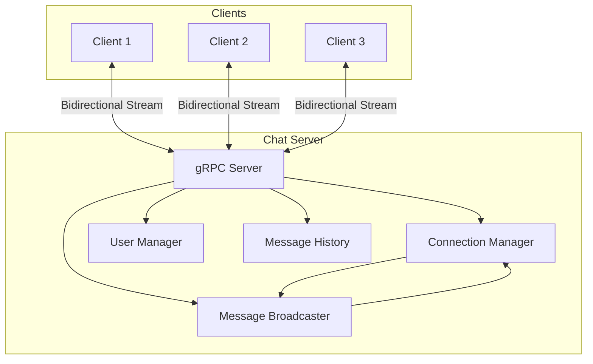
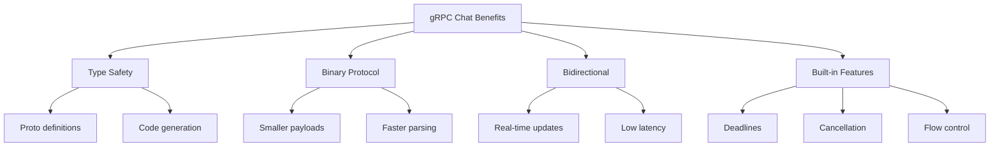

# How to Build a Real-Time Chat Application with gRPC Bidirectional Streaming

Author: [nawazdhandala](https://www.github.com/nawazdhandala)

Tags: gRPC, bidirectional streaming, real-time, chat application, WebSocket alternative, Go, microservices

Description: Learn to build a complete real-time chat application using gRPC bidirectional streaming with message broadcasting, user management, and robust connection handling.

---

Building real-time applications traditionally involves WebSockets or long-polling techniques. gRPC bidirectional streaming offers a powerful alternative with built-in features like strong typing, automatic code generation, and efficient binary serialization. This guide walks you through building a complete chat application with user management, message broadcasting, and robust connection handling.

## Architecture Overview



## Protocol Buffer Definitions

First, let's define our chat service with comprehensive message types:

```protobuf
// chat.proto
syntax = "proto3";

package chat;

option go_package = "github.com/example/chat";

import "google/protobuf/timestamp.proto";

// Main chat service
service ChatService {
    // Bidirectional streaming for real-time chat
    rpc Chat(stream ChatMessage) returns (stream ChatEvent);

    // Join a chat room
    rpc JoinRoom(JoinRoomRequest) returns (JoinRoomResponse);

    // Leave a chat room
    rpc LeaveRoom(LeaveRoomRequest) returns (LeaveRoomResponse);

    // Get message history
    rpc GetHistory(GetHistoryRequest) returns (stream ChatMessage);

    // Get online users
    rpc GetOnlineUsers(GetOnlineUsersRequest) returns (OnlineUsersResponse);
}

// User information
message User {
    string id = 1;
    string username = 2;
    string display_name = 3;
    string avatar_url = 4;
    UserStatus status = 5;
}

enum UserStatus {
    USER_STATUS_UNKNOWN = 0;
    USER_STATUS_ONLINE = 1;
    USER_STATUS_AWAY = 2;
    USER_STATUS_BUSY = 3;
    USER_STATUS_OFFLINE = 4;
}

// Chat message
message ChatMessage {
    string id = 1;
    string room_id = 2;
    User sender = 3;
    MessageContent content = 4;
    google.protobuf.Timestamp timestamp = 5;
    string reply_to_id = 6;  // For threaded replies
    repeated string mentions = 7;  // User IDs mentioned
}

message MessageContent {
    oneof content {
        string text = 1;
        ImageContent image = 2;
        FileContent file = 3;
        SystemMessage system = 4;
    }
}

message ImageContent {
    string url = 1;
    string alt_text = 2;
    int32 width = 3;
    int32 height = 4;
}

message FileContent {
    string url = 1;
    string filename = 2;
    int64 size_bytes = 3;
    string mime_type = 4;
}

message SystemMessage {
    SystemMessageType type = 1;
    string content = 2;
}

enum SystemMessageType {
    SYSTEM_MESSAGE_TYPE_UNKNOWN = 0;
    SYSTEM_MESSAGE_TYPE_USER_JOINED = 1;
    SYSTEM_MESSAGE_TYPE_USER_LEFT = 2;
    SYSTEM_MESSAGE_TYPE_ROOM_CREATED = 3;
    SYSTEM_MESSAGE_TYPE_USER_KICKED = 4;
}

// Events sent from server to client
message ChatEvent {
    oneof event {
        ChatMessage message = 1;
        UserJoinedEvent user_joined = 2;
        UserLeftEvent user_left = 3;
        UserTypingEvent user_typing = 4;
        MessageReadEvent message_read = 5;
        ErrorEvent error = 6;
        AckEvent ack = 7;
    }
}

message UserJoinedEvent {
    string room_id = 1;
    User user = 2;
    google.protobuf.Timestamp timestamp = 3;
}

message UserLeftEvent {
    string room_id = 1;
    User user = 2;
    google.protobuf.Timestamp timestamp = 3;
}

message UserTypingEvent {
    string room_id = 1;
    User user = 2;
    bool is_typing = 3;
}

message MessageReadEvent {
    string room_id = 1;
    string message_id = 2;
    User reader = 3;
    google.protobuf.Timestamp timestamp = 4;
}

message ErrorEvent {
    int32 code = 1;
    string message = 2;
}

message AckEvent {
    string message_id = 1;
    google.protobuf.Timestamp server_timestamp = 2;
}

// Room management
message JoinRoomRequest {
    string room_id = 1;
    User user = 2;
}

message JoinRoomResponse {
    bool success = 1;
    string error_message = 2;
    Room room = 3;
    repeated User online_users = 4;
}

message LeaveRoomRequest {
    string room_id = 1;
    string user_id = 2;
}

message LeaveRoomResponse {
    bool success = 1;
}

message Room {
    string id = 1;
    string name = 2;
    string description = 3;
    google.protobuf.Timestamp created_at = 4;
    int32 member_count = 5;
}

message GetHistoryRequest {
    string room_id = 1;
    int32 limit = 2;
    string before_message_id = 3;  // For pagination
}

message GetOnlineUsersRequest {
    string room_id = 1;
}

message OnlineUsersResponse {
    repeated User users = 1;
}
```

## Server Implementation

### Connection Manager

The connection manager handles all active client connections:

```go
// server/connection_manager.go
package server

import (
    "sync"
    "time"

    pb "github.com/example/chat"
)

// Connection represents a single client connection
type Connection struct {
    UserID       string
    User         *pb.User
    Stream       pb.ChatService_ChatServer
    RoomIDs      map[string]bool
    SendChan     chan *pb.ChatEvent
    Done         chan struct{}
    LastActivity time.Time
}

// ConnectionManager manages all active connections
type ConnectionManager struct {
    mu          sync.RWMutex
    connections map[string]*Connection // userID -> Connection
    rooms       map[string]map[string]*Connection // roomID -> userID -> Connection
}

func NewConnectionManager() *ConnectionManager {
    cm := &ConnectionManager{
        connections: make(map[string]*Connection),
        rooms:       make(map[string]map[string]*Connection),
    }

    // Start cleanup goroutine
    go cm.cleanupInactiveConnections()

    return cm
}

// AddConnection registers a new connection
func (cm *ConnectionManager) AddConnection(conn *Connection) {
    cm.mu.Lock()
    defer cm.mu.Unlock()

    // Remove existing connection for same user
    if existing, ok := cm.connections[conn.UserID]; ok {
        close(existing.Done)
    }

    cm.connections[conn.UserID] = conn
}

// RemoveConnection unregisters a connection
func (cm *ConnectionManager) RemoveConnection(userID string) {
    cm.mu.Lock()
    defer cm.mu.Unlock()

    conn, ok := cm.connections[userID]
    if !ok {
        return
    }

    // Remove from all rooms
    for roomID := range conn.RoomIDs {
        if room, ok := cm.rooms[roomID]; ok {
            delete(room, userID)
        }
    }

    delete(cm.connections, userID)
}

// JoinRoom adds a connection to a room
func (cm *ConnectionManager) JoinRoom(userID, roomID string) bool {
    cm.mu.Lock()
    defer cm.mu.Unlock()

    conn, ok := cm.connections[userID]
    if !ok {
        return false
    }

    if cm.rooms[roomID] == nil {
        cm.rooms[roomID] = make(map[string]*Connection)
    }

    cm.rooms[roomID][userID] = conn
    conn.RoomIDs[roomID] = true

    return true
}

// LeaveRoom removes a connection from a room
func (cm *ConnectionManager) LeaveRoom(userID, roomID string) {
    cm.mu.Lock()
    defer cm.mu.Unlock()

    conn, ok := cm.connections[userID]
    if !ok {
        return
    }

    delete(conn.RoomIDs, roomID)
    if room, ok := cm.rooms[roomID]; ok {
        delete(room, userID)
    }
}

// GetRoomConnections returns all connections in a room
func (cm *ConnectionManager) GetRoomConnections(roomID string) []*Connection {
    cm.mu.RLock()
    defer cm.mu.RUnlock()

    room, ok := cm.rooms[roomID]
    if !ok {
        return nil
    }

    connections := make([]*Connection, 0, len(room))
    for _, conn := range room {
        connections = append(connections, conn)
    }
    return connections
}

// GetConnection returns a specific connection
func (cm *ConnectionManager) GetConnection(userID string) *Connection {
    cm.mu.RLock()
    defer cm.mu.RUnlock()
    return cm.connections[userID]
}

// GetOnlineUsers returns all online users in a room
func (cm *ConnectionManager) GetOnlineUsers(roomID string) []*pb.User {
    cm.mu.RLock()
    defer cm.mu.RUnlock()

    room, ok := cm.rooms[roomID]
    if !ok {
        return nil
    }

    users := make([]*pb.User, 0, len(room))
    for _, conn := range room {
        users = append(users, conn.User)
    }
    return users
}

// UpdateActivity updates the last activity time for a connection
func (cm *ConnectionManager) UpdateActivity(userID string) {
    cm.mu.Lock()
    defer cm.mu.Unlock()

    if conn, ok := cm.connections[userID]; ok {
        conn.LastActivity = time.Now()
    }
}

// cleanupInactiveConnections removes stale connections
func (cm *ConnectionManager) cleanupInactiveConnections() {
    ticker := time.NewTicker(30 * time.Second)
    defer ticker.Stop()

    for range ticker.C {
        cm.mu.Lock()
        timeout := 5 * time.Minute
        now := time.Now()

        for userID, conn := range cm.connections {
            if now.Sub(conn.LastActivity) > timeout {
                close(conn.Done)
                delete(cm.connections, userID)

                for roomID := range conn.RoomIDs {
                    if room, ok := cm.rooms[roomID]; ok {
                        delete(room, userID)
                    }
                }
            }
        }
        cm.mu.Unlock()
    }
}
```

### Message Broadcaster

The broadcaster handles distributing messages to all room participants:

```go
// server/broadcaster.go
package server

import (
    "log"
    "sync"
    "time"

    pb "github.com/example/chat"
    "google.golang.org/protobuf/types/known/timestamppb"
)

// Broadcaster handles message distribution
type Broadcaster struct {
    connManager *ConnectionManager
    msgHistory  *MessageHistory

    // Buffered broadcast queue
    broadcastQueue chan *broadcastJob

    wg sync.WaitGroup
}

type broadcastJob struct {
    roomID string
    event  *pb.ChatEvent
    exclude string // userID to exclude
}

func NewBroadcaster(connManager *ConnectionManager, history *MessageHistory) *Broadcaster {
    b := &Broadcaster{
        connManager:    connManager,
        msgHistory:     history,
        broadcastQueue: make(chan *broadcastJob, 1000),
    }

    // Start broadcast workers
    for i := 0; i < 4; i++ {
        b.wg.Add(1)
        go b.broadcastWorker()
    }

    return b
}

// BroadcastMessage sends a message to all users in a room
func (b *Broadcaster) BroadcastMessage(roomID string, msg *pb.ChatMessage, excludeUserID string) {
    event := &pb.ChatEvent{
        Event: &pb.ChatEvent_Message{
            Message: msg,
        },
    }

    b.broadcastQueue <- &broadcastJob{
        roomID:  roomID,
        event:   event,
        exclude: excludeUserID,
    }

    // Store in history
    b.msgHistory.AddMessage(roomID, msg)
}

// BroadcastUserJoined notifies room when a user joins
func (b *Broadcaster) BroadcastUserJoined(roomID string, user *pb.User) {
    event := &pb.ChatEvent{
        Event: &pb.ChatEvent_UserJoined{
            UserJoined: &pb.UserJoinedEvent{
                RoomId:    roomID,
                User:      user,
                Timestamp: timestamppb.Now(),
            },
        },
    }

    b.broadcastQueue <- &broadcastJob{
        roomID:  roomID,
        event:   event,
        exclude: user.Id,
    }
}

// BroadcastUserLeft notifies room when a user leaves
func (b *Broadcaster) BroadcastUserLeft(roomID string, user *pb.User) {
    event := &pb.ChatEvent{
        Event: &pb.ChatEvent_UserLeft{
            UserLeft: &pb.UserLeftEvent{
                RoomId:    roomID,
                User:      user,
                Timestamp: timestamppb.Now(),
            },
        },
    }

    b.broadcastQueue <- &broadcastJob{
        roomID: roomID,
        event:  event,
    }
}

// BroadcastTyping notifies room of typing status
func (b *Broadcaster) BroadcastTyping(roomID string, user *pb.User, isTyping bool) {
    event := &pb.ChatEvent{
        Event: &pb.ChatEvent_UserTyping{
            UserTyping: &pb.UserTypingEvent{
                RoomId:   roomID,
                User:     user,
                IsTyping: isTyping,
            },
        },
    }

    b.broadcastQueue <- &broadcastJob{
        roomID:  roomID,
        event:   event,
        exclude: user.Id,
    }
}

// broadcastWorker processes broadcast jobs
func (b *Broadcaster) broadcastWorker() {
    defer b.wg.Done()

    for job := range b.broadcastQueue {
        connections := b.connManager.GetRoomConnections(job.roomID)

        for _, conn := range connections {
            if conn.UserID == job.exclude {
                continue
            }

            // Non-blocking send with timeout
            select {
            case conn.SendChan <- job.event:
            case <-time.After(100 * time.Millisecond):
                log.Printf("Timeout sending to user %s", conn.UserID)
            case <-conn.Done:
                // Connection closed
            }
        }
    }
}

// SendToUser sends an event to a specific user
func (b *Broadcaster) SendToUser(userID string, event *pb.ChatEvent) bool {
    conn := b.connManager.GetConnection(userID)
    if conn == nil {
        return false
    }

    select {
    case conn.SendChan <- event:
        return true
    case <-time.After(100 * time.Millisecond):
        return false
    case <-conn.Done:
        return false
    }
}

// Close shuts down the broadcaster
func (b *Broadcaster) Close() {
    close(b.broadcastQueue)
    b.wg.Wait()
}
```

### Message History

Store and retrieve message history:

```go
// server/message_history.go
package server

import (
    "sync"

    pb "github.com/example/chat"
)

// MessageHistory stores recent messages per room
type MessageHistory struct {
    mu       sync.RWMutex
    messages map[string][]*pb.ChatMessage // roomID -> messages
    maxSize  int
}

func NewMessageHistory(maxSize int) *MessageHistory {
    return &MessageHistory{
        messages: make(map[string][]*pb.ChatMessage),
        maxSize:  maxSize,
    }
}

// AddMessage adds a message to history
func (mh *MessageHistory) AddMessage(roomID string, msg *pb.ChatMessage) {
    mh.mu.Lock()
    defer mh.mu.Unlock()

    messages := mh.messages[roomID]
    messages = append(messages, msg)

    // Trim to max size
    if len(messages) > mh.maxSize {
        messages = messages[len(messages)-mh.maxSize:]
    }

    mh.messages[roomID] = messages
}

// GetMessages retrieves messages from history
func (mh *MessageHistory) GetMessages(roomID string, limit int, beforeID string) []*pb.ChatMessage {
    mh.mu.RLock()
    defer mh.mu.RUnlock()

    messages := mh.messages[roomID]
    if len(messages) == 0 {
        return nil
    }

    // Find starting point if beforeID specified
    startIdx := len(messages)
    if beforeID != "" {
        for i, msg := range messages {
            if msg.Id == beforeID {
                startIdx = i
                break
            }
        }
    }

    // Get messages before the starting point
    endIdx := startIdx
    startIdx = startIdx - limit
    if startIdx < 0 {
        startIdx = 0
    }

    result := make([]*pb.ChatMessage, endIdx-startIdx)
    copy(result, messages[startIdx:endIdx])
    return result
}

// GetLatestMessages retrieves the most recent messages
func (mh *MessageHistory) GetLatestMessages(roomID string, limit int) []*pb.ChatMessage {
    mh.mu.RLock()
    defer mh.mu.RUnlock()

    messages := mh.messages[roomID]
    if len(messages) == 0 {
        return nil
    }

    startIdx := len(messages) - limit
    if startIdx < 0 {
        startIdx = 0
    }

    result := make([]*pb.ChatMessage, len(messages)-startIdx)
    copy(result, messages[startIdx:])
    return result
}
```

### Chat Server Implementation

The main chat server handling all gRPC methods:

```go
// server/chat_server.go
package server

import (
    "context"
    "fmt"
    "io"
    "log"
    "sync"
    "time"

    pb "github.com/example/chat"
    "github.com/google/uuid"
    "google.golang.org/grpc/codes"
    "google.golang.org/grpc/status"
    "google.golang.org/protobuf/types/known/timestamppb"
)

type ChatServer struct {
    pb.UnimplementedChatServiceServer

    connManager *ConnectionManager
    broadcaster *Broadcaster
    msgHistory  *MessageHistory
    rooms       map[string]*pb.Room
    roomsMu     sync.RWMutex
}

func NewChatServer() *ChatServer {
    connManager := NewConnectionManager()
    msgHistory := NewMessageHistory(1000)
    broadcaster := NewBroadcaster(connManager, msgHistory)

    server := &ChatServer{
        connManager: connManager,
        broadcaster: broadcaster,
        msgHistory:  msgHistory,
        rooms:       make(map[string]*pb.Room),
    }

    // Create default rooms
    server.createRoom("general", "General", "General discussion")
    server.createRoom("random", "Random", "Random chat")

    return server
}

func (s *ChatServer) createRoom(id, name, description string) {
    s.roomsMu.Lock()
    defer s.roomsMu.Unlock()

    s.rooms[id] = &pb.Room{
        Id:          id,
        Name:        name,
        Description: description,
        CreatedAt:   timestamppb.Now(),
    }
}

// Chat implements bidirectional streaming
func (s *ChatServer) Chat(stream pb.ChatService_ChatServer) error {
    ctx := stream.Context()

    // First message must identify the user
    firstMsg, err := stream.Recv()
    if err != nil {
        return status.Error(codes.InvalidArgument, "failed to receive initial message")
    }

    if firstMsg.Sender == nil || firstMsg.Sender.Id == "" {
        return status.Error(codes.InvalidArgument, "first message must contain sender info")
    }

    user := firstMsg.Sender

    // Create connection
    conn := &Connection{
        UserID:       user.Id,
        User:         user,
        Stream:       stream,
        RoomIDs:      make(map[string]bool),
        SendChan:     make(chan *pb.ChatEvent, 100),
        Done:         make(chan struct{}),
        LastActivity: time.Now(),
    }

    s.connManager.AddConnection(conn)
    defer func() {
        s.handleDisconnect(conn)
    }()

    log.Printf("User %s connected", user.Username)

    // Process the first message if it has content
    if firstMsg.Content != nil {
        s.handleMessage(conn, firstMsg)
    }

    // Error channel for goroutines
    errChan := make(chan error, 2)

    // Sender goroutine - sends events to client
    go func() {
        for {
            select {
            case event := <-conn.SendChan:
                if err := stream.Send(event); err != nil {
                    errChan <- err
                    return
                }
            case <-conn.Done:
                return
            case <-ctx.Done():
                return
            }
        }
    }()

    // Receiver goroutine - receives messages from client
    go func() {
        for {
            msg, err := stream.Recv()
            if err == io.EOF {
                errChan <- nil
                return
            }
            if err != nil {
                errChan <- err
                return
            }

            s.connManager.UpdateActivity(user.Id)
            s.handleMessage(conn, msg)
        }
    }()

    // Wait for completion
    select {
    case err := <-errChan:
        return err
    case <-ctx.Done():
        return ctx.Err()
    }
}

// handleMessage processes incoming messages
func (s *ChatServer) handleMessage(conn *Connection, msg *pb.ChatMessage) {
    // Generate message ID and timestamp if not present
    if msg.Id == "" {
        msg.Id = uuid.New().String()
    }
    if msg.Timestamp == nil {
        msg.Timestamp = timestamppb.Now()
    }
    msg.Sender = conn.User

    // Handle different message types
    switch content := msg.Content.Content.(type) {
    case *pb.MessageContent_Text:
        s.handleTextMessage(conn, msg, content.Text)
    case *pb.MessageContent_System:
        // System messages handled internally
        log.Printf("Received system message from client (ignored): %v", content)
    default:
        // Broadcast other types as-is
        s.broadcaster.BroadcastMessage(msg.RoomId, msg, "")
    }

    // Send acknowledgment to sender
    ack := &pb.ChatEvent{
        Event: &pb.ChatEvent_Ack{
            Ack: &pb.AckEvent{
                MessageId:       msg.Id,
                ServerTimestamp: timestamppb.Now(),
            },
        },
    }
    s.broadcaster.SendToUser(conn.UserID, ack)
}

// handleTextMessage processes text messages including commands
func (s *ChatServer) handleTextMessage(conn *Connection, msg *pb.ChatMessage, text string) {
    // Check for commands
    if len(text) > 0 && text[0] == '/' {
        s.handleCommand(conn, msg.RoomId, text)
        return
    }

    // Validate room membership
    if !conn.RoomIDs[msg.RoomId] {
        s.sendError(conn, codes.PermissionDenied, "not a member of this room")
        return
    }

    // Broadcast message
    s.broadcaster.BroadcastMessage(msg.RoomId, msg, "")
}

// handleCommand processes chat commands
func (s *ChatServer) handleCommand(conn *Connection, roomID, command string) {
    switch {
    case command == "/typing":
        s.broadcaster.BroadcastTyping(roomID, conn.User, true)
    case command == "/stoptyping":
        s.broadcaster.BroadcastTyping(roomID, conn.User, false)
    case command == "/users":
        users := s.connManager.GetOnlineUsers(roomID)
        userList := "Online users: "
        for i, u := range users {
            if i > 0 {
                userList += ", "
            }
            userList += u.Username
        }
        s.sendSystemMessage(conn, userList)
    default:
        s.sendError(conn, codes.InvalidArgument, fmt.Sprintf("unknown command: %s", command))
    }
}

// sendError sends an error event to a user
func (s *ChatServer) sendError(conn *Connection, code codes.Code, message string) {
    event := &pb.ChatEvent{
        Event: &pb.ChatEvent_Error{
            Error: &pb.ErrorEvent{
                Code:    int32(code),
                Message: message,
            },
        },
    }
    s.broadcaster.SendToUser(conn.UserID, event)
}

// sendSystemMessage sends a system message to a user
func (s *ChatServer) sendSystemMessage(conn *Connection, content string) {
    msg := &pb.ChatMessage{
        Id:        uuid.New().String(),
        Timestamp: timestamppb.Now(),
        Content: &pb.MessageContent{
            Content: &pb.MessageContent_System{
                System: &pb.SystemMessage{
                    Content: content,
                },
            },
        },
    }
    event := &pb.ChatEvent{
        Event: &pb.ChatEvent_Message{
            Message: msg,
        },
    }
    s.broadcaster.SendToUser(conn.UserID, event)
}

// handleDisconnect cleans up when a user disconnects
func (s *ChatServer) handleDisconnect(conn *Connection) {
    log.Printf("User %s disconnected", conn.User.Username)

    // Notify all rooms
    for roomID := range conn.RoomIDs {
        s.broadcaster.BroadcastUserLeft(roomID, conn.User)
    }

    // Close connection
    close(conn.Done)
    s.connManager.RemoveConnection(conn.UserID)
}

// JoinRoom handles room join requests
func (s *ChatServer) JoinRoom(ctx context.Context, req *pb.JoinRoomRequest) (*pb.JoinRoomResponse, error) {
    if req.RoomId == "" {
        return nil, status.Error(codes.InvalidArgument, "room_id is required")
    }
    if req.User == nil || req.User.Id == "" {
        return nil, status.Error(codes.InvalidArgument, "user information is required")
    }

    s.roomsMu.RLock()
    room, exists := s.rooms[req.RoomId]
    s.roomsMu.RUnlock()

    if !exists {
        return &pb.JoinRoomResponse{
            Success:      false,
            ErrorMessage: "room not found",
        }, nil
    }

    // Add user to room
    if !s.connManager.JoinRoom(req.User.Id, req.RoomId) {
        return &pb.JoinRoomResponse{
            Success:      false,
            ErrorMessage: "user not connected",
        }, nil
    }

    // Broadcast join event
    s.broadcaster.BroadcastUserJoined(req.RoomId, req.User)

    // Get online users
    onlineUsers := s.connManager.GetOnlineUsers(req.RoomId)

    return &pb.JoinRoomResponse{
        Success:     true,
        Room:        room,
        OnlineUsers: onlineUsers,
    }, nil
}

// LeaveRoom handles room leave requests
func (s *ChatServer) LeaveRoom(ctx context.Context, req *pb.LeaveRoomRequest) (*pb.LeaveRoomResponse, error) {
    if req.RoomId == "" || req.UserId == "" {
        return nil, status.Error(codes.InvalidArgument, "room_id and user_id are required")
    }

    conn := s.connManager.GetConnection(req.UserId)
    if conn != nil {
        s.broadcaster.BroadcastUserLeft(req.RoomId, conn.User)
    }

    s.connManager.LeaveRoom(req.UserId, req.RoomId)

    return &pb.LeaveRoomResponse{Success: true}, nil
}

// GetHistory streams message history
func (s *ChatServer) GetHistory(req *pb.GetHistoryRequest, stream pb.ChatService_GetHistoryServer) error {
    if req.RoomId == "" {
        return status.Error(codes.InvalidArgument, "room_id is required")
    }

    limit := int(req.Limit)
    if limit <= 0 {
        limit = 50
    }

    messages := s.msgHistory.GetMessages(req.RoomId, limit, req.BeforeMessageId)

    for _, msg := range messages {
        if err := stream.Send(msg); err != nil {
            return err
        }
    }

    return nil
}

// GetOnlineUsers returns online users in a room
func (s *ChatServer) GetOnlineUsers(ctx context.Context, req *pb.GetOnlineUsersRequest) (*pb.OnlineUsersResponse, error) {
    if req.RoomId == "" {
        return nil, status.Error(codes.InvalidArgument, "room_id is required")
    }

    users := s.connManager.GetOnlineUsers(req.RoomId)

    return &pb.OnlineUsersResponse{Users: users}, nil
}
```

## Client Implementation

### Chat Client

```go
// client/chat_client.go
package client

import (
    "context"
    "fmt"
    "io"
    "log"
    "sync"
    "time"

    pb "github.com/example/chat"
    "github.com/google/uuid"
    "google.golang.org/grpc"
    "google.golang.org/grpc/credentials/insecure"
    "google.golang.org/protobuf/types/known/timestamppb"
)

// ChatClient handles chat operations
type ChatClient struct {
    conn        *grpc.ClientConn
    client      pb.ChatServiceClient
    user        *pb.User
    stream      pb.ChatService_ChatClient
    currentRoom string

    // Event handlers
    onMessage    func(*pb.ChatMessage)
    onUserJoined func(*pb.UserJoinedEvent)
    onUserLeft   func(*pb.UserLeftEvent)
    onTyping     func(*pb.UserTypingEvent)
    onError      func(*pb.ErrorEvent)

    mu     sync.Mutex
    ctx    context.Context
    cancel context.CancelFunc
}

// NewChatClient creates a new chat client
func NewChatClient(serverAddr string, user *pb.User) (*ChatClient, error) {
    conn, err := grpc.Dial(
        serverAddr,
        grpc.WithTransportCredentials(insecure.NewCredentials()),
        grpc.WithBlock(),
        grpc.WithTimeout(10*time.Second),
    )
    if err != nil {
        return nil, fmt.Errorf("failed to connect: %w", err)
    }

    return &ChatClient{
        conn:   conn,
        client: pb.NewChatServiceClient(conn),
        user:   user,
    }, nil
}

// SetHandlers configures event handlers
func (c *ChatClient) SetHandlers(
    onMessage func(*pb.ChatMessage),
    onUserJoined func(*pb.UserJoinedEvent),
    onUserLeft func(*pb.UserLeftEvent),
    onTyping func(*pb.UserTypingEvent),
    onError func(*pb.ErrorEvent),
) {
    c.onMessage = onMessage
    c.onUserJoined = onUserJoined
    c.onUserLeft = onUserLeft
    c.onTyping = onTyping
    c.onError = onError
}

// Connect establishes the bidirectional stream
func (c *ChatClient) Connect() error {
    c.mu.Lock()
    defer c.mu.Unlock()

    c.ctx, c.cancel = context.WithCancel(context.Background())

    stream, err := c.client.Chat(c.ctx)
    if err != nil {
        return fmt.Errorf("failed to create stream: %w", err)
    }
    c.stream = stream

    // Send initial message to identify user
    initMsg := &pb.ChatMessage{
        Id:        uuid.New().String(),
        Sender:    c.user,
        Timestamp: timestamppb.Now(),
    }
    if err := stream.Send(initMsg); err != nil {
        return fmt.Errorf("failed to send init message: %w", err)
    }

    // Start receiving events
    go c.receiveEvents()

    return nil
}

// receiveEvents handles incoming events from server
func (c *ChatClient) receiveEvents() {
    for {
        event, err := c.stream.Recv()
        if err == io.EOF {
            log.Println("Stream closed by server")
            return
        }
        if err != nil {
            log.Printf("Error receiving event: %v", err)
            return
        }

        c.handleEvent(event)
    }
}

// handleEvent processes different event types
func (c *ChatClient) handleEvent(event *pb.ChatEvent) {
    switch e := event.Event.(type) {
    case *pb.ChatEvent_Message:
        if c.onMessage != nil {
            c.onMessage(e.Message)
        }
    case *pb.ChatEvent_UserJoined:
        if c.onUserJoined != nil {
            c.onUserJoined(e.UserJoined)
        }
    case *pb.ChatEvent_UserLeft:
        if c.onUserLeft != nil {
            c.onUserLeft(e.UserLeft)
        }
    case *pb.ChatEvent_UserTyping:
        if c.onTyping != nil {
            c.onTyping(e.UserTyping)
        }
    case *pb.ChatEvent_Error:
        if c.onError != nil {
            c.onError(e.Error)
        }
    case *pb.ChatEvent_Ack:
        log.Printf("Message %s acknowledged at %v", e.Ack.MessageId, e.Ack.ServerTimestamp.AsTime())
    }
}

// JoinRoom joins a chat room
func (c *ChatClient) JoinRoom(roomID string) (*pb.JoinRoomResponse, error) {
    ctx, cancel := context.WithTimeout(context.Background(), 5*time.Second)
    defer cancel()

    resp, err := c.client.JoinRoom(ctx, &pb.JoinRoomRequest{
        RoomId: roomID,
        User:   c.user,
    })
    if err != nil {
        return nil, err
    }

    if resp.Success {
        c.currentRoom = roomID
    }

    return resp, nil
}

// LeaveRoom leaves a chat room
func (c *ChatClient) LeaveRoom(roomID string) error {
    ctx, cancel := context.WithTimeout(context.Background(), 5*time.Second)
    defer cancel()

    _, err := c.client.LeaveRoom(ctx, &pb.LeaveRoomRequest{
        RoomId: roomID,
        UserId: c.user.Id,
    })
    if err != nil {
        return err
    }

    if c.currentRoom == roomID {
        c.currentRoom = ""
    }

    return nil
}

// SendMessage sends a text message to the current room
func (c *ChatClient) SendMessage(text string) error {
    if c.currentRoom == "" {
        return fmt.Errorf("not in a room")
    }

    msg := &pb.ChatMessage{
        Id:     uuid.New().String(),
        RoomId: c.currentRoom,
        Sender: c.user,
        Content: &pb.MessageContent{
            Content: &pb.MessageContent_Text{
                Text: text,
            },
        },
        Timestamp: timestamppb.Now(),
    }

    return c.stream.Send(msg)
}

// SendTyping sends typing indicator
func (c *ChatClient) SendTyping(isTyping bool) error {
    if c.currentRoom == "" {
        return nil
    }

    command := "/typing"
    if !isTyping {
        command = "/stoptyping"
    }

    msg := &pb.ChatMessage{
        Id:     uuid.New().String(),
        RoomId: c.currentRoom,
        Sender: c.user,
        Content: &pb.MessageContent{
            Content: &pb.MessageContent_Text{
                Text: command,
            },
        },
    }

    return c.stream.Send(msg)
}

// GetHistory retrieves message history
func (c *ChatClient) GetHistory(roomID string, limit int) ([]*pb.ChatMessage, error) {
    ctx, cancel := context.WithTimeout(context.Background(), 10*time.Second)
    defer cancel()

    stream, err := c.client.GetHistory(ctx, &pb.GetHistoryRequest{
        RoomId: roomID,
        Limit:  int32(limit),
    })
    if err != nil {
        return nil, err
    }

    var messages []*pb.ChatMessage
    for {
        msg, err := stream.Recv()
        if err == io.EOF {
            break
        }
        if err != nil {
            return messages, err
        }
        messages = append(messages, msg)
    }

    return messages, nil
}

// GetOnlineUsers retrieves online users in a room
func (c *ChatClient) GetOnlineUsers(roomID string) ([]*pb.User, error) {
    ctx, cancel := context.WithTimeout(context.Background(), 5*time.Second)
    defer cancel()

    resp, err := c.client.GetOnlineUsers(ctx, &pb.GetOnlineUsersRequest{
        RoomId: roomID,
    })
    if err != nil {
        return nil, err
    }

    return resp.Users, nil
}

// Close disconnects the client
func (c *ChatClient) Close() {
    c.mu.Lock()
    defer c.mu.Unlock()

    if c.cancel != nil {
        c.cancel()
    }
    if c.stream != nil {
        c.stream.CloseSend()
    }
    if c.conn != nil {
        c.conn.Close()
    }
}
```

### Terminal Chat Application

```go
// cmd/chat/main.go
package main

import (
    "bufio"
    "fmt"
    "log"
    "os"
    "strings"

    pb "github.com/example/chat"
    "github.com/example/chat/client"
    "github.com/google/uuid"
)

func main() {
    // Get username from user
    reader := bufio.NewReader(os.Stdin)
    fmt.Print("Enter your username: ")
    username, _ := reader.ReadString('\n')
    username = strings.TrimSpace(username)

    if username == "" {
        username = "Anonymous"
    }

    // Create user
    user := &pb.User{
        Id:          uuid.New().String(),
        Username:    username,
        DisplayName: username,
        Status:      pb.UserStatus_USER_STATUS_ONLINE,
    }

    // Connect to server
    chatClient, err := client.NewChatClient("localhost:50051", user)
    if err != nil {
        log.Fatalf("Failed to create client: %v", err)
    }
    defer chatClient.Close()

    // Set up event handlers
    chatClient.SetHandlers(
        // On message
        func(msg *pb.ChatMessage) {
            if msg.Sender != nil {
                fmt.Printf("\n[%s] %s: ", msg.Timestamp.AsTime().Format("15:04"), msg.Sender.Username)
            } else {
                fmt.Printf("\n[%s] ", msg.Timestamp.AsTime().Format("15:04"))
            }

            switch content := msg.Content.Content.(type) {
            case *pb.MessageContent_Text:
                fmt.Println(content.Text)
            case *pb.MessageContent_System:
                fmt.Printf("[SYSTEM] %s\n", content.System.Content)
            default:
                fmt.Println("[Media message]")
            }
            fmt.Print("> ")
        },
        // On user joined
        func(event *pb.UserJoinedEvent) {
            fmt.Printf("\n*** %s joined the room ***\n> ", event.User.Username)
        },
        // On user left
        func(event *pb.UserLeftEvent) {
            fmt.Printf("\n*** %s left the room ***\n> ", event.User.Username)
        },
        // On typing
        func(event *pb.UserTypingEvent) {
            if event.IsTyping {
                fmt.Printf("\n%s is typing...\n> ", event.User.Username)
            }
        },
        // On error
        func(event *pb.ErrorEvent) {
            fmt.Printf("\n[ERROR] %s\n> ", event.Message)
        },
    )

    // Connect
    if err := chatClient.Connect(); err != nil {
        log.Fatalf("Failed to connect: %v", err)
    }

    // Join general room
    resp, err := chatClient.JoinRoom("general")
    if err != nil {
        log.Fatalf("Failed to join room: %v", err)
    }

    fmt.Printf("Joined room: %s\n", resp.Room.Name)
    fmt.Printf("Online users: ")
    for i, u := range resp.OnlineUsers {
        if i > 0 {
            fmt.Print(", ")
        }
        fmt.Print(u.Username)
    }
    fmt.Println()
    fmt.Println("Type '/help' for commands")
    fmt.Println()

    // Main input loop
    for {
        fmt.Print("> ")
        text, _ := reader.ReadString('\n')
        text = strings.TrimSpace(text)

        if text == "" {
            continue
        }

        // Handle commands
        if strings.HasPrefix(text, "/") {
            handleCommand(chatClient, text)
            continue
        }

        // Send message
        if err := chatClient.SendMessage(text); err != nil {
            fmt.Printf("Failed to send message: %v\n", err)
        }
    }
}

func handleCommand(c *client.ChatClient, command string) {
    parts := strings.Fields(command)
    if len(parts) == 0 {
        return
    }

    switch parts[0] {
    case "/help":
        fmt.Println("Commands:")
        fmt.Println("  /join <room>  - Join a room")
        fmt.Println("  /leave        - Leave current room")
        fmt.Println("  /users        - List online users")
        fmt.Println("  /history      - Get message history")
        fmt.Println("  /quit         - Exit the chat")

    case "/join":
        if len(parts) < 2 {
            fmt.Println("Usage: /join <room>")
            return
        }
        resp, err := c.JoinRoom(parts[1])
        if err != nil {
            fmt.Printf("Failed to join: %v\n", err)
            return
        }
        if resp.Success {
            fmt.Printf("Joined %s\n", resp.Room.Name)
        } else {
            fmt.Printf("Failed: %s\n", resp.ErrorMessage)
        }

    case "/leave":
        // Implementation would need current room tracking
        fmt.Println("Left room")

    case "/users":
        users, err := c.GetOnlineUsers("general")
        if err != nil {
            fmt.Printf("Error: %v\n", err)
            return
        }
        fmt.Println("Online users:")
        for _, u := range users {
            fmt.Printf("  - %s\n", u.Username)
        }

    case "/history":
        messages, err := c.GetHistory("general", 10)
        if err != nil {
            fmt.Printf("Error: %v\n", err)
            return
        }
        fmt.Println("Recent messages:")
        for _, msg := range messages {
            if text, ok := msg.Content.Content.(*pb.MessageContent_Text); ok {
                fmt.Printf("  [%s] %s: %s\n",
                    msg.Timestamp.AsTime().Format("15:04"),
                    msg.Sender.Username,
                    text.Text)
            }
        }

    case "/quit":
        fmt.Println("Goodbye!")
        os.Exit(0)

    default:
        fmt.Printf("Unknown command: %s\n", parts[0])
    }
}
```

## Connection Handling Best Practices

### Reconnection Logic

```go
// client/reconnection.go
package client

import (
    "context"
    "log"
    "sync"
    "time"

    pb "github.com/example/chat"
    "google.golang.org/grpc"
    "google.golang.org/grpc/connectivity"
)

type ReconnectingClient struct {
    *ChatClient

    serverAddr    string
    reconnectChan chan struct{}
    mu            sync.Mutex
    isConnected   bool

    maxRetries    int
    baseDelay     time.Duration
    maxDelay      time.Duration
}

func NewReconnectingClient(serverAddr string, user *pb.User) *ReconnectingClient {
    return &ReconnectingClient{
        ChatClient:    nil,
        serverAddr:    serverAddr,
        reconnectChan: make(chan struct{}, 1),
        maxRetries:    10,
        baseDelay:     time.Second,
        maxDelay:      30 * time.Second,
    }
}

func (rc *ReconnectingClient) Connect() error {
    rc.mu.Lock()
    defer rc.mu.Unlock()

    client, err := NewChatClient(rc.serverAddr, rc.ChatClient.user)
    if err != nil {
        return err
    }

    rc.ChatClient = client
    rc.isConnected = true

    // Start connection monitor
    go rc.monitorConnection()

    return rc.ChatClient.Connect()
}

func (rc *ReconnectingClient) monitorConnection() {
    for {
        state := rc.conn.GetState()

        if state == connectivity.TransientFailure || state == connectivity.Shutdown {
            rc.mu.Lock()
            rc.isConnected = false
            rc.mu.Unlock()

            log.Println("Connection lost, attempting reconnect...")
            rc.attemptReconnect()
        }

        // Wait for state change
        ctx, cancel := context.WithTimeout(context.Background(), 5*time.Second)
        rc.conn.WaitForStateChange(ctx, state)
        cancel()
    }
}

func (rc *ReconnectingClient) attemptReconnect() {
    delay := rc.baseDelay

    for attempt := 0; attempt < rc.maxRetries; attempt++ {
        log.Printf("Reconnection attempt %d/%d", attempt+1, rc.maxRetries)

        if err := rc.Connect(); err == nil {
            log.Println("Reconnected successfully")

            // Rejoin rooms
            rc.rejoinRooms()
            return
        }

        time.Sleep(delay)
        delay *= 2
        if delay > rc.maxDelay {
            delay = rc.maxDelay
        }
    }

    log.Println("Failed to reconnect after maximum attempts")
}

func (rc *ReconnectingClient) rejoinRooms() {
    // Re-join the current room if any
    if rc.currentRoom != "" {
        if _, err := rc.JoinRoom(rc.currentRoom); err != nil {
            log.Printf("Failed to rejoin room %s: %v", rc.currentRoom, err)
        }
    }
}

func (rc *ReconnectingClient) IsConnected() bool {
    rc.mu.Lock()
    defer rc.mu.Unlock()
    return rc.isConnected
}
```

### Heartbeat Implementation

```go
// server/heartbeat.go
package server

import (
    "context"
    "time"

    pb "github.com/example/chat"
    "google.golang.org/protobuf/types/known/timestamppb"
)

// HeartbeatManager sends periodic heartbeats to clients
type HeartbeatManager struct {
    connManager *ConnectionManager
    interval    time.Duration
    done        chan struct{}
}

func NewHeartbeatManager(connManager *ConnectionManager, interval time.Duration) *HeartbeatManager {
    return &HeartbeatManager{
        connManager: connManager,
        interval:    interval,
        done:        make(chan struct{}),
    }
}

func (hm *HeartbeatManager) Start() {
    ticker := time.NewTicker(hm.interval)
    defer ticker.Stop()

    for {
        select {
        case <-ticker.C:
            hm.sendHeartbeats()
        case <-hm.done:
            return
        }
    }
}

func (hm *HeartbeatManager) sendHeartbeats() {
    heartbeat := &pb.ChatEvent{
        Event: &pb.ChatEvent_Message{
            Message: &pb.ChatMessage{
                Content: &pb.MessageContent{
                    Content: &pb.MessageContent_System{
                        System: &pb.SystemMessage{
                            Type:    pb.SystemMessageType_SYSTEM_MESSAGE_TYPE_UNKNOWN,
                            Content: "heartbeat",
                        },
                    },
                },
                Timestamp: timestamppb.Now(),
            },
        },
    }

    // Send to all connections
    hm.connManager.mu.RLock()
    defer hm.connManager.mu.RUnlock()

    for _, conn := range hm.connManager.connections {
        select {
        case conn.SendChan <- heartbeat:
        default:
            // Skip if channel is full
        }
    }
}

func (hm *HeartbeatManager) Stop() {
    close(hm.done)
}
```

## Running the Application

### Server Main

```go
// cmd/server/main.go
package main

import (
    "log"
    "net"
    "os"
    "os/signal"
    "syscall"
    "time"

    pb "github.com/example/chat"
    "github.com/example/chat/server"
    "google.golang.org/grpc"
    "google.golang.org/grpc/keepalive"
    "google.golang.org/grpc/reflection"
)

func main() {
    lis, err := net.Listen("tcp", ":50051")
    if err != nil {
        log.Fatalf("Failed to listen: %v", err)
    }

    // Configure gRPC server with keepalive
    grpcServer := grpc.NewServer(
        grpc.KeepaliveParams(keepalive.ServerParameters{
            MaxConnectionIdle:     5 * time.Minute,
            MaxConnectionAge:      30 * time.Minute,
            MaxConnectionAgeGrace: 5 * time.Second,
            Time:                  1 * time.Minute,
            Timeout:               20 * time.Second,
        }),
        grpc.KeepaliveEnforcementPolicy(keepalive.EnforcementPolicy{
            MinTime:             30 * time.Second,
            PermitWithoutStream: true,
        }),
    )

    // Register chat service
    chatServer := server.NewChatServer()
    pb.RegisterChatServiceServer(grpcServer, chatServer)

    // Enable reflection
    reflection.Register(grpcServer)

    // Graceful shutdown
    go func() {
        sigChan := make(chan os.Signal, 1)
        signal.Notify(sigChan, syscall.SIGINT, syscall.SIGTERM)
        <-sigChan

        log.Println("Shutting down server...")
        grpcServer.GracefulStop()
    }()

    log.Println("Chat server starting on :50051")
    if err := grpcServer.Serve(lis); err != nil {
        log.Fatalf("Failed to serve: %v", err)
    }
}
```

## Summary

Building a real-time chat application with gRPC bidirectional streaming provides several advantages:



Key takeaways:
- Use connection managers to track active clients efficiently
- Implement message broadcasting with buffered channels to prevent blocking
- Handle disconnections gracefully with proper cleanup
- Use heartbeats to detect stale connections
- Implement reconnection logic with exponential backoff
- Consider message history for users joining late

This architecture can scale to thousands of concurrent users with proper connection pooling and load balancing strategies.
