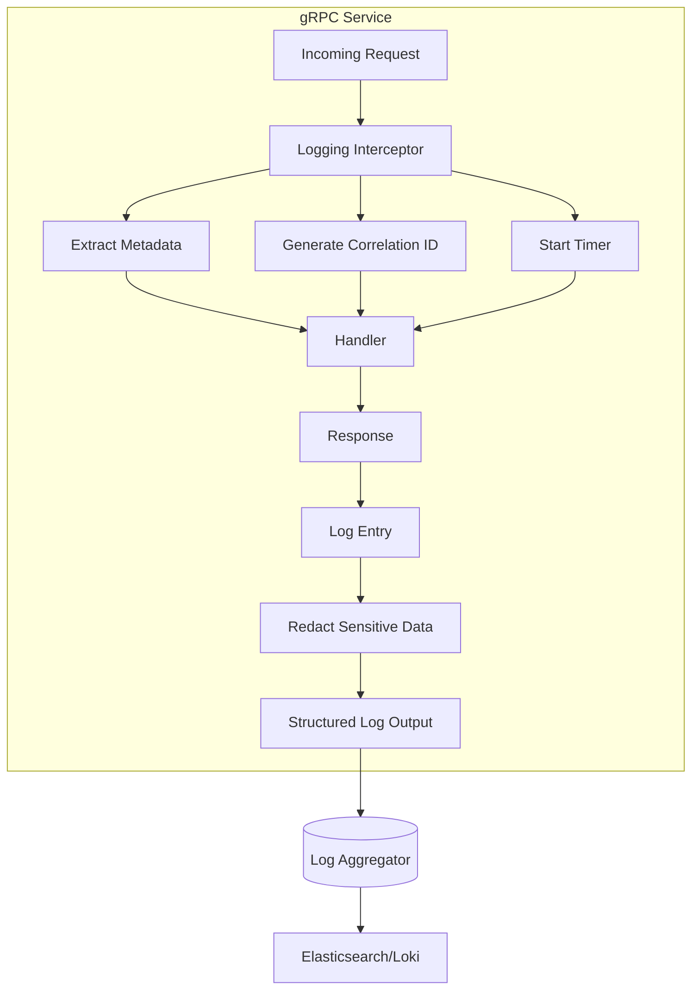

# How to Log gRPC Requests and Responses for Debugging

Author: [nawazdhandala](https://www.github.com/nawazdhandala)

Tags: gRPC, Logging, Debugging, Interceptors, Structured Logging, Observability, Go, Node.js

Description: Learn how to implement comprehensive request and response logging for gRPC services with structured logging, sensitive data redaction, and correlation IDs.

---

Effective logging is crucial for debugging gRPC services in production. Unlike HTTP REST APIs where tools like curl can easily inspect requests, gRPC's binary protocol requires intentional logging strategies. This guide covers implementing logging interceptors that capture the right information while protecting sensitive data.

## Logging Architecture



## Basic Logging Interceptor in Go

Start with a simple logging interceptor:

```go
package interceptors

import (
    "context"
    "encoding/json"
    "time"

    "go.uber.org/zap"
    "google.golang.org/grpc"
    "google.golang.org/grpc/metadata"
    "google.golang.org/grpc/status"
)

type LoggingInterceptor struct {
    logger *zap.Logger
}

func NewLoggingInterceptor(logger *zap.Logger) *LoggingInterceptor {
    return &LoggingInterceptor{logger: logger}
}

func (l *LoggingInterceptor) UnaryServerInterceptor() grpc.UnaryServerInterceptor {
    return func(
        ctx context.Context,
        req interface{},
        info *grpc.UnaryServerInfo,
        handler grpc.UnaryHandler,
    ) (interface{}, error) {
        start := time.Now()

        // Extract metadata
        md, _ := metadata.FromIncomingContext(ctx)

        // Call the handler
        resp, err := handler(ctx, req)

        // Calculate duration
        duration := time.Since(start)

        // Get status code
        st, _ := status.FromError(err)

        // Log the request
        l.logger.Info("gRPC request",
            zap.String("method", info.FullMethod),
            zap.Duration("duration", duration),
            zap.String("status_code", st.Code().String()),
            zap.Any("metadata", md),
            zap.Error(err),
        )

        return resp, err
    }
}

func (l *LoggingInterceptor) StreamServerInterceptor() grpc.StreamServerInterceptor {
    return func(
        srv interface{},
        ss grpc.ServerStream,
        info *grpc.StreamServerInfo,
        handler grpc.StreamHandler,
    ) error {
        start := time.Now()

        // Wrap the stream to count messages
        wrapped := &loggingServerStream{
            ServerStream: ss,
            recvCount:    0,
            sendCount:    0,
        }

        err := handler(srv, wrapped)

        duration := time.Since(start)
        st, _ := status.FromError(err)

        l.logger.Info("gRPC stream",
            zap.String("method", info.FullMethod),
            zap.Duration("duration", duration),
            zap.String("status_code", st.Code().String()),
            zap.Int("messages_received", wrapped.recvCount),
            zap.Int("messages_sent", wrapped.sendCount),
            zap.Error(err),
        )

        return err
    }
}

type loggingServerStream struct {
    grpc.ServerStream
    recvCount int
    sendCount int
}

func (s *loggingServerStream) RecvMsg(m interface{}) error {
    err := s.ServerStream.RecvMsg(m)
    if err == nil {
        s.recvCount++
    }
    return err
}

func (s *loggingServerStream) SendMsg(m interface{}) error {
    err := s.ServerStream.SendMsg(m)
    if err == nil {
        s.sendCount++
    }
    return err
}
```

## Correlation IDs for Request Tracing

Implement correlation ID generation and propagation:

```go
package correlation

import (
    "context"

    "github.com/google/uuid"
    "google.golang.org/grpc/metadata"
)

const (
    CorrelationIDKey = "x-correlation-id"
    RequestIDKey     = "x-request-id"
)

type correlationIDKey struct{}

// GetCorrelationID extracts or generates a correlation ID
func GetCorrelationID(ctx context.Context) string {
    // Check if already set in context
    if id, ok := ctx.Value(correlationIDKey{}).(string); ok {
        return id
    }

    // Try to extract from metadata
    if md, ok := metadata.FromIncomingContext(ctx); ok {
        if ids := md.Get(CorrelationIDKey); len(ids) > 0 {
            return ids[0]
        }
        if ids := md.Get(RequestIDKey); len(ids) > 0 {
            return ids[0]
        }
    }

    // Generate new ID
    return uuid.New().String()
}

// SetCorrelationID adds correlation ID to context
func SetCorrelationID(ctx context.Context, id string) context.Context {
    return context.WithValue(ctx, correlationIDKey{}, id)
}

// PropagateCorrelationID adds correlation ID to outgoing metadata
func PropagateCorrelationID(ctx context.Context) context.Context {
    id := GetCorrelationID(ctx)
    md, ok := metadata.FromOutgoingContext(ctx)
    if !ok {
        md = metadata.New(nil)
    }
    md.Set(CorrelationIDKey, id)
    return metadata.NewOutgoingContext(ctx, md)
}
```

## Structured Logging with Context

Create a context-aware logger:

```go
package logging

import (
    "context"

    "go.uber.org/zap"
    "your-project/correlation"
)

type ctxLoggerKey struct{}

// ContextLogger wraps zap.Logger with context awareness
type ContextLogger struct {
    base *zap.Logger
}

func NewContextLogger(logger *zap.Logger) *ContextLogger {
    return &ContextLogger{base: logger}
}

// WithContext returns a logger with fields from context
func (l *ContextLogger) WithContext(ctx context.Context) *zap.Logger {
    fields := []zap.Field{
        zap.String("correlation_id", correlation.GetCorrelationID(ctx)),
    }

    // Add user ID if present
    if userID := getUserIDFromContext(ctx); userID != "" {
        fields = append(fields, zap.String("user_id", userID))
    }

    // Add tenant ID if present
    if tenantID := getTenantIDFromContext(ctx); tenantID != "" {
        fields = append(fields, zap.String("tenant_id", tenantID))
    }

    return l.base.With(fields...)
}

// Inject logger into context
func (l *ContextLogger) InjectContext(ctx context.Context) context.Context {
    return context.WithValue(ctx, ctxLoggerKey{}, l.WithContext(ctx))
}

// FromContext retrieves logger from context
func FromContext(ctx context.Context) *zap.Logger {
    if logger, ok := ctx.Value(ctxLoggerKey{}).(*zap.Logger); ok {
        return logger
    }
    return zap.L() // Return global logger as fallback
}
```

## Advanced Logging Interceptor with Request/Response Bodies

```go
package interceptors

import (
    "context"
    "encoding/json"
    "time"

    "go.uber.org/zap"
    "google.golang.org/grpc"
    "google.golang.org/grpc/metadata"
    "google.golang.org/grpc/status"
    "google.golang.org/protobuf/encoding/protojson"
    "google.golang.org/protobuf/proto"

    "your-project/correlation"
    "your-project/logging"
)

type AdvancedLoggingConfig struct {
    LogRequestBody  bool
    LogResponseBody bool
    MaxBodySize     int
    SlowThreshold   time.Duration
    SensitiveFields []string
}

type AdvancedLoggingInterceptor struct {
    logger *logging.ContextLogger
    config AdvancedLoggingConfig
}

func NewAdvancedLoggingInterceptor(
    logger *logging.ContextLogger,
    config AdvancedLoggingConfig,
) *AdvancedLoggingInterceptor {
    return &AdvancedLoggingInterceptor{
        logger: logger,
        config: config,
    }
}

func (l *AdvancedLoggingInterceptor) UnaryServerInterceptor() grpc.UnaryServerInterceptor {
    return func(
        ctx context.Context,
        req interface{},
        info *grpc.UnaryServerInfo,
        handler grpc.UnaryHandler,
    ) (interface{}, error) {
        start := time.Now()

        // Set up correlation ID
        correlationID := correlation.GetCorrelationID(ctx)
        ctx = correlation.SetCorrelationID(ctx, correlationID)

        // Inject logger into context
        ctx = l.logger.InjectContext(ctx)
        log := logging.FromContext(ctx)

        // Extract metadata
        md, _ := metadata.FromIncomingContext(ctx)

        // Log request
        requestFields := []zap.Field{
            zap.String("type", "request"),
            zap.String("method", info.FullMethod),
            zap.Any("metadata", sanitizeMetadata(md)),
        }

        if l.config.LogRequestBody {
            requestFields = append(requestFields,
                zap.String("request_body", l.serializeMessage(req)),
            )
        }

        log.Debug("gRPC request received", requestFields...)

        // Call handler
        resp, err := handler(ctx, req)

        // Calculate metrics
        duration := time.Since(start)
        st, _ := status.FromError(err)

        // Build response log fields
        responseFields := []zap.Field{
            zap.String("type", "response"),
            zap.String("method", info.FullMethod),
            zap.Duration("duration", duration),
            zap.String("status_code", st.Code().String()),
        }

        if l.config.LogResponseBody && resp != nil {
            responseFields = append(responseFields,
                zap.String("response_body", l.serializeMessage(resp)),
            )
        }

        if err != nil {
            responseFields = append(responseFields,
                zap.String("error", st.Message()),
            )
        }

        // Choose log level based on status and duration
        logFunc := log.Info
        if err != nil {
            logFunc = log.Error
        } else if duration > l.config.SlowThreshold {
            logFunc = log.Warn
            responseFields = append(responseFields, zap.Bool("slow_request", true))
        }

        logFunc("gRPC request completed", responseFields...)

        return resp, err
    }
}

func (l *AdvancedLoggingInterceptor) serializeMessage(msg interface{}) string {
    if pm, ok := msg.(proto.Message); ok {
        // Use protojson for better readability
        marshaler := protojson.MarshalOptions{
            EmitUnpopulated: false,
            Indent:          "",
        }
        bytes, err := marshaler.Marshal(pm)
        if err != nil {
            return "<serialization error>"
        }

        // Truncate if too large
        result := string(bytes)
        if len(result) > l.config.MaxBodySize {
            return result[:l.config.MaxBodySize] + "...<truncated>"
        }

        // Redact sensitive fields
        result = l.redactSensitiveData(result)
        return result
    }

    // Fallback to JSON
    bytes, err := json.Marshal(msg)
    if err != nil {
        return "<serialization error>"
    }
    return l.redactSensitiveData(string(bytes))
}

func (l *AdvancedLoggingInterceptor) redactSensitiveData(data string) string {
    // Parse JSON, redact fields, re-serialize
    var obj map[string]interface{}
    if err := json.Unmarshal([]byte(data), &obj); err != nil {
        return data
    }

    l.redactFields(obj)

    result, _ := json.Marshal(obj)
    return string(result)
}

func (l *AdvancedLoggingInterceptor) redactFields(obj map[string]interface{}) {
    for key, value := range obj {
        // Check if field should be redacted
        for _, sensitive := range l.config.SensitiveFields {
            if key == sensitive {
                obj[key] = "[REDACTED]"
                break
            }
        }

        // Recursively process nested objects
        if nested, ok := value.(map[string]interface{}); ok {
            l.redactFields(nested)
        }
    }
}

func sanitizeMetadata(md metadata.MD) map[string]string {
    result := make(map[string]string)
    sensitiveHeaders := map[string]bool{
        "authorization": true,
        "cookie":        true,
        "x-api-key":     true,
    }

    for key, values := range md {
        if sensitiveHeaders[key] {
            result[key] = "[REDACTED]"
        } else if len(values) > 0 {
            result[key] = values[0]
        }
    }
    return result
}
```

## Sensitive Data Redaction

Create a comprehensive redaction system:

```go
package redaction

import (
    "encoding/json"
    "regexp"
    "strings"
)

type Redactor struct {
    sensitiveFields   []string
    sensitivePatterns []*regexp.Regexp
}

func NewRedactor(config RedactorConfig) *Redactor {
    patterns := make([]*regexp.Regexp, len(config.Patterns))
    for i, p := range config.Patterns {
        patterns[i] = regexp.MustCompile(p)
    }

    return &Redactor{
        sensitiveFields:   config.Fields,
        sensitivePatterns: patterns,
    }
}

type RedactorConfig struct {
    Fields   []string // Field names to redact
    Patterns []string // Regex patterns to redact
}

var DefaultConfig = RedactorConfig{
    Fields: []string{
        "password",
        "secret",
        "token",
        "api_key",
        "apiKey",
        "access_token",
        "accessToken",
        "refresh_token",
        "refreshToken",
        "credit_card",
        "creditCard",
        "ssn",
        "social_security",
        "private_key",
        "privateKey",
    },
    Patterns: []string{
        `"password"\s*:\s*"[^"]*"`,
        `\b[A-Za-z0-9._%+-]+@[A-Za-z0-9.-]+\.[A-Z|a-z]{2,}\b`, // Email
        `\b\d{3}-\d{2}-\d{4}\b`,                                 // SSN
        `\b\d{4}[\s-]?\d{4}[\s-]?\d{4}[\s-]?\d{4}\b`,          // Credit card
    },
}

func (r *Redactor) RedactJSON(data string) string {
    var obj interface{}
    if err := json.Unmarshal([]byte(data), &obj); err != nil {
        // If not valid JSON, apply pattern redaction only
        return r.redactPatterns(data)
    }

    r.redactValue(obj)
    result, _ := json.Marshal(obj)
    return r.redactPatterns(string(result))
}

func (r *Redactor) redactValue(v interface{}) {
    switch val := v.(type) {
    case map[string]interface{}:
        for key, value := range val {
            if r.isSensitiveField(key) {
                val[key] = "[REDACTED]"
            } else {
                r.redactValue(value)
            }
        }
    case []interface{}:
        for _, item := range val {
            r.redactValue(item)
        }
    }
}

func (r *Redactor) isSensitiveField(field string) bool {
    fieldLower := strings.ToLower(field)
    for _, sensitive := range r.sensitiveFields {
        if strings.ToLower(sensitive) == fieldLower {
            return true
        }
    }
    return false
}

func (r *Redactor) redactPatterns(data string) string {
    result := data
    for _, pattern := range r.sensitivePatterns {
        result = pattern.ReplaceAllString(result, "[REDACTED]")
    }
    return result
}
```

## Node.js Implementation

```javascript
// logging-interceptor.js
const grpc = require('@grpc/grpc-js');
const { v4: uuidv4 } = require('uuid');
const pino = require('pino');

const logger = pino({
  level: process.env.LOG_LEVEL || 'info',
  formatters: {
    level: (label) => ({ level: label }),
  },
  redact: {
    paths: ['password', 'token', 'apiKey', 'authorization', '*.password', '*.token'],
    censor: '[REDACTED]',
  },
});

const CORRELATION_ID_KEY = 'x-correlation-id';
const SENSITIVE_FIELDS = ['password', 'token', 'secret', 'apiKey', 'creditCard'];

function getCorrelationId(metadata) {
  const values = metadata.get(CORRELATION_ID_KEY);
  return values.length > 0 ? values[0] : uuidv4();
}

function redactSensitiveData(obj, sensitiveFields = SENSITIVE_FIELDS) {
  if (!obj || typeof obj !== 'object') return obj;

  const result = Array.isArray(obj) ? [] : {};

  for (const [key, value] of Object.entries(obj)) {
    if (sensitiveFields.some((field) => key.toLowerCase().includes(field.toLowerCase()))) {
      result[key] = '[REDACTED]';
    } else if (typeof value === 'object' && value !== null) {
      result[key] = redactSensitiveData(value, sensitiveFields);
    } else {
      result[key] = value;
    }
  }

  return result;
}

function truncateBody(body, maxSize = 1000) {
  const str = JSON.stringify(body);
  if (str.length <= maxSize) return str;
  return str.substring(0, maxSize) + '...<truncated>';
}

function loggingInterceptor(options = {}) {
  const {
    logRequestBody = false,
    logResponseBody = false,
    maxBodySize = 1000,
    slowThreshold = 1000, // ms
  } = options;

  return function (methodDefinition, call) {
    return async function (request) {
      const start = Date.now();
      const correlationId = getCorrelationId(call.metadata);
      const method = methodDefinition.path;

      const requestLog = {
        correlationId,
        method,
        type: 'request',
        metadata: redactSensitiveData(call.metadata.getMap()),
      };

      if (logRequestBody) {
        requestLog.body = truncateBody(redactSensitiveData(request), maxBodySize);
      }

      logger.info(requestLog, 'gRPC request received');

      try {
        const response = await methodDefinition.implementation(request);
        const duration = Date.now() - start;

        const responseLog = {
          correlationId,
          method,
          type: 'response',
          duration,
          status: 'OK',
        };

        if (logResponseBody) {
          responseLog.body = truncateBody(redactSensitiveData(response), maxBodySize);
        }

        if (duration > slowThreshold) {
          responseLog.slow = true;
          logger.warn(responseLog, 'gRPC slow request completed');
        } else {
          logger.info(responseLog, 'gRPC request completed');
        }

        return response;
      } catch (error) {
        const duration = Date.now() - start;

        logger.error(
          {
            correlationId,
            method,
            type: 'response',
            duration,
            status: error.code || 'UNKNOWN',
            error: error.message,
            stack: error.stack,
          },
          'gRPC request failed'
        );

        throw error;
      }
    };
  };
}

// Server setup with logging
function createLoggingServer(options) {
  const server = new grpc.Server();

  return {
    addService(serviceDefinition, implementation) {
      const wrappedImplementation = {};

      for (const [methodName, methodDef] of Object.entries(serviceDefinition)) {
        if (typeof implementation[methodName] === 'function') {
          wrappedImplementation[methodName] = wrapMethod(
            implementation[methodName],
            methodName,
            options
          );
        }
      }

      server.addService(serviceDefinition, wrappedImplementation);
    },
    ...server,
  };
}

function wrapMethod(method, methodName, options) {
  return async (call, callback) => {
    const start = Date.now();
    const correlationId = getCorrelationId(call.metadata);

    const log = logger.child({ correlationId, method: methodName });

    log.info(
      {
        type: 'request',
        ...(options.logRequestBody && { body: redactSensitiveData(call.request) }),
      },
      'gRPC request received'
    );

    const originalCallback = callback;
    callback = (error, response) => {
      const duration = Date.now() - start;

      if (error) {
        log.error(
          {
            type: 'response',
            duration,
            error: error.message,
            code: error.code,
          },
          'gRPC request failed'
        );
      } else {
        log.info(
          {
            type: 'response',
            duration,
            ...(options.logResponseBody && { body: redactSensitiveData(response) }),
          },
          'gRPC request completed'
        );
      }

      originalCallback(error, response);
    };

    try {
      await method(call, callback);
    } catch (error) {
      callback(error);
    }
  };
}

module.exports = {
  loggingInterceptor,
  createLoggingServer,
  logger,
};
```

## Log Aggregation with Fluentd

Configure Fluentd to collect and forward gRPC logs:

```xml
<!-- fluent.conf -->
<source>
  @type tail
  path /var/log/grpc/*.log
  pos_file /var/log/fluentd/grpc.pos
  tag grpc.logs
  <parse>
    @type json
    time_key timestamp
    time_format %Y-%m-%dT%H:%M:%S.%NZ
  </parse>
</source>

<filter grpc.logs>
  @type record_transformer
  <record>
    cluster "#{ENV['CLUSTER_NAME']}"
    namespace "#{ENV['NAMESPACE']}"
    pod_name "#{ENV['POD_NAME']}"
  </record>
</filter>

<match grpc.logs>
  @type elasticsearch
  host elasticsearch.logging.svc.cluster.local
  port 9200
  index_name grpc-logs
  type_name _doc
  logstash_format true
  logstash_prefix grpc
  <buffer>
    @type file
    path /var/log/fluentd/buffer
    flush_interval 5s
    retry_max_interval 30
    retry_forever true
  </buffer>
</match>
```

## Log Format Standards

Define a consistent log format:

```go
package logging

import (
    "time"

    "go.uber.org/zap"
    "go.uber.org/zap/zapcore"
)

type GRPCLogEntry struct {
    Timestamp     time.Time              `json:"timestamp"`
    Level         string                 `json:"level"`
    CorrelationID string                 `json:"correlation_id"`
    Service       string                 `json:"service"`
    Method        string                 `json:"method"`
    Type          string                 `json:"type"` // request, response
    Duration      float64                `json:"duration_ms,omitempty"`
    StatusCode    string                 `json:"status_code,omitempty"`
    Error         string                 `json:"error,omitempty"`
    RequestBody   string                 `json:"request_body,omitempty"`
    ResponseBody  string                 `json:"response_body,omitempty"`
    Metadata      map[string]string      `json:"metadata,omitempty"`
    Extra         map[string]interface{} `json:"extra,omitempty"`
}

func NewProductionLogger(serviceName string) (*zap.Logger, error) {
    config := zap.Config{
        Level:       zap.NewAtomicLevelAt(zap.InfoLevel),
        Development: false,
        Sampling: &zap.SamplingConfig{
            Initial:    100,
            Thereafter: 100,
        },
        Encoding: "json",
        EncoderConfig: zapcore.EncoderConfig{
            TimeKey:        "timestamp",
            LevelKey:       "level",
            NameKey:        "logger",
            CallerKey:      "caller",
            FunctionKey:    zapcore.OmitKey,
            MessageKey:     "message",
            StacktraceKey:  "stacktrace",
            LineEnding:     zapcore.DefaultLineEnding,
            EncodeLevel:    zapcore.LowercaseLevelEncoder,
            EncodeTime:     zapcore.ISO8601TimeEncoder,
            EncodeDuration: zapcore.MillisDurationEncoder,
            EncodeCaller:   zapcore.ShortCallerEncoder,
        },
        OutputPaths:      []string{"stdout"},
        ErrorOutputPaths: []string{"stderr"},
        InitialFields: map[string]interface{}{
            "service": serviceName,
        },
    }

    return config.Build()
}
```

## Kubernetes Deployment with Logging

```yaml
apiVersion: apps/v1
kind: Deployment
metadata:
  name: user-service
spec:
  template:
    spec:
      containers:
      - name: user-service
        image: user-service:latest
        env:
        - name: LOG_LEVEL
          value: "info"
        - name: LOG_FORMAT
          value: "json"
        - name: LOG_REQUEST_BODY
          value: "true"
        - name: LOG_RESPONSE_BODY
          value: "false"
        - name: SLOW_REQUEST_THRESHOLD
          value: "1000"
        - name: POD_NAME
          valueFrom:
            fieldRef:
              fieldPath: metadata.name
        - name: NAMESPACE
          valueFrom:
            fieldRef:
              fieldPath: metadata.namespace
        volumeMounts:
        - name: logs
          mountPath: /var/log/grpc
      - name: fluentd-sidecar
        image: fluent/fluentd:v1.16
        volumeMounts:
        - name: logs
          mountPath: /var/log/grpc
        - name: fluentd-config
          mountPath: /fluentd/etc
      volumes:
      - name: logs
        emptyDir: {}
      - name: fluentd-config
        configMap:
          name: fluentd-config
```

## Querying Logs in Elasticsearch

Example queries for debugging:

```json
// Find all requests for a correlation ID
{
  "query": {
    "term": {
      "correlation_id.keyword": "abc-123-def-456"
    }
  },
  "sort": [
    { "timestamp": "asc" }
  ]
}

// Find slow requests
{
  "query": {
    "bool": {
      "must": [
        { "range": { "duration_ms": { "gt": 1000 } } },
        { "term": { "type": "response" } }
      ]
    }
  },
  "sort": [
    { "duration_ms": "desc" }
  ]
}

// Find errors by method
{
  "query": {
    "bool": {
      "must": [
        { "exists": { "field": "error" } },
        { "term": { "method.keyword": "/user.UserService/GetUser" } }
      ]
    }
  },
  "aggs": {
    "error_codes": {
      "terms": { "field": "status_code.keyword" }
    }
  }
}

// Request rate by method over time
{
  "query": {
    "range": {
      "timestamp": {
        "gte": "now-1h"
      }
    }
  },
  "aggs": {
    "methods": {
      "terms": { "field": "method.keyword" },
      "aggs": {
        "requests_over_time": {
          "date_histogram": {
            "field": "timestamp",
            "fixed_interval": "1m"
          }
        }
      }
    }
  }
}
```

## Best Practices

1. **Use Structured Logging**: Always output JSON for easy parsing and querying
2. **Include Correlation IDs**: Essential for tracing requests across services
3. **Redact Sensitive Data**: Never log passwords, tokens, or PII
4. **Log at Appropriate Levels**: Use DEBUG for bodies, INFO for requests, ERROR for failures
5. **Set Size Limits**: Truncate large request/response bodies to prevent log bloat
6. **Add Context**: Include service name, method, duration, and status in every log
7. **Sample High-Volume Logs**: Consider sampling debug logs in production
8. **Monitor Log Volume**: Set up alerts for unexpected log volume increases

## Conclusion

Effective logging of gRPC requests and responses requires careful consideration of what to log, how to structure it, and how to protect sensitive data. By implementing proper logging interceptors with correlation IDs and structured output, you enable powerful debugging capabilities while maintaining security and performance. Start with basic request/response logging, then gradually add request bodies and advanced features as needed.
