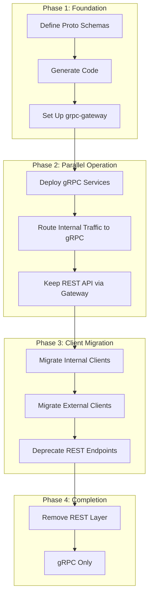

# How to Migrate from REST to gRPC Incrementally

Author: [nawazdhandala](https://www.github.com/nawazdhandala)

Tags: grpc, rest, migration, grpc-gateway, api, microservices, backwards-compatibility, gradual-rollout

Description: Learn strategies for incrementally migrating from REST to gRPC while maintaining backwards compatibility, using grpc-gateway for dual protocol support, and executing a phased rollout.

---

## Introduction

Migrating from REST to gRPC offers significant benefits including improved performance, type safety, and efficient binary serialization. However, a complete rewrite is risky and impractical for production systems. This guide presents strategies for incremental migration that maintains backwards compatibility while progressively adopting gRPC.

## Migration Strategy Overview



## Phase 1: Foundation

### Step 1: Analyze Existing REST API

Start by documenting your existing REST API:

```yaml
# existing-api-spec.yaml
openapi: 3.0.0
info:
  title: User Service API
  version: 1.0.0

paths:
  /users:
    get:
      summary: List users
      parameters:
        - name: page
          in: query
          schema:
            type: integer
        - name: limit
          in: query
          schema:
            type: integer
      responses:
        '200':
          content:
            application/json:
              schema:
                type: object
                properties:
                  users:
                    type: array
                    items:
                      $ref: '#/components/schemas/User'
                  total:
                    type: integer

    post:
      summary: Create user
      requestBody:
        content:
          application/json:
            schema:
              $ref: '#/components/schemas/CreateUserRequest'
      responses:
        '201':
          content:
            application/json:
              schema:
                $ref: '#/components/schemas/User'

  /users/{id}:
    get:
      summary: Get user by ID
      parameters:
        - name: id
          in: path
          required: true
          schema:
            type: string
      responses:
        '200':
          content:
            application/json:
              schema:
                $ref: '#/components/schemas/User'

components:
  schemas:
    User:
      type: object
      properties:
        id:
          type: string
        email:
          type: string
        name:
          type: string
        role:
          type: string
          enum: [admin, member, guest]
        created_at:
          type: string
          format: date-time

    CreateUserRequest:
      type: object
      required:
        - email
        - name
      properties:
        email:
          type: string
        name:
          type: string
        role:
          type: string
```

### Step 2: Design Proto Schema

Convert your REST API to Protocol Buffers:

```protobuf
// proto/user/v1/user.proto
syntax = "proto3";

package user.v1;

option go_package = "github.com/example/migration/gen/user/v1;userv1";

import "google/api/annotations.proto";
import "google/api/field_behavior.proto";
import "google/protobuf/timestamp.proto";
import "google/protobuf/empty.proto";

// User represents a user in the system
message User {
  // Unique identifier
  string id = 1 [(google.api.field_behavior) = OUTPUT_ONLY];

  // User's email address
  string email = 2 [(google.api.field_behavior) = REQUIRED];

  // User's display name
  string name = 3 [(google.api.field_behavior) = REQUIRED];

  // User's role
  UserRole role = 4;

  // Creation timestamp
  google.protobuf.Timestamp created_at = 5 [(google.api.field_behavior) = OUTPUT_ONLY];

  // Last update timestamp
  google.protobuf.Timestamp updated_at = 6 [(google.api.field_behavior) = OUTPUT_ONLY];
}

enum UserRole {
  USER_ROLE_UNSPECIFIED = 0;
  USER_ROLE_ADMIN = 1;
  USER_ROLE_MEMBER = 2;
  USER_ROLE_GUEST = 3;
}

// Request messages
message GetUserRequest {
  string id = 1 [(google.api.field_behavior) = REQUIRED];
}

message ListUsersRequest {
  int32 page_size = 1;
  string page_token = 2;
  string filter = 3;  // Optional filter expression
}

message ListUsersResponse {
  repeated User users = 1;
  string next_page_token = 2;
  int32 total_count = 3;
}

message CreateUserRequest {
  string email = 1 [(google.api.field_behavior) = REQUIRED];
  string name = 2 [(google.api.field_behavior) = REQUIRED];
  UserRole role = 3;
}

message UpdateUserRequest {
  string id = 1 [(google.api.field_behavior) = REQUIRED];
  string email = 2;
  string name = 3;
  UserRole role = 4;
}

message DeleteUserRequest {
  string id = 1 [(google.api.field_behavior) = REQUIRED];
}

// UserService provides user management operations
service UserService {
  // GetUser retrieves a user by ID
  rpc GetUser(GetUserRequest) returns (User) {
    option (google.api.http) = {
      get: "/v1/users/{id}"
    };
  }

  // ListUsers returns a paginated list of users
  rpc ListUsers(ListUsersRequest) returns (ListUsersResponse) {
    option (google.api.http) = {
      get: "/v1/users"
    };
  }

  // CreateUser creates a new user
  rpc CreateUser(CreateUserRequest) returns (User) {
    option (google.api.http) = {
      post: "/v1/users"
      body: "*"
    };
  }

  // UpdateUser updates an existing user
  rpc UpdateUser(UpdateUserRequest) returns (User) {
    option (google.api.http) = {
      patch: "/v1/users/{id}"
      body: "*"
    };
  }

  // DeleteUser removes a user
  rpc DeleteUser(DeleteUserRequest) returns (google.protobuf.Empty) {
    option (google.api.http) = {
      delete: "/v1/users/{id}"
    };
  }
}
```

### Step 3: Set Up Code Generation

Create `buf.yaml`:

```yaml
version: v1
deps:
  - buf.build/googleapis/googleapis
breaking:
  use:
    - FILE
lint:
  use:
    - DEFAULT
```

Create `buf.gen.yaml`:

```yaml
version: v1
plugins:
  - plugin: go
    out: gen
    opt:
      - paths=source_relative

  - plugin: go-grpc
    out: gen
    opt:
      - paths=source_relative

  - plugin: grpc-gateway
    out: gen
    opt:
      - paths=source_relative
      - generate_unbound_methods=true

  - plugin: openapiv2
    out: api
    opt:
      - allow_merge=true
      - merge_file_name=api
```

Generate code:

```bash
buf generate proto
```

## Phase 2: Parallel Operation

### Step 4: Implement gRPC Service

Create the gRPC service implementation:

```go
// internal/service/user_service.go
package service

import (
	"context"
	"time"

	"github.com/google/uuid"
	"google.golang.org/grpc/codes"
	"google.golang.org/grpc/status"
	"google.golang.org/protobuf/types/known/emptypb"
	"google.golang.org/protobuf/types/known/timestamppb"

	userv1 "github.com/example/migration/gen/user/v1"
)

// UserService implements the gRPC UserService
type UserService struct {
	userv1.UnimplementedUserServiceServer
	repo UserRepository
}

// UserRepository defines the data access interface
type UserRepository interface {
	GetByID(ctx context.Context, id string) (*User, error)
	List(ctx context.Context, pageSize int, pageToken string, filter string) ([]*User, string, int, error)
	Create(ctx context.Context, user *User) (*User, error)
	Update(ctx context.Context, user *User) (*User, error)
	Delete(ctx context.Context, id string) error
}

// User is the internal domain model
type User struct {
	ID        string
	Email     string
	Name      string
	Role      string
	CreatedAt time.Time
	UpdatedAt time.Time
}

// NewUserService creates a new UserService
func NewUserService(repo UserRepository) *UserService {
	return &UserService{repo: repo}
}

// GetUser retrieves a user by ID
func (s *UserService) GetUser(ctx context.Context, req *userv1.GetUserRequest) (*userv1.User, error) {
	if req.Id == "" {
		return nil, status.Error(codes.InvalidArgument, "id is required")
	}

	user, err := s.repo.GetByID(ctx, req.Id)
	if err != nil {
		return nil, status.Errorf(codes.NotFound, "user not found: %v", err)
	}

	return toProtoUser(user), nil
}

// ListUsers returns a paginated list of users
func (s *UserService) ListUsers(ctx context.Context, req *userv1.ListUsersRequest) (*userv1.ListUsersResponse, error) {
	pageSize := int(req.PageSize)
	if pageSize <= 0 {
		pageSize = 20
	}
	if pageSize > 100 {
		pageSize = 100
	}

	users, nextToken, total, err := s.repo.List(ctx, pageSize, req.PageToken, req.Filter)
	if err != nil {
		return nil, status.Errorf(codes.Internal, "failed to list users: %v", err)
	}

	protoUsers := make([]*userv1.User, len(users))
	for i, user := range users {
		protoUsers[i] = toProtoUser(user)
	}

	return &userv1.ListUsersResponse{
		Users:         protoUsers,
		NextPageToken: nextToken,
		TotalCount:    int32(total),
	}, nil
}

// CreateUser creates a new user
func (s *UserService) CreateUser(ctx context.Context, req *userv1.CreateUserRequest) (*userv1.User, error) {
	if req.Email == "" {
		return nil, status.Error(codes.InvalidArgument, "email is required")
	}
	if req.Name == "" {
		return nil, status.Error(codes.InvalidArgument, "name is required")
	}

	user := &User{
		ID:        uuid.New().String(),
		Email:     req.Email,
		Name:      req.Name,
		Role:      roleToString(req.Role),
		CreatedAt: time.Now(),
		UpdatedAt: time.Now(),
	}

	created, err := s.repo.Create(ctx, user)
	if err != nil {
		return nil, status.Errorf(codes.Internal, "failed to create user: %v", err)
	}

	return toProtoUser(created), nil
}

// UpdateUser updates an existing user
func (s *UserService) UpdateUser(ctx context.Context, req *userv1.UpdateUserRequest) (*userv1.User, error) {
	if req.Id == "" {
		return nil, status.Error(codes.InvalidArgument, "id is required")
	}

	existing, err := s.repo.GetByID(ctx, req.Id)
	if err != nil {
		return nil, status.Errorf(codes.NotFound, "user not found: %v", err)
	}

	// Apply updates
	if req.Email != "" {
		existing.Email = req.Email
	}
	if req.Name != "" {
		existing.Name = req.Name
	}
	if req.Role != userv1.UserRole_USER_ROLE_UNSPECIFIED {
		existing.Role = roleToString(req.Role)
	}
	existing.UpdatedAt = time.Now()

	updated, err := s.repo.Update(ctx, existing)
	if err != nil {
		return nil, status.Errorf(codes.Internal, "failed to update user: %v", err)
	}

	return toProtoUser(updated), nil
}

// DeleteUser removes a user
func (s *UserService) DeleteUser(ctx context.Context, req *userv1.DeleteUserRequest) (*emptypb.Empty, error) {
	if req.Id == "" {
		return nil, status.Error(codes.InvalidArgument, "id is required")
	}

	if err := s.repo.Delete(ctx, req.Id); err != nil {
		return nil, status.Errorf(codes.Internal, "failed to delete user: %v", err)
	}

	return &emptypb.Empty{}, nil
}

// Helper functions
func toProtoUser(user *User) *userv1.User {
	return &userv1.User{
		Id:        user.ID,
		Email:     user.Email,
		Name:      user.Name,
		Role:      stringToRole(user.Role),
		CreatedAt: timestamppb.New(user.CreatedAt),
		UpdatedAt: timestamppb.New(user.UpdatedAt),
	}
}

func roleToString(role userv1.UserRole) string {
	switch role {
	case userv1.UserRole_USER_ROLE_ADMIN:
		return "admin"
	case userv1.UserRole_USER_ROLE_MEMBER:
		return "member"
	case userv1.UserRole_USER_ROLE_GUEST:
		return "guest"
	default:
		return "member"
	}
}

func stringToRole(role string) userv1.UserRole {
	switch role {
	case "admin":
		return userv1.UserRole_USER_ROLE_ADMIN
	case "member":
		return userv1.UserRole_USER_ROLE_MEMBER
	case "guest":
		return userv1.UserRole_USER_ROLE_GUEST
	default:
		return userv1.UserRole_USER_ROLE_UNSPECIFIED
	}
}
```

### Step 5: Create Unified Server

Serve both gRPC and REST from a single binary:

```go
// cmd/server/main.go
package main

import (
	"context"
	"fmt"
	"log"
	"net"
	"net/http"
	"os"
	"os/signal"
	"sync"
	"syscall"
	"time"

	"github.com/grpc-ecosystem/grpc-gateway/v2/runtime"
	"google.golang.org/grpc"
	"google.golang.org/grpc/credentials/insecure"
	"google.golang.org/grpc/health"
	"google.golang.org/grpc/health/grpc_health_v1"
	"google.golang.org/grpc/reflection"
	"google.golang.org/protobuf/encoding/protojson"

	userv1 "github.com/example/migration/gen/user/v1"
	"github.com/example/migration/internal/repository"
	"github.com/example/migration/internal/service"
)

const (
	grpcPort = ":50051"
	httpPort = ":8080"
)

func main() {
	ctx, cancel := context.WithCancel(context.Background())
	defer cancel()

	// Initialize repository
	repo := repository.NewInMemoryUserRepository()

	// Initialize service
	userService := service.NewUserService(repo)

	// Create gRPC server
	grpcServer := grpc.NewServer(
		grpc.ChainUnaryInterceptor(
			loggingInterceptor,
			recoveryInterceptor,
		),
	)

	// Register services
	userv1.RegisterUserServiceServer(grpcServer, userService)

	// Register health service
	healthServer := health.NewServer()
	grpc_health_v1.RegisterHealthServer(grpcServer, healthServer)
	healthServer.SetServingStatus("user.v1.UserService", grpc_health_v1.HealthCheckResponse_SERVING)

	// Enable reflection for debugging
	reflection.Register(grpcServer)

	// Start gRPC server
	grpcListener, err := net.Listen("tcp", grpcPort)
	if err != nil {
		log.Fatalf("Failed to listen on %s: %v", grpcPort, err)
	}

	var wg sync.WaitGroup

	wg.Add(1)
	go func() {
		defer wg.Done()
		log.Printf("gRPC server listening on %s", grpcPort)
		if err := grpcServer.Serve(grpcListener); err != nil {
			log.Printf("gRPC server error: %v", err)
		}
	}()

	// Create gRPC-gateway
	gwmux := runtime.NewServeMux(
		runtime.WithMarshalerOption(runtime.MIMEWildcard, &runtime.JSONPb{
			MarshalOptions: protojson.MarshalOptions{
				UseProtoNames:   false, // Use camelCase for JSON (REST convention)
				EmitUnpopulated: false,
			},
			UnmarshalOptions: protojson.UnmarshalOptions{
				DiscardUnknown: true,
			},
		}),
		runtime.WithErrorHandler(customErrorHandler),
	)

	// Register gateway handler
	opts := []grpc.DialOption{grpc.WithTransportCredentials(insecure.NewCredentials())}
	if err := userv1.RegisterUserServiceHandlerFromEndpoint(ctx, gwmux, "localhost"+grpcPort, opts); err != nil {
		log.Fatalf("Failed to register gateway: %v", err)
	}

	// Create HTTP server with middleware
	httpMux := http.NewServeMux()
	httpMux.HandleFunc("/health", healthHandler)
	httpMux.HandleFunc("/ready", readyHandler)
	httpMux.Handle("/", corsMiddleware(gwmux))

	httpServer := &http.Server{
		Addr:         httpPort,
		Handler:      httpMux,
		ReadTimeout:  10 * time.Second,
		WriteTimeout: 30 * time.Second,
		IdleTimeout:  60 * time.Second,
	}

	wg.Add(1)
	go func() {
		defer wg.Done()
		log.Printf("HTTP gateway listening on %s", httpPort)
		if err := httpServer.ListenAndServe(); err != http.ErrServerClosed {
			log.Printf("HTTP server error: %v", err)
		}
	}()

	// Graceful shutdown
	sigCh := make(chan os.Signal, 1)
	signal.Notify(sigCh, syscall.SIGINT, syscall.SIGTERM)
	<-sigCh

	log.Println("Shutting down...")

	// Stop accepting new connections
	healthServer.SetServingStatus("user.v1.UserService", grpc_health_v1.HealthCheckResponse_NOT_SERVING)

	// Shutdown HTTP server
	shutdownCtx, shutdownCancel := context.WithTimeout(context.Background(), 30*time.Second)
	defer shutdownCancel()

	httpServer.Shutdown(shutdownCtx)

	// Graceful stop gRPC server
	grpcServer.GracefulStop()

	cancel()
	wg.Wait()
	log.Println("Server stopped")
}

func loggingInterceptor(ctx context.Context, req interface{}, info *grpc.UnaryServerInfo, handler grpc.UnaryHandler) (interface{}, error) {
	start := time.Now()
	resp, err := handler(ctx, req)
	log.Printf("gRPC %s took %v", info.FullMethod, time.Since(start))
	return resp, err
}

func recoveryInterceptor(ctx context.Context, req interface{}, info *grpc.UnaryServerInfo, handler grpc.UnaryHandler) (resp interface{}, err error) {
	defer func() {
		if r := recover(); r != nil {
			log.Printf("Recovered from panic in %s: %v", info.FullMethod, r)
			err = fmt.Errorf("internal server error")
		}
	}()
	return handler(ctx, req)
}

func customErrorHandler(ctx context.Context, mux *runtime.ServeMux, marshaler runtime.Marshaler, w http.ResponseWriter, r *http.Request, err error) {
	// Custom error handling logic
	runtime.DefaultHTTPErrorHandler(ctx, mux, marshaler, w, r, err)
}

func corsMiddleware(next http.Handler) http.Handler {
	return http.HandlerFunc(func(w http.ResponseWriter, r *http.Request) {
		w.Header().Set("Access-Control-Allow-Origin", "*")
		w.Header().Set("Access-Control-Allow-Methods", "GET, POST, PUT, PATCH, DELETE, OPTIONS")
		w.Header().Set("Access-Control-Allow-Headers", "Content-Type, Authorization")

		if r.Method == "OPTIONS" {
			w.WriteHeader(http.StatusNoContent)
			return
		}

		next.ServeHTTP(w, r)
	})
}

func healthHandler(w http.ResponseWriter, r *http.Request) {
	w.WriteHeader(http.StatusOK)
	w.Write([]byte(`{"status": "healthy"}`))
}

func readyHandler(w http.ResponseWriter, r *http.Request) {
	w.WriteHeader(http.StatusOK)
	w.Write([]byte(`{"status": "ready"}`))
}
```

### Step 6: Maintain API Compatibility

Create an adapter to ensure REST responses match the original format:

```go
// internal/adapter/rest_compat.go
package adapter

import (
	"encoding/json"
	"net/http"
	"strconv"

	userv1 "github.com/example/migration/gen/user/v1"
)

// LegacyUserResponse matches the original REST API format
type LegacyUserResponse struct {
	ID        string `json:"id"`
	Email     string `json:"email"`
	Name      string `json:"name"`
	Role      string `json:"role"`
	CreatedAt string `json:"created_at"`
}

// LegacyListUsersResponse matches the original REST API format
type LegacyListUsersResponse struct {
	Users []LegacyUserResponse `json:"users"`
	Total int                  `json:"total"`
	Page  int                  `json:"page"`
	Limit int                  `json:"limit"`
}

// ToLegacyUser converts a proto User to legacy format
func ToLegacyUser(user *userv1.User) LegacyUserResponse {
	return LegacyUserResponse{
		ID:        user.Id,
		Email:     user.Email,
		Name:      user.Name,
		Role:      roleToLegacyString(user.Role),
		CreatedAt: user.CreatedAt.AsTime().Format("2006-01-02T15:04:05Z"),
	}
}

// LegacyCompatibilityMiddleware wraps the gateway to maintain REST compatibility
func LegacyCompatibilityMiddleware(next http.Handler) http.Handler {
	return http.HandlerFunc(func(w http.ResponseWriter, r *http.Request) {
		// Check for legacy API version header
		if r.Header.Get("X-API-Version") == "legacy" {
			// Use legacy response wrapper
			wrapper := &legacyResponseWrapper{
				ResponseWriter: w,
				statusCode:     http.StatusOK,
			}
			next.ServeHTTP(wrapper, r)
			return
		}

		next.ServeHTTP(w, r)
	})
}

type legacyResponseWrapper struct {
	http.ResponseWriter
	statusCode int
	body       []byte
}

func (w *legacyResponseWrapper) WriteHeader(code int) {
	w.statusCode = code
	w.ResponseWriter.WriteHeader(code)
}

func (w *legacyResponseWrapper) Write(data []byte) (int, error) {
	w.body = data
	return w.ResponseWriter.Write(data)
}

func roleToLegacyString(role userv1.UserRole) string {
	switch role {
	case userv1.UserRole_USER_ROLE_ADMIN:
		return "admin"
	case userv1.UserRole_USER_ROLE_MEMBER:
		return "member"
	case userv1.UserRole_USER_ROLE_GUEST:
		return "guest"
	default:
		return "member"
	}
}
```

## Phase 3: Client Migration

### Step 7: Create gRPC Client Library

```go
// pkg/client/user_client.go
package client

import (
	"context"
	"time"

	"google.golang.org/grpc"
	"google.golang.org/grpc/credentials/insecure"
	"google.golang.org/grpc/keepalive"

	userv1 "github.com/example/migration/gen/user/v1"
)

// UserClient wraps the gRPC client with convenience methods
type UserClient struct {
	conn   *grpc.ClientConn
	client userv1.UserServiceClient
}

// UserClientConfig configures the client
type UserClientConfig struct {
	Address string
	Timeout time.Duration
}

// NewUserClient creates a new user client
func NewUserClient(config UserClientConfig) (*UserClient, error) {
	conn, err := grpc.Dial(
		config.Address,
		grpc.WithTransportCredentials(insecure.NewCredentials()),
		grpc.WithKeepaliveParams(keepalive.ClientParameters{
			Time:                30 * time.Second,
			Timeout:             10 * time.Second,
			PermitWithoutStream: true,
		}),
	)
	if err != nil {
		return nil, err
	}

	return &UserClient{
		conn:   conn,
		client: userv1.NewUserServiceClient(conn),
	}, nil
}

// GetUser retrieves a user by ID
func (c *UserClient) GetUser(ctx context.Context, id string) (*userv1.User, error) {
	return c.client.GetUser(ctx, &userv1.GetUserRequest{Id: id})
}

// ListUsers returns a list of users
func (c *UserClient) ListUsers(ctx context.Context, pageSize int32, pageToken string) (*userv1.ListUsersResponse, error) {
	return c.client.ListUsers(ctx, &userv1.ListUsersRequest{
		PageSize:  pageSize,
		PageToken: pageToken,
	})
}

// CreateUser creates a new user
func (c *UserClient) CreateUser(ctx context.Context, email, name string, role userv1.UserRole) (*userv1.User, error) {
	return c.client.CreateUser(ctx, &userv1.CreateUserRequest{
		Email: email,
		Name:  name,
		Role:  role,
	})
}

// UpdateUser updates an existing user
func (c *UserClient) UpdateUser(ctx context.Context, id string, updates *userv1.UpdateUserRequest) (*userv1.User, error) {
	updates.Id = id
	return c.client.UpdateUser(ctx, updates)
}

// DeleteUser removes a user
func (c *UserClient) DeleteUser(ctx context.Context, id string) error {
	_, err := c.client.DeleteUser(ctx, &userv1.DeleteUserRequest{Id: id})
	return err
}

// Close closes the client connection
func (c *UserClient) Close() error {
	return c.conn.Close()
}
```

### Step 8: Create Migration Wrapper

For gradual client migration, create a wrapper that supports both protocols:

```go
// pkg/client/hybrid_client.go
package client

import (
	"bytes"
	"context"
	"encoding/json"
	"fmt"
	"io"
	"net/http"
	"time"

	userv1 "github.com/example/migration/gen/user/v1"
)

// Protocol defines the communication protocol
type Protocol string

const (
	ProtocolREST Protocol = "rest"
	ProtocolGRPC Protocol = "grpc"
)

// HybridUserClient supports both REST and gRPC
type HybridUserClient struct {
	protocol   Protocol
	grpcClient *UserClient
	httpClient *http.Client
	baseURL    string
}

// HybridConfig configures the hybrid client
type HybridConfig struct {
	Protocol    Protocol
	GRPCAddress string
	RESTBaseURL string
	Timeout     time.Duration
}

// NewHybridUserClient creates a new hybrid client
func NewHybridUserClient(config HybridConfig) (*HybridUserClient, error) {
	client := &HybridUserClient{
		protocol: config.Protocol,
		httpClient: &http.Client{
			Timeout: config.Timeout,
		},
		baseURL: config.RESTBaseURL,
	}

	if config.Protocol == ProtocolGRPC {
		grpcClient, err := NewUserClient(UserClientConfig{
			Address: config.GRPCAddress,
			Timeout: config.Timeout,
		})
		if err != nil {
			return nil, err
		}
		client.grpcClient = grpcClient
	}

	return client, nil
}

// GetUser retrieves a user by ID using the configured protocol
func (c *HybridUserClient) GetUser(ctx context.Context, id string) (*userv1.User, error) {
	if c.protocol == ProtocolGRPC {
		return c.grpcClient.GetUser(ctx, id)
	}

	return c.getUserREST(ctx, id)
}

// getUserREST retrieves a user via REST
func (c *HybridUserClient) getUserREST(ctx context.Context, id string) (*userv1.User, error) {
	url := fmt.Sprintf("%s/v1/users/%s", c.baseURL, id)

	req, err := http.NewRequestWithContext(ctx, http.MethodGet, url, nil)
	if err != nil {
		return nil, err
	}

	resp, err := c.httpClient.Do(req)
	if err != nil {
		return nil, err
	}
	defer resp.Body.Close()

	if resp.StatusCode != http.StatusOK {
		body, _ := io.ReadAll(resp.Body)
		return nil, fmt.Errorf("request failed: %s - %s", resp.Status, string(body))
	}

	var user userv1.User
	if err := json.NewDecoder(resp.Body).Decode(&user); err != nil {
		return nil, err
	}

	return &user, nil
}

// ListUsers returns a list of users
func (c *HybridUserClient) ListUsers(ctx context.Context, pageSize int32, pageToken string) (*userv1.ListUsersResponse, error) {
	if c.protocol == ProtocolGRPC {
		return c.grpcClient.ListUsers(ctx, pageSize, pageToken)
	}

	return c.listUsersREST(ctx, pageSize, pageToken)
}

func (c *HybridUserClient) listUsersREST(ctx context.Context, pageSize int32, pageToken string) (*userv1.ListUsersResponse, error) {
	url := fmt.Sprintf("%s/v1/users?page_size=%d&page_token=%s", c.baseURL, pageSize, pageToken)

	req, err := http.NewRequestWithContext(ctx, http.MethodGet, url, nil)
	if err != nil {
		return nil, err
	}

	resp, err := c.httpClient.Do(req)
	if err != nil {
		return nil, err
	}
	defer resp.Body.Close()

	var result userv1.ListUsersResponse
	if err := json.NewDecoder(resp.Body).Decode(&result); err != nil {
		return nil, err
	}

	return &result, nil
}

// CreateUser creates a new user
func (c *HybridUserClient) CreateUser(ctx context.Context, email, name string, role userv1.UserRole) (*userv1.User, error) {
	if c.protocol == ProtocolGRPC {
		return c.grpcClient.CreateUser(ctx, email, name, role)
	}

	return c.createUserREST(ctx, email, name, role)
}

func (c *HybridUserClient) createUserREST(ctx context.Context, email, name string, role userv1.UserRole) (*userv1.User, error) {
	url := fmt.Sprintf("%s/v1/users", c.baseURL)

	payload := map[string]interface{}{
		"email": email,
		"name":  name,
		"role":  int(role),
	}
	body, _ := json.Marshal(payload)

	req, err := http.NewRequestWithContext(ctx, http.MethodPost, url, bytes.NewReader(body))
	if err != nil {
		return nil, err
	}
	req.Header.Set("Content-Type", "application/json")

	resp, err := c.httpClient.Do(req)
	if err != nil {
		return nil, err
	}
	defer resp.Body.Close()

	var user userv1.User
	if err := json.NewDecoder(resp.Body).Decode(&user); err != nil {
		return nil, err
	}

	return &user, nil
}

// SetProtocol allows switching protocols at runtime
func (c *HybridUserClient) SetProtocol(protocol Protocol) error {
	if protocol == ProtocolGRPC && c.grpcClient == nil {
		return fmt.Errorf("gRPC client not initialized")
	}
	c.protocol = protocol
	return nil
}

// Close closes all client connections
func (c *HybridUserClient) Close() error {
	if c.grpcClient != nil {
		return c.grpcClient.Close()
	}
	return nil
}
```

### Step 9: Feature Flag Integration

```go
// pkg/client/feature_flag_client.go
package client

import (
	"context"
	"sync"
)

// FeatureFlags manages protocol selection based on feature flags
type FeatureFlags interface {
	IsGRPCEnabled(ctx context.Context, feature string) bool
}

// FeatureFlagClient uses feature flags to select protocol
type FeatureFlagClient struct {
	mu           sync.RWMutex
	hybridClient *HybridUserClient
	flags        FeatureFlags
	featureName  string
}

// NewFeatureFlagClient creates a client that uses feature flags
func NewFeatureFlagClient(config HybridConfig, flags FeatureFlags, featureName string) (*FeatureFlagClient, error) {
	// Always initialize with both protocols available
	config.Protocol = ProtocolREST

	hybridClient, err := NewHybridUserClient(config)
	if err != nil {
		return nil, err
	}

	// Also initialize gRPC
	grpcClient, err := NewUserClient(UserClientConfig{
		Address: config.GRPCAddress,
		Timeout: config.Timeout,
	})
	if err == nil {
		hybridClient.grpcClient = grpcClient
	}

	return &FeatureFlagClient{
		hybridClient: hybridClient,
		flags:        flags,
		featureName:  featureName,
	}, nil
}

// GetUser retrieves a user, selecting protocol based on feature flag
func (c *FeatureFlagClient) GetUser(ctx context.Context, id string) (*userv1.User, error) {
	if c.flags.IsGRPCEnabled(ctx, c.featureName) {
		c.hybridClient.SetProtocol(ProtocolGRPC)
	} else {
		c.hybridClient.SetProtocol(ProtocolREST)
	}

	return c.hybridClient.GetUser(ctx, id)
}

// Additional methods follow the same pattern...
```

## Phase 4: Monitoring and Gradual Rollout

### Step 10: Add Migration Metrics

```go
// internal/metrics/migration_metrics.go
package metrics

import (
	"github.com/prometheus/client_golang/prometheus"
	"github.com/prometheus/client_golang/prometheus/promauto"
)

var (
	// Protocol usage metrics
	ProtocolRequests = promauto.NewCounterVec(
		prometheus.CounterOpts{
			Name: "api_requests_total",
			Help: "Total API requests by protocol",
		},
		[]string{"protocol", "method", "status"},
	)

	// Latency comparison
	RequestLatency = promauto.NewHistogramVec(
		prometheus.HistogramOpts{
			Name:    "api_request_duration_seconds",
			Help:    "Request latency by protocol",
			Buckets: prometheus.DefBuckets,
		},
		[]string{"protocol", "method"},
	)

	// Migration progress
	MigrationProgress = promauto.NewGaugeVec(
		prometheus.GaugeOpts{
			Name: "migration_progress",
			Help: "Migration progress by service",
		},
		[]string{"service", "protocol"},
	)

	// Error rates
	ProtocolErrors = promauto.NewCounterVec(
		prometheus.CounterOpts{
			Name: "api_errors_total",
			Help: "API errors by protocol",
		},
		[]string{"protocol", "method", "error_type"},
	)
)

// RecordRequest records a request metric
func RecordRequest(protocol, method, status string) {
	ProtocolRequests.WithLabelValues(protocol, method, status).Inc()
}

// RecordLatency records request latency
func RecordLatency(protocol, method string, duration float64) {
	RequestLatency.WithLabelValues(protocol, method).Observe(duration)
}

// UpdateMigrationProgress updates the migration progress gauge
func UpdateMigrationProgress(service string, grpcPercentage float64) {
	MigrationProgress.WithLabelValues(service, "grpc").Set(grpcPercentage)
	MigrationProgress.WithLabelValues(service, "rest").Set(100 - grpcPercentage)
}
```

### Step 11: Dashboard and Alerts

Create Prometheus alerting rules:

```yaml
# prometheus/alerts.yml
groups:
  - name: migration_alerts
    rules:
      - alert: HighGRPCErrorRate
        expr: |
          sum(rate(api_errors_total{protocol="grpc"}[5m])) /
          sum(rate(api_requests_total{protocol="grpc"}[5m])) > 0.05
        for: 5m
        labels:
          severity: warning
        annotations:
          summary: High gRPC error rate detected
          description: gRPC error rate is above 5% for the last 5 minutes

      - alert: GRPCLatencyHigherThanREST
        expr: |
          histogram_quantile(0.99,
            sum(rate(api_request_duration_seconds_bucket{protocol="grpc"}[5m])) by (le)
          ) >
          histogram_quantile(0.99,
            sum(rate(api_request_duration_seconds_bucket{protocol="rest"}[5m])) by (le)
          ) * 1.5
        for: 15m
        labels:
          severity: warning
        annotations:
          summary: gRPC latency significantly higher than REST
          description: gRPC P99 latency is 50% higher than REST

      - alert: MigrationRollbackRequired
        expr: |
          sum(rate(api_errors_total{protocol="grpc"}[5m])) > 100
        for: 2m
        labels:
          severity: critical
        annotations:
          summary: Migration rollback may be required
          description: High volume of gRPC errors detected
```

### Step 12: Rollout Strategy

```go
// internal/rollout/strategy.go
package rollout

import (
	"context"
	"hash/fnv"
	"sync"
	"time"
)

// RolloutStrategy manages gradual protocol migration
type RolloutStrategy struct {
	mu              sync.RWMutex
	grpcPercentage  int
	enabledServices map[string]bool
	rolloutStart    time.Time
}

// NewRolloutStrategy creates a new rollout strategy
func NewRolloutStrategy() *RolloutStrategy {
	return &RolloutStrategy{
		grpcPercentage:  0,
		enabledServices: make(map[string]bool),
		rolloutStart:    time.Now(),
	}
}

// ShouldUseGRPC determines if a request should use gRPC
func (r *RolloutStrategy) ShouldUseGRPC(ctx context.Context, userID string, service string) bool {
	r.mu.RLock()
	defer r.mu.RUnlock()

	// Check if service is enabled for gRPC
	if !r.enabledServices[service] {
		return false
	}

	// Use consistent hashing for user-based rollout
	hash := fnv.New32a()
	hash.Write([]byte(userID))
	bucket := int(hash.Sum32() % 100)

	return bucket < r.grpcPercentage
}

// SetPercentage updates the gRPC traffic percentage
func (r *RolloutStrategy) SetPercentage(percentage int) {
	r.mu.Lock()
	defer r.mu.Unlock()

	if percentage < 0 {
		percentage = 0
	}
	if percentage > 100 {
		percentage = 100
	}

	r.grpcPercentage = percentage
}

// EnableService enables gRPC for a specific service
func (r *RolloutStrategy) EnableService(service string) {
	r.mu.Lock()
	defer r.mu.Unlock()
	r.enabledServices[service] = true
}

// DisableService disables gRPC for a specific service
func (r *RolloutStrategy) DisableService(service string) {
	r.mu.Lock()
	defer r.mu.Unlock()
	delete(r.enabledServices, service)
}

// GetStatus returns current rollout status
func (r *RolloutStrategy) GetStatus() RolloutStatus {
	r.mu.RLock()
	defer r.mu.RUnlock()

	services := make([]string, 0, len(r.enabledServices))
	for s := range r.enabledServices {
		services = append(services, s)
	}

	return RolloutStatus{
		GRPCPercentage:  r.grpcPercentage,
		EnabledServices: services,
		Duration:        time.Since(r.rolloutStart),
	}
}

// RolloutStatus represents current rollout state
type RolloutStatus struct {
	GRPCPercentage  int
	EnabledServices []string
	Duration        time.Duration
}
```

## Migration Checklist

### Pre-Migration

- [ ] Document all existing REST endpoints
- [ ] Define Protocol Buffer schemas
- [ ] Set up code generation pipeline
- [ ] Implement gRPC services
- [ ] Configure grpc-gateway
- [ ] Set up monitoring and alerting

### During Migration

- [ ] Deploy parallel gRPC and REST endpoints
- [ ] Enable feature flags for internal clients
- [ ] Gradually increase gRPC traffic percentage
- [ ] Monitor latency and error rates
- [ ] Migrate internal services first
- [ ] Update client SDKs

### Post-Migration

- [ ] Deprecate REST endpoints
- [ ] Update documentation
- [ ] Remove legacy code
- [ ] Archive migration tooling

## Summary

Migrating from REST to gRPC can be done incrementally while maintaining backwards compatibility:

1. **Foundation Phase**: Define proto schemas with HTTP annotations for gateway compatibility
2. **Parallel Operation**: Run both protocols simultaneously using grpc-gateway
3. **Client Migration**: Use hybrid clients and feature flags for gradual rollout
4. **Monitoring**: Track protocol usage, latency, and errors throughout migration

Key strategies:

- Use grpc-gateway to maintain REST compatibility during transition
- Implement feature flags for safe, gradual rollout
- Create hybrid clients that support protocol switching
- Monitor both protocols to ensure gRPC performs as expected
- Use consistent hashing for user-based rollout to ensure consistent experience

This approach minimizes risk while capturing the benefits of gRPC, including:

- Improved performance through HTTP/2 and binary serialization
- Type safety with Protocol Buffers
- Better tooling for code generation
- Built-in support for streaming

The migration can be paused or rolled back at any point if issues arise, making it safe for production systems.
