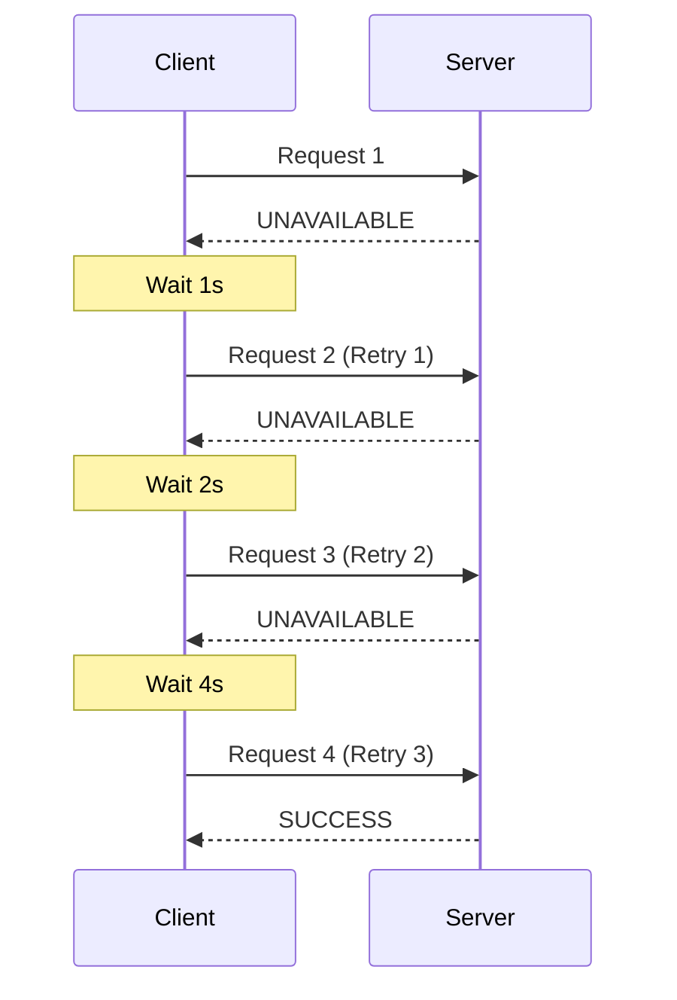
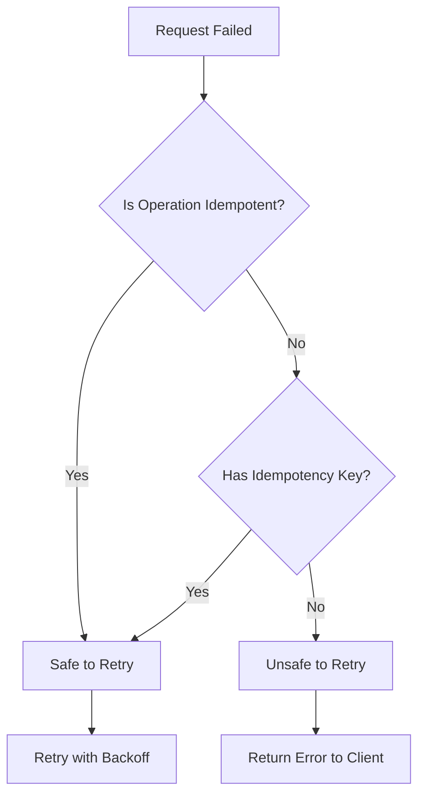
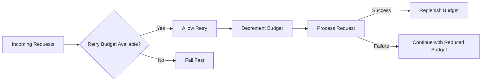

# How to Implement Retry Logic with Exponential Backoff in gRPC

Author: [nawazdhandala](https://www.github.com/nawazdhandala)

Tags: gRPC, retry logic, exponential backoff, resilience, microservices, fault tolerance, distributed systems

Description: Learn how to implement robust retry logic with exponential backoff in gRPC services, including jitter, idempotency considerations, and retry budgets for building resilient distributed systems.

---

Network failures, temporary service unavailability, and transient errors are inevitable in distributed systems. Implementing proper retry logic with exponential backoff is essential for building resilient gRPC services that can gracefully handle these failures. This guide covers everything from basic retry mechanisms to advanced patterns like jitter and retry budgets.

## Understanding Retry Logic in Distributed Systems

Before diving into implementation, let's understand why retry logic matters and how exponential backoff helps prevent cascading failures.



## Exponential Backoff Algorithm

The exponential backoff algorithm increases the wait time between retries exponentially. The formula is:

```
wait_time = min(base_delay * 2^attempt, max_delay)
```

Adding jitter helps prevent the "thundering herd" problem where all clients retry simultaneously:

```
wait_time = min(base_delay * 2^attempt, max_delay) * (0.5 + random(0, 0.5))
```

## gRPC Built-in Retry Support via Service Config

gRPC provides built-in retry support through service configuration. This is the recommended approach for most use cases.

### Defining Retry Policy in Service Config

```json
{
  "methodConfig": [
    {
      "name": [
        {
          "service": "mypackage.MyService",
          "method": "MyMethod"
        }
      ],
      "retryPolicy": {
        "maxAttempts": 5,
        "initialBackoff": "0.1s",
        "maxBackoff": "10s",
        "backoffMultiplier": 2.0,
        "retryableStatusCodes": [
          "UNAVAILABLE",
          "RESOURCE_EXHAUSTED",
          "ABORTED"
        ]
      }
    }
  ]
}
```

### Go Implementation with Service Config

```go
package main

import (
    "context"
    "log"
    "time"

    "google.golang.org/grpc"
    "google.golang.org/grpc/credentials/insecure"
    pb "myapp/proto"
)

func main() {
    // Define retry policy as JSON
    retryPolicy := `{
        "methodConfig": [{
            "name": [{"service": "mypackage.UserService"}],
            "waitForReady": true,
            "retryPolicy": {
                "MaxAttempts": 5,
                "InitialBackoff": "0.1s",
                "MaxBackoff": "10s",
                "BackoffMultiplier": 2.0,
                "RetryableStatusCodes": ["UNAVAILABLE", "RESOURCE_EXHAUSTED"]
            }
        }]
    }`

    // Create connection with retry policy
    conn, err := grpc.Dial(
        "localhost:50051",
        grpc.WithTransportCredentials(insecure.NewCredentials()),
        grpc.WithDefaultServiceConfig(retryPolicy),
    )
    if err != nil {
        log.Fatalf("Failed to connect: %v", err)
    }
    defer conn.Close()

    client := pb.NewUserServiceClient(conn)

    // Make request - retries are handled automatically
    ctx, cancel := context.WithTimeout(context.Background(), 30*time.Second)
    defer cancel()

    resp, err := client.GetUser(ctx, &pb.GetUserRequest{UserId: "123"})
    if err != nil {
        log.Fatalf("Request failed after retries: %v", err)
    }

    log.Printf("User: %v", resp)
}
```

## Custom Retry Implementation with Exponential Backoff

For more control over retry behavior, you can implement custom retry logic.

### Go Custom Retry with Jitter

```go
package retry

import (
    "context"
    "math"
    "math/rand"
    "time"

    "google.golang.org/grpc"
    "google.golang.org/grpc/codes"
    "google.golang.org/grpc/status"
)

// RetryConfig holds configuration for retry behavior
type RetryConfig struct {
    MaxAttempts     int
    InitialBackoff  time.Duration
    MaxBackoff      time.Duration
    Multiplier      float64
    JitterFactor    float64
    RetryableCodes  map[codes.Code]bool
}

// DefaultRetryConfig returns sensible defaults
func DefaultRetryConfig() *RetryConfig {
    return &RetryConfig{
        MaxAttempts:    5,
        InitialBackoff: 100 * time.Millisecond,
        MaxBackoff:     10 * time.Second,
        Multiplier:     2.0,
        JitterFactor:   0.2,
        RetryableCodes: map[codes.Code]bool{
            codes.Unavailable:       true,
            codes.ResourceExhausted: true,
            codes.Aborted:           true,
            codes.DeadlineExceeded:  true,
        },
    }
}

// calculateBackoff computes the backoff duration with jitter
func (c *RetryConfig) calculateBackoff(attempt int) time.Duration {
    // Calculate base backoff: initialBackoff * multiplier^attempt
    backoff := float64(c.InitialBackoff) * math.Pow(c.Multiplier, float64(attempt))

    // Cap at max backoff
    if backoff > float64(c.MaxBackoff) {
        backoff = float64(c.MaxBackoff)
    }

    // Add jitter: backoff * (1 - jitterFactor + random * 2 * jitterFactor)
    jitter := 1.0 - c.JitterFactor + rand.Float64()*2*c.JitterFactor
    backoff *= jitter

    return time.Duration(backoff)
}

// isRetryable checks if the error code is retryable
func (c *RetryConfig) isRetryable(err error) bool {
    if err == nil {
        return false
    }

    st, ok := status.FromError(err)
    if !ok {
        return false
    }

    return c.RetryableCodes[st.Code()]
}

// UnaryClientInterceptor returns a gRPC interceptor for retry logic
func UnaryClientInterceptor(config *RetryConfig) grpc.UnaryClientInterceptor {
    return func(
        ctx context.Context,
        method string,
        req, reply interface{},
        cc *grpc.ClientConn,
        invoker grpc.UnaryInvoker,
        opts ...grpc.CallOption,
    ) error {
        var lastErr error

        for attempt := 0; attempt < config.MaxAttempts; attempt++ {
            // Check if context is already cancelled
            if ctx.Err() != nil {
                return ctx.Err()
            }

            // Make the call
            lastErr = invoker(ctx, method, req, reply, cc, opts...)

            // Success - return immediately
            if lastErr == nil {
                return nil
            }

            // Check if error is retryable
            if !config.isRetryable(lastErr) {
                return lastErr
            }

            // Don't wait after the last attempt
            if attempt < config.MaxAttempts-1 {
                backoff := config.calculateBackoff(attempt)

                select {
                case <-time.After(backoff):
                    // Continue to next attempt
                case <-ctx.Done():
                    return ctx.Err()
                }
            }
        }

        return lastErr
    }
}

// Usage example
func NewClientWithRetry(target string) (*grpc.ClientConn, error) {
    config := DefaultRetryConfig()

    return grpc.Dial(
        target,
        grpc.WithTransportCredentials(insecure.NewCredentials()),
        grpc.WithUnaryInterceptor(UnaryClientInterceptor(config)),
    )
}
```

### Python Custom Retry Implementation

```python
import grpc
import random
import time
from functools import wraps
from typing import Callable, Set, Optional
from dataclasses import dataclass

@dataclass
class RetryConfig:
    """Configuration for retry behavior."""
    max_attempts: int = 5
    initial_backoff: float = 0.1  # seconds
    max_backoff: float = 10.0  # seconds
    multiplier: float = 2.0
    jitter_factor: float = 0.2
    retryable_codes: Set[grpc.StatusCode] = None

    def __post_init__(self):
        if self.retryable_codes is None:
            self.retryable_codes = {
                grpc.StatusCode.UNAVAILABLE,
                grpc.StatusCode.RESOURCE_EXHAUSTED,
                grpc.StatusCode.ABORTED,
                grpc.StatusCode.DEADLINE_EXCEEDED,
            }

    def calculate_backoff(self, attempt: int) -> float:
        """Calculate backoff duration with jitter."""
        # Exponential backoff
        backoff = self.initial_backoff * (self.multiplier ** attempt)

        # Cap at max backoff
        backoff = min(backoff, self.max_backoff)

        # Add jitter
        jitter = 1.0 - self.jitter_factor + random.random() * 2 * self.jitter_factor
        backoff *= jitter

        return backoff

    def is_retryable(self, error: grpc.RpcError) -> bool:
        """Check if the error is retryable."""
        return error.code() in self.retryable_codes


def retry_with_backoff(config: Optional[RetryConfig] = None):
    """Decorator for gRPC calls with retry logic."""
    if config is None:
        config = RetryConfig()

    def decorator(func: Callable):
        @wraps(func)
        def wrapper(*args, **kwargs):
            last_error = None

            for attempt in range(config.max_attempts):
                try:
                    return func(*args, **kwargs)
                except grpc.RpcError as e:
                    last_error = e

                    # Check if error is retryable
                    if not config.is_retryable(e):
                        raise

                    # Don't wait after the last attempt
                    if attempt < config.max_attempts - 1:
                        backoff = config.calculate_backoff(attempt)
                        print(f"Attempt {attempt + 1} failed with {e.code()}. "
                              f"Retrying in {backoff:.2f}s...")
                        time.sleep(backoff)

            raise last_error

        return wrapper
    return decorator


class RetryInterceptor(grpc.UnaryUnaryClientInterceptor):
    """gRPC client interceptor for automatic retries."""

    def __init__(self, config: Optional[RetryConfig] = None):
        self.config = config or RetryConfig()

    def intercept_unary_unary(
        self,
        continuation: Callable,
        client_call_details: grpc.ClientCallDetails,
        request
    ):
        last_error = None

        for attempt in range(self.config.max_attempts):
            try:
                response = continuation(client_call_details, request)
                # For future calls, we need to wait for the result
                return response
            except grpc.RpcError as e:
                last_error = e

                if not self.config.is_retryable(e):
                    raise

                if attempt < self.config.max_attempts - 1:
                    backoff = self.config.calculate_backoff(attempt)
                    time.sleep(backoff)

        raise last_error


# Usage example
def create_channel_with_retry(target: str) -> grpc.Channel:
    """Create a gRPC channel with retry interceptor."""
    config = RetryConfig(
        max_attempts=5,
        initial_backoff=0.1,
        max_backoff=10.0,
        multiplier=2.0,
        jitter_factor=0.2,
    )

    interceptor = RetryInterceptor(config)
    channel = grpc.insecure_channel(target)

    return grpc.intercept_channel(channel, interceptor)


# Decorator usage example
@retry_with_backoff(RetryConfig(max_attempts=3))
def get_user(stub, user_id: str):
    """Get user with automatic retry."""
    request = user_pb2.GetUserRequest(user_id=user_id)
    return stub.GetUser(request)
```

## Idempotency Considerations

Not all operations should be retried. Understanding idempotency is crucial for safe retry implementation.



### Implementing Idempotency Keys

```go
package idempotency

import (
    "context"
    "sync"
    "time"

    "google.golang.org/grpc"
    "google.golang.org/grpc/codes"
    "google.golang.org/grpc/metadata"
    "google.golang.org/grpc/status"
)

const IdempotencyKeyHeader = "x-idempotency-key"

// IdempotencyStore tracks processed requests
type IdempotencyStore struct {
    mu       sync.RWMutex
    requests map[string]*CachedResponse
    ttl      time.Duration
}

type CachedResponse struct {
    Response  interface{}
    Error     error
    Timestamp time.Time
}

func NewIdempotencyStore(ttl time.Duration) *IdempotencyStore {
    store := &IdempotencyStore{
        requests: make(map[string]*CachedResponse),
        ttl:      ttl,
    }

    // Start cleanup goroutine
    go store.cleanup()

    return store
}

func (s *IdempotencyStore) Get(key string) (*CachedResponse, bool) {
    s.mu.RLock()
    defer s.mu.RUnlock()

    resp, ok := s.requests[key]
    if !ok {
        return nil, false
    }

    // Check if expired
    if time.Since(resp.Timestamp) > s.ttl {
        return nil, false
    }

    return resp, true
}

func (s *IdempotencyStore) Set(key string, response interface{}, err error) {
    s.mu.Lock()
    defer s.mu.Unlock()

    s.requests[key] = &CachedResponse{
        Response:  response,
        Error:     err,
        Timestamp: time.Now(),
    }
}

func (s *IdempotencyStore) cleanup() {
    ticker := time.NewTicker(s.ttl / 2)
    defer ticker.Stop()

    for range ticker.C {
        s.mu.Lock()
        for key, resp := range s.requests {
            if time.Since(resp.Timestamp) > s.ttl {
                delete(s.requests, key)
            }
        }
        s.mu.Unlock()
    }
}

// IdempotencyInterceptor creates a server interceptor for idempotency
func IdempotencyInterceptor(store *IdempotencyStore) grpc.UnaryServerInterceptor {
    return func(
        ctx context.Context,
        req interface{},
        info *grpc.UnaryServerInfo,
        handler grpc.UnaryHandler,
    ) (interface{}, error) {
        // Extract idempotency key from metadata
        md, ok := metadata.FromIncomingContext(ctx)
        if !ok {
            return handler(ctx, req)
        }

        keys := md.Get(IdempotencyKeyHeader)
        if len(keys) == 0 {
            return handler(ctx, req)
        }

        idempotencyKey := keys[0]

        // Check for cached response
        if cached, found := store.Get(idempotencyKey); found {
            return cached.Response, cached.Error
        }

        // Process request
        resp, err := handler(ctx, req)

        // Cache the response
        store.Set(idempotencyKey, resp, err)

        return resp, err
    }
}

// Client-side: Add idempotency key to outgoing requests
func WithIdempotencyKey(ctx context.Context, key string) context.Context {
    return metadata.AppendToOutgoingContext(ctx, IdempotencyKeyHeader, key)
}
```

### Client Usage with Idempotency

```go
package main

import (
    "context"
    "github.com/google/uuid"
    "myapp/idempotency"
    pb "myapp/proto"
)

func createOrder(client pb.OrderServiceClient, order *pb.CreateOrderRequest) (*pb.Order, error) {
    // Generate idempotency key for this operation
    idempotencyKey := uuid.New().String()

    ctx := idempotency.WithIdempotencyKey(context.Background(), idempotencyKey)

    // This request can now be safely retried
    return client.CreateOrder(ctx, order)
}
```

## Retry Budgets

Retry budgets prevent retry storms that can overwhelm services during partial outages.



### Implementing Retry Budgets

```go
package retry

import (
    "context"
    "sync"
    "time"

    "google.golang.org/grpc"
    "google.golang.org/grpc/codes"
    "google.golang.org/grpc/status"
)

// RetryBudget implements a token bucket for controlling retries
type RetryBudget struct {
    mu             sync.Mutex
    tokens         float64
    maxTokens      float64
    refillRate     float64 // tokens per second
    retryRatio     float64 // tokens consumed per retry
    lastRefillTime time.Time
}

// NewRetryBudget creates a new retry budget
func NewRetryBudget(maxTokens, refillRate, retryRatio float64) *RetryBudget {
    return &RetryBudget{
        tokens:         maxTokens,
        maxTokens:      maxTokens,
        refillRate:     refillRate,
        retryRatio:     retryRatio,
        lastRefillTime: time.Now(),
    }
}

// TryAcquire attempts to acquire tokens for a retry
func (b *RetryBudget) TryAcquire() bool {
    b.mu.Lock()
    defer b.mu.Unlock()

    // Refill tokens based on elapsed time
    now := time.Now()
    elapsed := now.Sub(b.lastRefillTime).Seconds()
    b.tokens = min(b.maxTokens, b.tokens+elapsed*b.refillRate)
    b.lastRefillTime = now

    // Check if we have enough tokens
    if b.tokens >= b.retryRatio {
        b.tokens -= b.retryRatio
        return true
    }

    return false
}

// Deposit adds tokens back (called on successful requests)
func (b *RetryBudget) Deposit(amount float64) {
    b.mu.Lock()
    defer b.mu.Unlock()

    b.tokens = min(b.maxTokens, b.tokens+amount)
}

func min(a, b float64) float64 {
    if a < b {
        return a
    }
    return b
}

// BudgetedRetryInterceptor creates an interceptor with retry budget
func BudgetedRetryInterceptor(config *RetryConfig, budget *RetryBudget) grpc.UnaryClientInterceptor {
    return func(
        ctx context.Context,
        method string,
        req, reply interface{},
        cc *grpc.ClientConn,
        invoker grpc.UnaryInvoker,
        opts ...grpc.CallOption,
    ) error {
        var lastErr error

        for attempt := 0; attempt < config.MaxAttempts; attempt++ {
            if ctx.Err() != nil {
                return ctx.Err()
            }

            lastErr = invoker(ctx, method, req, reply, cc, opts...)

            if lastErr == nil {
                // Success - replenish budget
                budget.Deposit(0.1)
                return nil
            }

            if !config.isRetryable(lastErr) {
                return lastErr
            }

            // Check retry budget before retrying
            if attempt > 0 && !budget.TryAcquire() {
                // Budget exhausted - fail fast
                return status.Errorf(
                    codes.ResourceExhausted,
                    "retry budget exhausted: %v",
                    lastErr,
                )
            }

            if attempt < config.MaxAttempts-1 {
                backoff := config.calculateBackoff(attempt)
                select {
                case <-time.After(backoff):
                case <-ctx.Done():
                    return ctx.Err()
                }
            }
        }

        return lastErr
    }
}
```

## Hedged Requests

Hedged requests send multiple copies of a request to reduce tail latency.

```go
package hedge

import (
    "context"
    "sync"
    "time"

    "google.golang.org/grpc"
)

// HedgeConfig configures hedged request behavior
type HedgeConfig struct {
    MaxRequests   int           // Maximum number of hedged requests
    HedgeDelay    time.Duration // Delay before sending hedged request
}

// HedgedUnaryInterceptor creates an interceptor for hedged requests
func HedgedUnaryInterceptor(config *HedgeConfig) grpc.UnaryClientInterceptor {
    return func(
        ctx context.Context,
        method string,
        req, reply interface{},
        cc *grpc.ClientConn,
        invoker grpc.UnaryInvoker,
        opts ...grpc.CallOption,
    ) error {
        // Create cancellable context for hedged requests
        ctx, cancel := context.WithCancel(ctx)
        defer cancel()

        type result struct {
            reply interface{}
            err   error
        }

        results := make(chan result, config.MaxRequests)
        var wg sync.WaitGroup

        // Launch initial request
        wg.Add(1)
        go func() {
            defer wg.Done()
            err := invoker(ctx, method, req, reply, cc, opts...)
            select {
            case results <- result{reply: reply, err: err}:
            case <-ctx.Done():
            }
        }()

        // Launch hedged requests after delay
        for i := 1; i < config.MaxRequests; i++ {
            select {
            case r := <-results:
                if r.err == nil {
                    return nil
                }
            case <-time.After(config.HedgeDelay):
                wg.Add(1)
                go func() {
                    defer wg.Done()
                    hedgeReply := reply // Note: need proper cloning in production
                    err := invoker(ctx, method, req, hedgeReply, cc, opts...)
                    select {
                    case results <- result{reply: hedgeReply, err: err}:
                    case <-ctx.Done():
                    }
                }()
            case <-ctx.Done():
                return ctx.Err()
            }
        }

        // Wait for first successful response
        var lastErr error
        for i := 0; i < config.MaxRequests; i++ {
            select {
            case r := <-results:
                if r.err == nil {
                    return nil
                }
                lastErr = r.err
            case <-ctx.Done():
                return ctx.Err()
            }
        }

        return lastErr
    }
}
```

## Complete Example: Resilient gRPC Client

Here's a complete example combining all the patterns:

```go
package main

import (
    "context"
    "log"
    "time"

    "google.golang.org/grpc"
    "google.golang.org/grpc/codes"
    "google.golang.org/grpc/credentials/insecure"
    pb "myapp/proto"
)

func main() {
    // Configure retry behavior
    retryConfig := &RetryConfig{
        MaxAttempts:    5,
        InitialBackoff: 100 * time.Millisecond,
        MaxBackoff:     10 * time.Second,
        Multiplier:     2.0,
        JitterFactor:   0.2,
        RetryableCodes: map[codes.Code]bool{
            codes.Unavailable:       true,
            codes.ResourceExhausted: true,
            codes.Aborted:           true,
        },
    }

    // Create retry budget
    retryBudget := NewRetryBudget(
        100.0, // max tokens
        10.0,  // refill rate (tokens/sec)
        1.0,   // cost per retry
    )

    // Create connection with interceptors
    conn, err := grpc.Dial(
        "localhost:50051",
        grpc.WithTransportCredentials(insecure.NewCredentials()),
        grpc.WithChainUnaryInterceptor(
            LoggingInterceptor(),
            BudgetedRetryInterceptor(retryConfig, retryBudget),
        ),
    )
    if err != nil {
        log.Fatalf("Failed to connect: %v", err)
    }
    defer conn.Close()

    client := pb.NewUserServiceClient(conn)

    // Make resilient request
    ctx, cancel := context.WithTimeout(context.Background(), 30*time.Second)
    defer cancel()

    resp, err := client.GetUser(ctx, &pb.GetUserRequest{UserId: "123"})
    if err != nil {
        log.Fatalf("Request failed: %v", err)
    }

    log.Printf("User: %v", resp)
}

func LoggingInterceptor() grpc.UnaryClientInterceptor {
    return func(
        ctx context.Context,
        method string,
        req, reply interface{},
        cc *grpc.ClientConn,
        invoker grpc.UnaryInvoker,
        opts ...grpc.CallOption,
    ) error {
        start := time.Now()
        err := invoker(ctx, method, req, reply, cc, opts...)
        log.Printf("Method: %s, Duration: %v, Error: %v", method, time.Since(start), err)
        return err
    }
}
```

## Best Practices

1. **Always use jitter**: Prevents synchronized retry storms
2. **Set reasonable limits**: Cap both max attempts and max backoff
3. **Consider idempotency**: Only retry idempotent operations or use idempotency keys
4. **Implement retry budgets**: Protect downstream services during outages
5. **Monitor retry metrics**: Track retry rates to identify systemic issues
6. **Propagate deadlines**: Ensure retries respect the overall deadline
7. **Use circuit breakers**: Combine with circuit breakers for comprehensive resilience

## Monitoring Retry Metrics

```go
package metrics

import (
    "github.com/prometheus/client_golang/prometheus"
    "github.com/prometheus/client_golang/prometheus/promauto"
)

var (
    retryAttempts = promauto.NewCounterVec(
        prometheus.CounterOpts{
            Name: "grpc_client_retry_attempts_total",
            Help: "Total number of retry attempts",
        },
        []string{"method", "status"},
    )

    retryBudgetExhausted = promauto.NewCounterVec(
        prometheus.CounterOpts{
            Name: "grpc_client_retry_budget_exhausted_total",
            Help: "Number of times retry budget was exhausted",
        },
        []string{"method"},
    )
)
```

## Conclusion

Implementing retry logic with exponential backoff is essential for building resilient gRPC services. By combining proper backoff strategies, jitter, idempotency handling, and retry budgets, you can create systems that gracefully handle transient failures while protecting against cascade failures. Remember to always monitor your retry metrics and adjust configurations based on observed behavior in production.
