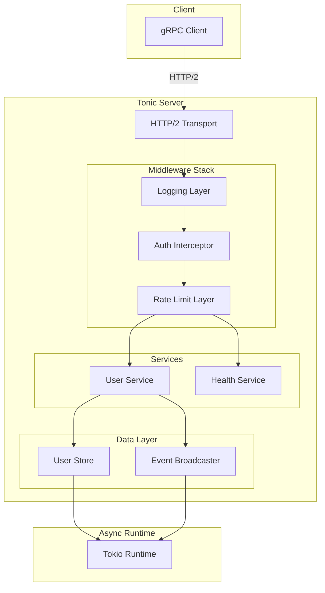

# How to Build gRPC Services in Rust

Author: [nawazdhandala](https://www.github.com/nawazdhandala)

Tags: gRPC, Rust, Tonic, Protocol Buffers, Microservices, Async, Tokio, Systems Programming

Description: A comprehensive guide to building high-performance gRPC services in Rust using the Tonic framework, covering service implementation, async/await patterns, error handling, and production deployment.

---

## Introduction

Rust's combination of memory safety, zero-cost abstractions, and excellent concurrency support makes it an ideal choice for building high-performance gRPC services. The Tonic library provides a native async/await gRPC implementation built on top of Tokio, offering excellent performance and ergonomics.

This guide walks you through building production-ready gRPC services in Rust, from project setup to advanced patterns for error handling, streaming, and deployment.

## Prerequisites

Before starting, ensure you have:

- Rust 1.70 or later (with cargo)
- Protocol Buffers compiler (protoc) installed
- Basic understanding of Rust async/await
- Familiarity with Protocol Buffers

## Project Setup

### Create a New Rust Project

```bash
# Create new project
cargo new grpc-rust-service
cd grpc-rust-service

# Create directory structure
mkdir -p proto src/services src/interceptors
```

### Configure Cargo.toml

Update `Cargo.toml` with the required dependencies:

```toml
[package]
name = "grpc-rust-service"
version = "0.1.0"
edition = "2021"
authors = ["Your Name <your.email@example.com>"]
description = "A gRPC service built with Tonic in Rust"

[dependencies]
# gRPC and Protocol Buffers
tonic = { version = "0.11", features = ["tls", "tls-roots", "gzip"] }
prost = "0.12"
prost-types = "0.12"

# Async runtime
tokio = { version = "1.36", features = ["full"] }
tokio-stream = "0.1"

# Error handling
anyhow = "1.0"
thiserror = "1.0"

# Serialization
serde = { version = "1.0", features = ["derive"] }
serde_json = "1.0"

# Utilities
uuid = { version = "1.7", features = ["v4", "serde"] }
chrono = { version = "0.4", features = ["serde"] }
tracing = "0.1"
tracing-subscriber = { version = "0.3", features = ["env-filter"] }

# Configuration
config = "0.14"
dotenv = "0.15"

# Health checking
tonic-health = "0.11"

# Reflection (optional, for grpcurl support)
tonic-reflection = "0.11"

[build-dependencies]
tonic-build = "0.11"

[dev-dependencies]
tokio-test = "0.4"
mockall = "0.12"

[[bin]]
name = "server"
path = "src/server.rs"

[[bin]]
name = "client"
path = "src/client.rs"
```

### Project Structure

```
grpc-rust-service/
├── Cargo.toml
├── build.rs
├── proto/
│   └── user.proto
├── src/
│   ├── lib.rs
│   ├── server.rs
│   ├── client.rs
│   ├── services/
│   │   ├── mod.rs
│   │   └── user_service.rs
│   ├── interceptors/
│   │   ├── mod.rs
│   │   ├── logging.rs
│   │   └── auth.rs
│   ├── models/
│   │   ├── mod.rs
│   │   └── user.rs
│   └── error.rs
└── tests/
    └── integration_test.rs
```

## Protocol Buffer Definition

### Define the Service

Create `proto/user.proto`:

```protobuf
syntax = "proto3";

package userservice;

import "google/protobuf/timestamp.proto";
import "google/protobuf/empty.proto";

// User entity
message User {
    string id = 1;
    string username = 2;
    string email = 3;
    string full_name = 4;
    UserRole role = 5;
    UserStatus status = 6;
    google.protobuf.Timestamp created_at = 7;
    google.protobuf.Timestamp updated_at = 8;
    map<string, string> metadata = 9;
}

enum UserRole {
    USER_ROLE_UNSPECIFIED = 0;
    USER_ROLE_USER = 1;
    USER_ROLE_ADMIN = 2;
    USER_ROLE_MODERATOR = 3;
}

enum UserStatus {
    USER_STATUS_UNSPECIFIED = 0;
    USER_STATUS_ACTIVE = 1;
    USER_STATUS_INACTIVE = 2;
    USER_STATUS_SUSPENDED = 3;
    USER_STATUS_DELETED = 4;
}

// Request and Response messages
message CreateUserRequest {
    string username = 1;
    string email = 2;
    string full_name = 3;
    string password = 4;
    UserRole role = 5;
    map<string, string> metadata = 6;
}

message CreateUserResponse {
    User user = 1;
}

message GetUserRequest {
    string user_id = 1;
}

message GetUserResponse {
    User user = 1;
}

message UpdateUserRequest {
    string user_id = 1;
    optional string username = 2;
    optional string email = 3;
    optional string full_name = 4;
    optional UserRole role = 5;
    map<string, string> metadata = 6;
}

message UpdateUserResponse {
    User user = 1;
}

message DeleteUserRequest {
    string user_id = 1;
}

message DeleteUserResponse {
    bool success = 1;
    string message = 2;
}

message ListUsersRequest {
    int32 page_size = 1;
    string page_token = 2;
    UserStatus status_filter = 3;
    UserRole role_filter = 4;
}

message ListUsersResponse {
    repeated User users = 1;
    string next_page_token = 2;
    int32 total_count = 3;
}

// Streaming messages
message WatchUsersRequest {
    repeated string user_ids = 1;
    bool include_all = 2;
}

message UserEvent {
    string event_id = 1;
    EventType type = 2;
    User user = 3;
    google.protobuf.Timestamp timestamp = 4;
}

enum EventType {
    EVENT_TYPE_UNSPECIFIED = 0;
    EVENT_TYPE_CREATED = 1;
    EVENT_TYPE_UPDATED = 2;
    EVENT_TYPE_DELETED = 3;
}

message BatchCreateUsersRequest {
    repeated CreateUserRequest users = 1;
}

message BatchCreateUsersResponse {
    repeated User users = 1;
    repeated string errors = 2;
}

// Health check messages
message HealthCheckRequest {
    string service = 1;
}

message HealthCheckResponse {
    ServingStatus status = 1;
}

enum ServingStatus {
    UNKNOWN = 0;
    SERVING = 1;
    NOT_SERVING = 2;
}

// User Service Definition
service UserService {
    // Unary RPCs
    rpc CreateUser(CreateUserRequest) returns (CreateUserResponse);
    rpc GetUser(GetUserRequest) returns (GetUserResponse);
    rpc UpdateUser(UpdateUserRequest) returns (UpdateUserResponse);
    rpc DeleteUser(DeleteUserRequest) returns (DeleteUserResponse);
    rpc ListUsers(ListUsersRequest) returns (ListUsersResponse);

    // Server streaming - watch for user events
    rpc WatchUsers(WatchUsersRequest) returns (stream UserEvent);

    // Client streaming - batch create users
    rpc BatchCreateUsers(stream CreateUserRequest) returns (BatchCreateUsersResponse);

    // Bidirectional streaming - sync users
    rpc SyncUsers(stream UpdateUserRequest) returns (stream UserEvent);
}
```

## Build Script (build.rs)

Create `build.rs` in the project root:

```rust
use std::env;
use std::path::PathBuf;

fn main() -> Result<(), Box<dyn std::error::Error>> {
    // Get the output directory
    let out_dir = PathBuf::from(env::var("OUT_DIR").unwrap());

    // Configure tonic-build
    tonic_build::configure()
        // Generate server code
        .build_server(true)
        // Generate client code
        .build_client(true)
        // Include file descriptor set for reflection
        .file_descriptor_set_path(out_dir.join("user_descriptor.bin"))
        // Compile proto files
        .compile(
            &["proto/user.proto"],
            &["proto"],
        )?;

    // Rerun if proto files change
    println!("cargo:rerun-if-changed=proto/user.proto");

    Ok(())
}
```

## Error Handling

### Custom Error Types

Create `src/error.rs`:

```rust
use thiserror::Error;
use tonic::Status;

/// Custom error type for the user service
#[derive(Error, Debug)]
pub enum ServiceError {
    #[error("User not found: {0}")]
    NotFound(String),

    #[error("User already exists: {0}")]
    AlreadyExists(String),

    #[error("Invalid argument: {0}")]
    InvalidArgument(String),

    #[error("Permission denied: {0}")]
    PermissionDenied(String),

    #[error("Unauthenticated: {0}")]
    Unauthenticated(String),

    #[error("Internal error: {0}")]
    Internal(String),

    #[error("Resource exhausted: {0}")]
    ResourceExhausted(String),

    #[error("Database error: {0}")]
    Database(#[from] DatabaseError),

    #[error("Validation error: {0}")]
    Validation(String),
}

/// Database-specific errors
#[derive(Error, Debug)]
pub enum DatabaseError {
    #[error("Connection failed: {0}")]
    ConnectionFailed(String),

    #[error("Query failed: {0}")]
    QueryFailed(String),

    #[error("Transaction failed: {0}")]
    TransactionFailed(String),
}

impl From<ServiceError> for Status {
    fn from(error: ServiceError) -> Self {
        match error {
            ServiceError::NotFound(msg) => Status::not_found(msg),
            ServiceError::AlreadyExists(msg) => Status::already_exists(msg),
            ServiceError::InvalidArgument(msg) => Status::invalid_argument(msg),
            ServiceError::PermissionDenied(msg) => Status::permission_denied(msg),
            ServiceError::Unauthenticated(msg) => Status::unauthenticated(msg),
            ServiceError::Internal(msg) => Status::internal(msg),
            ServiceError::ResourceExhausted(msg) => Status::resource_exhausted(msg),
            ServiceError::Database(e) => Status::internal(e.to_string()),
            ServiceError::Validation(msg) => Status::invalid_argument(msg),
        }
    }
}

/// Result type alias for service operations
pub type ServiceResult<T> = Result<T, ServiceError>;

/// Extension trait for converting Option to ServiceError
pub trait OptionExt<T> {
    fn ok_or_not_found(self, resource: &str, id: &str) -> ServiceResult<T>;
}

impl<T> OptionExt<T> for Option<T> {
    fn ok_or_not_found(self, resource: &str, id: &str) -> ServiceResult<T> {
        self.ok_or_else(|| ServiceError::NotFound(format!("{} with id '{}' not found", resource, id)))
    }
}
```

## Service Implementation

### User Service

Create `src/services/user_service.rs`:

```rust
use std::collections::HashMap;
use std::pin::Pin;
use std::sync::Arc;
use std::time::SystemTime;

use futures::Stream;
use prost_types::Timestamp;
use tokio::sync::{broadcast, RwLock};
use tokio_stream::wrappers::BroadcastStream;
use tokio_stream::StreamExt;
use tonic::{Request, Response, Status, Streaming};
use tracing::{info, instrument, warn};
use uuid::Uuid;

use crate::error::{OptionExt, ServiceError, ServiceResult};

// Import generated protobuf code
pub mod pb {
    tonic::include_proto!("userservice");
}

use pb::user_service_server::UserService;
use pb::*;

/// In-memory user store (replace with database in production)
#[derive(Debug, Default)]
pub struct UserStore {
    users: RwLock<HashMap<String, User>>,
    event_sender: broadcast::Sender<UserEvent>,
}

impl UserStore {
    pub fn new() -> Self {
        let (event_sender, _) = broadcast::channel(1024);
        Self {
            users: RwLock::new(HashMap::new()),
            event_sender,
        }
    }

    pub async fn get(&self, id: &str) -> Option<User> {
        self.users.read().await.get(id).cloned()
    }

    pub async fn insert(&self, user: User) -> ServiceResult<()> {
        let mut users = self.users.write().await;

        // Check for duplicate username or email
        for existing in users.values() {
            if existing.username == user.username {
                return Err(ServiceError::AlreadyExists(format!(
                    "Username '{}' already exists",
                    user.username
                )));
            }
            if existing.email == user.email {
                return Err(ServiceError::AlreadyExists(format!(
                    "Email '{}' already exists",
                    user.email
                )));
            }
        }

        let id = user.id.clone();
        users.insert(id, user.clone());

        // Broadcast event
        let _ = self.event_sender.send(UserEvent {
            event_id: Uuid::new_v4().to_string(),
            r#type: EventType::Created as i32,
            user: Some(user),
            timestamp: Some(current_timestamp()),
        });

        Ok(())
    }

    pub async fn update(&self, id: &str, update_fn: impl FnOnce(&mut User)) -> ServiceResult<User> {
        let mut users = self.users.write().await;

        let user = users
            .get_mut(id)
            .ok_or_else(|| ServiceError::NotFound(format!("User '{}' not found", id)))?;

        update_fn(user);
        user.updated_at = Some(current_timestamp());

        let updated_user = user.clone();

        // Broadcast event
        let _ = self.event_sender.send(UserEvent {
            event_id: Uuid::new_v4().to_string(),
            r#type: EventType::Updated as i32,
            user: Some(updated_user.clone()),
            timestamp: Some(current_timestamp()),
        });

        Ok(updated_user)
    }

    pub async fn delete(&self, id: &str) -> ServiceResult<User> {
        let mut users = self.users.write().await;

        let user = users
            .remove(id)
            .ok_or_else(|| ServiceError::NotFound(format!("User '{}' not found", id)))?;

        // Broadcast event
        let _ = self.event_sender.send(UserEvent {
            event_id: Uuid::new_v4().to_string(),
            r#type: EventType::Deleted as i32,
            user: Some(user.clone()),
            timestamp: Some(current_timestamp()),
        });

        Ok(user)
    }

    pub async fn list(
        &self,
        page_size: usize,
        page_token: Option<&str>,
        status_filter: Option<UserStatus>,
        role_filter: Option<UserRole>,
    ) -> (Vec<User>, Option<String>, usize) {
        let users = self.users.read().await;

        let mut filtered: Vec<_> = users
            .values()
            .filter(|u| {
                let status_match = status_filter
                    .map(|s| u.status == s as i32)
                    .unwrap_or(true);
                let role_match = role_filter
                    .map(|r| u.role == r as i32)
                    .unwrap_or(true);
                status_match && role_match
            })
            .cloned()
            .collect();

        // Sort by created_at descending
        filtered.sort_by(|a, b| {
            let a_time = a.created_at.as_ref().map(|t| t.seconds).unwrap_or(0);
            let b_time = b.created_at.as_ref().map(|t| t.seconds).unwrap_or(0);
            b_time.cmp(&a_time)
        });

        let total = filtered.len();

        // Apply pagination
        let start = page_token
            .and_then(|token| filtered.iter().position(|u| u.id == token))
            .map(|idx| idx + 1)
            .unwrap_or(0);

        let paginated: Vec<_> = filtered.into_iter().skip(start).take(page_size).collect();

        let next_token = if start + paginated.len() < total {
            paginated.last().map(|u| u.id.clone())
        } else {
            None
        };

        (paginated, next_token, total)
    }

    pub fn subscribe(&self) -> broadcast::Receiver<UserEvent> {
        self.event_sender.subscribe()
    }
}

/// User service implementation
#[derive(Debug)]
pub struct UserServiceImpl {
    store: Arc<UserStore>,
}

impl UserServiceImpl {
    pub fn new(store: Arc<UserStore>) -> Self {
        Self { store }
    }
}

/// Helper function to create current timestamp
fn current_timestamp() -> Timestamp {
    let now = SystemTime::now()
        .duration_since(SystemTime::UNIX_EPOCH)
        .unwrap();
    Timestamp {
        seconds: now.as_secs() as i64,
        nanos: now.subsec_nanos() as i32,
    }
}

/// Validation functions
fn validate_username(username: &str) -> ServiceResult<()> {
    if username.len() < 3 || username.len() > 30 {
        return Err(ServiceError::Validation(
            "Username must be 3-30 characters".to_string(),
        ));
    }
    if !username.chars().all(|c| c.is_alphanumeric() || c == '_') {
        return Err(ServiceError::Validation(
            "Username can only contain alphanumeric characters and underscores".to_string(),
        ));
    }
    Ok(())
}

fn validate_email(email: &str) -> ServiceResult<()> {
    if !email.contains('@') || !email.contains('.') {
        return Err(ServiceError::Validation("Invalid email format".to_string()));
    }
    Ok(())
}

fn validate_password(password: &str) -> ServiceResult<()> {
    if password.len() < 8 {
        return Err(ServiceError::Validation(
            "Password must be at least 8 characters".to_string(),
        ));
    }
    Ok(())
}

#[tonic::async_trait]
impl UserService for UserServiceImpl {
    /// Create a new user
    #[instrument(skip(self, request), fields(username = %request.get_ref().username))]
    async fn create_user(
        &self,
        request: Request<CreateUserRequest>,
    ) -> Result<Response<CreateUserResponse>, Status> {
        let req = request.into_inner();

        // Validate input
        validate_username(&req.username)?;
        validate_email(&req.email)?;
        validate_password(&req.password)?;

        let now = current_timestamp();
        let user = User {
            id: Uuid::new_v4().to_string(),
            username: req.username,
            email: req.email,
            full_name: req.full_name,
            role: req.role,
            status: UserStatus::Active as i32,
            created_at: Some(now.clone()),
            updated_at: Some(now),
            metadata: req.metadata,
        };

        self.store.insert(user.clone()).await?;

        info!(user_id = %user.id, "User created successfully");

        Ok(Response::new(CreateUserResponse { user: Some(user) }))
    }

    /// Get a user by ID
    #[instrument(skip(self, request), fields(user_id = %request.get_ref().user_id))]
    async fn get_user(
        &self,
        request: Request<GetUserRequest>,
    ) -> Result<Response<GetUserResponse>, Status> {
        let user_id = &request.get_ref().user_id;

        if user_id.is_empty() {
            return Err(Status::invalid_argument("user_id is required"));
        }

        let user = self
            .store
            .get(user_id)
            .await
            .ok_or_not_found("User", user_id)?;

        Ok(Response::new(GetUserResponse { user: Some(user) }))
    }

    /// Update an existing user
    #[instrument(skip(self, request), fields(user_id = %request.get_ref().user_id))]
    async fn update_user(
        &self,
        request: Request<UpdateUserRequest>,
    ) -> Result<Response<UpdateUserResponse>, Status> {
        let req = request.into_inner();

        if req.user_id.is_empty() {
            return Err(Status::invalid_argument("user_id is required"));
        }

        // Validate optional fields if provided
        if let Some(ref username) = req.username {
            validate_username(username)?;
        }
        if let Some(ref email) = req.email {
            validate_email(email)?;
        }

        let user = self
            .store
            .update(&req.user_id, |user| {
                if let Some(username) = req.username {
                    user.username = username;
                }
                if let Some(email) = req.email {
                    user.email = email;
                }
                if let Some(full_name) = req.full_name {
                    user.full_name = full_name;
                }
                if let Some(role) = req.role {
                    user.role = role;
                }
                // Merge metadata
                for (key, value) in req.metadata {
                    user.metadata.insert(key, value);
                }
            })
            .await?;

        info!(user_id = %req.user_id, "User updated successfully");

        Ok(Response::new(UpdateUserResponse { user: Some(user) }))
    }

    /// Delete a user
    #[instrument(skip(self, request), fields(user_id = %request.get_ref().user_id))]
    async fn delete_user(
        &self,
        request: Request<DeleteUserRequest>,
    ) -> Result<Response<DeleteUserResponse>, Status> {
        let user_id = &request.get_ref().user_id;

        if user_id.is_empty() {
            return Err(Status::invalid_argument("user_id is required"));
        }

        self.store.delete(user_id).await?;

        info!(user_id = %user_id, "User deleted successfully");

        Ok(Response::new(DeleteUserResponse {
            success: true,
            message: format!("User {} deleted successfully", user_id),
        }))
    }

    /// List users with pagination and filtering
    #[instrument(skip(self, request))]
    async fn list_users(
        &self,
        request: Request<ListUsersRequest>,
    ) -> Result<Response<ListUsersResponse>, Status> {
        let req = request.into_inner();

        let page_size = if req.page_size > 0 && req.page_size <= 100 {
            req.page_size as usize
        } else {
            10
        };

        let page_token = if req.page_token.is_empty() {
            None
        } else {
            Some(req.page_token.as_str())
        };

        let status_filter = UserStatus::try_from(req.status_filter).ok().filter(|s| *s != UserStatus::Unspecified);
        let role_filter = UserRole::try_from(req.role_filter).ok().filter(|r| *r != UserRole::Unspecified);

        let (users, next_page_token, total_count) = self
            .store
            .list(page_size, page_token, status_filter, role_filter)
            .await;

        Ok(Response::new(ListUsersResponse {
            users,
            next_page_token: next_page_token.unwrap_or_default(),
            total_count: total_count as i32,
        }))
    }

    /// Server streaming type for WatchUsers
    type WatchUsersStream = Pin<Box<dyn Stream<Item = Result<UserEvent, Status>> + Send>>;

    /// Watch for user events (server streaming)
    #[instrument(skip(self, request))]
    async fn watch_users(
        &self,
        request: Request<WatchUsersRequest>,
    ) -> Result<Response<Self::WatchUsersStream>, Status> {
        let req = request.into_inner();
        let user_ids: std::collections::HashSet<_> = req.user_ids.into_iter().collect();
        let include_all = req.include_all;

        info!(include_all = %include_all, user_count = user_ids.len(), "Client started watching users");

        let receiver = self.store.subscribe();

        let stream = BroadcastStream::new(receiver)
            .filter_map(move |result| {
                match result {
                    Ok(event) => {
                        // Filter events based on user_ids if not including all
                        if include_all
                            || event
                                .user
                                .as_ref()
                                .map(|u| user_ids.contains(&u.id))
                                .unwrap_or(false)
                        {
                            Some(Ok(event))
                        } else {
                            None
                        }
                    }
                    Err(e) => {
                        warn!("Broadcast error: {:?}", e);
                        None
                    }
                }
            });

        Ok(Response::new(Box::pin(stream)))
    }

    /// Batch create users (client streaming)
    #[instrument(skip(self, request))]
    async fn batch_create_users(
        &self,
        request: Request<Streaming<CreateUserRequest>>,
    ) -> Result<Response<BatchCreateUsersResponse>, Status> {
        let mut stream = request.into_inner();
        let mut created_users = Vec::new();
        let mut errors = Vec::new();

        while let Some(result) = stream.next().await {
            match result {
                Ok(req) => {
                    // Validate
                    if let Err(e) = validate_username(&req.username) {
                        errors.push(format!("Username '{}': {}", req.username, e));
                        continue;
                    }
                    if let Err(e) = validate_email(&req.email) {
                        errors.push(format!("Email '{}': {}", req.email, e));
                        continue;
                    }

                    let now = current_timestamp();
                    let user = User {
                        id: Uuid::new_v4().to_string(),
                        username: req.username.clone(),
                        email: req.email.clone(),
                        full_name: req.full_name,
                        role: req.role,
                        status: UserStatus::Active as i32,
                        created_at: Some(now.clone()),
                        updated_at: Some(now),
                        metadata: req.metadata,
                    };

                    match self.store.insert(user.clone()).await {
                        Ok(_) => {
                            info!(user_id = %user.id, "Batch: User created");
                            created_users.push(user);
                        }
                        Err(e) => {
                            errors.push(format!("User '{}': {}", req.username, e));
                        }
                    }
                }
                Err(e) => {
                    errors.push(format!("Stream error: {}", e));
                }
            }
        }

        info!(
            created = created_users.len(),
            errors = errors.len(),
            "Batch create completed"
        );

        Ok(Response::new(BatchCreateUsersResponse {
            users: created_users,
            errors,
        }))
    }

    /// Bidirectional streaming type for SyncUsers
    type SyncUsersStream = Pin<Box<dyn Stream<Item = Result<UserEvent, Status>> + Send>>;

    /// Sync users (bidirectional streaming)
    #[instrument(skip(self, request))]
    async fn sync_users(
        &self,
        request: Request<Streaming<UpdateUserRequest>>,
    ) -> Result<Response<Self::SyncUsersStream>, Status> {
        let mut stream = request.into_inner();
        let store = Arc::clone(&self.store);

        info!("Bidirectional sync started");

        let output = async_stream::try_stream! {
            while let Some(result) = stream.next().await {
                match result {
                    Ok(req) => {
                        if req.user_id.is_empty() {
                            yield UserEvent {
                                event_id: Uuid::new_v4().to_string(),
                                r#type: EventType::Unspecified as i32,
                                user: None,
                                timestamp: Some(current_timestamp()),
                            };
                            continue;
                        }

                        match store.update(&req.user_id, |user| {
                            if let Some(username) = req.username.clone() {
                                user.username = username;
                            }
                            if let Some(email) = req.email.clone() {
                                user.email = email;
                            }
                            if let Some(full_name) = req.full_name.clone() {
                                user.full_name = full_name;
                            }
                            if let Some(role) = req.role {
                                user.role = role;
                            }
                            for (key, value) in &req.metadata {
                                user.metadata.insert(key.clone(), value.clone());
                            }
                        }).await {
                            Ok(user) => {
                                yield UserEvent {
                                    event_id: Uuid::new_v4().to_string(),
                                    r#type: EventType::Updated as i32,
                                    user: Some(user),
                                    timestamp: Some(current_timestamp()),
                                };
                            }
                            Err(e) => {
                                warn!(error = %e, user_id = %req.user_id, "Sync update failed");
                            }
                        }
                    }
                    Err(e) => {
                        warn!(error = %e, "Sync stream error");
                    }
                }
            }

            info!("Bidirectional sync ended");
        };

        Ok(Response::new(Box::pin(output)))
    }
}
```

### Services Module

Create `src/services/mod.rs`:

```rust
pub mod user_service;

pub use user_service::{pb, UserServiceImpl, UserStore};
```

## Interceptors

### Logging Interceptor

Create `src/interceptors/logging.rs`:

```rust
use std::task::{Context, Poll};
use std::time::Instant;

use tonic::body::BoxBody;
use tower::{Layer, Service};
use tracing::{info, warn, Span};

/// Logging interceptor layer
#[derive(Clone)]
pub struct LoggingLayer;

impl<Svc> Layer<Svc> for LoggingLayer {
    type Service = LoggingMiddleware<Svc>;

    fn layer(&self, service: Svc) -> Self::Service {
        LoggingMiddleware { inner: service }
    }
}

/// Logging middleware
#[derive(Clone)]
pub struct LoggingMiddleware<Svc> {
    inner: Svc,
}

impl<Svc, ReqBody> Service<http::Request<ReqBody>> for LoggingMiddleware<Svc>
where
    Svc: Service<http::Request<ReqBody>, Response = http::Response<BoxBody>> + Clone + Send + 'static,
    Svc::Future: Send + 'static,
    ReqBody: Send + 'static,
{
    type Response = Svc::Response;
    type Error = Svc::Error;
    type Future = std::pin::Pin<
        Box<dyn std::future::Future<Output = Result<Self::Response, Self::Error>> + Send>,
    >;

    fn poll_ready(&mut self, cx: &mut Context<'_>) -> Poll<Result<(), Self::Error>> {
        self.inner.poll_ready(cx)
    }

    fn call(&mut self, request: http::Request<ReqBody>) -> Self::Future {
        let start = Instant::now();
        let method = request.uri().path().to_string();
        let peer = request
            .extensions()
            .get::<tonic::transport::server::TcpConnectInfo>()
            .map(|info| info.remote_addr())
            .flatten()
            .map(|addr| addr.to_string())
            .unwrap_or_else(|| "unknown".to_string());

        info!(
            method = %method,
            peer = %peer,
            "gRPC request started"
        );

        let mut inner = self.inner.clone();

        Box::pin(async move {
            let response = inner.call(request).await;
            let duration = start.elapsed();

            match &response {
                Ok(res) => {
                    let status = res.status();
                    if status.is_success() {
                        info!(
                            method = %method,
                            duration_ms = %duration.as_millis(),
                            status = %status,
                            "gRPC request completed"
                        );
                    } else {
                        warn!(
                            method = %method,
                            duration_ms = %duration.as_millis(),
                            status = %status,
                            "gRPC request failed"
                        );
                    }
                }
                Err(_) => {
                    warn!(
                        method = %method,
                        duration_ms = %duration.as_millis(),
                        "gRPC request error"
                    );
                }
            }

            response
        })
    }
}
```

### Authentication Interceptor

Create `src/interceptors/auth.rs`:

```rust
use tonic::{Request, Status};

/// Token payload (simplified)
#[derive(Debug, Clone)]
pub struct TokenPayload {
    pub user_id: String,
    pub username: String,
    pub role: String,
}

/// Validate token and return payload (simplified implementation)
fn validate_token(token: &str) -> Option<TokenPayload> {
    // In production, use a proper JWT library like jsonwebtoken
    if token == "valid-token" {
        Some(TokenPayload {
            user_id: "user-123".to_string(),
            username: "admin".to_string(),
            role: "admin".to_string(),
        })
    } else {
        None
    }
}

/// Authentication interceptor function
pub fn auth_interceptor(mut request: Request<()>) -> Result<Request<()>, Status> {
    // Skip auth for health checks
    // In production, you'd check the URI path

    let token = request
        .metadata()
        .get("authorization")
        .and_then(|value| value.to_str().ok())
        .and_then(|value| {
            if value.starts_with("Bearer ") {
                Some(&value[7..])
            } else {
                Some(value)
            }
        });

    match token {
        Some(token) => {
            if let Some(payload) = validate_token(token) {
                // Add user info to request extensions
                request.extensions_mut().insert(payload);
                Ok(request)
            } else {
                Err(Status::unauthenticated("Invalid authentication token"))
            }
        }
        None => Err(Status::unauthenticated("No authentication token provided")),
    }
}

/// Extract token payload from request
pub fn get_user_from_request<T>(request: &Request<T>) -> Option<&TokenPayload> {
    request.extensions().get::<TokenPayload>()
}

/// Role-based authorization check
pub fn require_role<T>(request: &Request<T>, required_role: &str) -> Result<(), Status> {
    let payload = get_user_from_request(request)
        .ok_or_else(|| Status::unauthenticated("Not authenticated"))?;

    if payload.role == required_role || payload.role == "admin" {
        Ok(())
    } else {
        Err(Status::permission_denied(format!(
            "Role '{}' required",
            required_role
        )))
    }
}
```

### Interceptors Module

Create `src/interceptors/mod.rs`:

```rust
pub mod auth;
pub mod logging;

pub use auth::{auth_interceptor, get_user_from_request, require_role, TokenPayload};
pub use logging::LoggingLayer;
```

## Server Implementation

Create `src/server.rs`:

```rust
use std::net::SocketAddr;
use std::sync::Arc;
use std::time::Duration;

use tokio::signal;
use tonic::transport::Server;
use tonic_health::server::health_reporter;
use tracing::{info, Level};
use tracing_subscriber::FmtSubscriber;

mod error;
mod interceptors;
mod services;

use interceptors::LoggingLayer;
use services::{pb::user_service_server::UserServiceServer, UserServiceImpl, UserStore};

/// Server configuration
struct ServerConfig {
    host: String,
    port: u16,
    max_connections: usize,
    keepalive_interval: Duration,
    keepalive_timeout: Duration,
}

impl Default for ServerConfig {
    fn default() -> Self {
        Self {
            host: "0.0.0.0".to_string(),
            port: 50051,
            max_connections: 1000,
            keepalive_interval: Duration::from_secs(60),
            keepalive_timeout: Duration::from_secs(20),
        }
    }
}

impl ServerConfig {
    fn from_env() -> Self {
        Self {
            host: std::env::var("GRPC_HOST").unwrap_or_else(|_| "0.0.0.0".to_string()),
            port: std::env::var("GRPC_PORT")
                .ok()
                .and_then(|p| p.parse().ok())
                .unwrap_or(50051),
            ..Default::default()
        }
    }

    fn addr(&self) -> SocketAddr {
        format!("{}:{}", self.host, self.port).parse().unwrap()
    }
}

#[tokio::main]
async fn main() -> Result<(), Box<dyn std::error::Error>> {
    // Initialize tracing
    let subscriber = FmtSubscriber::builder()
        .with_max_level(Level::INFO)
        .with_target(true)
        .with_thread_ids(true)
        .with_file(true)
        .with_line_number(true)
        .finish();
    tracing::subscriber::set_global_default(subscriber)?;

    // Load configuration
    dotenv::dotenv().ok();
    let config = ServerConfig::from_env();
    let addr = config.addr();

    // Create shared state
    let user_store = Arc::new(UserStore::new());

    // Create user service
    let user_service = UserServiceImpl::new(Arc::clone(&user_store));

    // Setup health reporting
    let (mut health_reporter, health_service) = health_reporter();
    health_reporter
        .set_serving::<UserServiceServer<UserServiceImpl>>()
        .await;

    // Build the server
    info!("Starting gRPC server on {}", addr);

    let server = Server::builder()
        // Add logging layer
        .layer(LoggingLayer)
        // Configure HTTP/2
        .http2_keepalive_interval(Some(config.keepalive_interval))
        .http2_keepalive_timeout(Some(config.keepalive_timeout))
        // Add concurrency limit
        .concurrency_limit_per_connection(256)
        // Add services
        .add_service(health_service)
        .add_service(UserServiceServer::new(user_service))
        .serve_with_shutdown(addr, shutdown_signal());

    // Run the server
    server.await?;

    info!("Server shut down gracefully");
    Ok(())
}

/// Graceful shutdown signal handler
async fn shutdown_signal() {
    let ctrl_c = async {
        signal::ctrl_c()
            .await
            .expect("Failed to install Ctrl+C handler");
    };

    #[cfg(unix)]
    let terminate = async {
        signal::unix::signal(signal::unix::SignalKind::terminate())
            .expect("Failed to install signal handler")
            .recv()
            .await;
    };

    #[cfg(not(unix))]
    let terminate = std::future::pending::<()>();

    tokio::select! {
        _ = ctrl_c => {
            info!("Received Ctrl+C, starting graceful shutdown");
        }
        _ = terminate => {
            info!("Received SIGTERM, starting graceful shutdown");
        }
    }
}
```

## Client Implementation

Create `src/client.rs`:

```rust
use std::time::Duration;

use tonic::transport::{Channel, Endpoint};
use tonic::Request;
use tracing::{info, Level};
use tracing_subscriber::FmtSubscriber;

mod services;

use services::pb::{
    user_service_client::UserServiceClient, CreateUserRequest, GetUserRequest, ListUsersRequest,
    WatchUsersRequest,
};

/// Client configuration
struct ClientConfig {
    server_url: String,
    timeout: Duration,
}

impl Default for ClientConfig {
    fn default() -> Self {
        Self {
            server_url: "http://localhost:50051".to_string(),
            timeout: Duration::from_secs(30),
        }
    }
}

/// Create a gRPC channel with configuration
async fn create_channel(config: &ClientConfig) -> Result<Channel, tonic::transport::Error> {
    let endpoint = Endpoint::from_shared(config.server_url.clone())?
        .timeout(config.timeout)
        .connect_timeout(Duration::from_secs(5))
        .http2_keep_alive_interval(Duration::from_secs(60))
        .keep_alive_timeout(Duration::from_secs(20))
        .keep_alive_while_idle(true);

    endpoint.connect().await
}

/// Add authentication metadata to request
fn with_auth<T>(mut request: Request<T>, token: &str) -> Request<T> {
    request
        .metadata_mut()
        .insert("authorization", format!("Bearer {}", token).parse().unwrap());
    request
}

#[tokio::main]
async fn main() -> Result<(), Box<dyn std::error::Error>> {
    // Initialize tracing
    let subscriber = FmtSubscriber::builder()
        .with_max_level(Level::INFO)
        .finish();
    tracing::subscriber::set_global_default(subscriber)?;

    // Create client
    let config = ClientConfig::default();
    let channel = create_channel(&config).await?;
    let mut client = UserServiceClient::new(channel);

    info!("Connected to gRPC server");

    // Create a user
    info!("Creating user...");
    let create_request = Request::new(CreateUserRequest {
        username: "rustuser".to_string(),
        email: "rust@example.com".to_string(),
        full_name: "Rust Developer".to_string(),
        password: "securepassword123".to_string(),
        role: 1, // USER_ROLE_USER
        metadata: Default::default(),
    });

    let create_response = client.create_user(create_request).await?;
    let user = create_response.into_inner().user.unwrap();
    info!("Created user: {} ({})", user.id, user.username);

    // Get the user
    info!("Getting user...");
    let get_request = Request::new(GetUserRequest {
        user_id: user.id.clone(),
    });

    let get_response = client.get_user(get_request).await?;
    let fetched_user = get_response.into_inner().user.unwrap();
    info!("Fetched user: {} ({})", fetched_user.id, fetched_user.email);

    // List users
    info!("Listing users...");
    let list_request = Request::new(ListUsersRequest {
        page_size: 10,
        page_token: String::new(),
        status_filter: 0,
        role_filter: 0,
    });

    let list_response = client.list_users(list_request).await?;
    let list = list_response.into_inner();
    info!("Found {} users (total: {})", list.users.len(), list.total_count);

    for u in &list.users {
        info!("  - {} ({})", u.username, u.email);
    }

    // Watch for events
    info!("Watching for user events (5 seconds)...");
    let watch_request = Request::new(WatchUsersRequest {
        user_ids: vec![],
        include_all: true,
    });

    let mut stream = client.watch_users(watch_request).await?.into_inner();

    let watch_handle = tokio::spawn(async move {
        while let Ok(Some(event)) = stream.message().await {
            if let Some(user) = event.user {
                info!("Event: type={} user={}", event.r#type, user.username);
            }
        }
    });

    // Wait a bit for events
    tokio::time::sleep(Duration::from_secs(5)).await;

    // Cancel the watch
    watch_handle.abort();

    info!("Client finished");
    Ok(())
}
```

## Library Module

Create `src/lib.rs`:

```rust
//! gRPC Rust Service Library
//!
//! This library provides the core components for the gRPC service.

pub mod error;
pub mod interceptors;
pub mod services;

pub use error::{ServiceError, ServiceResult};
pub use services::{pb, UserServiceImpl, UserStore};
```

## Architecture Diagram



## Testing

### Unit Tests

Create `tests/integration_test.rs`:

```rust
use std::sync::Arc;
use std::time::Duration;

use tokio::sync::oneshot;
use tonic::transport::Server;
use tonic::Request;

// Import from library
use grpc_rust_service::{
    pb::{
        user_service_client::UserServiceClient, user_service_server::UserServiceServer,
        CreateUserRequest, GetUserRequest, ListUsersRequest,
    },
    UserServiceImpl, UserStore,
};

/// Start a test server and return the address
async fn start_test_server() -> (String, oneshot::Sender<()>) {
    let (shutdown_tx, shutdown_rx) = oneshot::channel();

    let user_store = Arc::new(UserStore::new());
    let user_service = UserServiceImpl::new(user_store);

    // Find an available port
    let listener = tokio::net::TcpListener::bind("127.0.0.1:0").await.unwrap();
    let addr = listener.local_addr().unwrap();
    let addr_string = format!("http://{}", addr);

    tokio::spawn(async move {
        Server::builder()
            .add_service(UserServiceServer::new(user_service))
            .serve_with_incoming_shutdown(
                tokio_stream::wrappers::TcpListenerStream::new(listener),
                async {
                    shutdown_rx.await.ok();
                },
            )
            .await
            .unwrap();
    });

    // Wait for server to start
    tokio::time::sleep(Duration::from_millis(100)).await;

    (addr_string, shutdown_tx)
}

#[tokio::test]
async fn test_create_and_get_user() {
    let (addr, shutdown) = start_test_server().await;

    let mut client = UserServiceClient::connect(addr).await.unwrap();

    // Create user
    let create_response = client
        .create_user(Request::new(CreateUserRequest {
            username: "testuser".to_string(),
            email: "test@example.com".to_string(),
            full_name: "Test User".to_string(),
            password: "password123".to_string(),
            role: 1,
            metadata: Default::default(),
        }))
        .await
        .unwrap();

    let created_user = create_response.into_inner().user.unwrap();
    assert_eq!(created_user.username, "testuser");
    assert_eq!(created_user.email, "test@example.com");

    // Get user
    let get_response = client
        .get_user(Request::new(GetUserRequest {
            user_id: created_user.id.clone(),
        }))
        .await
        .unwrap();

    let fetched_user = get_response.into_inner().user.unwrap();
    assert_eq!(fetched_user.id, created_user.id);
    assert_eq!(fetched_user.username, "testuser");

    // Shutdown server
    shutdown.send(()).ok();
}

#[tokio::test]
async fn test_list_users_pagination() {
    let (addr, shutdown) = start_test_server().await;

    let mut client = UserServiceClient::connect(addr).await.unwrap();

    // Create multiple users
    for i in 0..5 {
        client
            .create_user(Request::new(CreateUserRequest {
                username: format!("user{}", i),
                email: format!("user{}@example.com", i),
                full_name: format!("User {}", i),
                password: "password123".to_string(),
                role: 1,
                metadata: Default::default(),
            }))
            .await
            .unwrap();
    }

    // List with pagination
    let list_response = client
        .list_users(Request::new(ListUsersRequest {
            page_size: 2,
            page_token: String::new(),
            status_filter: 0,
            role_filter: 0,
        }))
        .await
        .unwrap();

    let list = list_response.into_inner();
    assert_eq!(list.users.len(), 2);
    assert_eq!(list.total_count, 5);
    assert!(!list.next_page_token.is_empty());

    // Shutdown server
    shutdown.send(()).ok();
}

#[tokio::test]
async fn test_user_not_found() {
    let (addr, shutdown) = start_test_server().await;

    let mut client = UserServiceClient::connect(addr).await.unwrap();

    let result = client
        .get_user(Request::new(GetUserRequest {
            user_id: "nonexistent-id".to_string(),
        }))
        .await;

    assert!(result.is_err());
    let status = result.unwrap_err();
    assert_eq!(status.code(), tonic::Code::NotFound);

    // Shutdown server
    shutdown.send(()).ok();
}

#[tokio::test]
async fn test_validation_errors() {
    let (addr, shutdown) = start_test_server().await;

    let mut client = UserServiceClient::connect(addr).await.unwrap();

    // Test invalid username (too short)
    let result = client
        .create_user(Request::new(CreateUserRequest {
            username: "ab".to_string(),
            email: "test@example.com".to_string(),
            full_name: "Test".to_string(),
            password: "password123".to_string(),
            role: 1,
            metadata: Default::default(),
        }))
        .await;

    assert!(result.is_err());
    let status = result.unwrap_err();
    assert_eq!(status.code(), tonic::Code::InvalidArgument);

    // Test invalid email
    let result = client
        .create_user(Request::new(CreateUserRequest {
            username: "validuser".to_string(),
            email: "invalid-email".to_string(),
            full_name: "Test".to_string(),
            password: "password123".to_string(),
            role: 1,
            metadata: Default::default(),
        }))
        .await;

    assert!(result.is_err());

    // Shutdown server
    shutdown.send(()).ok();
}
```

## Best Practices

### 1. Error Handling

```rust
// Use thiserror for custom error types
#[derive(thiserror::Error, Debug)]
pub enum ServiceError {
    #[error("Not found: {0}")]
    NotFound(String),

    #[error("Validation error: {0}")]
    Validation(String),
}

// Implement From<ServiceError> for tonic::Status
impl From<ServiceError> for Status {
    fn from(error: ServiceError) -> Self {
        match error {
            ServiceError::NotFound(msg) => Status::not_found(msg),
            ServiceError::Validation(msg) => Status::invalid_argument(msg),
        }
    }
}

// Use ? operator for clean error propagation
async fn get_user(&self, request: Request<GetUserRequest>) -> Result<Response<GetUserResponse>, Status> {
    let user_id = &request.get_ref().user_id;
    let user = self.store.get(user_id).await.ok_or_else(|| {
        ServiceError::NotFound(format!("User {} not found", user_id))
    })?;
    Ok(Response::new(GetUserResponse { user: Some(user) }))
}
```

### 2. Async Patterns

```rust
// Use tokio::select! for concurrent operations with cancellation
async fn fetch_with_timeout<T>(
    future: impl std::future::Future<Output = T>,
    timeout: Duration,
) -> Result<T, Status> {
    tokio::select! {
        result = future => Ok(result),
        _ = tokio::time::sleep(timeout) => {
            Err(Status::deadline_exceeded("Operation timed out"))
        }
    }
}

// Use Arc for shared state across async tasks
let store = Arc::new(UserStore::new());
let store_clone = Arc::clone(&store);

tokio::spawn(async move {
    // Use store_clone in background task
});
```

### 3. Resource Management

```rust
// Use RAII patterns for cleanup
struct ConnectionGuard {
    connection: Connection,
}

impl Drop for ConnectionGuard {
    fn drop(&mut self) {
        // Cleanup connection
    }
}

// Use proper channel sizing for broadcasts
let (tx, _rx) = broadcast::channel::<Event>(1024);

// Implement backpressure for streams
let stream = async_stream::stream! {
    for item in items {
        // Yield with potential backpressure
        yield item;
    }
};
```

### 4. Performance Optimization

```rust
// Reuse allocations with Arc and Clone
#[derive(Clone)]
struct Service {
    // Cheap to clone
    shared_state: Arc<SharedState>,
}

// Use zero-copy where possible
fn process_bytes(data: &[u8]) -> &[u8] {
    // Work with references instead of copies
    &data[..]
}

// Configure connection pooling
let channel = Channel::from_static("http://localhost:50051")
    .connect_lazy();
```

## Dockerfile

Create a multi-stage Dockerfile for production:

```dockerfile
# Build stage
FROM rust:1.75-slim as builder

WORKDIR /app

# Install protobuf compiler
RUN apt-get update && apt-get install -y protobuf-compiler && rm -rf /var/lib/apt/lists/*

# Copy manifests
COPY Cargo.toml Cargo.lock ./

# Create dummy source to build dependencies
RUN mkdir src && echo "fn main() {}" > src/main.rs
RUN cargo build --release
RUN rm -rf src

# Copy actual source
COPY . .

# Build for release
RUN cargo build --release --bin server

# Runtime stage
FROM debian:bookworm-slim

WORKDIR /app

# Install runtime dependencies
RUN apt-get update && apt-get install -y ca-certificates && rm -rf /var/lib/apt/lists/*

# Copy binary from builder
COPY --from=builder /app/target/release/server /app/server

# Create non-root user
RUN useradd -r -s /bin/false appuser
USER appuser

# Expose gRPC port
EXPOSE 50051

# Health check
HEALTHCHECK --interval=30s --timeout=5s --start-period=5s --retries=3 \
    CMD grpcurl -plaintext localhost:50051 grpc.health.v1.Health/Check || exit 1

# Run the server
CMD ["./server"]
```

## Summary

Building gRPC services in Rust with Tonic provides excellent performance and safety guarantees. Key takeaways:

1. **Setup**: Use tonic-build in build.rs for code generation
2. **Error Handling**: Leverage Rust's type system with thiserror and custom error types
3. **Async Patterns**: Use Tokio's async/await with proper cancellation handling
4. **Streaming**: Implement all four gRPC patterns with async streams
5. **Interceptors**: Use Tower layers for cross-cutting concerns
6. **Testing**: Write comprehensive integration tests with test servers
7. **Production**: Configure proper timeouts, health checks, and graceful shutdown

The combination of Rust's memory safety, zero-cost abstractions, and Tonic's ergonomic API makes it an excellent choice for high-performance gRPC services.

## Further Reading

- [Tonic Documentation](https://docs.rs/tonic)
- [Tokio Documentation](https://tokio.rs/)
- [Prost Documentation](https://docs.rs/prost)
- [gRPC Documentation](https://grpc.io/docs/)
- [The Rust Programming Language](https://doc.rust-lang.org/book/)
