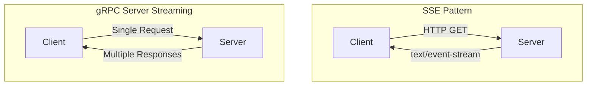
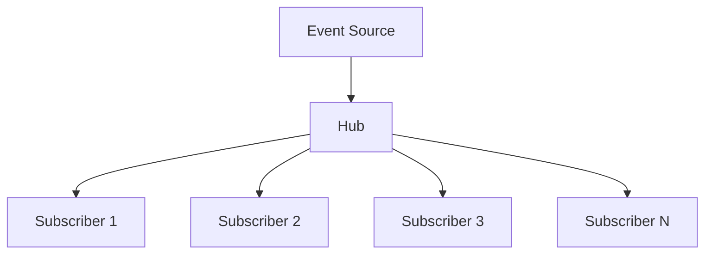

# How to Implement Server-Sent Events Style Patterns with gRPC Streaming

Author: [nawazdhandala](https://www.github.com/nawazdhandala)

Tags: grpc, streaming, sse, server-sent-events, real-time, golang, microservices, pubsub

Description: Learn how to implement SSE-like real-time communication patterns using gRPC server streaming with reconnection handling, broadcast patterns, and backpressure management.

---

## Introduction

Server-Sent Events (SSE) is a popular pattern for server-to-client real-time communication over HTTP. While gRPC offers native streaming capabilities that surpass SSE in many ways, understanding how to implement SSE-like patterns with gRPC helps developers migrate existing applications and leverage the best of both worlds.

This guide covers implementing SSE-style patterns using gRPC server streaming, including long-lived connections, automatic reconnection, broadcast patterns, and backpressure handling.

## SSE vs gRPC Streaming



| Feature | SSE | gRPC Streaming |
|---------|-----|----------------|
| Protocol | HTTP/1.1 | HTTP/2 |
| Data Format | Text | Binary (Protobuf) |
| Bidirectional | No | Yes |
| Browser Support | Native | Requires grpc-web |
| Reconnection | Built-in | Manual |
| Multiplexing | No | Yes |
| Type Safety | No | Yes |

## Project Setup

### Initialize the Project

```bash
mkdir grpc-streaming-demo
cd grpc-streaming-demo
go mod init github.com/example/grpc-streaming-demo
```

### Install Dependencies

```bash
go get google.golang.org/grpc
go get google.golang.org/protobuf
go get github.com/google/uuid
```

### Create Project Structure

```bash
mkdir -p proto
mkdir -p pkg/events
mkdir -p cmd/server
mkdir -p cmd/client
```

## Defining the Streaming Service

### Proto Definition

Create `proto/events.proto`:

```protobuf
syntax = "proto3";

package events;

option go_package = "github.com/example/grpc-streaming-demo/pkg/events;events";

import "google/protobuf/timestamp.proto";
import "google/protobuf/any.proto";

// Event represents a generic event in the system
message Event {
  // Unique event identifier
  string id = 1;

  // Event type for client-side routing
  string type = 2;

  // Event timestamp
  google.protobuf.Timestamp timestamp = 3;

  // Optional event data as JSON string
  string data = 4;

  // Optional structured data
  google.protobuf.Any payload = 5;

  // Event metadata
  map<string, string> metadata = 6;
}

// SubscribeRequest defines subscription parameters
message SubscribeRequest {
  // Client identifier for tracking
  string client_id = 1;

  // Event types to subscribe to (empty = all events)
  repeated string event_types = 2;

  // Optional: Resume from this event ID
  string last_event_id = 3;

  // Optional: Channel/topic to subscribe to
  string channel = 4;

  // Heartbeat interval in seconds (0 = default 30s)
  int32 heartbeat_interval = 5;
}

// HeartbeatEvent for connection keep-alive
message HeartbeatEvent {
  google.protobuf.Timestamp timestamp = 1;
  int64 sequence = 2;
}

// Specific event types
message UserEvent {
  string user_id = 1;
  string action = 2;  // created, updated, deleted
  string username = 3;
  string email = 4;
}

message NotificationEvent {
  string notification_id = 1;
  string title = 2;
  string body = 3;
  string severity = 4;  // info, warning, error, critical
  string target_user = 5;
}

message MetricEvent {
  string metric_name = 1;
  double value = 2;
  map<string, string> labels = 3;
}

// Broadcast request for admin/system use
message BroadcastRequest {
  Event event = 1;
  repeated string target_channels = 2;  // Empty = broadcast to all
}

message BroadcastResponse {
  int32 recipients = 1;
  string event_id = 2;
}

// Connection status
message ConnectionStatus {
  string client_id = 1;
  bool connected = 2;
  int64 events_received = 3;
  google.protobuf.Timestamp connected_at = 4;
}

// EventService provides real-time event streaming
service EventService {
  // Subscribe opens a server-streaming connection for events
  rpc Subscribe(SubscribeRequest) returns (stream Event);

  // SubscribeMultiple allows subscribing to multiple channels
  rpc SubscribeMultiple(stream SubscribeRequest) returns (stream Event);

  // Broadcast sends an event to all connected clients
  rpc Broadcast(BroadcastRequest) returns (BroadcastResponse);

  // GetConnectionStatus returns current connection information
  rpc GetConnectionStatus(SubscribeRequest) returns (ConnectionStatus);
}
```

### Generate Code

```bash
protoc --go_out=. --go_opt=paths=source_relative \
       --go-grpc_out=. --go-grpc_opt=paths=source_relative \
       proto/events.proto
```

## Server Implementation

### Event Hub

Create `pkg/events/hub.go`:

```go
package events

import (
	"context"
	"log"
	"sync"
	"time"

	"github.com/google/uuid"
	pb "github.com/example/grpc-streaming-demo/proto"
	"google.golang.org/protobuf/types/known/timestamppb"
)

// Subscriber represents a connected client
type Subscriber struct {
	ID             string
	ClientID       string
	EventTypes     map[string]bool
	Channel        string
	EventChan      chan *pb.Event
	LastEventID    string
	ConnectedAt    time.Time
	EventsReceived int64
	Done           chan struct{}
}

// Hub manages all subscribers and event distribution
type Hub struct {
	mu          sync.RWMutex
	subscribers map[string]*Subscriber
	channels    map[string]map[string]*Subscriber // channel -> subscriberID -> subscriber

	// Event history for replay (simple implementation)
	history     []*pb.Event
	historyMu   sync.RWMutex
	maxHistory  int

	// Metrics
	totalEvents     int64
	totalSubscribers int64
}

// NewHub creates a new event hub
func NewHub(maxHistory int) *Hub {
	return &Hub{
		subscribers: make(map[string]*Subscriber),
		channels:    make(map[string]map[string]*Subscriber),
		history:     make([]*pb.Event, 0, maxHistory),
		maxHistory:  maxHistory,
	}
}

// Subscribe adds a new subscriber
func (h *Hub) Subscribe(ctx context.Context, req *pb.SubscribeRequest) (*Subscriber, error) {
	h.mu.Lock()
	defer h.mu.Unlock()

	subscriberID := uuid.New().String()

	eventTypes := make(map[string]bool)
	for _, et := range req.EventTypes {
		eventTypes[et] = true
	}

	sub := &Subscriber{
		ID:          subscriberID,
		ClientID:    req.ClientId,
		EventTypes:  eventTypes,
		Channel:     req.Channel,
		EventChan:   make(chan *pb.Event, 100), // Buffered channel for backpressure
		LastEventID: req.LastEventId,
		ConnectedAt: time.Now(),
		Done:        make(chan struct{}),
	}

	h.subscribers[subscriberID] = sub
	h.totalSubscribers++

	// Add to channel
	channel := req.Channel
	if channel == "" {
		channel = "default"
	}
	if h.channels[channel] == nil {
		h.channels[channel] = make(map[string]*Subscriber)
	}
	h.channels[channel][subscriberID] = sub

	log.Printf("Subscriber %s connected (client: %s, channel: %s)", subscriberID, req.ClientId, channel)

	// Replay missed events if last_event_id provided
	if req.LastEventId != "" {
		go h.replayEvents(sub, req.LastEventId)
	}

	return sub, nil
}

// Unsubscribe removes a subscriber
func (h *Hub) Unsubscribe(subscriberID string) {
	h.mu.Lock()
	defer h.mu.Unlock()

	sub, exists := h.subscribers[subscriberID]
	if !exists {
		return
	}

	close(sub.Done)
	close(sub.EventChan)

	delete(h.subscribers, subscriberID)

	// Remove from channel
	channel := sub.Channel
	if channel == "" {
		channel = "default"
	}
	if h.channels[channel] != nil {
		delete(h.channels[channel], subscriberID)
	}

	log.Printf("Subscriber %s disconnected (events received: %d)", subscriberID, sub.EventsReceived)
}

// Publish sends an event to matching subscribers
func (h *Hub) Publish(event *pb.Event) int {
	h.mu.RLock()
	defer h.mu.RUnlock()

	// Store in history
	h.storeEvent(event)

	recipients := 0

	for _, sub := range h.subscribers {
		if h.shouldReceive(sub, event) {
			select {
			case sub.EventChan <- event:
				recipients++
			default:
				// Channel full - backpressure handling
				log.Printf("Warning: Subscriber %s channel full, dropping event", sub.ID)
			}
		}
	}

	h.totalEvents++
	return recipients
}

// PublishToChannel sends an event to a specific channel
func (h *Hub) PublishToChannel(channel string, event *pb.Event) int {
	h.mu.RLock()
	defer h.mu.RUnlock()

	h.storeEvent(event)

	recipients := 0
	channelSubs := h.channels[channel]

	for _, sub := range channelSubs {
		if h.shouldReceive(sub, event) {
			select {
			case sub.EventChan <- event:
				recipients++
			default:
				log.Printf("Warning: Subscriber %s channel full, dropping event", sub.ID)
			}
		}
	}

	return recipients
}

// Broadcast sends an event to all subscribers across specified channels
func (h *Hub) Broadcast(event *pb.Event, channels []string) int {
	h.mu.RLock()
	defer h.mu.RUnlock()

	h.storeEvent(event)

	recipients := 0

	if len(channels) == 0 {
		// Broadcast to all
		for _, sub := range h.subscribers {
			select {
			case sub.EventChan <- event:
				recipients++
			default:
				log.Printf("Warning: Subscriber %s channel full, dropping event", sub.ID)
			}
		}
	} else {
		// Broadcast to specific channels
		sent := make(map[string]bool)
		for _, channel := range channels {
			for subID, sub := range h.channels[channel] {
				if !sent[subID] {
					select {
					case sub.EventChan <- event:
						recipients++
						sent[subID] = true
					default:
						log.Printf("Warning: Subscriber %s channel full, dropping event", sub.ID)
					}
				}
			}
		}
	}

	return recipients
}

// shouldReceive checks if a subscriber should receive an event
func (h *Hub) shouldReceive(sub *Subscriber, event *pb.Event) bool {
	// If no event types specified, receive all
	if len(sub.EventTypes) == 0 {
		return true
	}
	return sub.EventTypes[event.Type]
}

// storeEvent adds an event to history
func (h *Hub) storeEvent(event *pb.Event) {
	h.historyMu.Lock()
	defer h.historyMu.Unlock()

	h.history = append(h.history, event)
	if len(h.history) > h.maxHistory {
		h.history = h.history[1:]
	}
}

// replayEvents sends missed events to a subscriber
func (h *Hub) replayEvents(sub *Subscriber, lastEventID string) {
	h.historyMu.RLock()
	defer h.historyMu.RUnlock()

	foundLast := false
	replayed := 0

	for _, event := range h.history {
		if event.Id == lastEventID {
			foundLast = true
			continue
		}

		if foundLast && h.shouldReceive(sub, event) {
			select {
			case sub.EventChan <- event:
				replayed++
			case <-sub.Done:
				return
			}
		}
	}

	if replayed > 0 {
		log.Printf("Replayed %d events to subscriber %s", replayed, sub.ID)
	}
}

// GetStats returns hub statistics
func (h *Hub) GetStats() (subscribers int, totalEvents int64) {
	h.mu.RLock()
	defer h.mu.RUnlock()
	return len(h.subscribers), h.totalEvents
}
```

### gRPC Server

Create `cmd/server/main.go`:

```go
package main

import (
	"context"
	"encoding/json"
	"log"
	"net"
	"os"
	"os/signal"
	"sync/atomic"
	"syscall"
	"time"

	"github.com/google/uuid"
	"google.golang.org/grpc"
	"google.golang.org/grpc/codes"
	"google.golang.org/grpc/keepalive"
	"google.golang.org/grpc/status"
	"google.golang.org/protobuf/types/known/timestamppb"

	"github.com/example/grpc-streaming-demo/pkg/events"
	pb "github.com/example/grpc-streaming-demo/proto"
)

// EventServer implements the EventService
type EventServer struct {
	pb.UnimplementedEventServiceServer
	hub              *events.Hub
	heartbeatSeq     int64
	defaultHeartbeat time.Duration
}

// NewEventServer creates a new EventServer
func NewEventServer() *EventServer {
	return &EventServer{
		hub:              events.NewHub(1000), // Keep last 1000 events
		defaultHeartbeat: 30 * time.Second,
	}
}

// Subscribe handles server streaming subscriptions
func (s *EventServer) Subscribe(req *pb.SubscribeRequest, stream pb.EventService_SubscribeServer) error {
	ctx := stream.Context()

	// Validate request
	if req.ClientId == "" {
		return status.Error(codes.InvalidArgument, "client_id is required")
	}

	// Subscribe to hub
	sub, err := s.hub.Subscribe(ctx, req)
	if err != nil {
		return status.Errorf(codes.Internal, "failed to subscribe: %v", err)
	}
	defer s.hub.Unsubscribe(sub.ID)

	// Determine heartbeat interval
	heartbeatInterval := s.defaultHeartbeat
	if req.HeartbeatInterval > 0 {
		heartbeatInterval = time.Duration(req.HeartbeatInterval) * time.Second
	}

	// Start heartbeat ticker
	heartbeatTicker := time.NewTicker(heartbeatInterval)
	defer heartbeatTicker.Stop()

	log.Printf("Client %s subscribed (types: %v, channel: %s)", req.ClientId, req.EventTypes, req.Channel)

	for {
		select {
		case <-ctx.Done():
			log.Printf("Client %s context cancelled", req.ClientId)
			return ctx.Err()

		case <-sub.Done:
			return nil

		case event, ok := <-sub.EventChan:
			if !ok {
				return nil
			}

			if err := stream.Send(event); err != nil {
				log.Printf("Error sending event to client %s: %v", req.ClientId, err)
				return err
			}
			sub.EventsReceived++

		case <-heartbeatTicker.C:
			// Send heartbeat to keep connection alive
			seq := atomic.AddInt64(&s.heartbeatSeq, 1)
			heartbeat := &pb.Event{
				Id:        uuid.New().String(),
				Type:      "heartbeat",
				Timestamp: timestamppb.Now(),
				Data:      `{"type": "heartbeat"}`,
				Metadata: map[string]string{
					"sequence": string(rune(seq)),
				},
			}

			if err := stream.Send(heartbeat); err != nil {
				log.Printf("Error sending heartbeat to client %s: %v", req.ClientId, err)
				return err
			}
		}
	}
}

// SubscribeMultiple handles bidirectional streaming for multiple subscriptions
func (s *EventServer) SubscribeMultiple(stream pb.EventService_SubscribeMultipleServer) error {
	ctx := stream.Context()

	// Receive initial subscription request
	req, err := stream.Recv()
	if err != nil {
		return status.Errorf(codes.InvalidArgument, "failed to receive initial request: %v", err)
	}

	if req.ClientId == "" {
		return status.Error(codes.InvalidArgument, "client_id is required")
	}

	// Subscribe to hub
	sub, err := s.hub.Subscribe(ctx, req)
	if err != nil {
		return status.Errorf(codes.Internal, "failed to subscribe: %v", err)
	}
	defer s.hub.Unsubscribe(sub.ID)

	// Handle incoming subscription updates in a goroutine
	go func() {
		for {
			updateReq, err := stream.Recv()
			if err != nil {
				return
			}

			// Update subscription filters
			if len(updateReq.EventTypes) > 0 {
				newTypes := make(map[string]bool)
				for _, et := range updateReq.EventTypes {
					newTypes[et] = true
				}
				sub.EventTypes = newTypes
				log.Printf("Client %s updated event types: %v", req.ClientId, updateReq.EventTypes)
			}
		}
	}()

	// Send events to client
	for {
		select {
		case <-ctx.Done():
			return ctx.Err()
		case event, ok := <-sub.EventChan:
			if !ok {
				return nil
			}
			if err := stream.Send(event); err != nil {
				return err
			}
			sub.EventsReceived++
		}
	}
}

// Broadcast sends an event to all matching subscribers
func (s *EventServer) Broadcast(ctx context.Context, req *pb.BroadcastRequest) (*pb.BroadcastResponse, error) {
	if req.Event == nil {
		return nil, status.Error(codes.InvalidArgument, "event is required")
	}

	// Ensure event has an ID and timestamp
	if req.Event.Id == "" {
		req.Event.Id = uuid.New().String()
	}
	if req.Event.Timestamp == nil {
		req.Event.Timestamp = timestamppb.Now()
	}

	recipients := s.hub.Broadcast(req.Event, req.TargetChannels)

	log.Printf("Broadcast event %s (type: %s) to %d recipients", req.Event.Id, req.Event.Type, recipients)

	return &pb.BroadcastResponse{
		EventId:    req.Event.Id,
		Recipients: int32(recipients),
	}, nil
}

// GetConnectionStatus returns connection information
func (s *EventServer) GetConnectionStatus(ctx context.Context, req *pb.SubscribeRequest) (*pb.ConnectionStatus, error) {
	subscribers, totalEvents := s.hub.GetStats()

	return &pb.ConnectionStatus{
		ClientId:       req.ClientId,
		Connected:      true,
		EventsReceived: totalEvents,
		ConnectedAt:    timestamppb.Now(),
	}, nil
}

// startEventGenerator simulates event generation
func (s *EventServer) startEventGenerator(ctx context.Context) {
	ticker := time.NewTicker(2 * time.Second)
	defer ticker.Stop()

	eventTypes := []string{"user.created", "user.updated", "notification", "metric"}

	for {
		select {
		case <-ctx.Done():
			return
		case <-ticker.C:
			eventType := eventTypes[time.Now().UnixNano()%int64(len(eventTypes))]

			var data string
			switch eventType {
			case "user.created", "user.updated":
				userData := map[string]interface{}{
					"user_id":  uuid.New().String(),
					"username": "user_" + time.Now().Format("150405"),
					"action":   eventType,
				}
				dataBytes, _ := json.Marshal(userData)
				data = string(dataBytes)

			case "notification":
				notifData := map[string]interface{}{
					"title":    "System Notification",
					"body":     "This is a test notification",
					"severity": "info",
				}
				dataBytes, _ := json.Marshal(notifData)
				data = string(dataBytes)

			case "metric":
				metricData := map[string]interface{}{
					"metric_name": "cpu_usage",
					"value":       50 + time.Now().Unix()%50,
					"labels": map[string]string{
						"host": "server-1",
					},
				}
				dataBytes, _ := json.Marshal(metricData)
				data = string(dataBytes)
			}

			event := &pb.Event{
				Id:        uuid.New().String(),
				Type:      eventType,
				Timestamp: timestamppb.Now(),
				Data:      data,
			}

			recipients := s.hub.Publish(event)
			if recipients > 0 {
				log.Printf("Published event %s (type: %s) to %d recipients", event.Id, event.Type, recipients)
			}
		}
	}
}

func main() {
	ctx, cancel := context.WithCancel(context.Background())
	defer cancel()

	// Create server
	server := NewEventServer()

	// Start event generator
	go server.startEventGenerator(ctx)

	// Configure gRPC server with keepalive
	grpcServer := grpc.NewServer(
		grpc.KeepaliveParams(keepalive.ServerParameters{
			MaxConnectionIdle:     5 * time.Minute,
			MaxConnectionAge:      30 * time.Minute,
			MaxConnectionAgeGrace: 5 * time.Minute,
			Time:                  30 * time.Second,
			Timeout:               10 * time.Second,
		}),
		grpc.KeepaliveEnforcementPolicy(keepalive.EnforcementPolicy{
			MinTime:             10 * time.Second,
			PermitWithoutStream: true,
		}),
	)

	pb.RegisterEventServiceServer(grpcServer, server)

	// Start listening
	listener, err := net.Listen("tcp", ":50051")
	if err != nil {
		log.Fatalf("Failed to listen: %v", err)
	}

	// Graceful shutdown
	go func() {
		sigCh := make(chan os.Signal, 1)
		signal.Notify(sigCh, syscall.SIGINT, syscall.SIGTERM)
		<-sigCh

		log.Println("Shutting down...")
		cancel()
		grpcServer.GracefulStop()
	}()

	log.Println("Event server listening on :50051")
	if err := grpcServer.Serve(listener); err != nil {
		log.Fatalf("Failed to serve: %v", err)
	}
}
```

## Client Implementation with Reconnection

### Resilient Client

Create `cmd/client/main.go`:

```go
package main

import (
	"context"
	"encoding/json"
	"fmt"
	"io"
	"log"
	"os"
	"os/signal"
	"sync"
	"syscall"
	"time"

	"github.com/google/uuid"
	"google.golang.org/grpc"
	"google.golang.org/grpc/codes"
	"google.golang.org/grpc/credentials/insecure"
	"google.golang.org/grpc/keepalive"
	"google.golang.org/grpc/status"

	pb "github.com/example/grpc-streaming-demo/proto"
)

// EventClient handles streaming with automatic reconnection
type EventClient struct {
	conn        *grpc.ClientConn
	client      pb.EventServiceClient
	clientID    string
	eventTypes  []string
	channel     string

	// Reconnection settings
	maxRetries       int
	baseDelay        time.Duration
	maxDelay         time.Duration

	// State
	lastEventID string
	mu          sync.RWMutex

	// Callbacks
	onEvent      func(*pb.Event)
	onConnect    func()
	onDisconnect func(error)
}

// ClientOption configures the EventClient
type ClientOption func(*EventClient)

// WithEventTypes sets the event types to subscribe to
func WithEventTypes(types []string) ClientOption {
	return func(c *EventClient) {
		c.eventTypes = types
	}
}

// WithChannel sets the channel to subscribe to
func WithChannel(channel string) ClientOption {
	return func(c *EventClient) {
		c.channel = channel
	}
}

// WithRetryConfig sets retry configuration
func WithRetryConfig(maxRetries int, baseDelay, maxDelay time.Duration) ClientOption {
	return func(c *EventClient) {
		c.maxRetries = maxRetries
		c.baseDelay = baseDelay
		c.maxDelay = maxDelay
	}
}

// WithOnEvent sets the event callback
func WithOnEvent(fn func(*pb.Event)) ClientOption {
	return func(c *EventClient) {
		c.onEvent = fn
	}
}

// WithOnConnect sets the connect callback
func WithOnConnect(fn func()) ClientOption {
	return func(c *EventClient) {
		c.onConnect = fn
	}
}

// WithOnDisconnect sets the disconnect callback
func WithOnDisconnect(fn func(error)) ClientOption {
	return func(c *EventClient) {
		c.onDisconnect = fn
	}
}

// NewEventClient creates a new event client
func NewEventClient(serverAddr string, opts ...ClientOption) (*EventClient, error) {
	// Default client configuration
	client := &EventClient{
		clientID:    uuid.New().String(),
		maxRetries:  -1, // Infinite retries
		baseDelay:   time.Second,
		maxDelay:    30 * time.Second,
		onEvent:     func(e *pb.Event) {},
		onConnect:   func() {},
		onDisconnect: func(err error) {},
	}

	// Apply options
	for _, opt := range opts {
		opt(client)
	}

	// Connect to server
	conn, err := grpc.Dial(
		serverAddr,
		grpc.WithTransportCredentials(insecure.NewCredentials()),
		grpc.WithKeepaliveParams(keepalive.ClientParameters{
			Time:                30 * time.Second,
			Timeout:             10 * time.Second,
			PermitWithoutStream: true,
		}),
	)
	if err != nil {
		return nil, fmt.Errorf("failed to connect: %w", err)
	}

	client.conn = conn
	client.client = pb.NewEventServiceClient(conn)

	return client, nil
}

// Subscribe starts the subscription with automatic reconnection
func (c *EventClient) Subscribe(ctx context.Context) error {
	retryCount := 0

	for {
		select {
		case <-ctx.Done():
			return ctx.Err()
		default:
		}

		err := c.subscribeOnce(ctx)

		if err == nil || ctx.Err() != nil {
			return err
		}

		// Handle reconnection
		c.onDisconnect(err)

		// Check if we should retry
		if c.maxRetries >= 0 && retryCount >= c.maxRetries {
			return fmt.Errorf("max retries (%d) exceeded: %w", c.maxRetries, err)
		}

		// Calculate backoff delay
		delay := c.calculateBackoff(retryCount)
		log.Printf("Connection lost, reconnecting in %v (attempt %d)...", delay, retryCount+1)

		select {
		case <-ctx.Done():
			return ctx.Err()
		case <-time.After(delay):
		}

		retryCount++
	}
}

// subscribeOnce performs a single subscription attempt
func (c *EventClient) subscribeOnce(ctx context.Context) error {
	c.mu.RLock()
	lastEventID := c.lastEventID
	c.mu.RUnlock()

	req := &pb.SubscribeRequest{
		ClientId:          c.clientID,
		EventTypes:        c.eventTypes,
		Channel:           c.channel,
		LastEventId:       lastEventID,
		HeartbeatInterval: 30,
	}

	stream, err := c.client.Subscribe(ctx, req)
	if err != nil {
		return fmt.Errorf("failed to subscribe: %w", err)
	}

	log.Printf("Connected to event stream (client: %s)", c.clientID)
	c.onConnect()

	for {
		event, err := stream.Recv()
		if err != nil {
			if err == io.EOF {
				return nil
			}

			// Check for specific error codes
			if st, ok := status.FromError(err); ok {
				switch st.Code() {
				case codes.Canceled:
					return nil
				case codes.Unavailable:
					return fmt.Errorf("server unavailable: %w", err)
				}
			}

			return err
		}

		// Update last event ID for reconnection
		if event.Type != "heartbeat" {
			c.mu.Lock()
			c.lastEventID = event.Id
			c.mu.Unlock()
		}

		c.onEvent(event)
	}
}

// calculateBackoff calculates exponential backoff delay
func (c *EventClient) calculateBackoff(retryCount int) time.Duration {
	delay := c.baseDelay * time.Duration(1<<uint(retryCount))
	if delay > c.maxDelay {
		delay = c.maxDelay
	}
	return delay
}

// Close closes the client connection
func (c *EventClient) Close() error {
	if c.conn != nil {
		return c.conn.Close()
	}
	return nil
}

// GetLastEventID returns the last received event ID
func (c *EventClient) GetLastEventID() string {
	c.mu.RLock()
	defer c.mu.RUnlock()
	return c.lastEventID
}

func main() {
	ctx, cancel := context.WithCancel(context.Background())
	defer cancel()

	// Create client with options
	client, err := NewEventClient(
		"localhost:50051",
		WithEventTypes([]string{"user.created", "notification"}),
		WithChannel("default"),
		WithRetryConfig(-1, time.Second, 30*time.Second),
		WithOnEvent(func(event *pb.Event) {
			if event.Type == "heartbeat" {
				log.Println("Heartbeat received")
				return
			}

			var data map[string]interface{}
			json.Unmarshal([]byte(event.Data), &data)

			log.Printf("Event received: id=%s type=%s data=%v",
				event.Id, event.Type, data)
		}),
		WithOnConnect(func() {
			log.Println("Connected to server")
		}),
		WithOnDisconnect(func(err error) {
			log.Printf("Disconnected: %v", err)
		}),
	)
	if err != nil {
		log.Fatalf("Failed to create client: %v", err)
	}
	defer client.Close()

	// Handle shutdown
	go func() {
		sigCh := make(chan os.Signal, 1)
		signal.Notify(sigCh, syscall.SIGINT, syscall.SIGTERM)
		<-sigCh

		log.Println("Shutting down client...")
		cancel()
	}()

	// Start subscription
	log.Println("Starting event subscription...")
	if err := client.Subscribe(ctx); err != nil && err != context.Canceled {
		log.Printf("Subscription error: %v", err)
	}
}
```

## Broadcast Patterns

### Fan-Out Pattern



### Channel-Based Broadcast

```go
// Publish to specific channels
func (s *EventServer) PublishToChannels(event *pb.Event, channels []string) {
    for _, channel := range channels {
        s.hub.PublishToChannel(channel, event)
    }
}

// Example: Publish user events to user-specific channels
func (s *EventServer) NotifyUser(userID string, event *pb.Event) {
    channel := fmt.Sprintf("user:%s", userID)
    s.hub.PublishToChannel(channel, event)
}

// Example: Publish to role-based channels
func (s *EventServer) NotifyByRole(role string, event *pb.Event) {
    channel := fmt.Sprintf("role:%s", role)
    s.hub.PublishToChannel(channel, event)
}
```

### Topic-Based Filtering

```go
// Enhanced subscriber with topic patterns
type TopicMatcher struct {
    patterns []string
}

func (tm *TopicMatcher) Matches(eventType string) bool {
    for _, pattern := range tm.patterns {
        if matchesPattern(pattern, eventType) {
            return true
        }
    }
    return false
}

func matchesPattern(pattern, eventType string) bool {
    // Support wildcards: "user.*" matches "user.created", "user.updated"
    if strings.HasSuffix(pattern, ".*") {
        prefix := strings.TrimSuffix(pattern, ".*")
        return strings.HasPrefix(eventType, prefix+".")
    }

    // Support double wildcards: "**.error" matches "system.db.error"
    if strings.HasPrefix(pattern, "**.") {
        suffix := strings.TrimPrefix(pattern, "**.")
        return strings.HasSuffix(eventType, "."+suffix) || eventType == suffix
    }

    return pattern == eventType
}
```

## Backpressure Handling

### Server-Side Backpressure

```go
// Enhanced Hub with backpressure handling
type BackpressureConfig struct {
    BufferSize      int
    DropPolicy      DropPolicy
    SlowConsumerCB  func(subscriberID string)
}

type DropPolicy int

const (
    DropNewest DropPolicy = iota
    DropOldest
    Block
)

func (h *Hub) PublishWithBackpressure(event *pb.Event, config BackpressureConfig) int {
    h.mu.RLock()
    defer h.mu.RUnlock()

    recipients := 0

    for _, sub := range h.subscribers {
        if !h.shouldReceive(sub, event) {
            continue
        }

        select {
        case sub.EventChan <- event:
            recipients++
        default:
            // Handle backpressure based on policy
            switch config.DropPolicy {
            case DropNewest:
                // Don't send, just log
                if config.SlowConsumerCB != nil {
                    config.SlowConsumerCB(sub.ID)
                }

            case DropOldest:
                // Remove oldest and add new
                select {
                case <-sub.EventChan:
                    sub.EventChan <- event
                    recipients++
                default:
                }

            case Block:
                // Block until space available (careful with this)
                sub.EventChan <- event
                recipients++
            }
        }
    }

    return recipients
}
```

### Client-Side Flow Control

```go
// Rate-limited event processor
type RateLimitedProcessor struct {
    limiter    *rate.Limiter
    eventChan  chan *pb.Event
    processor  func(*pb.Event)
}

func NewRateLimitedProcessor(eventsPerSecond float64, processor func(*pb.Event)) *RateLimitedProcessor {
    return &RateLimitedProcessor{
        limiter:   rate.NewLimiter(rate.Limit(eventsPerSecond), int(eventsPerSecond)),
        eventChan: make(chan *pb.Event, 1000),
        processor: processor,
    }
}

func (p *RateLimitedProcessor) Start(ctx context.Context) {
    go func() {
        for {
            select {
            case <-ctx.Done():
                return
            case event := <-p.eventChan:
                p.limiter.Wait(ctx)
                p.processor(event)
            }
        }
    }()
}

func (p *RateLimitedProcessor) Process(event *pb.Event) bool {
    select {
    case p.eventChan <- event:
        return true
    default:
        return false
    }
}
```

## Advanced Patterns

### Event Aggregation

```go
// Aggregate events before sending
type EventAggregator struct {
    mu          sync.Mutex
    events      []*pb.Event
    flushSize   int
    flushPeriod time.Duration
    onFlush     func([]*pb.Event)
}

func NewEventAggregator(flushSize int, flushPeriod time.Duration, onFlush func([]*pb.Event)) *EventAggregator {
    ea := &EventAggregator{
        events:      make([]*pb.Event, 0, flushSize),
        flushSize:   flushSize,
        flushPeriod: flushPeriod,
        onFlush:     onFlush,
    }

    go ea.periodicFlush()

    return ea
}

func (ea *EventAggregator) Add(event *pb.Event) {
    ea.mu.Lock()
    defer ea.mu.Unlock()

    ea.events = append(ea.events, event)

    if len(ea.events) >= ea.flushSize {
        ea.flush()
    }
}

func (ea *EventAggregator) flush() {
    if len(ea.events) == 0 {
        return
    }

    events := ea.events
    ea.events = make([]*pb.Event, 0, ea.flushSize)

    go ea.onFlush(events)
}

func (ea *EventAggregator) periodicFlush() {
    ticker := time.NewTicker(ea.flushPeriod)
    defer ticker.Stop()

    for range ticker.C {
        ea.mu.Lock()
        ea.flush()
        ea.mu.Unlock()
    }
}
```

### Event Deduplication

```go
// Deduplicate events based on ID
type EventDeduplicator struct {
    mu       sync.RWMutex
    seen     map[string]time.Time
    ttl      time.Duration
    maxSize  int
}

func NewEventDeduplicator(ttl time.Duration, maxSize int) *EventDeduplicator {
    ed := &EventDeduplicator{
        seen:    make(map[string]time.Time),
        ttl:     ttl,
        maxSize: maxSize,
    }

    go ed.cleanup()

    return ed
}

func (ed *EventDeduplicator) IsDuplicate(eventID string) bool {
    ed.mu.Lock()
    defer ed.mu.Unlock()

    if _, exists := ed.seen[eventID]; exists {
        return true
    }

    ed.seen[eventID] = time.Now()

    // Evict old entries if needed
    if len(ed.seen) > ed.maxSize {
        ed.evictOldest()
    }

    return false
}

func (ed *EventDeduplicator) evictOldest() {
    var oldestKey string
    var oldestTime time.Time

    for k, v := range ed.seen {
        if oldestKey == "" || v.Before(oldestTime) {
            oldestKey = k
            oldestTime = v
        }
    }

    if oldestKey != "" {
        delete(ed.seen, oldestKey)
    }
}

func (ed *EventDeduplicator) cleanup() {
    ticker := time.NewTicker(ed.ttl)
    defer ticker.Stop()

    for range ticker.C {
        ed.mu.Lock()
        cutoff := time.Now().Add(-ed.ttl)
        for k, v := range ed.seen {
            if v.Before(cutoff) {
                delete(ed.seen, k)
            }
        }
        ed.mu.Unlock()
    }
}
```

## Testing Streaming Services

### Integration Test

```go
package main

import (
    "context"
    "testing"
    "time"

    "github.com/stretchr/testify/assert"
    "github.com/stretchr/testify/require"
    "google.golang.org/grpc"
    "google.golang.org/grpc/credentials/insecure"
    "google.golang.org/grpc/test/bufconn"

    pb "github.com/example/grpc-streaming-demo/proto"
)

func TestEventStreaming(t *testing.T) {
    ctx, cancel := context.WithTimeout(context.Background(), 10*time.Second)
    defer cancel()

    // Setup in-memory server
    lis := bufconn.Listen(1024 * 1024)
    server := grpc.NewServer()
    eventServer := NewEventServer()
    pb.RegisterEventServiceServer(server, eventServer)

    go server.Serve(lis)
    defer server.Stop()

    // Create client
    conn, err := grpc.DialContext(ctx, "bufnet",
        grpc.WithContextDialer(func(ctx context.Context, s string) (net.Conn, error) {
            return lis.Dial()
        }),
        grpc.WithTransportCredentials(insecure.NewCredentials()),
    )
    require.NoError(t, err)
    defer conn.Close()

    client := pb.NewEventServiceClient(conn)

    // Subscribe
    stream, err := client.Subscribe(ctx, &pb.SubscribeRequest{
        ClientId:   "test-client",
        EventTypes: []string{"test"},
    })
    require.NoError(t, err)

    // Broadcast an event
    _, err = client.Broadcast(ctx, &pb.BroadcastRequest{
        Event: &pb.Event{
            Type: "test",
            Data: `{"message": "hello"}`,
        },
    })
    require.NoError(t, err)

    // Receive event
    event, err := stream.Recv()
    require.NoError(t, err)

    assert.Equal(t, "test", event.Type)
    assert.Contains(t, event.Data, "hello")
}
```

## Summary

Implementing SSE-like patterns with gRPC streaming provides several advantages:

1. **Type Safety**: Protocol Buffers ensure consistent message formats
2. **Bidirectional**: gRPC supports true bidirectional streaming when needed
3. **Efficiency**: HTTP/2 multiplexing and binary serialization reduce overhead
4. **Reliability**: Built-in flow control and the ability to implement robust reconnection

Key patterns covered:

- **Long-lived streams** with heartbeat keep-alive
- **Automatic reconnection** with exponential backoff
- **Event replay** from last received ID
- **Broadcast patterns** with channel-based filtering
- **Backpressure handling** with configurable policies
- **Event aggregation** and deduplication

When implementing real-time streaming, consider:

- Connection lifecycle management
- Graceful degradation under load
- Event ordering guarantees
- Monitoring and observability
- Client-side rate limiting

These patterns enable building robust real-time systems that can handle production workloads while maintaining the benefits of gRPC's type-safe, efficient communication.
