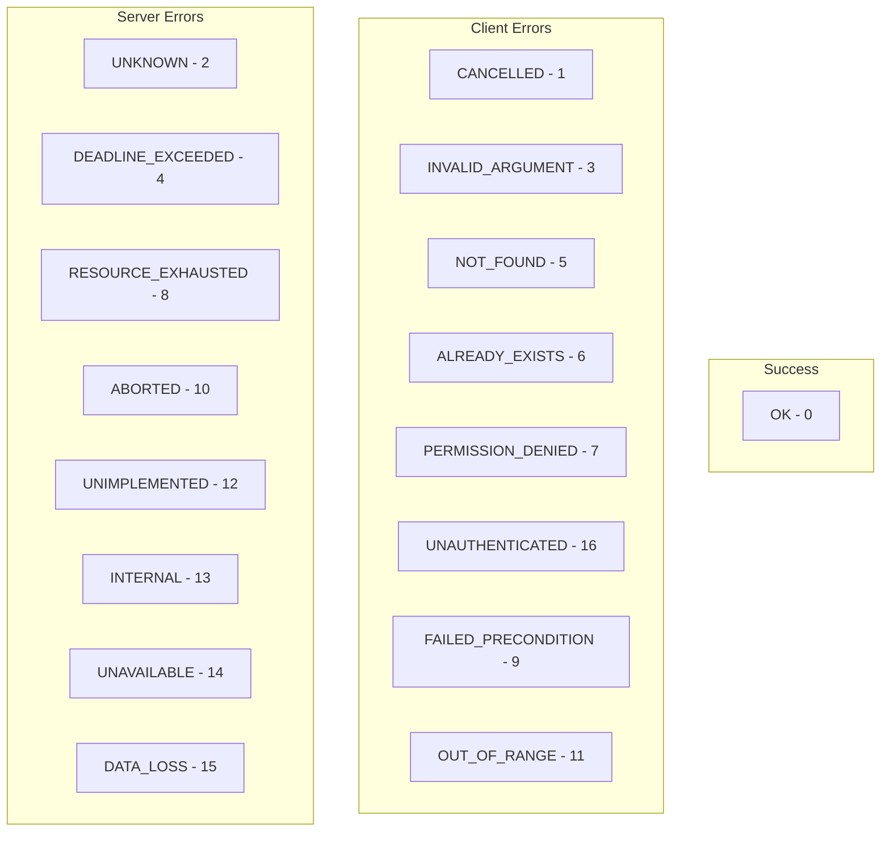
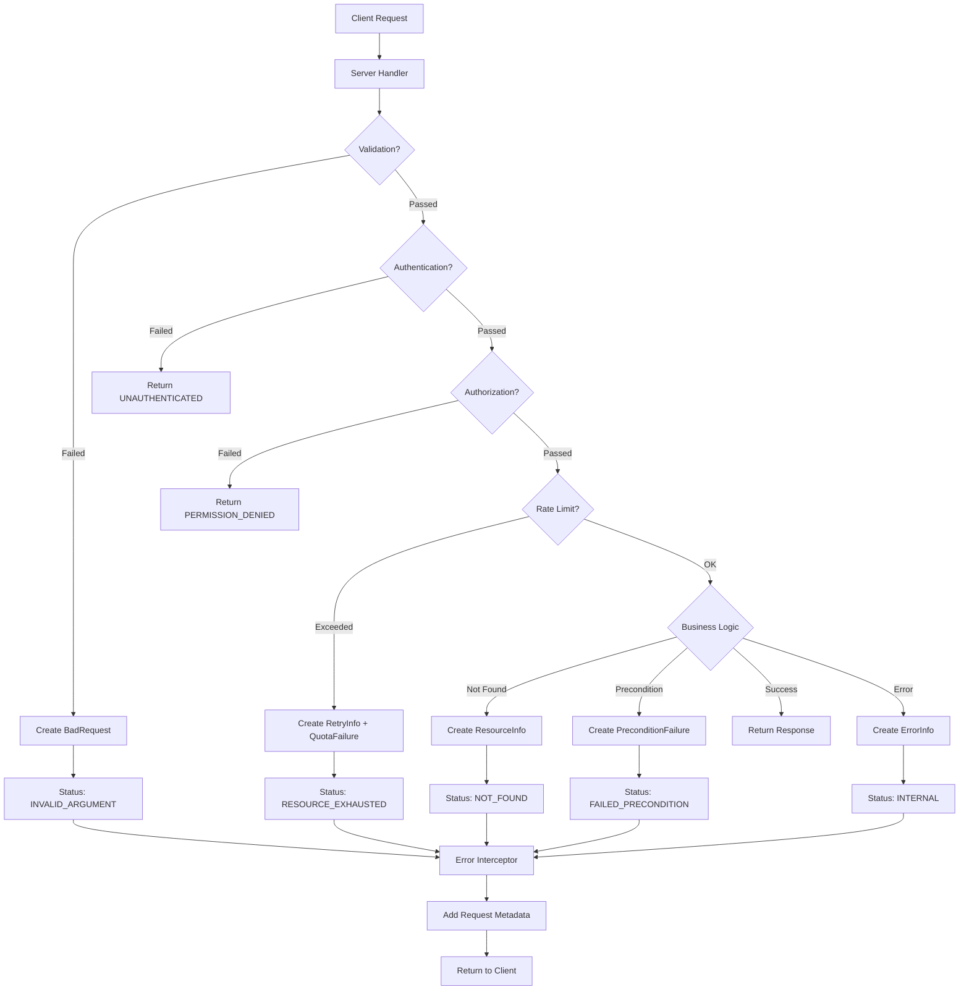

# How to Return Rich Error Details with gRPC Status Codes

Author: [nawazdhandala](https://www.github.com/nawazdhandala)

Tags: gRPC, error handling, status codes, error details, API design, microservices, protocol buffers

Description: Master gRPC error handling with rich error details, including status codes, error details proto, field violations, retry info, and localized error messages for better API experiences.

---

Effective error handling is crucial for building robust APIs. gRPC provides a rich error model that goes beyond simple status codes, allowing you to return detailed error information including field violations, retry hints, and localized messages. This guide covers everything you need to know about implementing comprehensive error handling in your gRPC services.

## Understanding gRPC Status Codes

gRPC defines a set of canonical status codes that should be used consistently across all services:



### Status Code Reference

| Code | Name | When to Use |
|------|------|-------------|
| 0 | OK | Successful completion |
| 1 | CANCELLED | Operation cancelled by the client |
| 2 | UNKNOWN | Unknown error (avoid when possible) |
| 3 | INVALID_ARGUMENT | Client provided invalid arguments |
| 4 | DEADLINE_EXCEEDED | Operation timed out |
| 5 | NOT_FOUND | Requested resource not found |
| 6 | ALREADY_EXISTS | Resource already exists (create conflicts) |
| 7 | PERMISSION_DENIED | Caller lacks permission |
| 8 | RESOURCE_EXHAUSTED | Rate limit or quota exceeded |
| 9 | FAILED_PRECONDITION | System not in required state |
| 10 | ABORTED | Operation aborted (concurrency issues) |
| 11 | OUT_OF_RANGE | Value outside valid range |
| 12 | UNIMPLEMENTED | Method not implemented |
| 13 | INTERNAL | Internal server error |
| 14 | UNAVAILABLE | Service temporarily unavailable |
| 15 | DATA_LOSS | Unrecoverable data loss |
| 16 | UNAUTHENTICATED | Missing or invalid authentication |

## Basic Error Handling in Go

Let's start with basic error handling before moving to rich error details:

```go
package main

import (
    "context"

    "google.golang.org/grpc/codes"
    "google.golang.org/grpc/status"
    pb "myapp/proto"
)

type userServer struct {
    pb.UnimplementedUserServiceServer
    users map[string]*pb.User
}

func (s *userServer) GetUser(ctx context.Context, req *pb.GetUserRequest) (*pb.User, error) {
    // Validate input
    if req.UserId == "" {
        return nil, status.Error(codes.InvalidArgument, "user_id is required")
    }

    // Check authentication (example)
    if !isAuthenticated(ctx) {
        return nil, status.Error(codes.Unauthenticated, "authentication required")
    }

    // Check authorization
    if !hasPermission(ctx, "users:read") {
        return nil, status.Error(codes.PermissionDenied, "insufficient permissions")
    }

    // Find user
    user, exists := s.users[req.UserId]
    if !exists {
        return nil, status.Errorf(codes.NotFound, "user %s not found", req.UserId)
    }

    return user, nil
}

func (s *userServer) CreateUser(ctx context.Context, req *pb.CreateUserRequest) (*pb.User, error) {
    // Check if user already exists
    if _, exists := s.users[req.Email]; exists {
        return nil, status.Errorf(codes.AlreadyExists, "user with email %s already exists", req.Email)
    }

    // Validate email format
    if !isValidEmail(req.Email) {
        return nil, status.Error(codes.InvalidArgument, "invalid email format")
    }

    // Create user...
    return &pb.User{}, nil
}
```

## Google's Rich Error Model

Google defines a rich error model in `google.rpc.Status` that includes detailed error information. First, let's look at the proto definitions:

```protobuf
// Import the error details protos
import "google/rpc/status.proto";
import "google/rpc/error_details.proto";

// The error details include:
// - ErrorInfo: Structured error information with domain and metadata
// - RetryInfo: Information about when to retry
// - DebugInfo: Debug information for developers
// - QuotaFailure: Quota violation details
// - PreconditionFailure: Precondition violation details
// - BadRequest: Field validation errors
// - RequestInfo: Request identification
// - ResourceInfo: Resource identification
// - Help: Links to documentation
// - LocalizedMessage: Localized error messages
```

## Implementing Rich Error Details in Go

```go
package errors

import (
    "time"

    "google.golang.org/genproto/googleapis/rpc/errdetails"
    "google.golang.org/grpc/codes"
    "google.golang.org/grpc/status"
    "google.golang.org/protobuf/types/known/durationpb"
)

// ValidationError creates an error with field violations
func ValidationError(violations map[string]string) error {
    st := status.New(codes.InvalidArgument, "validation failed")

    br := &errdetails.BadRequest{}
    for field, description := range violations {
        br.FieldViolations = append(br.FieldViolations, &errdetails.BadRequest_FieldViolation{
            Field:       field,
            Description: description,
        })
    }

    st, err := st.WithDetails(br)
    if err != nil {
        return status.Error(codes.Internal, "failed to create error details")
    }

    return st.Err()
}

// NotFoundError creates a detailed not found error
func NotFoundError(resourceType, resourceName, owner string) error {
    st := status.New(codes.NotFound, "resource not found")

    ri := &errdetails.ResourceInfo{
        ResourceType: resourceType,
        ResourceName: resourceName,
        Owner:        owner,
        Description:  "The requested resource could not be found",
    }

    st, err := st.WithDetails(ri)
    if err != nil {
        return status.Error(codes.Internal, "failed to create error details")
    }

    return st.Err()
}

// RateLimitError creates an error with retry information
func RateLimitError(retryAfter time.Duration, quotaLimit, quotaUsed int64) error {
    st := status.New(codes.ResourceExhausted, "rate limit exceeded")

    // Add retry info
    retryInfo := &errdetails.RetryInfo{
        RetryDelay: durationpb.New(retryAfter),
    }

    // Add quota failure info
    quotaFailure := &errdetails.QuotaFailure{
        Violations: []*errdetails.QuotaFailure_Violation{
            {
                Subject:     "requests per minute",
                Description: fmt.Sprintf("Limit: %d, Used: %d", quotaLimit, quotaUsed),
            },
        },
    }

    st, err := st.WithDetails(retryInfo, quotaFailure)
    if err != nil {
        return status.Error(codes.Internal, "failed to create error details")
    }

    return st.Err()
}

// PreconditionError creates an error for failed preconditions
func PreconditionError(violations []PreconditionViolation) error {
    st := status.New(codes.FailedPrecondition, "precondition check failed")

    pf := &errdetails.PreconditionFailure{}
    for _, v := range violations {
        pf.Violations = append(pf.Violations, &errdetails.PreconditionFailure_Violation{
            Type:        v.Type,
            Subject:     v.Subject,
            Description: v.Description,
        })
    }

    st, err := st.WithDetails(pf)
    if err != nil {
        return status.Error(codes.Internal, "failed to create error details")
    }

    return st.Err()
}

type PreconditionViolation struct {
    Type        string
    Subject     string
    Description string
}

// ErrorWithHelp creates an error with help links
func ErrorWithHelp(code codes.Code, message string, links []HelpLink) error {
    st := status.New(code, message)

    help := &errdetails.Help{}
    for _, link := range links {
        help.Links = append(help.Links, &errdetails.Help_Link{
            Description: link.Description,
            Url:         link.URL,
        })
    }

    st, err := st.WithDetails(help)
    if err != nil {
        return status.Error(codes.Internal, "failed to create error details")
    }

    return st.Err()
}

type HelpLink struct {
    Description string
    URL         string
}

// LocalizedError creates an error with localized message
func LocalizedError(code codes.Code, message, locale, localizedMessage string) error {
    st := status.New(code, message)

    lm := &errdetails.LocalizedMessage{
        Locale:  locale,
        Message: localizedMessage,
    }

    st, err := st.WithDetails(lm)
    if err != nil {
        return status.Error(codes.Internal, "failed to create error details")
    }

    return st.Err()
}

// ErrorWithDebugInfo creates an error with debug information
func ErrorWithDebugInfo(code codes.Code, message string, stackEntries []string, detail string) error {
    st := status.New(code, message)

    di := &errdetails.DebugInfo{
        StackEntries: stackEntries,
        Detail:       detail,
    }

    st, err := st.WithDetails(di)
    if err != nil {
        return status.Error(codes.Internal, "failed to create error details")
    }

    return st.Err()
}

// CompleteError creates an error with multiple detail types
func CompleteError(
    code codes.Code,
    message string,
    errorInfo *errdetails.ErrorInfo,
    details ...interface{},
) error {
    st := status.New(code, message)

    // Always include ErrorInfo
    allDetails := []interface{}{errorInfo}
    allDetails = append(allDetails, details...)

    // Convert to proto messages
    protoDetails := make([]interface{}, 0, len(allDetails))
    for _, d := range allDetails {
        if d != nil {
            protoDetails = append(protoDetails, d)
        }
    }

    st, err := st.WithDetails(protoDetails...)
    if err != nil {
        return status.Error(codes.Internal, "failed to create error details")
    }

    return st.Err()
}
```

## Using Rich Errors in a Service

```go
package main

import (
    "context"
    "regexp"
    "time"

    "google.golang.org/genproto/googleapis/rpc/errdetails"
    "google.golang.org/grpc/codes"
    "google.golang.org/grpc/status"
    pb "myapp/proto"
    "myapp/errors"
)

type userServer struct {
    pb.UnimplementedUserServiceServer
    users     map[string]*pb.User
    rateLimit *RateLimiter
}

func (s *userServer) CreateUser(ctx context.Context, req *pb.CreateUserRequest) (*pb.User, error) {
    // Validate all fields
    violations := make(map[string]string)

    if req.Email == "" {
        violations["email"] = "Email is required"
    } else if !isValidEmail(req.Email) {
        violations["email"] = "Email format is invalid. Expected format: user@example.com"
    }

    if req.Name == "" {
        violations["name"] = "Name is required"
    } else if len(req.Name) < 2 {
        violations["name"] = "Name must be at least 2 characters"
    } else if len(req.Name) > 100 {
        violations["name"] = "Name must not exceed 100 characters"
    }

    if req.Age < 0 {
        violations["age"] = "Age cannot be negative"
    } else if req.Age > 150 {
        violations["age"] = "Age must be a realistic value"
    }

    if len(violations) > 0 {
        return nil, errors.ValidationError(violations)
    }

    // Check rate limit
    allowed, retryAfter := s.rateLimit.Allow(ctx)
    if !allowed {
        return nil, errors.RateLimitError(retryAfter, 100, 100)
    }

    // Check if user exists
    if _, exists := s.users[req.Email]; exists {
        return nil, errors.NotFoundError("User", req.Email, "users-service")
    }

    // Create user...
    user := &pb.User{
        Id:    generateID(),
        Email: req.Email,
        Name:  req.Name,
    }
    s.users[req.Email] = user

    return user, nil
}

func (s *userServer) DeleteUser(ctx context.Context, req *pb.DeleteUserRequest) (*pb.Empty, error) {
    user, exists := s.users[req.UserId]
    if !exists {
        return nil, errors.NotFoundError("User", req.UserId, "users-service")
    }

    // Check preconditions
    if user.Status == "ACTIVE" && user.ActiveOrders > 0 {
        return nil, errors.PreconditionError([]errors.PreconditionViolation{
            {
                Type:        "USER_HAS_ACTIVE_ORDERS",
                Subject:     fmt.Sprintf("user/%s", req.UserId),
                Description: "User cannot be deleted while they have active orders. Please cancel or complete all orders first.",
            },
        })
    }

    if user.Balance > 0 {
        return nil, errors.PreconditionError([]errors.PreconditionViolation{
            {
                Type:        "USER_HAS_BALANCE",
                Subject:     fmt.Sprintf("user/%s/balance", req.UserId),
                Description: fmt.Sprintf("User has remaining balance of $%.2f. Please refund or transfer before deletion.", user.Balance),
            },
        })
    }

    delete(s.users, req.UserId)
    return &pb.Empty{}, nil
}

func (s *userServer) TransferFunds(ctx context.Context, req *pb.TransferRequest) (*pb.TransferResponse, error) {
    // Validate amount
    if req.Amount <= 0 {
        return nil, errors.ValidationError(map[string]string{
            "amount": "Transfer amount must be positive",
        })
    }

    // Get source account
    source, exists := s.users[req.FromUserId]
    if !exists {
        return nil, errors.NotFoundError("User", req.FromUserId, "users-service")
    }

    // Check balance
    if source.Balance < req.Amount {
        st := status.New(codes.FailedPrecondition, "insufficient funds")

        // Add detailed error info
        errorInfo := &errdetails.ErrorInfo{
            Reason: "INSUFFICIENT_FUNDS",
            Domain: "myapp.com",
            Metadata: map[string]string{
                "current_balance":  fmt.Sprintf("%.2f", source.Balance),
                "requested_amount": fmt.Sprintf("%.2f", req.Amount),
                "shortfall":        fmt.Sprintf("%.2f", req.Amount-source.Balance),
            },
        }

        // Add help link
        help := &errdetails.Help{
            Links: []*errdetails.Help_Link{
                {
                    Description: "How to add funds to your account",
                    Url:         "https://myapp.com/help/add-funds",
                },
            },
        }

        st, _ = st.WithDetails(errorInfo, help)
        return nil, st.Err()
    }

    // Process transfer...
    return &pb.TransferResponse{}, nil
}

var emailRegex = regexp.MustCompile(`^[a-zA-Z0-9._%+-]+@[a-zA-Z0-9.-]+\.[a-zA-Z]{2,}$`)

func isValidEmail(email string) bool {
    return emailRegex.MatchString(email)
}
```

## Extracting Error Details on the Client

```go
package main

import (
    "context"
    "log"
    "time"

    "google.golang.org/genproto/googleapis/rpc/errdetails"
    "google.golang.org/grpc"
    "google.golang.org/grpc/codes"
    "google.golang.org/grpc/credentials/insecure"
    "google.golang.org/grpc/status"
    pb "myapp/proto"
)

func main() {
    conn, _ := grpc.Dial("localhost:50051", grpc.WithTransportCredentials(insecure.NewCredentials()))
    defer conn.Close()

    client := pb.NewUserServiceClient(conn)

    ctx := context.Background()
    _, err := client.CreateUser(ctx, &pb.CreateUserRequest{
        Email: "invalid-email",
        Name:  "J",
    })

    if err != nil {
        handleError(err)
    }
}

func handleError(err error) {
    st, ok := status.FromError(err)
    if !ok {
        log.Printf("Unknown error: %v", err)
        return
    }

    log.Printf("gRPC Status Code: %s", st.Code())
    log.Printf("Message: %s", st.Message())

    // Extract details
    for _, detail := range st.Details() {
        switch d := detail.(type) {
        case *errdetails.BadRequest:
            handleBadRequest(d)
        case *errdetails.ErrorInfo:
            handleErrorInfo(d)
        case *errdetails.RetryInfo:
            handleRetryInfo(d)
        case *errdetails.ResourceInfo:
            handleResourceInfo(d)
        case *errdetails.QuotaFailure:
            handleQuotaFailure(d)
        case *errdetails.PreconditionFailure:
            handlePreconditionFailure(d)
        case *errdetails.Help:
            handleHelp(d)
        case *errdetails.LocalizedMessage:
            handleLocalizedMessage(d)
        case *errdetails.DebugInfo:
            handleDebugInfo(d)
        default:
            log.Printf("Unknown detail type: %T", detail)
        }
    }
}

func handleBadRequest(br *errdetails.BadRequest) {
    log.Println("Field Violations:")
    for _, violation := range br.FieldViolations {
        log.Printf("  - %s: %s", violation.Field, violation.Description)
    }
}

func handleErrorInfo(ei *errdetails.ErrorInfo) {
    log.Printf("Error Info - Reason: %s, Domain: %s", ei.Reason, ei.Domain)
    for key, value := range ei.Metadata {
        log.Printf("  %s: %s", key, value)
    }
}

func handleRetryInfo(ri *errdetails.RetryInfo) {
    delay := ri.RetryDelay.AsDuration()
    log.Printf("Retry after: %v", delay)
    // Could implement automatic retry here
}

func handleResourceInfo(ri *errdetails.ResourceInfo) {
    log.Printf("Resource - Type: %s, Name: %s, Owner: %s",
        ri.ResourceType, ri.ResourceName, ri.Owner)
}

func handleQuotaFailure(qf *errdetails.QuotaFailure) {
    log.Println("Quota Violations:")
    for _, violation := range qf.Violations {
        log.Printf("  - %s: %s", violation.Subject, violation.Description)
    }
}

func handlePreconditionFailure(pf *errdetails.PreconditionFailure) {
    log.Println("Precondition Failures:")
    for _, violation := range pf.Violations {
        log.Printf("  - [%s] %s: %s",
            violation.Type, violation.Subject, violation.Description)
    }
}

func handleHelp(h *errdetails.Help) {
    log.Println("Help Links:")
    for _, link := range h.Links {
        log.Printf("  - %s: %s", link.Description, link.Url)
    }
}

func handleLocalizedMessage(lm *errdetails.LocalizedMessage) {
    log.Printf("Localized Message (%s): %s", lm.Locale, lm.Message)
}

func handleDebugInfo(di *errdetails.DebugInfo) {
    log.Printf("Debug Info: %s", di.Detail)
    for _, entry := range di.StackEntries {
        log.Printf("  %s", entry)
    }
}
```

## Python Error Handling

```python
import grpc
from google.protobuf import any_pb2
from google.rpc import error_details_pb2, status_pb2
from grpc_status import rpc_status
from typing import Dict, List, Optional
import user_pb2
import user_pb2_grpc


def create_validation_error(violations: Dict[str, str]) -> grpc.RpcError:
    """Create a validation error with field violations."""
    # Create BadRequest with field violations
    bad_request = error_details_pb2.BadRequest()
    for field, description in violations.items():
        violation = bad_request.field_violations.add()
        violation.field = field
        violation.description = description

    # Create status with details
    status = status_pb2.Status(
        code=grpc.StatusCode.INVALID_ARGUMENT.value[0],
        message="Validation failed",
    )

    # Pack the detail
    detail = any_pb2.Any()
    detail.Pack(bad_request)
    status.details.append(detail)

    return rpc_status.to_status(status).exception()


def create_rate_limit_error(
    retry_after_seconds: float,
    quota_limit: int,
    quota_used: int
) -> grpc.RpcError:
    """Create a rate limit error with retry info."""
    # Create RetryInfo
    retry_info = error_details_pb2.RetryInfo()
    retry_info.retry_delay.FromTimedelta(
        datetime.timedelta(seconds=retry_after_seconds)
    )

    # Create QuotaFailure
    quota_failure = error_details_pb2.QuotaFailure()
    violation = quota_failure.violations.add()
    violation.subject = "requests per minute"
    violation.description = f"Limit: {quota_limit}, Used: {quota_used}"

    # Create status
    status = status_pb2.Status(
        code=grpc.StatusCode.RESOURCE_EXHAUSTED.value[0],
        message="Rate limit exceeded",
    )

    # Pack details
    for detail in [retry_info, quota_failure]:
        any_detail = any_pb2.Any()
        any_detail.Pack(detail)
        status.details.append(any_detail)

    return rpc_status.to_status(status).exception()


def create_not_found_error(
    resource_type: str,
    resource_name: str,
    owner: str
) -> grpc.RpcError:
    """Create a not found error with resource info."""
    resource_info = error_details_pb2.ResourceInfo(
        resource_type=resource_type,
        resource_name=resource_name,
        owner=owner,
        description="The requested resource could not be found",
    )

    status = status_pb2.Status(
        code=grpc.StatusCode.NOT_FOUND.value[0],
        message=f"{resource_type} not found",
    )

    detail = any_pb2.Any()
    detail.Pack(resource_info)
    status.details.append(detail)

    return rpc_status.to_status(status).exception()


class UserServicer(user_pb2_grpc.UserServiceServicer):
    """User service with rich error handling."""

    def __init__(self):
        self.users = {}

    def CreateUser(self, request, context):
        # Validate fields
        violations = {}

        if not request.email:
            violations["email"] = "Email is required"
        elif not self._is_valid_email(request.email):
            violations["email"] = "Invalid email format"

        if not request.name:
            violations["name"] = "Name is required"
        elif len(request.name) < 2:
            violations["name"] = "Name must be at least 2 characters"

        if violations:
            # Create rich error
            bad_request = error_details_pb2.BadRequest()
            for field, desc in violations.items():
                v = bad_request.field_violations.add()
                v.field = field
                v.description = desc

            # Abort with details
            context.abort_with_status(
                rpc_status.to_status(
                    status_pb2.Status(
                        code=grpc.StatusCode.INVALID_ARGUMENT.value[0],
                        message="Validation failed",
                        details=[any_pb2.Any(value=bad_request.SerializeToString())],
                    )
                )
            )

        # Check if exists
        if request.email in self.users:
            context.abort(
                grpc.StatusCode.ALREADY_EXISTS,
                f"User with email {request.email} already exists"
            )

        # Create user
        user = user_pb2.User(
            id=self._generate_id(),
            email=request.email,
            name=request.name,
        )
        self.users[request.email] = user
        return user


# Client-side error handling
def handle_grpc_error(error: grpc.RpcError) -> None:
    """Handle gRPC error with rich details extraction."""
    # Get status
    status = rpc_status.from_call(error)

    if status is None:
        print(f"Error: {error.code()}: {error.details()}")
        return

    print(f"Status Code: {grpc.StatusCode(status.code).name}")
    print(f"Message: {status.message}")

    # Extract details
    for detail in status.details:
        # Try to unpack as different types
        if detail.Is(error_details_pb2.BadRequest.DESCRIPTOR):
            bad_request = error_details_pb2.BadRequest()
            detail.Unpack(bad_request)
            print("Field Violations:")
            for v in bad_request.field_violations:
                print(f"  - {v.field}: {v.description}")

        elif detail.Is(error_details_pb2.RetryInfo.DESCRIPTOR):
            retry_info = error_details_pb2.RetryInfo()
            detail.Unpack(retry_info)
            print(f"Retry after: {retry_info.retry_delay.ToTimedelta()}")

        elif detail.Is(error_details_pb2.ErrorInfo.DESCRIPTOR):
            error_info = error_details_pb2.ErrorInfo()
            detail.Unpack(error_info)
            print(f"Error Reason: {error_info.reason}")
            print(f"Domain: {error_info.domain}")
            for k, v in error_info.metadata.items():
                print(f"  {k}: {v}")

        elif detail.Is(error_details_pb2.ResourceInfo.DESCRIPTOR):
            resource_info = error_details_pb2.ResourceInfo()
            detail.Unpack(resource_info)
            print(f"Resource: {resource_info.resource_type}/{resource_info.resource_name}")

        elif detail.Is(error_details_pb2.QuotaFailure.DESCRIPTOR):
            quota_failure = error_details_pb2.QuotaFailure()
            detail.Unpack(quota_failure)
            print("Quota Violations:")
            for v in quota_failure.violations:
                print(f"  - {v.subject}: {v.description}")

        elif detail.Is(error_details_pb2.PreconditionFailure.DESCRIPTOR):
            pf = error_details_pb2.PreconditionFailure()
            detail.Unpack(pf)
            print("Precondition Failures:")
            for v in pf.violations:
                print(f"  - [{v.type}] {v.subject}: {v.description}")

        elif detail.Is(error_details_pb2.Help.DESCRIPTOR):
            help_detail = error_details_pb2.Help()
            detail.Unpack(help_detail)
            print("Help Links:")
            for link in help_detail.links:
                print(f"  - {link.description}: {link.url}")


# Usage example
def main():
    channel = grpc.insecure_channel('localhost:50051')
    stub = user_pb2_grpc.UserServiceStub(channel)

    try:
        response = stub.CreateUser(user_pb2.CreateUserRequest(
            email="invalid",
            name="J",
        ))
    except grpc.RpcError as e:
        handle_grpc_error(e)
```

## Error Interceptor for Consistent Error Handling

```go
package interceptors

import (
    "context"
    "log"
    "runtime/debug"

    "google.golang.org/genproto/googleapis/rpc/errdetails"
    "google.golang.org/grpc"
    "google.golang.org/grpc/codes"
    "google.golang.org/grpc/status"
)

// ErrorInterceptor provides consistent error handling across all RPCs
func ErrorInterceptor() grpc.UnaryServerInterceptor {
    return func(
        ctx context.Context,
        req interface{},
        info *grpc.UnaryServerInfo,
        handler grpc.UnaryHandler,
    ) (resp interface{}, err error) {
        // Recover from panics
        defer func() {
            if r := recover(); r != nil {
                log.Printf("Panic in %s: %v\n%s", info.FullMethod, r, debug.Stack())

                // Create internal error with debug info (only in dev mode)
                st := status.New(codes.Internal, "internal server error")

                if isDevelopmentMode() {
                    di := &errdetails.DebugInfo{
                        Detail:       fmt.Sprintf("panic: %v", r),
                        StackEntries: strings.Split(string(debug.Stack()), "\n"),
                    }
                    st, _ = st.WithDetails(di)
                }

                err = st.Err()
            }
        }()

        resp, err = handler(ctx, req)

        if err != nil {
            err = enrichError(ctx, info.FullMethod, err)
        }

        return resp, err
    }
}

func enrichError(ctx context.Context, method string, err error) error {
    st, ok := status.FromError(err)
    if !ok {
        // Unknown error type - wrap it
        return status.Error(codes.Internal, err.Error())
    }

    // Check if already has ErrorInfo
    for _, detail := range st.Details() {
        if _, ok := detail.(*errdetails.ErrorInfo); ok {
            return err // Already enriched
        }
    }

    // Add ErrorInfo to all errors
    errorInfo := &errdetails.ErrorInfo{
        Reason: st.Code().String(),
        Domain: "myapp.example.com",
        Metadata: map[string]string{
            "method":     method,
            "request_id": getRequestID(ctx),
        },
    }

    st, enrichErr := st.WithDetails(errorInfo)
    if enrichErr != nil {
        return err // Return original error if enrichment fails
    }

    return st.Err()
}

func getRequestID(ctx context.Context) string {
    // Extract request ID from context/metadata
    return "req-123" // Simplified
}

func isDevelopmentMode() bool {
    return os.Getenv("ENV") == "development"
}
```

## Complete Error Flow Diagram



## Best Practices

1. **Use appropriate status codes**: Choose the most specific code that matches the error condition
2. **Always include ErrorInfo**: Provides structured error information with reason and domain
3. **Be specific in field violations**: Tell users exactly what's wrong and how to fix it
4. **Include retry information**: When applicable, tell clients when they can retry
5. **Add help links**: Point users to documentation for complex errors
6. **Localize messages**: Support multiple languages for user-facing errors
7. **Keep debug info secure**: Only include stack traces in development environments
8. **Use consistent error domains**: Define a domain hierarchy for your services
9. **Log all errors server-side**: Ensure you have complete error logs for debugging
10. **Test error handling**: Include error scenarios in your test suite

## Conclusion

gRPC's rich error model provides powerful capabilities for communicating detailed error information to clients. By using status codes correctly and leveraging error details like field violations, retry info, and localized messages, you can create APIs that are easier to debug, more user-friendly, and more resilient. Remember to balance detail with security - always be careful about what information you expose in error messages, especially in production environments.
