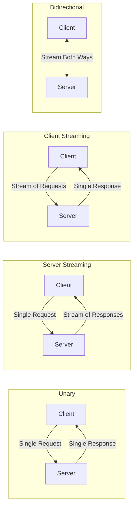
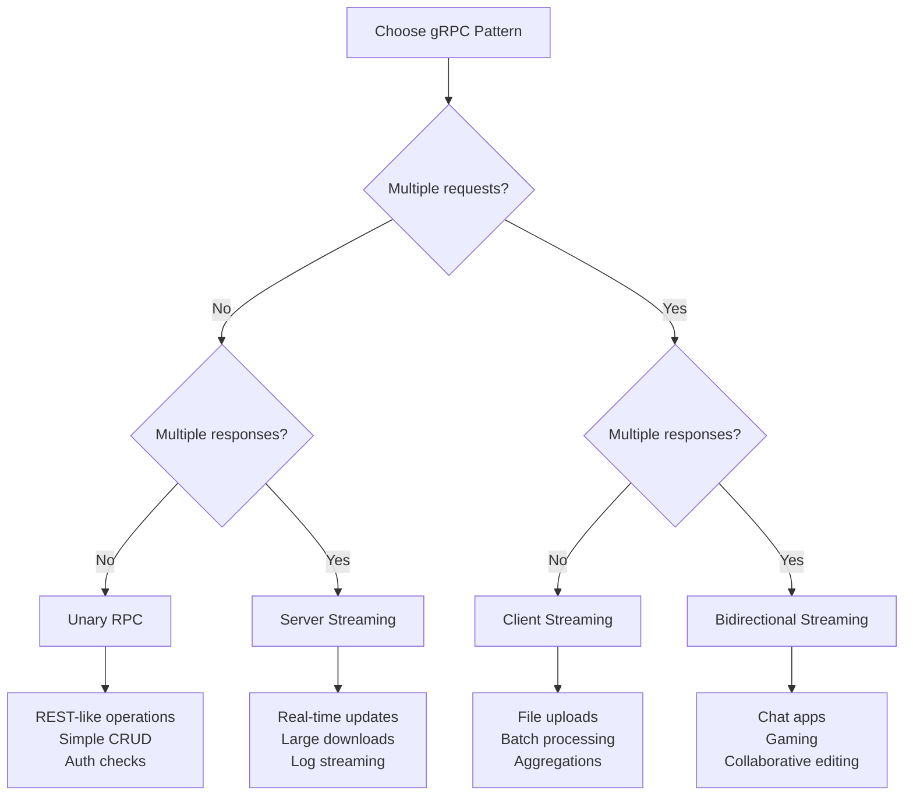

# How to Implement Unary, Server-Streaming, Client-Streaming, and Bidirectional gRPC Calls

Author: [nawazdhandala](https://www.github.com/nawazdhandala)

Tags: gRPC, streaming, protocol buffers, microservices, real-time, server-streaming, client-streaming, bidirectional

Description: A comprehensive guide to implementing all four gRPC communication patterns with practical examples, error handling, and flow control strategies.

---

gRPC provides four distinct communication patterns that enable developers to build efficient, scalable APIs. Understanding when and how to use each pattern is crucial for designing effective microservices architectures. This guide covers all four gRPC call types with practical implementations, error handling strategies, and flow control mechanisms.

## Understanding gRPC Communication Patterns

Before diving into implementation, let's understand the four communication patterns gRPC offers:



| Pattern | Request | Response | Use Case |
|---------|---------|----------|----------|
| Unary | Single | Single | Simple request-response operations |
| Server Streaming | Single | Multiple | Real-time updates, large data downloads |
| Client Streaming | Multiple | Single | File uploads, aggregation operations |
| Bidirectional | Multiple | Multiple | Chat, gaming, collaborative editing |

## Defining the Protocol Buffer Service

Let's create a comprehensive proto file that demonstrates all four patterns:

```protobuf
// streaming_service.proto
syntax = "proto3";

package streaming;

option go_package = "github.com/example/streaming";

// Data transfer service demonstrating all gRPC patterns
service DataService {
    // Unary RPC - Single request, single response
    rpc GetItem(GetItemRequest) returns (Item);

    // Server streaming - Single request, stream of responses
    rpc ListItems(ListItemsRequest) returns (stream Item);

    // Client streaming - Stream of requests, single response
    rpc UploadItems(stream Item) returns (UploadSummary);

    // Bidirectional streaming - Stream both ways
    rpc ProcessItems(stream ProcessRequest) returns (stream ProcessResponse);
}

message GetItemRequest {
    string id = 1;
}

message Item {
    string id = 1;
    string name = 2;
    string description = 3;
    int64 timestamp = 4;
    bytes data = 5;
}

message ListItemsRequest {
    string category = 1;
    int32 limit = 2;
    bool include_metadata = 3;
}

message UploadSummary {
    int32 total_items = 1;
    int32 successful = 2;
    int32 failed = 3;
    repeated string failed_ids = 4;
}

message ProcessRequest {
    string item_id = 1;
    string operation = 2;
    map<string, string> parameters = 3;
}

message ProcessResponse {
    string item_id = 1;
    bool success = 2;
    string result = 3;
    string error_message = 4;
}
```

## Pattern 1: Unary RPC

Unary is the simplest gRPC pattern - one request yields one response, similar to traditional REST APIs.

### When to Use Unary

- Simple CRUD operations
- Authentication and authorization checks
- Single data retrieval or mutation
- Operations that complete quickly

### Server Implementation (Go)

```go
// server/unary.go
package server

import (
    "context"
    "fmt"
    "time"

    pb "github.com/example/streaming"
    "google.golang.org/grpc/codes"
    "google.golang.org/grpc/status"
)

type DataServer struct {
    pb.UnimplementedDataServiceServer
    items map[string]*pb.Item
}

func NewDataServer() *DataServer {
    return &DataServer{
        items: make(map[string]*pb.Item),
    }
}

// GetItem implements unary RPC
func (s *DataServer) GetItem(ctx context.Context, req *pb.GetItemRequest) (*pb.Item, error) {
    // Validate request
    if req.Id == "" {
        return nil, status.Error(codes.InvalidArgument, "item ID is required")
    }

    // Check for cancellation
    if ctx.Err() == context.Canceled {
        return nil, status.Error(codes.Canceled, "request was canceled")
    }

    // Simulate database lookup
    item, exists := s.items[req.Id]
    if !exists {
        return nil, status.Errorf(codes.NotFound, "item %s not found", req.Id)
    }

    // Check deadline
    if deadline, ok := ctx.Deadline(); ok {
        if time.Now().After(deadline) {
            return nil, status.Error(codes.DeadlineExceeded, "deadline exceeded")
        }
    }

    return item, nil
}
```

### Client Implementation (Go)

```go
// client/unary.go
package client

import (
    "context"
    "log"
    "time"

    pb "github.com/example/streaming"
    "google.golang.org/grpc"
    "google.golang.org/grpc/codes"
    "google.golang.org/grpc/status"
)

func GetItem(client pb.DataServiceClient, itemID string) (*pb.Item, error) {
    // Create context with timeout
    ctx, cancel := context.WithTimeout(context.Background(), 5*time.Second)
    defer cancel()

    // Make the unary call
    item, err := client.GetItem(ctx, &pb.GetItemRequest{Id: itemID})
    if err != nil {
        // Handle specific error codes
        st, ok := status.FromError(err)
        if ok {
            switch st.Code() {
            case codes.NotFound:
                log.Printf("Item %s not found", itemID)
            case codes.InvalidArgument:
                log.Printf("Invalid argument: %s", st.Message())
            case codes.DeadlineExceeded:
                log.Printf("Request timed out")
            default:
                log.Printf("RPC error: %v", err)
            }
        }
        return nil, err
    }

    return item, nil
}

// Example with retry logic
func GetItemWithRetry(client pb.DataServiceClient, itemID string, maxRetries int) (*pb.Item, error) {
    var lastErr error

    for attempt := 0; attempt < maxRetries; attempt++ {
        item, err := GetItem(client, itemID)
        if err == nil {
            return item, nil
        }

        lastErr = err
        st, ok := status.FromError(err)
        if !ok {
            return nil, err
        }

        // Only retry on transient errors
        switch st.Code() {
        case codes.Unavailable, codes.DeadlineExceeded, codes.ResourceExhausted:
            backoff := time.Duration(attempt+1) * 100 * time.Millisecond
            log.Printf("Retrying in %v (attempt %d/%d)", backoff, attempt+1, maxRetries)
            time.Sleep(backoff)
        default:
            return nil, err
        }
    }

    return nil, lastErr
}
```

## Pattern 2: Server Streaming

Server streaming allows the server to send multiple responses for a single client request.

### When to Use Server Streaming

- Downloading large files in chunks
- Real-time price updates
- Log streaming
- Search results with progressive loading
- Notifications and alerts

### Server Implementation (Go)

```go
// server/server_streaming.go
package server

import (
    "fmt"
    "time"

    pb "github.com/example/streaming"
    "google.golang.org/grpc/codes"
    "google.golang.org/grpc/status"
)

// ListItems implements server streaming RPC
func (s *DataServer) ListItems(req *pb.ListItemsRequest, stream pb.DataService_ListItemsServer) error {
    // Validate request
    if req.Category == "" {
        return status.Error(codes.InvalidArgument, "category is required")
    }

    ctx := stream.Context()

    // Simulate fetching items from database
    items := s.getItemsByCategory(req.Category)

    limit := int(req.Limit)
    if limit <= 0 {
        limit = 100 // Default limit
    }

    count := 0
    for _, item := range items {
        // Check if client canceled the stream
        select {
        case <-ctx.Done():
            return status.Error(codes.Canceled, "client canceled the stream")
        default:
        }

        // Apply limit
        if count >= limit {
            break
        }

        // Send item to client
        if err := stream.Send(item); err != nil {
            return status.Errorf(codes.Internal, "failed to send item: %v", err)
        }

        count++

        // Simulate processing delay
        time.Sleep(10 * time.Millisecond)
    }

    // Stream automatically closes when function returns
    return nil
}

func (s *DataServer) getItemsByCategory(category string) []*pb.Item {
    var result []*pb.Item
    for _, item := range s.items {
        // Filter logic here
        result = append(result, item)
    }
    return result
}
```

### Client Implementation (Go)

```go
// client/server_streaming.go
package client

import (
    "context"
    "io"
    "log"
    "time"

    pb "github.com/example/streaming"
    "google.golang.org/grpc/codes"
    "google.golang.org/grpc/status"
)

func ListItems(client pb.DataServiceClient, category string, limit int32) ([]*pb.Item, error) {
    // Create context with timeout
    ctx, cancel := context.WithTimeout(context.Background(), 30*time.Second)
    defer cancel()

    // Initiate server streaming call
    stream, err := client.ListItems(ctx, &pb.ListItemsRequest{
        Category: category,
        Limit:    limit,
    })
    if err != nil {
        return nil, err
    }

    var items []*pb.Item

    // Receive items from stream
    for {
        item, err := stream.Recv()
        if err == io.EOF {
            // Stream completed successfully
            break
        }
        if err != nil {
            st, ok := status.FromError(err)
            if ok && st.Code() == codes.Canceled {
                log.Println("Stream was canceled")
                break
            }
            return items, err
        }

        items = append(items, item)
        log.Printf("Received item: %s", item.Name)
    }

    return items, nil
}

// Stream with callback for real-time processing
func ListItemsWithCallback(
    client pb.DataServiceClient,
    category string,
    onItem func(*pb.Item) error,
) error {
    ctx, cancel := context.WithCancel(context.Background())
    defer cancel()

    stream, err := client.ListItems(ctx, &pb.ListItemsRequest{
        Category: category,
        Limit:    0, // No limit
    })
    if err != nil {
        return err
    }

    for {
        item, err := stream.Recv()
        if err == io.EOF {
            return nil
        }
        if err != nil {
            return err
        }

        // Process item with callback
        if err := onItem(item); err != nil {
            // Cancel stream on callback error
            cancel()
            return err
        }
    }
}
```

### Flow Control in Server Streaming

```go
// server/flow_control.go
package server

import (
    "sync"
    "time"

    pb "github.com/example/streaming"
)

// RateLimitedListItems implements flow control
func (s *DataServer) RateLimitedListItems(
    req *pb.ListItemsRequest,
    stream pb.DataService_ListItemsServer,
) error {
    ctx := stream.Context()

    // Rate limiter: max 100 items per second
    ticker := time.NewTicker(10 * time.Millisecond)
    defer ticker.Stop()

    items := s.getItemsByCategory(req.Category)

    for _, item := range items {
        select {
        case <-ctx.Done():
            return ctx.Err()
        case <-ticker.C:
            if err := stream.Send(item); err != nil {
                return err
            }
        }
    }

    return nil
}

// BufferedListItems with backpressure handling
func (s *DataServer) BufferedListItems(
    req *pb.ListItemsRequest,
    stream pb.DataService_ListItemsServer,
) error {
    ctx := stream.Context()

    // Buffer for batch processing
    buffer := make(chan *pb.Item, 100)
    errChan := make(chan error, 1)
    var wg sync.WaitGroup

    // Producer goroutine
    wg.Add(1)
    go func() {
        defer wg.Done()
        defer close(buffer)

        items := s.getItemsByCategory(req.Category)
        for _, item := range items {
            select {
            case <-ctx.Done():
                return
            case buffer <- item:
            }
        }
    }()

    // Consumer goroutine
    wg.Add(1)
    go func() {
        defer wg.Done()

        for item := range buffer {
            if err := stream.Send(item); err != nil {
                select {
                case errChan <- err:
                default:
                }
                return
            }
        }
    }()

    // Wait for completion
    done := make(chan struct{})
    go func() {
        wg.Wait()
        close(done)
    }()

    select {
    case <-ctx.Done():
        return ctx.Err()
    case err := <-errChan:
        return err
    case <-done:
        return nil
    }
}
```

## Pattern 3: Client Streaming

Client streaming allows the client to send multiple requests before receiving a single response.

### When to Use Client Streaming

- File uploads in chunks
- Batch data ingestion
- Aggregation operations (sum, average, etc.)
- Telemetry and metrics collection

### Server Implementation (Go)

```go
// server/client_streaming.go
package server

import (
    "io"
    "log"

    pb "github.com/example/streaming"
    "google.golang.org/grpc/codes"
    "google.golang.org/grpc/status"
)

// UploadItems implements client streaming RPC
func (s *DataServer) UploadItems(stream pb.DataService_UploadItemsServer) error {
    var totalItems int32
    var successful int32
    var failed int32
    var failedIDs []string

    for {
        // Receive item from client
        item, err := stream.Recv()

        // Check for end of stream
        if err == io.EOF {
            // Send summary response
            return stream.SendAndClose(&pb.UploadSummary{
                TotalItems: totalItems,
                Successful: successful,
                Failed:     failed,
                FailedIds:  failedIDs,
            })
        }

        if err != nil {
            return status.Errorf(codes.Internal, "error receiving item: %v", err)
        }

        totalItems++

        // Validate and process item
        if err := s.validateItem(item); err != nil {
            failed++
            failedIDs = append(failedIDs, item.Id)
            log.Printf("Validation failed for item %s: %v", item.Id, err)
            continue
        }

        // Store item
        if err := s.storeItem(item); err != nil {
            failed++
            failedIDs = append(failedIDs, item.Id)
            log.Printf("Storage failed for item %s: %v", item.Id, err)
            continue
        }

        successful++
    }
}

func (s *DataServer) validateItem(item *pb.Item) error {
    if item.Id == "" {
        return status.Error(codes.InvalidArgument, "item ID is required")
    }
    if item.Name == "" {
        return status.Error(codes.InvalidArgument, "item name is required")
    }
    return nil
}

func (s *DataServer) storeItem(item *pb.Item) error {
    s.items[item.Id] = item
    return nil
}
```

### Client Implementation (Go)

```go
// client/client_streaming.go
package client

import (
    "context"
    "log"
    "time"

    pb "github.com/example/streaming"
    "google.golang.org/grpc"
)

func UploadItems(client pb.DataServiceClient, items []*pb.Item) (*pb.UploadSummary, error) {
    // Create context with timeout
    ctx, cancel := context.WithTimeout(context.Background(), 60*time.Second)
    defer cancel()

    // Initiate client streaming call
    stream, err := client.UploadItems(ctx)
    if err != nil {
        return nil, err
    }

    // Send items to server
    for _, item := range items {
        if err := stream.Send(item); err != nil {
            log.Printf("Failed to send item %s: %v", item.Id, err)
            // Get response even on error
            return stream.CloseAndRecv()
        }
        log.Printf("Sent item: %s", item.Id)
    }

    // Close stream and receive summary
    summary, err := stream.CloseAndRecv()
    if err != nil {
        return nil, err
    }

    return summary, nil
}

// Chunked file upload example
func UploadFile(client pb.DataServiceClient, fileID string, data []byte, chunkSize int) (*pb.UploadSummary, error) {
    ctx, cancel := context.WithTimeout(context.Background(), 5*time.Minute)
    defer cancel()

    stream, err := client.UploadItems(ctx)
    if err != nil {
        return nil, err
    }

    // Split data into chunks
    for i := 0; i < len(data); i += chunkSize {
        end := i + chunkSize
        if end > len(data) {
            end = len(data)
        }

        chunk := &pb.Item{
            Id:   fmt.Sprintf("%s-chunk-%d", fileID, i/chunkSize),
            Name: fileID,
            Data: data[i:end],
        }

        if err := stream.Send(chunk); err != nil {
            return stream.CloseAndRecv()
        }
    }

    return stream.CloseAndRecv()
}
```

## Pattern 4: Bidirectional Streaming

Bidirectional streaming allows both client and server to send streams of messages independently.

### When to Use Bidirectional Streaming

- Real-time chat applications
- Multiplayer gaming
- Collaborative editing
- Live dashboards with user interactions
- IoT device communication

### Server Implementation (Go)

```go
// server/bidirectional.go
package server

import (
    "io"
    "log"
    "sync"

    pb "github.com/example/streaming"
    "google.golang.org/grpc/codes"
    "google.golang.org/grpc/status"
)

// ProcessItems implements bidirectional streaming RPC
func (s *DataServer) ProcessItems(stream pb.DataService_ProcessItemsServer) error {
    ctx := stream.Context()

    // Use WaitGroup to coordinate send/receive
    var wg sync.WaitGroup
    errChan := make(chan error, 2)

    // Response queue
    responseChan := make(chan *pb.ProcessResponse, 100)

    // Receiver goroutine
    wg.Add(1)
    go func() {
        defer wg.Done()
        defer close(responseChan)

        for {
            select {
            case <-ctx.Done():
                return
            default:
            }

            req, err := stream.Recv()
            if err == io.EOF {
                return
            }
            if err != nil {
                errChan <- status.Errorf(codes.Internal, "receive error: %v", err)
                return
            }

            // Process request and queue response
            response := s.processRequest(req)

            select {
            case responseChan <- response:
            case <-ctx.Done():
                return
            }
        }
    }()

    // Sender goroutine
    wg.Add(1)
    go func() {
        defer wg.Done()

        for response := range responseChan {
            if err := stream.Send(response); err != nil {
                errChan <- status.Errorf(codes.Internal, "send error: %v", err)
                return
            }
        }
    }()

    // Wait for completion
    done := make(chan struct{})
    go func() {
        wg.Wait()
        close(done)
    }()

    select {
    case <-ctx.Done():
        return ctx.Err()
    case err := <-errChan:
        return err
    case <-done:
        return nil
    }
}

func (s *DataServer) processRequest(req *pb.ProcessRequest) *pb.ProcessResponse {
    response := &pb.ProcessResponse{
        ItemId: req.ItemId,
    }

    // Process based on operation type
    switch req.Operation {
    case "validate":
        item, exists := s.items[req.ItemId]
        if !exists {
            response.Success = false
            response.ErrorMessage = "item not found"
        } else {
            response.Success = true
            response.Result = "valid: " + item.Name
        }

    case "transform":
        item, exists := s.items[req.ItemId]
        if exists {
            // Apply transformation
            item.Name = req.Parameters["prefix"] + item.Name
            response.Success = true
            response.Result = "transformed"
        } else {
            response.Success = false
            response.ErrorMessage = "item not found"
        }

    case "delete":
        if _, exists := s.items[req.ItemId]; exists {
            delete(s.items, req.ItemId)
            response.Success = true
            response.Result = "deleted"
        } else {
            response.Success = false
            response.ErrorMessage = "item not found"
        }

    default:
        response.Success = false
        response.ErrorMessage = "unknown operation: " + req.Operation
    }

    return response
}
```

### Client Implementation (Go)

```go
// client/bidirectional.go
package client

import (
    "context"
    "io"
    "log"
    "sync"
    "time"

    pb "github.com/example/streaming"
)

type ProcessResult struct {
    ItemID  string
    Success bool
    Result  string
    Error   string
}

func ProcessItems(
    client pb.DataServiceClient,
    requests []*pb.ProcessRequest,
    onResult func(ProcessResult),
) error {
    ctx, cancel := context.WithTimeout(context.Background(), 5*time.Minute)
    defer cancel()

    // Initiate bidirectional stream
    stream, err := client.ProcessItems(ctx)
    if err != nil {
        return err
    }

    var wg sync.WaitGroup
    errChan := make(chan error, 2)

    // Sender goroutine
    wg.Add(1)
    go func() {
        defer wg.Done()

        for _, req := range requests {
            if err := stream.Send(req); err != nil {
                errChan <- err
                return
            }
            log.Printf("Sent request for item: %s", req.ItemId)
        }

        // Signal no more requests
        if err := stream.CloseSend(); err != nil {
            errChan <- err
        }
    }()

    // Receiver goroutine
    wg.Add(1)
    go func() {
        defer wg.Done()

        for {
            response, err := stream.Recv()
            if err == io.EOF {
                return
            }
            if err != nil {
                errChan <- err
                return
            }

            // Callback with result
            onResult(ProcessResult{
                ItemID:  response.ItemId,
                Success: response.Success,
                Result:  response.Result,
                Error:   response.ErrorMessage,
            })
        }
    }()

    // Wait for completion
    done := make(chan struct{})
    go func() {
        wg.Wait()
        close(done)
    }()

    select {
    case <-ctx.Done():
        return ctx.Err()
    case err := <-errChan:
        return err
    case <-done:
        return nil
    }
}

// Interactive bidirectional streaming
func InteractiveProcess(client pb.DataServiceClient) error {
    ctx, cancel := context.WithCancel(context.Background())
    defer cancel()

    stream, err := client.ProcessItems(ctx)
    if err != nil {
        return err
    }

    // Channel for user input
    inputChan := make(chan *pb.ProcessRequest)

    // Sender goroutine
    go func() {
        for req := range inputChan {
            if err := stream.Send(req); err != nil {
                log.Printf("Send error: %v", err)
                return
            }
        }
        stream.CloseSend()
    }()

    // Receiver goroutine
    go func() {
        for {
            response, err := stream.Recv()
            if err == io.EOF {
                return
            }
            if err != nil {
                log.Printf("Receive error: %v", err)
                return
            }
            log.Printf("Response for %s: %s", response.ItemId, response.Result)
        }
    }()

    // Simulate interactive input
    requests := []*pb.ProcessRequest{
        {ItemId: "item-1", Operation: "validate"},
        {ItemId: "item-2", Operation: "transform", Parameters: map[string]string{"prefix": "new-"}},
        {ItemId: "item-3", Operation: "delete"},
    }

    for _, req := range requests {
        inputChan <- req
        time.Sleep(500 * time.Millisecond)
    }
    close(inputChan)

    time.Sleep(time.Second) // Wait for responses
    return nil
}
```

## Error Handling Best Practices

### Comprehensive Error Handler

```go
// errors/handler.go
package errors

import (
    "context"
    "log"
    "time"

    "google.golang.org/grpc/codes"
    "google.golang.org/grpc/status"
)

type StreamError struct {
    Code    codes.Code
    Message string
    Retryable bool
}

func HandleStreamError(err error) *StreamError {
    if err == nil {
        return nil
    }

    st, ok := status.FromError(err)
    if !ok {
        return &StreamError{
            Code:      codes.Unknown,
            Message:   err.Error(),
            Retryable: false,
        }
    }

    streamErr := &StreamError{
        Code:    st.Code(),
        Message: st.Message(),
    }

    // Determine if error is retryable
    switch st.Code() {
    case codes.Unavailable, codes.ResourceExhausted, codes.Aborted:
        streamErr.Retryable = true
    case codes.DeadlineExceeded:
        streamErr.Retryable = true
    default:
        streamErr.Retryable = false
    }

    return streamErr
}

// RetryableStream wraps stream operations with retry logic
func RetryableStreamOperation(
    ctx context.Context,
    maxRetries int,
    operation func() error,
) error {
    var lastErr error

    for attempt := 0; attempt <= maxRetries; attempt++ {
        err := operation()
        if err == nil {
            return nil
        }

        lastErr = err
        streamErr := HandleStreamError(err)

        if !streamErr.Retryable {
            return err
        }

        if attempt < maxRetries {
            backoff := time.Duration(1<<uint(attempt)) * 100 * time.Millisecond
            log.Printf("Retry attempt %d/%d after %v", attempt+1, maxRetries, backoff)

            select {
            case <-ctx.Done():
                return ctx.Err()
            case <-time.After(backoff):
            }
        }
    }

    return lastErr
}
```

### Stream Recovery Pattern

```go
// recovery/stream_recovery.go
package recovery

import (
    "context"
    "io"
    "log"
    "sync"
    "time"

    pb "github.com/example/streaming"
    "google.golang.org/grpc"
)

type RecoverableStream struct {
    client     pb.DataServiceClient
    mu         sync.Mutex
    stream     pb.DataService_ProcessItemsClient
    ctx        context.Context
    cancel     context.CancelFunc
    lastItemID string
}

func NewRecoverableStream(client pb.DataServiceClient) *RecoverableStream {
    return &RecoverableStream{
        client: client,
    }
}

func (rs *RecoverableStream) Connect(parentCtx context.Context) error {
    rs.mu.Lock()
    defer rs.mu.Unlock()

    rs.ctx, rs.cancel = context.WithCancel(parentCtx)

    stream, err := rs.client.ProcessItems(rs.ctx)
    if err != nil {
        return err
    }

    rs.stream = stream
    return nil
}

func (rs *RecoverableStream) Send(req *pb.ProcessRequest) error {
    rs.mu.Lock()
    defer rs.mu.Unlock()

    err := rs.stream.Send(req)
    if err != nil {
        // Attempt reconnection
        if reconnectErr := rs.reconnect(); reconnectErr != nil {
            return reconnectErr
        }
        // Retry send
        return rs.stream.Send(req)
    }

    rs.lastItemID = req.ItemId
    return nil
}

func (rs *RecoverableStream) Recv() (*pb.ProcessResponse, error) {
    rs.mu.Lock()
    stream := rs.stream
    rs.mu.Unlock()

    response, err := stream.Recv()
    if err != nil && err != io.EOF {
        // Attempt reconnection
        rs.mu.Lock()
        if reconnectErr := rs.reconnect(); reconnectErr != nil {
            rs.mu.Unlock()
            return nil, reconnectErr
        }
        rs.mu.Unlock()
    }

    return response, err
}

func (rs *RecoverableStream) reconnect() error {
    log.Println("Attempting to reconnect stream...")

    // Close existing stream
    if rs.cancel != nil {
        rs.cancel()
    }

    // Exponential backoff for reconnection
    backoff := 100 * time.Millisecond
    maxBackoff := 30 * time.Second

    for {
        rs.ctx, rs.cancel = context.WithCancel(context.Background())
        stream, err := rs.client.ProcessItems(rs.ctx)
        if err == nil {
            rs.stream = stream
            log.Println("Successfully reconnected")
            return nil
        }

        log.Printf("Reconnection failed: %v, retrying in %v", err, backoff)
        time.Sleep(backoff)

        backoff *= 2
        if backoff > maxBackoff {
            backoff = maxBackoff
        }
    }
}

func (rs *RecoverableStream) Close() {
    rs.mu.Lock()
    defer rs.mu.Unlock()

    if rs.cancel != nil {
        rs.cancel()
    }
}
```

## Complete Working Example

### Main Server

```go
// cmd/server/main.go
package main

import (
    "log"
    "net"

    pb "github.com/example/streaming"
    "github.com/example/streaming/server"
    "google.golang.org/grpc"
    "google.golang.org/grpc/reflection"
)

func main() {
    lis, err := net.Listen("tcp", ":50051")
    if err != nil {
        log.Fatalf("Failed to listen: %v", err)
    }

    // Create gRPC server with options
    grpcServer := grpc.NewServer(
        grpc.MaxRecvMsgSize(10*1024*1024), // 10MB
        grpc.MaxSendMsgSize(10*1024*1024), // 10MB
    )

    // Register service
    dataServer := server.NewDataServer()
    pb.RegisterDataServiceServer(grpcServer, dataServer)

    // Enable reflection for debugging
    reflection.Register(grpcServer)

    log.Println("Server starting on :50051")
    if err := grpcServer.Serve(lis); err != nil {
        log.Fatalf("Failed to serve: %v", err)
    }
}
```

### Main Client

```go
// cmd/client/main.go
package main

import (
    "log"
    "time"

    pb "github.com/example/streaming"
    "github.com/example/streaming/client"
    "google.golang.org/grpc"
    "google.golang.org/grpc/credentials/insecure"
)

func main() {
    // Connect to server
    conn, err := grpc.Dial(
        "localhost:50051",
        grpc.WithTransportCredentials(insecure.NewCredentials()),
        grpc.WithBlock(),
        grpc.WithTimeout(5*time.Second),
    )
    if err != nil {
        log.Fatalf("Failed to connect: %v", err)
    }
    defer conn.Close()

    grpcClient := pb.NewDataServiceClient(conn)

    // Test unary
    log.Println("=== Testing Unary RPC ===")
    item, err := client.GetItem(grpcClient, "item-1")
    if err != nil {
        log.Printf("GetItem error: %v", err)
    } else {
        log.Printf("Got item: %+v", item)
    }

    // Test server streaming
    log.Println("\n=== Testing Server Streaming ===")
    items, err := client.ListItems(grpcClient, "electronics", 10)
    if err != nil {
        log.Printf("ListItems error: %v", err)
    } else {
        log.Printf("Received %d items", len(items))
    }

    // Test client streaming
    log.Println("\n=== Testing Client Streaming ===")
    uploadItems := []*pb.Item{
        {Id: "new-1", Name: "Item 1"},
        {Id: "new-2", Name: "Item 2"},
        {Id: "new-3", Name: "Item 3"},
    }
    summary, err := client.UploadItems(grpcClient, uploadItems)
    if err != nil {
        log.Printf("UploadItems error: %v", err)
    } else {
        log.Printf("Upload summary: %+v", summary)
    }

    // Test bidirectional streaming
    log.Println("\n=== Testing Bidirectional Streaming ===")
    requests := []*pb.ProcessRequest{
        {ItemId: "new-1", Operation: "validate"},
        {ItemId: "new-2", Operation: "transform", Parameters: map[string]string{"prefix": "modified-"}},
    }
    err = client.ProcessItems(grpcClient, requests, func(result client.ProcessResult) {
        log.Printf("Process result: %+v", result)
    })
    if err != nil {
        log.Printf("ProcessItems error: %v", err)
    }
}
```

## Summary and Decision Matrix

When choosing a gRPC streaming pattern, consider the following:



| Consideration | Unary | Server Streaming | Client Streaming | Bidirectional |
|---------------|-------|------------------|------------------|---------------|
| Complexity | Low | Medium | Medium | High |
| Latency | Higher per item | Lower per item | Lower per item | Lowest |
| Memory Usage | Predictable | Variable | Variable | Variable |
| Error Recovery | Simple | Moderate | Moderate | Complex |
| Use Cases | CRUD, Auth | Downloads, Updates | Uploads, Batch | Real-time |

By mastering these four gRPC patterns, you can design efficient APIs that match your specific communication needs while maintaining scalability and performance.
