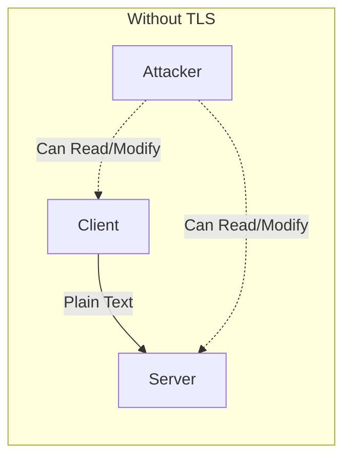
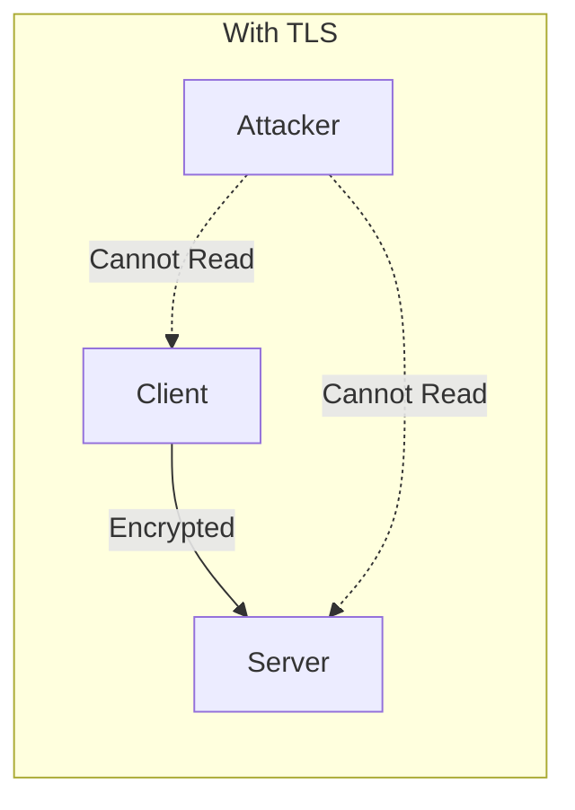
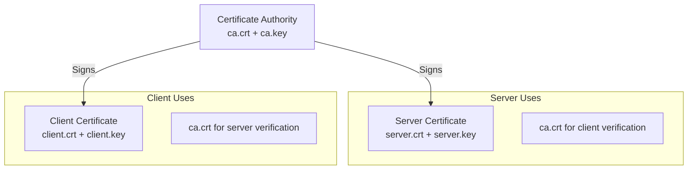

# How to Secure gRPC Services with TLS/SSL

Author: [nawazdhandala](https://www.github.com/nawazdhandala)

Tags: gRPC, TLS, SSL, Security, Certificates, Encryption, HTTPS

Description: A comprehensive guide to securing gRPC services with TLS/SSL encryption, including certificate generation, server configuration, and client setup.

---

## Introduction

Transport Layer Security (TLS) is essential for securing gRPC communications in production environments. Unlike REST APIs that can operate over plain HTTP, gRPC strongly encourages TLS encryption to protect data in transit. This guide covers everything you need to know about implementing TLS/SSL security for your gRPC services.

## Why TLS for gRPC?





TLS provides three critical security guarantees:

1. **Confidentiality**: Data is encrypted and cannot be read by eavesdroppers
2. **Integrity**: Data cannot be modified in transit without detection
3. **Authentication**: The server (and optionally client) identity is verified

## Generating TLS Certificates

### Using OpenSSL for Development

First, let's create a Certificate Authority (CA) and server certificates for development:

```bash
#!/bin/bash
# generate-certs.sh

# Create directories
mkdir -p certs
cd certs

# Generate CA private key
openssl genrsa -out ca.key 4096

# Generate CA certificate
openssl req -new -x509 -days 365 -key ca.key -out ca.crt \
    -subj "/C=US/ST=California/L=San Francisco/O=MyOrg/CN=MyCA"

# Generate server private key
openssl genrsa -out server.key 4096

# Create server certificate signing request (CSR)
openssl req -new -key server.key -out server.csr \
    -subj "/C=US/ST=California/L=San Francisco/O=MyOrg/CN=localhost"

# Create server certificate extension file
cat > server.ext << EOF
authorityKeyIdentifier=keyid,issuer
basicConstraints=CA:FALSE
keyUsage = digitalSignature, nonRepudiation, keyEncipherment, dataEncipherment
subjectAltName = @alt_names

[alt_names]
DNS.1 = localhost
DNS.2 = *.example.com
IP.1 = 127.0.0.1
IP.2 = 0.0.0.0
EOF

# Sign server certificate with CA
openssl x509 -req -in server.csr -CA ca.crt -CAkey ca.key \
    -CAcreateserial -out server.crt -days 365 \
    -extfile server.ext

# Verify certificate
openssl verify -CAfile ca.crt server.crt

echo "Certificates generated successfully!"
```

### Certificate Structure Overview



## Server-Side TLS Configuration

### Go Server with TLS

```go
package main

import (
    "crypto/tls"
    "crypto/x509"
    "fmt"
    "io/ioutil"
    "log"
    "net"

    "google.golang.org/grpc"
    "google.golang.org/grpc/credentials"

    pb "your-module/proto"
)

// GreeterServer implements the Greeter service
type GreeterServer struct {
    pb.UnimplementedGreeterServer
}

func (s *GreeterServer) SayHello(ctx context.Context, req *pb.HelloRequest) (*pb.HelloReply, error) {
    return &pb.HelloReply{Message: "Hello " + req.Name}, nil
}

func loadTLSCredentials() (credentials.TransportCredentials, error) {
    // Load server certificate and private key
    serverCert, err := tls.LoadX509KeyPair("certs/server.crt", "certs/server.key")
    if err != nil {
        return nil, fmt.Errorf("failed to load server certificate: %v", err)
    }

    // Create TLS configuration
    config := &tls.Config{
        Certificates: []tls.Certificate{serverCert},
        ClientAuth:   tls.NoClientCert, // Use tls.RequireAndVerifyClientCert for mTLS
        MinVersion:   tls.VersionTLS12,
        CipherSuites: []uint16{
            tls.TLS_ECDHE_RSA_WITH_AES_256_GCM_SHA384,
            tls.TLS_ECDHE_RSA_WITH_AES_128_GCM_SHA256,
            tls.TLS_ECDHE_ECDSA_WITH_AES_256_GCM_SHA384,
            tls.TLS_ECDHE_ECDSA_WITH_AES_128_GCM_SHA256,
        },
    }

    return credentials.NewTLS(config), nil
}

func main() {
    // Load TLS credentials
    tlsCredentials, err := loadTLSCredentials()
    if err != nil {
        log.Fatalf("Failed to load TLS credentials: %v", err)
    }

    // Create gRPC server with TLS
    server := grpc.NewServer(
        grpc.Creds(tlsCredentials),
    )

    // Register service
    pb.RegisterGreeterServer(server, &GreeterServer{})

    // Start listening
    listener, err := net.Listen("tcp", ":50051")
    if err != nil {
        log.Fatalf("Failed to listen: %v", err)
    }

    log.Println("gRPC server listening on :50051 with TLS")
    if err := server.Serve(listener); err != nil {
        log.Fatalf("Failed to serve: %v", err)
    }
}
```

### Python Server with TLS

```python
import grpc
from concurrent import futures
import greeter_pb2
import greeter_pb2_grpc

class GreeterServicer(greeter_pb2_grpc.GreeterServicer):
    def SayHello(self, request, context):
        return greeter_pb2.HelloReply(message=f"Hello {request.name}")

def load_credentials():
    """Load TLS credentials for the server."""
    with open('certs/server.key', 'rb') as f:
        private_key = f.read()
    with open('certs/server.crt', 'rb') as f:
        certificate_chain = f.read()

    server_credentials = grpc.ssl_server_credentials(
        [(private_key, certificate_chain)],
        root_certificates=None,  # Set for mTLS
        require_client_auth=False  # Set True for mTLS
    )
    return server_credentials

def serve():
    server = grpc.server(futures.ThreadPoolExecutor(max_workers=10))
    greeter_pb2_grpc.add_GreeterServicer_to_server(GreeterServicer(), server)

    # Load TLS credentials
    credentials = load_credentials()

    # Add secure port
    server.add_secure_port('[::]:50051', credentials)

    print("gRPC server listening on :50051 with TLS")
    server.start()
    server.wait_for_termination()

if __name__ == '__main__':
    serve()
```

### Node.js Server with TLS

```javascript
const grpc = require('@grpc/grpc-js');
const protoLoader = require('@grpc/proto-loader');
const fs = require('fs');
const path = require('path');

// Load proto file
const PROTO_PATH = path.join(__dirname, 'greeter.proto');
const packageDefinition = protoLoader.loadSync(PROTO_PATH);
const greeterProto = grpc.loadPackageDefinition(packageDefinition).greeter;

// Implement service
function sayHello(call, callback) {
    callback(null, { message: `Hello ${call.request.name}` });
}

// Load TLS credentials
function loadTLSCredentials() {
    const serverCert = fs.readFileSync('certs/server.crt');
    const serverKey = fs.readFileSync('certs/server.key');

    return grpc.ServerCredentials.createSsl(
        null, // CA certificate for client verification (mTLS)
        [{
            cert_chain: serverCert,
            private_key: serverKey
        }],
        false // checkClientCertificate - set true for mTLS
    );
}

function main() {
    const server = new grpc.Server();

    server.addService(greeterProto.Greeter.service, {
        sayHello: sayHello
    });

    const credentials = loadTLSCredentials();

    server.bindAsync('0.0.0.0:50051', credentials, (err, port) => {
        if (err) {
            console.error('Failed to bind server:', err);
            return;
        }
        console.log(`gRPC server listening on :${port} with TLS`);
        server.start();
    });
}

main();
```

## Client-Side TLS Configuration

### Go Client with TLS

```go
package main

import (
    "context"
    "crypto/tls"
    "crypto/x509"
    "fmt"
    "io/ioutil"
    "log"
    "time"

    "google.golang.org/grpc"
    "google.golang.org/grpc/credentials"

    pb "your-module/proto"
)

func loadTLSCredentials() (credentials.TransportCredentials, error) {
    // Load CA certificate
    caCert, err := ioutil.ReadFile("certs/ca.crt")
    if err != nil {
        return nil, fmt.Errorf("failed to read CA certificate: %v", err)
    }

    // Create certificate pool and add CA certificate
    certPool := x509.NewCertPool()
    if !certPool.AppendCertsFromPEM(caCert) {
        return nil, fmt.Errorf("failed to add CA certificate to pool")
    }

    // Create TLS configuration
    config := &tls.Config{
        RootCAs:    certPool,
        MinVersion: tls.VersionTLS12,
    }

    return credentials.NewTLS(config), nil
}

func main() {
    // Load TLS credentials
    tlsCredentials, err := loadTLSCredentials()
    if err != nil {
        log.Fatalf("Failed to load TLS credentials: %v", err)
    }

    // Connect to server with TLS
    conn, err := grpc.Dial(
        "localhost:50051",
        grpc.WithTransportCredentials(tlsCredentials),
    )
    if err != nil {
        log.Fatalf("Failed to connect: %v", err)
    }
    defer conn.Close()

    // Create client
    client := pb.NewGreeterClient(conn)

    // Make RPC call
    ctx, cancel := context.WithTimeout(context.Background(), 5*time.Second)
    defer cancel()

    response, err := client.SayHello(ctx, &pb.HelloRequest{Name: "World"})
    if err != nil {
        log.Fatalf("Failed to call SayHello: %v", err)
    }

    log.Printf("Response: %s", response.Message)
}
```

### Python Client with TLS

```python
import grpc
import greeter_pb2
import greeter_pb2_grpc

def load_credentials():
    """Load TLS credentials for the client."""
    with open('certs/ca.crt', 'rb') as f:
        trusted_certs = f.read()

    credentials = grpc.ssl_channel_credentials(
        root_certificates=trusted_certs,
        private_key=None,  # Set for mTLS
        certificate_chain=None  # Set for mTLS
    )
    return credentials

def main():
    # Load TLS credentials
    credentials = load_credentials()

    # Create secure channel
    channel = grpc.secure_channel('localhost:50051', credentials)

    # Create stub
    stub = greeter_pb2_grpc.GreeterStub(channel)

    # Make RPC call
    response = stub.SayHello(greeter_pb2.HelloRequest(name='World'))
    print(f"Response: {response.message}")

if __name__ == '__main__':
    main()
```

### Node.js Client with TLS

```javascript
const grpc = require('@grpc/grpc-js');
const protoLoader = require('@grpc/proto-loader');
const fs = require('fs');
const path = require('path');

// Load proto file
const PROTO_PATH = path.join(__dirname, 'greeter.proto');
const packageDefinition = protoLoader.loadSync(PROTO_PATH);
const greeterProto = grpc.loadPackageDefinition(packageDefinition).greeter;

// Load TLS credentials
function loadTLSCredentials() {
    const rootCert = fs.readFileSync('certs/ca.crt');

    return grpc.credentials.createSsl(
        rootCert,
        null,  // Client private key for mTLS
        null   // Client certificate for mTLS
    );
}

async function main() {
    const credentials = loadTLSCredentials();

    const client = new greeterProto.Greeter(
        'localhost:50051',
        credentials
    );

    // Make RPC call
    client.sayHello({ name: 'World' }, (err, response) => {
        if (err) {
            console.error('Error:', err);
            return;
        }
        console.log('Response:', response.message);
    });
}

main();
```

## Certificate Validation and Security Best Practices

### Custom Certificate Verification in Go

```go
package main

import (
    "crypto/tls"
    "crypto/x509"
    "fmt"
    "time"
)

func createTLSConfigWithCustomVerification() *tls.Config {
    return &tls.Config{
        MinVersion: tls.VersionTLS12,

        // Custom verification function
        VerifyPeerCertificate: func(rawCerts [][]byte, verifiedChains [][]*x509.Certificate) error {
            if len(verifiedChains) == 0 || len(verifiedChains[0]) == 0 {
                return fmt.Errorf("no verified certificate chains")
            }

            cert := verifiedChains[0][0]

            // Check certificate expiration with buffer
            expirationBuffer := 7 * 24 * time.Hour // 7 days
            if time.Until(cert.NotAfter) < expirationBuffer {
                fmt.Printf("WARNING: Certificate expires soon: %v\n", cert.NotAfter)
            }

            // Verify specific certificate attributes
            if cert.Subject.Organization == nil ||
               cert.Subject.Organization[0] != "MyOrg" {
                return fmt.Errorf("invalid certificate organization")
            }

            // Check key usage
            if cert.KeyUsage&x509.KeyUsageDigitalSignature == 0 {
                return fmt.Errorf("certificate missing digital signature key usage")
            }

            return nil
        },
    }
}
```

### Certificate Pinning

```go
package main

import (
    "crypto/sha256"
    "crypto/tls"
    "crypto/x509"
    "encoding/hex"
    "fmt"
)

// Known certificate fingerprints
var trustedFingerprints = map[string]bool{
    "a1b2c3d4e5f6...": true, // Production server
    "f6e5d4c3b2a1...": true, // Staging server
}

func createPinnedTLSConfig(certPool *x509.CertPool) *tls.Config {
    return &tls.Config{
        RootCAs:    certPool,
        MinVersion: tls.VersionTLS12,

        VerifyPeerCertificate: func(rawCerts [][]byte, verifiedChains [][]*x509.Certificate) error {
            if len(rawCerts) == 0 {
                return fmt.Errorf("no certificates provided")
            }

            // Calculate fingerprint of the leaf certificate
            fingerprint := sha256.Sum256(rawCerts[0])
            fingerprintHex := hex.EncodeToString(fingerprint[:])

            // Check against pinned fingerprints
            if !trustedFingerprints[fingerprintHex] {
                return fmt.Errorf("certificate fingerprint not trusted: %s", fingerprintHex)
            }

            return nil
        },
    }
}
```

## TLS Configuration for Production

### Recommended TLS Settings

```go
package main

import (
    "crypto/tls"
)

func productionTLSConfig() *tls.Config {
    return &tls.Config{
        // Minimum TLS version
        MinVersion: tls.VersionTLS12,

        // Preferred cipher suites (in order of preference)
        CipherSuites: []uint16{
            // TLS 1.3 cipher suites (automatically used when TLS 1.3 is negotiated)
            tls.TLS_AES_256_GCM_SHA384,
            tls.TLS_AES_128_GCM_SHA256,
            tls.TLS_CHACHA20_POLY1305_SHA256,

            // TLS 1.2 cipher suites
            tls.TLS_ECDHE_RSA_WITH_AES_256_GCM_SHA384,
            tls.TLS_ECDHE_RSA_WITH_AES_128_GCM_SHA256,
            tls.TLS_ECDHE_ECDSA_WITH_AES_256_GCM_SHA384,
            tls.TLS_ECDHE_ECDSA_WITH_AES_128_GCM_SHA256,
        },

        // Prefer server cipher suites
        PreferServerCipherSuites: true,

        // Curve preferences for ECDHE
        CurvePreferences: []tls.CurveID{
            tls.X25519,
            tls.CurveP384,
            tls.CurveP256,
        },

        // Session tickets for performance
        SessionTicketsDisabled: false,

        // Renegotiation (disable for security)
        Renegotiation: tls.RenegotiateNever,
    }
}
```

### Dynamic Certificate Reloading

```go
package main

import (
    "crypto/tls"
    "log"
    "sync"
    "time"
)

type CertificateManager struct {
    certPath string
    keyPath  string
    cert     *tls.Certificate
    mu       sync.RWMutex
}

func NewCertificateManager(certPath, keyPath string) (*CertificateManager, error) {
    cm := &CertificateManager{
        certPath: certPath,
        keyPath:  keyPath,
    }

    if err := cm.loadCertificate(); err != nil {
        return nil, err
    }

    // Start background reload goroutine
    go cm.watchCertificates()

    return cm, nil
}

func (cm *CertificateManager) loadCertificate() error {
    cert, err := tls.LoadX509KeyPair(cm.certPath, cm.keyPath)
    if err != nil {
        return err
    }

    cm.mu.Lock()
    cm.cert = &cert
    cm.mu.Unlock()

    log.Println("Certificate loaded successfully")
    return nil
}

func (cm *CertificateManager) GetCertificate(*tls.ClientHelloInfo) (*tls.Certificate, error) {
    cm.mu.RLock()
    defer cm.mu.RUnlock()
    return cm.cert, nil
}

func (cm *CertificateManager) watchCertificates() {
    ticker := time.NewTicker(1 * time.Hour)
    defer ticker.Stop()

    for range ticker.C {
        if err := cm.loadCertificate(); err != nil {
            log.Printf("Failed to reload certificate: %v", err)
        }
    }
}

func (cm *CertificateManager) GetTLSConfig() *tls.Config {
    return &tls.Config{
        GetCertificate: cm.GetCertificate,
        MinVersion:     tls.VersionTLS12,
    }
}
```

## Using Let's Encrypt Certificates

### Automatic Certificate Management with autocert

```go
package main

import (
    "crypto/tls"
    "log"
    "net"

    "golang.org/x/crypto/acme/autocert"
    "google.golang.org/grpc"
    "google.golang.org/grpc/credentials"
)

func main() {
    // Create autocert manager
    certManager := autocert.Manager{
        Prompt:     autocert.AcceptTOS,
        HostPolicy: autocert.HostWhitelist("grpc.example.com"),
        Cache:      autocert.DirCache("certs-cache"),
    }

    // Create TLS config with autocert
    tlsConfig := &tls.Config{
        GetCertificate: certManager.GetCertificate,
        MinVersion:     tls.VersionTLS12,
        NextProtos:     []string{"h2"}, // HTTP/2 for gRPC
    }

    // Create gRPC server with TLS credentials
    creds := credentials.NewTLS(tlsConfig)
    server := grpc.NewServer(grpc.Creds(creds))

    // Register your services here
    // pb.RegisterYourServiceServer(server, &YourService{})

    listener, err := net.Listen("tcp", ":443")
    if err != nil {
        log.Fatalf("Failed to listen: %v", err)
    }

    log.Println("gRPC server with Let's Encrypt TLS listening on :443")
    if err := server.Serve(listener); err != nil {
        log.Fatalf("Failed to serve: %v", err)
    }
}
```

## TLS Debugging and Troubleshooting

### Enable TLS Debug Logging

```go
package main

import (
    "crypto/tls"
    "log"
)

func createDebugTLSConfig() *tls.Config {
    return &tls.Config{
        MinVersion: tls.VersionTLS12,

        // Key log writer for debugging with Wireshark
        // WARNING: Only use in development!
        KeyLogWriter: nil, // Set to a file writer to capture keys

        VerifyConnection: func(cs tls.ConnectionState) error {
            log.Printf("TLS Version: %x", cs.Version)
            log.Printf("Cipher Suite: %s", tls.CipherSuiteName(cs.CipherSuite))
            log.Printf("Server Name: %s", cs.ServerName)
            log.Printf("Negotiated Protocol: %s", cs.NegotiatedProtocol)

            for i, cert := range cs.PeerCertificates {
                log.Printf("Peer Certificate %d:", i)
                log.Printf("  Subject: %s", cert.Subject)
                log.Printf("  Issuer: %s", cert.Issuer)
                log.Printf("  Valid: %v - %v", cert.NotBefore, cert.NotAfter)
            }

            return nil
        },
    }
}
```

### Common TLS Errors and Solutions

```go
package main

import (
    "crypto/tls"
    "crypto/x509"
    "fmt"
    "strings"
)

func diagnoseTLSError(err error) string {
    if err == nil {
        return "No error"
    }

    errStr := err.Error()

    switch {
    case strings.Contains(errStr, "certificate signed by unknown authority"):
        return `
Problem: The server's certificate is not trusted by the client.
Solutions:
1. Add the CA certificate to the client's trust store
2. Use the correct CA certificate file
3. For development, ensure you're using the same CA that signed the server cert
`

    case strings.Contains(errStr, "certificate has expired"):
        return `
Problem: The server's certificate has expired.
Solutions:
1. Renew the server certificate
2. Check system time on both client and server
3. Generate new certificates with longer validity
`

    case strings.Contains(errStr, "certificate is not valid for"):
        return `
Problem: The certificate's Common Name or SAN doesn't match the hostname.
Solutions:
1. Regenerate the certificate with the correct hostname in SAN
2. Use the correct hostname when connecting
3. Add all required hostnames to the certificate's SAN extension
`

    case strings.Contains(errStr, "bad certificate"):
        return `
Problem: The certificate format is invalid or corrupted.
Solutions:
1. Verify the certificate file is in PEM format
2. Check for any corruption in the certificate file
3. Regenerate the certificate
`

    case strings.Contains(errStr, "handshake failure"):
        return `
Problem: TLS handshake failed, possibly due to cipher suite mismatch.
Solutions:
1. Ensure both client and server support common cipher suites
2. Check TLS version compatibility
3. Verify the certificate and key match
`

    default:
        return fmt.Sprintf("Unknown TLS error: %s", errStr)
    }
}
```

## Testing TLS Configuration

### Unit Tests for TLS

```go
package main

import (
    "context"
    "crypto/tls"
    "crypto/x509"
    "io/ioutil"
    "net"
    "testing"
    "time"

    "google.golang.org/grpc"
    "google.golang.org/grpc/credentials"

    pb "your-module/proto"
)

func TestTLSConnection(t *testing.T) {
    // Load server credentials
    serverCert, err := tls.LoadX509KeyPair("testdata/server.crt", "testdata/server.key")
    if err != nil {
        t.Fatalf("Failed to load server credentials: %v", err)
    }

    serverConfig := &tls.Config{
        Certificates: []tls.Certificate{serverCert},
        MinVersion:   tls.VersionTLS12,
    }

    // Create server
    listener, err := net.Listen("tcp", "localhost:0")
    if err != nil {
        t.Fatalf("Failed to listen: %v", err)
    }
    defer listener.Close()

    server := grpc.NewServer(grpc.Creds(credentials.NewTLS(serverConfig)))
    pb.RegisterGreeterServer(server, &GreeterServer{})

    go server.Serve(listener)
    defer server.Stop()

    // Load client credentials
    caCert, err := ioutil.ReadFile("testdata/ca.crt")
    if err != nil {
        t.Fatalf("Failed to read CA cert: %v", err)
    }

    certPool := x509.NewCertPool()
    certPool.AppendCertsFromPEM(caCert)

    clientConfig := &tls.Config{
        RootCAs:    certPool,
        MinVersion: tls.VersionTLS12,
    }

    // Connect client
    conn, err := grpc.Dial(
        listener.Addr().String(),
        grpc.WithTransportCredentials(credentials.NewTLS(clientConfig)),
    )
    if err != nil {
        t.Fatalf("Failed to connect: %v", err)
    }
    defer conn.Close()

    // Make RPC call
    client := pb.NewGreeterClient(conn)
    ctx, cancel := context.WithTimeout(context.Background(), 5*time.Second)
    defer cancel()

    resp, err := client.SayHello(ctx, &pb.HelloRequest{Name: "Test"})
    if err != nil {
        t.Fatalf("RPC failed: %v", err)
    }

    if resp.Message != "Hello Test" {
        t.Errorf("Unexpected response: %s", resp.Message)
    }
}

func TestTLSVersionNegotiation(t *testing.T) {
    testCases := []struct {
        name           string
        clientMinVer   uint16
        serverMinVer   uint16
        expectedToFail bool
    }{
        {"TLS 1.2 to TLS 1.2", tls.VersionTLS12, tls.VersionTLS12, false},
        {"TLS 1.3 to TLS 1.2", tls.VersionTLS13, tls.VersionTLS12, false},
        {"TLS 1.2 to TLS 1.3", tls.VersionTLS12, tls.VersionTLS13, true},
    }

    for _, tc := range testCases {
        t.Run(tc.name, func(t *testing.T) {
            // Test implementation here
        })
    }
}
```

## Summary

Implementing TLS/SSL for gRPC services is crucial for production deployments. Key takeaways:

1. **Always use TLS in production** - Never deploy gRPC services without encryption
2. **Use proper certificate management** - Implement certificate rotation and monitoring
3. **Configure strong cipher suites** - Use modern, secure cipher suites and TLS 1.2+
4. **Implement certificate validation** - Verify certificates properly on both client and server
5. **Consider certificate pinning** - For high-security applications, pin expected certificates
6. **Monitor certificate expiration** - Set up alerts before certificates expire
7. **Test thoroughly** - Include TLS configuration in your test suite

For even stronger security, consider implementing mutual TLS (mTLS), which is covered in a separate guide.
