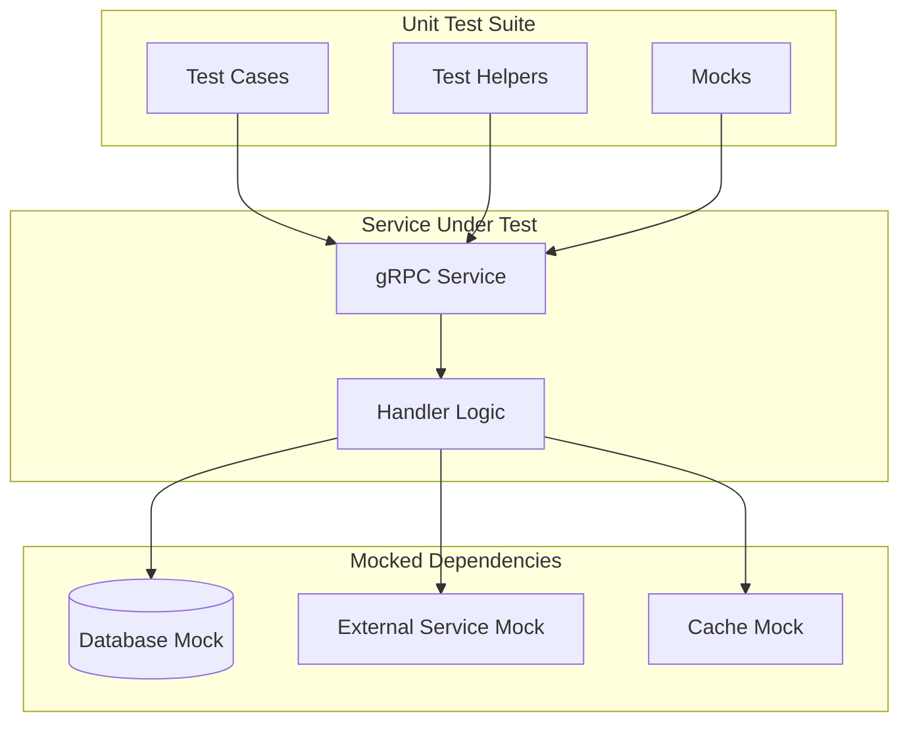
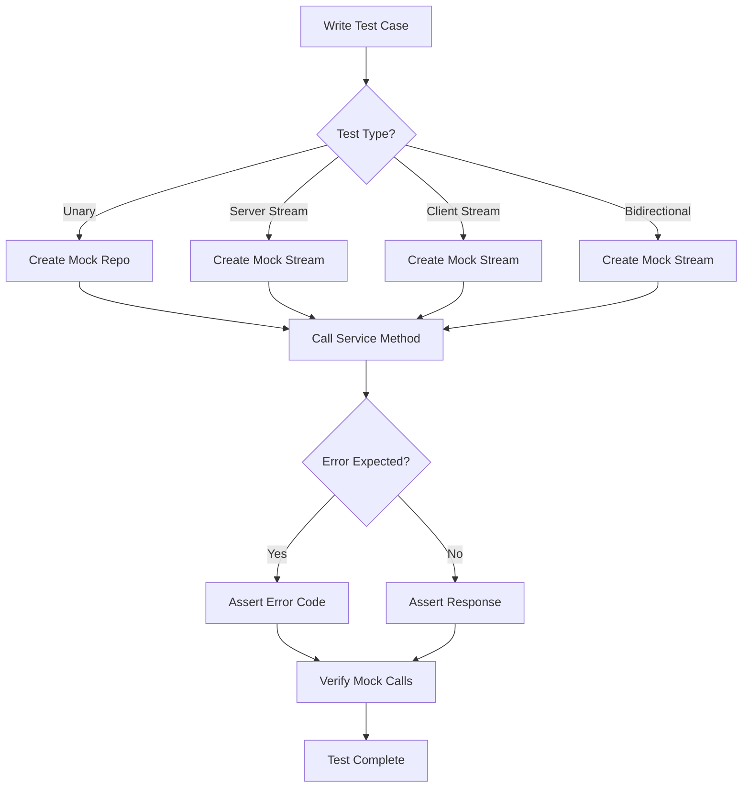

# How to Unit Test gRPC Services

Author: [nawazdhandala](https://www.github.com/nawazdhandala)

Tags: gRPC, testing, unit-testing, golang, mocking, TDD

Description: Learn how to write comprehensive unit tests for gRPC services including test setup, mocking dependencies, testing all RPC types, and table-driven tests.

---

Unit testing gRPC services is essential for ensuring your microservices behave correctly. This guide covers everything you need to know about writing effective unit tests for gRPC services in Go, from basic setup to advanced testing patterns.

## Understanding gRPC Testing Architecture

Before diving into code, let's understand the testing architecture for gRPC services.



## Setting Up the Test Environment

### Project Structure

```
myservice/
├── proto/
│   └── user.proto
├── pb/
│   └── user.pb.go
│   └── user_grpc.pb.go
├── server/
│   ├── server.go
│   └── server_test.go
├── repository/
│   ├── user_repository.go
│   └── mock_user_repository.go
└── go.mod
```

### Sample Proto Definition

```protobuf
// proto/user.proto
syntax = "proto3";

package user;

option go_package = "github.com/example/myservice/pb";

service UserService {
  // Unary RPC
  rpc GetUser(GetUserRequest) returns (GetUserResponse);
  rpc CreateUser(CreateUserRequest) returns (CreateUserResponse);

  // Server streaming RPC
  rpc ListUsers(ListUsersRequest) returns (stream User);

  // Client streaming RPC
  rpc BatchCreateUsers(stream CreateUserRequest) returns (BatchCreateResponse);

  // Bidirectional streaming RPC
  rpc SyncUsers(stream SyncRequest) returns (stream SyncResponse);
}

message User {
  string id = 1;
  string name = 2;
  string email = 3;
  int64 created_at = 4;
}

message GetUserRequest {
  string id = 1;
}

message GetUserResponse {
  User user = 1;
}

message CreateUserRequest {
  string name = 1;
  string email = 2;
}

message CreateUserResponse {
  User user = 1;
}

message ListUsersRequest {
  int32 page_size = 1;
  string page_token = 2;
}

message BatchCreateResponse {
  int32 created_count = 1;
  repeated string user_ids = 2;
}

message SyncRequest {
  string user_id = 1;
  string action = 2;
}

message SyncResponse {
  string user_id = 1;
  string status = 2;
}
```

### Service Implementation

```go
// server/server.go
package server

import (
    "context"
    "io"
    "time"

    "github.com/example/myservice/pb"
    "github.com/example/myservice/repository"
    "github.com/google/uuid"
    "google.golang.org/grpc/codes"
    "google.golang.org/grpc/status"
)

// UserRepository defines the interface for user data operations
type UserRepository interface {
    GetByID(ctx context.Context, id string) (*repository.User, error)
    Create(ctx context.Context, user *repository.User) error
    List(ctx context.Context, pageSize int, pageToken string) ([]*repository.User, string, error)
    BatchCreate(ctx context.Context, users []*repository.User) ([]string, error)
}

// UserServiceServer implements the gRPC UserService
type UserServiceServer struct {
    pb.UnimplementedUserServiceServer
    repo UserRepository
}

// NewUserServiceServer creates a new UserServiceServer
func NewUserServiceServer(repo UserRepository) *UserServiceServer {
    return &UserServiceServer{repo: repo}
}

// GetUser retrieves a user by ID
func (s *UserServiceServer) GetUser(ctx context.Context, req *pb.GetUserRequest) (*pb.GetUserResponse, error) {
    if req.GetId() == "" {
        return nil, status.Error(codes.InvalidArgument, "user id is required")
    }

    user, err := s.repo.GetByID(ctx, req.GetId())
    if err != nil {
        if err == repository.ErrNotFound {
            return nil, status.Error(codes.NotFound, "user not found")
        }
        return nil, status.Error(codes.Internal, "failed to get user")
    }

    return &pb.GetUserResponse{
        User: &pb.User{
            Id:        user.ID,
            Name:      user.Name,
            Email:     user.Email,
            CreatedAt: user.CreatedAt.Unix(),
        },
    }, nil
}

// CreateUser creates a new user
func (s *UserServiceServer) CreateUser(ctx context.Context, req *pb.CreateUserRequest) (*pb.CreateUserResponse, error) {
    if req.GetName() == "" {
        return nil, status.Error(codes.InvalidArgument, "name is required")
    }
    if req.GetEmail() == "" {
        return nil, status.Error(codes.InvalidArgument, "email is required")
    }

    user := &repository.User{
        ID:        uuid.New().String(),
        Name:      req.GetName(),
        Email:     req.GetEmail(),
        CreatedAt: time.Now(),
    }

    if err := s.repo.Create(ctx, user); err != nil {
        if err == repository.ErrDuplicate {
            return nil, status.Error(codes.AlreadyExists, "user with this email already exists")
        }
        return nil, status.Error(codes.Internal, "failed to create user")
    }

    return &pb.CreateUserResponse{
        User: &pb.User{
            Id:        user.ID,
            Name:      user.Name,
            Email:     user.Email,
            CreatedAt: user.CreatedAt.Unix(),
        },
    }, nil
}

// ListUsers streams users to the client
func (s *UserServiceServer) ListUsers(req *pb.ListUsersRequest, stream pb.UserService_ListUsersServer) error {
    pageSize := int(req.GetPageSize())
    if pageSize <= 0 {
        pageSize = 10
    }

    users, _, err := s.repo.List(stream.Context(), pageSize, req.GetPageToken())
    if err != nil {
        return status.Error(codes.Internal, "failed to list users")
    }

    for _, user := range users {
        if err := stream.Send(&pb.User{
            Id:        user.ID,
            Name:      user.Name,
            Email:     user.Email,
            CreatedAt: user.CreatedAt.Unix(),
        }); err != nil {
            return err
        }
    }

    return nil
}

// BatchCreateUsers receives a stream of users to create
func (s *UserServiceServer) BatchCreateUsers(stream pb.UserService_BatchCreateUsersServer) error {
    var users []*repository.User

    for {
        req, err := stream.Recv()
        if err == io.EOF {
            break
        }
        if err != nil {
            return err
        }

        users = append(users, &repository.User{
            ID:        uuid.New().String(),
            Name:      req.GetName(),
            Email:     req.GetEmail(),
            CreatedAt: time.Now(),
        })
    }

    ids, err := s.repo.BatchCreate(stream.Context(), users)
    if err != nil {
        return status.Error(codes.Internal, "failed to batch create users")
    }

    return stream.SendAndClose(&pb.BatchCreateResponse{
        CreatedCount: int32(len(ids)),
        UserIds:      ids,
    })
}

// SyncUsers handles bidirectional streaming for user synchronization
func (s *UserServiceServer) SyncUsers(stream pb.UserService_SyncUsersServer) error {
    for {
        req, err := stream.Recv()
        if err == io.EOF {
            return nil
        }
        if err != nil {
            return err
        }

        // Process sync request
        response := &pb.SyncResponse{
            UserId: req.GetUserId(),
            Status: "synced",
        }

        if req.GetAction() == "delete" {
            response.Status = "deleted"
        }

        if err := stream.Send(response); err != nil {
            return err
        }
    }
}
```

## Mocking Dependencies

### Repository Interface and Mock

```go
// repository/user_repository.go
package repository

import (
    "context"
    "errors"
    "time"
)

var (
    ErrNotFound  = errors.New("not found")
    ErrDuplicate = errors.New("duplicate entry")
)

type User struct {
    ID        string
    Name      string
    Email     string
    CreatedAt time.Time
}

// repository/mock_user_repository.go
package repository

import (
    "context"
    "sync"
)

// MockUserRepository is a mock implementation of UserRepository
type MockUserRepository struct {
    mu            sync.RWMutex
    users         map[string]*User
    GetByIDFunc   func(ctx context.Context, id string) (*User, error)
    CreateFunc    func(ctx context.Context, user *User) error
    ListFunc      func(ctx context.Context, pageSize int, pageToken string) ([]*User, string, error)
    BatchCreateFunc func(ctx context.Context, users []*User) ([]string, error)
}

func NewMockUserRepository() *MockUserRepository {
    return &MockUserRepository{
        users: make(map[string]*User),
    }
}

func (m *MockUserRepository) GetByID(ctx context.Context, id string) (*User, error) {
    if m.GetByIDFunc != nil {
        return m.GetByIDFunc(ctx, id)
    }
    m.mu.RLock()
    defer m.mu.RUnlock()
    user, ok := m.users[id]
    if !ok {
        return nil, ErrNotFound
    }
    return user, nil
}

func (m *MockUserRepository) Create(ctx context.Context, user *User) error {
    if m.CreateFunc != nil {
        return m.CreateFunc(ctx, user)
    }
    m.mu.Lock()
    defer m.mu.Unlock()
    m.users[user.ID] = user
    return nil
}

func (m *MockUserRepository) List(ctx context.Context, pageSize int, pageToken string) ([]*User, string, error) {
    if m.ListFunc != nil {
        return m.ListFunc(ctx, pageSize, pageToken)
    }
    m.mu.RLock()
    defer m.mu.RUnlock()
    var users []*User
    for _, user := range m.users {
        users = append(users, user)
    }
    return users, "", nil
}

func (m *MockUserRepository) BatchCreate(ctx context.Context, users []*User) ([]string, error) {
    if m.BatchCreateFunc != nil {
        return m.BatchCreateFunc(ctx, users)
    }
    m.mu.Lock()
    defer m.mu.Unlock()
    var ids []string
    for _, user := range users {
        m.users[user.ID] = user
        ids = append(ids, user.ID)
    }
    return ids, nil
}

// AddUser adds a user to the mock repository for testing
func (m *MockUserRepository) AddUser(user *User) {
    m.mu.Lock()
    defer m.mu.Unlock()
    m.users[user.ID] = user
}
```

## Testing Unary RPCs

```go
// server/server_test.go
package server

import (
    "context"
    "testing"
    "time"

    "github.com/example/myservice/pb"
    "github.com/example/myservice/repository"
    "github.com/stretchr/testify/assert"
    "github.com/stretchr/testify/require"
    "google.golang.org/grpc/codes"
    "google.golang.org/grpc/status"
)

func TestGetUser(t *testing.T) {
    // Setup
    mockRepo := repository.NewMockUserRepository()
    server := NewUserServiceServer(mockRepo)

    // Add test user to mock repository
    testUser := &repository.User{
        ID:        "user-123",
        Name:      "John Doe",
        Email:     "john@example.com",
        CreatedAt: time.Now(),
    }
    mockRepo.AddUser(testUser)

    // Test successful retrieval
    t.Run("successful retrieval", func(t *testing.T) {
        resp, err := server.GetUser(context.Background(), &pb.GetUserRequest{
            Id: "user-123",
        })

        require.NoError(t, err)
        assert.Equal(t, testUser.ID, resp.User.Id)
        assert.Equal(t, testUser.Name, resp.User.Name)
        assert.Equal(t, testUser.Email, resp.User.Email)
    })

    // Test user not found
    t.Run("user not found", func(t *testing.T) {
        resp, err := server.GetUser(context.Background(), &pb.GetUserRequest{
            Id: "nonexistent",
        })

        assert.Nil(t, resp)
        assert.Error(t, err)
        st, ok := status.FromError(err)
        assert.True(t, ok)
        assert.Equal(t, codes.NotFound, st.Code())
    })

    // Test empty ID
    t.Run("empty id", func(t *testing.T) {
        resp, err := server.GetUser(context.Background(), &pb.GetUserRequest{
            Id: "",
        })

        assert.Nil(t, resp)
        assert.Error(t, err)
        st, ok := status.FromError(err)
        assert.True(t, ok)
        assert.Equal(t, codes.InvalidArgument, st.Code())
    })
}

func TestCreateUser(t *testing.T) {
    mockRepo := repository.NewMockUserRepository()
    server := NewUserServiceServer(mockRepo)

    t.Run("successful creation", func(t *testing.T) {
        resp, err := server.CreateUser(context.Background(), &pb.CreateUserRequest{
            Name:  "Jane Doe",
            Email: "jane@example.com",
        })

        require.NoError(t, err)
        assert.NotEmpty(t, resp.User.Id)
        assert.Equal(t, "Jane Doe", resp.User.Name)
        assert.Equal(t, "jane@example.com", resp.User.Email)
    })

    t.Run("empty name", func(t *testing.T) {
        resp, err := server.CreateUser(context.Background(), &pb.CreateUserRequest{
            Name:  "",
            Email: "test@example.com",
        })

        assert.Nil(t, resp)
        st, ok := status.FromError(err)
        assert.True(t, ok)
        assert.Equal(t, codes.InvalidArgument, st.Code())
    })

    t.Run("duplicate email", func(t *testing.T) {
        mockRepo.CreateFunc = func(ctx context.Context, user *repository.User) error {
            return repository.ErrDuplicate
        }

        resp, err := server.CreateUser(context.Background(), &pb.CreateUserRequest{
            Name:  "Test User",
            Email: "duplicate@example.com",
        })

        assert.Nil(t, resp)
        st, ok := status.FromError(err)
        assert.True(t, ok)
        assert.Equal(t, codes.AlreadyExists, st.Code())

        // Reset mock
        mockRepo.CreateFunc = nil
    })
}
```

## Table-Driven Tests

Table-driven tests are a Go best practice for testing multiple scenarios efficiently.

```go
func TestGetUser_TableDriven(t *testing.T) {
    mockRepo := repository.NewMockUserRepository()
    server := NewUserServiceServer(mockRepo)

    // Setup test data
    existingUser := &repository.User{
        ID:        "existing-user",
        Name:      "Existing User",
        Email:     "existing@example.com",
        CreatedAt: time.Now(),
    }
    mockRepo.AddUser(existingUser)

    tests := []struct {
        name          string
        request       *pb.GetUserRequest
        setupMock     func()
        expectedCode  codes.Code
        expectedUser  *pb.User
        expectedError bool
    }{
        {
            name: "successful retrieval",
            request: &pb.GetUserRequest{
                Id: "existing-user",
            },
            expectedCode:  codes.OK,
            expectedUser: &pb.User{
                Id:    "existing-user",
                Name:  "Existing User",
                Email: "existing@example.com",
            },
            expectedError: false,
        },
        {
            name: "user not found",
            request: &pb.GetUserRequest{
                Id: "nonexistent-user",
            },
            expectedCode:  codes.NotFound,
            expectedError: true,
        },
        {
            name: "empty user id",
            request: &pb.GetUserRequest{
                Id: "",
            },
            expectedCode:  codes.InvalidArgument,
            expectedError: true,
        },
        {
            name: "internal error",
            request: &pb.GetUserRequest{
                Id: "error-user",
            },
            setupMock: func() {
                mockRepo.GetByIDFunc = func(ctx context.Context, id string) (*repository.User, error) {
                    return nil, errors.New("database error")
                }
            },
            expectedCode:  codes.Internal,
            expectedError: true,
        },
    }

    for _, tt := range tests {
        t.Run(tt.name, func(t *testing.T) {
            // Setup mock if needed
            if tt.setupMock != nil {
                tt.setupMock()
                defer func() { mockRepo.GetByIDFunc = nil }()
            }

            resp, err := server.GetUser(context.Background(), tt.request)

            if tt.expectedError {
                assert.Error(t, err)
                st, ok := status.FromError(err)
                assert.True(t, ok)
                assert.Equal(t, tt.expectedCode, st.Code())
                assert.Nil(t, resp)
            } else {
                assert.NoError(t, err)
                assert.NotNil(t, resp)
                assert.Equal(t, tt.expectedUser.Id, resp.User.Id)
                assert.Equal(t, tt.expectedUser.Name, resp.User.Name)
                assert.Equal(t, tt.expectedUser.Email, resp.User.Email)
            }
        })
    }
}

func TestCreateUser_TableDriven(t *testing.T) {
    tests := []struct {
        name          string
        request       *pb.CreateUserRequest
        setupMock     func(*repository.MockUserRepository)
        expectedCode  codes.Code
        expectedError bool
        validate      func(*testing.T, *pb.CreateUserResponse)
    }{
        {
            name: "successful creation",
            request: &pb.CreateUserRequest{
                Name:  "New User",
                Email: "new@example.com",
            },
            expectedCode:  codes.OK,
            expectedError: false,
            validate: func(t *testing.T, resp *pb.CreateUserResponse) {
                assert.NotEmpty(t, resp.User.Id)
                assert.Equal(t, "New User", resp.User.Name)
                assert.Equal(t, "new@example.com", resp.User.Email)
            },
        },
        {
            name: "missing name",
            request: &pb.CreateUserRequest{
                Name:  "",
                Email: "test@example.com",
            },
            expectedCode:  codes.InvalidArgument,
            expectedError: true,
        },
        {
            name: "missing email",
            request: &pb.CreateUserRequest{
                Name:  "Test User",
                Email: "",
            },
            expectedCode:  codes.InvalidArgument,
            expectedError: true,
        },
        {
            name: "duplicate email",
            request: &pb.CreateUserRequest{
                Name:  "Duplicate User",
                Email: "duplicate@example.com",
            },
            setupMock: func(m *repository.MockUserRepository) {
                m.CreateFunc = func(ctx context.Context, user *repository.User) error {
                    return repository.ErrDuplicate
                }
            },
            expectedCode:  codes.AlreadyExists,
            expectedError: true,
        },
        {
            name: "internal error",
            request: &pb.CreateUserRequest{
                Name:  "Error User",
                Email: "error@example.com",
            },
            setupMock: func(m *repository.MockUserRepository) {
                m.CreateFunc = func(ctx context.Context, user *repository.User) error {
                    return errors.New("database error")
                }
            },
            expectedCode:  codes.Internal,
            expectedError: true,
        },
    }

    for _, tt := range tests {
        t.Run(tt.name, func(t *testing.T) {
            mockRepo := repository.NewMockUserRepository()
            server := NewUserServiceServer(mockRepo)

            if tt.setupMock != nil {
                tt.setupMock(mockRepo)
            }

            resp, err := server.CreateUser(context.Background(), tt.request)

            if tt.expectedError {
                assert.Error(t, err)
                st, ok := status.FromError(err)
                assert.True(t, ok)
                assert.Equal(t, tt.expectedCode, st.Code())
            } else {
                assert.NoError(t, err)
                if tt.validate != nil {
                    tt.validate(t, resp)
                }
            }
        })
    }
}
```

## Testing Server Streaming RPCs

```go
// Mock stream for server streaming
type mockListUsersStream struct {
    pb.UserService_ListUsersServer
    ctx      context.Context
    users    []*pb.User
    sendErr  error
}

func newMockListUsersStream() *mockListUsersStream {
    return &mockListUsersStream{
        ctx:   context.Background(),
        users: make([]*pb.User, 0),
    }
}

func (m *mockListUsersStream) Context() context.Context {
    return m.ctx
}

func (m *mockListUsersStream) Send(user *pb.User) error {
    if m.sendErr != nil {
        return m.sendErr
    }
    m.users = append(m.users, user)
    return nil
}

func TestListUsers(t *testing.T) {
    mockRepo := repository.NewMockUserRepository()
    server := NewUserServiceServer(mockRepo)

    // Add test users
    for i := 0; i < 5; i++ {
        mockRepo.AddUser(&repository.User{
            ID:        fmt.Sprintf("user-%d", i),
            Name:      fmt.Sprintf("User %d", i),
            Email:     fmt.Sprintf("user%d@example.com", i),
            CreatedAt: time.Now(),
        })
    }

    t.Run("successful streaming", func(t *testing.T) {
        stream := newMockListUsersStream()
        req := &pb.ListUsersRequest{PageSize: 10}

        err := server.ListUsers(req, stream)

        assert.NoError(t, err)
        assert.Len(t, stream.users, 5)
    })

    t.Run("with page size", func(t *testing.T) {
        mockRepo.ListFunc = func(ctx context.Context, pageSize int, pageToken string) ([]*repository.User, string, error) {
            return []*repository.User{
                {ID: "user-1", Name: "User 1", Email: "user1@example.com", CreatedAt: time.Now()},
                {ID: "user-2", Name: "User 2", Email: "user2@example.com", CreatedAt: time.Now()},
            }, "next-token", nil
        }
        defer func() { mockRepo.ListFunc = nil }()

        stream := newMockListUsersStream()
        req := &pb.ListUsersRequest{PageSize: 2}

        err := server.ListUsers(req, stream)

        assert.NoError(t, err)
        assert.Len(t, stream.users, 2)
    })

    t.Run("stream send error", func(t *testing.T) {
        stream := newMockListUsersStream()
        stream.sendErr = errors.New("stream error")
        req := &pb.ListUsersRequest{PageSize: 10}

        err := server.ListUsers(req, stream)

        assert.Error(t, err)
    })

    t.Run("repository error", func(t *testing.T) {
        mockRepo.ListFunc = func(ctx context.Context, pageSize int, pageToken string) ([]*repository.User, string, error) {
            return nil, "", errors.New("database error")
        }
        defer func() { mockRepo.ListFunc = nil }()

        stream := newMockListUsersStream()
        req := &pb.ListUsersRequest{PageSize: 10}

        err := server.ListUsers(req, stream)

        assert.Error(t, err)
        st, ok := status.FromError(err)
        assert.True(t, ok)
        assert.Equal(t, codes.Internal, st.Code())
    })
}
```

## Testing Client Streaming RPCs

```go
// Mock stream for client streaming
type mockBatchCreateUsersStream struct {
    pb.UserService_BatchCreateUsersServer
    ctx       context.Context
    requests  []*pb.CreateUserRequest
    index     int
    recvErr   error
    response  *pb.BatchCreateResponse
    closeErr  error
}

func newMockBatchCreateUsersStream(requests []*pb.CreateUserRequest) *mockBatchCreateUsersStream {
    return &mockBatchCreateUsersStream{
        ctx:      context.Background(),
        requests: requests,
        index:    0,
    }
}

func (m *mockBatchCreateUsersStream) Context() context.Context {
    return m.ctx
}

func (m *mockBatchCreateUsersStream) Recv() (*pb.CreateUserRequest, error) {
    if m.recvErr != nil {
        return nil, m.recvErr
    }
    if m.index >= len(m.requests) {
        return nil, io.EOF
    }
    req := m.requests[m.index]
    m.index++
    return req, nil
}

func (m *mockBatchCreateUsersStream) SendAndClose(resp *pb.BatchCreateResponse) error {
    if m.closeErr != nil {
        return m.closeErr
    }
    m.response = resp
    return nil
}

func TestBatchCreateUsers(t *testing.T) {
    mockRepo := repository.NewMockUserRepository()
    server := NewUserServiceServer(mockRepo)

    t.Run("successful batch creation", func(t *testing.T) {
        requests := []*pb.CreateUserRequest{
            {Name: "User 1", Email: "user1@example.com"},
            {Name: "User 2", Email: "user2@example.com"},
            {Name: "User 3", Email: "user3@example.com"},
        }
        stream := newMockBatchCreateUsersStream(requests)

        err := server.BatchCreateUsers(stream)

        assert.NoError(t, err)
        assert.NotNil(t, stream.response)
        assert.Equal(t, int32(3), stream.response.CreatedCount)
        assert.Len(t, stream.response.UserIds, 3)
    })

    t.Run("empty stream", func(t *testing.T) {
        stream := newMockBatchCreateUsersStream([]*pb.CreateUserRequest{})

        err := server.BatchCreateUsers(stream)

        assert.NoError(t, err)
        assert.NotNil(t, stream.response)
        assert.Equal(t, int32(0), stream.response.CreatedCount)
    })

    t.Run("receive error", func(t *testing.T) {
        stream := newMockBatchCreateUsersStream(nil)
        stream.recvErr = errors.New("receive error")

        err := server.BatchCreateUsers(stream)

        assert.Error(t, err)
    })

    t.Run("repository error", func(t *testing.T) {
        mockRepo.BatchCreateFunc = func(ctx context.Context, users []*repository.User) ([]string, error) {
            return nil, errors.New("batch create error")
        }
        defer func() { mockRepo.BatchCreateFunc = nil }()

        requests := []*pb.CreateUserRequest{
            {Name: "User 1", Email: "user1@example.com"},
        }
        stream := newMockBatchCreateUsersStream(requests)

        err := server.BatchCreateUsers(stream)

        assert.Error(t, err)
        st, ok := status.FromError(err)
        assert.True(t, ok)
        assert.Equal(t, codes.Internal, st.Code())
    })
}
```

## Testing Bidirectional Streaming RPCs

```go
// Mock stream for bidirectional streaming
type mockSyncUsersStream struct {
    pb.UserService_SyncUsersServer
    ctx       context.Context
    requests  []*pb.SyncRequest
    responses []*pb.SyncResponse
    reqIndex  int
    recvErr   error
    sendErr   error
}

func newMockSyncUsersStream(requests []*pb.SyncRequest) *mockSyncUsersStream {
    return &mockSyncUsersStream{
        ctx:       context.Background(),
        requests:  requests,
        responses: make([]*pb.SyncResponse, 0),
        reqIndex:  0,
    }
}

func (m *mockSyncUsersStream) Context() context.Context {
    return m.ctx
}

func (m *mockSyncUsersStream) Recv() (*pb.SyncRequest, error) {
    if m.recvErr != nil {
        return nil, m.recvErr
    }
    if m.reqIndex >= len(m.requests) {
        return nil, io.EOF
    }
    req := m.requests[m.reqIndex]
    m.reqIndex++
    return req, nil
}

func (m *mockSyncUsersStream) Send(resp *pb.SyncResponse) error {
    if m.sendErr != nil {
        return m.sendErr
    }
    m.responses = append(m.responses, resp)
    return nil
}

func TestSyncUsers(t *testing.T) {
    mockRepo := repository.NewMockUserRepository()
    server := NewUserServiceServer(mockRepo)

    t.Run("successful sync", func(t *testing.T) {
        requests := []*pb.SyncRequest{
            {UserId: "user-1", Action: "update"},
            {UserId: "user-2", Action: "update"},
            {UserId: "user-3", Action: "delete"},
        }
        stream := newMockSyncUsersStream(requests)

        err := server.SyncUsers(stream)

        assert.NoError(t, err)
        assert.Len(t, stream.responses, 3)
        assert.Equal(t, "synced", stream.responses[0].Status)
        assert.Equal(t, "synced", stream.responses[1].Status)
        assert.Equal(t, "deleted", stream.responses[2].Status)
    })

    t.Run("empty stream", func(t *testing.T) {
        stream := newMockSyncUsersStream([]*pb.SyncRequest{})

        err := server.SyncUsers(stream)

        assert.NoError(t, err)
        assert.Len(t, stream.responses, 0)
    })

    t.Run("receive error", func(t *testing.T) {
        stream := newMockSyncUsersStream(nil)
        stream.recvErr = errors.New("receive error")

        err := server.SyncUsers(stream)

        assert.Error(t, err)
    })

    t.Run("send error", func(t *testing.T) {
        requests := []*pb.SyncRequest{
            {UserId: "user-1", Action: "update"},
        }
        stream := newMockSyncUsersStream(requests)
        stream.sendErr = errors.New("send error")

        err := server.SyncUsers(stream)

        assert.Error(t, err)
    })
}
```

## Testing with Context

```go
func TestGetUser_WithContext(t *testing.T) {
    mockRepo := repository.NewMockUserRepository()
    server := NewUserServiceServer(mockRepo)

    mockRepo.AddUser(&repository.User{
        ID:        "user-123",
        Name:      "Test User",
        Email:     "test@example.com",
        CreatedAt: time.Now(),
    })

    t.Run("with timeout context", func(t *testing.T) {
        ctx, cancel := context.WithTimeout(context.Background(), 5*time.Second)
        defer cancel()

        resp, err := server.GetUser(ctx, &pb.GetUserRequest{Id: "user-123"})

        assert.NoError(t, err)
        assert.NotNil(t, resp)
    })

    t.Run("with cancelled context", func(t *testing.T) {
        ctx, cancel := context.WithCancel(context.Background())
        cancel() // Cancel immediately

        mockRepo.GetByIDFunc = func(ctx context.Context, id string) (*repository.User, error) {
            select {
            case <-ctx.Done():
                return nil, ctx.Err()
            default:
                return &repository.User{ID: id}, nil
            }
        }
        defer func() { mockRepo.GetByIDFunc = nil }()

        _, err := server.GetUser(ctx, &pb.GetUserRequest{Id: "user-123"})

        // The behavior depends on implementation
        // Some implementations check context early, others don't
        if err != nil {
            assert.ErrorIs(t, err, context.Canceled)
        }
    })

    t.Run("with metadata", func(t *testing.T) {
        md := metadata.New(map[string]string{
            "authorization": "Bearer token123",
            "request-id":    "req-456",
        })
        ctx := metadata.NewIncomingContext(context.Background(), md)

        resp, err := server.GetUser(ctx, &pb.GetUserRequest{Id: "user-123"})

        assert.NoError(t, err)
        assert.NotNil(t, resp)
    })
}
```

## Test Helpers and Utilities

```go
// test_helpers.go
package server

import (
    "context"
    "net"
    "testing"

    "github.com/example/myservice/pb"
    "google.golang.org/grpc"
    "google.golang.org/grpc/test/bufconn"
)

const bufSize = 1024 * 1024

// TestServer creates a gRPC server for testing
type TestServer struct {
    listener *bufconn.Listener
    server   *grpc.Server
}

// NewTestServer creates a new test server with the given service
func NewTestServer(service pb.UserServiceServer) *TestServer {
    listener := bufconn.Listen(bufSize)
    server := grpc.NewServer()
    pb.RegisterUserServiceServer(server, service)

    go func() {
        if err := server.Serve(listener); err != nil {
            // Handle error in test
        }
    }()

    return &TestServer{
        listener: listener,
        server:   server,
    }
}

// Dial returns a client connection to the test server
func (ts *TestServer) Dial(ctx context.Context) (*grpc.ClientConn, error) {
    return grpc.DialContext(ctx, "bufnet",
        grpc.WithContextDialer(func(context.Context, string) (net.Conn, error) {
            return ts.listener.Dial()
        }),
        grpc.WithInsecure(),
    )
}

// Close shuts down the test server
func (ts *TestServer) Close() {
    ts.server.Stop()
    ts.listener.Close()
}

// Integration-style unit test using bufconn
func TestUserService_Integration(t *testing.T) {
    mockRepo := repository.NewMockUserRepository()
    service := NewUserServiceServer(mockRepo)
    testServer := NewTestServer(service)
    defer testServer.Close()

    ctx := context.Background()
    conn, err := testServer.Dial(ctx)
    require.NoError(t, err)
    defer conn.Close()

    client := pb.NewUserServiceClient(conn)

    t.Run("create and get user", func(t *testing.T) {
        // Create user
        createResp, err := client.CreateUser(ctx, &pb.CreateUserRequest{
            Name:  "Integration Test User",
            Email: "integration@example.com",
        })
        require.NoError(t, err)
        require.NotEmpty(t, createResp.User.Id)

        // Get user
        getResp, err := client.GetUser(ctx, &pb.GetUserRequest{
            Id: createResp.User.Id,
        })
        require.NoError(t, err)
        assert.Equal(t, createResp.User.Id, getResp.User.Id)
        assert.Equal(t, "Integration Test User", getResp.User.Name)
    })
}
```

## Running Tests

```bash
# Run all tests
go test ./... -v

# Run tests with coverage
go test ./... -coverprofile=coverage.out
go tool cover -html=coverage.out -o coverage.html

# Run specific test
go test -v -run TestGetUser ./server/

# Run tests with race detector
go test -race ./...

# Run tests with timeout
go test -timeout 30s ./...
```

## Test Workflow Diagram



## Best Practices

1. **Test Each RPC Type**: Create specific tests for unary, server streaming, client streaming, and bidirectional streaming RPCs.

2. **Use Table-Driven Tests**: Organize multiple test cases efficiently and make it easy to add new scenarios.

3. **Mock External Dependencies**: Use interfaces and mock implementations to isolate the service under test.

4. **Test Error Cases**: Verify that your service returns appropriate gRPC status codes for different error scenarios.

5. **Test with Context**: Verify behavior with timeouts, cancellation, and metadata.

6. **Use bufconn for Integration Tests**: Test the full gRPC stack without network overhead.

7. **Verify Mock Interactions**: Ensure that dependencies are called with expected parameters.

8. **Keep Tests Fast**: Unit tests should run quickly to enable rapid feedback during development.

## Conclusion

Unit testing gRPC services requires understanding the different RPC types and how to mock streaming interfaces. By following the patterns and practices outlined in this guide, you can write comprehensive tests that ensure your gRPC services behave correctly. Remember to test both success and error cases, and use table-driven tests to organize complex test scenarios efficiently.
