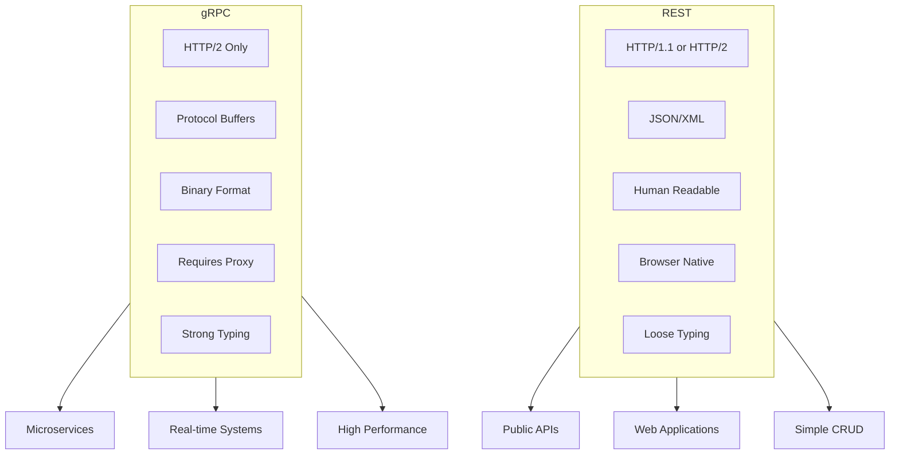
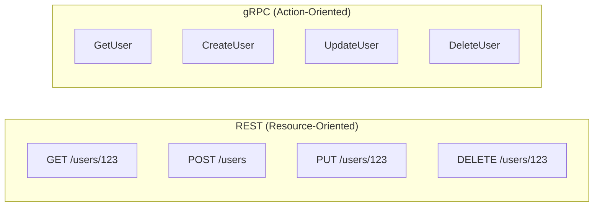
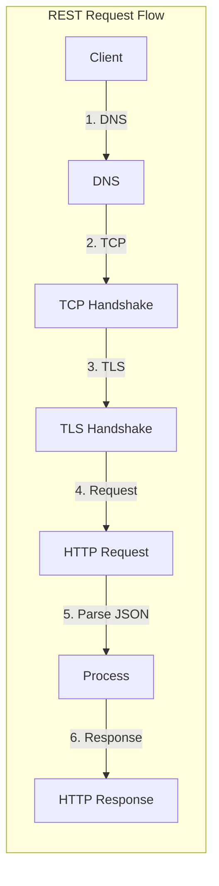
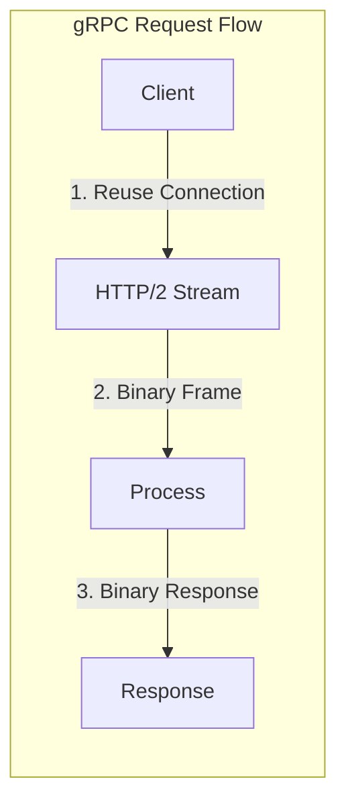
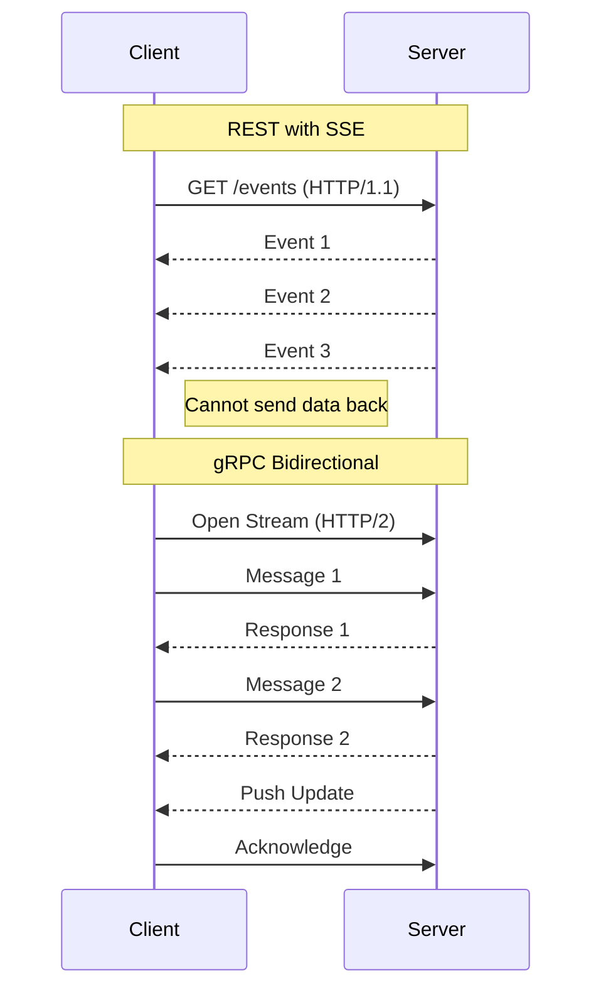
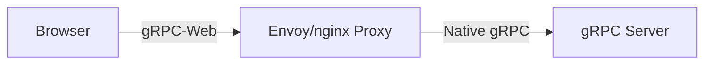
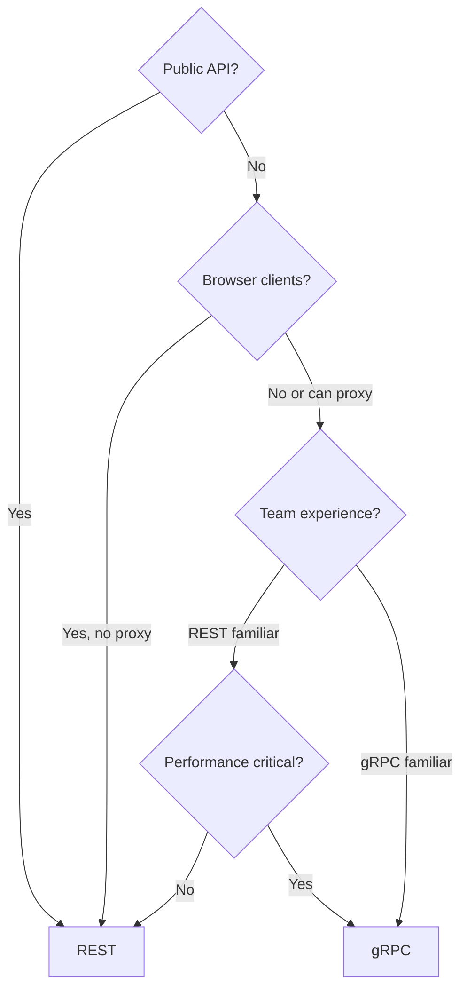
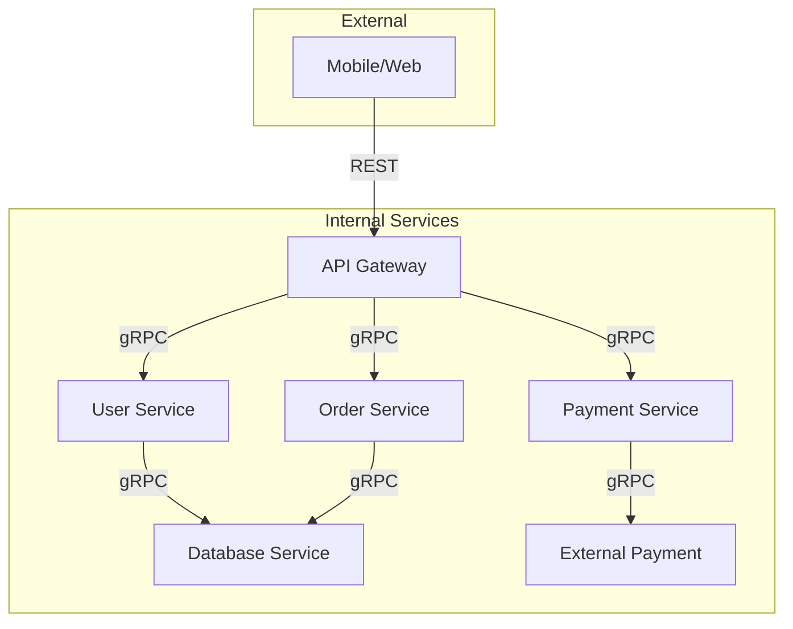
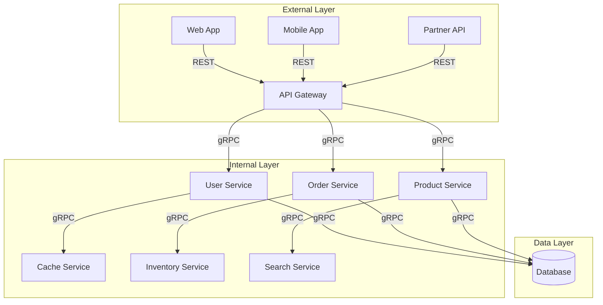
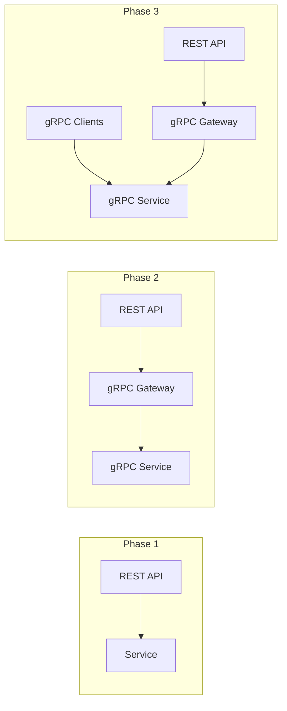

# How to Choose Between gRPC and REST for Your API

Author: [nawazdhandala](https://www.github.com/nawazdhandala)

Tags: gRPC, REST, API, Performance, Architecture, Microservices, Comparison

Description: A comprehensive comparison of gRPC and REST APIs covering performance, use cases, tooling, and decision criteria to help you choose the right approach.

---

## Introduction

When designing APIs for modern applications, two dominant approaches emerge: REST (Representational State Transfer) and gRPC (gRPC Remote Procedure Calls). Both have their strengths, and choosing the right one depends on your specific requirements, team expertise, and system constraints.

In this guide, you will learn the fundamental differences between gRPC and REST, understand their performance characteristics, and discover when to use each approach.

## Quick Comparison Overview



## Fundamental Differences

### Protocol and Transport

| Aspect | REST | gRPC |
|--------|------|------|
| Protocol | HTTP/1.1 or HTTP/2 | HTTP/2 only |
| Data Format | JSON, XML, etc. | Protocol Buffers (binary) |
| Contract | OpenAPI/Swagger (optional) | Proto files (required) |
| Streaming | Limited (WebSockets, SSE) | Native bidirectional |
| Connection | New connection per request (HTTP/1.1) | Persistent multiplexed |

### API Design Philosophy



**REST Example:**
```http
GET /api/v1/users/123 HTTP/1.1
Host: api.example.com
Accept: application/json

HTTP/1.1 200 OK
Content-Type: application/json

{
  "id": 123,
  "name": "Alice",
  "email": "alice@example.com",
  "created_at": "2024-01-15T10:30:00Z"
}
```

**gRPC Equivalent:**
```protobuf
service UserService {
  rpc GetUser(GetUserRequest) returns (User);
}

message GetUserRequest {
  int64 id = 1;
}

message User {
  int64 id = 1;
  string name = 2;
  string email = 3;
  google.protobuf.Timestamp created_at = 4;
}
```

## Performance Comparison

### Payload Size

Protocol Buffers produces significantly smaller payloads than JSON:

```
JSON Payload (typical user object):
{
  "id": 12345678,
  "name": "Alice Johnson",
  "email": "alice.johnson@example.com",
  "status": "active",
  "roles": ["admin", "user"],
  "created_at": "2024-01-15T10:30:00.000Z"
}
Size: ~200 bytes

Protobuf Equivalent:
Binary encoded message
Size: ~80 bytes (60% smaller)
```

### Serialization Speed Benchmark

```
Benchmark Results (1 million operations):

JSON (encoding/json):
  Serialize:   850ms
  Deserialize: 1200ms

Protobuf:
  Serialize:   120ms (7x faster)
  Deserialize: 180ms (6.5x faster)
```

### Latency Comparison





**Typical Latency Numbers:**

| Scenario | REST (JSON/HTTP1.1) | gRPC (Protobuf/HTTP2) |
|----------|--------------------|-----------------------|
| Simple request | 50-100ms | 10-30ms |
| With connection reuse | 20-50ms | 5-15ms |
| Streaming (100 messages) | N/A (requires WebSocket) | 50-100ms total |

### Throughput Comparison

```
Load Test Results (10,000 requests):

REST API:
  Requests/sec: 2,500
  Avg latency: 40ms
  P99 latency: 120ms

gRPC API:
  Requests/sec: 8,000
  Avg latency: 12ms
  P99 latency: 35ms
```

## Streaming Capabilities

### REST Streaming Options

REST has limited native streaming support:

```javascript
// Server-Sent Events (SSE) - Server to Client only
const eventSource = new EventSource('/api/events');
eventSource.onmessage = (event) => {
  console.log('Received:', JSON.parse(event.data));
};

// WebSocket - Bidirectional but separate protocol
const ws = new WebSocket('wss://api.example.com/ws');
ws.onmessage = (event) => {
  console.log('Received:', JSON.parse(event.data));
};
ws.send(JSON.stringify({ type: 'subscribe', channel: 'updates' }));
```

### gRPC Native Streaming

```protobuf
service StreamService {
  // Server streaming
  rpc Subscribe(SubscribeRequest) returns (stream Event);

  // Client streaming
  rpc Upload(stream DataChunk) returns (UploadResponse);

  // Bidirectional streaming
  rpc Chat(stream Message) returns (stream Message);
}
```

```go
// Server streaming example
func (s *server) Subscribe(req *pb.SubscribeRequest, stream pb.StreamService_SubscribeServer) error {
    for {
        event := <-s.events
        if err := stream.Send(event); err != nil {
            return err
        }
    }
}

// Client receiving stream
stream, _ := client.Subscribe(ctx, &pb.SubscribeRequest{})
for {
    event, err := stream.Recv()
    if err == io.EOF {
        break
    }
    fmt.Println("Received event:", event)
}
```



## Type Safety and Contracts

### REST API Contract (OpenAPI)

```yaml
# openapi.yaml
openapi: 3.0.0
info:
  title: User API
  version: 1.0.0
paths:
  /users/{id}:
    get:
      summary: Get user by ID
      parameters:
        - name: id
          in: path
          required: true
          schema:
            type: integer
      responses:
        '200':
          description: Success
          content:
            application/json:
              schema:
                $ref: '#/components/schemas/User'
        '404':
          description: Not found

components:
  schemas:
    User:
      type: object
      properties:
        id:
          type: integer
        name:
          type: string
        email:
          type: string
          format: email
```

**REST Limitations:**
- OpenAPI is optional and often out of sync with implementation
- Type validation happens at runtime
- No compile-time guarantees
- Schema evolution is manual

### gRPC Contract (Protobuf)

```protobuf
// user.proto - The contract IS the implementation
syntax = "proto3";

service UserService {
  rpc GetUser(GetUserRequest) returns (User);
}

message GetUserRequest {
  int64 id = 1;
}

message User {
  int64 id = 1;
  string name = 2;
  string email = 3;
}
```

**gRPC Advantages:**
- Contract is mandatory
- Compile-time type checking
- Automatic code generation
- Built-in versioning support

## Browser Support

### REST in Browsers

REST works natively in all browsers:

```javascript
// Simple fetch API
const response = await fetch('/api/users/123');
const user = await response.json();

// With error handling
try {
  const response = await fetch('/api/users', {
    method: 'POST',
    headers: { 'Content-Type': 'application/json' },
    body: JSON.stringify({ name: 'Alice', email: 'alice@example.com' })
  });

  if (!response.ok) throw new Error(`HTTP ${response.status}`);
  const user = await response.json();
} catch (error) {
  console.error('API error:', error);
}
```

### gRPC-Web for Browsers

gRPC requires a proxy layer for browser support:



**Setup with Envoy:**

```yaml
# envoy.yaml
static_resources:
  listeners:
    - name: listener_0
      address:
        socket_address: { address: 0.0.0.0, port_value: 8080 }
      filter_chains:
        - filters:
            - name: envoy.filters.network.http_connection_manager
              typed_config:
                "@type": type.googleapis.com/envoy.extensions.filters.network.http_connection_manager.v3.HttpConnectionManager
                codec_type: auto
                stat_prefix: ingress_http
                route_config:
                  name: local_route
                  virtual_hosts:
                    - name: local_service
                      domains: ["*"]
                      routes:
                        - match: { prefix: "/" }
                          route:
                            cluster: grpc_service
                            timeout: 0s
                            max_stream_duration:
                              grpc_timeout_header_max: 0s
                      cors:
                        allow_origin_string_match:
                          - prefix: "*"
                        allow_methods: GET, PUT, DELETE, POST, OPTIONS
                        allow_headers: keep-alive,user-agent,cache-control,content-type,content-transfer-encoding,x-accept-content-transfer-encoding,x-accept-response-streaming,x-user-agent,x-grpc-web,grpc-timeout
                        expose_headers: grpc-status,grpc-message
                http_filters:
                  - name: envoy.filters.http.grpc_web
                  - name: envoy.filters.http.cors
                  - name: envoy.filters.http.router

  clusters:
    - name: grpc_service
      connect_timeout: 0.25s
      type: logical_dns
      http2_protocol_options: {}
      lb_policy: round_robin
      load_assignment:
        cluster_name: cluster_0
        endpoints:
          - lb_endpoints:
              - endpoint:
                  address:
                    socket_address:
                      address: grpc-server
                      port_value: 50051
```

**Browser Client with gRPC-Web:**

```typescript
import { UserServiceClient } from './gen/user_grpc_web_pb';
import { GetUserRequest } from './gen/user_pb';

const client = new UserServiceClient('http://localhost:8080');

const request = new GetUserRequest();
request.setId(123);

client.getUser(request, {}, (err, response) => {
  if (err) {
    console.error('Error:', err.message);
    return;
  }
  console.log('User:', response.getName(), response.getEmail());
});
```

## Tooling Ecosystem

### REST Tooling

| Category | Tools |
|----------|-------|
| Documentation | Swagger UI, ReDoc, Stoplight |
| Testing | Postman, Insomnia, curl |
| Mocking | Mockoon, Prism, WireMock |
| Code Generation | OpenAPI Generator, Swagger Codegen |
| Monitoring | Many APM tools native support |

### gRPC Tooling

| Category | Tools |
|----------|-------|
| CLI Testing | grpcurl, grpc_cli, evans |
| GUI Testing | BloomRPC, Kreya, Postman (limited) |
| Mocking | grpc-mock, traffic-parrot |
| Code Generation | protoc, Buf |
| Monitoring | Custom instrumentation required |

### Debugging Comparison

**REST Debugging:**
```bash
# Easy with curl
curl -X GET http://localhost:8080/api/users/123 \
  -H "Authorization: Bearer token123" \
  -v

# Human-readable response
{
  "id": 123,
  "name": "Alice",
  "email": "alice@example.com"
}
```

**gRPC Debugging:**
```bash
# Requires grpcurl and server reflection
grpcurl -plaintext \
  -d '{"id": 123}' \
  localhost:50051 \
  user.v1.UserService/GetUser

# Binary format not readable without tooling
```

## Error Handling

### REST Error Handling

```javascript
// REST uses HTTP status codes
// 200 OK, 201 Created, 400 Bad Request, 404 Not Found, 500 Internal Error

// Example response
{
  "error": {
    "code": "USER_NOT_FOUND",
    "message": "User with ID 123 not found",
    "details": {
      "requested_id": 123
    }
  }
}
```

### gRPC Error Handling

```go
import (
    "google.golang.org/grpc/codes"
    "google.golang.org/grpc/status"
)

// gRPC uses specific status codes
func (s *server) GetUser(ctx context.Context, req *pb.GetUserRequest) (*pb.User, error) {
    user, err := s.db.FindUser(req.Id)
    if err != nil {
        return nil, status.Errorf(codes.Internal, "database error: %v", err)
    }
    if user == nil {
        return nil, status.Errorf(codes.NotFound, "user %d not found", req.Id)
    }
    return user, nil
}

// Client handling
user, err := client.GetUser(ctx, &pb.GetUserRequest{Id: 123})
if err != nil {
    st, ok := status.FromError(err)
    if ok {
        switch st.Code() {
        case codes.NotFound:
            // Handle not found
        case codes.Internal:
            // Handle server error
        }
    }
}
```

**gRPC Status Codes vs HTTP:**

| gRPC Code | HTTP Equivalent | Description |
|-----------|-----------------|-------------|
| OK (0) | 200 | Success |
| CANCELLED (1) | 499 | Client cancelled |
| INVALID_ARGUMENT (3) | 400 | Bad request |
| NOT_FOUND (5) | 404 | Resource not found |
| PERMISSION_DENIED (7) | 403 | Forbidden |
| UNAUTHENTICATED (16) | 401 | Unauthorized |
| INTERNAL (13) | 500 | Server error |
| UNAVAILABLE (14) | 503 | Service unavailable |

## Use Case Analysis

### When to Choose REST



**REST is ideal for:**

1. **Public-facing APIs**
   - Third-party integrations
   - Mobile apps with varied connectivity
   - Partner APIs

2. **Web Applications**
   - Direct browser consumption
   - No infrastructure for gRPC-Web

3. **Simple CRUD Operations**
   - Basic resource management
   - Low request volume

4. **Teams New to gRPC**
   - Familiar tooling
   - Lower learning curve

### When to Choose gRPC

**gRPC is ideal for:**

1. **Microservices Communication**


2. **Real-time Applications**
   - Live dashboards
   - Chat systems
   - Gaming backends

3. **High-Performance Systems**
   - Trading platforms
   - IoT data ingestion
   - ML inference services

4. **Polyglot Environments**
   - Services in multiple languages
   - Need consistent contracts

## Hybrid Architecture Pattern

Many successful systems use both:



### Implementation Example

```go
// API Gateway - REST to gRPC translation
package main

import (
    "encoding/json"
    "net/http"

    "google.golang.org/grpc"
    userpb "github.com/example/gen/user/v1"
)

type Gateway struct {
    userClient userpb.UserServiceClient
}

func (g *Gateway) GetUser(w http.ResponseWriter, r *http.Request) {
    // Parse REST request
    userID := r.URL.Query().Get("id")

    // Call gRPC service
    user, err := g.userClient.GetUser(r.Context(), &userpb.GetUserRequest{
        Id: userID,
    })
    if err != nil {
        http.Error(w, err.Error(), http.StatusInternalServerError)
        return
    }

    // Return REST response
    w.Header().Set("Content-Type", "application/json")
    json.NewEncoder(w).Encode(map[string]interface{}{
        "id":    user.Id,
        "name":  user.Name,
        "email": user.Email,
    })
}

func main() {
    // Connect to gRPC services
    conn, _ := grpc.Dial("user-service:50051", grpc.WithInsecure())
    gateway := &Gateway{
        userClient: userpb.NewUserServiceClient(conn),
    }

    // Expose REST endpoints
    http.HandleFunc("/api/users", gateway.GetUser)
    http.ListenAndServe(":8080", nil)
}
```

## Decision Framework

Use this checklist to make your decision:

### Choose REST if:
- [ ] API will be consumed by browsers directly
- [ ] Third parties will integrate with your API
- [ ] Human readability of requests/responses is important
- [ ] Team has limited gRPC experience
- [ ] Simple request/response patterns are sufficient
- [ ] Extensive tooling ecosystem is required
- [ ] API will be public-facing

### Choose gRPC if:
- [ ] Services communicate internally (microservices)
- [ ] Low latency is critical (< 10ms)
- [ ] Streaming (real-time updates) is needed
- [ ] Strong typing and contracts are required
- [ ] Multiple languages need to interoperate
- [ ] Bandwidth efficiency matters (mobile, IoT)
- [ ] High throughput is required (> 10K req/sec)

### Choose Both if:
- [ ] Public API with internal microservices
- [ ] Need REST for browsers, gRPC for services
- [ ] Gradual migration from REST to gRPC

## Migration Considerations

### REST to gRPC Migration Path



### Using gRPC-Gateway

```protobuf
// Add HTTP annotations to proto
import "google/api/annotations.proto";

service UserService {
  rpc GetUser(GetUserRequest) returns (User) {
    option (google.api.http) = {
      get: "/api/v1/users/{id}"
    };
  }

  rpc CreateUser(CreateUserRequest) returns (User) {
    option (google.api.http) = {
      post: "/api/v1/users"
      body: "*"
    };
  }
}
```

This generates both gRPC and REST endpoints from a single definition.

## Conclusion

Both REST and gRPC are powerful tools for building APIs, and the choice between them should be based on your specific requirements:

| Factor | REST | gRPC |
|--------|------|------|
| Performance | Good | Excellent |
| Browser Support | Native | Requires proxy |
| Learning Curve | Lower | Higher |
| Tooling | Extensive | Growing |
| Streaming | Limited | Native |
| Type Safety | Optional | Built-in |
| Public APIs | Ideal | Possible |
| Microservices | Good | Excellent |

**Key Recommendations:**

1. **Start with REST** for public APIs and simple applications
2. **Use gRPC** for internal microservices communication
3. **Consider a hybrid approach** for complex systems
4. **Invest in tooling** regardless of your choice
5. **Plan for evolution** - your needs may change

The best API is one that serves your users well and your team can maintain effectively. Both REST and gRPC can achieve this goal when applied appropriately.
