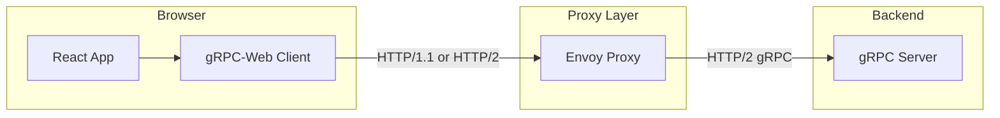
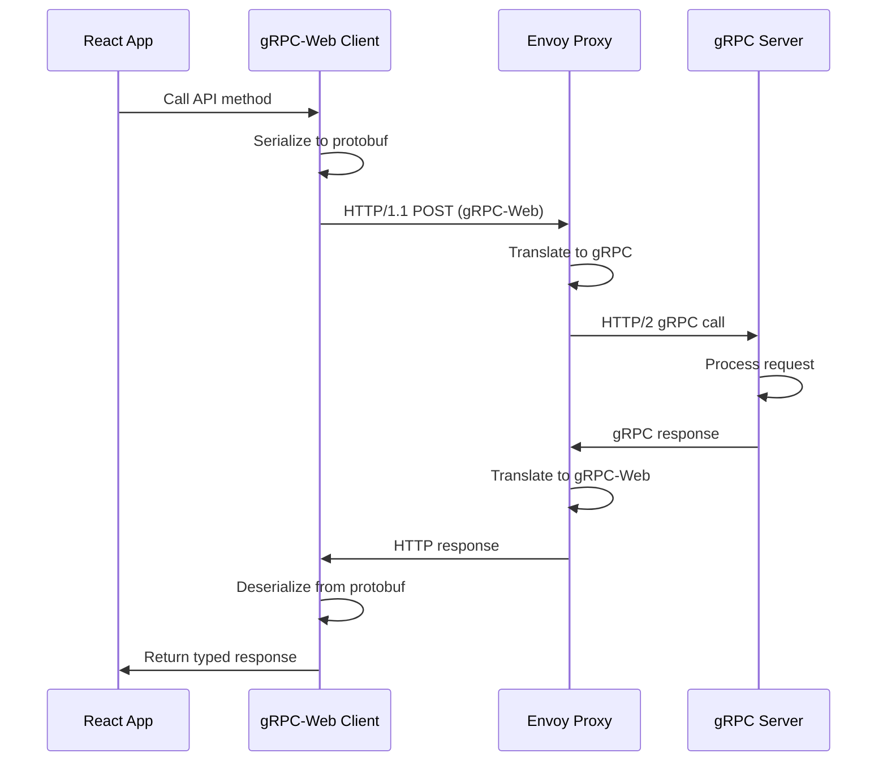

# How to Build gRPC Clients in React/Browser with gRPC-Web

Author: [nawazdhandala](https://www.github.com/nawazdhandala)

Tags: gRPC, gRPC-Web, React, TypeScript, Envoy, Frontend, Browser, Protocol Buffers, Web Development

Description: A comprehensive guide to building gRPC clients in React applications using gRPC-Web, covering Envoy proxy setup, TypeScript integration, streaming patterns, and production deployment.

---

## Introduction

gRPC-Web enables browser-based applications to communicate with gRPC services. Since browsers cannot directly use HTTP/2 trailers or make gRPC calls, gRPC-Web uses a proxy (typically Envoy) to translate between the browser-friendly gRPC-Web protocol and standard gRPC.

This guide walks you through building a complete gRPC-Web client in React with TypeScript, from setting up the development environment to production deployment.

## Understanding gRPC-Web

### How gRPC-Web Works



### gRPC-Web vs Standard gRPC

| Feature | Standard gRPC | gRPC-Web |
|---------|--------------|----------|
| Protocol | HTTP/2 | HTTP/1.1 or HTTP/2 |
| Streaming | Full bidirectional | Server streaming only |
| Browser Support | No | Yes |
| Proxy Required | No | Yes (typically Envoy) |
| Binary Format | Protobuf | Protobuf or Base64 |

## Project Setup

### Create React Project

```bash
# Create React app with TypeScript
npx create-react-app grpc-web-react --template typescript
cd grpc-web-react

# Install gRPC-Web dependencies
npm install google-protobuf grpc-web
npm install -D @types/google-protobuf

# Install additional dependencies
npm install @tanstack/react-query axios
npm install -D protoc-gen-grpc-web
```

### Project Structure

```
grpc-web-react/
├── proto/
│   └── user.proto
├── src/
│   ├── generated/
│   │   ├── user_pb.js
│   │   ├── user_pb.d.ts
│   │   ├── UserServiceClientPb.ts
│   │   └── user_grpc_web_pb.d.ts
│   ├── api/
│   │   ├── client.ts
│   │   ├── userService.ts
│   │   └── interceptors.ts
│   ├── hooks/
│   │   ├── useUser.ts
│   │   └── useUsers.ts
│   ├── components/
│   │   ├── UserList.tsx
│   │   ├── UserForm.tsx
│   │   └── UserCard.tsx
│   ├── types/
│   │   └── user.ts
│   ├── App.tsx
│   └── index.tsx
├── envoy/
│   └── envoy.yaml
├── docker-compose.yaml
├── package.json
└── tsconfig.json
```

## Protocol Buffer Definition

### Define the Service

Create `proto/user.proto`:

```protobuf
syntax = "proto3";

package userservice;

option go_package = "github.com/example/user-service/pb";

// Timestamp representation
message Timestamp {
    int64 seconds = 1;
    int32 nanos = 2;
}

// User entity
message User {
    string id = 1;
    string username = 2;
    string email = 3;
    string full_name = 4;
    string avatar_url = 5;
    UserRole role = 6;
    UserStatus status = 7;
    Timestamp created_at = 8;
    Timestamp updated_at = 9;
}

enum UserRole {
    USER_ROLE_UNSPECIFIED = 0;
    USER_ROLE_USER = 1;
    USER_ROLE_ADMIN = 2;
    USER_ROLE_MODERATOR = 3;
}

enum UserStatus {
    USER_STATUS_UNSPECIFIED = 0;
    USER_STATUS_ACTIVE = 1;
    USER_STATUS_INACTIVE = 2;
    USER_STATUS_SUSPENDED = 3;
}

// Request messages
message CreateUserRequest {
    string username = 1;
    string email = 2;
    string full_name = 3;
    string password = 4;
}

message GetUserRequest {
    string user_id = 1;
}

message UpdateUserRequest {
    string user_id = 1;
    optional string username = 2;
    optional string email = 3;
    optional string full_name = 4;
    optional string avatar_url = 5;
}

message DeleteUserRequest {
    string user_id = 1;
}

message ListUsersRequest {
    int32 page_size = 1;
    string page_token = 2;
    UserStatus status_filter = 3;
    string search_query = 4;
}

// Response messages
message CreateUserResponse {
    User user = 1;
}

message GetUserResponse {
    User user = 1;
}

message UpdateUserResponse {
    User user = 1;
}

message DeleteUserResponse {
    bool success = 1;
    string message = 2;
}

message ListUsersResponse {
    repeated User users = 1;
    string next_page_token = 2;
    int32 total_count = 3;
}

// Streaming messages
message WatchUsersRequest {
    repeated string user_ids = 1;
    bool watch_all = 2;
}

message UserEvent {
    string event_id = 1;
    EventType event_type = 2;
    User user = 3;
    Timestamp timestamp = 4;
}

enum EventType {
    EVENT_TYPE_UNSPECIFIED = 0;
    EVENT_TYPE_CREATED = 1;
    EVENT_TYPE_UPDATED = 2;
    EVENT_TYPE_DELETED = 3;
}

// User Service
service UserService {
    // Unary RPCs
    rpc CreateUser(CreateUserRequest) returns (CreateUserResponse);
    rpc GetUser(GetUserRequest) returns (GetUserResponse);
    rpc UpdateUser(UpdateUserRequest) returns (UpdateUserResponse);
    rpc DeleteUser(DeleteUserRequest) returns (DeleteUserResponse);
    rpc ListUsers(ListUsersRequest) returns (ListUsersResponse);

    // Server streaming (supported by gRPC-Web)
    rpc WatchUsers(WatchUsersRequest) returns (stream UserEvent);
}
```

## Code Generation

### Generation Script

Create `scripts/generate-proto.sh`:

```bash
#!/bin/bash
set -e

PROTO_DIR="./proto"
OUT_DIR="./src/generated"

# Clean and create output directory
rm -rf $OUT_DIR
mkdir -p $OUT_DIR

# Generate JavaScript and TypeScript code
protoc \
    -I=$PROTO_DIR \
    --js_out=import_style=commonjs,binary:$OUT_DIR \
    --grpc-web_out=import_style=typescript,mode=grpcwebtext:$OUT_DIR \
    $PROTO_DIR/*.proto

echo "Proto files generated successfully!"
```

### Add npm script

Update `package.json`:

```json
{
  "scripts": {
    "generate": "bash scripts/generate-proto.sh",
    "start": "react-scripts start",
    "build": "react-scripts build",
    "test": "react-scripts test"
  }
}
```

Run code generation:

```bash
chmod +x scripts/generate-proto.sh
npm run generate
```

## Envoy Proxy Setup

### Envoy Configuration

Create `envoy/envoy.yaml`:

```yaml
admin:
  access_log_path: /tmp/admin_access.log
  address:
    socket_address:
      address: 0.0.0.0
      port_value: 9901

static_resources:
  listeners:
    - name: listener_0
      address:
        socket_address:
          address: 0.0.0.0
          port_value: 8080
      filter_chains:
        - filters:
            - name: envoy.filters.network.http_connection_manager
              typed_config:
                "@type": type.googleapis.com/envoy.extensions.filters.network.http_connection_manager.v3.HttpConnectionManager
                codec_type: auto
                stat_prefix: ingress_http
                route_config:
                  name: local_route
                  virtual_hosts:
                    - name: local_service
                      domains: ["*"]
                      routes:
                        - match:
                            prefix: "/"
                          route:
                            cluster: grpc_service
                            timeout: 0s
                            max_stream_duration:
                              grpc_timeout_header_max: 0s
                      cors:
                        allow_origin_string_match:
                          - prefix: "*"
                        allow_methods: GET, PUT, DELETE, POST, OPTIONS
                        allow_headers: keep-alive,user-agent,cache-control,content-type,content-transfer-encoding,custom-header-1,x-accept-content-transfer-encoding,x-accept-response-streaming,x-user-agent,x-grpc-web,grpc-timeout,authorization
                        max_age: "1728000"
                        expose_headers: grpc-status,grpc-message
                http_filters:
                  - name: envoy.filters.http.grpc_web
                    typed_config:
                      "@type": type.googleapis.com/envoy.extensions.filters.http.grpc_web.v3.GrpcWeb
                  - name: envoy.filters.http.cors
                    typed_config:
                      "@type": type.googleapis.com/envoy.extensions.filters.http.cors.v3.Cors
                  - name: envoy.filters.http.router
                    typed_config:
                      "@type": type.googleapis.com/envoy.extensions.filters.http.router.v3.Router

  clusters:
    - name: grpc_service
      connect_timeout: 0.25s
      type: logical_dns
      http2_protocol_options: {}
      lb_policy: round_robin
      load_assignment:
        cluster_name: grpc_service
        endpoints:
          - lb_endpoints:
              - endpoint:
                  address:
                    socket_address:
                      address: grpc-server
                      port_value: 50051
```

### Docker Compose

Create `docker-compose.yaml`:

```yaml
version: '3.8'

services:
  # gRPC backend server
  grpc-server:
    image: your-grpc-server:latest
    ports:
      - "50051:50051"
    networks:
      - grpc-network

  # Envoy proxy
  envoy:
    image: envoyproxy/envoy:v1.28-latest
    volumes:
      - ./envoy/envoy.yaml:/etc/envoy/envoy.yaml:ro
    ports:
      - "8080:8080"
      - "9901:9901"
    networks:
      - grpc-network
    depends_on:
      - grpc-server
    command: /usr/local/bin/envoy -c /etc/envoy/envoy.yaml -l debug

  # React development server
  frontend:
    build:
      context: .
      dockerfile: Dockerfile.dev
    ports:
      - "3000:3000"
    volumes:
      - ./src:/app/src
      - ./public:/app/public
    environment:
      - REACT_APP_GRPC_ENDPOINT=http://localhost:8080
    networks:
      - grpc-network
    depends_on:
      - envoy

networks:
  grpc-network:
    driver: bridge
```

## gRPC-Web Client Implementation

### Base Client Configuration

Create `src/api/client.ts`:

```typescript
import { UserServiceClient } from '../generated/UserServiceClientPb';

// Configuration
export interface GrpcClientConfig {
  endpoint: string;
  enableDevTools?: boolean;
}

// Default configuration
const defaultConfig: GrpcClientConfig = {
  endpoint: process.env.REACT_APP_GRPC_ENDPOINT || 'http://localhost:8080',
  enableDevTools: process.env.NODE_ENV === 'development',
};

// Singleton client instance
let userServiceClient: UserServiceClient | null = null;

/**
 * Get or create the UserService client
 */
export function getUserServiceClient(config?: Partial<GrpcClientConfig>): UserServiceClient {
  if (!userServiceClient) {
    const finalConfig = { ...defaultConfig, ...config };
    userServiceClient = new UserServiceClient(finalConfig.endpoint, null, null);
  }
  return userServiceClient;
}

/**
 * Reset the client (useful for testing or config changes)
 */
export function resetClient(): void {
  userServiceClient = null;
}

/**
 * Create metadata object with common headers
 */
export function createMetadata(
  token?: string,
  additionalHeaders?: Record<string, string>
): { [key: string]: string } {
  const metadata: { [key: string]: string } = {};

  if (token) {
    metadata['authorization'] = `Bearer ${token}`;
  }

  if (additionalHeaders) {
    Object.assign(metadata, additionalHeaders);
  }

  return metadata;
}
```

### Interceptors

Create `src/api/interceptors.ts`:

```typescript
import {
  UnaryInterceptor,
  Request,
  UnaryResponse,
  RpcError,
  StatusCode,
} from 'grpc-web';

/**
 * Logging interceptor for development
 */
export class LoggingInterceptor implements UnaryInterceptor<unknown, unknown> {
  intercept(
    request: Request<unknown, unknown>,
    invoker: (request: Request<unknown, unknown>) => Promise<UnaryResponse<unknown, unknown>>
  ): Promise<UnaryResponse<unknown, unknown>> {
    const methodName = request.getMethodDescriptor().getName();
    const startTime = performance.now();

    console.group(`gRPC Request: ${methodName}`);
    console.log('Request:', request.getRequestMessage());

    return invoker(request)
      .then((response) => {
        const duration = performance.now() - startTime;
        console.log('Response:', response.getResponseMessage());
        console.log(`Duration: ${duration.toFixed(2)}ms`);
        console.groupEnd();
        return response;
      })
      .catch((error: RpcError) => {
        const duration = performance.now() - startTime;
        console.error('Error:', error.code, error.message);
        console.log(`Duration: ${duration.toFixed(2)}ms`);
        console.groupEnd();
        throw error;
      });
  }
}

/**
 * Authentication interceptor
 */
export class AuthInterceptor implements UnaryInterceptor<unknown, unknown> {
  constructor(private getToken: () => string | null) {}

  intercept(
    request: Request<unknown, unknown>,
    invoker: (request: Request<unknown, unknown>) => Promise<UnaryResponse<unknown, unknown>>
  ): Promise<UnaryResponse<unknown, unknown>> {
    const token = this.getToken();

    if (token) {
      const metadata = request.getMetadata();
      metadata['authorization'] = `Bearer ${token}`;
    }

    return invoker(request);
  }
}

/**
 * Retry interceptor with exponential backoff
 */
export class RetryInterceptor implements UnaryInterceptor<unknown, unknown> {
  private maxRetries: number;
  private retryableStatuses: Set<StatusCode>;

  constructor(maxRetries = 3) {
    this.maxRetries = maxRetries;
    this.retryableStatuses = new Set([
      StatusCode.UNAVAILABLE,
      StatusCode.DEADLINE_EXCEEDED,
      StatusCode.RESOURCE_EXHAUSTED,
    ]);
  }

  async intercept(
    request: Request<unknown, unknown>,
    invoker: (request: Request<unknown, unknown>) => Promise<UnaryResponse<unknown, unknown>>
  ): Promise<UnaryResponse<unknown, unknown>> {
    let lastError: RpcError | null = null;

    for (let attempt = 0; attempt <= this.maxRetries; attempt++) {
      try {
        return await invoker(request);
      } catch (error) {
        const rpcError = error as RpcError;
        lastError = rpcError;

        if (!this.retryableStatuses.has(rpcError.code)) {
          throw error;
        }

        if (attempt < this.maxRetries) {
          const delay = Math.min(1000 * Math.pow(2, attempt), 10000);
          const jitter = Math.random() * 1000;
          await this.sleep(delay + jitter);
          console.log(`Retrying request, attempt ${attempt + 1}/${this.maxRetries}`);
        }
      }
    }

    throw lastError;
  }

  private sleep(ms: number): Promise<void> {
    return new Promise((resolve) => setTimeout(resolve, ms));
  }
}

/**
 * Error handling interceptor
 */
export class ErrorInterceptor implements UnaryInterceptor<unknown, unknown> {
  constructor(private onError?: (error: RpcError) => void) {}

  intercept(
    request: Request<unknown, unknown>,
    invoker: (request: Request<unknown, unknown>) => Promise<UnaryResponse<unknown, unknown>>
  ): Promise<UnaryResponse<unknown, unknown>> {
    return invoker(request).catch((error: RpcError) => {
      // Transform error if needed
      const enhancedError = this.enhanceError(error);

      // Call error handler
      if (this.onError) {
        this.onError(enhancedError);
      }

      throw enhancedError;
    });
  }

  private enhanceError(error: RpcError): RpcError {
    // Add user-friendly messages based on status code
    const messages: Record<number, string> = {
      [StatusCode.UNAVAILABLE]: 'Service is currently unavailable. Please try again later.',
      [StatusCode.DEADLINE_EXCEEDED]: 'Request timed out. Please try again.',
      [StatusCode.UNAUTHENTICATED]: 'Please log in to continue.',
      [StatusCode.PERMISSION_DENIED]: 'You do not have permission to perform this action.',
      [StatusCode.NOT_FOUND]: 'The requested resource was not found.',
      [StatusCode.INVALID_ARGUMENT]: 'Invalid input provided.',
    };

    const userMessage = messages[error.code] || 'An unexpected error occurred.';

    return new RpcError(error.code, userMessage, error.metadata);
  }
}
```

### User Service API

Create `src/api/userService.ts`:

```typescript
import { RpcError, StatusCode, ClientReadableStream } from 'grpc-web';
import { getUserServiceClient, createMetadata } from './client';
import {
  CreateUserRequest,
  CreateUserResponse,
  GetUserRequest,
  GetUserResponse,
  UpdateUserRequest,
  UpdateUserResponse,
  DeleteUserRequest,
  DeleteUserResponse,
  ListUsersRequest,
  ListUsersResponse,
  WatchUsersRequest,
  UserEvent,
  UserStatus,
} from '../generated/user_pb';

// Type definitions for cleaner API
export interface CreateUserParams {
  username: string;
  email: string;
  fullName: string;
  password: string;
}

export interface UpdateUserParams {
  userId: string;
  username?: string;
  email?: string;
  fullName?: string;
  avatarUrl?: string;
}

export interface ListUsersParams {
  pageSize?: number;
  pageToken?: string;
  statusFilter?: UserStatus;
  searchQuery?: string;
}

export interface WatchUsersParams {
  userIds?: string[];
  watchAll?: boolean;
}

/**
 * User Service API wrapper
 */
export const userServiceApi = {
  /**
   * Create a new user
   */
  createUser: async (params: CreateUserParams, token?: string): Promise<CreateUserResponse.AsObject> => {
    const client = getUserServiceClient();
    const request = new CreateUserRequest();

    request.setUsername(params.username);
    request.setEmail(params.email);
    request.setFullName(params.fullName);
    request.setPassword(params.password);

    const metadata = createMetadata(token);

    return new Promise((resolve, reject) => {
      client.createUser(request, metadata, (err, response) => {
        if (err) {
          reject(err);
        } else if (response) {
          resolve(response.toObject());
        } else {
          reject(new RpcError(StatusCode.INTERNAL, 'Empty response'));
        }
      });
    });
  },

  /**
   * Get a user by ID
   */
  getUser: async (userId: string, token?: string): Promise<GetUserResponse.AsObject> => {
    const client = getUserServiceClient();
    const request = new GetUserRequest();

    request.setUserId(userId);

    const metadata = createMetadata(token);

    return new Promise((resolve, reject) => {
      client.getUser(request, metadata, (err, response) => {
        if (err) {
          reject(err);
        } else if (response) {
          resolve(response.toObject());
        } else {
          reject(new RpcError(StatusCode.INTERNAL, 'Empty response'));
        }
      });
    });
  },

  /**
   * Update an existing user
   */
  updateUser: async (params: UpdateUserParams, token?: string): Promise<UpdateUserResponse.AsObject> => {
    const client = getUserServiceClient();
    const request = new UpdateUserRequest();

    request.setUserId(params.userId);
    if (params.username !== undefined) request.setUsername(params.username);
    if (params.email !== undefined) request.setEmail(params.email);
    if (params.fullName !== undefined) request.setFullName(params.fullName);
    if (params.avatarUrl !== undefined) request.setAvatarUrl(params.avatarUrl);

    const metadata = createMetadata(token);

    return new Promise((resolve, reject) => {
      client.updateUser(request, metadata, (err, response) => {
        if (err) {
          reject(err);
        } else if (response) {
          resolve(response.toObject());
        } else {
          reject(new RpcError(StatusCode.INTERNAL, 'Empty response'));
        }
      });
    });
  },

  /**
   * Delete a user
   */
  deleteUser: async (userId: string, token?: string): Promise<DeleteUserResponse.AsObject> => {
    const client = getUserServiceClient();
    const request = new DeleteUserRequest();

    request.setUserId(userId);

    const metadata = createMetadata(token);

    return new Promise((resolve, reject) => {
      client.deleteUser(request, metadata, (err, response) => {
        if (err) {
          reject(err);
        } else if (response) {
          resolve(response.toObject());
        } else {
          reject(new RpcError(StatusCode.INTERNAL, 'Empty response'));
        }
      });
    });
  },

  /**
   * List users with pagination
   */
  listUsers: async (params: ListUsersParams = {}, token?: string): Promise<ListUsersResponse.AsObject> => {
    const client = getUserServiceClient();
    const request = new ListUsersRequest();

    request.setPageSize(params.pageSize || 20);
    if (params.pageToken) request.setPageToken(params.pageToken);
    if (params.statusFilter !== undefined) request.setStatusFilter(params.statusFilter);
    if (params.searchQuery) request.setSearchQuery(params.searchQuery);

    const metadata = createMetadata(token);

    return new Promise((resolve, reject) => {
      client.listUsers(request, metadata, (err, response) => {
        if (err) {
          reject(err);
        } else if (response) {
          resolve(response.toObject());
        } else {
          reject(new RpcError(StatusCode.INTERNAL, 'Empty response'));
        }
      });
    });
  },

  /**
   * Watch for user events (server streaming)
   */
  watchUsers: (
    params: WatchUsersParams = {},
    callbacks: {
      onData: (event: UserEvent.AsObject) => void;
      onError?: (error: RpcError) => void;
      onEnd?: () => void;
    },
    token?: string
  ): ClientReadableStream<UserEvent> => {
    const client = getUserServiceClient();
    const request = new WatchUsersRequest();

    if (params.userIds) {
      request.setUserIdsList(params.userIds);
    }
    request.setWatchAll(params.watchAll || false);

    const metadata = createMetadata(token);

    const stream = client.watchUsers(request, metadata);

    stream.on('data', (response: UserEvent) => {
      callbacks.onData(response.toObject());
    });

    stream.on('error', (error: RpcError) => {
      if (callbacks.onError) {
        callbacks.onError(error);
      }
    });

    stream.on('end', () => {
      if (callbacks.onEnd) {
        callbacks.onEnd();
      }
    });

    return stream;
  },
};
```

## React Hooks

### useUser Hook

Create `src/hooks/useUser.ts`:

```typescript
import { useQuery, useMutation, useQueryClient } from '@tanstack/react-query';
import { userServiceApi, CreateUserParams, UpdateUserParams } from '../api/userService';
import { User } from '../generated/user_pb';

// Query keys
export const userKeys = {
  all: ['users'] as const,
  lists: () => [...userKeys.all, 'list'] as const,
  list: (filters: string) => [...userKeys.lists(), { filters }] as const,
  details: () => [...userKeys.all, 'detail'] as const,
  detail: (id: string) => [...userKeys.details(), id] as const,
};

/**
 * Hook to fetch a single user
 */
export function useUser(userId: string | undefined) {
  return useQuery({
    queryKey: userKeys.detail(userId || ''),
    queryFn: async () => {
      if (!userId) throw new Error('User ID is required');
      const response = await userServiceApi.getUser(userId);
      return response.user;
    },
    enabled: !!userId,
    staleTime: 30000, // 30 seconds
  });
}

/**
 * Hook to create a new user
 */
export function useCreateUser() {
  const queryClient = useQueryClient();

  return useMutation({
    mutationFn: async (params: CreateUserParams) => {
      const response = await userServiceApi.createUser(params);
      return response.user;
    },
    onSuccess: (newUser) => {
      // Invalidate and refetch user lists
      queryClient.invalidateQueries({ queryKey: userKeys.lists() });

      // Optionally add to cache immediately
      if (newUser) {
        queryClient.setQueryData(userKeys.detail(newUser.id), newUser);
      }
    },
  });
}

/**
 * Hook to update a user
 */
export function useUpdateUser() {
  const queryClient = useQueryClient();

  return useMutation({
    mutationFn: async (params: UpdateUserParams) => {
      const response = await userServiceApi.updateUser(params);
      return response.user;
    },
    onSuccess: (updatedUser) => {
      // Update cache
      if (updatedUser) {
        queryClient.setQueryData(userKeys.detail(updatedUser.id), updatedUser);
        queryClient.invalidateQueries({ queryKey: userKeys.lists() });
      }
    },
  });
}

/**
 * Hook to delete a user
 */
export function useDeleteUser() {
  const queryClient = useQueryClient();

  return useMutation({
    mutationFn: async (userId: string) => {
      return await userServiceApi.deleteUser(userId);
    },
    onSuccess: (_, userId) => {
      // Remove from cache
      queryClient.removeQueries({ queryKey: userKeys.detail(userId) });
      queryClient.invalidateQueries({ queryKey: userKeys.lists() });
    },
  });
}
```

### useUsers Hook

Create `src/hooks/useUsers.ts`:

```typescript
import { useQuery, useInfiniteQuery } from '@tanstack/react-query';
import { useEffect, useState, useCallback } from 'react';
import { userServiceApi, ListUsersParams, WatchUsersParams } from '../api/userService';
import { UserEvent, UserStatus } from '../generated/user_pb';
import { userKeys } from './useUser';

/**
 * Hook to list users with pagination
 */
export function useUsers(params: ListUsersParams = {}) {
  return useQuery({
    queryKey: userKeys.list(JSON.stringify(params)),
    queryFn: async () => {
      return await userServiceApi.listUsers(params);
    },
    staleTime: 30000,
  });
}

/**
 * Hook for infinite scrolling user list
 */
export function useInfiniteUsers(params: Omit<ListUsersParams, 'pageToken'> = {}) {
  return useInfiniteQuery({
    queryKey: [...userKeys.lists(), 'infinite', params],
    queryFn: async ({ pageParam }) => {
      return await userServiceApi.listUsers({
        ...params,
        pageToken: pageParam,
      });
    },
    initialPageParam: '',
    getNextPageParam: (lastPage) => lastPage.nextPageToken || undefined,
    staleTime: 30000,
  });
}

/**
 * Hook to watch for user events (server streaming)
 */
export function useWatchUsers(
  params: WatchUsersParams = {},
  options: {
    enabled?: boolean;
    onEvent?: (event: UserEvent.AsObject) => void;
  } = {}
) {
  const [events, setEvents] = useState<UserEvent.AsObject[]>([]);
  const [isConnected, setIsConnected] = useState(false);
  const [error, setError] = useState<Error | null>(null);

  const { enabled = true, onEvent } = options;

  const handleEvent = useCallback(
    (event: UserEvent.AsObject) => {
      setEvents((prev) => [...prev.slice(-99), event]); // Keep last 100 events
      if (onEvent) {
        onEvent(event);
      }
    },
    [onEvent]
  );

  useEffect(() => {
    if (!enabled) {
      return;
    }

    setIsConnected(true);
    setError(null);

    const stream = userServiceApi.watchUsers(params, {
      onData: handleEvent,
      onError: (err) => {
        setError(new Error(err.message));
        setIsConnected(false);
      },
      onEnd: () => {
        setIsConnected(false);
      },
    });

    return () => {
      stream.cancel();
      setIsConnected(false);
    };
  }, [enabled, JSON.stringify(params), handleEvent]);

  const clearEvents = useCallback(() => {
    setEvents([]);
  }, []);

  return {
    events,
    isConnected,
    error,
    clearEvents,
  };
}
```

## React Components

### User List Component

Create `src/components/UserList.tsx`:

```typescript
import React, { useState } from 'react';
import { useInfiniteUsers, useWatchUsers } from '../hooks/useUsers';
import { useDeleteUser } from '../hooks/useUser';
import { User, UserStatus } from '../generated/user_pb';
import UserCard from './UserCard';

interface UserListProps {
  onEdit?: (user: User.AsObject) => void;
}

const UserList: React.FC<UserListProps> = ({ onEdit }) => {
  const [statusFilter, setStatusFilter] = useState<UserStatus | undefined>(undefined);

  // Fetch users with infinite scroll
  const {
    data,
    isLoading,
    isError,
    error,
    hasNextPage,
    fetchNextPage,
    isFetchingNextPage,
    refetch,
  } = useInfiniteUsers({ statusFilter, pageSize: 20 });

  // Watch for real-time updates
  const { events, isConnected } = useWatchUsers(
    { watchAll: true },
    {
      onEvent: (event) => {
        console.log('User event:', event);
        // Refetch on updates
        if (event.eventType !== 0) {
          refetch();
        }
      },
    }
  );

  // Delete mutation
  const deleteMutation = useDeleteUser();

  const handleDelete = async (userId: string) => {
    if (window.confirm('Are you sure you want to delete this user?')) {
      try {
        await deleteMutation.mutateAsync(userId);
      } catch (err) {
        console.error('Failed to delete user:', err);
      }
    }
  };

  if (isLoading) {
    return <div className="loading">Loading users...</div>;
  }

  if (isError) {
    return (
      <div className="error">
        <p>Error loading users: {error?.message}</p>
        <button onClick={() => refetch()}>Retry</button>
      </div>
    );
  }

  const users = data?.pages.flatMap((page) => page.usersList) || [];
  const totalCount = data?.pages[0]?.totalCount || 0;

  return (
    <div className="user-list">
      <div className="user-list-header">
        <h2>Users ({totalCount})</h2>

        <div className="connection-status">
          {isConnected ? (
            <span className="connected">Live Updates Active</span>
          ) : (
            <span className="disconnected">Disconnected</span>
          )}
        </div>

        <div className="filters">
          <select
            value={statusFilter || ''}
            onChange={(e) => setStatusFilter(e.target.value ? Number(e.target.value) : undefined)}
          >
            <option value="">All Statuses</option>
            <option value={UserStatus.USER_STATUS_ACTIVE}>Active</option>
            <option value={UserStatus.USER_STATUS_INACTIVE}>Inactive</option>
            <option value={UserStatus.USER_STATUS_SUSPENDED}>Suspended</option>
          </select>
        </div>
      </div>

      <div className="user-grid">
        {users.map((user) => (
          <UserCard
            key={user.id}
            user={user}
            onEdit={() => onEdit?.(user)}
            onDelete={() => handleDelete(user.id)}
            isDeleting={deleteMutation.isPending && deleteMutation.variables === user.id}
          />
        ))}
      </div>

      {hasNextPage && (
        <button
          className="load-more"
          onClick={() => fetchNextPage()}
          disabled={isFetchingNextPage}
        >
          {isFetchingNextPage ? 'Loading...' : 'Load More'}
        </button>
      )}

      {events.length > 0 && (
        <div className="recent-events">
          <h3>Recent Events</h3>
          <ul>
            {events.slice(-5).map((event) => (
              <li key={event.eventId}>
                {event.eventType}: {event.user?.username || 'Unknown'}
              </li>
            ))}
          </ul>
        </div>
      )}
    </div>
  );
};

export default UserList;
```

### User Card Component

Create `src/components/UserCard.tsx`:

```typescript
import React from 'react';
import { User, UserRole, UserStatus } from '../generated/user_pb';

interface UserCardProps {
  user: User.AsObject;
  onEdit?: () => void;
  onDelete?: () => void;
  isDeleting?: boolean;
}

const getRoleLabel = (role: UserRole): string => {
  const labels: Record<UserRole, string> = {
    [UserRole.USER_ROLE_UNSPECIFIED]: 'Unknown',
    [UserRole.USER_ROLE_USER]: 'User',
    [UserRole.USER_ROLE_ADMIN]: 'Admin',
    [UserRole.USER_ROLE_MODERATOR]: 'Moderator',
  };
  return labels[role] || 'Unknown';
};

const getStatusLabel = (status: UserStatus): string => {
  const labels: Record<UserStatus, string> = {
    [UserStatus.USER_STATUS_UNSPECIFIED]: 'Unknown',
    [UserStatus.USER_STATUS_ACTIVE]: 'Active',
    [UserStatus.USER_STATUS_INACTIVE]: 'Inactive',
    [UserStatus.USER_STATUS_SUSPENDED]: 'Suspended',
  };
  return labels[status] || 'Unknown';
};

const getStatusColor = (status: UserStatus): string => {
  const colors: Record<UserStatus, string> = {
    [UserStatus.USER_STATUS_UNSPECIFIED]: '#999',
    [UserStatus.USER_STATUS_ACTIVE]: '#28a745',
    [UserStatus.USER_STATUS_INACTIVE]: '#6c757d',
    [UserStatus.USER_STATUS_SUSPENDED]: '#dc3545',
  };
  return colors[status] || '#999';
};

const UserCard: React.FC<UserCardProps> = ({ user, onEdit, onDelete, isDeleting }) => {
  return (
    <div className="user-card">
      <div className="user-avatar">
        {user.avatarUrl ? (
          
        ) : (
          <div className="avatar-placeholder">
            {user.username.charAt(0).toUpperCase()}
          </div>
        )}
      </div>

      <div className="user-info">
        <h3>{user.fullName || user.username}</h3>
        <p className="username">@{user.username}</p>
        <p className="email">{user.email}</p>

        <div className="user-meta">
          <span className="role">{getRoleLabel(user.role)}</span>
          <span
            className="status"
            style={{ backgroundColor: getStatusColor(user.status) }}
          >
            {getStatusLabel(user.status)}
          </span>
        </div>
      </div>

      <div className="user-actions">
        {onEdit && (
          <button className="btn-edit" onClick={onEdit}>
            Edit
          </button>
        )}
        {onDelete && (
          <button
            className="btn-delete"
            onClick={onDelete}
            disabled={isDeleting}
          >
            {isDeleting ? 'Deleting...' : 'Delete'}
          </button>
        )}
      </div>
    </div>
  );
};

export default UserCard;
```

### User Form Component

Create `src/components/UserForm.tsx`:

```typescript
import React, { useState, useEffect } from 'react';
import { useCreateUser, useUpdateUser } from '../hooks/useUser';
import { User } from '../generated/user_pb';
import { CreateUserParams, UpdateUserParams } from '../api/userService';

interface UserFormProps {
  user?: User.AsObject; // If provided, edit mode
  onSuccess?: () => void;
  onCancel?: () => void;
}

const UserForm: React.FC<UserFormProps> = ({ user, onSuccess, onCancel }) => {
  const isEditMode = !!user;

  const [formData, setFormData] = useState({
    username: '',
    email: '',
    fullName: '',
    password: '',
    avatarUrl: '',
  });

  const [errors, setErrors] = useState<Record<string, string>>({});

  const createMutation = useCreateUser();
  const updateMutation = useUpdateUser();

  const isLoading = createMutation.isPending || updateMutation.isPending;

  // Populate form in edit mode
  useEffect(() => {
    if (user) {
      setFormData({
        username: user.username,
        email: user.email,
        fullName: user.fullName,
        password: '',
        avatarUrl: user.avatarUrl,
      });
    }
  }, [user]);

  const validate = (): boolean => {
    const newErrors: Record<string, string> = {};

    if (!formData.username || formData.username.length < 3) {
      newErrors.username = 'Username must be at least 3 characters';
    }

    if (!formData.email || !formData.email.includes('@')) {
      newErrors.email = 'Valid email is required';
    }

    if (!isEditMode && (!formData.password || formData.password.length < 8)) {
      newErrors.password = 'Password must be at least 8 characters';
    }

    setErrors(newErrors);
    return Object.keys(newErrors).length === 0;
  };

  const handleSubmit = async (e: React.FormEvent) => {
    e.preventDefault();

    if (!validate()) {
      return;
    }

    try {
      if (isEditMode && user) {
        const params: UpdateUserParams = {
          userId: user.id,
          username: formData.username !== user.username ? formData.username : undefined,
          email: formData.email !== user.email ? formData.email : undefined,
          fullName: formData.fullName !== user.fullName ? formData.fullName : undefined,
          avatarUrl: formData.avatarUrl !== user.avatarUrl ? formData.avatarUrl : undefined,
        };
        await updateMutation.mutateAsync(params);
      } else {
        const params: CreateUserParams = {
          username: formData.username,
          email: formData.email,
          fullName: formData.fullName,
          password: formData.password,
        };
        await createMutation.mutateAsync(params);
      }

      if (onSuccess) {
        onSuccess();
      }
    } catch (error: any) {
      setErrors({ submit: error.message || 'An error occurred' });
    }
  };

  const handleChange = (e: React.ChangeEvent<HTMLInputElement>) => {
    const { name, value } = e.target;
    setFormData((prev) => ({ ...prev, [name]: value }));

    // Clear error on change
    if (errors[name]) {
      setErrors((prev) => ({ ...prev, [name]: '' }));
    }
  };

  return (
    <form className="user-form" onSubmit={handleSubmit}>
      <h2>{isEditMode ? 'Edit User' : 'Create User'}</h2>

      {errors.submit && <div className="error-message">{errors.submit}</div>}

      <div className="form-group">
        <label htmlFor="username">Username</label>
        <input
          type="text"
          id="username"
          name="username"
          value={formData.username}
          onChange={handleChange}
          disabled={isLoading}
        />
        {errors.username && <span className="field-error">{errors.username}</span>}
      </div>

      <div className="form-group">
        <label htmlFor="email">Email</label>
        <input
          type="email"
          id="email"
          name="email"
          value={formData.email}
          onChange={handleChange}
          disabled={isLoading}
        />
        {errors.email && <span className="field-error">{errors.email}</span>}
      </div>

      <div className="form-group">
        <label htmlFor="fullName">Full Name</label>
        <input
          type="text"
          id="fullName"
          name="fullName"
          value={formData.fullName}
          onChange={handleChange}
          disabled={isLoading}
        />
      </div>

      {!isEditMode && (
        <div className="form-group">
          <label htmlFor="password">Password</label>
          <input
            type="password"
            id="password"
            name="password"
            value={formData.password}
            onChange={handleChange}
            disabled={isLoading}
          />
          {errors.password && <span className="field-error">{errors.password}</span>}
        </div>
      )}

      <div className="form-group">
        <label htmlFor="avatarUrl">Avatar URL (optional)</label>
        <input
          type="url"
          id="avatarUrl"
          name="avatarUrl"
          value={formData.avatarUrl}
          onChange={handleChange}
          disabled={isLoading}
        />
      </div>

      <div className="form-actions">
        <button type="submit" disabled={isLoading}>
          {isLoading ? 'Saving...' : isEditMode ? 'Update' : 'Create'}
        </button>
        {onCancel && (
          <button type="button" onClick={onCancel} disabled={isLoading}>
            Cancel
          </button>
        )}
      </div>
    </form>
  );
};

export default UserForm;
```

### Main App Component

Create `src/App.tsx`:

```typescript
import React, { useState } from 'react';
import { QueryClient, QueryClientProvider } from '@tanstack/react-query';
import { ReactQueryDevtools } from '@tanstack/react-query-devtools';
import UserList from './components/UserList';
import UserForm from './components/UserForm';
import { User } from './generated/user_pb';
import './App.css';

// Create Query Client
const queryClient = new QueryClient({
  defaultOptions: {
    queries: {
      retry: 3,
      retryDelay: (attemptIndex) => Math.min(1000 * 2 ** attemptIndex, 30000),
      staleTime: 30000,
    },
    mutations: {
      retry: 1,
    },
  },
});

function App() {
  const [showForm, setShowForm] = useState(false);
  const [editingUser, setEditingUser] = useState<User.AsObject | undefined>(undefined);

  const handleCreateClick = () => {
    setEditingUser(undefined);
    setShowForm(true);
  };

  const handleEditUser = (user: User.AsObject) => {
    setEditingUser(user);
    setShowForm(true);
  };

  const handleFormSuccess = () => {
    setShowForm(false);
    setEditingUser(undefined);
  };

  const handleFormCancel = () => {
    setShowForm(false);
    setEditingUser(undefined);
  };

  return (
    <QueryClientProvider client={queryClient}>
      <div className="app">
        <header className="app-header">
          <h1>gRPC-Web User Management</h1>
          <button className="btn-primary" onClick={handleCreateClick}>
            Create User
          </button>
        </header>

        <main className="app-main">
          {showForm ? (
            <UserForm
              user={editingUser}
              onSuccess={handleFormSuccess}
              onCancel={handleFormCancel}
            />
          ) : (
            <UserList onEdit={handleEditUser} />
          )}
        </main>

        <footer className="app-footer">
          <p>Built with React, TypeScript, and gRPC-Web</p>
        </footer>
      </div>

      <ReactQueryDevtools initialIsOpen={false} />
    </QueryClientProvider>
  );
}

export default App;
```

## Streaming Limitations in gRPC-Web

### What Works

- **Unary calls**: Request-response pattern (full support)
- **Server streaming**: Server sends multiple messages in response (supported)

### What Doesn't Work

- **Client streaming**: Browser cannot send multiple messages (not supported)
- **Bidirectional streaming**: Full duplex communication (not supported)

### Workarounds for Streaming Limitations

```typescript
/**
 * Batch operations as alternative to client streaming
 */
export const batchCreateUsers = async (
  users: CreateUserParams[],
  token?: string
): Promise<BatchCreateResponse> => {
  // Use a regular unary call with an array of users
  const client = getUserServiceClient();
  const request = new BatchCreateUsersRequest();

  users.forEach((user) => {
    const userRequest = new CreateUserRequest();
    userRequest.setUsername(user.username);
    userRequest.setEmail(user.email);
    userRequest.setFullName(user.fullName);
    userRequest.setPassword(user.password);
    request.addUsers(userRequest);
  });

  const metadata = createMetadata(token);

  return new Promise((resolve, reject) => {
    client.batchCreateUsers(request, metadata, (err, response) => {
      if (err) reject(err);
      else if (response) resolve(response.toObject());
      else reject(new Error('Empty response'));
    });
  });
};

/**
 * Long polling as alternative to bidirectional streaming
 */
export function useLongPollingSync(
  userId: string,
  options: { interval?: number; enabled?: boolean } = {}
) {
  const { interval = 5000, enabled = true } = options;

  const queryClient = useQueryClient();
  const updateMutation = useUpdateUser();

  // Periodic fetch for updates
  const { data: remoteUser } = useQuery({
    queryKey: ['user-sync', userId],
    queryFn: () => userServiceApi.getUser(userId),
    refetchInterval: interval,
    enabled,
  });

  // Send local updates
  const syncLocal = useCallback(
    async (localData: UpdateUserParams) => {
      await updateMutation.mutateAsync(localData);
      queryClient.invalidateQueries({ queryKey: ['user-sync', userId] });
    },
    [userId, updateMutation, queryClient]
  );

  return {
    remoteUser: remoteUser?.user,
    syncLocal,
    isLoading: updateMutation.isPending,
  };
}
```

## Architecture Overview



## Production Deployment

### Nginx Configuration (Alternative to Envoy)

```nginx
upstream grpc_backend {
    server grpc-server:50051;
}

server {
    listen 80;
    server_name api.example.com;

    location / {
        grpc_pass grpc://grpc_backend;

        # gRPC-Web specific headers
        add_header 'Access-Control-Allow-Origin' '*' always;
        add_header 'Access-Control-Allow-Methods' 'GET, POST, OPTIONS' always;
        add_header 'Access-Control-Allow-Headers' 'DNT,X-CustomHeader,Keep-Alive,User-Agent,X-Requested-With,If-Modified-Since,Cache-Control,Content-Type,Content-Transfer-Encoding,Custom-Header-1,X-Accept-Content-Transfer-Encoding,X-Accept-Response-Streaming,X-User-Agent,X-Grpc-Web,Grpc-Timeout' always;
        add_header 'Access-Control-Expose-Headers' 'Content-Transfer-Encoding,Grpc-Message,Grpc-Status' always;

        if ($request_method = 'OPTIONS') {
            add_header 'Access-Control-Max-Age' 1728000;
            add_header 'Content-Type' 'text/plain charset=UTF-8';
            add_header 'Content-Length' 0;
            return 204;
        }
    }
}
```

### Environment Variables

Create `.env.production`:

```env
REACT_APP_GRPC_ENDPOINT=https://api.example.com
REACT_APP_ENV=production
```

## Summary

Building gRPC clients in React with gRPC-Web provides a type-safe, efficient way to communicate with gRPC backends. Key takeaways:

1. **Proxy Required**: Use Envoy or Nginx to bridge between gRPC-Web and gRPC
2. **Code Generation**: Generate TypeScript code from proto files for type safety
3. **Streaming Support**: Server streaming works, but client/bidirectional streaming requires workarounds
4. **React Integration**: Use React Query for caching, state management, and optimistic updates
5. **Error Handling**: Implement proper error handling with user-friendly messages
6. **Production**: Configure CORS, SSL, and proper proxy settings for production

By following these patterns, you can build robust, type-safe gRPC clients in React applications that efficiently communicate with your backend services.

## Further Reading

- [gRPC-Web Documentation](https://grpc.io/docs/platforms/web/)
- [Envoy gRPC-Web Filter](https://www.envoyproxy.io/docs/envoy/latest/configuration/http/http_filters/grpc_web_filter)
- [Protocol Buffers Documentation](https://developers.google.com/protocol-buffers)
- [React Query Documentation](https://tanstack.com/query/latest)
