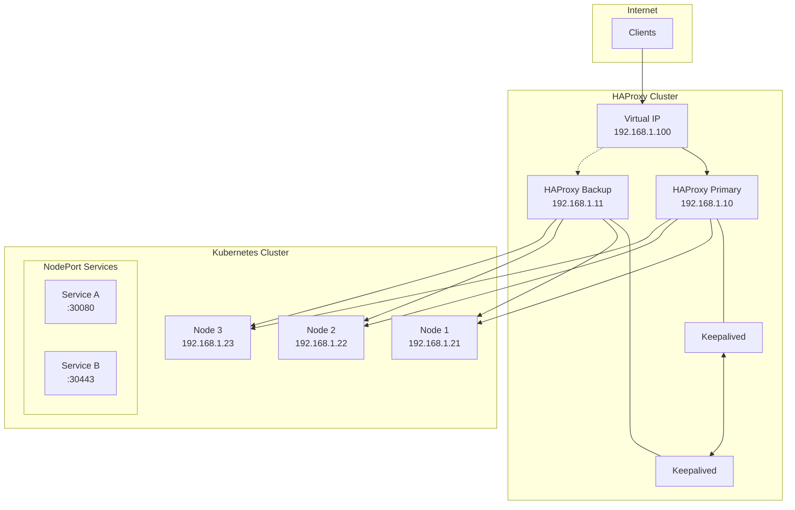

# How to Configure HAProxy for High Availability in Front of Kubernetes

Author: [nawazdhandala](https://www.github.com/nawazdhandala)

Tags: haproxy, kubernetes, high-availability, load-balancing, keepalived, tls-termination, failover

Description: A comprehensive guide to setting up HAProxy as a highly available load balancer in front of your Kubernetes cluster with health checks, failover, and TLS termination.

---

## Introduction

HAProxy (High Availability Proxy) is a powerful, open-source load balancer and proxy server that excels at distributing traffic across multiple backend servers. When placed in front of a Kubernetes cluster, HAProxy provides an additional layer of reliability, advanced traffic management, and TLS termination capabilities that complement Kubernetes' native load balancing.

This guide walks you through setting up a highly available HAProxy deployment that can handle production-grade traffic while ensuring zero downtime during failures.

## Architecture Overview



## Prerequisites

- Two or more servers for HAProxy (Ubuntu 22.04 LTS recommended)
- A running Kubernetes cluster with NodePort or LoadBalancer services
- Root or sudo access on HAProxy servers
- Basic understanding of networking concepts

## Installing HAProxy

### Step 1: Install HAProxy on Both Servers

```bash
# Update system packages
sudo apt update && sudo apt upgrade -y

# Install HAProxy
sudo apt install -y haproxy

# Verify installation
haproxy -v
```

### Step 2: Enable HAProxy Service

```bash
# Enable HAProxy to start on boot
sudo systemctl enable haproxy

# Start HAProxy
sudo systemctl start haproxy

# Check status
sudo systemctl status haproxy
```

## Configuring HAProxy

### Basic Configuration Structure

The HAProxy configuration file is located at `/etc/haproxy/haproxy.cfg`. Let's build a comprehensive configuration.

```bash
sudo cp /etc/haproxy/haproxy.cfg /etc/haproxy/haproxy.cfg.backup
sudo vim /etc/haproxy/haproxy.cfg
```

### Complete HAProxy Configuration

```haproxy
#---------------------------------------------------------------------
# Global settings
#---------------------------------------------------------------------
global
    log /dev/log local0
    log /dev/log local1 notice
    chroot /var/lib/haproxy
    stats socket /run/haproxy/admin.sock mode 660 level admin expose-fd listeners
    stats timeout 30s
    user haproxy
    group haproxy
    daemon

    # Default SSL material locations
    ca-base /etc/ssl/certs
    crt-base /etc/ssl/private

    # Modern SSL configuration
    ssl-default-bind-ciphersuites TLS_AES_128_GCM_SHA256:TLS_AES_256_GCM_SHA384:TLS_CHACHA20_POLY1305_SHA256
    ssl-default-bind-options ssl-min-ver TLSv1.2 no-tls-tickets

    # Performance tuning
    maxconn 50000
    tune.ssl.default-dh-param 2048

#---------------------------------------------------------------------
# Default settings
#---------------------------------------------------------------------
defaults
    log     global
    mode    http
    option  httplog
    option  dontlognull
    option  http-server-close
    option  forwardfor except 127.0.0.0/8
    option  redispatch
    retries 3
    timeout http-request    10s
    timeout queue           1m
    timeout connect         10s
    timeout client          1m
    timeout server          1m
    timeout http-keep-alive 10s
    timeout check           10s
    maxconn 3000

    # Enable compression
    compression algo gzip
    compression type text/html text/plain text/css application/javascript application/json

#---------------------------------------------------------------------
# Statistics page
#---------------------------------------------------------------------
listen stats
    bind *:8404
    mode http
    stats enable
    stats uri /stats
    stats refresh 10s
    stats admin if LOCALHOST
    stats auth admin:your-secure-password
    stats hide-version

#---------------------------------------------------------------------
# HTTP Frontend - Redirect to HTTPS
#---------------------------------------------------------------------
frontend http_front
    bind *:80
    mode http

    # ACME challenge for Let's Encrypt
    acl is_acme path_beg /.well-known/acme-challenge/
    use_backend acme_backend if is_acme

    # Redirect all other HTTP to HTTPS
    http-request redirect scheme https unless is_acme

#---------------------------------------------------------------------
# HTTPS Frontend
#---------------------------------------------------------------------
frontend https_front
    bind *:443 ssl crt /etc/haproxy/certs/combined.pem alpn h2,http/1.1
    mode http

    # Security headers
    http-response set-header Strict-Transport-Security "max-age=31536000; includeSubDomains; preload"
    http-response set-header X-Frame-Options "SAMEORIGIN"
    http-response set-header X-Content-Type-Options "nosniff"
    http-response set-header X-XSS-Protection "1; mode=block"

    # Logging
    option httplog
    log-format "%ci:%cp [%tr] %ft %b/%s %TR/%Tw/%Tc/%Tr/%Ta %ST %B %CC %CS %tsc %ac/%fc/%bc/%sc/%rc %sq/%bq %hr %hs %{+Q}r"

    # ACLs for routing
    acl host_app1 hdr(host) -i app1.example.com
    acl host_app2 hdr(host) -i app2.example.com
    acl host_api hdr(host) -i api.example.com
    acl path_api path_beg /api/

    # Rate limiting
    stick-table type ip size 100k expire 30s store http_req_rate(10s)
    http-request track-sc0 src
    http-request deny deny_status 429 if { sc_http_req_rate(0) gt 100 }

    # Route based on ACLs
    use_backend app1_backend if host_app1
    use_backend app2_backend if host_app2
    use_backend api_backend if host_api or path_api

    # Default backend
    default_backend kubernetes_default

#---------------------------------------------------------------------
# TCP Frontend for Non-HTTP Services (e.g., databases, gRPC)
#---------------------------------------------------------------------
frontend tcp_front
    bind *:5432
    mode tcp
    option tcplog
    default_backend postgres_backend

frontend grpc_front
    bind *:50051 ssl crt /etc/haproxy/certs/combined.pem alpn h2
    mode tcp
    option tcplog
    default_backend grpc_backend

#---------------------------------------------------------------------
# Backend Configurations
#---------------------------------------------------------------------

# Default Kubernetes backend
backend kubernetes_default
    mode http
    balance roundrobin
    option httpchk GET /healthz HTTP/1.1\r\nHost:\ kubernetes.default.svc
    http-check expect status 200

    # Kubernetes nodes with NodePort
    server k8s-node1 192.168.1.21:30080 check inter 5s fall 3 rise 2 weight 100
    server k8s-node2 192.168.1.22:30080 check inter 5s fall 3 rise 2 weight 100
    server k8s-node3 192.168.1.23:30080 check inter 5s fall 3 rise 2 weight 100

# Application 1 Backend
backend app1_backend
    mode http
    balance leastconn
    option httpchk GET /health HTTP/1.1\r\nHost:\ app1.example.com
    http-check expect status 200

    # Cookie-based session persistence
    cookie SERVERID insert indirect nocache

    server k8s-node1 192.168.1.21:30081 check cookie s1 inter 5s fall 3 rise 2
    server k8s-node2 192.168.1.22:30081 check cookie s2 inter 5s fall 3 rise 2
    server k8s-node3 192.168.1.23:30081 check cookie s3 inter 5s fall 3 rise 2

# Application 2 Backend
backend app2_backend
    mode http
    balance source
    hash-type consistent
    option httpchk GET /ready HTTP/1.1\r\nHost:\ app2.example.com
    http-check expect status 200

    server k8s-node1 192.168.1.21:30082 check inter 5s fall 3 rise 2
    server k8s-node2 192.168.1.22:30082 check inter 5s fall 3 rise 2
    server k8s-node3 192.168.1.23:30082 check inter 5s fall 3 rise 2

# API Backend with circuit breaker pattern
backend api_backend
    mode http
    balance roundrobin
    option httpchk GET /api/health HTTP/1.1\r\nHost:\ api.example.com
    http-check expect status 200

    # Circuit breaker: if 50% of requests fail, mark server down
    default-server inter 3s fall 2 rise 3 on-marked-down shutdown-sessions

    # Retry on connection failure
    retries 3
    option redispatch

    server k8s-node1 192.168.1.21:30083 check weight 100
    server k8s-node2 192.168.1.22:30083 check weight 100
    server k8s-node3 192.168.1.23:30083 check weight 100

# PostgreSQL Backend (TCP mode)
backend postgres_backend
    mode tcp
    balance leastconn
    option pgsql-check user haproxy

    server k8s-node1 192.168.1.21:30432 check inter 5s fall 3 rise 2
    server k8s-node2 192.168.1.22:30432 check inter 5s fall 3 rise 2 backup

# gRPC Backend
backend grpc_backend
    mode tcp
    balance roundrobin
    option httpchk
    http-check connect ssl alpn h2
    http-check send meth GET uri /grpc.health.v1.Health/Check
    http-check expect status 200

    server k8s-node1 192.168.1.21:30051 check inter 5s fall 3 rise 2
    server k8s-node2 192.168.1.22:30051 check inter 5s fall 3 rise 2
    server k8s-node3 192.168.1.23:30051 check inter 5s fall 3 rise 2

# ACME Backend for Let's Encrypt
backend acme_backend
    mode http
    server acme 127.0.0.1:8080
```

## Setting Up TLS Termination

### Step 1: Generate or Obtain SSL Certificates

```bash
# Create certificate directory
sudo mkdir -p /etc/haproxy/certs

# Option 1: Using Let's Encrypt with Certbot
sudo apt install -y certbot

# Stop HAProxy temporarily to use standalone mode
sudo systemctl stop haproxy

# Obtain certificate
sudo certbot certonly --standalone -d example.com -d www.example.com

# Combine certificate and key for HAProxy
sudo cat /etc/letsencrypt/live/example.com/fullchain.pem \
    /etc/letsencrypt/live/example.com/privkey.pem \
    | sudo tee /etc/haproxy/certs/combined.pem

# Set proper permissions
sudo chmod 600 /etc/haproxy/certs/combined.pem

# Restart HAProxy
sudo systemctl start haproxy
```

### Step 2: Auto-Renewal Script

Create a renewal script at `/usr/local/bin/haproxy-cert-renewal.sh`:

```bash
#!/bin/bash

# Renew certificates
certbot renew --pre-hook "systemctl stop haproxy" --post-hook "systemctl start haproxy"

# Combine certificates for HAProxy
for domain in /etc/letsencrypt/live/*/; do
    domain_name=$(basename "$domain")
    cat "${domain}fullchain.pem" "${domain}privkey.pem" > "/etc/haproxy/certs/${domain_name}.pem"
done

# Reload HAProxy
systemctl reload haproxy
```

```bash
# Make script executable
sudo chmod +x /usr/local/bin/haproxy-cert-renewal.sh

# Add to crontab
echo "0 3 * * * /usr/local/bin/haproxy-cert-renewal.sh" | sudo tee -a /etc/crontab
```

## Configuring Keepalived for Failover

Keepalived provides Virtual IP (VIP) failover between HAProxy instances using VRRP protocol.

### Step 1: Install Keepalived

```bash
sudo apt install -y keepalived
```

### Step 2: Configure Primary HAProxy Server

Create `/etc/keepalived/keepalived.conf` on the primary server:

```bash
global_defs {
    router_id HAPROXY_PRIMARY
    script_user root
    enable_script_security

    # Email notifications
    notification_email {
        admin@example.com
    }
    notification_email_from haproxy@example.com
    smtp_server 127.0.0.1
    smtp_connect_timeout 30
}

# Health check script for HAProxy
vrrp_script check_haproxy {
    script "/usr/bin/killall -0 haproxy"
    interval 2
    weight 2
    fall 3
    rise 2
}

# Alternative: More comprehensive health check
vrrp_script check_haproxy_advanced {
    script "/usr/local/bin/check_haproxy.sh"
    interval 2
    timeout 3
    weight 2
    fall 3
    rise 2
}

vrrp_instance VI_1 {
    state MASTER
    interface eth0
    virtual_router_id 51
    priority 101
    advert_int 1

    authentication {
        auth_type PASS
        auth_pass your-secret-password
    }

    virtual_ipaddress {
        192.168.1.100/24
    }

    track_script {
        check_haproxy
    }

    # Notify scripts
    notify_master "/usr/local/bin/notify_master.sh"
    notify_backup "/usr/local/bin/notify_backup.sh"
    notify_fault "/usr/local/bin/notify_fault.sh"
}
```

### Step 3: Configure Backup HAProxy Server

Create `/etc/keepalived/keepalived.conf` on the backup server:

```bash
global_defs {
    router_id HAPROXY_BACKUP
    script_user root
    enable_script_security
}

vrrp_script check_haproxy {
    script "/usr/bin/killall -0 haproxy"
    interval 2
    weight 2
    fall 3
    rise 2
}

vrrp_instance VI_1 {
    state BACKUP
    interface eth0
    virtual_router_id 51
    priority 100
    advert_int 1

    authentication {
        auth_type PASS
        auth_pass your-secret-password
    }

    virtual_ipaddress {
        192.168.1.100/24
    }

    track_script {
        check_haproxy
    }
}
```

### Step 4: Create Health Check Script

Create `/usr/local/bin/check_haproxy.sh`:

```bash
#!/bin/bash

# Check if HAProxy process is running
if ! pidof haproxy > /dev/null; then
    exit 1
fi

# Check if HAProxy is responding on stats port
if ! curl -sf http://127.0.0.1:8404/stats > /dev/null 2>&1; then
    exit 1
fi

# Check if HAProxy is accepting connections on main port
if ! nc -z 127.0.0.1 443 > /dev/null 2>&1; then
    exit 1
fi

exit 0
```

```bash
sudo chmod +x /usr/local/bin/check_haproxy.sh
```

### Step 5: Create Notification Scripts

Create `/usr/local/bin/notify_master.sh`:

```bash
#!/bin/bash
logger "HAProxy: Transitioning to MASTER state"
echo "$(date): HAProxy became MASTER" >> /var/log/keepalived-state.log

# Optional: Send notification
# curl -X POST "https://hooks.slack.com/services/YOUR/WEBHOOK/URL" \
#     -H 'Content-type: application/json' \
#     --data '{"text":"HAProxy: Server became MASTER"}'
```

```bash
sudo chmod +x /usr/local/bin/notify_master.sh
sudo chmod +x /usr/local/bin/notify_backup.sh
sudo chmod +x /usr/local/bin/notify_fault.sh
```

### Step 6: Enable IP Forwarding

```bash
# Enable IP forwarding
echo "net.ipv4.ip_nonlocal_bind=1" | sudo tee -a /etc/sysctl.conf
echo "net.ipv4.ip_forward=1" | sudo tee -a /etc/sysctl.conf
sudo sysctl -p

# Start Keepalived
sudo systemctl enable keepalived
sudo systemctl start keepalived
```

## Health Checks Configuration

### HTTP Health Check Examples

```haproxy
# Basic HTTP health check
backend basic_http_check
    option httpchk GET /health
    http-check expect status 200
    server srv1 192.168.1.21:30080 check

# Health check with custom headers
backend custom_headers_check
    option httpchk
    http-check send meth GET uri /health hdr Host example.com hdr User-Agent HAProxy
    http-check expect status 200
    server srv1 192.168.1.21:30080 check

# Health check expecting specific content
backend content_check
    option httpchk GET /health
    http-check expect string "healthy"
    server srv1 192.168.1.21:30080 check

# Multiple health check conditions
backend multi_check
    option httpchk
    http-check connect
    http-check send meth GET uri /ready
    http-check expect status 200
    http-check send meth GET uri /health
    http-check expect status 200
    server srv1 192.168.1.21:30080 check
```

### TCP Health Check Examples

```haproxy
# Basic TCP check (connection only)
backend tcp_basic
    mode tcp
    option tcp-check
    server srv1 192.168.1.21:30432 check

# MySQL health check
backend mysql_check
    mode tcp
    option mysql-check user haproxy
    server srv1 192.168.1.21:30306 check

# Redis health check
backend redis_check
    mode tcp
    option tcp-check
    tcp-check send PING\r\n
    tcp-check expect string +PONG
    server srv1 192.168.1.21:30379 check

# SMTP health check
backend smtp_check
    mode tcp
    option smtpchk EHLO haproxy.local
    server srv1 192.168.1.21:30025 check
```

## Kubernetes Service Configuration

### NodePort Service Example

```yaml
apiVersion: v1
kind: Service
metadata:
  name: web-application
  namespace: production
spec:
  type: NodePort
  selector:
    app: web-application
  ports:
    - name: http
      port: 80
      targetPort: 8080
      nodePort: 30080
    - name: https
      port: 443
      targetPort: 8443
      nodePort: 30443
---
apiVersion: apps/v1
kind: Deployment
metadata:
  name: web-application
  namespace: production
spec:
  replicas: 3
  selector:
    matchLabels:
      app: web-application
  template:
    metadata:
      labels:
        app: web-application
    spec:
      containers:
        - name: web-app
          image: nginx:latest
          ports:
            - containerPort: 8080
            - containerPort: 8443
          readinessProbe:
            httpGet:
              path: /health
              port: 8080
            initialDelaySeconds: 5
            periodSeconds: 10
          livenessProbe:
            httpGet:
              path: /health
              port: 8080
            initialDelaySeconds: 15
            periodSeconds: 20
```

### Headless Service for Direct Pod Communication

```yaml
apiVersion: v1
kind: Service
metadata:
  name: web-application-headless
  namespace: production
spec:
  type: ClusterIP
  clusterIP: None
  selector:
    app: web-application
  ports:
    - port: 8080
      targetPort: 8080
```

## Advanced Configuration

### Dynamic Server Discovery with Consul

```haproxy
# Using HAProxy with Consul for dynamic backends
backend dynamic_backend
    mode http
    balance roundrobin
    option httpchk GET /health

    # Server template for dynamic discovery
    server-template web 10 _web._tcp.service.consul resolvers consul resolve-prefer ipv4 check

resolvers consul
    nameserver consul 127.0.0.1:8600
    accepted_payload_size 8192
    hold valid 5s
```

### Rate Limiting and DDoS Protection

```haproxy
frontend https_front
    bind *:443 ssl crt /etc/haproxy/certs/combined.pem

    # Stick table for tracking
    stick-table type ip size 200k expire 5m store http_req_rate(10s),http_err_rate(10s),conn_cur,conn_rate(10s)

    # Track client
    http-request track-sc0 src

    # Rate limiting rules
    acl too_many_requests sc_http_req_rate(0) gt 100
    acl too_many_errors sc_http_err_rate(0) gt 50
    acl too_many_connections sc_conn_rate(0) gt 20
    acl too_many_concurrent sc_conn_cur(0) gt 10

    # Block abusive clients
    http-request deny deny_status 429 if too_many_requests
    http-request deny deny_status 429 if too_many_errors
    http-request deny deny_status 429 if too_many_connections
    http-request deny deny_status 429 if too_many_concurrent

    # Tarpit suspicious requests
    http-request tarpit if { src -f /etc/haproxy/blacklist.txt }
```

### Connection Draining for Zero-Downtime Deployments

```haproxy
backend graceful_backend
    mode http
    balance roundrobin

    # Enable connection draining
    option http-pretend-keepalive
    option forwardfor

    # Graceful shutdown settings
    default-server inter 3s fall 2 rise 2 slowstart 60s

    server k8s-node1 192.168.1.21:30080 check weight 100
    server k8s-node2 192.168.1.22:30080 check weight 100
    server k8s-node3 192.168.1.23:30080 check weight 100
```

## Monitoring and Observability

### Prometheus Metrics Export

```haproxy
# Enable Prometheus metrics
frontend prometheus
    bind *:9101
    mode http
    http-request use-service prometheus-exporter if { path /metrics }
    stats enable
    stats uri /stats
    stats refresh 10s
```

### Logging Configuration

```bash
# Configure rsyslog for HAProxy
sudo vim /etc/rsyslog.d/49-haproxy.conf
```

```
# HAProxy logging configuration
$AddUnixListenSocket /var/lib/haproxy/dev/log

# Create separate log files
local0.* /var/log/haproxy/haproxy.log
local1.* /var/log/haproxy/haproxy-notice.log

# Prevent duplicate logging
& stop
```

```bash
# Create log directory
sudo mkdir -p /var/log/haproxy
sudo chown syslog:adm /var/log/haproxy

# Restart rsyslog
sudo systemctl restart rsyslog
```

### Log Rotation

Create `/etc/logrotate.d/haproxy`:

```
/var/log/haproxy/*.log {
    daily
    rotate 14
    missingok
    notifempty
    compress
    delaycompress
    postrotate
        /usr/bin/systemctl reload rsyslog > /dev/null 2>&1 || true
    endscript
}
```

## Troubleshooting

### Common Issues and Solutions

#### 1. HAProxy Won't Start

```bash
# Check configuration syntax
sudo haproxy -c -f /etc/haproxy/haproxy.cfg

# Check for port conflicts
sudo netstat -tlpn | grep -E ':80|:443'

# View detailed errors
sudo journalctl -u haproxy -n 50
```

#### 2. Backend Servers Marked as DOWN

```bash
# Check backend status via stats page
curl -u admin:password http://localhost:8404/stats

# Test connectivity to backend
nc -zv 192.168.1.21 30080

# Check health endpoint
curl -v http://192.168.1.21:30080/health
```

#### 3. Keepalived VIP Not Failing Over

```bash
# Check Keepalived status
sudo systemctl status keepalived

# View VRRP state
sudo journalctl -u keepalived -f

# Check VIP assignment
ip addr show eth0

# Verify VRRP traffic
sudo tcpdump -i eth0 vrrp
```

#### 4. SSL/TLS Certificate Issues

```bash
# Verify certificate
openssl x509 -in /etc/haproxy/certs/combined.pem -text -noout

# Test SSL connection
openssl s_client -connect localhost:443 -servername example.com

# Check certificate chain
openssl verify -CAfile /etc/ssl/certs/ca-certificates.crt /etc/haproxy/certs/combined.pem
```

#### 5. High Latency

```bash
# Check HAProxy stats for queue times
echo "show stat" | sudo socat /run/haproxy/admin.sock stdio

# Monitor connections
echo "show info" | sudo socat /run/haproxy/admin.sock stdio

# Check backend response times
echo "show servers state" | sudo socat /run/haproxy/admin.sock stdio
```

### HAProxy Runtime Commands

```bash
# Disable a server
echo "disable server kubernetes_default/k8s-node1" | sudo socat /run/haproxy/admin.sock stdio

# Enable a server
echo "enable server kubernetes_default/k8s-node1" | sudo socat /run/haproxy/admin.sock stdio

# Set server weight
echo "set server kubernetes_default/k8s-node1 weight 50" | sudo socat /run/haproxy/admin.sock stdio

# Set server to drain mode
echo "set server kubernetes_default/k8s-node1 state drain" | sudo socat /run/haproxy/admin.sock stdio

# View current sessions
echo "show sess" | sudo socat /run/haproxy/admin.sock stdio

# Clear stick table
echo "clear table https_front" | sudo socat /run/haproxy/admin.sock stdio
```

## Testing the Setup

### Failover Test Script

```bash
#!/bin/bash

VIP="192.168.1.100"
INTERVAL=1

echo "Starting failover monitoring for VIP: $VIP"
echo "Press Ctrl+C to stop"

while true; do
    RESPONSE=$(curl -s -o /dev/null -w "%{http_code}" --connect-timeout 2 "http://$VIP/health" 2>/dev/null)
    TIMESTAMP=$(date '+%Y-%m-%d %H:%M:%S')

    if [ "$RESPONSE" == "200" ]; then
        echo "[$TIMESTAMP] VIP responding - HTTP $RESPONSE"
    else
        echo "[$TIMESTAMP] VIP NOT responding - HTTP $RESPONSE"
    fi

    sleep $INTERVAL
done
```

### Load Test

```bash
# Install hey load testing tool
go install github.com/rakyll/hey@latest

# Run load test
hey -n 10000 -c 100 -m GET https://192.168.1.100/api/health

# With keepalive connections
hey -n 10000 -c 100 -disable-keepalive=false https://192.168.1.100/api/health
```

## Conclusion

You now have a production-ready HAProxy setup providing high availability for your Kubernetes cluster. This configuration includes:

- Layer 7 load balancing with multiple backend routing strategies
- TLS termination with automatic certificate renewal
- High availability with Keepalived and Virtual IP failover
- Comprehensive health checks for HTTP and TCP services
- Rate limiting and DDoS protection
- Detailed logging and monitoring capabilities

Remember to regularly test your failover procedures, monitor HAProxy metrics, and keep both HAProxy and Keepalived updated with security patches.
