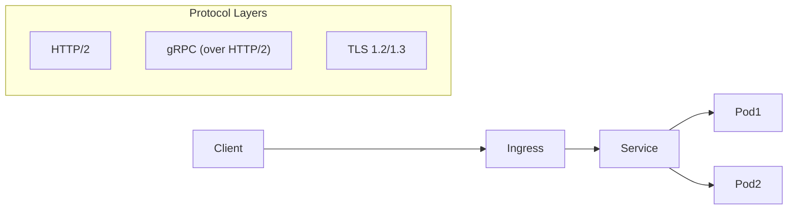
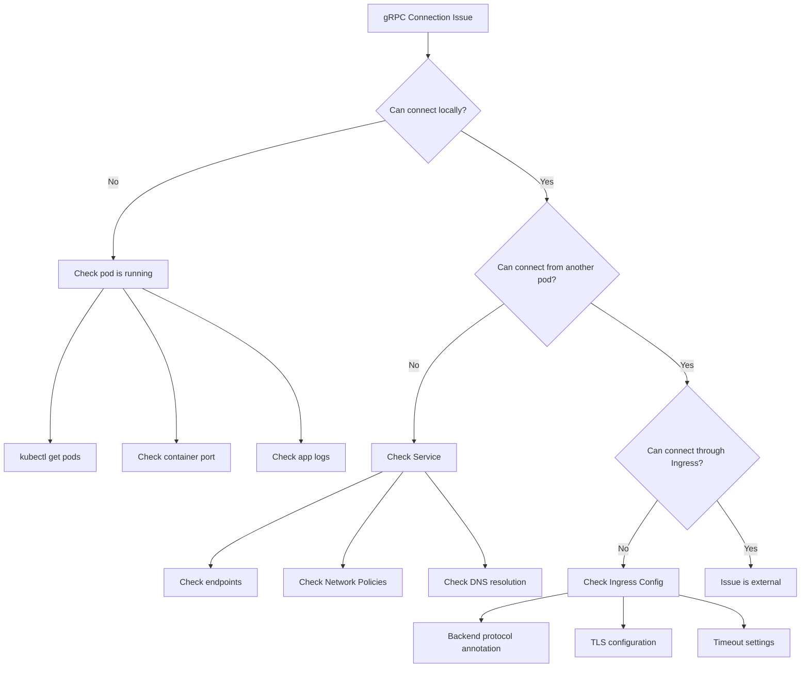

# How to Debug HTTP/2 and gRPC Connectivity Issues in Kubernetes

Author: [nawazdhandala](https://www.github.com/nawazdhandala)

Tags: Kubernetes, gRPC, HTTP, Debugging, Troubleshooting, TLS, Ingress, DevOps, Networking

Description: A comprehensive guide to debugging HTTP/2 and gRPC connectivity issues in Kubernetes using grpcurl, grpc-health-probe, and other diagnostic tools.

---

HTTP/2 and gRPC connectivity issues in Kubernetes can be particularly challenging to diagnose. Unlike HTTP/1.1, HTTP/2's multiplexed connections and gRPC's binary protocol require specialized debugging techniques. This guide covers the essential tools and methods for troubleshooting these protocols.

## Understanding HTTP/2 and gRPC in Kubernetes

Before diving into debugging, let's understand how these protocols work in Kubernetes:



### Key Differences from HTTP/1.1

| Feature | HTTP/1.1 | HTTP/2/gRPC |
|---------|----------|-------------|
| Connection | One request per connection | Multiplexed streams |
| Headers | Text-based | Binary (HPACK compressed) |
| Load Balancing | Per-connection | Per-request (requires L7) |
| Debugging | curl, wget | grpcurl, grpc-health-probe |

## Essential Debugging Tools

### Installing grpcurl

`grpcurl` is like curl for gRPC services:

```bash
# macOS
brew install grpcurl

# Linux
go install github.com/fullstorydev/grpcurl/cmd/grpcurl@latest

# Or download binary
wget https://github.com/fullstorydev/grpcurl/releases/download/v1.8.9/grpcurl_1.8.9_linux_x86_64.tar.gz
tar -xzf grpcurl_1.8.9_linux_x86_64.tar.gz
sudo mv grpcurl /usr/local/bin/
```

### Installing grpc-health-probe

For health checking gRPC services:

```bash
# Download binary
GRPC_HEALTH_PROBE_VERSION=v0.4.25
wget -qO/bin/grpc_health_probe https://github.com/grpc-ecosystem/grpc-health-probe/releases/download/${GRPC_HEALTH_PROBE_VERSION}/grpc_health_probe-linux-amd64
chmod +x /bin/grpc_health_probe
```

### Debug Container with All Tools

Create a debug pod with all necessary tools:

```yaml
apiVersion: v1
kind: Pod
metadata:
  name: grpc-debug
  namespace: default
spec:
  containers:
  - name: debug
    image: nicolaka/netshoot
    command: ["sleep", "infinity"]
    env:
    - name: GRPC_GO_LOG_VERBOSITY_LEVEL
      value: "99"
    - name: GRPC_GO_LOG_SEVERITY_LEVEL
      value: "info"
```

```bash
kubectl apply -f debug-pod.yaml
kubectl exec -it grpc-debug -- bash
```

## Debugging gRPC Services

### Basic Connectivity Test

```bash
# List available services (requires reflection)
grpcurl -plaintext my-grpc-service:50051 list

# List methods in a service
grpcurl -plaintext my-grpc-service:50051 list mypackage.MyService

# Describe a method
grpcurl -plaintext my-grpc-service:50051 describe mypackage.MyService.GetItem
```

### Call gRPC Methods

```bash
# Unary call
grpcurl -plaintext \
  -d '{"id": "123"}' \
  my-grpc-service:50051 \
  mypackage.MyService/GetItem

# With headers/metadata
grpcurl -plaintext \
  -H "authorization: Bearer token123" \
  -d '{"query": "test"}' \
  my-grpc-service:50051 \
  mypackage.MyService/Search

# Streaming call
grpcurl -plaintext \
  -d '{"subscribe": true}' \
  my-grpc-service:50051 \
  mypackage.MyService/StreamUpdates
```

### Without Server Reflection

If reflection is disabled, use proto files:

```bash
# With proto file
grpcurl -plaintext \
  -import-path ./protos \
  -proto myservice.proto \
  -d '{"id": "123"}' \
  my-grpc-service:50051 \
  mypackage.MyService/GetItem
```

## Health Checking gRPC Services

### Using grpc-health-probe

```bash
# Basic health check
grpc_health_probe -addr=my-grpc-service:50051

# Check specific service
grpc_health_probe -addr=my-grpc-service:50051 -service=mypackage.MyService

# With timeout
grpc_health_probe -addr=my-grpc-service:50051 -connect-timeout=5s -rpc-timeout=5s
```

### Using grpcurl for Health

```bash
# Standard gRPC health check
grpcurl -plaintext \
  -d '{"service": "mypackage.MyService"}' \
  my-grpc-service:50051 \
  grpc.health.v1.Health/Check

# Watch health status
grpcurl -plaintext \
  -d '{"service": "mypackage.MyService"}' \
  my-grpc-service:50051 \
  grpc.health.v1.Health/Watch
```

### Kubernetes Health Probes for gRPC

```yaml
apiVersion: v1
kind: Pod
metadata:
  name: grpc-server
spec:
  containers:
  - name: server
    image: my-grpc-server:latest
    ports:
    - containerPort: 50051
    livenessProbe:
      grpc:
        port: 50051
      initialDelaySeconds: 10
      periodSeconds: 10
    readinessProbe:
      grpc:
        port: 50051
        service: "mypackage.MyService"
      initialDelaySeconds: 5
      periodSeconds: 5
```

## Debugging HTTP/2 Connections

### Check HTTP/2 Support

```bash
# Test HTTP/2 with curl
curl -v --http2 https://my-service.example.com/

# Force HTTP/2 prior knowledge (h2c)
curl -v --http2-prior-knowledge http://my-service:8080/

# Check ALPN negotiation
echo | openssl s_client -alpn h2 -connect my-service.example.com:443 2>/dev/null | grep ALPN
```

### HTTP/2 Connection Details

```bash
# Verbose HTTP/2 connection info
curl -v --http2 -o /dev/null https://my-service.example.com/ 2>&1 | grep -E "(ALPN|HTTP/2|stream)"

# Check HTTP/2 frames with nghttp
nghttp -v https://my-service.example.com/
```

### Debug HTTP/2 with wireshark/tcpdump

```bash
# Capture traffic on pod
kubectl debug -it my-pod --image=nicolaka/netshoot -- tcpdump -i eth0 -w /tmp/capture.pcap port 50051

# Copy pcap file
kubectl cp my-pod:/tmp/capture.pcap ./capture.pcap

# For TLS traffic, export SSLKEYLOGFILE
# In your application:
# export SSLKEYLOGFILE=/tmp/keys.log
```

## Common Connectivity Issues

### Issue 1: Connection Refused

```bash
# Symptoms
grpcurl -plaintext my-service:50051 list
# Error: Failed to dial target: connection refused

# Diagnosis
# Check if service exists
kubectl get svc my-service

# Check endpoints
kubectl get endpoints my-service

# Check pod is running and listening
kubectl get pods -l app=my-service
kubectl exec my-service-pod -- netstat -tlnp | grep 50051
```

**Solutions:**

```yaml
# Ensure service port matches container port
apiVersion: v1
kind: Service
metadata:
  name: my-service
spec:
  ports:
  - name: grpc
    port: 50051
    targetPort: 50051  # Must match container port
    protocol: TCP
  selector:
    app: my-service
```

### Issue 2: TLS Handshake Failures

```bash
# Symptoms
grpcurl my-service:50051 list
# Error: tls: failed to verify certificate

# Diagnosis
# Check certificate
echo | openssl s_client -connect my-service:50051 2>/dev/null | openssl x509 -noout -dates -subject

# Check certificate chain
openssl s_client -showcerts -connect my-service:50051 </dev/null
```

**Solutions:**

```bash
# Skip TLS verification (testing only)
grpcurl -insecure my-service:50051 list

# Use custom CA certificate
grpcurl -cacert /path/to/ca.crt my-service:50051 list

# Use client certificate (mTLS)
grpcurl -cacert ca.crt -cert client.crt -key client.key my-service:50051 list
```

### Issue 3: Ingress Not Routing gRPC

```bash
# Symptoms
# gRPC works inside cluster but not through ingress
grpcurl -insecure grpc.example.com:443 list
# Error: unexpected HTTP status code: 503
```

**Solutions for NGINX Ingress:**

```yaml
apiVersion: networking.k8s.io/v1
kind: Ingress
metadata:
  name: grpc-ingress
  annotations:
    nginx.ingress.kubernetes.io/backend-protocol: "GRPC"
    nginx.ingress.kubernetes.io/ssl-redirect: "true"
    nginx.ingress.kubernetes.io/proxy-read-timeout: "3600"
    nginx.ingress.kubernetes.io/proxy-send-timeout: "3600"
spec:
  ingressClassName: nginx
  tls:
  - hosts:
    - grpc.example.com
    secretName: grpc-tls
  rules:
  - host: grpc.example.com
    http:
      paths:
      - path: /
        pathType: Prefix
        backend:
          service:
            name: my-grpc-service
            port:
              number: 50051
```

**Solutions for Traefik:**

```yaml
apiVersion: traefik.containo.us/v1alpha1
kind: IngressRoute
metadata:
  name: grpc-ingress
spec:
  entryPoints:
    - websecure
  routes:
    - match: Host(`grpc.example.com`)
      kind: Rule
      services:
        - name: my-grpc-service
          port: 50051
          scheme: h2c
  tls:
    secretName: grpc-tls
```

### Issue 4: Load Balancing Not Working

gRPC uses long-lived HTTP/2 connections, which can cause load balancing issues:

```bash
# Symptoms
# All requests go to one pod

# Check which pods receive traffic
kubectl logs -l app=my-grpc-service --all-containers | grep -c "request received"
```

**Solution: Client-side load balancing:**

```go
// Go client with round-robin
import "google.golang.org/grpc/balancer/roundrobin"

conn, err := grpc.Dial(
    "dns:///my-grpc-service:50051",
    grpc.WithDefaultServiceConfig(`{"loadBalancingPolicy":"round_robin"}`),
    grpc.WithTransportCredentials(insecure.NewCredentials()),
)
```

**Solution: Use headless service:**

```yaml
apiVersion: v1
kind: Service
metadata:
  name: my-grpc-service-headless
spec:
  clusterIP: None  # Headless
  ports:
  - name: grpc
    port: 50051
    targetPort: 50051
  selector:
    app: my-grpc-service
```

### Issue 5: Timeouts and Deadlines

```bash
# Symptoms
grpcurl -plaintext my-service:50051 mypackage.MyService/LongRunningMethod
# Error: context deadline exceeded
```

**Solutions:**

```bash
# Increase timeout in grpcurl
grpcurl -plaintext -max-time 60 my-service:50051 mypackage.MyService/LongRunningMethod
```

```yaml
# Ingress timeout configuration
apiVersion: networking.k8s.io/v1
kind: Ingress
metadata:
  annotations:
    nginx.ingress.kubernetes.io/proxy-read-timeout: "3600"
    nginx.ingress.kubernetes.io/proxy-send-timeout: "3600"
    nginx.ingress.kubernetes.io/grpc-read-timeout: "3600"
    nginx.ingress.kubernetes.io/grpc-send-timeout: "3600"
```

### Issue 6: RST_STREAM Errors

```bash
# Symptoms
# Error: stream terminated by RST_STREAM with error code: INTERNAL_ERROR

# Common causes:
# 1. Server crash
# 2. Max connection age exceeded
# 3. Keepalive timeout
# 4. Ingress/proxy terminating connection
```

**Debug with verbose logging:**

```bash
# Enable gRPC debug logging
export GRPC_GO_LOG_VERBOSITY_LEVEL=99
export GRPC_GO_LOG_SEVERITY_LEVEL=info
export GRPC_TRACE=all
export GRPC_VERBOSITY=DEBUG

# Run your client
grpcurl -plaintext -v my-service:50051 list
```

## Debugging TLS/mTLS Issues

### Certificate Verification

```bash
# Check server certificate
echo | openssl s_client -connect my-service:50051 2>/dev/null | openssl x509 -text -noout

# Verify certificate chain
openssl verify -CAfile ca.crt server.crt

# Check certificate expiration
echo | openssl s_client -connect my-service:50051 2>/dev/null | openssl x509 -noout -enddate

# Check SAN (Subject Alternative Names)
echo | openssl s_client -connect my-service:50051 2>/dev/null | openssl x509 -noout -ext subjectAltName
```

### mTLS Debugging

```bash
# Test mTLS connection
grpcurl \
  -cacert ca.crt \
  -cert client.crt \
  -key client.key \
  my-service:50051 list

# Common mTLS errors:
# "certificate required" - Client cert not provided
# "bad certificate" - Client cert not signed by expected CA
# "certificate verify failed" - Server cert not trusted
```

### Kubernetes TLS Secrets

```bash
# Check TLS secret exists
kubectl get secret grpc-tls -o yaml

# Decode and verify certificate
kubectl get secret grpc-tls -o jsonpath='{.data.tls\.crt}' | base64 -d | openssl x509 -text -noout

# Check secret is mounted correctly
kubectl exec my-pod -- ls -la /etc/tls/
kubectl exec my-pod -- cat /etc/tls/tls.crt | openssl x509 -noout -subject
```

## Network Policy Debugging

### Check if Network Policies Block gRPC

```bash
# List network policies
kubectl get networkpolicies -A

# Check if policy allows gRPC port
kubectl describe networkpolicy my-policy
```

### Allow gRPC Traffic

```yaml
apiVersion: networking.k8s.io/v1
kind: NetworkPolicy
metadata:
  name: allow-grpc
spec:
  podSelector:
    matchLabels:
      app: my-grpc-service
  policyTypes:
  - Ingress
  ingress:
  - from:
    - podSelector:
        matchLabels:
          app: my-grpc-client
    ports:
    - protocol: TCP
      port: 50051
```

## Service Mesh Debugging

### Istio gRPC Issues

```bash
# Check Envoy sidecar logs
kubectl logs my-pod -c istio-proxy

# Check Envoy config for gRPC route
istioctl proxy-config routes my-pod --name 50051 -o json

# Test through sidecar
kubectl exec my-pod -c istio-proxy -- curl -v localhost:50051
```

```yaml
# Istio DestinationRule for gRPC
apiVersion: networking.istio.io/v1beta1
kind: DestinationRule
metadata:
  name: grpc-service-dr
spec:
  host: my-grpc-service
  trafficPolicy:
    connectionPool:
      http:
        h2UpgradePolicy: UPGRADE
    loadBalancer:
      simple: ROUND_ROBIN
```

### Linkerd gRPC Issues

```bash
# Check Linkerd proxy stats
linkerd stat deploy/my-grpc-service

# View live traffic
linkerd tap deploy/my-grpc-service

# Check gRPC success rate
linkerd routes deploy/my-grpc-service --to svc/backend-service
```

## Debugging Flow Chart



## Diagnostic Script

Create a comprehensive diagnostic script:

```bash
#!/bin/bash
# grpc-debug.sh - gRPC connectivity diagnostic script

SERVICE=$1
PORT=${2:-50051}

echo "=== gRPC Connectivity Diagnostic ==="
echo "Service: $SERVICE:$PORT"
echo ""

# Check DNS resolution
echo "--- DNS Resolution ---"
nslookup $SERVICE 2>/dev/null || echo "DNS resolution failed"
echo ""

# Check TCP connectivity
echo "--- TCP Connectivity ---"
nc -zv $SERVICE $PORT 2>&1 || echo "TCP connection failed"
echo ""

# Check gRPC reflection
echo "--- gRPC Reflection ---"
grpcurl -plaintext -connect-timeout 5 $SERVICE:$PORT list 2>&1 || echo "gRPC reflection unavailable"
echo ""

# Check gRPC health
echo "--- gRPC Health Check ---"
grpc_health_probe -addr=$SERVICE:$PORT -connect-timeout=5s 2>&1 || echo "Health check failed"
echo ""

# Check HTTP/2 support
echo "--- HTTP/2 Support ---"
curl -so /dev/null -w "HTTP Version: %{http_version}\n" --http2-prior-knowledge http://$SERVICE:$PORT/ 2>/dev/null || echo "HTTP/2 check failed"
echo ""

echo "=== Diagnostic Complete ==="
```

## Best Practices

1. **Enable gRPC reflection in development** - Makes debugging much easier
2. **Implement health checking** - Use the standard gRPC health protocol
3. **Use meaningful deadlines** - Set appropriate timeouts for each RPC
4. **Log correlation IDs** - Pass request IDs through metadata
5. **Monitor gRPC metrics** - Track latency, error rates, and connection counts
6. **Test through all layers** - Verify connectivity at pod, service, and ingress levels
7. **Use headless services** - For proper gRPC load balancing
8. **Configure keepalives** - Prevent idle connection termination

---

Debugging HTTP/2 and gRPC connectivity requires understanding the protocol differences and using the right tools. With grpcurl, grpc-health-probe, and systematic debugging approaches, you can quickly identify and resolve connectivity issues in your Kubernetes gRPC services.
