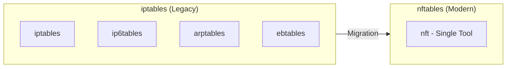
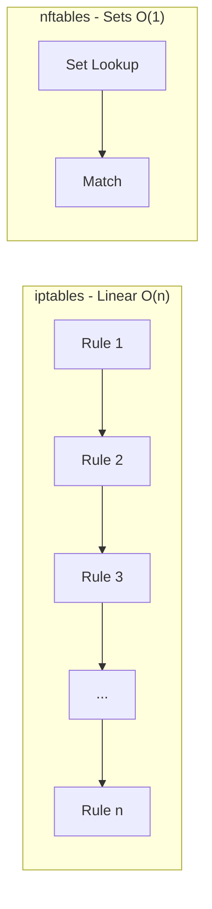
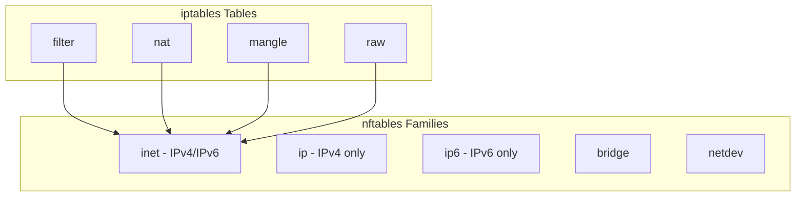
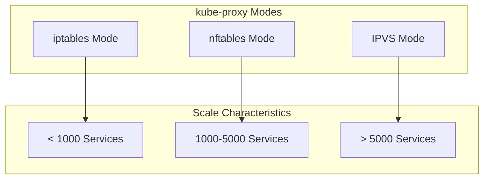

# How to Migrate from iptables to nftables in Kubernetes Clusters

Author: [nawazdhandala](https://www.github.com/nawazdhandala)

Tags: Kubernetes, Networking, iptables, nftables, kube-proxy, Linux, Security, DevOps

Description: A comprehensive guide to migrating Kubernetes clusters from iptables to nftables, covering rule translation, kube-proxy configuration, and compatibility considerations.

---

The Linux networking stack is moving from iptables to nftables. Major distributions have already made the switch: RHEL 8+, Debian 10+, Ubuntu 20.04+, and Fedora 18+ all use nftables as the default firewall framework. If you're running Kubernetes, you need to understand this transition and plan your migration carefully.

## Why Migrate to nftables?

nftables isn't just a replacement for iptables - it's a complete redesign of the Linux packet filtering framework with significant improvements.



### Key Advantages of nftables

| Feature | iptables | nftables |
|---------|----------|----------|
| Syntax | Complex, inconsistent | Clean, consistent |
| Performance | Linear rule matching | Optimized with sets and maps |
| Atomic Updates | No (race conditions) | Yes (transactional) |
| IPv4/IPv6 | Separate tools | Unified framework |
| Rule Inspection | Limited | Rich introspection |
| API | Command-line only | Native netlink API |

### Performance Comparison

In high-scale Kubernetes clusters, the performance difference is substantial:



With 10,000 Services in a Kubernetes cluster:
- **iptables**: ~40,000 rules, linear matching
- **nftables**: ~100 rules with sets, O(1) lookups

## Pre-Migration Assessment

Before migrating, thoroughly assess your environment.

### Check Current iptables Usage

```bash
# Count total iptables rules
sudo iptables -L -n | wc -l
sudo iptables -t nat -L -n | wc -l
sudo iptables -t mangle -L -n | wc -l

# Export current rules for analysis
sudo iptables-save > iptables-backup.txt
sudo ip6tables-save > ip6tables-backup.txt

# Check for custom rules (non-Kubernetes)
sudo iptables-save | grep -v "KUBE-" | grep -v "^#" | grep -v "^:" | grep -v "^*" | grep -v "^COMMIT"
```

### Verify Node OS and Kernel Support

```bash
# Check kernel version (4.10+ required, 5.0+ recommended)
uname -r

# Check nft availability
which nft

# Verify nftables kernel modules
lsmod | grep nf_tables

# Check distribution
cat /etc/os-release
```

### Kubernetes Version Requirements

```bash
# Check Kubernetes version (1.25+ has native nftables support in kube-proxy)
kubectl version --short

# Check current kube-proxy mode
kubectl get cm kube-proxy -n kube-system -o yaml | grep mode
```

### Migration Compatibility Matrix

| Component | Minimum Version | Recommended Version |
|-----------|----------------|---------------------|
| Kernel | 4.10 | 5.10+ |
| nftables | 0.9.0 | 1.0.0+ |
| Kubernetes | 1.25 | 1.29+ |
| kube-proxy | 1.25 | 1.29+ |

## Understanding iptables to nftables Rule Translation

Before configuring Kubernetes, understand how rules translate.

### Table and Chain Mapping



### Common Rule Translations

**Block an IP address:**

```bash
# iptables
iptables -A INPUT -s 192.168.1.100 -j DROP

# nftables
nft add rule inet filter input ip saddr 192.168.1.100 drop
```

**Allow HTTP/HTTPS:**

```bash
# iptables
iptables -A INPUT -p tcp --dport 80 -j ACCEPT
iptables -A INPUT -p tcp --dport 443 -j ACCEPT

# nftables
nft add rule inet filter input tcp dport { 80, 443 } accept
```

**Port forwarding (NAT):**

```bash
# iptables
iptables -t nat -A PREROUTING -p tcp --dport 8080 -j DNAT --to-destination 10.0.0.10:80
iptables -t nat -A POSTROUTING -j MASQUERADE

# nftables
nft add rule ip nat prerouting tcp dport 8080 dnat to 10.0.0.10:80
nft add rule ip nat postrouting masquerade
```

**Connection tracking:**

```bash
# iptables
iptables -A INPUT -m conntrack --ctstate ESTABLISHED,RELATED -j ACCEPT

# nftables
nft add rule inet filter input ct state established,related accept
```

### Using iptables-translate

The `iptables-translate` utility automatically converts rules:

```bash
# Translate single rule
iptables-translate -A INPUT -p tcp --dport 22 -j ACCEPT
# Output: nft add rule ip filter INPUT tcp dport 22 counter accept

# Translate entire ruleset
iptables-save | iptables-restore-translate > nftables-rules.nft

# For IPv6
ip6tables-save | ip6tables-restore-translate >> nftables-rules.nft
```

## Configuring kube-proxy for nftables

Kubernetes 1.25+ introduced native nftables support in kube-proxy.

### Option 1: Fresh Cluster with nftables Mode

When creating a new cluster, configure kube-proxy for nftables:

```yaml
# kubeadm-config.yaml
apiVersion: kubeadm.k8s.io/v1beta3
kind: ClusterConfiguration
---
apiVersion: kubeproxy.config.k8s.io/v1alpha1
kind: KubeProxyConfiguration
mode: nftables
nftables:
  masqueradeAll: false
  masqueradeBit: 14
  minSyncPeriod: 1s
  syncPeriod: 30s
```

Initialize with:

```bash
kubeadm init --config kubeadm-config.yaml
```

### Option 2: Migrate Existing Cluster

For existing clusters, update the kube-proxy ConfigMap:

```bash
# Export current config
kubectl get cm kube-proxy -n kube-system -o yaml > kube-proxy-cm.yaml
```

Edit the ConfigMap:

```yaml
apiVersion: v1
kind: ConfigMap
metadata:
  name: kube-proxy
  namespace: kube-system
data:
  config.conf: |-
    apiVersion: kubeproxy.config.k8s.io/v1alpha1
    kind: KubeProxyConfiguration
    mode: "nftables"  # Changed from "iptables"
    nftables:
      masqueradeAll: false
      masqueradeBit: 14
      minSyncPeriod: 1s
      syncPeriod: 30s
    conntrack:
      maxPerCore: 32768
      min: 131072
      tcpCloseWaitTimeout: 1h0m0s
      tcpEstablishedTimeout: 24h0m0s
```

Apply and restart kube-proxy:

```bash
kubectl apply -f kube-proxy-cm.yaml

# Rolling restart of kube-proxy pods
kubectl rollout restart daemonset kube-proxy -n kube-system

# Watch the rollout
kubectl rollout status daemonset kube-proxy -n kube-system
```

### Option 3: IPVS Mode (Alternative)

For high-scale clusters, consider IPVS mode which also moves away from iptables:

```yaml
apiVersion: kubeproxy.config.k8s.io/v1alpha1
kind: KubeProxyConfiguration
mode: "ipvs"
ipvs:
  scheduler: "rr"  # round-robin, lc, dh, sh, sed, nq
  strictARP: true
  syncPeriod: 30s
  minSyncPeriod: 5s
```

### kube-proxy Mode Comparison



## Node-Level Migration Steps

Perform these steps on each node, one at a time for rolling migration.

### Step 1: Install nftables

```bash
# Debian/Ubuntu
sudo apt update
sudo apt install nftables

# RHEL/CentOS/Rocky
sudo dnf install nftables

# Enable and start nftables service
sudo systemctl enable nftables
sudo systemctl start nftables
```

### Step 2: Backup Existing Rules

```bash
# Create backup directory
sudo mkdir -p /etc/firewall-backup

# Backup iptables
sudo iptables-save > /etc/firewall-backup/iptables-$(date +%Y%m%d).rules
sudo ip6tables-save > /etc/firewall-backup/ip6tables-$(date +%Y%m%d).rules

# Save backup location
echo "Backup saved to /etc/firewall-backup/"
```

### Step 3: Translate Custom Rules

Create the base nftables configuration:

```bash
# /etc/nftables.conf
#!/usr/sbin/nft -f

flush ruleset

table inet filter {
    chain input {
        type filter hook input priority 0; policy drop;

        # Allow established connections
        ct state established,related accept

        # Allow loopback
        iif lo accept

        # Allow ICMP/ICMPv6
        ip protocol icmp accept
        ip6 nexthdr icmpv6 accept

        # Allow SSH
        tcp dport 22 accept

        # Allow Kubernetes node ports
        tcp dport 30000-32767 accept
        udp dport 30000-32767 accept

        # Allow kubelet API
        tcp dport 10250 accept

        # Allow kube-proxy health check
        tcp dport 10256 accept

        # Log dropped packets (optional, can be verbose)
        # log prefix "nftables dropped: " drop
    }

    chain forward {
        type filter hook forward priority 0; policy accept;

        # Allow forwarding for containers
        ct state established,related accept
    }

    chain output {
        type filter hook output priority 0; policy accept;
    }
}

table ip nat {
    chain prerouting {
        type nat hook prerouting priority -100;
    }

    chain postrouting {
        type nat hook postrouting priority 100;

        # Masquerade for pod network
        ip saddr 10.244.0.0/16 oifname != "cni0" masquerade
    }
}
```

### Step 4: Test Configuration

```bash
# Validate syntax
sudo nft -c -f /etc/nftables.conf

# Apply temporarily (doesn't persist if you get locked out)
sudo nft -f /etc/nftables.conf

# Verify rules
sudo nft list ruleset

# Test connectivity
curl -v http://kubernetes-api:6443/healthz
kubectl get nodes
```

### Step 5: Disable iptables Compatibility

Once nftables is working, disable the iptables-nft bridge:

```bash
# Check current alternatives
update-alternatives --display iptables

# Switch to nftables-only mode (removes iptables-nft symlinks)
# WARNING: Only do this after kube-proxy is in nftables mode
sudo update-alternatives --set iptables /usr/sbin/iptables-nft
sudo update-alternatives --set ip6tables /usr/sbin/ip6tables-nft
```

## CNI Plugin Considerations

Different CNI plugins have varying levels of nftables support.

### Calico

Calico supports both iptables and nftables backends:

```yaml
# calico-config ConfigMap
apiVersion: v1
kind: ConfigMap
metadata:
  name: calico-config
  namespace: kube-system
data:
  # Use nftables backend
  calico_backend: "nftables"
```

Or via Felix configuration:

```yaml
apiVersion: projectcalico.org/v3
kind: FelixConfiguration
metadata:
  name: default
spec:
  bpfEnabled: false
  iptablesBackend: NFT  # Options: Legacy, NFT, Auto
```

### Cilium

Cilium uses eBPF and doesn't rely on iptables/nftables for data plane:

```yaml
# Cilium ConfigMap
apiVersion: v1
kind: ConfigMap
metadata:
  name: cilium-config
  namespace: kube-system
data:
  # Cilium uses eBPF, not iptables/nftables
  enable-bpf-masquerade: "true"
  install-iptables-rules: "false"
```

### Flannel

Flannel requires updates for nftables compatibility:

```yaml
# Flannel ConfigMap
net-conf.json: |
  {
    "Network": "10.244.0.0/16",
    "Backend": {
      "Type": "vxlan"
    }
  }
```

Note: Flannel's iptables rules need manual translation if you have custom rules.

## Handling the Transition Period

During migration, you may need to support both iptables and nftables.

### Using iptables-nft (Compatibility Layer)

The `iptables-nft` tool lets you use iptables syntax with nftables backend:

```bash
# Check which iptables you're using
iptables -V
# Output shows: iptables v1.8.7 (nf_tables)

# Rules created with iptables-nft are visible in nft
iptables -A INPUT -p tcp --dport 8080 -j ACCEPT
nft list ruleset | grep 8080
```

### Coexistence Configuration

```bash
# /etc/nftables.conf with iptables coexistence
#!/usr/sbin/nft -f

# Don't flush - let iptables-nft rules coexist
# flush ruleset

table inet my_filter {
    chain my_input {
        type filter hook input priority 10;  # Higher priority than iptables

        # Custom rules here
        tcp dport 9000 accept
    }
}
```

### Monitoring Rule Conflicts

```bash
#!/bin/bash
# Script to check for conflicting rules

echo "=== iptables rules ==="
sudo iptables-save | wc -l

echo "=== nftables rules ==="
sudo nft list ruleset | wc -l

echo "=== Checking for conflicts ==="
# Look for duplicate DROP/REJECT rules
sudo iptables -L -n | grep DROP
sudo nft list ruleset | grep drop

echo "=== NAT rules comparison ==="
echo "iptables NAT:"
sudo iptables -t nat -L -n
echo "nftables NAT:"
sudo nft list table ip nat 2>/dev/null || echo "No ip nat table"
```

## Post-Migration Verification

After migration, thoroughly verify cluster functionality.

### Verify kube-proxy nftables Rules

```bash
# Check kube-proxy is creating nftables rules
sudo nft list ruleset | grep -i kube

# Verify Service endpoints are programmed
kubectl get svc
sudo nft list chain ip kube-proxy service-ips

# Check node port rules
sudo nft list chain ip kube-proxy nodeport-ips
```

### Test Service Connectivity

```bash
# Create test deployment
kubectl create deployment nginx --image=nginx
kubectl expose deployment nginx --port=80 --type=NodePort

# Get node port
NODEPORT=$(kubectl get svc nginx -o jsonpath='{.spec.ports[0].nodePort}')

# Test from outside the cluster
curl http://<node-ip>:$NODEPORT

# Test cluster IP from inside
kubectl run test --image=curlimages/curl --rm -it -- curl http://nginx
```

### Verify Network Policies

```bash
# If using Calico with nftables backend
calicoctl get felixconfiguration -o yaml | grep -i iptables

# Test network policy enforcement
kubectl apply -f - <<EOF
apiVersion: networking.k8s.io/v1
kind: NetworkPolicy
metadata:
  name: test-policy
  namespace: default
spec:
  podSelector:
    matchLabels:
      app: nginx
  policyTypes:
    - Ingress
  ingress:
    - from:
        - podSelector:
            matchLabels:
              access: allowed
EOF

# Should fail
kubectl run test --image=curlimages/curl --rm -it -- curl --max-time 5 http://nginx

# Should succeed
kubectl run test --labels="access=allowed" --image=curlimages/curl --rm -it -- curl http://nginx
```

### Performance Benchmarks

```bash
# Install iperf3 pods
kubectl apply -f - <<EOF
apiVersion: v1
kind: Pod
metadata:
  name: iperf-server
spec:
  containers:
    - name: iperf
      image: networkstatic/iperf3
      args: ["-s"]
---
apiVersion: v1
kind: Pod
metadata:
  name: iperf-client
spec:
  containers:
    - name: iperf
      image: networkstatic/iperf3
      args: ["sleep", "3600"]
EOF

# Run bandwidth test
kubectl exec iperf-client -- iperf3 -c iperf-server -t 30

# Compare with pre-migration benchmarks
```

## Rollback Procedure

If issues arise, here's how to rollback.

### Quick Rollback

```bash
# Revert kube-proxy to iptables mode
kubectl patch cm kube-proxy -n kube-system --type=merge -p '{"data":{"config.conf":"mode: iptables"}}'

# Restart kube-proxy
kubectl rollout restart daemonset kube-proxy -n kube-system

# Flush nftables rules
sudo nft flush ruleset

# Restore iptables rules
sudo iptables-restore < /etc/firewall-backup/iptables-*.rules
sudo ip6tables-restore < /etc/firewall-backup/ip6tables-*.rules
```

### Full Rollback Script

```bash
#!/bin/bash
# rollback-to-iptables.sh

set -e

echo "=== Rolling back to iptables ==="

# Step 1: Revert kube-proxy
echo "Reverting kube-proxy configuration..."
kubectl get cm kube-proxy -n kube-system -o yaml | \
  sed 's/mode: "nftables"/mode: "iptables"/' | \
  kubectl apply -f -

# Step 2: Restart kube-proxy
echo "Restarting kube-proxy..."
kubectl rollout restart daemonset kube-proxy -n kube-system
kubectl rollout status daemonset kube-proxy -n kube-system

# Step 3: Flush nftables on nodes
echo "Flushing nftables rules on nodes..."
for node in $(kubectl get nodes -o jsonpath='{.items[*].metadata.name}'); do
  echo "Processing $node..."
  ssh $node "sudo nft flush ruleset"
done

# Step 4: Restore iptables rules
echo "Restoring iptables rules..."
for node in $(kubectl get nodes -o jsonpath='{.items[*].metadata.name}'); do
  ssh $node "sudo iptables-restore < /etc/firewall-backup/iptables-*.rules"
  ssh $node "sudo ip6tables-restore < /etc/firewall-backup/ip6tables-*.rules"
done

echo "=== Rollback complete ==="
```

## Migration Checklist

Use this checklist for your migration:

### Pre-Migration

- [ ] Audit current iptables rules across all nodes
- [ ] Document all custom (non-Kubernetes) firewall rules
- [ ] Verify kernel version 4.10+ on all nodes
- [ ] Install nftables package on all nodes
- [ ] Verify Kubernetes version 1.25+
- [ ] Check CNI plugin nftables compatibility
- [ ] Create backup of all iptables rules
- [ ] Plan maintenance window

### Migration

- [ ] Translate custom iptables rules to nftables syntax
- [ ] Update kube-proxy ConfigMap to nftables mode
- [ ] Update CNI plugin configuration (if needed)
- [ ] Perform rolling restart of kube-proxy
- [ ] Apply nftables configuration on each node
- [ ] Verify nftables rules are created

### Post-Migration

- [ ] Verify all Services are accessible
- [ ] Test NodePort connectivity
- [ ] Test LoadBalancer Services (if applicable)
- [ ] Verify Network Policies are enforced
- [ ] Run network performance benchmarks
- [ ] Test pod-to-pod connectivity across nodes
- [ ] Verify DNS resolution in pods
- [ ] Test egress to external services
- [ ] Monitor for dropped packets
- [ ] Update monitoring/alerting for nftables

### Documentation

- [ ] Update runbooks with nftables commands
- [ ] Document rollback procedure
- [ ] Update troubleshooting guides
- [ ] Train team on nftables syntax

## Troubleshooting Common Issues

### Services Not Accessible

```bash
# Check if nftables rules exist
sudo nft list chain ip kube-proxy services

# Verify endpoints are programmed
kubectl get endpoints <service-name>

# Check kube-proxy logs
kubectl logs -n kube-system -l k8s-app=kube-proxy --tail=100
```

### Pods Cannot Reach External Internet

```bash
# Check masquerade rules
sudo nft list chain ip nat postrouting

# Verify IP forwarding
sysctl net.ipv4.ip_forward

# Check default route
ip route show default
```

### Network Policies Not Working

```bash
# Verify CNI plugin is in nftables mode
calicoctl node status

# Check if policy rules exist
sudo nft list table inet calico

# Test policy enforcement
kubectl exec -it test-pod -- curl --max-time 5 http://target-service
```

### High CPU on kube-proxy

```bash
# Check sync frequency
kubectl get cm kube-proxy -n kube-system -o yaml | grep syncPeriod

# Increase sync interval for large clusters
kubectl patch cm kube-proxy -n kube-system --type=merge -p '
{
  "data": {
    "config.conf": "syncPeriod: 60s\nminSyncPeriod: 10s"
  }
}'
```

---

Migrating from iptables to nftables in Kubernetes requires careful planning but delivers meaningful benefits: better performance at scale, atomic rule updates, and a cleaner management interface. Start with a test cluster, validate thoroughly, and always maintain a clear rollback path. The Kubernetes ecosystem is moving toward nftables - getting ahead of this transition now will save headaches later.
