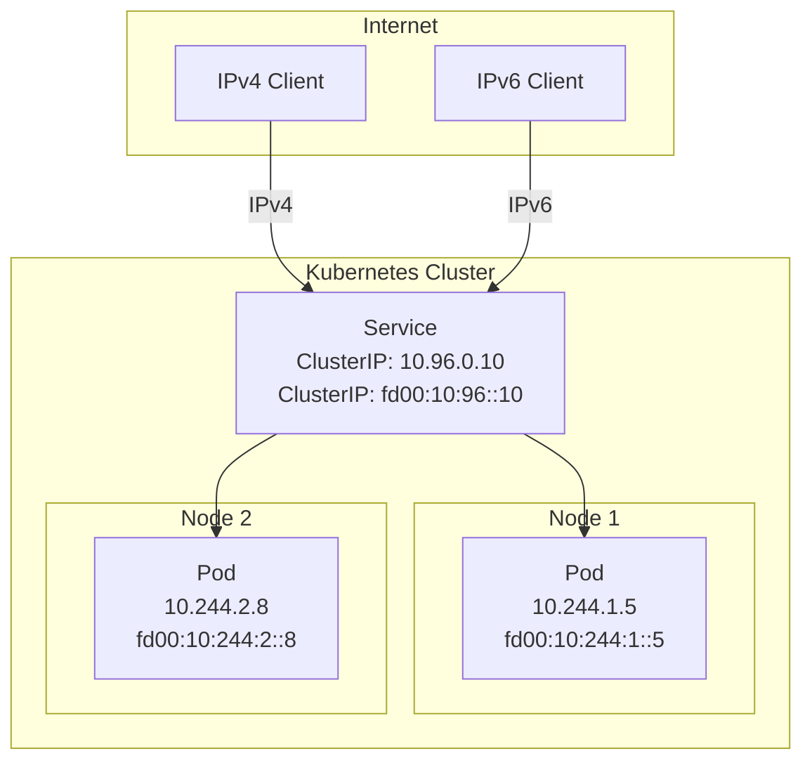
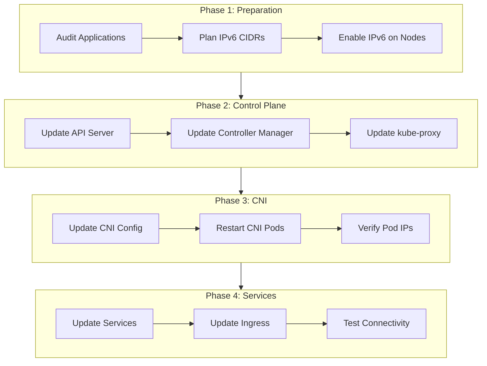

# How to Enable Dual-Stack IPv4/IPv6 Networking in Kubernetes

Author: [nawazdhandala](https://www.github.com/nawazdhandala)

Tags: Kubernetes, IPv6, Networking, Dual-Stack, CNI, Calico, Cilium, DevOps

Description: A comprehensive guide to enabling and configuring dual-stack IPv4/IPv6 networking in Kubernetes clusters, covering kubeadm setup, CNI configuration, service deployment, and migration strategies.

---

IPv4 address exhaustion is real. With IoT devices multiplying and cloud infrastructure expanding, dual-stack networking is no longer optional - it's essential. Kubernetes has supported dual-stack since version 1.21 as a stable feature. This guide walks you through enabling it from scratch.

## Understanding Dual-Stack Networking

Dual-stack means your pods and services get both IPv4 and IPv6 addresses simultaneously. Traffic flows over whichever protocol the client uses.



### Why Dual-Stack?

- **Future-proofing**: IPv4 addresses are running out
- **Compliance**: Some industries require IPv6 support
- **Performance**: IPv6 can be faster (no NAT overhead)
- **IoT and Edge**: Many IoT devices are IPv6-only
- **Government contracts**: US federal agencies mandate IPv6

## Prerequisites and Requirements

### Kubernetes Version

Dual-stack is stable in Kubernetes 1.21+. Check your version:

```bash
kubectl version --short
```

### Infrastructure Requirements

Your underlying infrastructure must support IPv6:

```bash
# Check if your nodes have IPv6 enabled
ip -6 addr show

# Verify IPv6 connectivity
ping6 -c 3 ipv6.google.com

# Check kernel parameters
sysctl net.ipv6.conf.all.disable_ipv6
# Should return: net.ipv6.conf.all.disable_ipv6 = 0
```

### Enable IPv6 on Linux Nodes

If IPv6 is disabled, enable it:

```bash
# Enable IPv6 temporarily
sudo sysctl -w net.ipv6.conf.all.disable_ipv6=0
sudo sysctl -w net.ipv6.conf.default.disable_ipv6=0
sudo sysctl -w net.ipv6.conf.lo.disable_ipv6=0

# Enable IPv6 permanently
cat <<EOF | sudo tee /etc/sysctl.d/99-ipv6.conf
net.ipv6.conf.all.disable_ipv6 = 0
net.ipv6.conf.default.disable_ipv6 = 0
net.ipv6.conf.lo.disable_ipv6 = 0
net.ipv6.conf.all.forwarding = 1
EOF

sudo sysctl --system
```

### Network Requirements

Plan your CIDR ranges:

| Component | IPv4 CIDR | IPv6 CIDR |
|-----------|-----------|-----------|
| Pod Network | 10.244.0.0/16 | fd00:10:244::/48 |
| Service Network | 10.96.0.0/12 | fd00:10:96::/108 |
| Node Network | 192.168.1.0/24 | 2001:db8:1::/64 |

## Setting Up Dual-Stack with kubeadm

### Initial Cluster Configuration

Create a kubeadm configuration file for a new dual-stack cluster:

```yaml
# kubeadm-config.yaml
apiVersion: kubeadm.k8s.io/v1beta3
kind: InitConfiguration
localAPIEndpoint:
  advertiseAddress: "192.168.1.10"
  bindPort: 6443
nodeRegistration:
  kubeletExtraArgs:
    node-ip: "192.168.1.10,2001:db8:1::10"
---
apiVersion: kubeadm.k8s.io/v1beta3
kind: ClusterConfiguration
kubernetesVersion: "v1.29.0"
networking:
  podSubnet: "10.244.0.0/16,fd00:10:244::/48"
  serviceSubnet: "10.96.0.0/12,fd00:10:96::/108"
controllerManager:
  extraArgs:
    node-cidr-mask-size-ipv4: "24"
    node-cidr-mask-size-ipv6: "64"
apiServer:
  extraArgs:
    service-cluster-ip-range: "10.96.0.0/12,fd00:10:96::/108"
---
apiVersion: kubelet.config.k8s.io/v1beta1
kind: KubeletConfiguration
cgroupDriver: systemd
```

### Initialize the Control Plane

```bash
# Initialize the cluster
sudo kubeadm init --config=kubeadm-config.yaml

# Set up kubectl
mkdir -p $HOME/.kube
sudo cp -i /etc/kubernetes/admin.conf $HOME/.kube/config
sudo chown $(id -u):$(id -g) $HOME/.kube/config
```

### Join Worker Nodes with Dual-Stack

Create a join configuration for worker nodes:

```yaml
# kubeadm-join.yaml
apiVersion: kubeadm.k8s.io/v1beta3
kind: JoinConfiguration
discovery:
  bootstrapToken:
    apiServerEndpoint: "192.168.1.10:6443"
    token: "<your-token>"
    caCertHashes:
      - "sha256:<your-hash>"
nodeRegistration:
  kubeletExtraArgs:
    node-ip: "192.168.1.11,2001:db8:1::11"
```

```bash
# Join worker node
sudo kubeadm join --config=kubeadm-join.yaml
```

## Upgrading Existing Cluster to Dual-Stack

### Step 1: Verify Current Configuration

```bash
# Check current cluster CIDR configuration
kubectl cluster-info dump | grep -E "cluster-cidr|service-cluster-ip-range"

# Check kube-controller-manager arguments
kubectl get pod -n kube-system -l component=kube-controller-manager -o yaml | grep -A 50 spec
```

### Step 2: Update kube-apiserver

Edit the kube-apiserver manifest:

```bash
sudo vi /etc/kubernetes/manifests/kube-apiserver.yaml
```

Add or modify:

```yaml
spec:
  containers:
  - command:
    - kube-apiserver
    - --service-cluster-ip-range=10.96.0.0/12,fd00:10:96::/108
    # ... other flags
```

### Step 3: Update kube-controller-manager

Edit the controller-manager manifest:

```bash
sudo vi /etc/kubernetes/manifests/kube-controller-manager.yaml
```

```yaml
spec:
  containers:
  - command:
    - kube-controller-manager
    - --cluster-cidr=10.244.0.0/16,fd00:10:244::/48
    - --service-cluster-ip-range=10.96.0.0/12,fd00:10:96::/108
    - --node-cidr-mask-size-ipv4=24
    - --node-cidr-mask-size-ipv6=64
    # ... other flags
```

### Step 4: Update kube-proxy

```bash
kubectl edit configmap kube-proxy -n kube-system
```

```yaml
data:
  config.conf: |-
    clusterCIDR: "10.244.0.0/16,fd00:10:244::/48"
```

Restart kube-proxy:

```bash
kubectl rollout restart daemonset kube-proxy -n kube-system
```

### Step 5: Update Kubelet on Each Node

Edit kubelet configuration:

```bash
# On each node
sudo vi /var/lib/kubelet/kubeadm-flags.env
```

Add node IPs:

```bash
KUBELET_KUBEADM_ARGS="--node-ip=192.168.1.10,2001:db8:1::10 ..."
```

Restart kubelet:

```bash
sudo systemctl restart kubelet
```

## CNI Setup for Dual-Stack

### Calico Configuration

Calico is one of the most popular CNIs with excellent dual-stack support.

#### Install Calico Operator

```bash
# Install the operator
kubectl create -f https://raw.githubusercontent.com/projectcalico/calico/v3.27.0/manifests/tigera-operator.yaml
```

#### Configure Dual-Stack Installation

```yaml
# calico-installation.yaml
apiVersion: operator.tigera.io/v1
kind: Installation
metadata:
  name: default
spec:
  calicoNetwork:
    bgp: Enabled
    ipPools:
    - blockSize: 26
      cidr: 10.244.0.0/16
      encapsulation: VXLANCrossSubnet
      natOutgoing: Enabled
      nodeSelector: all()
    - blockSize: 122
      cidr: fd00:10:244::/48
      encapsulation: None
      natOutgoing: Enabled
      nodeSelector: all()
    nodeAddressAutodetectionV4:
      firstFound: true
    nodeAddressAutodetectionV6:
      firstFound: true
---
apiVersion: operator.tigera.io/v1
kind: APIServer
metadata:
  name: default
spec: {}
```

```bash
kubectl apply -f calico-installation.yaml
```

#### Verify Calico Installation

```bash
# Check Calico pods
kubectl get pods -n calico-system

# Check IP pools
kubectl get ippools -o wide

# Verify node has dual-stack addresses
kubectl get nodes -o jsonpath='{.items[*].status.addresses}'
```

### Cilium Configuration

Cilium offers advanced networking features with dual-stack support.

#### Install Cilium with Helm

```bash
# Add Cilium Helm repo
helm repo add cilium https://helm.cilium.io/
helm repo update
```

#### Dual-Stack Cilium Values

```yaml
# cilium-values.yaml
ipam:
  mode: kubernetes
ipv4:
  enabled: true
ipv6:
  enabled: true
enableIPv6Masquerade: true
tunnel: vxlan
kubeProxyReplacement: strict
k8sServiceHost: 192.168.1.10
k8sServicePort: 6443
bpf:
  masquerade: true
ipv4NativeRoutingCIDR: 10.244.0.0/16
ipv6NativeRoutingCIDR: fd00:10:244::/48
```

```bash
helm install cilium cilium/cilium \
  --version 1.14.5 \
  --namespace kube-system \
  --values cilium-values.yaml
```

#### Verify Cilium Installation

```bash
# Check Cilium status
cilium status

# Verify dual-stack connectivity
cilium connectivity test

# Check node CIDR allocations
kubectl get nodes -o jsonpath='{range .items[*]}{.metadata.name}{"\n"}{.spec.podCIDR}{"\n"}{.spec.podCIDRs}{"\n\n"}{end}'
```

### Flannel Configuration

Flannel also supports dual-stack but with simpler features.

```yaml
# kube-flannel.yaml
---
kind: ConfigMap
apiVersion: v1
metadata:
  name: kube-flannel-cfg
  namespace: kube-flannel
  labels:
    tier: node
    k8s-app: flannel
data:
  net-conf.json: |
    {
      "Network": "10.244.0.0/16",
      "IPv6Network": "fd00:10:244::/48",
      "EnableIPv6": true,
      "Backend": {
        "Type": "vxlan"
      }
    }
```

## Configuring Dual-Stack Services

### Single-Stack Service (IPv4 only)

```yaml
apiVersion: v1
kind: Service
metadata:
  name: my-service-ipv4
spec:
  selector:
    app: my-app
  ipFamilies:
  - IPv4
  ipFamilyPolicy: SingleStack
  ports:
  - port: 80
    targetPort: 8080
```

### Single-Stack Service (IPv6 only)

```yaml
apiVersion: v1
kind: Service
metadata:
  name: my-service-ipv6
spec:
  selector:
    app: my-app
  ipFamilies:
  - IPv6
  ipFamilyPolicy: SingleStack
  ports:
  - port: 80
    targetPort: 8080
```

### Dual-Stack Service (IPv4 preferred)

```yaml
apiVersion: v1
kind: Service
metadata:
  name: my-service-dual-ipv4-first
spec:
  selector:
    app: my-app
  ipFamilies:
  - IPv4
  - IPv6
  ipFamilyPolicy: PreferDualStack
  ports:
  - port: 80
    targetPort: 8080
```

### Dual-Stack Service (IPv6 preferred)

```yaml
apiVersion: v1
kind: Service
metadata:
  name: my-service-dual-ipv6-first
spec:
  selector:
    app: my-app
  ipFamilies:
  - IPv6
  - IPv4
  ipFamilyPolicy: PreferDualStack
  ports:
  - port: 80
    targetPort: 8080
```

### Required Dual-Stack Service

```yaml
apiVersion: v1
kind: Service
metadata:
  name: my-service-require-dual
spec:
  selector:
    app: my-app
  ipFamilies:
  - IPv4
  - IPv6
  ipFamilyPolicy: RequireDualStack
  ports:
  - port: 80
    targetPort: 8080
```

### LoadBalancer Service with Dual-Stack

```yaml
apiVersion: v1
kind: Service
metadata:
  name: my-loadbalancer
  annotations:
    # Cloud provider specific annotations may be needed
    service.beta.kubernetes.io/aws-load-balancer-ip-address-type: dualstack
spec:
  type: LoadBalancer
  selector:
    app: my-app
  ipFamilies:
  - IPv4
  - IPv6
  ipFamilyPolicy: RequireDualStack
  ports:
  - port: 80
    targetPort: 8080
```

## Ingress Configuration for Dual-Stack

### NGINX Ingress with Dual-Stack

```yaml
# nginx-ingress-service.yaml
apiVersion: v1
kind: Service
metadata:
  name: ingress-nginx-controller
  namespace: ingress-nginx
spec:
  type: LoadBalancer
  ipFamilies:
  - IPv4
  - IPv6
  ipFamilyPolicy: RequireDualStack
  ports:
  - name: http
    port: 80
    targetPort: http
  - name: https
    port: 443
    targetPort: https
  selector:
    app.kubernetes.io/name: ingress-nginx
    app.kubernetes.io/component: controller
```

### Ingress Resource

```yaml
apiVersion: networking.k8s.io/v1
kind: Ingress
metadata:
  name: my-ingress
  annotations:
    nginx.ingress.kubernetes.io/ssl-redirect: "true"
spec:
  ingressClassName: nginx
  rules:
  - host: app.example.com
    http:
      paths:
      - path: /
        pathType: Prefix
        backend:
          service:
            name: my-service-dual
            port:
              number: 80
  tls:
  - hosts:
    - app.example.com
    secretName: app-tls
```

## Testing Dual-Stack Connectivity

### Deploy Test Application

```yaml
# dual-stack-test.yaml
apiVersion: apps/v1
kind: Deployment
metadata:
  name: dual-stack-test
spec:
  replicas: 2
  selector:
    matchLabels:
      app: dual-stack-test
  template:
    metadata:
      labels:
        app: dual-stack-test
    spec:
      containers:
      - name: nginx
        image: nginx:alpine
        ports:
        - containerPort: 80
---
apiVersion: v1
kind: Service
metadata:
  name: dual-stack-svc
spec:
  selector:
    app: dual-stack-test
  ipFamilies:
  - IPv4
  - IPv6
  ipFamilyPolicy: RequireDualStack
  ports:
  - port: 80
    targetPort: 80
```

```bash
kubectl apply -f dual-stack-test.yaml
```

### Verify Pod IP Addresses

```bash
# Check pod IPs
kubectl get pods -o wide

# Get detailed IP information
kubectl get pods -o jsonpath='{range .items[*]}{.metadata.name}{"\n"}  IPv4: {.status.podIPs[0].ip}{"\n"}  IPv6: {.status.podIPs[1].ip}{"\n\n"}{end}'
```

### Verify Service IP Addresses

```bash
# Check service IPs
kubectl get svc dual-stack-svc -o jsonpath='{.spec.clusterIPs}'

# Detailed service info
kubectl describe svc dual-stack-svc
```

### Test IPv4 Connectivity

```bash
# Deploy a test pod
kubectl run test-client --image=curlimages/curl --rm -it -- sh

# From inside the pod
# Test IPv4
curl -4 http://dual-stack-svc
curl http://10.96.x.x  # Use actual IPv4 ClusterIP
```

### Test IPv6 Connectivity

```bash
# From inside the test pod
# Test IPv6
curl -6 http://dual-stack-svc
curl http://[fd00:10:96::x]  # Use actual IPv6 ClusterIP
```

### Comprehensive Connectivity Test Script

```bash
#!/bin/bash
# dual-stack-test.sh

echo "=== Dual-Stack Connectivity Test ==="

# Get service IPs
SVC_NAME="dual-stack-svc"
IPV4_IP=$(kubectl get svc $SVC_NAME -o jsonpath='{.spec.clusterIPs[0]}')
IPV6_IP=$(kubectl get svc $SVC_NAME -o jsonpath='{.spec.clusterIPs[1]}')

echo "Service IPv4: $IPV4_IP"
echo "Service IPv6: $IPV6_IP"

# Test from a pod
kubectl run connectivity-test --image=curlimages/curl --rm -it --restart=Never -- sh -c "
echo '--- Testing IPv4 ---'
curl -4 -s -o /dev/null -w '%{http_code}\n' http://$IPV4_IP

echo '--- Testing IPv6 ---'
curl -6 -s -o /dev/null -w '%{http_code}\n' http://[$IPV6_IP]

echo '--- Testing DNS IPv4 ---'
curl -4 -s -o /dev/null -w '%{http_code}\n' http://$SVC_NAME

echo '--- Testing DNS IPv6 ---'
curl -6 -s -o /dev/null -w '%{http_code}\n' http://$SVC_NAME
"
```

### Test Node-to-Node IPv6 Connectivity

```bash
# Get node IPv6 addresses
kubectl get nodes -o jsonpath='{range .items[*]}{.metadata.name}: {.status.addresses[?(@.type=="InternalIP")].address}{"\n"}{end}'

# SSH to one node and ping another
ssh node1
ping6 -c 3 2001:db8:1::11
```

## DNS Configuration for Dual-Stack

### CoreDNS Configuration

CoreDNS automatically handles dual-stack DNS resolution. Verify the configuration:

```bash
kubectl get configmap coredns -n kube-system -o yaml
```

The default configuration should work. For custom settings:

```yaml
apiVersion: v1
kind: ConfigMap
metadata:
  name: coredns
  namespace: kube-system
data:
  Corefile: |
    .:53 {
        errors
        health {
           lameduck 5s
        }
        ready
        kubernetes cluster.local in-addr.arpa ip6.arpa {
           pods insecure
           fallthrough in-addr.arpa ip6.arpa
           ttl 30
        }
        prometheus :9153
        forward . /etc/resolv.conf {
           max_concurrent 1000
        }
        cache 30
        loop
        reload
        loadbalance
    }
```

### Test DNS Resolution

```bash
kubectl run dns-test --image=busybox --rm -it --restart=Never -- sh -c "
echo '=== A Records (IPv4) ==='
nslookup -type=A dual-stack-svc

echo '=== AAAA Records (IPv6) ==='
nslookup -type=AAAA dual-stack-svc

echo '=== All Records ==='
nslookup dual-stack-svc
"
```

## Migration Strategies

### Strategy 1: Greenfield Dual-Stack

Best for new clusters. Start with dual-stack from day one.


### Strategy 2: Rolling Migration

Migrate existing single-stack to dual-stack incrementally.



### Strategy 3: Parallel Clusters

Run IPv4 and dual-stack clusters in parallel, migrate workloads gradually.

```yaml
# Example migration annotation
apiVersion: apps/v1
kind: Deployment
metadata:
  name: my-app
  annotations:
    migration.kubernetes.io/dual-stack-ready: "true"
spec:
  # ... deployment spec
```

### Migration Checklist

```bash
#!/bin/bash
# migration-checklist.sh

echo "=== Pre-Migration Checks ==="

# Check Kubernetes version
echo "1. Kubernetes Version:"
kubectl version --short

# Check CNI compatibility
echo "2. CNI Plugin:"
kubectl get pods -n kube-system | grep -E 'calico|cilium|flannel'

# Check node IPv6 readiness
echo "3. Node IPv6 Status:"
for node in $(kubectl get nodes -o name); do
  echo "Checking $node..."
  kubectl debug node/${node#node/} -it --image=busybox -- ip -6 addr show 2>/dev/null | head -5
done

# Check existing services
echo "4. Services to Migrate:"
kubectl get svc -A -o jsonpath='{range .items[*]}{.metadata.namespace}/{.metadata.name}: {.spec.ipFamilyPolicy}{"\n"}{end}'

echo "=== Migration Safe to Proceed ==="
```

## Troubleshooting Dual-Stack

### Common Issues

#### Issue 1: Pods Not Getting IPv6 Addresses

```bash
# Check CNI configuration
kubectl get pods -n kube-system -l k8s-app=calico-node -o yaml | grep -A 20 env

# Check node pod CIDR allocations
kubectl get nodes -o jsonpath='{range .items[*]}{.metadata.name}: {.spec.podCIDRs}{"\n"}{end}'

# Verify CNI plugin logs
kubectl logs -n kube-system -l k8s-app=calico-node --tail=100
```

#### Issue 2: Services Not Getting Dual-Stack IPs

```bash
# Check service configuration
kubectl get svc <service-name> -o yaml | grep -A 5 ipFamil

# Verify controller-manager configuration
kubectl get pod -n kube-system -l component=kube-controller-manager -o yaml | grep service-cluster-ip-range
```

#### Issue 3: DNS Resolution Failing for IPv6

```bash
# Test CoreDNS
kubectl exec -it -n kube-system deploy/coredns -- nslookup kubernetes

# Check CoreDNS logs
kubectl logs -n kube-system -l k8s-app=kube-dns

# Verify AAAA records
kubectl run dns-debug --image=gcr.io/kubernetes-e2e-test-images/dnsutils:1.3 --rm -it -- nslookup -type=AAAA kubernetes.default
```

#### Issue 4: Cross-Node IPv6 Traffic Failing

```bash
# Check node routing tables
ip -6 route show

# Verify tunnel/encapsulation
kubectl exec -it -n kube-system <calico-node-pod> -- calico-node -show-status

# Check firewall rules
ip6tables -L -n
```

### Diagnostic Commands

```bash
# Complete cluster dual-stack status
echo "=== Cluster Dual-Stack Status ==="

echo "--- API Server Config ---"
kubectl get pod -n kube-system -l component=kube-apiserver -o jsonpath='{.items[0].spec.containers[0].command}' | tr ',' '\n' | grep -E 'service-cluster|cluster-cidr'

echo "--- Controller Manager Config ---"
kubectl get pod -n kube-system -l component=kube-controller-manager -o jsonpath='{.items[0].spec.containers[0].command}' | tr ',' '\n' | grep -E 'service-cluster|cluster-cidr|node-cidr'

echo "--- Node Pod CIDRs ---"
kubectl get nodes -o custom-columns=NAME:.metadata.name,PODCIDRS:.spec.podCIDRs

echo "--- Sample Pod IPs ---"
kubectl get pods -A -o custom-columns=NAMESPACE:.metadata.namespace,NAME:.metadata.name,PODIPS:.status.podIPs --field-selector=status.phase=Running | head -20

echo "--- Dual-Stack Services ---"
kubectl get svc -A -o custom-columns=NAMESPACE:.metadata.namespace,NAME:.metadata.name,CLUSTERIPS:.spec.clusterIPs,IPFAMILYPOLICY:.spec.ipFamilyPolicy
```

## Best Practices

### 1. Use Consistent CIDR Planning

Document your IP allocation strategy:

```yaml
# ip-allocation.yaml (documentation)
apiVersion: v1
kind: ConfigMap
metadata:
  name: ip-allocation-plan
  namespace: kube-system
data:
  plan: |
    IPv4:
      Pod CIDR: 10.244.0.0/16
      Service CIDR: 10.96.0.0/12
      Node CIDR mask: /24

    IPv6:
      Pod CIDR: fd00:10:244::/48
      Service CIDR: fd00:10:96::/108
      Node CIDR mask: /64
```

### 2. Set Default IP Family Policy

Use admission controllers to enforce dual-stack services:

```yaml
apiVersion: admissionregistration.k8s.io/v1
kind: MutatingWebhookConfiguration
metadata:
  name: dual-stack-defaulter
webhooks:
- name: dual-stack.example.com
  rules:
  - apiGroups: [""]
    apiVersions: ["v1"]
    operations: ["CREATE"]
    resources: ["services"]
  clientConfig:
    service:
      name: dual-stack-webhook
      namespace: kube-system
      path: /mutate
  admissionReviewVersions: ["v1"]
  sideEffects: None
```

### 3. Monitor IPv6 Traffic

Configure monitoring for both IP families:

```yaml
# prometheus-servicemonitor.yaml
apiVersion: monitoring.coreos.com/v1
kind: ServiceMonitor
metadata:
  name: dual-stack-metrics
spec:
  selector:
    matchLabels:
      app: my-app
  endpoints:
  - port: metrics
    interval: 30s
  # Scrape from both IPv4 and IPv6 endpoints
  targetLabels:
  - ip_family
```

### 4. Application Readiness

Ensure applications bind to all interfaces:

```go
// Go example - bind to all interfaces
listener, err := net.Listen("tcp", ":8080")  // Binds to 0.0.0.0 and ::

// Or explicitly dual-stack
listener, err := net.Listen("tcp", "[::]:8080")  // IPv6 with IPv4 fallback
```

```python
# Python example
import socket

sock = socket.socket(socket.AF_INET6, socket.SOCK_STREAM)
sock.setsockopt(socket.IPPROTO_IPV6, socket.IPV6_V6ONLY, 0)  # Allow IPv4 connections
sock.bind(('::', 8080))
```

### 5. Network Policy Considerations

Create policies that work with both IP families:

```yaml
apiVersion: networking.k8s.io/v1
kind: NetworkPolicy
metadata:
  name: dual-stack-policy
spec:
  podSelector:
    matchLabels:
      app: my-app
  policyTypes:
  - Ingress
  - Egress
  ingress:
  - from:
    - podSelector:
        matchLabels:
          app: frontend
    # No ipBlock specified - works for both IPv4 and IPv6
    ports:
    - port: 8080
  egress:
  - to:
    - podSelector:
        matchLabels:
          app: database
    ports:
    - port: 5432
```

---

Dual-stack networking is the path forward for Kubernetes clusters. While the initial setup requires careful planning, the benefits of supporting both IPv4 and IPv6 outweigh the complexity. Start with a test cluster, validate your applications work correctly with IPv6, then roll out to production. The internet is moving to IPv6 - make sure your Kubernetes infrastructure is ready.
