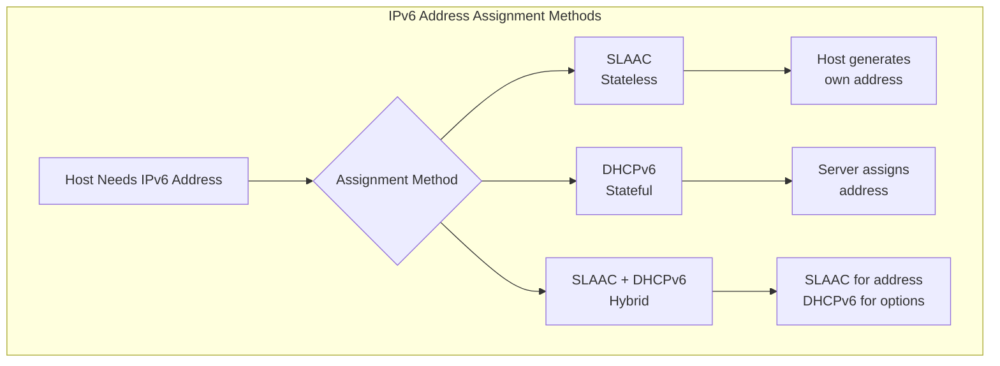
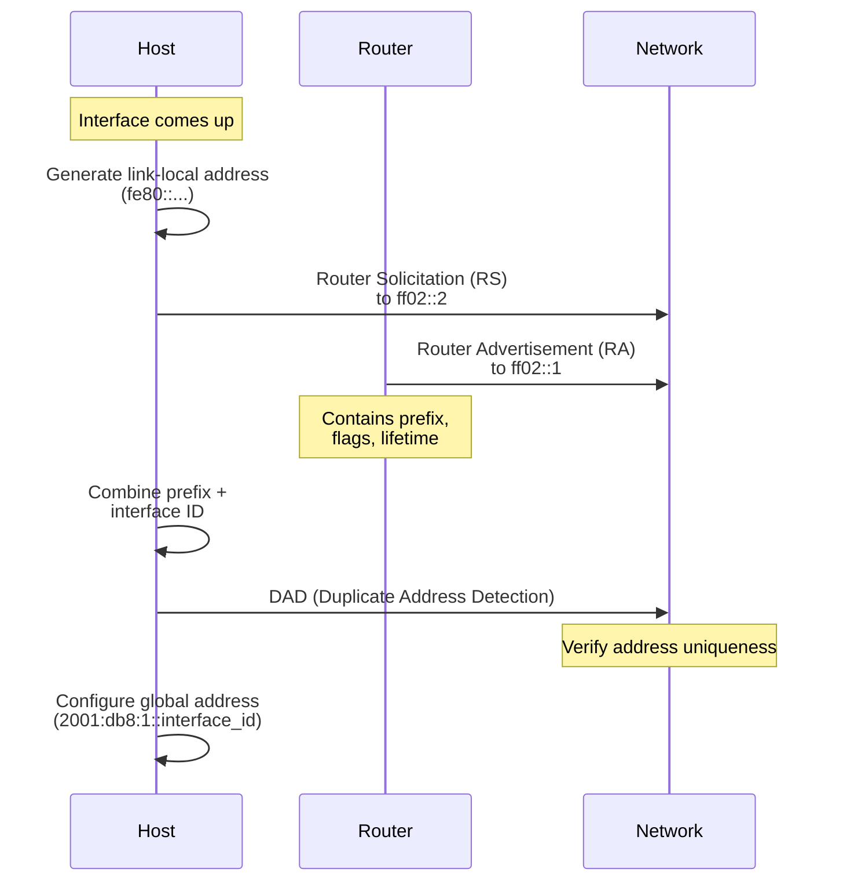
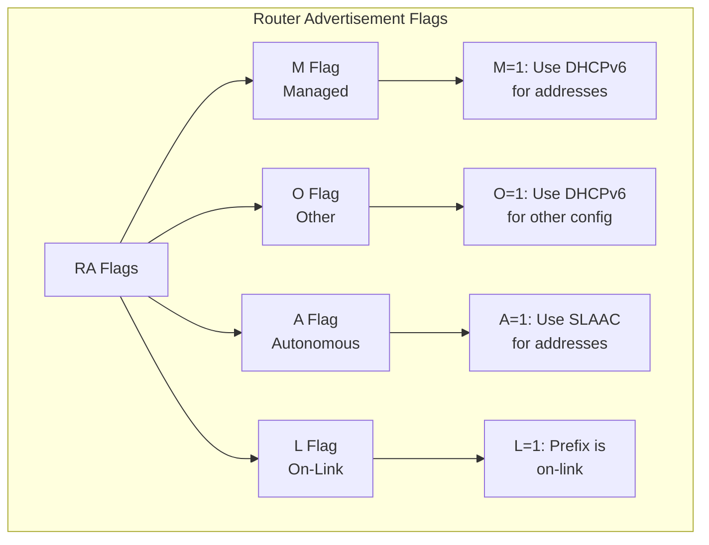
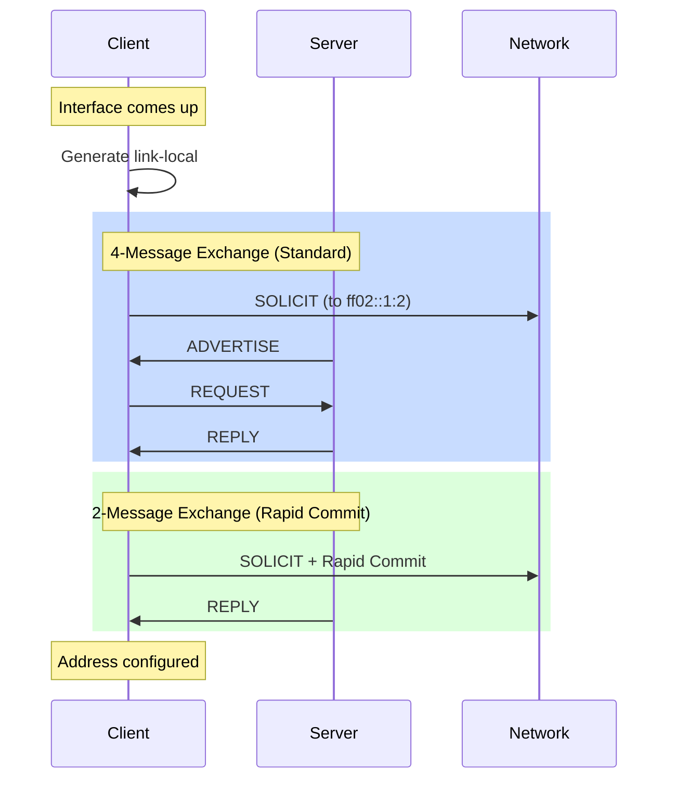
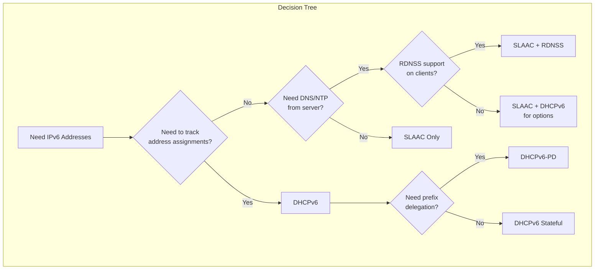
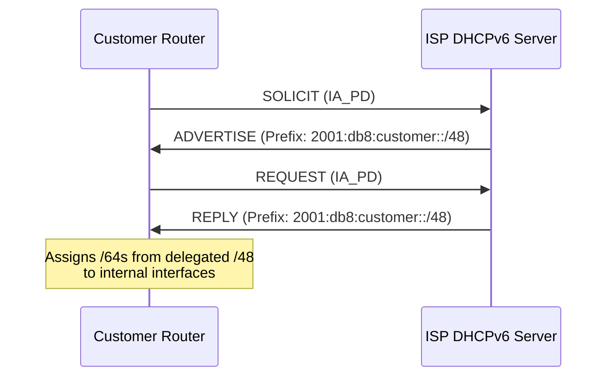
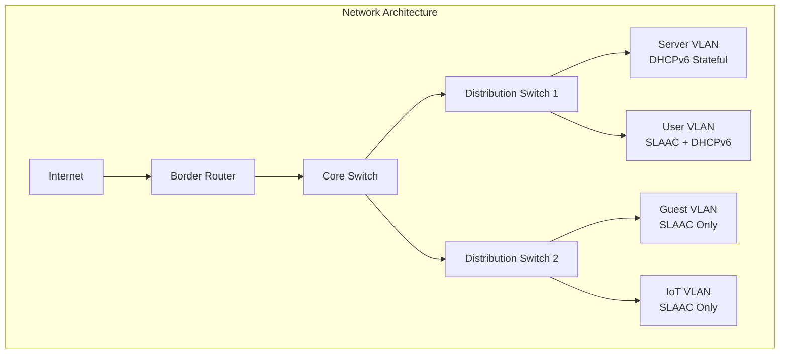

# How to Set Up IPv6 SLAAC vs DHCPv6 for Address Assignment

Author: [nawazdhandala](https://www.github.com/nawazdhandala)

Tags: IPv6, SLAAC, DHCPv6, Router Advertisement, Network Configuration, Address Assignment, Linux, Networking

Description: A comprehensive comparison of SLAAC and DHCPv6 for IPv6 address assignment, including setup guides, configuration examples, and guidance on when to use each method.

---

## Introduction

IPv6 address assignment differs fundamentally from IPv4's DHCP-centric approach. IPv6 offers two primary methods for automatic address configuration: Stateless Address Autoconfiguration (SLAAC) and DHCPv6. Understanding the differences between these methods and knowing when to use each is crucial for designing efficient IPv6 networks.

This guide provides a deep dive into both SLAAC and DHCPv6, complete with practical setup instructions and real-world configuration examples.

## Overview: SLAAC vs DHCPv6



| Feature | SLAAC | DHCPv6 |
|---------|-------|--------|
| Address Source | Self-generated | Server-assigned |
| Server Required | No (only router) | Yes |
| Address Tracking | No | Yes |
| DNS Configuration | Via RA (RDNSS) | Native support |
| Additional Options | Limited | Extensive |
| Complexity | Low | Higher |
| Scalability | Excellent | Good |

## Understanding SLAAC (Stateless Address Autoconfiguration)

SLAAC allows IPv6 hosts to automatically configure their own addresses without a DHCP server. The process relies on Router Advertisements (RAs) from routers.

### How SLAAC Works



### SLAAC Address Generation Methods

#### 1. EUI-64 (Traditional Method)

The interface identifier is derived from the MAC address:

```
MAC Address: 00:1A:2B:3C:4D:5E

Step 1: Insert FFFE in middle
00:1A:2B:FF:FE:3C:4D:5E

Step 2: Flip the 7th bit (Universal/Local bit)
02:1A:2B:FF:FE:3C:4D:5E

Result: Interface ID = 021a:2bff:fe3c:4d5e
Full Address: 2001:db8:1::021a:2bff:fe3c:4d5e
```

#### 2. Privacy Extensions (RFC 4941)

Generates random, temporary addresses to enhance privacy:

```bash
# Enable privacy extensions on Linux
sudo sysctl -w net.ipv6.conf.all.use_tempaddr=2
sudo sysctl -w net.ipv6.conf.default.use_tempaddr=2

# Make permanent in /etc/sysctl.conf
echo "net.ipv6.conf.all.use_tempaddr = 2" | sudo tee -a /etc/sysctl.conf
echo "net.ipv6.conf.default.use_tempaddr = 2" | sudo tee -a /etc/sysctl.conf
```

#### 3. Stable Privacy Addresses (RFC 7217)

Generates stable but privacy-preserving addresses:

```bash
# Modern Linux systems use this by default
# Address is stable per network but doesn't reveal MAC
sysctl net.ipv6.conf.all.addr_gen_mode
# 0 = EUI-64, 2 = Stable privacy, 3 = Random
```

## Configuring Router Advertisements for SLAAC

Router Advertisements are the backbone of SLAAC. On Linux, `radvd` (Router Advertisement Daemon) is commonly used.

### Installing radvd

```bash
# Ubuntu/Debian
sudo apt update
sudo apt install radvd

# RHEL/CentOS/Rocky
sudo dnf install radvd
```

### Basic radvd Configuration

```bash
# /etc/radvd.conf
interface eth0
{
    # Send Router Advertisements
    AdvSendAdvert on;

    # Maximum interval between RAs (seconds)
    MaxRtrAdvInterval 600;

    # Minimum interval between RAs (seconds)
    MinRtrAdvInterval 200;

    # Advertised prefix for SLAAC
    prefix 2001:db8:1::/64
    {
        # Hosts can use this prefix for SLAAC
        AdvOnLink on;
        AdvAutonomous on;

        # Address valid lifetime (seconds)
        AdvValidLifetime 86400;

        # Preferred lifetime (seconds)
        AdvPreferredLifetime 14400;
    };

    # DNS server via RDNSS (RFC 8106)
    RDNSS 2001:4860:4860::8888 2001:4860:4860::8844
    {
        AdvRDNSSLifetime 3600;
    };

    # DNS search domain
    DNSSL example.com internal.example.com
    {
        AdvDNSSLLifetime 3600;
    };
};
```

### RA Flags Explained



### radvd Configuration Examples

#### SLAAC Only (No DHCPv6)

```bash
# /etc/radvd.conf - Pure SLAAC
interface eth0
{
    AdvSendAdvert on;
    AdvManagedFlag off;    # M=0: Don't use DHCPv6 for addresses
    AdvOtherConfigFlag off; # O=0: Don't use DHCPv6 for other config

    prefix 2001:db8:1::/64
    {
        AdvOnLink on;
        AdvAutonomous on;   # A=1: Use SLAAC
    };

    RDNSS 2001:db8:1::1 2001:4860:4860::8888
    {
        AdvRDNSSLifetime 3600;
    };
};
```

#### SLAAC with DHCPv6 for Options

```bash
# /etc/radvd.conf - SLAAC + DHCPv6 for DNS/options
interface eth0
{
    AdvSendAdvert on;
    AdvManagedFlag off;     # M=0: Don't use DHCPv6 for addresses
    AdvOtherConfigFlag on;  # O=1: Use DHCPv6 for other config (DNS, NTP, etc.)

    prefix 2001:db8:1::/64
    {
        AdvOnLink on;
        AdvAutonomous on;
    };
};
```

#### DHCPv6 Only (No SLAAC)

```bash
# /etc/radvd.conf - DHCPv6 only for addresses
interface eth0
{
    AdvSendAdvert on;
    AdvManagedFlag on;      # M=1: Use DHCPv6 for addresses
    AdvOtherConfigFlag on;  # O=1: Use DHCPv6 for other config

    prefix 2001:db8:1::/64
    {
        AdvOnLink on;
        AdvAutonomous off;  # A=0: Don't use SLAAC
    };
};
```

### Starting radvd

```bash
# Enable and start radvd
sudo systemctl enable radvd
sudo systemctl start radvd

# Check status
sudo systemctl status radvd

# View logs
journalctl -u radvd -f

# Verify RAs are being sent
sudo tcpdump -i eth0 -n icmp6 and 'ip6[40] = 134'
```

## Setting Up DHCPv6 Server

DHCPv6 provides stateful address assignment, allowing administrators to track which addresses are assigned to which hosts.

### DHCPv6 Server Options

| Server | Platform | Features |
|--------|----------|----------|
| ISC DHCP | Linux/BSD | Full-featured, widely used |
| ISC Kea | Linux/BSD | Modern replacement for ISC DHCP |
| dnsmasq | Linux | Lightweight, integrated DNS |
| Windows DHCP | Windows Server | Native Windows integration |

### Installing ISC Kea DHCPv6

```bash
# Ubuntu/Debian
sudo apt update
sudo apt install kea-dhcp6-server

# RHEL/CentOS/Rocky
sudo dnf install kea
```

### Kea DHCPv6 Configuration

```json
// /etc/kea/kea-dhcp6.conf
{
    "Dhcp6": {
        // Global parameters
        "valid-lifetime": 4000,
        "renew-timer": 1000,
        "rebind-timer": 2000,
        "preferred-lifetime": 3000,

        // Interfaces to listen on
        "interfaces-config": {
            "interfaces": ["eth0"]
        },

        // Lease database
        "lease-database": {
            "type": "memfile",
            "persist": true,
            "name": "/var/lib/kea/kea-leases6.csv",
            "lfc-interval": 3600
        },

        // Subnet configuration
        "subnet6": [
            {
                "subnet": "2001:db8:1::/64",
                "pools": [
                    {
                        "pool": "2001:db8:1::1000-2001:db8:1::1fff"
                    }
                ],
                "option-data": [
                    {
                        "name": "dns-servers",
                        "data": "2001:db8:1::1, 2001:4860:4860::8888"
                    },
                    {
                        "name": "domain-search",
                        "data": "example.com, internal.example.com"
                    }
                ],
                "reservations": [
                    {
                        "duid": "00:03:00:01:00:1a:2b:3c:4d:5e",
                        "ip-addresses": ["2001:db8:1::10"],
                        "hostname": "server1"
                    }
                ]
            }
        ],

        // Logging
        "loggers": [
            {
                "name": "kea-dhcp6",
                "output_options": [
                    {
                        "output": "/var/log/kea/kea-dhcp6.log"
                    }
                ],
                "severity": "INFO"
            }
        ]
    }
}
```

### Installing dnsmasq for DHCPv6

```bash
# Install dnsmasq
sudo apt install dnsmasq

# Configure for DHCPv6
```

```bash
# /etc/dnsmasq.conf

# Enable IPv6
enable-ra

# Interface to serve
interface=eth0

# DHCPv6 range
dhcp-range=2001:db8:1::1000,2001:db8:1::1fff,64,24h

# DHCPv6 options
dhcp-option=option6:dns-server,[2001:db8:1::1],[2001:4860:4860::8888]
dhcp-option=option6:domain-search,example.com,internal.example.com

# Static assignments (DUID-based)
dhcp-host=id:00:03:00:01:00:1a:2b:3c:4d:5e,[2001:db8:1::10],server1

# RA mode
# ra-param=eth0,0,0  # Disable SLAAC, use DHCPv6 only
ra-param=eth0,high,0,0  # High priority, managed addressing
```

### Starting DHCPv6 Server

```bash
# For Kea
sudo systemctl enable kea-dhcp6-server
sudo systemctl start kea-dhcp6-server
sudo systemctl status kea-dhcp6-server

# For dnsmasq
sudo systemctl enable dnsmasq
sudo systemctl start dnsmasq
sudo systemctl status dnsmasq
```

## DHCPv6 Message Exchange



### DHCPv6 Message Types

| Message | Code | Description |
|---------|------|-------------|
| SOLICIT | 1 | Client looking for servers |
| ADVERTISE | 2 | Server response to SOLICIT |
| REQUEST | 3 | Client requesting address |
| CONFIRM | 4 | Client verifying address |
| RENEW | 5 | Client renewing lease |
| REBIND | 6 | Client rebinding after failed RENEW |
| REPLY | 7 | Server response with address/options |
| RELEASE | 8 | Client releasing address |
| DECLINE | 9 | Client declining offered address |
| RECONFIGURE | 10 | Server initiating reconfiguration |
| INFORMATION-REQUEST | 11 | Client requesting options only |

## Client Configuration

### Linux Client (Netplan)

```yaml
# /etc/netplan/01-dhcp6.yaml - DHCPv6 client
network:
  version: 2
  renderer: networkd
  ethernets:
    eth0:
      dhcp4: true
      dhcp6: true
      accept-ra: true
```

```yaml
# /etc/netplan/01-slaac.yaml - SLAAC only
network:
  version: 2
  renderer: networkd
  ethernets:
    eth0:
      dhcp4: true
      dhcp6: false
      accept-ra: true
```

### Linux Client (NetworkManager)

```bash
# Configure via nmcli for DHCPv6
nmcli connection modify "Wired connection 1" \
    ipv6.method auto \
    ipv6.addr-gen-mode stable-privacy

# Configure for SLAAC only
nmcli connection modify "Wired connection 1" \
    ipv6.method auto \
    ipv6.dhcp-send-hostname yes

# Apply changes
nmcli connection up "Wired connection 1"
```

### Verify Client Configuration

```bash
# Check obtained addresses
ip -6 addr show dev eth0

# Check if address is from SLAAC or DHCPv6
# SLAAC addresses: scope global dynamic mngtmpaddr
# DHCPv6 addresses: scope global dynamic

# View DHCPv6 client status
journalctl -u systemd-networkd | grep -i dhcp6

# Check received RA information
rdisc6 eth0
```

## Comparison: When to Use Each Method



### Use SLAAC When:

- **Simplicity is priority** - No server infrastructure needed
- **Large networks** - Scales effortlessly to millions of hosts
- **Dynamic environments** - Containers, IoT devices, guest networks
- **Quick deployment** - Minimal configuration required
- **Privacy matters** - Combined with privacy extensions

```bash
# Example: IoT network with SLAAC
# /etc/radvd.conf
interface eth0
{
    AdvSendAdvert on;
    AdvManagedFlag off;
    AdvOtherConfigFlag off;

    prefix 2001:db8:iot::/64
    {
        AdvOnLink on;
        AdvAutonomous on;
        AdvValidLifetime 3600;
        AdvPreferredLifetime 1800;
    };

    RDNSS 2001:db8:1::1
    {
        AdvRDNSSLifetime 1800;
    };
};
```

### Use DHCPv6 When:

- **Address tracking required** - Compliance, security auditing
- **Static assignments needed** - Servers, printers, network devices
- **Complex options** - Beyond DNS (NTP, SIP, boot servers)
- **Integration with IPAM** - IP Address Management systems
- **Windows environments** - Better DHCPv6 support historically

```json
// Example: Enterprise server network with DHCPv6
// /etc/kea/kea-dhcp6.conf
{
    "Dhcp6": {
        "subnet6": [
            {
                "subnet": "2001:db8:servers::/64",
                "pools": [
                    {
                        "pool": "2001:db8:servers::100-2001:db8:servers::1ff"
                    }
                ],
                "reservations": [
                    {
                        "duid": "00:03:00:01:aa:bb:cc:dd:ee:ff",
                        "ip-addresses": ["2001:db8:servers::10"],
                        "hostname": "webserver01"
                    },
                    {
                        "duid": "00:03:00:01:11:22:33:44:55:66",
                        "ip-addresses": ["2001:db8:servers::11"],
                        "hostname": "database01"
                    }
                ]
            }
        ]
    }
}
```

### Use Hybrid (SLAAC + DHCPv6) When:

- **Best of both worlds** - Address flexibility with central option management
- **DNS centralization** - Consistent DNS across all clients
- **Gradual migration** - Transitioning from one method to another

```bash
# Example: Hybrid configuration
# /etc/radvd.conf
interface eth0
{
    AdvSendAdvert on;
    AdvManagedFlag off;     # Addresses via SLAAC
    AdvOtherConfigFlag on;  # Options via DHCPv6

    prefix 2001:db8:1::/64
    {
        AdvOnLink on;
        AdvAutonomous on;
    };
};
```

```json
// /etc/kea/kea-dhcp6.conf - Options only
{
    "Dhcp6": {
        "subnet6": [
            {
                "subnet": "2001:db8:1::/64",
                "option-data": [
                    {
                        "name": "dns-servers",
                        "data": "2001:db8:1::53"
                    },
                    {
                        "name": "sntp-servers",
                        "data": "2001:db8:1::123"
                    }
                ]
            }
        ]
    }
}
```

## Advanced Topics

### Prefix Delegation (DHCPv6-PD)

Prefix Delegation allows routers to receive entire prefixes from upstream providers:



### DHCPv6-PD Client Configuration

```yaml
# /etc/netplan/01-pd-client.yaml
network:
  version: 2
  renderer: networkd
  ethernets:
    wan0:
      dhcp4: true
      dhcp6: true
      accept-ra: true
    lan0:
      # Will receive prefix from PD
      addresses: []
```

### Debugging and Troubleshooting

```bash
# Monitor Router Advertisements
sudo tcpdump -i eth0 -vvv icmp6 and 'ip6[40] = 134'

# Monitor DHCPv6 traffic
sudo tcpdump -i eth0 -vvv port 546 or port 547

# Check radvd is sending RAs
rdisc6 -1 eth0

# View DHCPv6 leases (Kea)
cat /var/lib/kea/kea-leases6.csv

# Test DHCPv6 client manually
sudo dhclient -6 -v eth0

# Check systemd-networkd DHCPv6 status
networkctl status eth0
```

### Security Considerations

```bash
# Rogue RA protection with RAGuard (on switches)
# Enable RA Guard on Cisco switch
# interface GigabitEthernet0/1
#   ipv6 nd raguard

# On Linux, use ip6tables to filter RAs
sudo ip6tables -A INPUT -p icmpv6 --icmpv6-type router-advertisement -j DROP
# Only allow from known router
sudo ip6tables -I INPUT -p icmpv6 --icmpv6-type router-advertisement \
    -s fe80::1 -j ACCEPT

# DHCPv6 Shield - prevent rogue DHCPv6 servers
sudo ip6tables -A INPUT -p udp --sport 547 --dport 546 \
    ! -s 2001:db8:1::1 -j DROP
```

## Complete Network Example

Here's a complete example for a medium-sized network using hybrid SLAAC + DHCPv6:



### Router Configuration (radvd)

```bash
# /etc/radvd.conf

# Server VLAN - DHCPv6 only
interface vlan10
{
    AdvSendAdvert on;
    AdvManagedFlag on;
    AdvOtherConfigFlag on;

    prefix 2001:db8:10::/64
    {
        AdvOnLink on;
        AdvAutonomous off;
    };
};

# User VLAN - Hybrid
interface vlan20
{
    AdvSendAdvert on;
    AdvManagedFlag off;
    AdvOtherConfigFlag on;

    prefix 2001:db8:20::/64
    {
        AdvOnLink on;
        AdvAutonomous on;
    };

    RDNSS 2001:db8:1::53
    {
        AdvRDNSSLifetime 3600;
    };
};

# Guest VLAN - SLAAC only
interface vlan30
{
    AdvSendAdvert on;
    AdvManagedFlag off;
    AdvOtherConfigFlag off;

    prefix 2001:db8:30::/64
    {
        AdvOnLink on;
        AdvAutonomous on;
        AdvValidLifetime 7200;
        AdvPreferredLifetime 3600;
    };

    RDNSS 2001:4860:4860::8888 2001:4860:4860::8844
    {
        AdvRDNSSLifetime 3600;
    };
};

# IoT VLAN - SLAAC only, short lifetimes
interface vlan40
{
    AdvSendAdvert on;
    AdvManagedFlag off;
    AdvOtherConfigFlag off;
    MaxRtrAdvInterval 300;
    MinRtrAdvInterval 100;

    prefix 2001:db8:40::/64
    {
        AdvOnLink on;
        AdvAutonomous on;
        AdvValidLifetime 1800;
        AdvPreferredLifetime 900;
    };

    RDNSS 2001:db8:1::53
    {
        AdvRDNSSLifetime 900;
    };
};
```

### DHCPv6 Server Configuration (Kea)

```json
{
    "Dhcp6": {
        "valid-lifetime": 43200,
        "renew-timer": 21600,
        "rebind-timer": 32400,
        "preferred-lifetime": 36000,

        "interfaces-config": {
            "interfaces": ["vlan10", "vlan20"]
        },

        "lease-database": {
            "type": "memfile",
            "persist": true,
            "name": "/var/lib/kea/kea-leases6.csv"
        },

        "subnet6": [
            {
                "id": 10,
                "subnet": "2001:db8:10::/64",
                "interface": "vlan10",
                "pools": [
                    {
                        "pool": "2001:db8:10::100-2001:db8:10::1ff"
                    }
                ],
                "option-data": [
                    {
                        "name": "dns-servers",
                        "data": "2001:db8:1::53"
                    },
                    {
                        "name": "domain-search",
                        "data": "servers.example.com, example.com"
                    }
                ],
                "reservations": [
                    {
                        "duid": "00:03:00:01:aa:bb:cc:dd:ee:01",
                        "ip-addresses": ["2001:db8:10::10"],
                        "hostname": "web01"
                    },
                    {
                        "duid": "00:03:00:01:aa:bb:cc:dd:ee:02",
                        "ip-addresses": ["2001:db8:10::11"],
                        "hostname": "db01"
                    }
                ]
            },
            {
                "id": 20,
                "subnet": "2001:db8:20::/64",
                "interface": "vlan20",
                "option-data": [
                    {
                        "name": "dns-servers",
                        "data": "2001:db8:1::53"
                    },
                    {
                        "name": "domain-search",
                        "data": "users.example.com, example.com"
                    },
                    {
                        "name": "sntp-servers",
                        "data": "2001:db8:1::123"
                    }
                ]
            }
        ]
    }
}
```

## Conclusion

Choosing between SLAAC and DHCPv6 depends on your network requirements:

- **SLAAC** excels in simplicity, scalability, and environments where address tracking isn't critical
- **DHCPv6** provides centralized control, address tracking, and rich option support
- **Hybrid approaches** offer flexibility by combining the strengths of both methods

For most enterprise deployments, a hybrid approach with SLAAC for address assignment and DHCPv6 for options provides the best balance of simplicity and manageability. Server networks often benefit from full DHCPv6 stateful addressing for better tracking and static assignments.

Understanding these mechanisms allows you to design IPv6 networks that meet your specific requirements while maintaining compatibility across diverse client environments.
