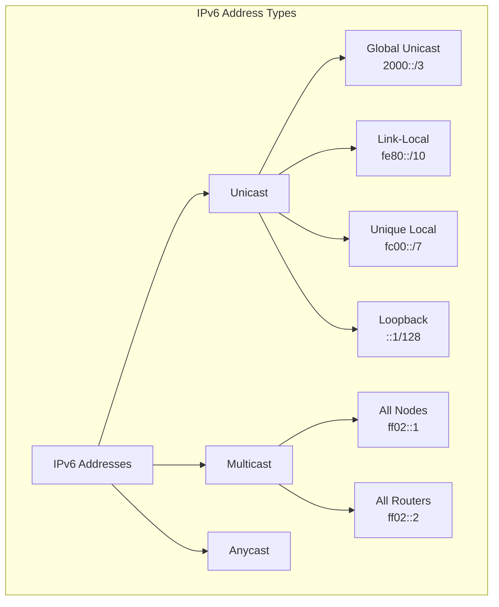
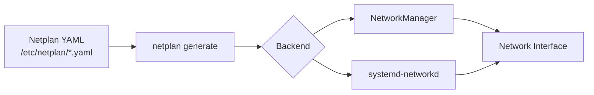
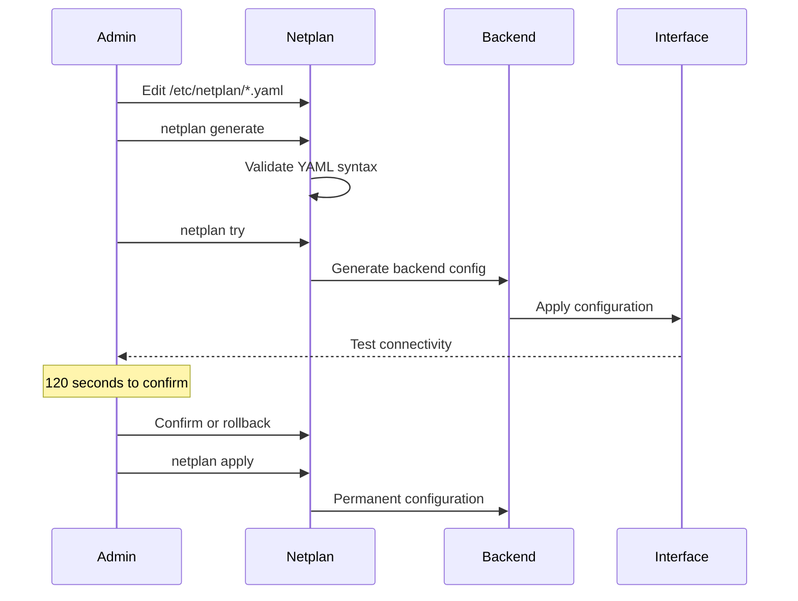

# How to Configure IPv6 Addressing on Ubuntu Servers

Author: [nawazdhandala](https://www.github.com/nawazdhandala)

Tags: IPv6, Ubuntu, Linux, Networking, Netplan, Server Configuration, System Administration

Description: A comprehensive guide to configuring IPv6 addressing on Ubuntu servers using Netplan, covering address types, static and dynamic configurations, and verification commands.

---

## Introduction

IPv6 adoption continues to grow as organizations face IPv4 address exhaustion. Ubuntu servers, with their robust networking stack and Netplan configuration system, provide excellent support for IPv6. This guide walks you through configuring IPv6 addressing on Ubuntu servers, from understanding address types to implementing practical configurations.

## Understanding IPv6 Address Types

Before diving into configuration, it's essential to understand the different types of IPv6 addresses you'll encounter.



### Global Unicast Addresses (GUA)

Global Unicast Addresses are the IPv6 equivalent of public IPv4 addresses. They are globally routable and unique across the internet.

```
2001:0db8:85a3:0000:0000:8a2e:0370:7334
|    |    |    |         |
|    |    |    |         +-- Interface ID (64 bits)
|    |    |    +------------ Subnet ID
|    +----+----------------- Global Routing Prefix
+--------------------------- Prefix (indicates GUA)
```

### Link-Local Addresses

Every IPv6-enabled interface automatically generates a link-local address (fe80::/10). These addresses are used for communication within a single network segment.

```bash
# Link-local addresses are always present
ip -6 addr show | grep fe80
```

### Unique Local Addresses (ULA)

Similar to private IPv4 addresses (10.x.x.x, 192.168.x.x), ULAs are used for local communications and are not routable on the public internet.

```
fc00::/7 range, commonly using fd00::/8
Example: fd12:3456:789a::/48
```

## Prerequisites

Before configuring IPv6, ensure your system meets these requirements:

```bash
# Check Ubuntu version (18.04+ recommended for Netplan)
lsb_release -a

# Verify IPv6 kernel support
cat /proc/net/if_inet6

# Check if IPv6 is enabled
sysctl net.ipv6.conf.all.disable_ipv6
# Output should be 0 (enabled)
```

If IPv6 is disabled, enable it:

```bash
# Temporary enable
sudo sysctl -w net.ipv6.conf.all.disable_ipv6=0
sudo sysctl -w net.ipv6.conf.default.disable_ipv6=0

# Permanent enable - add to /etc/sysctl.conf
echo "net.ipv6.conf.all.disable_ipv6 = 0" | sudo tee -a /etc/sysctl.conf
echo "net.ipv6.conf.default.disable_ipv6 = 0" | sudo tee -a /etc/sysctl.conf
sudo sysctl -p
```

## Netplan Configuration Overview

Ubuntu uses Netplan as its network configuration abstraction layer. Netplan configuration files are written in YAML and stored in `/etc/netplan/`.



### Netplan File Structure

```yaml
# /etc/netplan/01-netcfg.yaml
network:
  version: 2
  renderer: networkd  # or NetworkManager
  ethernets:
    eth0:
      # IPv4 and IPv6 configuration here
```

## Configuring Static IPv6 Addresses

### Basic Static Configuration

Create or edit a Netplan configuration file:

```yaml
# /etc/netplan/01-ipv6-static.yaml
network:
  version: 2
  renderer: networkd
  ethernets:
    eth0:
      addresses:
        - 192.168.1.100/24
        - 2001:db8:1::100/64
      routes:
        - to: default
          via: 192.168.1.1
        - to: default
          via: 2001:db8:1::1
      nameservers:
        addresses:
          - 8.8.8.8
          - 2001:4860:4860::8888
          - 2001:4860:4860::8844
```

### Multiple IPv6 Addresses

You can assign multiple IPv6 addresses to a single interface:

```yaml
# /etc/netplan/01-multi-ipv6.yaml
network:
  version: 2
  renderer: networkd
  ethernets:
    eth0:
      addresses:
        - 2001:db8:1::100/64
        - 2001:db8:1::101/64
        - 2001:db8:1::102/64
        - fd00:1234:5678::1/64  # ULA address
      routes:
        - to: default
          via: 2001:db8:1::1
```

### Static Configuration with Privacy Extensions

Privacy extensions generate temporary addresses for outgoing connections:

```yaml
# /etc/netplan/01-ipv6-privacy.yaml
network:
  version: 2
  renderer: networkd
  ethernets:
    eth0:
      addresses:
        - 2001:db8:1::100/64
      ipv6-privacy: true
      routes:
        - to: default
          via: 2001:db8:1::1
```

## Configuring Dynamic IPv6 (SLAAC/DHCPv6)

### SLAAC Configuration

Stateless Address Autoconfiguration (SLAAC) allows automatic address configuration:

```yaml
# /etc/netplan/01-ipv6-slaac.yaml
network:
  version: 2
  renderer: networkd
  ethernets:
    eth0:
      dhcp4: true
      dhcp6: false
      accept-ra: true  # Accept Router Advertisements for SLAAC
```

### DHCPv6 Configuration

For stateful address assignment via DHCPv6:

```yaml
# /etc/netplan/01-ipv6-dhcp6.yaml
network:
  version: 2
  renderer: networkd
  ethernets:
    eth0:
      dhcp4: true
      dhcp6: true
      accept-ra: true
```

### Combined SLAAC and DHCPv6

In some environments, you might use SLAAC for addresses and DHCPv6 for additional options:

```yaml
# /etc/netplan/01-ipv6-combined.yaml
network:
  version: 2
  renderer: networkd
  ethernets:
    eth0:
      dhcp4: true
      dhcp6: true
      accept-ra: true
      ipv6-privacy: true
      dhcp6-overrides:
        use-dns: true
        use-domains: true
```

## Applying Netplan Configuration

After creating or modifying your Netplan configuration:

```bash
# Validate the configuration syntax
sudo netplan generate

# Test the configuration (with automatic rollback)
sudo netplan try

# Apply the configuration permanently
sudo netplan apply

# Debug if issues occur
sudo netplan --debug apply
```

## Network Configuration Flow



## Verification Commands

### Check IPv6 Addresses

```bash
# Show all IPv6 addresses
ip -6 addr show

# Show addresses for specific interface
ip -6 addr show dev eth0

# Alternative using ifconfig
ifconfig eth0 | grep inet6
```

Example output:

```
2: eth0: <BROADCAST,MULTICAST,UP,LOWER_UP> mtu 1500 state UP
    inet6 2001:db8:1::100/64 scope global
       valid_lft forever preferred_lft forever
    inet6 fe80::a00:27ff:fe4e:66a1/64 scope link
       valid_lft forever preferred_lft forever
```

### Check IPv6 Routes

```bash
# Display IPv6 routing table
ip -6 route show

# Show default route
ip -6 route show default

# More detailed routing information
ip -6 route show table all
```

### Test IPv6 Connectivity

```bash
# Ping IPv6 address
ping6 2001:db8:1::1
# or
ping -6 2001:db8:1::1

# Ping Google's IPv6 DNS
ping6 2001:4860:4860::8888

# Ping link-local address (specify interface)
ping6 fe80::1%eth0

# Trace route over IPv6
traceroute6 ipv6.google.com
# or
traceroute -6 ipv6.google.com
```

### Check DNS Resolution

```bash
# Query AAAA records
dig AAAA google.com

# Test with specific IPv6 DNS server
dig @2001:4860:4860::8888 AAAA google.com

# Use host command
host -t AAAA google.com
```

### Network Statistics

```bash
# IPv6 socket statistics
ss -6 -tuln

# IPv6 connection statistics
netstat -6 -tuln

# IPv6 interface statistics
ip -6 -s link show eth0
```

## Advanced Configuration Examples

### Server with Dual-Stack Configuration

```yaml
# /etc/netplan/01-dual-stack-server.yaml
network:
  version: 2
  renderer: networkd
  ethernets:
    eth0:
      addresses:
        - 192.168.1.10/24
        - 2001:db8:1::10/64
      routes:
        - to: 0.0.0.0/0
          via: 192.168.1.1
        - to: ::/0
          via: 2001:db8:1::1
      nameservers:
        addresses:
          - 192.168.1.1
          - 2001:db8:1::1
          - 8.8.8.8
          - 2001:4860:4860::8888
        search:
          - example.com
          - internal.example.com
```

### Multiple Interfaces with Different IPv6 Configurations

```yaml
# /etc/netplan/01-multi-interface.yaml
network:
  version: 2
  renderer: networkd
  ethernets:
    eth0:  # Public interface
      addresses:
        - 203.0.113.10/24
        - 2001:db8:public::10/64
      routes:
        - to: default
          via: 203.0.113.1
        - to: default
          via: 2001:db8:public::1
      nameservers:
        addresses:
          - 2001:4860:4860::8888

    eth1:  # Private interface
      addresses:
        - 10.0.0.10/24
        - fd00:private::10/64
      routes:
        - to: fd00::/8
          via: fd00:private::1
```

### VLAN Configuration with IPv6

```yaml
# /etc/netplan/01-vlan-ipv6.yaml
network:
  version: 2
  renderer: networkd
  ethernets:
    eth0:
      dhcp4: false
      dhcp6: false
  vlans:
    vlan100:
      id: 100
      link: eth0
      addresses:
        - 192.168.100.10/24
        - 2001:db8:100::10/64
      routes:
        - to: default
          via: 192.168.100.1
        - to: default
          via: 2001:db8:100::1
    vlan200:
      id: 200
      link: eth0
      addresses:
        - 192.168.200.10/24
        - 2001:db8:200::10/64
```

### Bonding with IPv6

```yaml
# /etc/netplan/01-bond-ipv6.yaml
network:
  version: 2
  renderer: networkd
  ethernets:
    eth0:
      dhcp4: false
      dhcp6: false
    eth1:
      dhcp4: false
      dhcp6: false
  bonds:
    bond0:
      interfaces:
        - eth0
        - eth1
      addresses:
        - 192.168.1.10/24
        - 2001:db8:1::10/64
      routes:
        - to: default
          via: 192.168.1.1
        - to: default
          via: 2001:db8:1::1
      parameters:
        mode: 802.3ad
        lacp-rate: fast
        mii-monitor-interval: 100
```

## IPv6 Firewall Configuration

Don't forget to configure ip6tables for IPv6 traffic:

```bash
# Allow established connections
sudo ip6tables -A INPUT -m state --state ESTABLISHED,RELATED -j ACCEPT

# Allow loopback
sudo ip6tables -A INPUT -i lo -j ACCEPT

# Allow ICMPv6 (essential for IPv6 operation)
sudo ip6tables -A INPUT -p ipv6-icmp -j ACCEPT

# Allow SSH
sudo ip6tables -A INPUT -p tcp --dport 22 -j ACCEPT

# Allow HTTP/HTTPS
sudo ip6tables -A INPUT -p tcp --dport 80 -j ACCEPT
sudo ip6tables -A INPUT -p tcp --dport 443 -j ACCEPT

# Drop all other incoming traffic
sudo ip6tables -A INPUT -j DROP

# Save rules
sudo ip6tables-save | sudo tee /etc/iptables/rules.v6
```

For UFW (Uncomplicated Firewall):

```bash
# Enable IPv6 in UFW
sudo sed -i 's/IPV6=no/IPV6=yes/' /etc/default/ufw

# Reload UFW
sudo ufw reload

# Add IPv6-specific rules if needed
sudo ufw allow from 2001:db8:1::/64 to any port 22
```

## Troubleshooting Common Issues

### IPv6 Not Working

```bash
# Check if IPv6 is enabled
sysctl -a | grep disable_ipv6

# Verify interface has IPv6 address
ip -6 addr show

# Check if router advertisements are being received
sudo tcpdump -i eth0 -n icmp6

# Verify default route exists
ip -6 route show default
```

### Address Not Being Assigned

```bash
# Check Netplan configuration syntax
sudo netplan generate --debug

# View systemd-networkd logs
journalctl -u systemd-networkd -f

# Check interface status
networkctl status eth0
```

### Connectivity Issues

```bash
# Test local connectivity first
ping6 -c 3 fe80::1%eth0

# Check neighbor discovery
ip -6 neigh show

# Verify DNS is working
dig AAAA google.com

# Check for firewall blocks
sudo ip6tables -L -v -n
```

## Best Practices

1. **Always maintain IPv4 alongside IPv6** - Dual-stack is the safest approach during transition
2. **Use meaningful address schemes** - Plan your IPv6 addressing for easy management
3. **Enable privacy extensions on workstations** - Protect user privacy with temporary addresses
4. **Configure firewall rules for both protocols** - Don't forget ip6tables
5. **Monitor both protocol stacks** - Ensure monitoring tools support IPv6
6. **Document your IPv6 addressing plan** - The larger address space requires good documentation
7. **Test thoroughly before production** - Use `netplan try` for safe testing

## Conclusion

Configuring IPv6 on Ubuntu servers is straightforward with Netplan. Whether you're using static addressing for servers or dynamic configuration with SLAAC/DHCPv6, Ubuntu provides the flexibility needed for modern networking environments. Remember to verify your configuration with the provided commands and ensure your firewall rules accommodate IPv6 traffic.

As IPv6 adoption continues to grow, having well-configured dual-stack servers ensures your infrastructure is ready for the future of internet connectivity.
