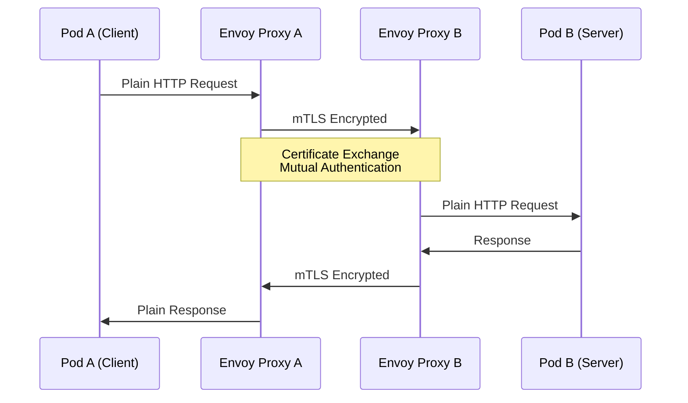
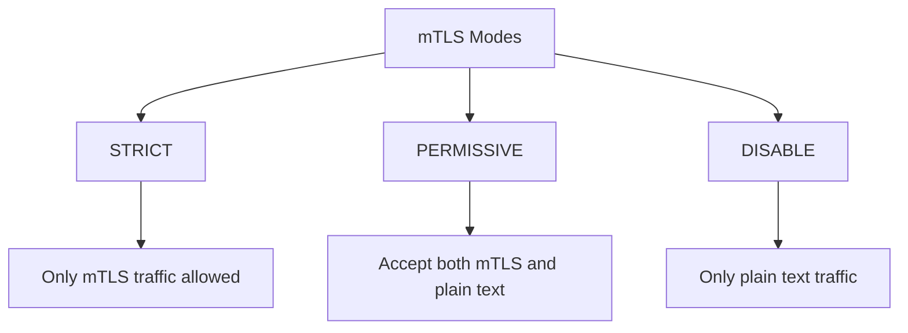
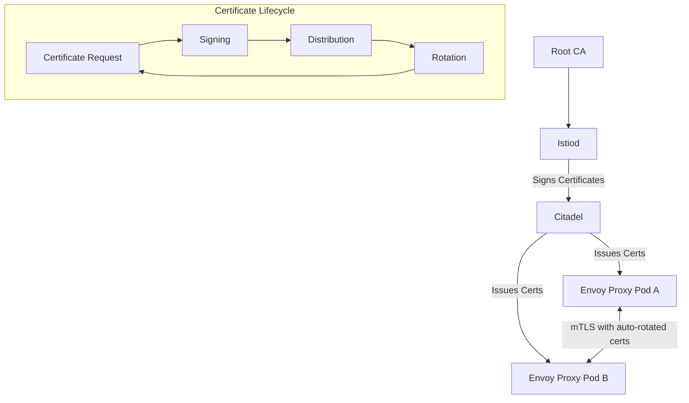
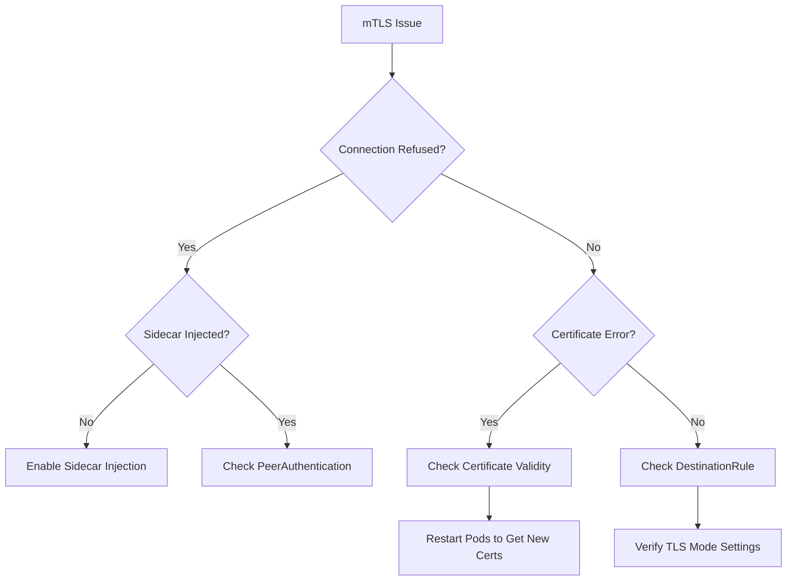
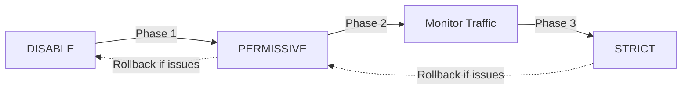

# How to Secure Pod-to-Pod Communication with mTLS using Istio

Author: [nawazdhandala](https://www.github.com/nawazdhandala)

Tags: istio, mtls, kubernetes, security, service mesh, certificates, pod communication, zero trust

Description: A comprehensive guide to implementing mutual TLS (mTLS) for secure pod-to-pod communication in Kubernetes using Istio service mesh.

---

Mutual TLS (mTLS) is a critical security feature that ensures encrypted and authenticated communication between services. Istio makes implementing mTLS straightforward while providing automatic certificate management. This guide covers everything from basic setup to advanced configurations.

## Understanding mTLS in Istio



## Prerequisites

Before starting, ensure you have:

```bash
# Kubernetes cluster
kubectl cluster-info

# Istio installed
istioctl version

# Verify Istio installation
kubectl get pods -n istio-system
```

## Installing Istio with mTLS Support

```bash
# Download Istio
curl -L https://istio.io/downloadIstio | sh -
cd istio-*
export PATH=$PWD/bin:$PATH

# Install Istio with default profile (includes mTLS)
istioctl install --set profile=default -y

# Verify installation
istioctl verify-install
```

## Istio mTLS Modes

Istio supports several mTLS modes:



| Mode | Description | Use Case |
|------|-------------|----------|
| STRICT | Only accept mTLS connections | Production environments |
| PERMISSIVE | Accept both mTLS and plain text | Migration period |
| DISABLE | Disable mTLS | Legacy services |

## Enabling mTLS with PeerAuthentication

### Namespace-Wide mTLS

```yaml
# peer-authentication-namespace.yaml
apiVersion: security.istio.io/v1beta1
kind: PeerAuthentication
metadata:
  name: default
  namespace: production
spec:
  mtls:
    mode: STRICT
```

Apply the policy:

```bash
kubectl apply -f peer-authentication-namespace.yaml
```

### Mesh-Wide mTLS (All Namespaces)

```yaml
# peer-authentication-mesh.yaml
apiVersion: security.istio.io/v1beta1
kind: PeerAuthentication
metadata:
  name: default
  namespace: istio-system  # Applied to root namespace
spec:
  mtls:
    mode: STRICT
```

### Workload-Specific mTLS

```yaml
# peer-authentication-workload.yaml
apiVersion: security.istio.io/v1beta1
kind: PeerAuthentication
metadata:
  name: api-service-mtls
  namespace: production
spec:
  selector:
    matchLabels:
      app: api-service
  mtls:
    mode: STRICT
```

### Port-Level mTLS Configuration

```yaml
# peer-authentication-port.yaml
apiVersion: security.istio.io/v1beta1
kind: PeerAuthentication
metadata:
  name: mixed-mtls
  namespace: production
spec:
  selector:
    matchLabels:
      app: legacy-service
  mtls:
    mode: STRICT
  portLevelMtls:
    8080:
      mode: PERMISSIVE  # Allow non-mTLS on port 8080
    9090:
      mode: DISABLE     # Metrics endpoint without mTLS
```

## Configuring DestinationRule for mTLS

DestinationRule defines how clients connect to services:

### Basic mTLS DestinationRule

```yaml
# destination-rule-mtls.yaml
apiVersion: networking.istio.io/v1beta1
kind: DestinationRule
metadata:
  name: api-service-mtls
  namespace: production
spec:
  host: api-service.production.svc.cluster.local
  trafficPolicy:
    tls:
      mode: ISTIO_MUTUAL  # Use Istio's built-in certificates
```

### Namespace-Wide DestinationRule

```yaml
# destination-rule-namespace.yaml
apiVersion: networking.istio.io/v1beta1
kind: DestinationRule
metadata:
  name: default
  namespace: production
spec:
  host: "*.production.svc.cluster.local"
  trafficPolicy:
    tls:
      mode: ISTIO_MUTUAL
```

### Mesh-Wide DestinationRule

```yaml
# destination-rule-mesh.yaml
apiVersion: networking.istio.io/v1beta1
kind: DestinationRule
metadata:
  name: default
  namespace: istio-system
spec:
  host: "*.local"
  trafficPolicy:
    tls:
      mode: ISTIO_MUTUAL
```

## Certificate Management

### Understanding Istio Certificate Architecture



### Viewing Current Certificates

```bash
# Check certificate status for a workload
istioctl proxy-config secret <pod-name> -n <namespace>

# Example output:
# RESOURCE NAME     TYPE           STATUS     VALID CERT     SERIAL NUMBER     NOT AFTER
# default           Cert Chain     ACTIVE     true           1234567890        2026-01-09T10:30:00Z
# ROOTCA            CA             ACTIVE     true           0987654321        2027-01-08T10:30:00Z
```

### Checking Certificate Details

```bash
# Get certificate chain
istioctl proxy-config secret <pod-name> -n <namespace> -o json | \
  jq -r '.dynamicActiveSecrets[0].secret.tlsCertificate.certificateChain.inlineBytes' | \
  base64 -d | openssl x509 -text -noout
```

### Custom Certificate Authority

```yaml
# custom-ca-secret.yaml
apiVersion: v1
kind: Secret
metadata:
  name: cacerts
  namespace: istio-system
type: Opaque
data:
  ca-cert.pem: <base64-encoded-ca-cert>
  ca-key.pem: <base64-encoded-ca-key>
  cert-chain.pem: <base64-encoded-cert-chain>
  root-cert.pem: <base64-encoded-root-cert>
```

```bash
# Create secret with custom CA
kubectl create secret generic cacerts -n istio-system \
  --from-file=ca-cert.pem \
  --from-file=ca-key.pem \
  --from-file=root-cert.pem \
  --from-file=cert-chain.pem
```

### Certificate Rotation Configuration

```yaml
# istio-config.yaml
apiVersion: install.istio.io/v1alpha1
kind: IstioOperator
spec:
  meshConfig:
    certificates:
      - secretName: dns-cert
        dnsNames:
          - api.example.com
  values:
    pilot:
      env:
        # Certificate validity duration (default: 24h)
        PILOT_CERT_PROVIDER: istiod
        # Auto-rotation happens at 80% of validity
```

## Complete mTLS Setup Example

### Step 1: Create Namespace with Istio Injection

```yaml
# namespace.yaml
apiVersion: v1
kind: Namespace
metadata:
  name: secure-apps
  labels:
    istio-injection: enabled
```

### Step 2: Deploy Sample Applications

```yaml
# sample-apps.yaml
apiVersion: apps/v1
kind: Deployment
metadata:
  name: frontend
  namespace: secure-apps
spec:
  replicas: 2
  selector:
    matchLabels:
      app: frontend
  template:
    metadata:
      labels:
        app: frontend
    spec:
      containers:
        - name: frontend
          image: nginx
          ports:
            - containerPort: 80
---
apiVersion: v1
kind: Service
metadata:
  name: frontend
  namespace: secure-apps
spec:
  selector:
    app: frontend
  ports:
    - port: 80
      targetPort: 80
---
apiVersion: apps/v1
kind: Deployment
metadata:
  name: backend
  namespace: secure-apps
spec:
  replicas: 2
  selector:
    matchLabels:
      app: backend
  template:
    metadata:
      labels:
        app: backend
    spec:
      containers:
        - name: backend
          image: nginx
          ports:
            - containerPort: 80
---
apiVersion: v1
kind: Service
metadata:
  name: backend
  namespace: secure-apps
spec:
  selector:
    app: backend
  ports:
    - port: 80
      targetPort: 80
```

### Step 3: Apply mTLS Policy

```yaml
# mtls-policy.yaml
apiVersion: security.istio.io/v1beta1
kind: PeerAuthentication
metadata:
  name: strict-mtls
  namespace: secure-apps
spec:
  mtls:
    mode: STRICT
---
apiVersion: networking.istio.io/v1beta1
kind: DestinationRule
metadata:
  name: mtls-destination
  namespace: secure-apps
spec:
  host: "*.secure-apps.svc.cluster.local"
  trafficPolicy:
    tls:
      mode: ISTIO_MUTUAL
```

### Step 4: Apply All Configurations

```bash
kubectl apply -f namespace.yaml
kubectl apply -f sample-apps.yaml
kubectl apply -f mtls-policy.yaml
```

## Verifying mTLS Configuration

### Check PeerAuthentication Status

```bash
# List all PeerAuthentication policies
kubectl get peerauthentication --all-namespaces

# Describe specific policy
kubectl describe peerauthentication strict-mtls -n secure-apps
```

### Verify mTLS is Active

```bash
# Check if mTLS is enabled between services
istioctl x authz check <pod-name> -n <namespace>

# Check proxy configuration
istioctl proxy-config listener <pod-name> -n <namespace>
```

### Test mTLS Connection

```bash
# Deploy a test pod without Istio sidecar
kubectl run test-pod --image=curlimages/curl -n secure-apps \
  --overrides='{"metadata":{"annotations":{"sidecar.istio.io/inject":"false"}}}' \
  --command -- sleep infinity

# Try to connect (should fail with STRICT mTLS)
kubectl exec -it test-pod -n secure-apps -- curl -v http://backend

# Expected: Connection refused or reset (non-mTLS client blocked)
```

### Using istioctl to Analyze mTLS

```bash
# Analyze mesh configuration
istioctl analyze -n secure-apps

# Check TLS configuration
istioctl proxy-config cluster <pod-name> -n <namespace> --fqdn backend.secure-apps.svc.cluster.local -o json | jq '.[] | .transportSocket'
```

## Authorization Policies with mTLS

Once mTLS is enabled, you can use service identities for authorization:

```yaml
# authorization-policy.yaml
apiVersion: security.istio.io/v1beta1
kind: AuthorizationPolicy
metadata:
  name: backend-access
  namespace: secure-apps
spec:
  selector:
    matchLabels:
      app: backend
  action: ALLOW
  rules:
    - from:
        - source:
            principals:
              - "cluster.local/ns/secure-apps/sa/frontend"
      to:
        - operation:
            methods: ["GET", "POST"]
            paths: ["/api/*"]
```

### Deny All by Default

```yaml
# deny-all.yaml
apiVersion: security.istio.io/v1beta1
kind: AuthorizationPolicy
metadata:
  name: deny-all
  namespace: secure-apps
spec:
  {}  # Empty spec denies all traffic
```

## Troubleshooting mTLS Issues

### Common Issues and Solutions



### Debug Commands

```bash
# Check if sidecar is injected
kubectl get pods -n secure-apps -o jsonpath='{.items[*].spec.containers[*].name}' | tr ' ' '\n' | grep istio-proxy

# View Envoy access logs
kubectl logs <pod-name> -n secure-apps -c istio-proxy --tail=100

# Check Envoy configuration
istioctl proxy-config all <pod-name> -n <namespace>

# Verify TLS configuration
istioctl proxy-config secret <pod-name> -n <namespace>

# Debug with verbose output
istioctl analyze --verbose -n secure-apps
```

### Checking mTLS Status

```bash
# Create a script to check mTLS status
cat << 'EOF' > check-mtls.sh
#!/bin/bash
NAMESPACE=${1:-default}

echo "=== Checking mTLS Status in $NAMESPACE ==="

echo -e "\n=== PeerAuthentication Policies ==="
kubectl get peerauthentication -n $NAMESPACE -o wide

echo -e "\n=== DestinationRules ==="
kubectl get destinationrule -n $NAMESPACE -o wide

echo -e "\n=== Pods with Sidecars ==="
kubectl get pods -n $NAMESPACE -o jsonpath='{range .items[*]}{.metadata.name}{"\t"}{.spec.containers[*].name}{"\n"}{end}'

echo -e "\n=== Istio Analysis ==="
istioctl analyze -n $NAMESPACE
EOF

chmod +x check-mtls.sh
./check-mtls.sh secure-apps
```

## Gradual Migration to STRICT mTLS



### Phase 1: Enable PERMISSIVE Mode

```yaml
# phase1-permissive.yaml
apiVersion: security.istio.io/v1beta1
kind: PeerAuthentication
metadata:
  name: default
  namespace: secure-apps
spec:
  mtls:
    mode: PERMISSIVE
```

### Phase 2: Monitor Traffic

```bash
# Check for non-mTLS traffic
kubectl logs -n istio-system -l app=istiod | grep -i "non-mtls"

# Use Kiali to visualize traffic
istioctl dashboard kiali
```

### Phase 3: Switch to STRICT

```yaml
# phase3-strict.yaml
apiVersion: security.istio.io/v1beta1
kind: PeerAuthentication
metadata:
  name: default
  namespace: secure-apps
spec:
  mtls:
    mode: STRICT
```

## Best Practices

1. **Start with PERMISSIVE mode** during migration to avoid service disruptions.

2. **Use namespace-level policies** for consistent security within a namespace.

3. **Monitor certificate expiration** and ensure automatic rotation is working.

4. **Combine with AuthorizationPolicy** for defense in depth.

5. **Test in non-production first** before applying STRICT mode in production.

6. **Use istioctl analyze** regularly to catch configuration issues.

7. **Keep Istio updated** to get the latest security patches.

## Conclusion

Implementing mTLS with Istio provides strong security guarantees for pod-to-pod communication with minimal application changes. By using PeerAuthentication and DestinationRule resources, you can enforce encryption and authentication across your entire mesh.

Key takeaways:
- Use PERMISSIVE mode during migration, STRICT for production
- PeerAuthentication controls what a service accepts
- DestinationRule controls how a client connects
- Istio handles certificate management automatically
- Always verify mTLS is working with istioctl commands
