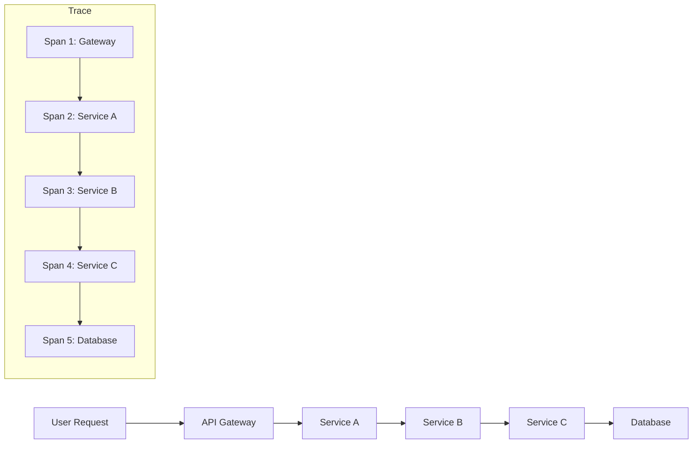
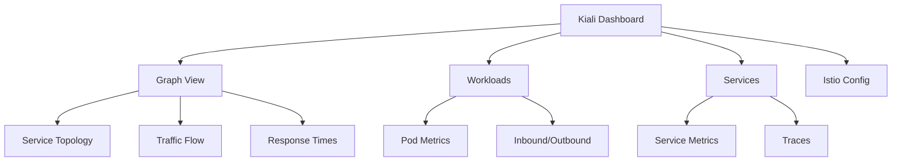
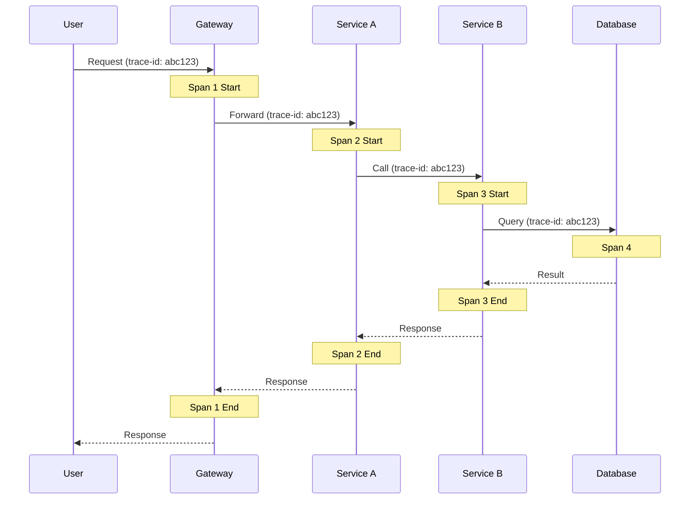
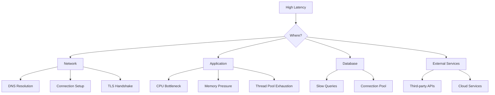

# How to Trace Network Latency Between Microservices with Istio

Author: [nawazdhandala](https://www.github.com/nawazdhandala)

Tags: istio, distributed tracing, latency, jaeger, kiali, observability, microservices, kubernetes, telemetry

Description: Learn how to trace and analyze network latency between microservices using Istio's telemetry, Kiali dashboard, and Jaeger distributed tracing integration.

---

Understanding and debugging latency issues in microservices architectures can be challenging. Istio provides powerful telemetry and tracing capabilities that help identify bottlenecks and optimize service communication. This guide covers setting up and using Istio's observability stack for latency analysis.

## Understanding Distributed Tracing



A distributed trace consists of:
- **Trace**: The entire journey of a request
- **Span**: A single operation within a trace
- **Context Propagation**: Passing trace information between services

## Prerequisites

Ensure you have:

```bash
# Kubernetes cluster with Istio installed
kubectl get pods -n istio-system

# Istio CLI
istioctl version

# Verify Istio injection is enabled
kubectl get namespace -L istio-injection
```

## Installing Istio Telemetry Stack

### Install Kiali, Jaeger, and Prometheus

```bash
# Install Istio with addons
kubectl apply -f https://raw.githubusercontent.com/istio/istio/release-1.20/samples/addons/prometheus.yaml
kubectl apply -f https://raw.githubusercontent.com/istio/istio/release-1.20/samples/addons/jaeger.yaml
kubectl apply -f https://raw.githubusercontent.com/istio/istio/release-1.20/samples/addons/kiali.yaml
kubectl apply -f https://raw.githubusercontent.com/istio/istio/release-1.20/samples/addons/grafana.yaml

# Wait for deployments
kubectl rollout status deployment/kiali -n istio-system
kubectl rollout status deployment/jaeger -n istio-system
kubectl rollout status deployment/prometheus -n istio-system
```

### Verify Installation

```bash
# Check addon pods
kubectl get pods -n istio-system -l "app in (kiali,jaeger,prometheus,grafana)"

# Expected output:
# NAME                          READY   STATUS    RESTARTS   AGE
# grafana-xxxxxxxxxx-xxxxx      1/1     Running   0          2m
# jaeger-xxxxxxxxxx-xxxxx       1/1     Running   0          2m
# kiali-xxxxxxxxxx-xxxxx        1/1     Running   0          2m
# prometheus-xxxxxxxxxx-xxxxx   2/2     Running   0          2m
```

## Configuring Telemetry

### Enable Tracing

```yaml
# telemetry.yaml
apiVersion: telemetry.istio.io/v1alpha1
kind: Telemetry
metadata:
  name: mesh-default
  namespace: istio-system
spec:
  tracing:
    - providers:
        - name: jaeger
      randomSamplingPercentage: 100.0  # Sample all requests (adjust for production)
```

```bash
kubectl apply -f telemetry.yaml
```

### Configure Sampling Rate

```yaml
# telemetry-production.yaml
apiVersion: telemetry.istio.io/v1alpha1
kind: Telemetry
metadata:
  name: mesh-default
  namespace: istio-system
spec:
  tracing:
    - providers:
        - name: jaeger
      randomSamplingPercentage: 1.0  # 1% sampling for production
      customTags:
        environment:
          literal:
            value: production
```

### Namespace-Specific Telemetry

```yaml
# namespace-telemetry.yaml
apiVersion: telemetry.istio.io/v1alpha1
kind: Telemetry
metadata:
  name: tracing-config
  namespace: my-app
spec:
  tracing:
    - providers:
        - name: jaeger
      randomSamplingPercentage: 50.0  # Higher sampling for specific namespace
      customTags:
        team:
          literal:
            value: platform
```

## Using Kiali Dashboard

### Accessing Kiali

```bash
# Port-forward Kiali
kubectl port-forward svc/kiali -n istio-system 20001:20001 &

# Or use istioctl
istioctl dashboard kiali
```

### Kiali Features for Latency Analysis



### Graph View Analysis

The Graph view shows:
- Service topology and dependencies
- Request rates (requests/second)
- Response times (latency)
- Success rates
- Error rates

### Configuring Graph Display

```yaml
# kiali-config.yaml
apiVersion: kiali.io/v1alpha1
kind: Kiali
metadata:
  name: kiali
  namespace: istio-system
spec:
  deployment:
    view_only_mode: false
  external_services:
    prometheus:
      url: http://prometheus:9090
    tracing:
      enabled: true
      in_cluster_url: http://jaeger-query:16685/jaeger
      use_grpc: true
```

## Using Jaeger for Distributed Tracing

### Accessing Jaeger UI

```bash
# Port-forward Jaeger
kubectl port-forward svc/jaeger-query -n istio-system 16686:16686 &

# Or use istioctl
istioctl dashboard jaeger
```

### Understanding Jaeger Traces



### Searching Traces

In Jaeger UI:
1. Select a service from the dropdown
2. Set time range
3. Set minimum duration to find slow traces
4. Click "Find Traces"

### Analyzing a Trace

Key metrics to look for:
- **Total Duration**: End-to-end request time
- **Span Duration**: Time spent in each service
- **Critical Path**: The longest chain of sequential operations
- **Parallel Operations**: Spans that execute concurrently

## Context Propagation

For tracing to work correctly, applications must propagate trace headers:

### Required Headers

```bash
# B3 Headers (Zipkin format)
x-b3-traceid
x-b3-spanid
x-b3-parentspanid
x-b3-sampled
x-b3-flags

# W3C Trace Context
traceparent
tracestate

# Jaeger Headers
uber-trace-id

# Istio-specific
x-request-id
x-envoy-force-trace
```

### Application Code Example (Python)

```python
# trace_propagation.py
from flask import Flask, request
import requests

app = Flask(__name__)

# Headers to propagate
TRACE_HEADERS = [
    'x-request-id',
    'x-b3-traceid',
    'x-b3-spanid',
    'x-b3-parentspanid',
    'x-b3-sampled',
    'x-b3-flags',
    'traceparent',
    'tracestate',
]

def propagate_headers():
    """Extract trace headers from incoming request."""
    headers = {}
    for header in TRACE_HEADERS:
        value = request.headers.get(header)
        if value:
            headers[header] = value
    return headers

@app.route('/api/users')
def get_users():
    # Propagate trace headers to downstream service
    headers = propagate_headers()

    # Call downstream service with trace context
    response = requests.get(
        'http://user-service:8080/users',
        headers=headers
    )
    return response.json()

if __name__ == '__main__':
    app.run(host='0.0.0.0', port=8080)
```

### Application Code Example (Node.js)

```javascript
// trace-propagation.js
const express = require('express');
const axios = require('axios');

const app = express();

const TRACE_HEADERS = [
    'x-request-id',
    'x-b3-traceid',
    'x-b3-spanid',
    'x-b3-parentspanid',
    'x-b3-sampled',
    'x-b3-flags',
    'traceparent',
    'tracestate',
];

function propagateHeaders(req) {
    const headers = {};
    TRACE_HEADERS.forEach(header => {
        const value = req.headers[header];
        if (value) {
            headers[header] = value;
        }
    });
    return headers;
}

app.get('/api/orders', async (req, res) => {
    try {
        // Propagate trace headers
        const headers = propagateHeaders(req);

        // Call downstream services
        const [users, products] = await Promise.all([
            axios.get('http://user-service:8080/users', { headers }),
            axios.get('http://product-service:8080/products', { headers })
        ]);

        res.json({ users: users.data, products: products.data });
    } catch (error) {
        res.status(500).json({ error: error.message });
    }
});

app.listen(8080, () => console.log('Server running on port 8080'));
```

## Latency Analysis Techniques

### Identifying Slow Services

```bash
# Use istioctl to analyze latency
istioctl experimental analyze

# Check metrics directly
kubectl exec -it $(kubectl get pod -l app=prometheus -n istio-system -o jsonpath='{.items[0].metadata.name}') -n istio-system -- \
  wget -qO- 'http://localhost:9090/api/v1/query?query=histogram_quantile(0.99,rate(istio_request_duration_milliseconds_bucket[5m]))'
```

### Prometheus Queries for Latency

```promql
# P50 latency by service
histogram_quantile(0.50,
  sum(rate(istio_request_duration_milliseconds_bucket{reporter="destination"}[5m])) by (le, destination_service_name)
)

# P99 latency by service
histogram_quantile(0.99,
  sum(rate(istio_request_duration_milliseconds_bucket{reporter="destination"}[5m])) by (le, destination_service_name)
)

# Latency increase over time
histogram_quantile(0.95,
  sum(rate(istio_request_duration_milliseconds_bucket{reporter="destination"}[5m])) by (le, destination_service_name)
)
-
histogram_quantile(0.95,
  sum(rate(istio_request_duration_milliseconds_bucket{reporter="destination"}[5m] offset 1h)) by (le, destination_service_name)
)

# Request rate by service
sum(rate(istio_requests_total{reporter="destination"}[5m])) by (destination_service_name)
```

### Grafana Dashboard

```bash
# Access Grafana
istioctl dashboard grafana

# Or port-forward
kubectl port-forward svc/grafana -n istio-system 3000:3000 &
```

Import Istio dashboards:
- Istio Mesh Dashboard
- Istio Service Dashboard
- Istio Workload Dashboard

## Custom Metrics and Tags

### Adding Custom Span Tags

```yaml
# custom-telemetry.yaml
apiVersion: telemetry.istio.io/v1alpha1
kind: Telemetry
metadata:
  name: custom-tracing
  namespace: my-app
spec:
  tracing:
    - providers:
        - name: jaeger
      randomSamplingPercentage: 100
      customTags:
        # Static tag
        environment:
          literal:
            value: "production"
        # Tag from request header
        user_id:
          header:
            name: x-user-id
            defaultValue: "unknown"
        # Tag from environment variable
        pod_name:
          environment:
            name: POD_NAME
            defaultValue: "unknown"
```

### EnvoyFilter for Advanced Tracing

```yaml
# envoy-filter-tracing.yaml
apiVersion: networking.istio.io/v1alpha3
kind: EnvoyFilter
metadata:
  name: custom-tracing
  namespace: istio-system
spec:
  configPatches:
    - applyTo: NETWORK_FILTER
      match:
        context: ANY
        listener:
          filterChain:
            filter:
              name: envoy.filters.network.http_connection_manager
      patch:
        operation: MERGE
        value:
          typed_config:
            "@type": type.googleapis.com/envoy.extensions.filters.network.http_connection_manager.v3.HttpConnectionManager
            tracing:
              max_path_tag_length: 256
              custom_tags:
                - tag: request.path
                  request_header:
                    name: ":path"
                - tag: request.method
                  request_header:
                    name: ":method"
```

## Complete Tracing Setup Example

### Deploy Sample Application

```yaml
# sample-app.yaml
apiVersion: v1
kind: Namespace
metadata:
  name: tracing-demo
  labels:
    istio-injection: enabled
---
apiVersion: apps/v1
kind: Deployment
metadata:
  name: frontend
  namespace: tracing-demo
spec:
  replicas: 1
  selector:
    matchLabels:
      app: frontend
  template:
    metadata:
      labels:
        app: frontend
    spec:
      containers:
        - name: frontend
          image: nginx
          ports:
            - containerPort: 80
---
apiVersion: v1
kind: Service
metadata:
  name: frontend
  namespace: tracing-demo
spec:
  selector:
    app: frontend
  ports:
    - port: 80
---
apiVersion: apps/v1
kind: Deployment
metadata:
  name: backend
  namespace: tracing-demo
spec:
  replicas: 1
  selector:
    matchLabels:
      app: backend
  template:
    metadata:
      labels:
        app: backend
    spec:
      containers:
        - name: backend
          image: nginx
          ports:
            - containerPort: 80
---
apiVersion: v1
kind: Service
metadata:
  name: backend
  namespace: tracing-demo
spec:
  selector:
    app: backend
  ports:
    - port: 80
```

### Configure Telemetry

```yaml
# demo-telemetry.yaml
apiVersion: telemetry.istio.io/v1alpha1
kind: Telemetry
metadata:
  name: tracing-config
  namespace: tracing-demo
spec:
  tracing:
    - providers:
        - name: jaeger
      randomSamplingPercentage: 100
```

### Generate Traffic

```bash
# Apply configurations
kubectl apply -f sample-app.yaml
kubectl apply -f demo-telemetry.yaml

# Generate traffic
kubectl run -n tracing-demo traffic-gen --image=curlimages/curl --rm -it --restart=Never -- \
  sh -c 'for i in $(seq 1 100); do curl -s frontend; sleep 0.1; done'
```

### Analyze in Dashboards

```bash
# Open Kiali
istioctl dashboard kiali

# Open Jaeger
istioctl dashboard jaeger

# Open Grafana
istioctl dashboard grafana
```

## Troubleshooting Latency Issues

### Common Latency Sources



### Debug Commands

```bash
# Check Envoy proxy stats
kubectl exec -it deploy/frontend -n tracing-demo -c istio-proxy -- pilot-agent request GET stats | grep latency

# View Envoy access logs
kubectl logs deploy/frontend -n tracing-demo -c istio-proxy --tail=100

# Check proxy configuration
istioctl proxy-config all deploy/frontend -n tracing-demo

# Analyze with istioctl
istioctl analyze -n tracing-demo
```

### Identifying Bottlenecks

```bash
# Find high-latency traces in Jaeger
# In Jaeger UI: Set min duration > 1s

# Check for retry storms
kubectl exec -it deploy/frontend -n tracing-demo -c istio-proxy -- \
  pilot-agent request GET stats | grep retry

# Check connection pool exhaustion
kubectl exec -it deploy/frontend -n tracing-demo -c istio-proxy -- \
  pilot-agent request GET stats | grep pending
```

## Best Practices

1. **Set appropriate sampling rates**: Use 100% for development, 1-10% for production.

2. **Always propagate trace headers**: Ensure all services forward trace context.

3. **Use custom tags**: Add business context to traces (user ID, order ID, etc.).

4. **Monitor P99 latency**: Focus on tail latencies, not just averages.

5. **Set up alerts**: Create alerts for latency SLO breaches.

6. **Correlate with logs**: Include trace IDs in application logs.

7. **Regularly review traces**: Make trace analysis part of incident response.

## Latency SLO Dashboard

```yaml
# grafana-dashboard-configmap.yaml
apiVersion: v1
kind: ConfigMap
metadata:
  name: latency-slo-dashboard
  namespace: istio-system
  labels:
    grafana_dashboard: "1"
data:
  latency-slo.json: |
    {
      "dashboard": {
        "title": "Service Latency SLOs",
        "panels": [
          {
            "title": "P99 Latency by Service",
            "type": "graph",
            "targets": [
              {
                "expr": "histogram_quantile(0.99, sum(rate(istio_request_duration_milliseconds_bucket{reporter=\"destination\"}[5m])) by (le, destination_service_name))",
                "legendFormat": "{{destination_service_name}}"
              }
            ]
          },
          {
            "title": "SLO Compliance (P99 < 500ms)",
            "type": "stat",
            "targets": [
              {
                "expr": "sum(histogram_quantile(0.99, sum(rate(istio_request_duration_milliseconds_bucket{reporter=\"destination\"}[5m])) by (le, destination_service_name)) < 500) / count(histogram_quantile(0.99, sum(rate(istio_request_duration_milliseconds_bucket{reporter=\"destination\"}[5m])) by (le, destination_service_name))) * 100"
              }
            ]
          }
        ]
      }
    }
```

## Conclusion

Istio's telemetry stack provides comprehensive tools for tracing and analyzing latency in microservices. By combining Kiali's visual topology, Jaeger's distributed tracing, and Prometheus metrics, you can effectively identify and resolve latency issues.

Key takeaways:
- Configure appropriate sampling rates for your environment
- Always propagate trace headers in your application code
- Use Kiali for service topology and traffic visualization
- Use Jaeger for detailed trace analysis
- Monitor P99 latencies and set up alerts for SLO breaches
- Correlate traces with logs and metrics for complete observability
