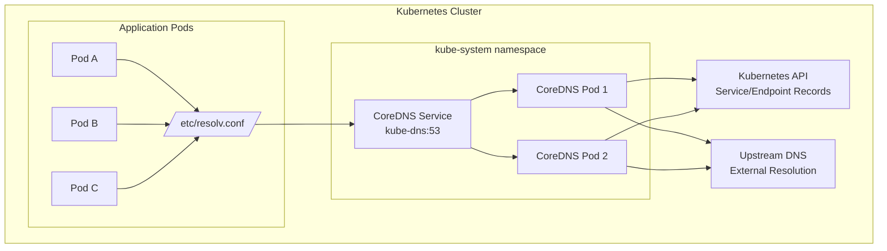
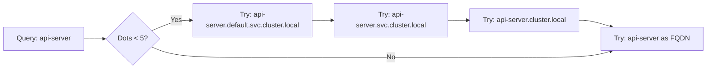
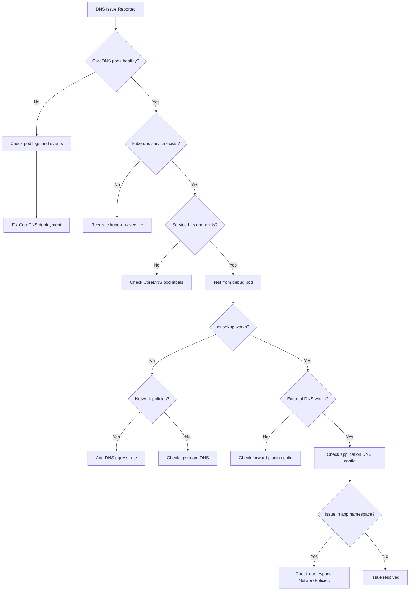

# How to Debug DNS Resolution Issues in Kubernetes with CoreDNS

Author: [nawazdhandala](https://www.github.com/nawazdhandala)

Tags: kubernetes, coredns, dns, debugging, networking, troubleshooting

Description: A comprehensive guide to diagnosing and resolving DNS resolution problems in Kubernetes clusters using CoreDNS.

---

DNS resolution is the backbone of service discovery in Kubernetes. When DNS fails, your applications can't communicate, leading to cascading failures across your cluster. This guide walks you through understanding CoreDNS architecture, identifying common issues, and systematically debugging DNS problems.

## Understanding CoreDNS Architecture in Kubernetes

CoreDNS is the default DNS server in Kubernetes since version 1.13. It runs as a deployment in the `kube-system` namespace and provides name resolution for all pods and services in the cluster.



### How DNS Resolution Works in Kubernetes

When a pod needs to resolve a service name:

1. The pod reads `/etc/resolv.conf` which points to the CoreDNS service IP
2. The DNS query is sent to CoreDNS
3. CoreDNS checks if it's a cluster-local name (e.g., `my-service.my-namespace.svc.cluster.local`)
4. For cluster services, CoreDNS queries the Kubernetes API
5. For external names, CoreDNS forwards to upstream DNS servers

### Default Pod DNS Configuration

Every pod gets a `/etc/resolv.conf` file automatically:

```bash
# View DNS configuration in a pod
kubectl exec -it my-pod -- cat /etc/resolv.conf
```

Typical output:

```
nameserver 10.96.0.10
search default.svc.cluster.local svc.cluster.local cluster.local
options ndots:5
```

## CoreDNS Corefile Configuration

The Corefile is CoreDNS's configuration file, stored as a ConfigMap:

```bash
kubectl get configmap coredns -n kube-system -o yaml
```

### Default Corefile Explained

```yaml
apiVersion: v1
kind: ConfigMap
metadata:
  name: coredns
  namespace: kube-system
data:
  Corefile: |
    .:53 {
        errors
        health {
            lameduck 5s
        }
        ready
        kubernetes cluster.local in-addr.arpa ip6.arpa {
            pods insecure
            fallthrough in-addr.arpa ip6.arpa
            ttl 30
        }
        prometheus :9153
        forward . /etc/resolv.conf {
            max_concurrent 1000
        }
        cache 30
        loop
        reload
        loadbalance
    }
```

### Corefile Plugins Breakdown

| Plugin | Purpose |
|--------|---------|
| `errors` | Logs errors to stdout |
| `health` | Provides health check endpoint on :8080 |
| `ready` | Readiness probe endpoint on :8181 |
| `kubernetes` | Enables cluster DNS resolution |
| `prometheus` | Exposes metrics on :9153 |
| `forward` | Forwards non-cluster queries upstream |
| `cache` | Caches DNS responses |
| `loop` | Detects forwarding loops |
| `reload` | Allows hot-reloading of Corefile |
| `loadbalance` | Randomizes answer order for load balancing |

## Common DNS Issues and Symptoms

### Issue 1: DNS Resolution Timeout

**Symptoms:**
- Pods can't reach services by name
- `nslookup` times out
- Applications show "Name resolution failed" errors

**Common Causes:**
- CoreDNS pods not running
- Network policies blocking DNS traffic
- CoreDNS service misconfigured

### Issue 2: Intermittent DNS Failures

**Symptoms:**
- DNS works sometimes but fails randomly
- High latency in name resolution
- Race conditions in application startup

**Common Causes:**
- CoreDNS resource constraints
- DNS caching issues
- CONNTRACK table exhaustion

### Issue 3: External DNS Resolution Fails

**Symptoms:**
- Cluster services resolve correctly
- External domains (google.com) fail
- Forward plugin misconfigured

**Common Causes:**
- Upstream DNS unreachable
- Network policies blocking egress
- Incorrect forward configuration

## Debugging Tools and Techniques

### Step 1: Verify CoreDNS is Running

```bash
# Check CoreDNS deployment status
kubectl get deployment coredns -n kube-system

# Check CoreDNS pods
kubectl get pods -n kube-system -l k8s-app=kube-dns

# View CoreDNS logs
kubectl logs -n kube-system -l k8s-app=kube-dns --tail=100
```

Expected healthy output:

```
NAME      READY   UP-TO-DATE   AVAILABLE   AGE
coredns   2/2     2            2           30d
```

### Step 2: Test DNS from a Debug Pod

Create a dedicated debug pod with DNS tools:

```yaml
apiVersion: v1
kind: Pod
metadata:
  name: dns-debug
  namespace: default
spec:
  containers:
  - name: debug
    image: nicolaka/netshoot:latest
    command: ["sleep", "3600"]
  dnsPolicy: ClusterFirst
```

```bash
kubectl apply -f dns-debug.yaml
kubectl exec -it dns-debug -- /bin/bash
```

### Step 3: Using nslookup

```bash
# Test cluster service resolution
nslookup kubernetes.default.svc.cluster.local

# Test with specific DNS server
nslookup kubernetes.default.svc.cluster.local 10.96.0.10

# Test external resolution
nslookup google.com
```

**Successful output:**

```
Server:         10.96.0.10
Address:        10.96.0.10#53

Name:   kubernetes.default.svc.cluster.local
Address: 10.96.0.1
```

**Failed output:**

```
;; connection timed out; no servers could be reached
```

### Step 4: Using dig for Detailed Analysis

```bash
# Detailed DNS query for a service
dig @10.96.0.10 kubernetes.default.svc.cluster.local +noall +answer +stats

# Check DNS response time
dig @10.96.0.10 my-service.my-namespace.svc.cluster.local +stats | grep "Query time"

# Trace DNS resolution path
dig +trace google.com

# Check specific record types
dig @10.96.0.10 my-service.my-namespace.svc.cluster.local A
dig @10.96.0.10 my-service.my-namespace.svc.cluster.local SRV
```

### Step 5: Check CoreDNS Service

```bash
# Verify the kube-dns service exists and has endpoints
kubectl get svc kube-dns -n kube-system

# Check service endpoints
kubectl get endpoints kube-dns -n kube-system

# Describe service for details
kubectl describe svc kube-dns -n kube-system
```

Expected output:

```
NAME       TYPE        CLUSTER-IP   EXTERNAL-IP   PORT(S)                  AGE
kube-dns   ClusterIP   10.96.0.10   <none>        53/UDP,53/TCP,9153/TCP   30d
```

## Advanced Debugging Scenarios

### Debugging DNS with Network Policies

Network policies can block DNS traffic. Check if any policies affect the `kube-system` namespace:

```bash
# List network policies in kube-system
kubectl get networkpolicies -n kube-system

# List network policies in your application namespace
kubectl get networkpolicies -n your-namespace
```

If you have network policies, ensure DNS traffic is allowed:

```yaml
apiVersion: networking.k8s.io/v1
kind: NetworkPolicy
metadata:
  name: allow-dns-egress
  namespace: your-namespace
spec:
  podSelector: {}
  policyTypes:
  - Egress
  egress:
  - to:
    - namespaceSelector:
        matchLabels:
          kubernetes.io/metadata.name: kube-system
      podSelector:
        matchLabels:
          k8s-app: kube-dns
    ports:
    - protocol: UDP
      port: 53
    - protocol: TCP
      port: 53
```

### Debugging ndots and Search Domains

The `ndots:5` setting can cause extra DNS queries. A name with fewer than 5 dots will be searched with all search domains first:



To reduce DNS queries, use fully qualified names with trailing dot:

```bash
# Instead of
curl http://my-service

# Use FQDN
curl http://my-service.my-namespace.svc.cluster.local.
```

Or customize DNS config per pod:

```yaml
apiVersion: v1
kind: Pod
metadata:
  name: optimized-dns-pod
spec:
  containers:
  - name: app
    image: my-app:latest
  dnsConfig:
    options:
    - name: ndots
      value: "2"
    - name: single-request-reopen
    - name: timeout
      value: "2"
    - name: attempts
      value: "3"
```

### Debugging CoreDNS Resource Issues

Check if CoreDNS is under resource pressure:

```bash
# Check CoreDNS resource usage
kubectl top pods -n kube-system -l k8s-app=kube-dns

# Check for OOMKilled events
kubectl describe pods -n kube-system -l k8s-app=kube-dns | grep -A5 "Last State"

# View CoreDNS metrics
kubectl port-forward -n kube-system svc/kube-dns 9153:9153 &
curl http://localhost:9153/metrics | grep coredns_dns
```

Increase resources if needed:

```bash
kubectl edit deployment coredns -n kube-system
```

```yaml
resources:
  limits:
    memory: 256Mi
    cpu: 200m
  requests:
    memory: 128Mi
    cpu: 100m
```

### Debugging DNS Caching Issues

Check CoreDNS cache configuration and metrics:

```bash
# Check cache hit/miss ratio
curl -s http://localhost:9153/metrics | grep coredns_cache
```

Key metrics:

```
coredns_cache_hits_total{server="dns://:53",type="success"} 12345
coredns_cache_misses_total{server="dns://:53"} 678
coredns_cache_size{server="dns://:53",type="success"} 1000
```

Adjust cache TTL in Corefile if needed:

```
cache 60 {
    success 9984 30
    denial 9984 5
}
```

## Step-by-Step Troubleshooting Workflow



### Complete Troubleshooting Script

```bash
#!/bin/bash
# dns-debug.sh - Comprehensive DNS debugging script

echo "=== CoreDNS Health Check ==="
kubectl get deployment coredns -n kube-system
kubectl get pods -n kube-system -l k8s-app=kube-dns -o wide

echo -e "\n=== CoreDNS Service ==="
kubectl get svc kube-dns -n kube-system
kubectl get endpoints kube-dns -n kube-system

echo -e "\n=== CoreDNS Logs (last 20 lines) ==="
kubectl logs -n kube-system -l k8s-app=kube-dns --tail=20

echo -e "\n=== CoreDNS ConfigMap ==="
kubectl get configmap coredns -n kube-system -o yaml

echo -e "\n=== Network Policies in kube-system ==="
kubectl get networkpolicies -n kube-system

echo -e "\n=== Creating debug pod ==="
kubectl run dns-test --image=busybox:1.36 --rm -it --restart=Never -- sh -c '
echo "=== /etc/resolv.conf ==="
cat /etc/resolv.conf

echo -e "\n=== Testing cluster DNS ==="
nslookup kubernetes.default.svc.cluster.local

echo -e "\n=== Testing external DNS ==="
nslookup google.com
'
```

## Corefile Customizations for Common Issues

### Enable Verbose Logging

```
.:53 {
    errors
    log
    debug
    # ... rest of config
}
```

### Add Custom DNS Entries

```
.:53 {
    hosts {
        10.0.0.100 custom.internal.example.com
        fallthrough
    }
    # ... rest of config
}
```

### Forward Specific Domains to Custom DNS

```
.:53 {
    forward . /etc/resolv.conf
    # ... rest of config
}

internal.company.com:53 {
    forward . 10.0.0.53
    cache 30
}
```

### Stub Domains for Split-Horizon DNS

```yaml
apiVersion: v1
kind: ConfigMap
metadata:
  name: coredns
  namespace: kube-system
data:
  Corefile: |
    .:53 {
        errors
        health
        kubernetes cluster.local in-addr.arpa ip6.arpa {
            pods insecure
            fallthrough in-addr.arpa ip6.arpa
        }
        forward . /etc/resolv.conf
        cache 30
        loop
        reload
        loadbalance
    }
    corp.example.com:53 {
        forward . 10.10.0.53 10.10.0.54
        cache 30
    }
```

## Monitoring CoreDNS

### Prometheus Metrics to Watch

```yaml
# CoreDNS dashboard alerts
groups:
- name: coredns
  rules:
  - alert: CoreDNSDown
    expr: absent(up{job="coredns"} == 1)
    for: 5m
    labels:
      severity: critical
    annotations:
      summary: CoreDNS is down

  - alert: CoreDNSHighErrorRate
    expr: |
      sum(rate(coredns_dns_responses_total{rcode="SERVFAIL"}[5m])) /
      sum(rate(coredns_dns_responses_total[5m])) > 0.01
    for: 5m
    labels:
      severity: warning
    annotations:
      summary: CoreDNS error rate above 1%

  - alert: CoreDNSHighLatency
    expr: |
      histogram_quantile(0.99, sum(rate(coredns_dns_request_duration_seconds_bucket[5m])) by (le)) > 0.1
    for: 5m
    labels:
      severity: warning
    annotations:
      summary: CoreDNS p99 latency above 100ms
```

## Summary

Debugging DNS in Kubernetes requires a systematic approach:

1. **Verify infrastructure**: Ensure CoreDNS pods and service are healthy
2. **Test connectivity**: Use debug pods with nslookup and dig
3. **Check configuration**: Review Corefile and pod DNS settings
4. **Analyze network**: Look for blocking network policies
5. **Monitor metrics**: Set up alerts for DNS health

Remember that DNS issues often manifest as application errors, so when troubleshooting microservice communication problems, DNS should be one of the first things you check.

## Additional Resources

- [CoreDNS Official Documentation](https://coredns.io/manual/toc/)
- [Kubernetes DNS Specification](https://kubernetes.io/docs/concepts/services-networking/dns-pod-service/)
- [CoreDNS Plugins](https://coredns.io/plugins/)
