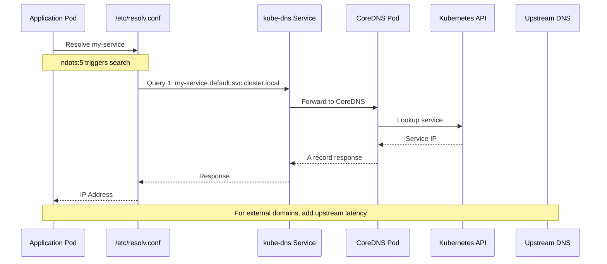
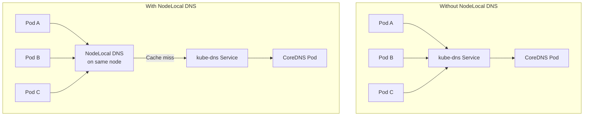
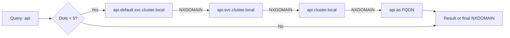
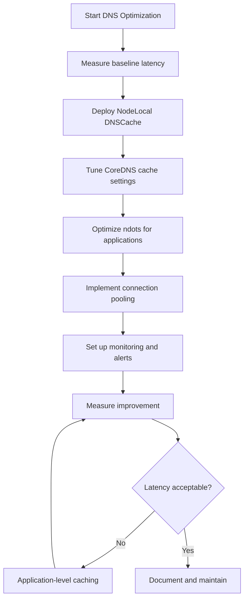

# How to Reduce DNS Latency in High-Traffic Kubernetes Clusters

Author: [nawazdhandala](https://www.github.com/nawazdhandala)

Tags: kubernetes, dns, performance, coredns, nodelocal-dns, optimization, latency

Description: Strategies and techniques to minimize DNS latency and improve performance in high-traffic Kubernetes environments.

---

In high-traffic Kubernetes clusters, DNS can become a significant bottleneck. Every service call, external API request, and database connection requires DNS resolution. This guide covers proven strategies to reduce DNS latency, including caching optimizations, NodeLocal DNSCache, CoreDNS tuning, and application-level improvements.

## Understanding DNS Latency in Kubernetes

Before optimizing, let's understand where DNS latency comes from:



### Common Sources of DNS Latency

| Source | Impact | Typical Latency |
|--------|--------|-----------------|
| Pod to CoreDNS network hop | Medium | 1-5ms |
| CoreDNS processing | Low | <1ms |
| Kubernetes API lookup | Medium | 2-10ms |
| Upstream DNS (external) | High | 10-100ms |
| ndots search iterations | High | Multiplies above |
| Connection setup (UDP/TCP) | Medium | 1-5ms per query |
| CONNTRACK table lookup | Low-High | Varies with load |

### Measuring Current DNS Latency

```bash
# Create a debug pod
kubectl run dns-perf --image=nicolaka/netshoot --rm -it -- bash

# Measure DNS resolution time
for i in {1..10}; do
  dig @10.96.0.10 kubernetes.default.svc.cluster.local +stats | grep "Query time"
done

# Test external DNS
for i in {1..10}; do
  dig @10.96.0.10 google.com +stats | grep "Query time"
done

# Measure with timing
time nslookup my-service.my-namespace.svc.cluster.local
```

## Strategy 1: NodeLocal DNSCache

NodeLocal DNSCache runs a DNS caching agent on each node, dramatically reducing latency by avoiding network hops to CoreDNS pods.



### Installing NodeLocal DNSCache

**Step 1: Get the NodeLocal DNS manifest**

```bash
# Download the manifest
curl -o nodelocaldns.yaml https://raw.githubusercontent.com/kubernetes/kubernetes/master/cluster/addons/dns/nodelocaldns/nodelocaldns.yaml
```

**Step 2: Configure variables**

```bash
# Set your cluster DNS IP (usually 10.96.0.10)
CLUSTER_DNS_IP=$(kubectl get svc kube-dns -n kube-system -o jsonpath='{.spec.clusterIP}')

# Set the local link IP for NodeLocal DNS (standard is 169.254.20.10)
LOCAL_DNS_IP="169.254.20.10"

# Replace placeholders in manifest
sed -i "s/__PILLAR__LOCAL__DNS__/$LOCAL_DNS_IP/g" nodelocaldns.yaml
sed -i "s/__PILLAR__DNS__DOMAIN__/cluster.local/g" nodelocaldns.yaml
sed -i "s/__PILLAR__DNS__SERVER__/$CLUSTER_DNS_IP/g" nodelocaldns.yaml
```

**Step 3: Apply the manifest**

```yaml
apiVersion: v1
kind: ConfigMap
metadata:
  name: node-local-dns
  namespace: kube-system
data:
  Corefile: |
    cluster.local:53 {
        errors
        cache {
            success 9984 30
            denial 9984 5
        }
        reload
        loop
        bind 169.254.20.10
        forward . __PILLAR__CLUSTER__DNS__ {
            force_tcp
        }
        prometheus :9253
        health 169.254.20.10:8080
    }
    in-addr.arpa:53 {
        errors
        cache 30
        reload
        loop
        bind 169.254.20.10
        forward . __PILLAR__CLUSTER__DNS__ {
            force_tcp
        }
        prometheus :9253
    }
    ip6.arpa:53 {
        errors
        cache 30
        reload
        loop
        bind 169.254.20.10
        forward . __PILLAR__CLUSTER__DNS__ {
            force_tcp
        }
        prometheus :9253
    }
    .:53 {
        errors
        cache 30
        reload
        loop
        bind 169.254.20.10
        forward . __PILLAR__UPSTREAM__SERVERS__
        prometheus :9253
    }
---
apiVersion: apps/v1
kind: DaemonSet
metadata:
  name: node-local-dns
  namespace: kube-system
  labels:
    k8s-app: node-local-dns
spec:
  selector:
    matchLabels:
      k8s-app: node-local-dns
  template:
    metadata:
      labels:
        k8s-app: node-local-dns
    spec:
      priorityClassName: system-node-critical
      serviceAccountName: node-local-dns
      hostNetwork: true
      dnsPolicy: Default
      tolerations:
      - key: "CriticalAddonsOnly"
        operator: "Exists"
      - effect: NoExecute
        operator: Exists
      - effect: NoSchedule
        operator: Exists
      containers:
      - name: node-cache
        image: registry.k8s.io/dns/k8s-dns-node-cache:1.22.28
        resources:
          requests:
            cpu: 25m
            memory: 5Mi
          limits:
            memory: 30Mi
        args:
        - -localip
        - "169.254.20.10"
        - -conf
        - /etc/Corefile
        - -upstreamsvc
        - kube-dns-upstream
        ports:
        - containerPort: 53
          name: dns
          protocol: UDP
        - containerPort: 53
          name: dns-tcp
          protocol: TCP
        - containerPort: 9253
          name: metrics
          protocol: TCP
        livenessProbe:
          httpGet:
            host: 169.254.20.10
            path: /health
            port: 8080
          initialDelaySeconds: 60
          timeoutSeconds: 5
        volumeMounts:
        - mountPath: /run/xtables.lock
          name: xtables-lock
          readOnly: false
        - name: config-volume
          mountPath: /etc/coredns
        - name: kube-dns-config
          mountPath: /etc/kube-dns
      volumes:
      - name: xtables-lock
        hostPath:
          path: /run/xtables.lock
          type: FileOrCreate
      - name: kube-dns-config
        configMap:
          name: kube-dns
          optional: true
      - name: config-volume
        configMap:
          name: node-local-dns
```

**Step 4: Update kubelet to use NodeLocal DNS**

For new pods to use NodeLocal DNS, update kubelet's `--cluster-dns` flag:

```bash
# On each node, update kubelet config
# /var/lib/kubelet/config.yaml
clusterDNS:
- 169.254.20.10
```

Or use a ConfigMap for kubelet configuration:

```yaml
apiVersion: kubelet.config.k8s.io/v1beta1
kind: KubeletConfiguration
clusterDNS:
- 169.254.20.10
clusterDomain: cluster.local
```

### Verifying NodeLocal DNSCache

```bash
# Check DaemonSet status
kubectl get ds node-local-dns -n kube-system

# Verify pods are running on all nodes
kubectl get pods -n kube-system -l k8s-app=node-local-dns -o wide

# Test DNS from a pod
kubectl run test-dns --image=busybox --rm -it -- nslookup kubernetes.default

# Check metrics
kubectl port-forward -n kube-system ds/node-local-dns 9253:9253 &
curl http://localhost:9253/metrics | grep coredns_cache
```

## Strategy 2: CoreDNS Tuning

### Increase Cache Size and TTL

```yaml
apiVersion: v1
kind: ConfigMap
metadata:
  name: coredns
  namespace: kube-system
data:
  Corefile: |
    .:53 {
        errors
        health {
            lameduck 5s
        }
        ready
        kubernetes cluster.local in-addr.arpa ip6.arpa {
            pods insecure
            fallthrough in-addr.arpa ip6.arpa
            ttl 60
        }
        prometheus :9153
        forward . /etc/resolv.conf {
            max_concurrent 1000
            prefer_udp
        }
        cache 300 {
            success 9984 300 30
            denial 9984 60 5
            prefetch 10 1m 10%
        }
        loop
        reload
        loadbalance
    }
```

### Cache Configuration Explained

```yaml
cache 300 {
    success 9984 300 30    # Cache successful responses: max 9984 entries, 300s TTL, min 30s
    denial 9984 60 5       # Cache NXDOMAIN: max 9984 entries, 60s TTL, min 5s
    prefetch 10 1m 10%     # Prefetch when TTL < 10s, queried in last 1m, > 10% of TTL remaining
}
```

### Scale CoreDNS Horizontally

```yaml
apiVersion: apps/v1
kind: Deployment
metadata:
  name: coredns
  namespace: kube-system
spec:
  replicas: 4  # Increase based on cluster size
  template:
    spec:
      affinity:
        podAntiAffinity:
          preferredDuringSchedulingIgnoredDuringExecution:
          - weight: 100
            podAffinityTerm:
              labelSelector:
                matchLabels:
                  k8s-app: kube-dns
              topologyKey: kubernetes.io/hostname
      containers:
      - name: coredns
        resources:
          limits:
            memory: 256Mi
            cpu: 200m
          requests:
            memory: 128Mi
            cpu: 100m
```

### CoreDNS Autoscaling

Use the cluster-proportional-autoscaler to scale CoreDNS:

```yaml
apiVersion: apps/v1
kind: Deployment
metadata:
  name: coredns-autoscaler
  namespace: kube-system
spec:
  replicas: 1
  selector:
    matchLabels:
      app: coredns-autoscaler
  template:
    metadata:
      labels:
        app: coredns-autoscaler
    spec:
      containers:
      - name: autoscaler
        image: registry.k8s.io/cpa/cluster-proportional-autoscaler:1.8.9
        command:
        - /cluster-proportional-autoscaler
        - --namespace=kube-system
        - --configmap=coredns-autoscaler
        - --target=Deployment/coredns
        - --default-params={"linear":{"coresPerReplica":256,"nodesPerReplica":16,"min":2,"max":10,"preventSinglePointFailure":true}}
        - --logtostderr=true
        - --v=2
      serviceAccountName: coredns-autoscaler
```

## Strategy 3: Optimize ndots and Search Domains

The default `ndots:5` setting causes multiple DNS queries for short names.



### Pod-Level DNS Optimization

```yaml
apiVersion: v1
kind: Pod
metadata:
  name: optimized-dns-pod
spec:
  containers:
  - name: app
    image: my-app:latest
  dnsPolicy: ClusterFirst
  dnsConfig:
    options:
    - name: ndots
      value: "2"
    - name: single-request-reopen
    - name: timeout
      value: "1"
    - name: attempts
      value: "2"
```

### Deployment-Level DNS Config

```yaml
apiVersion: apps/v1
kind: Deployment
metadata:
  name: my-app
spec:
  template:
    spec:
      dnsPolicy: ClusterFirst
      dnsConfig:
        options:
        - name: ndots
          value: "2"
        - name: single-request-reopen
        searches:
        - my-namespace.svc.cluster.local
        - svc.cluster.local
      containers:
      - name: app
        image: my-app:latest
```

### Using FQDNs in Application Code

Instead of relying on search domains, use fully qualified names:

```python
# Instead of
redis_host = "redis-master"

# Use FQDN
redis_host = "redis-master.cache.svc.cluster.local"
```

```yaml
# Environment variable approach
env:
- name: REDIS_HOST
  value: "redis-master.cache.svc.cluster.local"
- name: DATABASE_HOST
  value: "postgres.database.svc.cluster.local"
```

## Strategy 4: Connection Pooling and DNS Caching in Applications

### Application-Level DNS Caching

**Java/JVM Applications:**

```java
// Set DNS cache TTL (in seconds)
java.security.Security.setProperty("networkaddress.cache.ttl", "60");
java.security.Security.setProperty("networkaddress.cache.negative.ttl", "10");
```

Or via JVM options:

```bash
java -Dsun.net.inetaddr.ttl=60 -Dsun.net.inetaddr.negative.ttl=10 -jar app.jar
```

**Go Applications:**

```go
import (
    "net"
    "time"
)

func init() {
    // Configure DNS resolver
    net.DefaultResolver = &net.Resolver{
        PreferGo: true,
        Dial: func(ctx context.Context, network, address string) (net.Conn, error) {
            d := net.Dialer{
                Timeout: time.Second * 2,
            }
            return d.DialContext(ctx, "udp", "169.254.20.10:53") // Use NodeLocal DNS
        },
    }
}
```

**Node.js Applications:**

```javascript
const dns = require('dns');

// Set DNS result order preference
dns.setDefaultResultOrder('ipv4first');

// Use dns.resolve with caching
const { Resolver } = require('dns').promises;
const resolver = new Resolver();
resolver.setServers(['169.254.20.10']);
```

### HTTP Client Connection Pooling

Reduce DNS lookups by reusing connections:

**Python with requests:**

```python
import requests
from requests.adapters import HTTPAdapter
from urllib3.util.retry import Retry

session = requests.Session()
adapter = HTTPAdapter(
    pool_connections=100,
    pool_maxsize=100,
    max_retries=Retry(total=3, backoff_factor=0.1)
)
session.mount('http://', adapter)
session.mount('https://', adapter)

# Reuse session for all requests
response = session.get('http://my-service.namespace.svc.cluster.local/api')
```

**Go with http.Client:**

```go
import (
    "net/http"
    "time"
)

var httpClient = &http.Client{
    Transport: &http.Transport{
        MaxIdleConns:        100,
        MaxIdleConnsPerHost: 100,
        IdleConnTimeout:     90 * time.Second,
        DisableKeepAlives:   false,
    },
    Timeout: 30 * time.Second,
}

// Reuse httpClient for all requests
resp, err := httpClient.Get("http://my-service.namespace.svc.cluster.local/api")
```

## Strategy 5: Reduce Unnecessary DNS Lookups

### Use IP Addresses for Internal Services When Possible

```yaml
# Instead of using service DNS name
env:
- name: KUBERNETES_SERVICE_HOST
  value: "10.96.0.1"  # Kubernetes API service IP
```

### Headless Services for StatefulSets

For StatefulSets, use headless services to avoid extra DNS hops:

```yaml
apiVersion: v1
kind: Service
metadata:
  name: cassandra
  labels:
    app: cassandra
spec:
  clusterIP: None  # Headless
  selector:
    app: cassandra
  ports:
  - port: 9042
---
apiVersion: apps/v1
kind: StatefulSet
metadata:
  name: cassandra
spec:
  serviceName: cassandra
  replicas: 3
  template:
    spec:
      containers:
      - name: cassandra
        env:
        - name: CASSANDRA_SEEDS
          value: "cassandra-0.cassandra.default.svc.cluster.local"
```

### Precompute and Cache Service IPs

For high-frequency internal calls:

```python
import socket
import time
from functools import lru_cache

@lru_cache(maxsize=100)
def get_service_ip(hostname):
    """Cache DNS resolution results."""
    return socket.gethostbyname(hostname)

# Clear cache periodically
def clear_dns_cache():
    get_service_ip.cache_clear()

# Run cache clear every 5 minutes
import threading
def periodic_cache_clear():
    while True:
        time.sleep(300)
        clear_dns_cache()

threading.Thread(target=periodic_cache_clear, daemon=True).start()
```

## Strategy 6: Monitor and Alert on DNS Performance

### Prometheus Metrics for CoreDNS

```yaml
apiVersion: monitoring.coreos.com/v1
kind: ServiceMonitor
metadata:
  name: coredns
  namespace: monitoring
spec:
  selector:
    matchLabels:
      k8s-app: kube-dns
  namespaceSelector:
    matchNames:
    - kube-system
  endpoints:
  - port: metrics
    interval: 15s
```

### Key Metrics to Monitor

```promql
# DNS query rate
sum(rate(coredns_dns_requests_total[5m])) by (type)

# DNS query latency (p99)
histogram_quantile(0.99, sum(rate(coredns_dns_request_duration_seconds_bucket[5m])) by (le))

# Cache hit ratio
sum(rate(coredns_cache_hits_total[5m])) /
(sum(rate(coredns_cache_hits_total[5m])) + sum(rate(coredns_cache_misses_total[5m])))

# DNS errors
sum(rate(coredns_dns_responses_total{rcode!="NOERROR"}[5m])) by (rcode)

# Forward latency (upstream DNS)
histogram_quantile(0.99, sum(rate(coredns_forward_request_duration_seconds_bucket[5m])) by (le, to))
```

### Alerting Rules

```yaml
groups:
- name: dns-performance
  rules:
  - alert: DNSHighLatency
    expr: |
      histogram_quantile(0.99, sum(rate(coredns_dns_request_duration_seconds_bucket[5m])) by (le)) > 0.1
    for: 5m
    labels:
      severity: warning
    annotations:
      summary: "DNS p99 latency is above 100ms"

  - alert: DNSLowCacheHitRatio
    expr: |
      sum(rate(coredns_cache_hits_total[5m])) /
      (sum(rate(coredns_cache_hits_total[5m])) + sum(rate(coredns_cache_misses_total[5m]))) < 0.8
    for: 10m
    labels:
      severity: warning
    annotations:
      summary: "DNS cache hit ratio below 80%"

  - alert: DNSHighErrorRate
    expr: |
      sum(rate(coredns_dns_responses_total{rcode="SERVFAIL"}[5m])) /
      sum(rate(coredns_dns_responses_total[5m])) > 0.01
    for: 5m
    labels:
      severity: critical
    annotations:
      summary: "DNS SERVFAIL rate above 1%"
```

### Grafana Dashboard Panels

```json
{
  "panels": [
    {
      "title": "DNS Queries per Second",
      "targets": [
        {
          "expr": "sum(rate(coredns_dns_requests_total[1m])) by (type)",
          "legendFormat": "{{type}}"
        }
      ]
    },
    {
      "title": "DNS Latency (p50, p95, p99)",
      "targets": [
        {
          "expr": "histogram_quantile(0.50, sum(rate(coredns_dns_request_duration_seconds_bucket[5m])) by (le))",
          "legendFormat": "p50"
        },
        {
          "expr": "histogram_quantile(0.95, sum(rate(coredns_dns_request_duration_seconds_bucket[5m])) by (le))",
          "legendFormat": "p95"
        },
        {
          "expr": "histogram_quantile(0.99, sum(rate(coredns_dns_request_duration_seconds_bucket[5m])) by (le))",
          "legendFormat": "p99"
        }
      ]
    },
    {
      "title": "Cache Hit Ratio",
      "targets": [
        {
          "expr": "sum(rate(coredns_cache_hits_total[5m])) / (sum(rate(coredns_cache_hits_total[5m])) + sum(rate(coredns_cache_misses_total[5m])))",
          "legendFormat": "Hit Ratio"
        }
      ]
    }
  ]
}
```

## Performance Comparison

| Strategy | Latency Reduction | Implementation Effort | Best For |
|----------|-------------------|----------------------|----------|
| NodeLocal DNSCache | 50-90% | Medium | All clusters |
| CoreDNS Cache Tuning | 20-40% | Low | Quick wins |
| ndots Optimization | 30-60% | Low | External DNS calls |
| Connection Pooling | 40-70% | Medium | HTTP-heavy apps |
| Application DNS Cache | 30-50% | High | Specific apps |

## Implementation Checklist



## Summary

Reducing DNS latency in Kubernetes requires a multi-layered approach:

1. **Infrastructure Level**: Deploy NodeLocal DNSCache to eliminate network hops
2. **CoreDNS Level**: Tune cache settings and scale horizontally
3. **Pod Level**: Optimize ndots and search domains
4. **Application Level**: Implement connection pooling and DNS caching
5. **Monitoring Level**: Track metrics and alert on degradation

Start with NodeLocal DNSCache and CoreDNS tuning for the biggest impact, then progressively optimize at the application level for specific high-traffic services.

Remember that DNS optimization is an ongoing process. As your cluster grows and traffic patterns change, continue monitoring and adjusting your configuration to maintain optimal performance.
