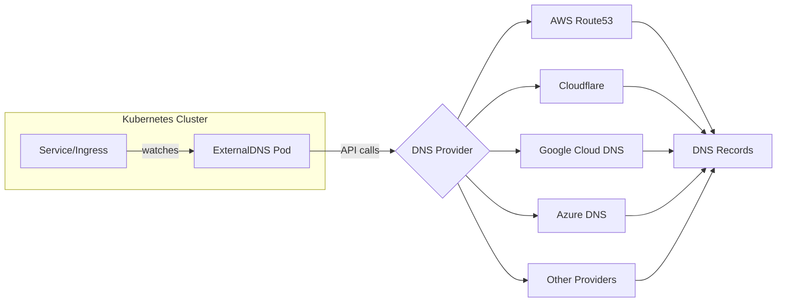
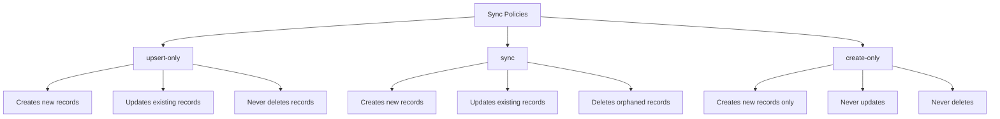
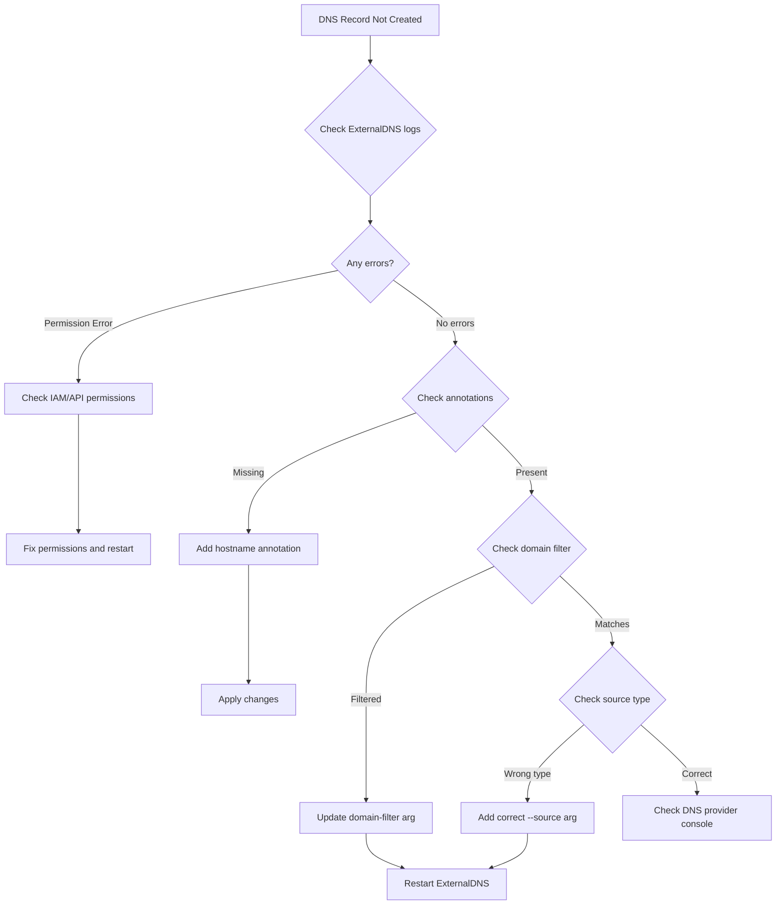

# How to Configure External DNS for Automatic DNS Records in Kubernetes

Author: [nawazdhandala](https://www.github.com/nawazdhandala)

Tags: kubernetes, external-dns, dns, route53, cloudflare, automation, devops

Description: Learn how to automatically manage DNS records for Kubernetes services and ingresses using ExternalDNS with various DNS providers.

---

Managing DNS records manually for Kubernetes services is error-prone and doesn't scale. ExternalDNS automates DNS record management by synchronizing Kubernetes Services and Ingresses with external DNS providers like AWS Route53, Cloudflare, Google Cloud DNS, and more.

## What is ExternalDNS?

ExternalDNS is a Kubernetes add-on that watches for Services and Ingresses with specific annotations and automatically creates, updates, or deletes DNS records in your DNS provider.



### Key Features

- **Automatic DNS management**: Creates records when services are created
- **Multi-provider support**: Works with 30+ DNS providers
- **Sync policies**: Control how records are managed
- **TXT record ownership**: Prevents conflicts with manual records
- **Filtering**: Control which resources create DNS records

## Prerequisites

Before installing ExternalDNS, ensure you have:

1. A running Kubernetes cluster
2. Access to a DNS provider with API access
3. A domain configured in your DNS provider
4. Proper RBAC permissions in your cluster

## Installation Methods

### Method 1: Using Helm (Recommended)

```bash
# Add the external-dns helm repository
helm repo add external-dns https://kubernetes-sigs.github.io/external-dns/

# Update repositories
helm repo update

# Install external-dns (example with AWS)
helm install external-dns external-dns/external-dns \
  --namespace external-dns \
  --create-namespace \
  --set provider=aws \
  --set aws.region=us-east-1 \
  --set domainFilters[0]=example.com \
  --set policy=sync
```

### Method 2: Using Manifests

```yaml
apiVersion: v1
kind: Namespace
metadata:
  name: external-dns
---
apiVersion: v1
kind: ServiceAccount
metadata:
  name: external-dns
  namespace: external-dns
---
apiVersion: rbac.authorization.k8s.io/v1
kind: ClusterRole
metadata:
  name: external-dns
rules:
- apiGroups: [""]
  resources: ["services","endpoints","pods"]
  verbs: ["get","watch","list"]
- apiGroups: ["extensions","networking.k8s.io"]
  resources: ["ingresses"]
  verbs: ["get","watch","list"]
- apiGroups: [""]
  resources: ["nodes"]
  verbs: ["list","watch"]
---
apiVersion: rbac.authorization.k8s.io/v1
kind: ClusterRoleBinding
metadata:
  name: external-dns-viewer
roleRef:
  apiGroup: rbac.authorization.k8s.io
  kind: ClusterRole
  name: external-dns
subjects:
- kind: ServiceAccount
  name: external-dns
  namespace: external-dns
```

## Provider-Specific Configuration

### AWS Route53

#### IAM Policy

Create an IAM policy for ExternalDNS:

```json
{
  "Version": "2012-10-17",
  "Statement": [
    {
      "Effect": "Allow",
      "Action": [
        "route53:ChangeResourceRecordSets"
      ],
      "Resource": [
        "arn:aws:route53:::hostedzone/*"
      ]
    },
    {
      "Effect": "Allow",
      "Action": [
        "route53:ListHostedZones",
        "route53:ListResourceRecordSets",
        "route53:ListTagsForResource"
      ],
      "Resource": [
        "*"
      ]
    }
  ]
}
```

#### ExternalDNS Deployment for Route53

```yaml
apiVersion: apps/v1
kind: Deployment
metadata:
  name: external-dns
  namespace: external-dns
spec:
  replicas: 1
  selector:
    matchLabels:
      app: external-dns
  strategy:
    type: Recreate
  template:
    metadata:
      labels:
        app: external-dns
    spec:
      serviceAccountName: external-dns
      containers:
      - name: external-dns
        image: registry.k8s.io/external-dns/external-dns:v0.14.0
        args:
        - --source=service
        - --source=ingress
        - --provider=aws
        - --aws-zone-type=public
        - --registry=txt
        - --txt-owner-id=my-cluster-id
        - --domain-filter=example.com
        - --policy=sync
        env:
        - name: AWS_DEFAULT_REGION
          value: us-east-1
        # For EKS with IRSA (recommended)
        # - name: AWS_ROLE_ARN
        #   value: arn:aws:iam::ACCOUNT_ID:role/external-dns-role
```

#### Using IRSA (IAM Roles for Service Accounts) on EKS

```bash
# Create IAM OIDC provider for your cluster
eksctl utils associate-iam-oidc-provider \
  --cluster my-cluster \
  --approve

# Create IAM role and service account
eksctl create iamserviceaccount \
  --name external-dns \
  --namespace external-dns \
  --cluster my-cluster \
  --attach-policy-arn arn:aws:iam::ACCOUNT_ID:policy/ExternalDNSPolicy \
  --approve
```

### Cloudflare

#### API Token

Create a Cloudflare API token with the following permissions:
- Zone:Read
- DNS:Edit

#### ExternalDNS Deployment for Cloudflare

```yaml
apiVersion: v1
kind: Secret
metadata:
  name: cloudflare-api-token
  namespace: external-dns
type: Opaque
stringData:
  cloudflare_api_token: "your-api-token-here"
---
apiVersion: apps/v1
kind: Deployment
metadata:
  name: external-dns
  namespace: external-dns
spec:
  replicas: 1
  selector:
    matchLabels:
      app: external-dns
  strategy:
    type: Recreate
  template:
    metadata:
      labels:
        app: external-dns
    spec:
      serviceAccountName: external-dns
      containers:
      - name: external-dns
        image: registry.k8s.io/external-dns/external-dns:v0.14.0
        args:
        - --source=service
        - --source=ingress
        - --provider=cloudflare
        - --cloudflare-proxied
        - --registry=txt
        - --txt-owner-id=my-cluster-id
        - --domain-filter=example.com
        - --policy=sync
        env:
        - name: CF_API_TOKEN
          valueFrom:
            secretKeyRef:
              name: cloudflare-api-token
              key: cloudflare_api_token
```

### Google Cloud DNS

#### Service Account

Create a GCP service account with the `roles/dns.admin` role:

```bash
# Create service account
gcloud iam service-accounts create external-dns \
  --display-name "ExternalDNS service account"

# Grant permissions
gcloud projects add-iam-policy-binding PROJECT_ID \
  --member serviceAccount:external-dns@PROJECT_ID.iam.gserviceaccount.com \
  --role roles/dns.admin

# Create key
gcloud iam service-accounts keys create credentials.json \
  --iam-account external-dns@PROJECT_ID.iam.gserviceaccount.com

# Create Kubernetes secret
kubectl create secret generic external-dns-gcp \
  --namespace external-dns \
  --from-file=credentials.json
```

#### ExternalDNS Deployment for GCP

```yaml
apiVersion: apps/v1
kind: Deployment
metadata:
  name: external-dns
  namespace: external-dns
spec:
  replicas: 1
  selector:
    matchLabels:
      app: external-dns
  strategy:
    type: Recreate
  template:
    metadata:
      labels:
        app: external-dns
    spec:
      serviceAccountName: external-dns
      containers:
      - name: external-dns
        image: registry.k8s.io/external-dns/external-dns:v0.14.0
        args:
        - --source=service
        - --source=ingress
        - --provider=google
        - --google-project=PROJECT_ID
        - --registry=txt
        - --txt-owner-id=my-cluster-id
        - --domain-filter=example.com
        - --policy=sync
        volumeMounts:
        - name: google-credentials
          mountPath: /etc/kubernetes/
          readOnly: true
        env:
        - name: GOOGLE_APPLICATION_CREDENTIALS
          value: /etc/kubernetes/credentials.json
      volumes:
      - name: google-credentials
        secret:
          secretName: external-dns-gcp
```

### Azure DNS

#### Service Principal

```bash
# Create service principal
az ad sp create-for-rbac --name external-dns-sp \
  --role "DNS Zone Contributor" \
  --scopes /subscriptions/SUBSCRIPTION_ID/resourceGroups/RESOURCE_GROUP

# Create secret
kubectl create secret generic azure-config-file \
  --namespace external-dns \
  --from-file=azure.json
```

The `azure.json` file:

```json
{
  "tenantId": "TENANT_ID",
  "subscriptionId": "SUBSCRIPTION_ID",
  "resourceGroup": "RESOURCE_GROUP",
  "aadClientId": "CLIENT_ID",
  "aadClientSecret": "CLIENT_SECRET"
}
```

#### ExternalDNS Deployment for Azure

```yaml
apiVersion: apps/v1
kind: Deployment
metadata:
  name: external-dns
  namespace: external-dns
spec:
  replicas: 1
  selector:
    matchLabels:
      app: external-dns
  template:
    metadata:
      labels:
        app: external-dns
    spec:
      serviceAccountName: external-dns
      containers:
      - name: external-dns
        image: registry.k8s.io/external-dns/external-dns:v0.14.0
        args:
        - --source=service
        - --source=ingress
        - --provider=azure
        - --azure-resource-group=RESOURCE_GROUP
        - --azure-subscription-id=SUBSCRIPTION_ID
        - --registry=txt
        - --txt-owner-id=my-cluster-id
        - --domain-filter=example.com
        - --policy=sync
        volumeMounts:
        - name: azure-config-file
          mountPath: /etc/kubernetes
          readOnly: true
      volumes:
      - name: azure-config-file
        secret:
          secretName: azure-config-file
```

## Using Annotations

ExternalDNS uses annotations to determine which DNS records to create.

### Service Annotations

```yaml
apiVersion: v1
kind: Service
metadata:
  name: my-web-app
  annotations:
    # Basic hostname
    external-dns.alpha.kubernetes.io/hostname: myapp.example.com

    # Multiple hostnames
    external-dns.alpha.kubernetes.io/hostname: myapp.example.com,www.myapp.example.com

    # Set TTL (in seconds)
    external-dns.alpha.kubernetes.io/ttl: "300"

    # Set specific record type
    external-dns.alpha.kubernetes.io/target: "1.2.3.4"

    # Cloudflare-specific: enable proxy
    external-dns.alpha.kubernetes.io/cloudflare-proxied: "true"

    # AWS Route53-specific: set routing policy
    external-dns.alpha.kubernetes.io/set-identifier: "us-east-1"
    external-dns.alpha.kubernetes.io/aws-weight: "100"
spec:
  type: LoadBalancer
  ports:
  - port: 80
    targetPort: 8080
  selector:
    app: my-web-app
```

### Ingress Annotations

```yaml
apiVersion: networking.k8s.io/v1
kind: Ingress
metadata:
  name: my-ingress
  annotations:
    external-dns.alpha.kubernetes.io/hostname: myapp.example.com
    external-dns.alpha.kubernetes.io/ttl: "120"
spec:
  ingressClassName: nginx
  rules:
  - host: myapp.example.com
    http:
      paths:
      - path: /
        pathType: Prefix
        backend:
          service:
            name: my-web-app
            port:
              number: 80
```

### Using Host Field (No Annotation Needed)

ExternalDNS can automatically create records from the `host` field in Ingress:

```yaml
apiVersion: networking.k8s.io/v1
kind: Ingress
metadata:
  name: my-ingress
  # No annotation needed - hostname from spec.rules[].host
spec:
  ingressClassName: nginx
  rules:
  - host: myapp.example.com  # ExternalDNS will create this record
    http:
      paths:
      - path: /
        pathType: Prefix
        backend:
          service:
            name: my-web-app
            port:
              number: 80
```

## Sync Policies

ExternalDNS supports different policies for managing records:



### Policy Configuration

```yaml
# In deployment args
args:
- --policy=sync        # Full sync: create, update, delete
# or
- --policy=upsert-only # Create and update, never delete
# or
- --policy=create-only # Only create, never update or delete
```

### Recommended Policy by Environment

| Environment | Recommended Policy | Reason |
|-------------|-------------------|--------|
| Development | sync | Clean up unused records automatically |
| Staging | sync | Mirror production behavior |
| Production | upsert-only | Prevent accidental deletions |

## Advanced Configuration

### Domain Filtering

Control which domains ExternalDNS manages:

```yaml
args:
# Only manage specific domains
- --domain-filter=example.com
- --domain-filter=example.org

# Exclude specific domains
- --exclude-domains=internal.example.com

# Manage subdomains
- --domain-filter=apps.example.com
```

### Source Filtering

Control which resources create DNS records:

```yaml
args:
# Source types
- --source=service
- --source=ingress
- --source=istio-gateway
- --source=istio-virtualservice

# Namespace filtering
- --namespace=production

# Annotation filter (only process resources with this annotation)
- --annotation-filter=external-dns.alpha.kubernetes.io/enabled=true

# Label selector
- --label-filter=app.kubernetes.io/managed-by=helm
```

### TXT Record Ownership

ExternalDNS uses TXT records to track which records it manages:

```yaml
args:
# Enable TXT registry (default)
- --registry=txt

# Set unique owner ID per cluster
- --txt-owner-id=prod-cluster-us-east-1

# Custom TXT record prefix
- --txt-prefix=externaldns-
```

This creates records like:

```
myapp.example.com.              A     1.2.3.4
externaldns-myapp.example.com.  TXT   "heritage=external-dns,external-dns/owner=prod-cluster-us-east-1"
```

### Multiple Hosted Zones

Handle multiple hosted zones with the same domain:

```yaml
args:
# For AWS: specify zone type
- --aws-zone-type=public  # or private, or leave empty for both

# For multiple zones with same name
- --zone-id-filter=Z1234567890ABC
```

## Complete Example: Multi-Tier Application

Here's a complete example deploying a web application with automatic DNS:

```yaml
# Namespace
apiVersion: v1
kind: Namespace
metadata:
  name: webapp
---
# Application Deployment
apiVersion: apps/v1
kind: Deployment
metadata:
  name: webapp
  namespace: webapp
spec:
  replicas: 3
  selector:
    matchLabels:
      app: webapp
  template:
    metadata:
      labels:
        app: webapp
    spec:
      containers:
      - name: webapp
        image: nginx:alpine
        ports:
        - containerPort: 80
---
# ClusterIP Service
apiVersion: v1
kind: Service
metadata:
  name: webapp
  namespace: webapp
spec:
  selector:
    app: webapp
  ports:
  - port: 80
    targetPort: 80
---
# Ingress with automatic DNS
apiVersion: networking.k8s.io/v1
kind: Ingress
metadata:
  name: webapp
  namespace: webapp
  annotations:
    external-dns.alpha.kubernetes.io/ttl: "300"
    cert-manager.io/cluster-issuer: letsencrypt-prod
spec:
  ingressClassName: nginx
  tls:
  - hosts:
    - webapp.example.com
    - www.webapp.example.com
    secretName: webapp-tls
  rules:
  - host: webapp.example.com
    http:
      paths:
      - path: /
        pathType: Prefix
        backend:
          service:
            name: webapp
            port:
              number: 80
  - host: www.webapp.example.com
    http:
      paths:
      - path: /
        pathType: Prefix
        backend:
          service:
            name: webapp
            port:
              number: 80
```

## Monitoring and Troubleshooting

### Viewing ExternalDNS Logs

```bash
# Follow logs
kubectl logs -f -n external-dns deployment/external-dns

# Check for errors
kubectl logs -n external-dns deployment/external-dns | grep -i error
```

### Common Log Messages

**Successful record creation:**
```
level=info msg="Desired change: CREATE myapp.example.com A [Id: /hostedzone/Z123]"
level=info msg="Record created successfully"
```

**Skipped (already exists):**
```
level=debug msg="Skipping record myapp.example.com because it already exists"
```

**Permission error:**
```
level=error msg="AccessDenied: User is not authorized to perform route53:ChangeResourceRecordSets"
```

### Prometheus Metrics

ExternalDNS exposes Prometheus metrics:

```yaml
# Enable metrics in deployment
args:
- --metrics-address=:7979

# Service for scraping
apiVersion: v1
kind: Service
metadata:
  name: external-dns-metrics
  namespace: external-dns
  labels:
    app: external-dns
spec:
  ports:
  - name: metrics
    port: 7979
    targetPort: 7979
  selector:
    app: external-dns
```

Key metrics to monitor:

| Metric | Description |
|--------|-------------|
| `external_dns_source_endpoints` | Number of endpoints from sources |
| `external_dns_registry_endpoints` | Number of endpoints in registry |
| `external_dns_controller_last_sync_timestamp_seconds` | Last successful sync time |

### Troubleshooting Checklist



### Debugging Commands

```bash
# Check ExternalDNS pod status
kubectl get pods -n external-dns

# Describe for events
kubectl describe deployment external-dns -n external-dns

# Check if service has external IP/hostname
kubectl get svc -n webapp

# Verify Ingress has address
kubectl get ingress -n webapp

# Test DNS resolution
dig myapp.example.com

# Check TXT ownership records
dig TXT externaldns-myapp.example.com
```

## Best Practices

### 1. Use Unique Owner IDs Per Cluster

```yaml
args:
- --txt-owner-id=prod-cluster-us-east-1-abc123
```

### 2. Start with upsert-only in Production

```yaml
args:
- --policy=upsert-only
```

### 3. Use Domain Filters

```yaml
args:
- --domain-filter=apps.example.com
```

### 4. Enable Dry-Run for Testing

```yaml
args:
- --dry-run=true  # Preview changes without applying
```

### 5. Set Appropriate Intervals

```yaml
args:
- --interval=1m        # How often to sync
- --min-event-sync-interval=5s  # Minimum time between syncs
```

### 6. Use RBAC Properly

Only grant necessary permissions to ExternalDNS service account.

## Summary

ExternalDNS automates DNS record management in Kubernetes by:

1. **Watching resources**: Services, Ingresses, and other sources
2. **Extracting hostnames**: From annotations or spec fields
3. **Managing records**: Creating, updating, and optionally deleting DNS records
4. **Tracking ownership**: Using TXT records to prevent conflicts

Key configuration decisions:
- Choose the right **sync policy** for your environment
- Set appropriate **domain filters** to limit scope
- Use **unique owner IDs** per cluster
- Configure proper **authentication** for your DNS provider

With ExternalDNS properly configured, your DNS records will automatically stay in sync with your Kubernetes deployments, eliminating manual DNS management and reducing the risk of configuration drift.
