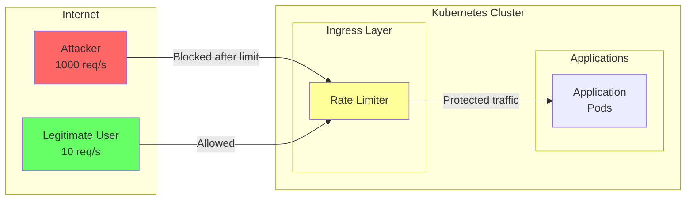
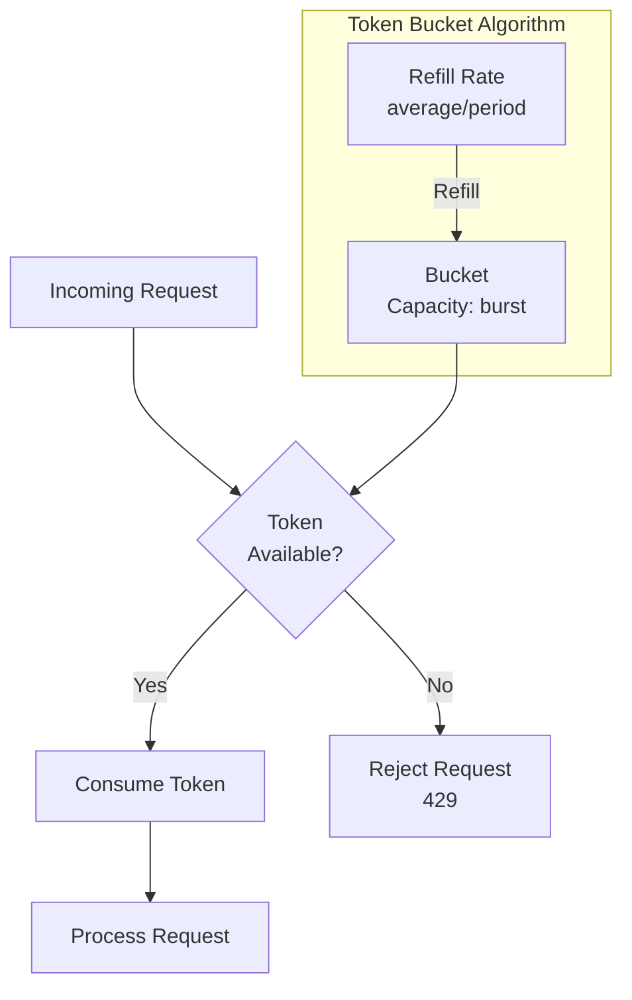

# How to Implement Rate Limiting at the Ingress Level in Kubernetes

Author: [nawazdhandala](https://www.github.com/nawazdhandala)

Tags: kubernetes, ingress, rate-limiting, nginx, traefik, ddos-protection, throttling, security

Description: A practical guide to implementing rate limiting at the Kubernetes ingress level using NGINX annotations, Traefik middleware, and best practices for DDoS protection.

---

## Introduction

Rate limiting is a critical security mechanism that controls the number of requests a client can make to your application within a specified time window. Implementing rate limiting at the ingress level provides a first line of defense against abuse, DDoS attacks, and ensures fair resource allocation among users.

This guide covers rate limiting implementations for both NGINX Ingress Controller and Traefik, along with advanced techniques for comprehensive protection.

## Why Rate Limiting at Ingress Level?



Benefits of ingress-level rate limiting:

1. **Early Protection**: Malicious traffic is blocked before reaching your applications
2. **Resource Efficiency**: Reduces load on backend services
3. **Centralized Control**: Single point of configuration for all services
4. **Cost Savings**: Prevents unnecessary compute resource usage

## Rate Limiting with NGINX Ingress Controller

### Basic Rate Limiting Annotations

NGINX Ingress provides several annotations for rate limiting:

```yaml
# ingress-rate-limit-basic.yaml
apiVersion: networking.k8s.io/v1
kind: Ingress
metadata:
  name: rate-limited-ingress
  namespace: default
  annotations:
    kubernetes.io/ingress.class: nginx
    # Rate limiting annotations
    nginx.ingress.kubernetes.io/limit-rps: "10"
    nginx.ingress.kubernetes.io/limit-rpm: "100"
    nginx.ingress.kubernetes.io/limit-connections: "5"
spec:
  rules:
  - host: api.example.com
    http:
      paths:
      - path: /
        pathType: Prefix
        backend:
          service:
            name: api-service
            port:
              number: 80
```

### Understanding NGINX Rate Limiting Annotations

| Annotation | Description | Example |
|------------|-------------|---------|
| `limit-rps` | Requests per second per IP | `"10"` |
| `limit-rpm` | Requests per minute per IP | `"100"` |
| `limit-connections` | Concurrent connections per IP | `"5"` |
| `limit-rate` | Bandwidth limit per connection (KB/s) | `"100"` |
| `limit-rate-after` | Initial burst before rate limit (KB) | `"1000"` |
| `limit-whitelist` | CIDRs excluded from limiting | `"10.0.0.0/8,192.168.0.0/16"` |

### Comprehensive Rate Limiting Configuration

```yaml
# ingress-rate-limit-full.yaml
apiVersion: networking.k8s.io/v1
kind: Ingress
metadata:
  name: api-ingress
  namespace: default
  annotations:
    kubernetes.io/ingress.class: nginx

    # Request rate limiting
    nginx.ingress.kubernetes.io/limit-rps: "20"
    nginx.ingress.kubernetes.io/limit-rpm: "300"

    # Connection limiting
    nginx.ingress.kubernetes.io/limit-connections: "10"

    # Bandwidth limiting (KB/s)
    nginx.ingress.kubernetes.io/limit-rate: "500"
    nginx.ingress.kubernetes.io/limit-rate-after: "5000"

    # Whitelist internal networks
    nginx.ingress.kubernetes.io/limit-whitelist: "10.0.0.0/8,172.16.0.0/12,192.168.0.0/16"

    # Custom error responses
    nginx.ingress.kubernetes.io/server-snippet: |
      error_page 429 @rate_limit_exceeded;
      location @rate_limit_exceeded {
        return 429 '{"error": "Rate limit exceeded", "retry_after": 60}';
        add_header Content-Type application/json;
      }
spec:
  tls:
  - hosts:
    - api.example.com
    secretName: api-tls
  rules:
  - host: api.example.com
    http:
      paths:
      - path: /
        pathType: Prefix
        backend:
          service:
            name: api-service
            port:
              number: 80
```

### Different Limits for Different Endpoints

```yaml
# ingress-tiered-limits.yaml
# Public API - Strict limits
apiVersion: networking.k8s.io/v1
kind: Ingress
metadata:
  name: public-api-ingress
  namespace: default
  annotations:
    kubernetes.io/ingress.class: nginx
    nginx.ingress.kubernetes.io/limit-rps: "5"
    nginx.ingress.kubernetes.io/limit-rpm: "60"
spec:
  rules:
  - host: api.example.com
    http:
      paths:
      - path: /public
        pathType: Prefix
        backend:
          service:
            name: public-api-service
            port:
              number: 80
---
# Authenticated API - Higher limits
apiVersion: networking.k8s.io/v1
kind: Ingress
metadata:
  name: auth-api-ingress
  namespace: default
  annotations:
    kubernetes.io/ingress.class: nginx
    nginx.ingress.kubernetes.io/limit-rps: "50"
    nginx.ingress.kubernetes.io/limit-rpm: "1000"
spec:
  rules:
  - host: api.example.com
    http:
      paths:
      - path: /v1
        pathType: Prefix
        backend:
          service:
            name: authenticated-api-service
            port:
              number: 80
---
# Internal API - No limits
apiVersion: networking.k8s.io/v1
kind: Ingress
metadata:
  name: internal-api-ingress
  namespace: default
  annotations:
    kubernetes.io/ingress.class: nginx
    nginx.ingress.kubernetes.io/limit-whitelist: "10.0.0.0/8"
spec:
  rules:
  - host: api.example.com
    http:
      paths:
      - path: /internal
        pathType: Prefix
        backend:
          service:
            name: internal-api-service
            port:
              number: 80
```

### Global Rate Limiting via ConfigMap

Configure cluster-wide default rate limits:

```yaml
# nginx-configmap.yaml
apiVersion: v1
kind: ConfigMap
metadata:
  name: ingress-nginx-controller
  namespace: ingress-nginx
data:
  # Global rate limiting zone
  limit-req-status-code: "429"

  # Custom NGINX configuration
  http-snippet: |
    # Define rate limiting zones
    limit_req_zone $binary_remote_addr zone=general:10m rate=10r/s;
    limit_req_zone $binary_remote_addr zone=api:10m rate=50r/s;
    limit_req_zone $binary_remote_addr zone=login:10m rate=1r/s;

    # Connection limiting
    limit_conn_zone $binary_remote_addr zone=addr:10m;

  # Server snippet for all servers
  server-snippet: |
    # Apply general rate limit
    limit_req zone=general burst=20 nodelay;
    limit_conn addr 10;
```

### Advanced NGINX Rate Limiting with Lua

For more complex rate limiting logic, use the Lua module:

```yaml
# ingress-lua-ratelimit.yaml
apiVersion: networking.k8s.io/v1
kind: Ingress
metadata:
  name: advanced-rate-limit
  namespace: default
  annotations:
    kubernetes.io/ingress.class: nginx
    nginx.ingress.kubernetes.io/configuration-snippet: |
      # Rate limit by API key from header
      set $api_key $http_x_api_key;
      if ($api_key = "") {
        set $api_key $binary_remote_addr;
      }

      # Different zones for different client types
      set $limit_key $api_key;

    nginx.ingress.kubernetes.io/server-snippet: |
      location @rate_limited {
        default_type application/json;
        return 429 '{"error":"Too Many Requests","message":"Rate limit exceeded. Please retry after some time.","retry_after":60}';
      }
spec:
  rules:
  - host: api.example.com
    http:
      paths:
      - path: /
        pathType: Prefix
        backend:
          service:
            name: api-service
            port:
              number: 80
```

## Rate Limiting with Traefik

### Basic Rate Limit Middleware

```yaml
# traefik-ratelimit-basic.yaml
apiVersion: traefik.io/v1alpha1
kind: Middleware
metadata:
  name: rate-limit
  namespace: default
spec:
  rateLimit:
    average: 100
    burst: 50
```

### Understanding Traefik Rate Limiting

Traefik's rate limiting uses the token bucket algorithm:

- **average**: Number of requests allowed per second (refill rate)
- **burst**: Maximum number of requests allowed in a burst
- **period**: Time period for the average (default: 1s)



### Comprehensive Traefik Rate Limiting

```yaml
# traefik-ratelimit-full.yaml
apiVersion: traefik.io/v1alpha1
kind: Middleware
metadata:
  name: rate-limit-strict
  namespace: default
spec:
  rateLimit:
    # 10 requests per second average
    average: 10
    # Allow burst of up to 20 requests
    burst: 20
    # Time period (default 1s)
    period: 1s
    # Source criterion for rate limiting
    sourceCriterion:
      # Use client IP
      ipStrategy:
        depth: 1
        excludedIPs:
          - "10.0.0.0/8"
          - "172.16.0.0/12"
          - "192.168.0.0/16"
---
apiVersion: traefik.io/v1alpha1
kind: Middleware
metadata:
  name: rate-limit-by-header
  namespace: default
spec:
  rateLimit:
    average: 100
    burst: 200
    sourceCriterion:
      requestHeaderName: X-API-Key
---
apiVersion: traefik.io/v1alpha1
kind: Middleware
metadata:
  name: rate-limit-by-host
  namespace: default
spec:
  rateLimit:
    average: 50
    burst: 100
    sourceCriterion:
      requestHost: true
```

### Applying Rate Limit to IngressRoute

```yaml
# traefik-ingressroute-ratelimit.yaml
apiVersion: traefik.io/v1alpha1
kind: IngressRoute
metadata:
  name: api-ingressroute
  namespace: default
spec:
  entryPoints:
    - websecure
  routes:
    - match: Host(`api.example.com`)
      kind: Rule
      middlewares:
        - name: rate-limit-strict
      services:
        - name: api-service
          port: 80
  tls:
    secretName: api-tls
```

### Tiered Rate Limiting with Traefik

```yaml
# traefik-tiered-ratelimit.yaml
# Free tier - 10 req/s
apiVersion: traefik.io/v1alpha1
kind: Middleware
metadata:
  name: rate-limit-free
  namespace: default
spec:
  rateLimit:
    average: 10
    burst: 20
    sourceCriterion:
      ipStrategy:
        depth: 1
---
# Basic tier - 50 req/s
apiVersion: traefik.io/v1alpha1
kind: Middleware
metadata:
  name: rate-limit-basic
  namespace: default
spec:
  rateLimit:
    average: 50
    burst: 100
    sourceCriterion:
      requestHeaderName: X-API-Key
---
# Premium tier - 200 req/s
apiVersion: traefik.io/v1alpha1
kind: Middleware
metadata:
  name: rate-limit-premium
  namespace: default
spec:
  rateLimit:
    average: 200
    burst: 400
    sourceCriterion:
      requestHeaderName: X-API-Key
---
# Route configuration
apiVersion: traefik.io/v1alpha1
kind: IngressRoute
metadata:
  name: tiered-api
  namespace: default
spec:
  entryPoints:
    - websecure
  routes:
    # Premium tier route
    - match: Host(`api.example.com`) && HeadersRegexp(`X-Tier`, `premium`)
      kind: Rule
      middlewares:
        - name: rate-limit-premium
      services:
        - name: api-service
          port: 80

    # Basic tier route
    - match: Host(`api.example.com`) && HeadersRegexp(`X-Tier`, `basic`)
      kind: Rule
      middlewares:
        - name: rate-limit-basic
      services:
        - name: api-service
          port: 80

    # Free tier (default)
    - match: Host(`api.example.com`)
      kind: Rule
      middlewares:
        - name: rate-limit-free
      services:
        - name: api-service
          port: 80
```

### In-Flight Request Limiting

```yaml
# traefik-inflight-limit.yaml
apiVersion: traefik.io/v1alpha1
kind: Middleware
metadata:
  name: inflight-limit
  namespace: default
spec:
  inFlightReq:
    amount: 100
    sourceCriterion:
      ipStrategy:
        depth: 1
---
apiVersion: traefik.io/v1alpha1
kind: IngressRoute
metadata:
  name: limited-app
  namespace: default
spec:
  entryPoints:
    - websecure
  routes:
    - match: Host(`app.example.com`)
      kind: Rule
      middlewares:
        - name: rate-limit-strict
        - name: inflight-limit
      services:
        - name: app-service
          port: 80
```

## Connection Limiting

### NGINX Connection Limits

```yaml
# nginx-connection-limit.yaml
apiVersion: networking.k8s.io/v1
kind: Ingress
metadata:
  name: connection-limited
  namespace: default
  annotations:
    kubernetes.io/ingress.class: nginx
    # Limit concurrent connections per IP
    nginx.ingress.kubernetes.io/limit-connections: "10"
    # Custom configuration for connection limiting
    nginx.ingress.kubernetes.io/configuration-snippet: |
      limit_conn_status 429;
      limit_conn_log_level warn;
spec:
  rules:
  - host: app.example.com
    http:
      paths:
      - path: /
        pathType: Prefix
        backend:
          service:
            name: app-service
            port:
              number: 80
```

### Global Connection Limits

```yaml
# nginx-global-connection-limit.yaml
apiVersion: v1
kind: ConfigMap
metadata:
  name: ingress-nginx-controller
  namespace: ingress-nginx
data:
  # Define connection limit zone
  http-snippet: |
    limit_conn_zone $binary_remote_addr zone=perip:10m;
    limit_conn_zone $server_name zone=perserver:10m;

  # Apply limits
  server-snippet: |
    limit_conn perip 20;
    limit_conn perserver 1000;
    limit_conn_status 429;
```

## DDoS Protection Basics

### Layer 7 DDoS Protection

```yaml
# ddos-protection.yaml
apiVersion: networking.k8s.io/v1
kind: Ingress
metadata:
  name: ddos-protected
  namespace: default
  annotations:
    kubernetes.io/ingress.class: nginx

    # Aggressive rate limiting
    nginx.ingress.kubernetes.io/limit-rps: "10"
    nginx.ingress.kubernetes.io/limit-connections: "5"

    # Connection timeouts
    nginx.ingress.kubernetes.io/proxy-connect-timeout: "5"
    nginx.ingress.kubernetes.io/proxy-read-timeout: "10"
    nginx.ingress.kubernetes.io/proxy-send-timeout: "10"

    # Request body limits
    nginx.ingress.kubernetes.io/proxy-body-size: "1m"

    # Buffer limits
    nginx.ingress.kubernetes.io/proxy-buffer-size: "4k"
    nginx.ingress.kubernetes.io/proxy-buffers-number: "4"

    # Block common attack patterns
    nginx.ingress.kubernetes.io/configuration-snippet: |
      # Block requests without User-Agent
      if ($http_user_agent = "") {
        return 444;
      }

      # Block requests with suspicious User-Agents
      if ($http_user_agent ~* (bot|crawler|spider|scraper)) {
        set $block_ua 1;
      }

      # Allow legitimate bots
      if ($http_user_agent ~* (googlebot|bingbot|yandex)) {
        set $block_ua 0;
      }

      # Rate limit suspicious requests
      limit_req zone=general burst=5 nodelay;
spec:
  rules:
  - host: protected.example.com
    http:
      paths:
      - path: /
        pathType: Prefix
        backend:
          service:
            name: protected-service
            port:
              number: 80
```

### Comprehensive DDoS Protection with Traefik

```yaml
# traefik-ddos-protection.yaml
# Rate limiting
apiVersion: traefik.io/v1alpha1
kind: Middleware
metadata:
  name: ddos-ratelimit
  namespace: default
spec:
  rateLimit:
    average: 50
    burst: 100
    sourceCriterion:
      ipStrategy:
        depth: 2
---
# In-flight request limiting
apiVersion: traefik.io/v1alpha1
kind: Middleware
metadata:
  name: ddos-inflight
  namespace: default
spec:
  inFlightReq:
    amount: 50
    sourceCriterion:
      ipStrategy:
        depth: 2
---
# Request body limiting
apiVersion: traefik.io/v1alpha1
kind: Middleware
metadata:
  name: ddos-buffering
  namespace: default
spec:
  buffering:
    maxRequestBodyBytes: 1048576
    memRequestBodyBytes: 1048576
    maxResponseBodyBytes: 10485760
    memResponseBodyBytes: 1048576
    retryExpression: "IsNetworkError() && Attempts() < 2"
---
# Security headers
apiVersion: traefik.io/v1alpha1
kind: Middleware
metadata:
  name: ddos-headers
  namespace: default
spec:
  headers:
    customResponseHeaders:
      X-RateLimit-Limit: "50"
---
# Chain all DDoS protection middlewares
apiVersion: traefik.io/v1alpha1
kind: Middleware
metadata:
  name: ddos-protection-chain
  namespace: default
spec:
  chain:
    middlewares:
      - name: ddos-ratelimit
      - name: ddos-inflight
      - name: ddos-buffering
      - name: ddos-headers
---
apiVersion: traefik.io/v1alpha1
kind: IngressRoute
metadata:
  name: ddos-protected-app
  namespace: default
spec:
  entryPoints:
    - websecure
  routes:
    - match: Host(`app.example.com`)
      kind: Rule
      middlewares:
        - name: ddos-protection-chain
      services:
        - name: app-service
          port: 80
```

### IP Blacklisting/Whitelisting

#### NGINX IP Access Control

```yaml
# nginx-ip-access.yaml
apiVersion: networking.k8s.io/v1
kind: Ingress
metadata:
  name: ip-controlled
  namespace: default
  annotations:
    kubernetes.io/ingress.class: nginx
    # Whitelist specific IPs (deny all others)
    nginx.ingress.kubernetes.io/whitelist-source-range: "10.0.0.0/8,192.168.1.0/24,203.0.113.50"
spec:
  rules:
  - host: admin.example.com
    http:
      paths:
      - path: /
        pathType: Prefix
        backend:
          service:
            name: admin-service
            port:
              number: 80
---
# Blacklist specific IPs
apiVersion: networking.k8s.io/v1
kind: Ingress
metadata:
  name: ip-blocked
  namespace: default
  annotations:
    kubernetes.io/ingress.class: nginx
    nginx.ingress.kubernetes.io/configuration-snippet: |
      # Block known bad IPs
      deny 192.0.2.1;
      deny 198.51.100.0/24;
      deny 203.0.113.0/24;
      allow all;
spec:
  rules:
  - host: api.example.com
    http:
      paths:
      - path: /
        pathType: Prefix
        backend:
          service:
            name: api-service
            port:
              number: 80
```

#### Traefik IP Access Control

```yaml
# traefik-ip-access.yaml
apiVersion: traefik.io/v1alpha1
kind: Middleware
metadata:
  name: ip-whitelist
  namespace: default
spec:
  ipWhiteList:
    sourceRange:
      - "10.0.0.0/8"
      - "172.16.0.0/12"
      - "192.168.0.0/16"
    ipStrategy:
      depth: 2
---
apiVersion: traefik.io/v1alpha1
kind: Middleware
metadata:
  name: ip-whitelist-admin
  namespace: default
spec:
  ipWhiteList:
    sourceRange:
      - "203.0.113.50/32"
      - "198.51.100.0/24"
---
apiVersion: traefik.io/v1alpha1
kind: IngressRoute
metadata:
  name: admin-panel
  namespace: default
spec:
  entryPoints:
    - websecure
  routes:
    - match: Host(`admin.example.com`)
      kind: Rule
      middlewares:
        - name: ip-whitelist-admin
      services:
        - name: admin-service
          port: 80
```

## Monitoring and Alerting

### Prometheus Metrics for Rate Limiting

```yaml
# prometheus-rules.yaml
apiVersion: monitoring.coreos.com/v1
kind: PrometheusRule
metadata:
  name: ingress-rate-limit-alerts
  namespace: monitoring
spec:
  groups:
  - name: ingress-rate-limits
    rules:
    # Alert on high rate of 429 responses
    - alert: HighRateLimitResponses
      expr: |
        sum(rate(nginx_ingress_controller_requests{status="429"}[5m])) by (ingress)
        / sum(rate(nginx_ingress_controller_requests[5m])) by (ingress) > 0.1
      for: 5m
      labels:
        severity: warning
      annotations:
        summary: "High rate limit responses for {{ $labels.ingress }}"
        description: "More than 10% of requests are being rate limited"

    # Alert on sudden traffic spike
    - alert: TrafficSpike
      expr: |
        sum(rate(nginx_ingress_controller_requests[5m])) by (ingress)
        > 2 * sum(rate(nginx_ingress_controller_requests[1h])) by (ingress)
      for: 5m
      labels:
        severity: warning
      annotations:
        summary: "Traffic spike detected for {{ $labels.ingress }}"
        description: "Current traffic is 2x the hourly average"
```

### Grafana Dashboard Query Examples

```promql
# Rate limited requests per second
sum(rate(nginx_ingress_controller_requests{status="429"}[5m])) by (ingress)

# Percentage of rate limited requests
sum(rate(nginx_ingress_controller_requests{status="429"}[5m])) by (ingress)
/ sum(rate(nginx_ingress_controller_requests[5m])) by (ingress) * 100

# Top IPs being rate limited (requires custom logging)
topk(10, sum(rate(nginx_ingress_controller_request_duration_seconds_count{status="429"}[5m])) by (remote_addr))
```

### Logging Rate Limited Requests

```yaml
# nginx-logging-config.yaml
apiVersion: v1
kind: ConfigMap
metadata:
  name: ingress-nginx-controller
  namespace: ingress-nginx
data:
  # Custom log format for rate limiting analysis
  log-format-upstream: |
    {"time": "$time_iso8601", "remote_addr": "$remote_addr",
     "x_forwarded_for": "$proxy_add_x_forwarded_for",
     "request_id": "$req_id", "remote_user": "$remote_user",
     "bytes_sent": $bytes_sent, "request_time": $request_time,
     "status": $status, "host": "$host", "request_proto": "$server_protocol",
     "path": "$uri", "request_query": "$args", "request_length": $request_length,
     "method": "$request_method", "http_referrer": "$http_referer",
     "http_user_agent": "$http_user_agent", "rate_limited": "$limit_req_status"}
```

## Testing Rate Limits

### Using curl

```bash
# Simple rate limit test
for i in {1..100}; do
  curl -s -o /dev/null -w "%{http_code}\n" https://api.example.com/test
done | sort | uniq -c

# Test with timing
for i in {1..50}; do
  echo "Request $i: $(curl -s -o /dev/null -w "%{http_code} %{time_total}s" https://api.example.com/test)"
  sleep 0.1
done
```

### Using Apache Bench

```bash
# 1000 requests, 10 concurrent
ab -n 1000 -c 10 https://api.example.com/test

# With custom headers
ab -n 1000 -c 10 -H "X-API-Key: test-key" https://api.example.com/test
```

### Using hey (HTTP load generator)

```bash
# Install hey
go install github.com/rakyll/hey@latest

# Run load test
hey -n 1000 -c 50 -q 100 https://api.example.com/test

# With rate limiting
hey -n 1000 -c 10 -q 20 https://api.example.com/test
```

### Using k6

```javascript
// k6-rate-limit-test.js
import http from 'k6/http';
import { check, sleep } from 'k6';
import { Rate } from 'k6/metrics';

const rateLimitedRate = new Rate('rate_limited');

export const options = {
  stages: [
    { duration: '30s', target: 50 },
    { duration: '1m', target: 100 },
    { duration: '30s', target: 0 },
  ],
};

export default function () {
  const res = http.get('https://api.example.com/test');

  rateLimitedRate.add(res.status === 429);

  check(res, {
    'status is not 429': (r) => r.status !== 429,
    'status is 200': (r) => r.status === 200,
  });

  sleep(0.1);
}
```

Run the test:

```bash
k6 run k6-rate-limit-test.js
```

## Troubleshooting

### Common Issues

#### Rate Limits Not Applied

```bash
# Check if annotations are recognized
kubectl describe ingress rate-limited-ingress -n default

# Verify NGINX configuration
kubectl exec -n ingress-nginx -it $(kubectl get pods -n ingress-nginx -l app.kubernetes.io/component=controller -o jsonpath='{.items[0].metadata.name}') -- nginx -T | grep limit_req

# Check NGINX logs
kubectl logs -n ingress-nginx -l app.kubernetes.io/component=controller | grep -i "limit"
```

#### Incorrect Client IP Detection

```bash
# Check X-Forwarded-For handling
kubectl describe configmap ingress-nginx-controller -n ingress-nginx

# Verify proxy settings
kubectl get configmap ingress-nginx-controller -n ingress-nginx -o yaml | grep -i "forwarded\|real"
```

Configure correct IP detection:

```yaml
# nginx-real-ip.yaml
apiVersion: v1
kind: ConfigMap
metadata:
  name: ingress-nginx-controller
  namespace: ingress-nginx
data:
  use-forwarded-headers: "true"
  forwarded-for-header: "X-Forwarded-For"
  compute-full-forwarded-for: "true"
  # Trust load balancer IPs
  proxy-real-ip-cidr: "10.0.0.0/8,172.16.0.0/12,192.168.0.0/16"
```

#### Traefik Rate Limit Not Working

```bash
# Check middleware is applied
kubectl describe ingressroute api-ingressroute -n default

# Verify middleware exists
kubectl get middleware -n default

# Check Traefik logs
kubectl logs -n traefik -l app.kubernetes.io/name=traefik | grep -i "rate\|limit"
```

## Best Practices

### 1. Start Conservative, Adjust Based on Data

```yaml
# Start with conservative limits
nginx.ingress.kubernetes.io/limit-rps: "5"
nginx.ingress.kubernetes.io/limit-rpm: "100"

# Monitor and adjust based on actual usage patterns
```

### 2. Use Appropriate Rate Limit Keys

```yaml
# For APIs: Use API key
sourceCriterion:
  requestHeaderName: X-API-Key

# For web apps: Use IP with depth for proxy handling
sourceCriterion:
  ipStrategy:
    depth: 2
```

### 3. Implement Graceful Degradation

```yaml
# Return informative error responses
nginx.ingress.kubernetes.io/server-snippet: |
  error_page 429 @rate_limit;
  location @rate_limit {
    default_type application/json;
    return 429 '{"error":"rate_limit_exceeded","retry_after":60,"message":"Too many requests. Please slow down."}';
  }
```

### 4. Whitelist Trusted Sources

```yaml
# Always whitelist internal networks and monitoring
nginx.ingress.kubernetes.io/limit-whitelist: "10.0.0.0/8,monitoring-ip"
```

### 5. Document Rate Limits in API Responses

```yaml
# Add rate limit headers
nginx.ingress.kubernetes.io/configuration-snippet: |
  add_header X-RateLimit-Limit 100 always;
  add_header X-RateLimit-Remaining $limit_req_status always;
```

## Conclusion

Implementing rate limiting at the ingress level is essential for protecting your Kubernetes applications from abuse and ensuring fair resource allocation. Key takeaways:

- **NGINX Ingress** offers simple annotation-based rate limiting suitable for most use cases
- **Traefik** provides flexible middleware-based rate limiting with advanced source criteria
- **Combine multiple strategies**: Rate limiting, connection limiting, and IP access control
- **Monitor and alert** on rate limit metrics to detect attacks and adjust limits
- **Test thoroughly** before deploying to production

By implementing these rate limiting strategies, you create a robust first line of defense that protects your applications while ensuring legitimate users have reliable access to your services.
